cola Report for GDS4906
==================

**Date**: 2019-12-25 21:54:24 CET, **cola version**: 1.3.2

----------------------------------------------------------------

<style type='text/css'>

body, td, th {
   font-family: Arial,Helvetica,sans-serif;
   background-color: white;
   font-size: 13px;
  max-width: 800px;
  margin: auto;
  margin-left:210px;
  padding: 0px 10px 0px 10px;
  border-left: 1px solid #EEEEEE;
  line-height: 150%;
}

tt, code, pre {
   font-family: 'DejaVu Sans Mono', 'Droid Sans Mono', 'Lucida Console', Consolas, Monaco, 

monospace;
}

h1 {
   font-size:2.2em;
}

h2 {
   font-size:1.8em;
}

h3 {
   font-size:1.4em;
}

h4 {
   font-size:1.0em;
}

h5 {
   font-size:0.9em;
}

h6 {
   font-size:0.8em;
}

a {
  text-decoration: none;
  color: #0366d6;
}

a:hover {
  text-decoration: underline;
}

a:visited {
   color: #0366d6;
}

pre, img {
  max-width: 100%;
}
pre {
  overflow-x: auto;
}
pre code {
   display: block; padding: 0.5em;
}

code {
  font-size: 92%;
  border: 1px solid #ccc;
}

code[class] {
  background-color: #F8F8F8;
}

table, td, th {
  border: 1px solid #ccc;
}

blockquote {
   color:#666666;
   margin:0;
   padding-left: 1em;
   border-left: 0.5em #EEE solid;
}

hr {
   height: 0px;
   border-bottom: none;
   border-top-width: thin;
   border-top-style: dotted;
   border-top-color: #999999;
}

@media print {
   * {
      background: transparent !important;
      color: black !important;
      filter:none !important;
      -ms-filter: none !important;
   }

   body {
      font-size:12pt;
      max-width:100%;
   }

   a, a:visited {
      text-decoration: underline;
   }

   hr {
      visibility: hidden;
      page-break-before: always;
   }

   pre, blockquote {
      padding-right: 1em;
      page-break-inside: avoid;
   }

   tr, img {
      page-break-inside: avoid;
   }

   img {
      max-width: 100% !important;
   }

   @page :left {
      margin: 15mm 20mm 15mm 10mm;
   }

   @page :right {
      margin: 15mm 10mm 15mm 20mm;
   }

   p, h2, h3 {
      orphans: 3; widows: 3;
   }

   h2, h3 {
      page-break-after: avoid;
   }
}
</style>


## Summary


All available functions which can be applied to this `res_list` object:


```r
res_list
```

```
#> A 'ConsensusPartitionList' object with 24 methods.
#>   On a matrix with 51941 rows and 54 columns.
#>   Top rows are extracted by 'SD, CV, MAD, ATC' methods.
#>   Subgroups are detected by 'hclust, kmeans, skmeans, pam, mclust, NMF' method.
#>   Number of partitions are tried for k = 2, 3, 4, 5, 6.
#>   Performed in total 30000 partitions by row resampling.
#> 
#> Following methods can be applied to this 'ConsensusPartitionList' object:
#>  [1] "cola_report"           "collect_classes"       "collect_plots"         "collect_stats"        
#>  [5] "colnames"              "functional_enrichment" "get_anno_col"          "get_anno"             
#>  [9] "get_classes"           "get_matrix"            "get_membership"        "get_stats"            
#> [13] "is_best_k"             "is_stable_k"           "ncol"                  "nrow"                 
#> [17] "rownames"              "show"                  "suggest_best_k"        "test_to_known_factors"
#> [21] "top_rows_heatmap"      "top_rows_overlap"     
#> 
#> You can get result for a single method by, e.g. object["SD", "hclust"] or object["SD:hclust"]
#> or a subset of methods by object[c("SD", "CV")], c("hclust", "kmeans")]
```

The call of `run_all_consensus_partition_methods()` was:


```
#> run_all_consensus_partition_methods(data = mat, mc.cores = 4, anno = anno)
```

Dimension of the input matrix:


```r
mat = get_matrix(res_list)
dim(mat)
```

```
#> [1] 51941    54
```

### Density distribution

The density distribution for each sample is visualized as in one column in the
following heatmap. The clustering is based on the distance which is the
Kolmogorov-Smirnov statistic between two distributions.


```r
library(ComplexHeatmap)
densityHeatmap(mat, top_annotation = HeatmapAnnotation(df = get_anno(res_list), 
    col = get_anno_col(res_list)), ylab = "value", cluster_columns = TRUE, show_column_names = FALSE,
    mc.cores = 4)
```

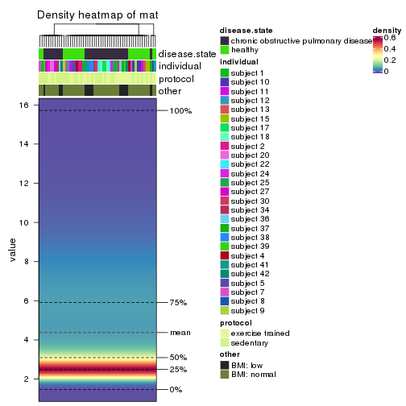


### Suggest the best k


Folowing table shows the best `k` (number of partitions) for each combination
of top-value methods and partition methods. Clicking on the method name in
the table goes to the section for a single combination of methods.

[The cola vignette](http://bioconductor.org/packages/devel/bioc/vignettes/cola/inst/doc/cola.html#toc_13)
explains the definition of the metrics used for determining the best
number of partitions.


```r
suggest_best_k(res_list)
```


|                            | The best k| 1-PAC| Mean silhouette| Concordance|   |Optional k |
|:---------------------------|----------:|-----:|---------------:|-----------:|:--|:----------|
|[SD:skmeans](#SD-skmeans)   |          2| 1.000|           0.958|       0.983|** |           |
|[CV:skmeans](#CV-skmeans)   |          2| 1.000|           0.951|       0.980|** |           |
|[MAD:skmeans](#MAD-skmeans) |          2| 1.000|           0.959|       0.984|** |           |
|[ATC:skmeans](#ATC-skmeans) |          3| 1.000|           0.953|       0.982|** |2          |
|[ATC:mclust](#ATC-mclust)   |          3| 0.971|           0.927|       0.973|** |           |
|[SD:kmeans](#SD-kmeans)     |          2| 0.961|           0.916|       0.957|** |           |
|[MAD:kmeans](#MAD-kmeans)   |          2| 0.961|           0.919|       0.962|** |           |
|[CV:NMF](#CV-NMF)           |          2| 0.957|           0.952|       0.977|** |           |
|[CV:pam](#CV-pam)           |          3| 0.937|           0.894|       0.942|*  |2          |
|[CV:kmeans](#CV-kmeans)     |          2| 0.930|           0.923|       0.946|*  |           |
|[SD:NMF](#SD-NMF)           |          2| 0.917|           0.951|       0.977|*  |           |
|[SD:pam](#SD-pam)           |          6| 0.912|           0.850|       0.936|*  |4          |
|[MAD:pam](#MAD-pam)         |          4| 0.911|           0.902|       0.957|*  |           |
|[ATC:kmeans](#ATC-kmeans)   |          3| 0.889|           0.893|       0.956|   |           |
|[ATC:NMF](#ATC-NMF)         |          2| 0.885|           0.931|       0.969|   |           |
|[MAD:NMF](#MAD-NMF)         |          2| 0.884|           0.927|       0.969|   |           |
|[SD:mclust](#SD-mclust)     |          4| 0.853|           0.851|       0.928|   |           |
|[ATC:pam](#ATC-pam)         |          3| 0.828|           0.910|       0.961|   |           |
|[CV:mclust](#CV-mclust)     |          4| 0.820|           0.836|       0.926|   |           |
|[MAD:mclust](#MAD-mclust)   |          4| 0.570|           0.698|       0.832|   |           |
|[ATC:hclust](#ATC-hclust)   |          2| 0.439|           0.700|       0.864|   |           |
|[SD:hclust](#SD-hclust)     |          3| 0.279|           0.688|       0.807|   |           |
|[MAD:hclust](#MAD-hclust)   |          3| 0.235|           0.676|       0.807|   |           |
|[CV:hclust](#CV-hclust)     |          3| 0.216|           0.614|       0.774|   |           |

\*\*: 1-PAC > 0.95, \*: 1-PAC > 0.9


### CDF of consensus matrices

Cumulative distribution function curves of consensus matrix for all methods.


```r
collect_plots(res_list, fun = plot_ecdf)
```

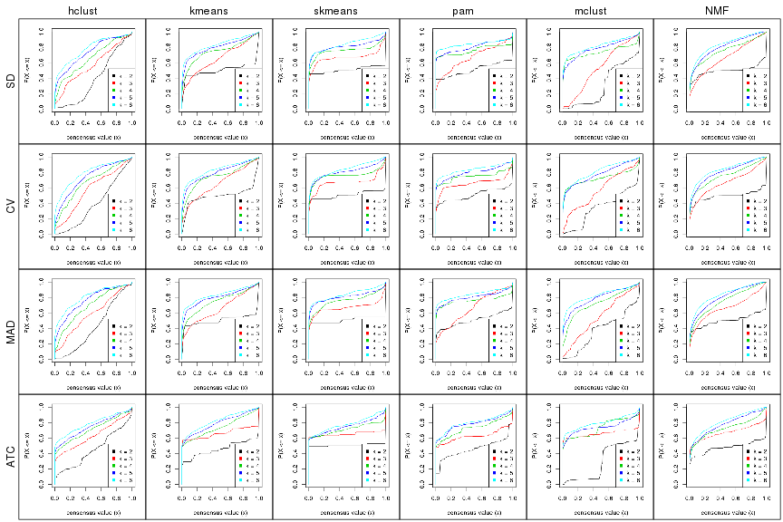


### Consensus heatmap

Consensus heatmaps for all methods. ([What is a consensus heatmap?](http://bioconductor.org/packages/devel/bioc/vignettes/cola/inst/doc/cola.html#toc_9))


<style type='text/css'>


.ui-helper-hidden {
	display: none;
}
.ui-helper-hidden-accessible {
	border: 0;
	clip: rect(0 0 0 0);
	height: 1px;
	margin: -1px;
	overflow: hidden;
	padding: 0;
	position: absolute;
	width: 1px;
}
.ui-helper-reset {
	margin: 0;
	padding: 0;
	border: 0;
	outline: 0;
	line-height: 1.3;
	text-decoration: none;
	font-size: 100%;
	list-style: none;
}
.ui-helper-clearfix:before,
.ui-helper-clearfix:after {
	content: "";
	display: table;
	border-collapse: collapse;
}
.ui-helper-clearfix:after {
	clear: both;
}
.ui-helper-zfix {
	width: 100%;
	height: 100%;
	top: 0;
	left: 0;
	position: absolute;
	opacity: 0;
	filter:Alpha(Opacity=0); 
}

.ui-front {
	z-index: 100;
}


.ui-state-disabled {
	cursor: default !important;
	pointer-events: none;
}


.ui-icon {
	display: inline-block;
	vertical-align: middle;
	margin-top: -.25em;
	position: relative;
	text-indent: -99999px;
	overflow: hidden;
	background-repeat: no-repeat;
}

.ui-widget-icon-block {
	left: 50%;
	margin-left: -8px;
	display: block;
}


.ui-widget-overlay {
	position: fixed;
	top: 0;
	left: 0;
	width: 100%;
	height: 100%;
}
.ui-accordion .ui-accordion-header {
	display: block;
	cursor: pointer;
	position: relative;
	margin: 2px 0 0 0;
	padding: .5em .5em .5em .7em;
	font-size: 100%;
}
.ui-accordion .ui-accordion-content {
	padding: 1em 2.2em;
	border-top: 0;
	overflow: auto;
}
.ui-autocomplete {
	position: absolute;
	top: 0;
	left: 0;
	cursor: default;
}
.ui-menu {
	list-style: none;
	padding: 0;
	margin: 0;
	display: block;
	outline: 0;
}
.ui-menu .ui-menu {
	position: absolute;
}
.ui-menu .ui-menu-item {
	margin: 0;
	cursor: pointer;
	
	list-style-image: url("data:image/gif;base64,R0lGODlhAQABAIAAAAAAAP///yH5BAEAAAAALAAAAAABAAEAAAIBRAA7");
}
.ui-menu .ui-menu-item-wrapper {
	position: relative;
	padding: 3px 1em 3px .4em;
}
.ui-menu .ui-menu-divider {
	margin: 5px 0;
	height: 0;
	font-size: 0;
	line-height: 0;
	border-width: 1px 0 0 0;
}
.ui-menu .ui-state-focus,
.ui-menu .ui-state-active {
	margin: -1px;
}


.ui-menu-icons {
	position: relative;
}
.ui-menu-icons .ui-menu-item-wrapper {
	padding-left: 2em;
}


.ui-menu .ui-icon {
	position: absolute;
	top: 0;
	bottom: 0;
	left: .2em;
	margin: auto 0;
}


.ui-menu .ui-menu-icon {
	left: auto;
	right: 0;
}
.ui-button {
	padding: .4em 1em;
	display: inline-block;
	position: relative;
	line-height: normal;
	margin-right: .1em;
	cursor: pointer;
	vertical-align: middle;
	text-align: center;
	-webkit-user-select: none;
	-moz-user-select: none;
	-ms-user-select: none;
	user-select: none;

	
	overflow: visible;
}

.ui-button,
.ui-button:link,
.ui-button:visited,
.ui-button:hover,
.ui-button:active {
	text-decoration: none;
}


.ui-button-icon-only {
	width: 2em;
	box-sizing: border-box;
	text-indent: -9999px;
	white-space: nowrap;
}


input.ui-button.ui-button-icon-only {
	text-indent: 0;
}


.ui-button-icon-only .ui-icon {
	position: absolute;
	top: 50%;
	left: 50%;
	margin-top: -8px;
	margin-left: -8px;
}

.ui-button.ui-icon-notext .ui-icon {
	padding: 0;
	width: 2.1em;
	height: 2.1em;
	text-indent: -9999px;
	white-space: nowrap;

}

input.ui-button.ui-icon-notext .ui-icon {
	width: auto;
	height: auto;
	text-indent: 0;
	white-space: normal;
	padding: .4em 1em;
}


input.ui-button::-moz-focus-inner,
button.ui-button::-moz-focus-inner {
	border: 0;
	padding: 0;
}
.ui-controlgroup {
	vertical-align: middle;
	display: inline-block;
}
.ui-controlgroup > .ui-controlgroup-item {
	float: left;
	margin-left: 0;
	margin-right: 0;
}
.ui-controlgroup > .ui-controlgroup-item:focus,
.ui-controlgroup > .ui-controlgroup-item.ui-visual-focus {
	z-index: 9999;
}
.ui-controlgroup-vertical > .ui-controlgroup-item {
	display: block;
	float: none;
	width: 100%;
	margin-top: 0;
	margin-bottom: 0;
	text-align: left;
}
.ui-controlgroup-vertical .ui-controlgroup-item {
	box-sizing: border-box;
}
.ui-controlgroup .ui-controlgroup-label {
	padding: .4em 1em;
}
.ui-controlgroup .ui-controlgroup-label span {
	font-size: 80%;
}
.ui-controlgroup-horizontal .ui-controlgroup-label + .ui-controlgroup-item {
	border-left: none;
}
.ui-controlgroup-vertical .ui-controlgroup-label + .ui-controlgroup-item {
	border-top: none;
}
.ui-controlgroup-horizontal .ui-controlgroup-label.ui-widget-content {
	border-right: none;
}
.ui-controlgroup-vertical .ui-controlgroup-label.ui-widget-content {
	border-bottom: none;
}


.ui-controlgroup-vertical .ui-spinner-input {

	
	width: 75%;
	width: calc( 100% - 2.4em );
}
.ui-controlgroup-vertical .ui-spinner .ui-spinner-up {
	border-top-style: solid;
}

.ui-checkboxradio-label .ui-icon-background {
	box-shadow: inset 1px 1px 1px #ccc;
	border-radius: .12em;
	border: none;
}
.ui-checkboxradio-radio-label .ui-icon-background {
	width: 16px;
	height: 16px;
	border-radius: 1em;
	overflow: visible;
	border: none;
}
.ui-checkboxradio-radio-label.ui-checkboxradio-checked .ui-icon,
.ui-checkboxradio-radio-label.ui-checkboxradio-checked:hover .ui-icon {
	background-image: none;
	width: 8px;
	height: 8px;
	border-width: 4px;
	border-style: solid;
}
.ui-checkboxradio-disabled {
	pointer-events: none;
}
.ui-datepicker {
	width: 17em;
	padding: .2em .2em 0;
	display: none;
}
.ui-datepicker .ui-datepicker-header {
	position: relative;
	padding: .2em 0;
}
.ui-datepicker .ui-datepicker-prev,
.ui-datepicker .ui-datepicker-next {
	position: absolute;
	top: 2px;
	width: 1.8em;
	height: 1.8em;
}
.ui-datepicker .ui-datepicker-prev-hover,
.ui-datepicker .ui-datepicker-next-hover {
	top: 1px;
}
.ui-datepicker .ui-datepicker-prev {
	left: 2px;
}
.ui-datepicker .ui-datepicker-next {
	right: 2px;
}
.ui-datepicker .ui-datepicker-prev-hover {
	left: 1px;
}
.ui-datepicker .ui-datepicker-next-hover {
	right: 1px;
}
.ui-datepicker .ui-datepicker-prev span,
.ui-datepicker .ui-datepicker-next span {
	display: block;
	position: absolute;
	left: 50%;
	margin-left: -8px;
	top: 50%;
	margin-top: -8px;
}
.ui-datepicker .ui-datepicker-title {
	margin: 0 2.3em;
	line-height: 1.8em;
	text-align: center;
}
.ui-datepicker .ui-datepicker-title select {
	font-size: 1em;
	margin: 1px 0;
}
.ui-datepicker select.ui-datepicker-month,
.ui-datepicker select.ui-datepicker-year {
	width: 45%;
}
.ui-datepicker table {
	width: 100%;
	font-size: .9em;
	border-collapse: collapse;
	margin: 0 0 .4em;
}
.ui-datepicker th {
	padding: .7em .3em;
	text-align: center;
	font-weight: bold;
	border: 0;
}
.ui-datepicker td {
	border: 0;
	padding: 1px;
}
.ui-datepicker td span,
.ui-datepicker td a {
	display: block;
	padding: .2em;
	text-align: right;
	text-decoration: none;
}
.ui-datepicker .ui-datepicker-buttonpane {
	background-image: none;
	margin: .7em 0 0 0;
	padding: 0 .2em;
	border-left: 0;
	border-right: 0;
	border-bottom: 0;
}
.ui-datepicker .ui-datepicker-buttonpane button {
	float: right;
	margin: .5em .2em .4em;
	cursor: pointer;
	padding: .2em .6em .3em .6em;
	width: auto;
	overflow: visible;
}
.ui-datepicker .ui-datepicker-buttonpane button.ui-datepicker-current {
	float: left;
}


.ui-datepicker.ui-datepicker-multi {
	width: auto;
}
.ui-datepicker-multi .ui-datepicker-group {
	float: left;
}
.ui-datepicker-multi .ui-datepicker-group table {
	width: 95%;
	margin: 0 auto .4em;
}
.ui-datepicker-multi-2 .ui-datepicker-group {
	width: 50%;
}
.ui-datepicker-multi-3 .ui-datepicker-group {
	width: 33.3%;
}
.ui-datepicker-multi-4 .ui-datepicker-group {
	width: 25%;
}
.ui-datepicker-multi .ui-datepicker-group-last .ui-datepicker-header,
.ui-datepicker-multi .ui-datepicker-group-middle .ui-datepicker-header {
	border-left-width: 0;
}
.ui-datepicker-multi .ui-datepicker-buttonpane {
	clear: left;
}
.ui-datepicker-row-break {
	clear: both;
	width: 100%;
	font-size: 0;
}


.ui-datepicker-rtl {
	direction: rtl;
}
.ui-datepicker-rtl .ui-datepicker-prev {
	right: 2px;
	left: auto;
}
.ui-datepicker-rtl .ui-datepicker-next {
	left: 2px;
	right: auto;
}
.ui-datepicker-rtl .ui-datepicker-prev:hover {
	right: 1px;
	left: auto;
}
.ui-datepicker-rtl .ui-datepicker-next:hover {
	left: 1px;
	right: auto;
}
.ui-datepicker-rtl .ui-datepicker-buttonpane {
	clear: right;
}
.ui-datepicker-rtl .ui-datepicker-buttonpane button {
	float: left;
}
.ui-datepicker-rtl .ui-datepicker-buttonpane button.ui-datepicker-current,
.ui-datepicker-rtl .ui-datepicker-group {
	float: right;
}
.ui-datepicker-rtl .ui-datepicker-group-last .ui-datepicker-header,
.ui-datepicker-rtl .ui-datepicker-group-middle .ui-datepicker-header {
	border-right-width: 0;
	border-left-width: 1px;
}


.ui-datepicker .ui-icon {
	display: block;
	text-indent: -99999px;
	overflow: hidden;
	background-repeat: no-repeat;
	left: .5em;
	top: .3em;
}
.ui-dialog {
	position: absolute;
	top: 0;
	left: 0;
	padding: .2em;
	outline: 0;
}
.ui-dialog .ui-dialog-titlebar {
	padding: .4em 1em;
	position: relative;
}
.ui-dialog .ui-dialog-title {
	float: left;
	margin: .1em 0;
	white-space: nowrap;
	width: 90%;
	overflow: hidden;
	text-overflow: ellipsis;
}
.ui-dialog .ui-dialog-titlebar-close {
	position: absolute;
	right: .3em;
	top: 50%;
	width: 20px;
	margin: -10px 0 0 0;
	padding: 1px;
	height: 20px;
}
.ui-dialog .ui-dialog-content {
	position: relative;
	border: 0;
	padding: .5em 1em;
	background: none;
	overflow: auto;
}
.ui-dialog .ui-dialog-buttonpane {
	text-align: left;
	border-width: 1px 0 0 0;
	background-image: none;
	margin-top: .5em;
	padding: .3em 1em .5em .4em;
}
.ui-dialog .ui-dialog-buttonpane .ui-dialog-buttonset {
	float: right;
}
.ui-dialog .ui-dialog-buttonpane button {
	margin: .5em .4em .5em 0;
	cursor: pointer;
}
.ui-dialog .ui-resizable-n {
	height: 2px;
	top: 0;
}
.ui-dialog .ui-resizable-e {
	width: 2px;
	right: 0;
}
.ui-dialog .ui-resizable-s {
	height: 2px;
	bottom: 0;
}
.ui-dialog .ui-resizable-w {
	width: 2px;
	left: 0;
}
.ui-dialog .ui-resizable-se,
.ui-dialog .ui-resizable-sw,
.ui-dialog .ui-resizable-ne,
.ui-dialog .ui-resizable-nw {
	width: 7px;
	height: 7px;
}
.ui-dialog .ui-resizable-se {
	right: 0;
	bottom: 0;
}
.ui-dialog .ui-resizable-sw {
	left: 0;
	bottom: 0;
}
.ui-dialog .ui-resizable-ne {
	right: 0;
	top: 0;
}
.ui-dialog .ui-resizable-nw {
	left: 0;
	top: 0;
}
.ui-draggable .ui-dialog-titlebar {
	cursor: move;
}
.ui-draggable-handle {
	-ms-touch-action: none;
	touch-action: none;
}
.ui-resizable {
	position: relative;
}
.ui-resizable-handle {
	position: absolute;
	font-size: 0.1px;
	display: block;
	-ms-touch-action: none;
	touch-action: none;
}
.ui-resizable-disabled .ui-resizable-handle,
.ui-resizable-autohide .ui-resizable-handle {
	display: none;
}
.ui-resizable-n {
	cursor: n-resize;
	height: 7px;
	width: 100%;
	top: -5px;
	left: 0;
}
.ui-resizable-s {
	cursor: s-resize;
	height: 7px;
	width: 100%;
	bottom: -5px;
	left: 0;
}
.ui-resizable-e {
	cursor: e-resize;
	width: 7px;
	right: -5px;
	top: 0;
	height: 100%;
}
.ui-resizable-w {
	cursor: w-resize;
	width: 7px;
	left: -5px;
	top: 0;
	height: 100%;
}
.ui-resizable-se {
	cursor: se-resize;
	width: 12px;
	height: 12px;
	right: 1px;
	bottom: 1px;
}
.ui-resizable-sw {
	cursor: sw-resize;
	width: 9px;
	height: 9px;
	left: -5px;
	bottom: -5px;
}
.ui-resizable-nw {
	cursor: nw-resize;
	width: 9px;
	height: 9px;
	left: -5px;
	top: -5px;
}
.ui-resizable-ne {
	cursor: ne-resize;
	width: 9px;
	height: 9px;
	right: -5px;
	top: -5px;
}
.ui-progressbar {
	height: 2em;
	text-align: left;
	overflow: hidden;
}
.ui-progressbar .ui-progressbar-value {
	margin: -1px;
	height: 100%;
}
.ui-progressbar .ui-progressbar-overlay {
	background: url("");
	height: 100%;
	filter: alpha(opacity=25); 
	opacity: 0.25;
}
.ui-progressbar-indeterminate .ui-progressbar-value {
	background-image: none;
}
.ui-selectable {
	-ms-touch-action: none;
	touch-action: none;
}
.ui-selectable-helper {
	position: absolute;
	z-index: 100;
	border: 1px dotted black;
}
.ui-selectmenu-menu {
	padding: 0;
	margin: 0;
	position: absolute;
	top: 0;
	left: 0;
	display: none;
}
.ui-selectmenu-menu .ui-menu {
	overflow: auto;
	overflow-x: hidden;
	padding-bottom: 1px;
}
.ui-selectmenu-menu .ui-menu .ui-selectmenu-optgroup {
	font-size: 1em;
	font-weight: bold;
	line-height: 1.5;
	padding: 2px 0.4em;
	margin: 0.5em 0 0 0;
	height: auto;
	border: 0;
}
.ui-selectmenu-open {
	display: block;
}
.ui-selectmenu-text {
	display: block;
	margin-right: 20px;
	overflow: hidden;
	text-overflow: ellipsis;
}
.ui-selectmenu-button.ui-button {
	text-align: left;
	white-space: nowrap;
	width: 14em;
}
.ui-selectmenu-icon.ui-icon {
	float: right;
	margin-top: 0;
}
.ui-slider {
	position: relative;
	text-align: left;
}
.ui-slider .ui-slider-handle {
	position: absolute;
	z-index: 2;
	width: 1.2em;
	height: 1.2em;
	cursor: default;
	-ms-touch-action: none;
	touch-action: none;
}
.ui-slider .ui-slider-range {
	position: absolute;
	z-index: 1;
	font-size: .7em;
	display: block;
	border: 0;
	background-position: 0 0;
}


.ui-slider.ui-state-disabled .ui-slider-handle,
.ui-slider.ui-state-disabled .ui-slider-range {
	filter: inherit;
}

.ui-slider-horizontal {
	height: .8em;
}
.ui-slider-horizontal .ui-slider-handle {
	top: -.3em;
	margin-left: -.6em;
}
.ui-slider-horizontal .ui-slider-range {
	top: 0;
	height: 100%;
}
.ui-slider-horizontal .ui-slider-range-min {
	left: 0;
}
.ui-slider-horizontal .ui-slider-range-max {
	right: 0;
}

.ui-slider-vertical {
	width: .8em;
	height: 100px;
}
.ui-slider-vertical .ui-slider-handle {
	left: -.3em;
	margin-left: 0;
	margin-bottom: -.6em;
}
.ui-slider-vertical .ui-slider-range {
	left: 0;
	width: 100%;
}
.ui-slider-vertical .ui-slider-range-min {
	bottom: 0;
}
.ui-slider-vertical .ui-slider-range-max {
	top: 0;
}
.ui-sortable-handle {
	-ms-touch-action: none;
	touch-action: none;
}
.ui-spinner {
	position: relative;
	display: inline-block;
	overflow: hidden;
	padding: 0;
	vertical-align: middle;
}
.ui-spinner-input {
	border: none;
	background: none;
	color: inherit;
	padding: .222em 0;
	margin: .2em 0;
	vertical-align: middle;
	margin-left: .4em;
	margin-right: 2em;
}
.ui-spinner-button {
	width: 1.6em;
	height: 50%;
	font-size: .5em;
	padding: 0;
	margin: 0;
	text-align: center;
	position: absolute;
	cursor: default;
	display: block;
	overflow: hidden;
	right: 0;
}

.ui-spinner a.ui-spinner-button {
	border-top-style: none;
	border-bottom-style: none;
	border-right-style: none;
}
.ui-spinner-up {
	top: 0;
}
.ui-spinner-down {
	bottom: 0;
}
.ui-tabs {
	position: relative;
	padding: .2em;
}
.ui-tabs .ui-tabs-nav {
	margin: 0;
	padding: .2em .2em 0;
}
.ui-tabs .ui-tabs-nav li {
	list-style: none;
	float: left;
	position: relative;
	top: 0;
	margin: 1px .2em 0 0;
	border-bottom-width: 0;
	padding: 0;
	white-space: nowrap;
}
.ui-tabs .ui-tabs-nav .ui-tabs-anchor {
	float: left;
	padding: .5em 1em;
	text-decoration: none;
}
.ui-tabs .ui-tabs-nav li.ui-tabs-active {
	margin-bottom: -1px;
	padding-bottom: 1px;
}
.ui-tabs .ui-tabs-nav li.ui-tabs-active .ui-tabs-anchor,
.ui-tabs .ui-tabs-nav li.ui-state-disabled .ui-tabs-anchor,
.ui-tabs .ui-tabs-nav li.ui-tabs-loading .ui-tabs-anchor {
	cursor: text;
}
.ui-tabs-collapsible .ui-tabs-nav li.ui-tabs-active .ui-tabs-anchor {
	cursor: pointer;
}
.ui-tabs .ui-tabs-panel {
	display: block;
	border-width: 0;
	padding: 1em 1.4em;
	background: none;
}
.ui-tooltip {
	padding: 8px;
	position: absolute;
	z-index: 9999;
	max-width: 300px;
}
body .ui-tooltip {
	border-width: 2px;
}

.ui-widget {
	font-family: Arial,Helvetica,sans-serif;
	font-size: 1em;
}
.ui-widget .ui-widget {
	font-size: 1em;
}
.ui-widget input,
.ui-widget select,
.ui-widget textarea,
.ui-widget button {
	font-family: Arial,Helvetica,sans-serif;
	font-size: 1em;
}
.ui-widget.ui-widget-content {
	border: 1px solid #c5c5c5;
}
.ui-widget-content {
	border: 1px solid #dddddd;
	background: #ffffff;
	color: #333333;
}
.ui-widget-content a {
	color: #333333;
}
.ui-widget-header {
	border: 1px solid #dddddd;
	background: #e9e9e9;
	color: #333333;
	font-weight: bold;
}
.ui-widget-header a {
	color: #333333;
}


.ui-state-default,
.ui-widget-content .ui-state-default,
.ui-widget-header .ui-state-default,
.ui-button,


html .ui-button.ui-state-disabled:hover,
html .ui-button.ui-state-disabled:active {
	border: 1px solid #c5c5c5;
	background: #f6f6f6;
	font-weight: normal;
	color: #454545;
}
.ui-state-default a,
.ui-state-default a:link,
.ui-state-default a:visited,
a.ui-button,
a:link.ui-button,
a:visited.ui-button,
.ui-button {
	color: #454545;
	text-decoration: none;
}
.ui-state-hover,
.ui-widget-content .ui-state-hover,
.ui-widget-header .ui-state-hover,
.ui-state-focus,
.ui-widget-content .ui-state-focus,
.ui-widget-header .ui-state-focus,
.ui-button:hover,
.ui-button:focus {
	border: 1px solid #cccccc;
	background: #ededed;
	font-weight: normal;
	color: #2b2b2b;
}
.ui-state-hover a,
.ui-state-hover a:hover,
.ui-state-hover a:link,
.ui-state-hover a:visited,
.ui-state-focus a,
.ui-state-focus a:hover,
.ui-state-focus a:link,
.ui-state-focus a:visited,
a.ui-button:hover,
a.ui-button:focus {
	color: #2b2b2b;
	text-decoration: none;
}

.ui-visual-focus {
	box-shadow: 0 0 3px 1px rgb(94, 158, 214);
}
.ui-state-active,
.ui-widget-content .ui-state-active,
.ui-widget-header .ui-state-active,
a.ui-button:active,
.ui-button:active,
.ui-button.ui-state-active:hover {
	border: 1px solid #003eff;
	background: #007fff;
	font-weight: normal;
	color: #ffffff;
}
.ui-icon-background,
.ui-state-active .ui-icon-background {
	border: #003eff;
	background-color: #ffffff;
}
.ui-state-active a,
.ui-state-active a:link,
.ui-state-active a:visited {
	color: #ffffff;
	text-decoration: none;
}


.ui-state-highlight,
.ui-widget-content .ui-state-highlight,
.ui-widget-header .ui-state-highlight {
	border: 1px solid #dad55e;
	background: #fffa90;
	color: #777620;
}
.ui-state-checked {
	border: 1px solid #dad55e;
	background: #fffa90;
}
.ui-state-highlight a,
.ui-widget-content .ui-state-highlight a,
.ui-widget-header .ui-state-highlight a {
	color: #777620;
}
.ui-state-error,
.ui-widget-content .ui-state-error,
.ui-widget-header .ui-state-error {
	border: 1px solid #f1a899;
	background: #fddfdf;
	color: #5f3f3f;
}
.ui-state-error a,
.ui-widget-content .ui-state-error a,
.ui-widget-header .ui-state-error a {
	color: #5f3f3f;
}
.ui-state-error-text,
.ui-widget-content .ui-state-error-text,
.ui-widget-header .ui-state-error-text {
	color: #5f3f3f;
}
.ui-priority-primary,
.ui-widget-content .ui-priority-primary,
.ui-widget-header .ui-priority-primary {
	font-weight: bold;
}
.ui-priority-secondary,
.ui-widget-content .ui-priority-secondary,
.ui-widget-header .ui-priority-secondary {
	opacity: .7;
	filter:Alpha(Opacity=70); 
	font-weight: normal;
}
.ui-state-disabled,
.ui-widget-content .ui-state-disabled,
.ui-widget-header .ui-state-disabled {
	opacity: .35;
	filter:Alpha(Opacity=35); 
	background-image: none;
}
.ui-state-disabled .ui-icon {
	filter:Alpha(Opacity=35); 
}


.ui-icon {
	width: 16px;
	height: 16px;
}
.ui-icon,
.ui-widget-content .ui-icon {
	background-image: url("images/ui-icons_444444_256x240.png");
}
.ui-widget-header .ui-icon {
	background-image: url("images/ui-icons_444444_256x240.png");
}
.ui-state-hover .ui-icon,
.ui-state-focus .ui-icon,
.ui-button:hover .ui-icon,
.ui-button:focus .ui-icon {
	background-image: url("images/ui-icons_555555_256x240.png");
}
.ui-state-active .ui-icon,
.ui-button:active .ui-icon {
	background-image: url("images/ui-icons_ffffff_256x240.png");
}
.ui-state-highlight .ui-icon,
.ui-button .ui-state-highlight.ui-icon {
	background-image: url("images/ui-icons_777620_256x240.png");
}
.ui-state-error .ui-icon,
.ui-state-error-text .ui-icon {
	background-image: url("images/ui-icons_cc0000_256x240.png");
}
.ui-button .ui-icon {
	background-image: url("images/ui-icons_777777_256x240.png");
}


.ui-icon-blank { background-position: 16px 16px; }
.ui-icon-caret-1-n { background-position: 0 0; }
.ui-icon-caret-1-ne { background-position: -16px 0; }
.ui-icon-caret-1-e { background-position: -32px 0; }
.ui-icon-caret-1-se { background-position: -48px 0; }
.ui-icon-caret-1-s { background-position: -65px 0; }
.ui-icon-caret-1-sw { background-position: -80px 0; }
.ui-icon-caret-1-w { background-position: -96px 0; }
.ui-icon-caret-1-nw { background-position: -112px 0; }
.ui-icon-caret-2-n-s { background-position: -128px 0; }
.ui-icon-caret-2-e-w { background-position: -144px 0; }
.ui-icon-triangle-1-n { background-position: 0 -16px; }
.ui-icon-triangle-1-ne { background-position: -16px -16px; }
.ui-icon-triangle-1-e { background-position: -32px -16px; }
.ui-icon-triangle-1-se { background-position: -48px -16px; }
.ui-icon-triangle-1-s { background-position: -65px -16px; }
.ui-icon-triangle-1-sw { background-position: -80px -16px; }
.ui-icon-triangle-1-w { background-position: -96px -16px; }
.ui-icon-triangle-1-nw { background-position: -112px -16px; }
.ui-icon-triangle-2-n-s { background-position: -128px -16px; }
.ui-icon-triangle-2-e-w { background-position: -144px -16px; }
.ui-icon-arrow-1-n { background-position: 0 -32px; }
.ui-icon-arrow-1-ne { background-position: -16px -32px; }
.ui-icon-arrow-1-e { background-position: -32px -32px; }
.ui-icon-arrow-1-se { background-position: -48px -32px; }
.ui-icon-arrow-1-s { background-position: -65px -32px; }
.ui-icon-arrow-1-sw { background-position: -80px -32px; }
.ui-icon-arrow-1-w { background-position: -96px -32px; }
.ui-icon-arrow-1-nw { background-position: -112px -32px; }
.ui-icon-arrow-2-n-s { background-position: -128px -32px; }
.ui-icon-arrow-2-ne-sw { background-position: -144px -32px; }
.ui-icon-arrow-2-e-w { background-position: -160px -32px; }
.ui-icon-arrow-2-se-nw { background-position: -176px -32px; }
.ui-icon-arrowstop-1-n { background-position: -192px -32px; }
.ui-icon-arrowstop-1-e { background-position: -208px -32px; }
.ui-icon-arrowstop-1-s { background-position: -224px -32px; }
.ui-icon-arrowstop-1-w { background-position: -240px -32px; }
.ui-icon-arrowthick-1-n { background-position: 1px -48px; }
.ui-icon-arrowthick-1-ne { background-position: -16px -48px; }
.ui-icon-arrowthick-1-e { background-position: -32px -48px; }
.ui-icon-arrowthick-1-se { background-position: -48px -48px; }
.ui-icon-arrowthick-1-s { background-position: -64px -48px; }
.ui-icon-arrowthick-1-sw { background-position: -80px -48px; }
.ui-icon-arrowthick-1-w { background-position: -96px -48px; }
.ui-icon-arrowthick-1-nw { background-position: -112px -48px; }
.ui-icon-arrowthick-2-n-s { background-position: -128px -48px; }
.ui-icon-arrowthick-2-ne-sw { background-position: -144px -48px; }
.ui-icon-arrowthick-2-e-w { background-position: -160px -48px; }
.ui-icon-arrowthick-2-se-nw { background-position: -176px -48px; }
.ui-icon-arrowthickstop-1-n { background-position: -192px -48px; }
.ui-icon-arrowthickstop-1-e { background-position: -208px -48px; }
.ui-icon-arrowthickstop-1-s { background-position: -224px -48px; }
.ui-icon-arrowthickstop-1-w { background-position: -240px -48px; }
.ui-icon-arrowreturnthick-1-w { background-position: 0 -64px; }
.ui-icon-arrowreturnthick-1-n { background-position: -16px -64px; }
.ui-icon-arrowreturnthick-1-e { background-position: -32px -64px; }
.ui-icon-arrowreturnthick-1-s { background-position: -48px -64px; }
.ui-icon-arrowreturn-1-w { background-position: -64px -64px; }
.ui-icon-arrowreturn-1-n { background-position: -80px -64px; }
.ui-icon-arrowreturn-1-e { background-position: -96px -64px; }
.ui-icon-arrowreturn-1-s { background-position: -112px -64px; }
.ui-icon-arrowrefresh-1-w { background-position: -128px -64px; }
.ui-icon-arrowrefresh-1-n { background-position: -144px -64px; }
.ui-icon-arrowrefresh-1-e { background-position: -160px -64px; }
.ui-icon-arrowrefresh-1-s { background-position: -176px -64px; }
.ui-icon-arrow-4 { background-position: 0 -80px; }
.ui-icon-arrow-4-diag { background-position: -16px -80px; }
.ui-icon-extlink { background-position: -32px -80px; }
.ui-icon-newwin { background-position: -48px -80px; }
.ui-icon-refresh { background-position: -64px -80px; }
.ui-icon-shuffle { background-position: -80px -80px; }
.ui-icon-transfer-e-w { background-position: -96px -80px; }
.ui-icon-transferthick-e-w { background-position: -112px -80px; }
.ui-icon-folder-collapsed { background-position: 0 -96px; }
.ui-icon-folder-open { background-position: -16px -96px; }
.ui-icon-document { background-position: -32px -96px; }
.ui-icon-document-b { background-position: -48px -96px; }
.ui-icon-note { background-position: -64px -96px; }
.ui-icon-mail-closed { background-position: -80px -96px; }
.ui-icon-mail-open { background-position: -96px -96px; }
.ui-icon-suitcase { background-position: -112px -96px; }
.ui-icon-comment { background-position: -128px -96px; }
.ui-icon-person { background-position: -144px -96px; }
.ui-icon-print { background-position: -160px -96px; }
.ui-icon-trash { background-position: -176px -96px; }
.ui-icon-locked { background-position: -192px -96px; }
.ui-icon-unlocked { background-position: -208px -96px; }
.ui-icon-bookmark { background-position: -224px -96px; }
.ui-icon-tag { background-position: -240px -96px; }
.ui-icon-home { background-position: 0 -112px; }
.ui-icon-flag { background-position: -16px -112px; }
.ui-icon-calendar { background-position: -32px -112px; }
.ui-icon-cart { background-position: -48px -112px; }
.ui-icon-pencil { background-position: -64px -112px; }
.ui-icon-clock { background-position: -80px -112px; }
.ui-icon-disk { background-position: -96px -112px; }
.ui-icon-calculator { background-position: -112px -112px; }
.ui-icon-zoomin { background-position: -128px -112px; }
.ui-icon-zoomout { background-position: -144px -112px; }
.ui-icon-search { background-position: -160px -112px; }
.ui-icon-wrench { background-position: -176px -112px; }
.ui-icon-gear { background-position: -192px -112px; }
.ui-icon-heart { background-position: -208px -112px; }
.ui-icon-star { background-position: -224px -112px; }
.ui-icon-link { background-position: -240px -112px; }
.ui-icon-cancel { background-position: 0 -128px; }
.ui-icon-plus { background-position: -16px -128px; }
.ui-icon-plusthick { background-position: -32px -128px; }
.ui-icon-minus { background-position: -48px -128px; }
.ui-icon-minusthick { background-position: -64px -128px; }
.ui-icon-close { background-position: -80px -128px; }
.ui-icon-closethick { background-position: -96px -128px; }
.ui-icon-key { background-position: -112px -128px; }
.ui-icon-lightbulb { background-position: -128px -128px; }
.ui-icon-scissors { background-position: -144px -128px; }
.ui-icon-clipboard { background-position: -160px -128px; }
.ui-icon-copy { background-position: -176px -128px; }
.ui-icon-contact { background-position: -192px -128px; }
.ui-icon-image { background-position: -208px -128px; }
.ui-icon-video { background-position: -224px -128px; }
.ui-icon-script { background-position: -240px -128px; }
.ui-icon-alert { background-position: 0 -144px; }
.ui-icon-info { background-position: -16px -144px; }
.ui-icon-notice { background-position: -32px -144px; }
.ui-icon-help { background-position: -48px -144px; }
.ui-icon-check { background-position: -64px -144px; }
.ui-icon-bullet { background-position: -80px -144px; }
.ui-icon-radio-on { background-position: -96px -144px; }
.ui-icon-radio-off { background-position: -112px -144px; }
.ui-icon-pin-w { background-position: -128px -144px; }
.ui-icon-pin-s { background-position: -144px -144px; }
.ui-icon-play { background-position: 0 -160px; }
.ui-icon-pause { background-position: -16px -160px; }
.ui-icon-seek-next { background-position: -32px -160px; }
.ui-icon-seek-prev { background-position: -48px -160px; }
.ui-icon-seek-end { background-position: -64px -160px; }
.ui-icon-seek-start { background-position: -80px -160px; }

.ui-icon-seek-first { background-position: -80px -160px; }
.ui-icon-stop { background-position: -96px -160px; }
.ui-icon-eject { background-position: -112px -160px; }
.ui-icon-volume-off { background-position: -128px -160px; }
.ui-icon-volume-on { background-position: -144px -160px; }
.ui-icon-power { background-position: 0 -176px; }
.ui-icon-signal-diag { background-position: -16px -176px; }
.ui-icon-signal { background-position: -32px -176px; }
.ui-icon-battery-0 { background-position: -48px -176px; }
.ui-icon-battery-1 { background-position: -64px -176px; }
.ui-icon-battery-2 { background-position: -80px -176px; }
.ui-icon-battery-3 { background-position: -96px -176px; }
.ui-icon-circle-plus { background-position: 0 -192px; }
.ui-icon-circle-minus { background-position: -16px -192px; }
.ui-icon-circle-close { background-position: -32px -192px; }
.ui-icon-circle-triangle-e { background-position: -48px -192px; }
.ui-icon-circle-triangle-s { background-position: -64px -192px; }
.ui-icon-circle-triangle-w { background-position: -80px -192px; }
.ui-icon-circle-triangle-n { background-position: -96px -192px; }
.ui-icon-circle-arrow-e { background-position: -112px -192px; }
.ui-icon-circle-arrow-s { background-position: -128px -192px; }
.ui-icon-circle-arrow-w { background-position: -144px -192px; }
.ui-icon-circle-arrow-n { background-position: -160px -192px; }
.ui-icon-circle-zoomin { background-position: -176px -192px; }
.ui-icon-circle-zoomout { background-position: -192px -192px; }
.ui-icon-circle-check { background-position: -208px -192px; }
.ui-icon-circlesmall-plus { background-position: 0 -208px; }
.ui-icon-circlesmall-minus { background-position: -16px -208px; }
.ui-icon-circlesmall-close { background-position: -32px -208px; }
.ui-icon-squaresmall-plus { background-position: -48px -208px; }
.ui-icon-squaresmall-minus { background-position: -64px -208px; }
.ui-icon-squaresmall-close { background-position: -80px -208px; }
.ui-icon-grip-dotted-vertical { background-position: 0 -224px; }
.ui-icon-grip-dotted-horizontal { background-position: -16px -224px; }
.ui-icon-grip-solid-vertical { background-position: -32px -224px; }
.ui-icon-grip-solid-horizontal { background-position: -48px -224px; }
.ui-icon-gripsmall-diagonal-se { background-position: -64px -224px; }
.ui-icon-grip-diagonal-se { background-position: -80px -224px; }


.ui-corner-all,
.ui-corner-top,
.ui-corner-left,
.ui-corner-tl {
	border-top-left-radius: 3px;
}
.ui-corner-all,
.ui-corner-top,
.ui-corner-right,
.ui-corner-tr {
	border-top-right-radius: 3px;
}
.ui-corner-all,
.ui-corner-bottom,
.ui-corner-left,
.ui-corner-bl {
	border-bottom-left-radius: 3px;
}
.ui-corner-all,
.ui-corner-bottom,
.ui-corner-right,
.ui-corner-br {
	border-bottom-right-radius: 3px;
}


.ui-widget-overlay {
	background: #aaaaaa;
	opacity: .3;
	filter: Alpha(Opacity=30); 
}
.ui-widget-shadow {
	-webkit-box-shadow: 0px 0px 5px #666666;
	box-shadow: 0px 0px 5px #666666;
} 
</style>
<script src='js/jquery-1.12.4.js'></script>
<script src='js/jquery-ui.js'></script>

<script>
$( function() {
	$( '#tabs-collect-consensus-heatmap' ).tabs();
} );
</script>
<div id='tabs-collect-consensus-heatmap'>
<ul>
<li><a href='#tab-collect-consensus-heatmap-1'>k = 2</a></li>
<li><a href='#tab-collect-consensus-heatmap-2'>k = 3</a></li>
<li><a href='#tab-collect-consensus-heatmap-3'>k = 4</a></li>
<li><a href='#tab-collect-consensus-heatmap-4'>k = 5</a></li>
<li><a href='#tab-collect-consensus-heatmap-5'>k = 6</a></li>
</ul>
<div id='tab-collect-consensus-heatmap-1'>
<pre><code class="r">collect_plots(res_list, k = 2, fun = consensus_heatmap, mc.cores = 4)
</code></pre>

<p>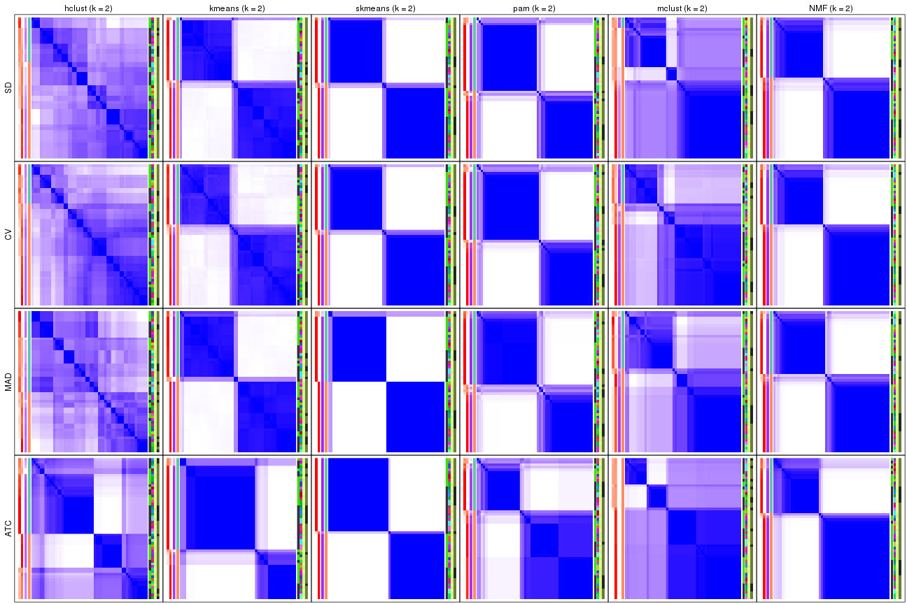</p>

</div>
<div id='tab-collect-consensus-heatmap-2'>
<pre><code class="r">collect_plots(res_list, k = 3, fun = consensus_heatmap, mc.cores = 4)
</code></pre>

<p>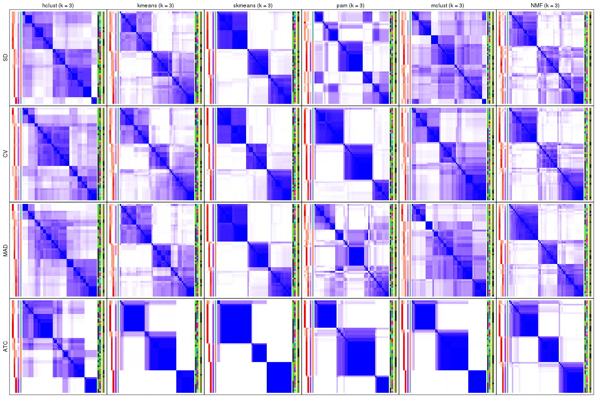</p>

</div>
<div id='tab-collect-consensus-heatmap-3'>
<pre><code class="r">collect_plots(res_list, k = 4, fun = consensus_heatmap, mc.cores = 4)
</code></pre>

<p>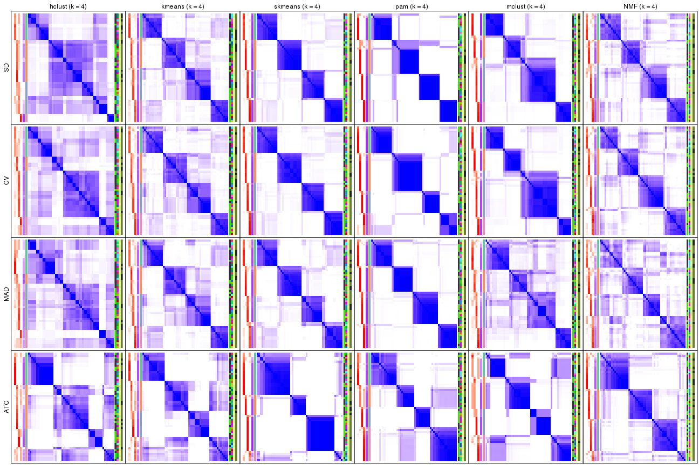</p>

</div>
<div id='tab-collect-consensus-heatmap-4'>
<pre><code class="r">collect_plots(res_list, k = 5, fun = consensus_heatmap, mc.cores = 4)
</code></pre>

<p>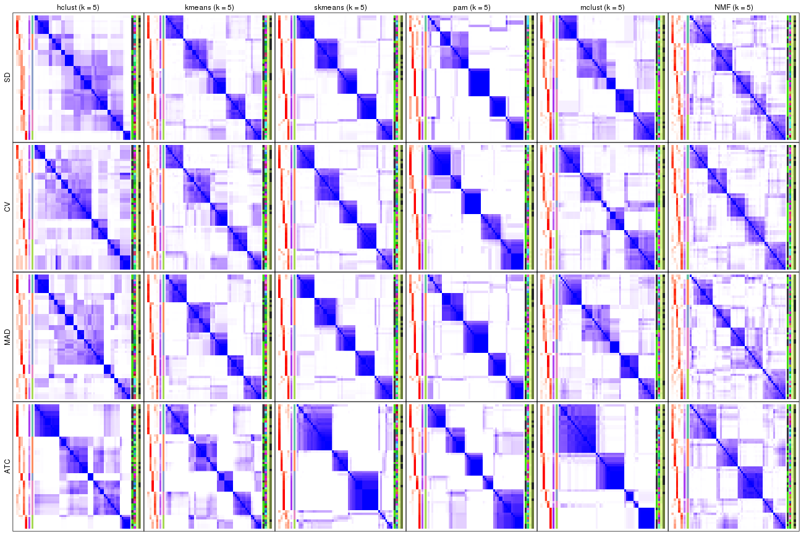</p>

</div>
<div id='tab-collect-consensus-heatmap-5'>
<pre><code class="r">collect_plots(res_list, k = 6, fun = consensus_heatmap, mc.cores = 4)
</code></pre>

<p>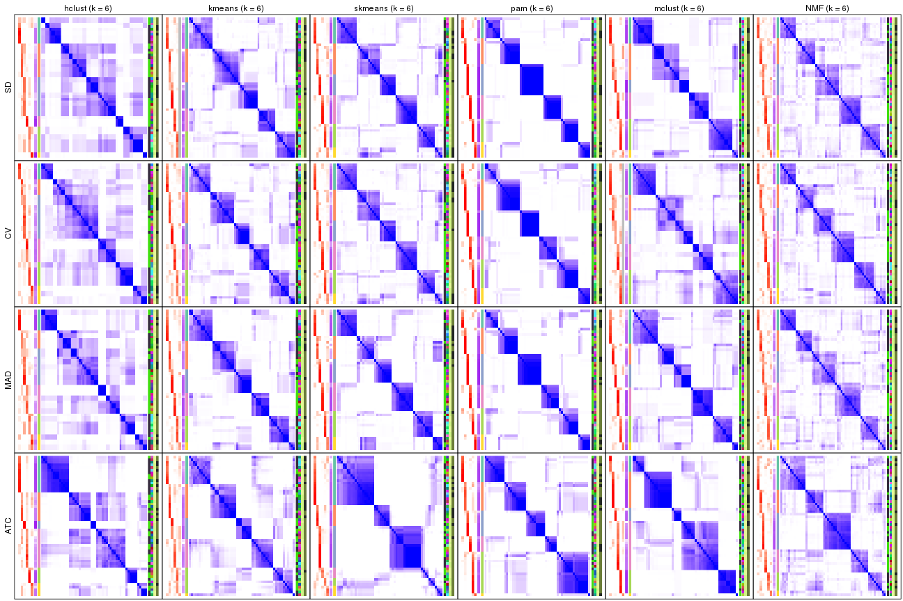</p>

</div>
</div>


### Membership heatmap

Membership heatmaps for all methods. ([What is a membership heatmap?](http://bioconductor.org/packages/devel/bioc/vignettes/cola/inst/doc/cola.html#toc_12))


<script>
$( function() {
	$( '#tabs-collect-membership-heatmap' ).tabs();
} );
</script>
<div id='tabs-collect-membership-heatmap'>
<ul>
<li><a href='#tab-collect-membership-heatmap-1'>k = 2</a></li>
<li><a href='#tab-collect-membership-heatmap-2'>k = 3</a></li>
<li><a href='#tab-collect-membership-heatmap-3'>k = 4</a></li>
<li><a href='#tab-collect-membership-heatmap-4'>k = 5</a></li>
<li><a href='#tab-collect-membership-heatmap-5'>k = 6</a></li>
</ul>
<div id='tab-collect-membership-heatmap-1'>
<pre><code class="r">collect_plots(res_list, k = 2, fun = membership_heatmap, mc.cores = 4)
</code></pre>

<p>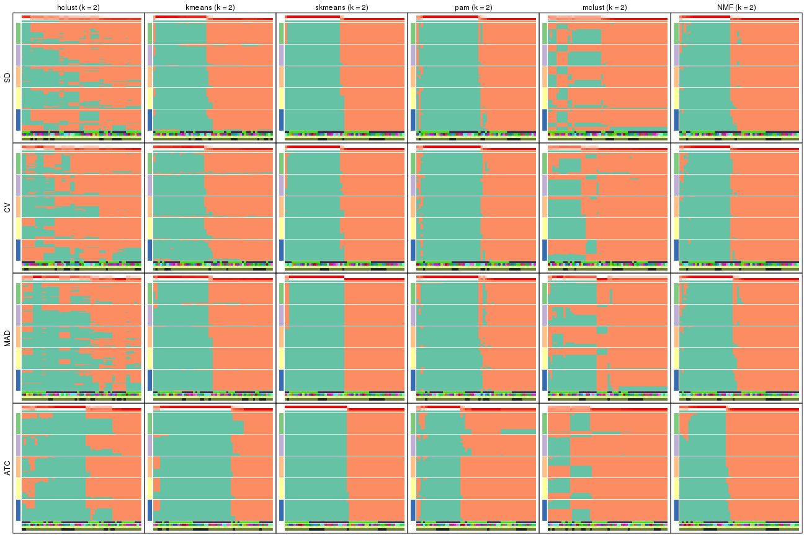</p>

</div>
<div id='tab-collect-membership-heatmap-2'>
<pre><code class="r">collect_plots(res_list, k = 3, fun = membership_heatmap, mc.cores = 4)
</code></pre>

<p>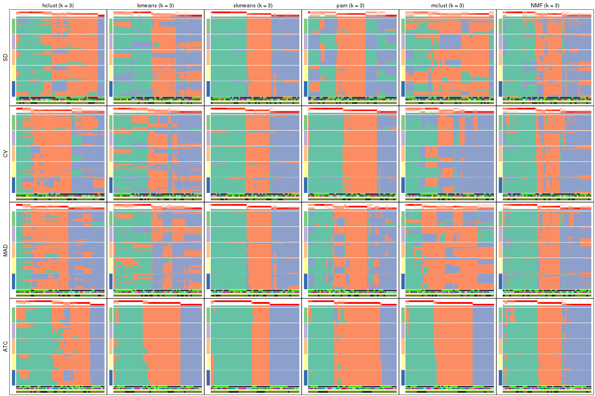</p>

</div>
<div id='tab-collect-membership-heatmap-3'>
<pre><code class="r">collect_plots(res_list, k = 4, fun = membership_heatmap, mc.cores = 4)
</code></pre>

<p>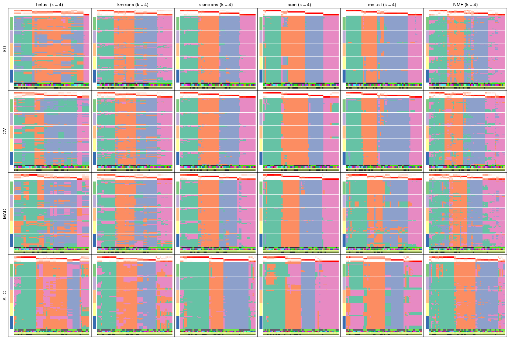</p>

</div>
<div id='tab-collect-membership-heatmap-4'>
<pre><code class="r">collect_plots(res_list, k = 5, fun = membership_heatmap, mc.cores = 4)
</code></pre>

<p>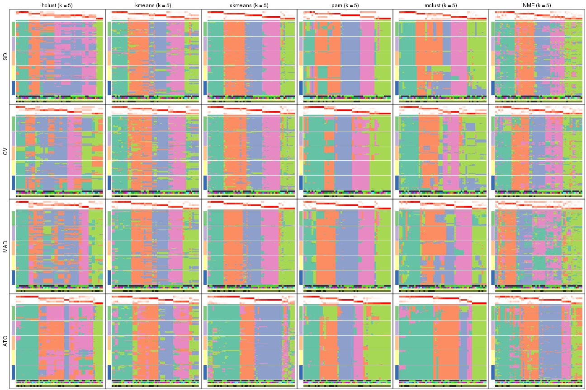</p>

</div>
<div id='tab-collect-membership-heatmap-5'>
<pre><code class="r">collect_plots(res_list, k = 6, fun = membership_heatmap, mc.cores = 4)
</code></pre>

<p>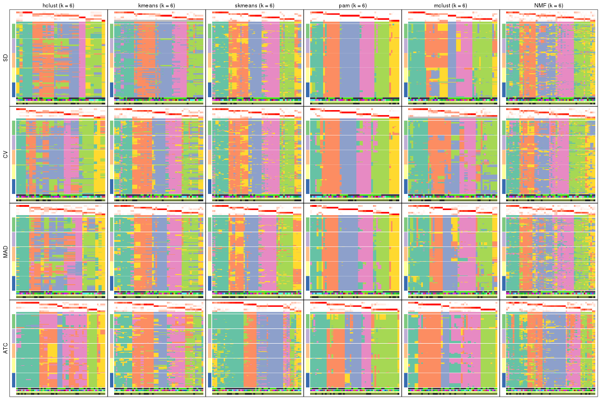</p>

</div>
</div>


### Signature heatmap

Signature heatmaps for all methods. ([What is a signature heatmap?](http://bioconductor.org/packages/devel/bioc/vignettes/cola/inst/doc/cola.html#toc_22))


Note in following heatmaps, rows are scaled.


<script>
$( function() {
	$( '#tabs-collect-get-signatures' ).tabs();
} );
</script>
<div id='tabs-collect-get-signatures'>
<ul>
<li><a href='#tab-collect-get-signatures-1'>k = 2</a></li>
<li><a href='#tab-collect-get-signatures-2'>k = 3</a></li>
<li><a href='#tab-collect-get-signatures-3'>k = 4</a></li>
<li><a href='#tab-collect-get-signatures-4'>k = 5</a></li>
<li><a href='#tab-collect-get-signatures-5'>k = 6</a></li>
</ul>
<div id='tab-collect-get-signatures-1'>
<pre><code class="r">collect_plots(res_list, k = 2, fun = get_signatures, mc.cores = 4)
</code></pre>

<p>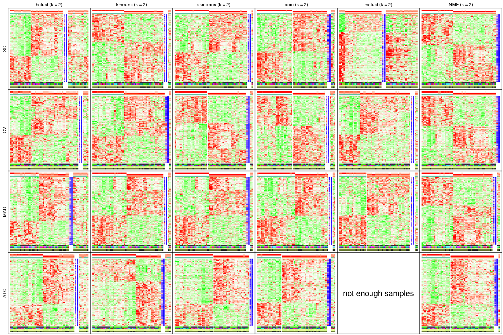</p>

</div>
<div id='tab-collect-get-signatures-2'>
<pre><code class="r">collect_plots(res_list, k = 3, fun = get_signatures, mc.cores = 4)
</code></pre>

<p>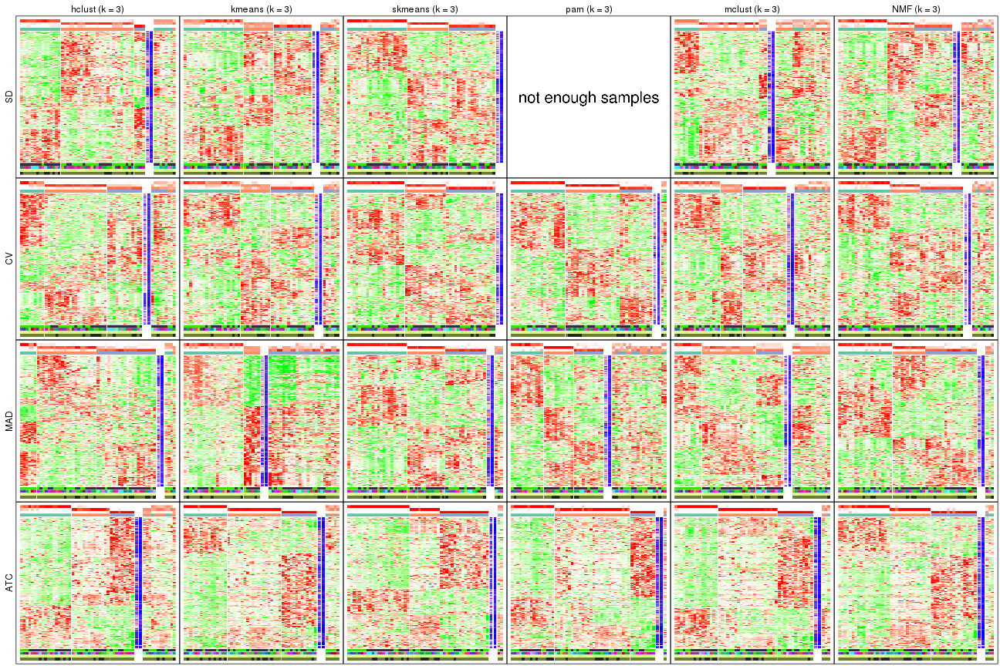</p>

</div>
<div id='tab-collect-get-signatures-3'>
<pre><code class="r">collect_plots(res_list, k = 4, fun = get_signatures, mc.cores = 4)
</code></pre>

<p>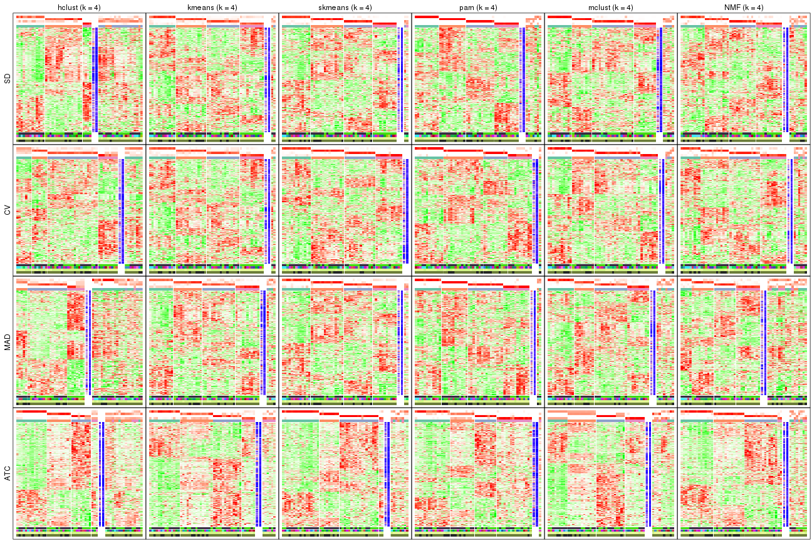</p>

</div>
<div id='tab-collect-get-signatures-4'>
<pre><code class="r">collect_plots(res_list, k = 5, fun = get_signatures, mc.cores = 4)
</code></pre>

<p>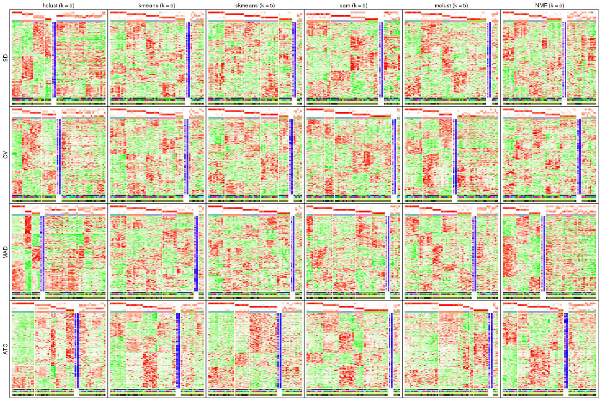</p>

</div>
<div id='tab-collect-get-signatures-5'>
<pre><code class="r">collect_plots(res_list, k = 6, fun = get_signatures, mc.cores = 4)
</code></pre>

<p>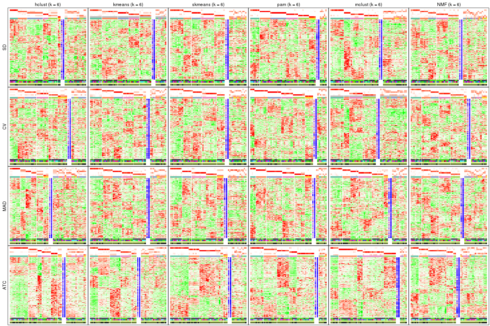</p>

</div>
</div>


### Statistics table

The statistics used for measuring the stability of consensus partitioning.
([How are they
defined?](http://bioconductor.org/packages/devel/bioc/vignettes/cola/inst/doc/cola.html#toc_13))


<script>
$( function() {
	$( '#tabs-get-stats-from-consensus-partition-list' ).tabs();
} );
</script>
<div id='tabs-get-stats-from-consensus-partition-list'>
<ul>
<li><a href='#tab-get-stats-from-consensus-partition-list-1'>k = 2</a></li>
<li><a href='#tab-get-stats-from-consensus-partition-list-2'>k = 3</a></li>
<li><a href='#tab-get-stats-from-consensus-partition-list-3'>k = 4</a></li>
<li><a href='#tab-get-stats-from-consensus-partition-list-4'>k = 5</a></li>
<li><a href='#tab-get-stats-from-consensus-partition-list-5'>k = 6</a></li>
</ul>
<div id='tab-get-stats-from-consensus-partition-list-1'>
<pre><code class="r">get_stats(res_list, k = 2)
</code></pre>

<pre><code>#&gt;             k  1-PAC mean_silhouette concordance area_increased  Rand Jaccard
#&gt; SD:NMF      2 0.9169           0.951       0.977          0.497 0.502   0.502
#&gt; CV:NMF      2 0.9569           0.952       0.977          0.495 0.502   0.502
#&gt; MAD:NMF     2 0.8839           0.927       0.969          0.503 0.497   0.497
#&gt; ATC:NMF     2 0.8855           0.931       0.969          0.477 0.516   0.516
#&gt; SD:skmeans  2 1.0000           0.958       0.983          0.507 0.493   0.493
#&gt; CV:skmeans  2 1.0000           0.951       0.980          0.507 0.493   0.493
#&gt; MAD:skmeans 2 1.0000           0.959       0.984          0.509 0.491   0.491
#&gt; ATC:skmeans 2 1.0000           0.989       0.995          0.509 0.491   0.491
#&gt; SD:mclust   2 0.3487           0.215       0.780          0.304 0.860   0.860
#&gt; CV:mclust   2 0.4675           0.857       0.869          0.344 0.591   0.591
#&gt; MAD:mclust  2 0.3608           0.840       0.833          0.376 0.508   0.508
#&gt; ATC:mclust  2 0.4934           0.000       0.824          0.295 1.000   1.000
#&gt; SD:kmeans   2 0.9608           0.916       0.957          0.503 0.497   0.497
#&gt; CV:kmeans   2 0.9302           0.923       0.946          0.500 0.502   0.502
#&gt; MAD:kmeans  2 0.9608           0.919       0.962          0.507 0.493   0.493
#&gt; ATC:kmeans  2 0.7264           0.888       0.955          0.458 0.535   0.535
#&gt; SD:pam      2 0.8486           0.893       0.960          0.508 0.491   0.491
#&gt; CV:pam      2 0.9208           0.899       0.962          0.508 0.493   0.493
#&gt; MAD:pam     2 0.8494           0.903       0.960          0.506 0.491   0.491
#&gt; ATC:pam     2 0.8259           0.878       0.940          0.461 0.525   0.525
#&gt; SD:hclust   2 0.1124           0.530       0.757          0.393 0.560   0.560
#&gt; CV:hclust   2 0.1702           0.670       0.768          0.390 0.591   0.591
#&gt; MAD:hclust  2 0.0935           0.624       0.780          0.424 0.502   0.502
#&gt; ATC:hclust  2 0.4392           0.700       0.864          0.453 0.493   0.493
</code></pre>

</div>
<div id='tab-get-stats-from-consensus-partition-list-2'>
<pre><code class="r">get_stats(res_list, k = 3)
</code></pre>

<pre><code>#&gt;             k 1-PAC mean_silhouette concordance area_increased  Rand Jaccard
#&gt; SD:NMF      3 0.435           0.591       0.788          0.344 0.756   0.544
#&gt; CV:NMF      3 0.521           0.713       0.849          0.350 0.757   0.546
#&gt; MAD:NMF     3 0.568           0.754       0.858          0.329 0.766   0.559
#&gt; ATC:NMF     3 0.826           0.870       0.941          0.410 0.764   0.562
#&gt; SD:skmeans  3 0.887           0.915       0.936          0.321 0.778   0.575
#&gt; CV:skmeans  3 0.710           0.913       0.925          0.324 0.755   0.541
#&gt; MAD:skmeans 3 0.878           0.893       0.936          0.315 0.747   0.529
#&gt; ATC:skmeans 3 1.000           0.953       0.982          0.280 0.830   0.666
#&gt; SD:mclust   3 0.155           0.413       0.656          0.750 0.635   0.584
#&gt; CV:mclust   3 0.399           0.588       0.756          0.664 0.672   0.490
#&gt; MAD:mclust  3 0.239           0.618       0.683          0.469 0.857   0.742
#&gt; ATC:mclust  3 0.971           0.927       0.973          1.232 0.342   0.342
#&gt; SD:kmeans   3 0.400           0.601       0.701          0.301 0.820   0.647
#&gt; CV:kmeans   3 0.436           0.588       0.718          0.310 0.785   0.593
#&gt; MAD:kmeans  3 0.467           0.426       0.624          0.291 0.829   0.675
#&gt; ATC:kmeans  3 0.889           0.893       0.956          0.440 0.660   0.440
#&gt; SD:pam      3 0.583           0.421       0.694          0.315 0.681   0.436
#&gt; CV:pam      3 0.937           0.894       0.942          0.296 0.802   0.615
#&gt; MAD:pam     3 0.472           0.512       0.789          0.309 0.737   0.513
#&gt; ATC:pam     3 0.828           0.910       0.961          0.359 0.720   0.528
#&gt; SD:hclust   3 0.279           0.688       0.807          0.458 0.706   0.542
#&gt; CV:hclust   3 0.216           0.614       0.774          0.479 0.659   0.475
#&gt; MAD:hclust  3 0.235           0.676       0.807          0.383 0.862   0.724
#&gt; ATC:hclust  3 0.550           0.680       0.862          0.396 0.713   0.499
</code></pre>

</div>
<div id='tab-get-stats-from-consensus-partition-list-3'>
<pre><code class="r">get_stats(res_list, k = 4)
</code></pre>

<pre><code>#&gt;             k 1-PAC mean_silhouette concordance area_increased  Rand Jaccard
#&gt; SD:NMF      4 0.649           0.692       0.838         0.1349 0.798   0.474
#&gt; CV:NMF      4 0.642           0.695       0.839         0.1354 0.853   0.588
#&gt; MAD:NMF     4 0.539           0.568       0.764         0.1329 0.834   0.548
#&gt; ATC:NMF     4 0.666           0.738       0.874         0.0816 0.936   0.806
#&gt; SD:skmeans  4 0.863           0.894       0.934         0.1344 0.862   0.608
#&gt; CV:skmeans  4 0.887           0.916       0.938         0.1330 0.853   0.587
#&gt; MAD:skmeans 4 0.754           0.822       0.888         0.1348 0.846   0.572
#&gt; ATC:skmeans 4 0.851           0.790       0.918         0.0989 0.932   0.809
#&gt; SD:mclust   4 0.853           0.851       0.928         0.3837 0.670   0.417
#&gt; CV:mclust   4 0.820           0.836       0.926         0.2631 0.841   0.606
#&gt; MAD:mclust  4 0.570           0.698       0.832         0.3135 0.725   0.439
#&gt; ATC:mclust  4 0.758           0.630       0.755         0.1113 0.823   0.532
#&gt; SD:kmeans   4 0.623           0.789       0.830         0.1447 0.849   0.589
#&gt; CV:kmeans   4 0.591           0.761       0.824         0.1410 0.808   0.502
#&gt; MAD:kmeans  4 0.621           0.716       0.792         0.1429 0.771   0.463
#&gt; ATC:kmeans  4 0.648           0.658       0.794         0.1238 0.855   0.597
#&gt; SD:pam      4 0.921           0.855       0.940         0.1357 0.846   0.570
#&gt; CV:pam      4 0.856           0.896       0.945         0.1364 0.875   0.650
#&gt; MAD:pam     4 0.911           0.902       0.957         0.1473 0.751   0.389
#&gt; ATC:pam     4 0.724           0.844       0.866         0.1669 0.869   0.656
#&gt; SD:hclust   4 0.443           0.473       0.657         0.1577 0.771   0.518
#&gt; CV:hclust   4 0.359           0.653       0.712         0.1712 0.886   0.705
#&gt; MAD:hclust  4 0.370           0.498       0.664         0.1842 0.941   0.837
#&gt; ATC:hclust  4 0.608           0.534       0.736         0.1305 0.913   0.764
</code></pre>

</div>
<div id='tab-get-stats-from-consensus-partition-list-4'>
<pre><code class="r">get_stats(res_list, k = 5)
</code></pre>

<pre><code>#&gt;             k 1-PAC mean_silhouette concordance area_increased  Rand Jaccard
#&gt; SD:NMF      5 0.591           0.550       0.755         0.0640 0.832   0.438
#&gt; CV:NMF      5 0.604           0.644       0.764         0.0652 0.845   0.466
#&gt; MAD:NMF     5 0.576           0.353       0.650         0.0638 0.850   0.519
#&gt; ATC:NMF     5 0.627           0.612       0.799         0.0715 0.843   0.508
#&gt; SD:skmeans  5 0.872           0.851       0.920         0.0650 0.899   0.615
#&gt; CV:skmeans  5 0.785           0.792       0.882         0.0627 0.915   0.668
#&gt; MAD:skmeans 5 0.856           0.835       0.916         0.0674 0.883   0.567
#&gt; ATC:skmeans 5 0.773           0.687       0.845         0.0509 0.958   0.859
#&gt; SD:mclust   5 0.703           0.781       0.844         0.0631 0.834   0.486
#&gt; CV:mclust   5 0.670           0.557       0.764         0.0735 0.899   0.663
#&gt; MAD:mclust  5 0.682           0.632       0.786         0.0879 0.865   0.540
#&gt; ATC:mclust  5 0.789           0.832       0.914         0.0146 0.808   0.448
#&gt; SD:kmeans   5 0.721           0.725       0.809         0.0685 0.904   0.636
#&gt; CV:kmeans   5 0.675           0.659       0.767         0.0674 0.934   0.735
#&gt; MAD:kmeans  5 0.733           0.752       0.831         0.0729 0.883   0.570
#&gt; ATC:kmeans  5 0.667           0.592       0.777         0.0715 0.890   0.601
#&gt; SD:pam      5 0.817           0.728       0.857         0.0593 0.935   0.745
#&gt; CV:pam      5 0.813           0.833       0.874         0.0680 0.945   0.783
#&gt; MAD:pam     5 0.821           0.790       0.896         0.0569 0.921   0.690
#&gt; ATC:pam     5 0.744           0.805       0.885         0.0716 0.958   0.831
#&gt; SD:hclust   5 0.510           0.527       0.706         0.1160 0.782   0.454
#&gt; CV:hclust   5 0.452           0.459       0.657         0.0920 0.813   0.474
#&gt; MAD:hclust  5 0.513           0.440       0.693         0.1056 0.766   0.400
#&gt; ATC:hclust  5 0.604           0.620       0.749         0.0486 0.832   0.511
</code></pre>

</div>
<div id='tab-get-stats-from-consensus-partition-list-5'>
<pre><code class="r">get_stats(res_list, k = 6)
</code></pre>

<pre><code>#&gt;             k 1-PAC mean_silhouette concordance area_increased  Rand Jaccard
#&gt; SD:NMF      6 0.642           0.553       0.748         0.0369 0.866   0.453
#&gt; CV:NMF      6 0.681           0.589       0.753         0.0374 0.902   0.557
#&gt; MAD:NMF     6 0.660           0.536       0.736         0.0395 0.814   0.367
#&gt; ATC:NMF     6 0.647           0.545       0.759         0.0437 0.929   0.695
#&gt; SD:skmeans  6 0.789           0.630       0.808         0.0372 0.956   0.778
#&gt; CV:skmeans  6 0.771           0.634       0.804         0.0386 0.969   0.841
#&gt; MAD:skmeans 6 0.806           0.668       0.810         0.0372 0.953   0.761
#&gt; ATC:skmeans 6 0.720           0.663       0.826         0.0382 0.959   0.849
#&gt; SD:mclust   6 0.764           0.655       0.797         0.0457 0.971   0.861
#&gt; CV:mclust   6 0.673           0.515       0.707         0.0449 0.899   0.605
#&gt; MAD:mclust  6 0.750           0.658       0.822         0.0433 0.932   0.690
#&gt; ATC:mclust  6 0.774           0.735       0.870         0.0727 0.902   0.667
#&gt; SD:kmeans   6 0.727           0.621       0.752         0.0396 0.943   0.739
#&gt; CV:kmeans   6 0.725           0.614       0.766         0.0419 0.936   0.699
#&gt; MAD:kmeans  6 0.751           0.658       0.808         0.0408 0.966   0.825
#&gt; ATC:kmeans  6 0.675           0.508       0.734         0.0396 0.925   0.677
#&gt; SD:pam      6 0.912           0.850       0.936         0.0452 0.947   0.742
#&gt; CV:pam      6 0.851           0.781       0.900         0.0472 0.948   0.745
#&gt; MAD:pam     6 0.871           0.745       0.891         0.0468 0.899   0.552
#&gt; ATC:pam     6 0.718           0.730       0.861         0.0220 0.989   0.946
#&gt; SD:hclust   6 0.576           0.517       0.723         0.0595 0.797   0.412
#&gt; CV:hclust   6 0.569           0.609       0.726         0.0765 0.922   0.685
#&gt; MAD:hclust  6 0.588           0.468       0.632         0.0557 0.790   0.321
#&gt; ATC:hclust  6 0.685           0.630       0.769         0.0549 0.962   0.835
</code></pre>

</div>
</div>

Following heatmap plots the partition for each combination of methods and the
lightness correspond to the silhouette scores for samples in each method. On
top the consensus subgroup is inferred from all methods by taking the mean
silhouette scores as weight.


<script>
$( function() {
	$( '#tabs-collect-stats-from-consensus-partition-list' ).tabs();
} );
</script>
<div id='tabs-collect-stats-from-consensus-partition-list'>
<ul>
<li><a href='#tab-collect-stats-from-consensus-partition-list-1'>k = 2</a></li>
<li><a href='#tab-collect-stats-from-consensus-partition-list-2'>k = 3</a></li>
<li><a href='#tab-collect-stats-from-consensus-partition-list-3'>k = 4</a></li>
<li><a href='#tab-collect-stats-from-consensus-partition-list-4'>k = 5</a></li>
<li><a href='#tab-collect-stats-from-consensus-partition-list-5'>k = 6</a></li>
</ul>
<div id='tab-collect-stats-from-consensus-partition-list-1'>
<pre><code class="r">collect_stats(res_list, k = 2)
</code></pre>

<p>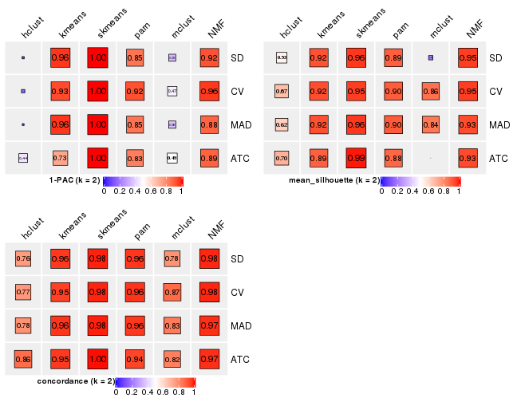</p>

</div>
<div id='tab-collect-stats-from-consensus-partition-list-2'>
<pre><code class="r">collect_stats(res_list, k = 3)
</code></pre>

<p>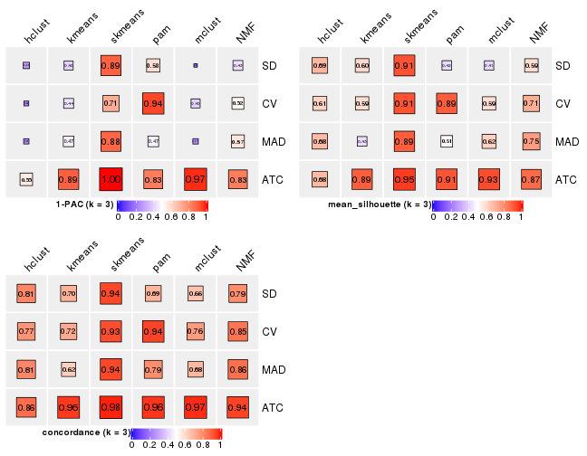</p>

</div>
<div id='tab-collect-stats-from-consensus-partition-list-3'>
<pre><code class="r">collect_stats(res_list, k = 4)
</code></pre>

<p>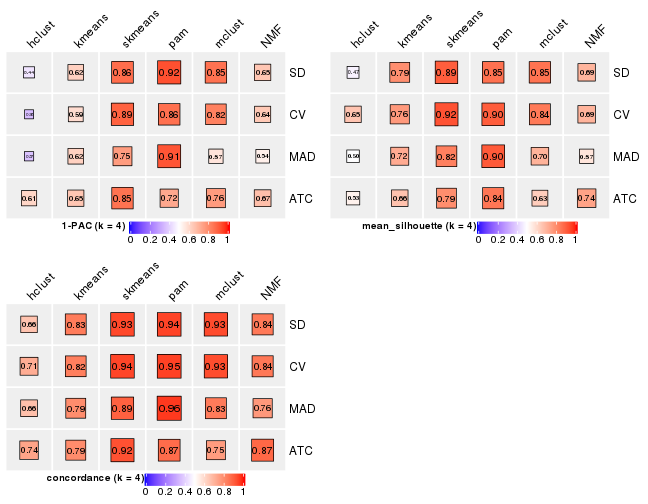</p>

</div>
<div id='tab-collect-stats-from-consensus-partition-list-4'>
<pre><code class="r">collect_stats(res_list, k = 5)
</code></pre>

<p>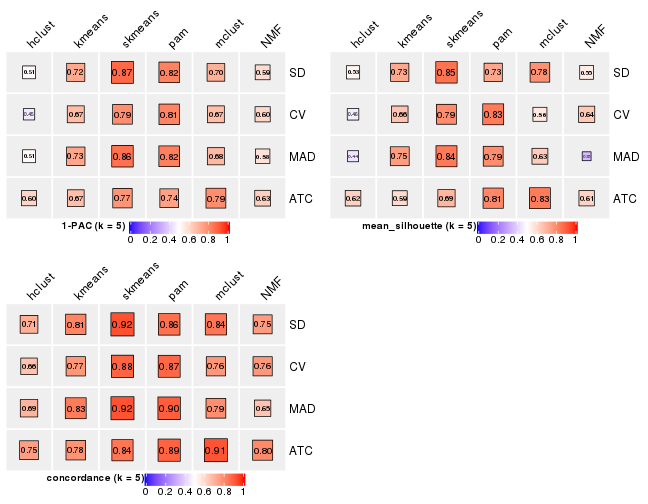</p>

</div>
<div id='tab-collect-stats-from-consensus-partition-list-5'>
<pre><code class="r">collect_stats(res_list, k = 6)
</code></pre>

<p>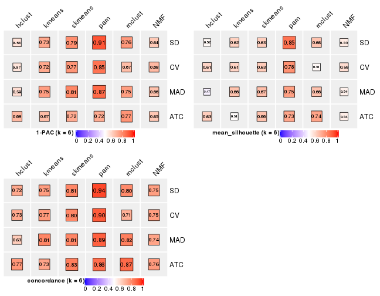</p>

</div>
</div>

### Partition from all methods


Collect partitions from all methods:


<script>
$( function() {
	$( '#tabs-collect-classes-from-consensus-partition-list' ).tabs();
} );
</script>
<div id='tabs-collect-classes-from-consensus-partition-list'>
<ul>
<li><a href='#tab-collect-classes-from-consensus-partition-list-1'>k = 2</a></li>
<li><a href='#tab-collect-classes-from-consensus-partition-list-2'>k = 3</a></li>
<li><a href='#tab-collect-classes-from-consensus-partition-list-3'>k = 4</a></li>
<li><a href='#tab-collect-classes-from-consensus-partition-list-4'>k = 5</a></li>
<li><a href='#tab-collect-classes-from-consensus-partition-list-5'>k = 6</a></li>
</ul>
<div id='tab-collect-classes-from-consensus-partition-list-1'>
<pre><code class="r">collect_classes(res_list, k = 2)
</code></pre>

<p>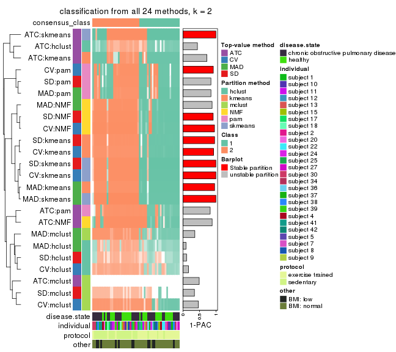</p>

</div>
<div id='tab-collect-classes-from-consensus-partition-list-2'>
<pre><code class="r">collect_classes(res_list, k = 3)
</code></pre>

<p>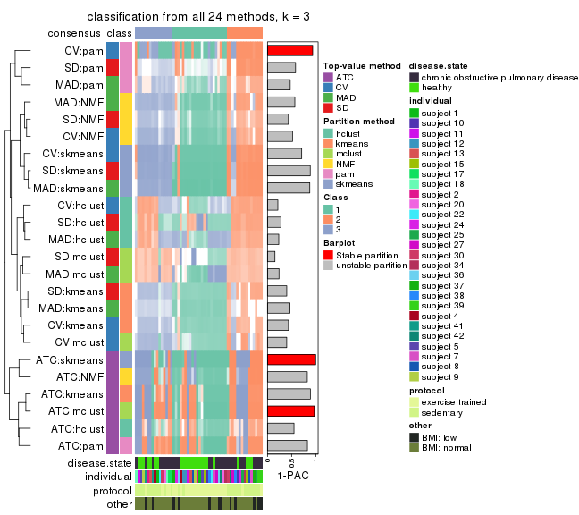</p>

</div>
<div id='tab-collect-classes-from-consensus-partition-list-3'>
<pre><code class="r">collect_classes(res_list, k = 4)
</code></pre>

<p>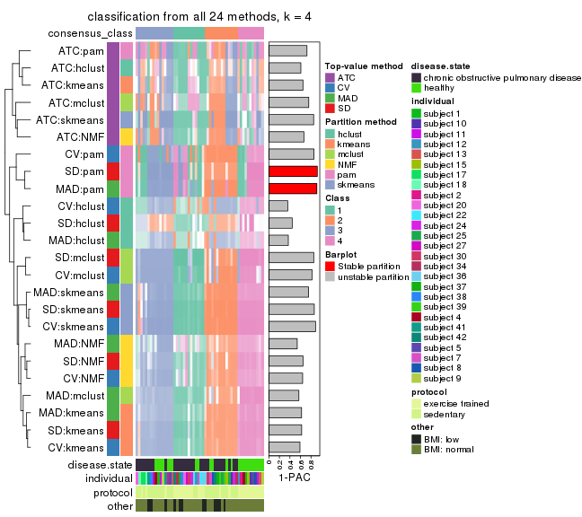</p>

</div>
<div id='tab-collect-classes-from-consensus-partition-list-4'>
<pre><code class="r">collect_classes(res_list, k = 5)
</code></pre>

<p>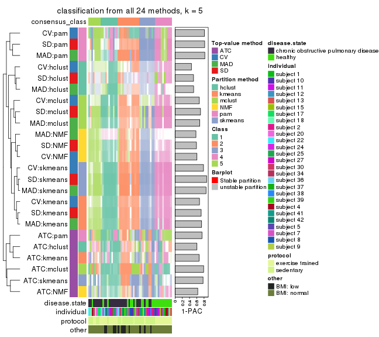</p>

</div>
<div id='tab-collect-classes-from-consensus-partition-list-5'>
<pre><code class="r">collect_classes(res_list, k = 6)
</code></pre>

<p>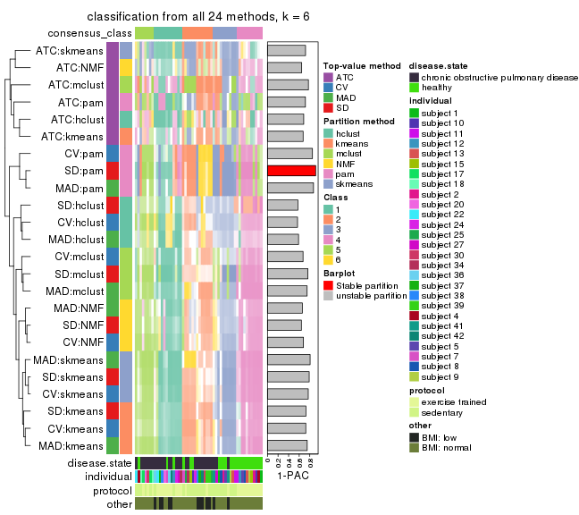</p>

</div>
</div>


### Top rows overlap


Overlap of top rows from different top-row methods:


<script>
$( function() {
	$( '#tabs-top-rows-overlap-by-euler' ).tabs();
} );
</script>
<div id='tabs-top-rows-overlap-by-euler'>
<ul>
<li><a href='#tab-top-rows-overlap-by-euler-1'>top_n = 1000</a></li>
<li><a href='#tab-top-rows-overlap-by-euler-2'>top_n = 2000</a></li>
<li><a href='#tab-top-rows-overlap-by-euler-3'>top_n = 3000</a></li>
<li><a href='#tab-top-rows-overlap-by-euler-4'>top_n = 4000</a></li>
<li><a href='#tab-top-rows-overlap-by-euler-5'>top_n = 5000</a></li>
</ul>
<div id='tab-top-rows-overlap-by-euler-1'>
<pre><code class="r">top_rows_overlap(res_list, top_n = 1000, method = &quot;euler&quot;)
</code></pre>

<p>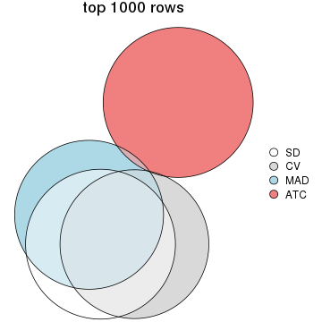</p>

</div>
<div id='tab-top-rows-overlap-by-euler-2'>
<pre><code class="r">top_rows_overlap(res_list, top_n = 2000, method = &quot;euler&quot;)
</code></pre>

<p>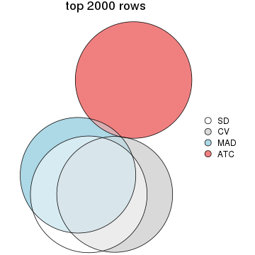</p>

</div>
<div id='tab-top-rows-overlap-by-euler-3'>
<pre><code class="r">top_rows_overlap(res_list, top_n = 3000, method = &quot;euler&quot;)
</code></pre>

<p>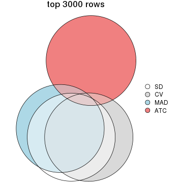</p>

</div>
<div id='tab-top-rows-overlap-by-euler-4'>
<pre><code class="r">top_rows_overlap(res_list, top_n = 4000, method = &quot;euler&quot;)
</code></pre>

<p>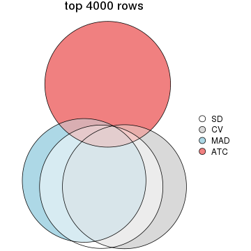</p>

</div>
<div id='tab-top-rows-overlap-by-euler-5'>
<pre><code class="r">top_rows_overlap(res_list, top_n = 5000, method = &quot;euler&quot;)
</code></pre>

<p>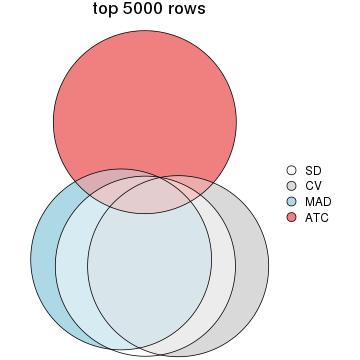</p>

</div>
</div>

Also visualize the correspondance of rankings between different top-row methods:


<script>
$( function() {
	$( '#tabs-top-rows-overlap-by-correspondance' ).tabs();
} );
</script>
<div id='tabs-top-rows-overlap-by-correspondance'>
<ul>
<li><a href='#tab-top-rows-overlap-by-correspondance-1'>top_n = 1000</a></li>
<li><a href='#tab-top-rows-overlap-by-correspondance-2'>top_n = 2000</a></li>
<li><a href='#tab-top-rows-overlap-by-correspondance-3'>top_n = 3000</a></li>
<li><a href='#tab-top-rows-overlap-by-correspondance-4'>top_n = 4000</a></li>
<li><a href='#tab-top-rows-overlap-by-correspondance-5'>top_n = 5000</a></li>
</ul>
<div id='tab-top-rows-overlap-by-correspondance-1'>
<pre><code class="r">top_rows_overlap(res_list, top_n = 1000, method = &quot;correspondance&quot;)
</code></pre>

<p>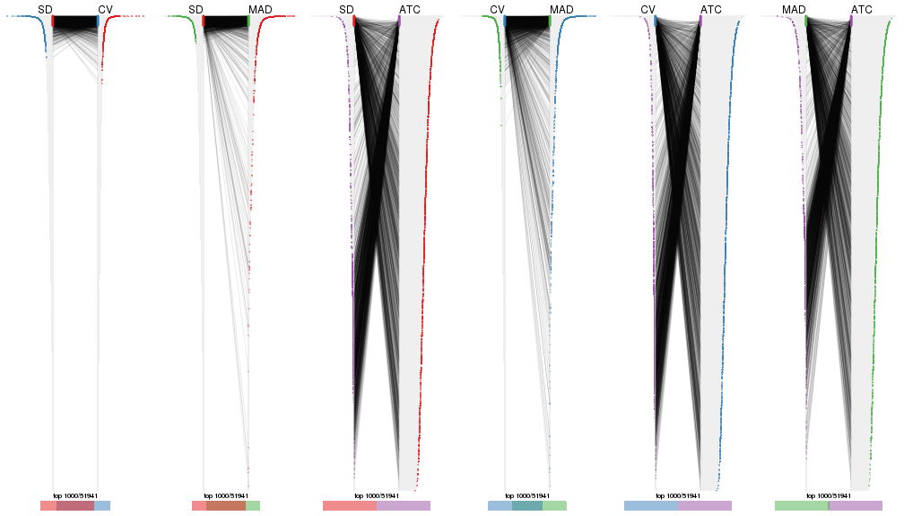</p>

</div>
<div id='tab-top-rows-overlap-by-correspondance-2'>
<pre><code class="r">top_rows_overlap(res_list, top_n = 2000, method = &quot;correspondance&quot;)
</code></pre>

<p>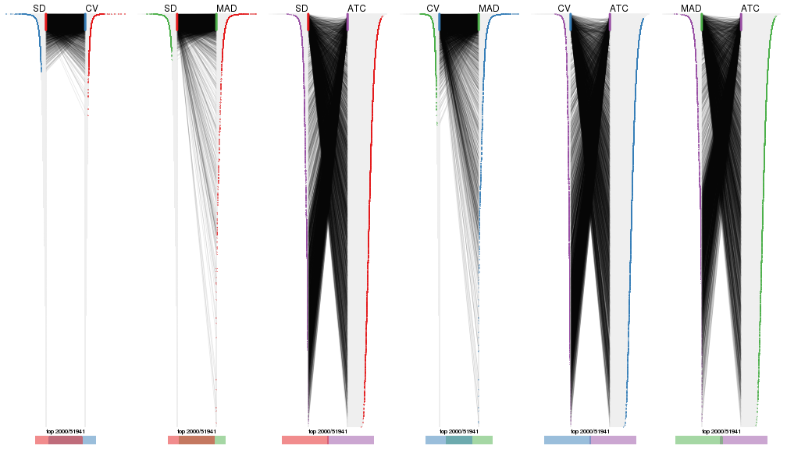</p>

</div>
<div id='tab-top-rows-overlap-by-correspondance-3'>
<pre><code class="r">top_rows_overlap(res_list, top_n = 3000, method = &quot;correspondance&quot;)
</code></pre>

<p>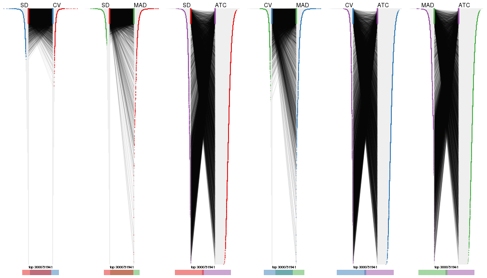</p>

</div>
<div id='tab-top-rows-overlap-by-correspondance-4'>
<pre><code class="r">top_rows_overlap(res_list, top_n = 4000, method = &quot;correspondance&quot;)
</code></pre>

<p>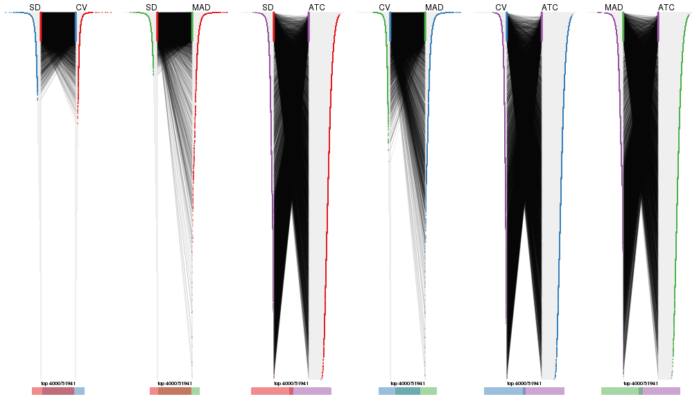</p>

</div>
<div id='tab-top-rows-overlap-by-correspondance-5'>
<pre><code class="r">top_rows_overlap(res_list, top_n = 5000, method = &quot;correspondance&quot;)
</code></pre>

<p>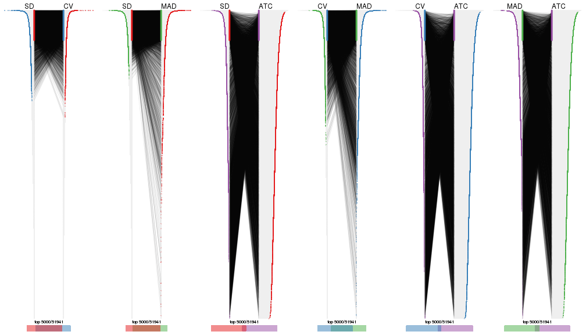</p>

</div>
</div>


Heatmaps of the top rows:


<script>
$( function() {
	$( '#tabs-top-rows-heatmap' ).tabs();
} );
</script>
<div id='tabs-top-rows-heatmap'>
<ul>
<li><a href='#tab-top-rows-heatmap-1'>top_n = 1000</a></li>
<li><a href='#tab-top-rows-heatmap-2'>top_n = 2000</a></li>
<li><a href='#tab-top-rows-heatmap-3'>top_n = 3000</a></li>
<li><a href='#tab-top-rows-heatmap-4'>top_n = 4000</a></li>
<li><a href='#tab-top-rows-heatmap-5'>top_n = 5000</a></li>
</ul>
<div id='tab-top-rows-heatmap-1'>
<pre><code class="r">top_rows_heatmap(res_list, top_n = 1000)
</code></pre>

<p>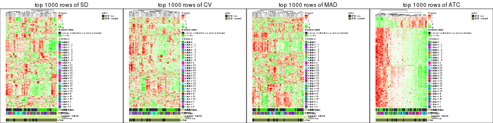</p>

</div>
<div id='tab-top-rows-heatmap-2'>
<pre><code class="r">top_rows_heatmap(res_list, top_n = 2000)
</code></pre>

<p>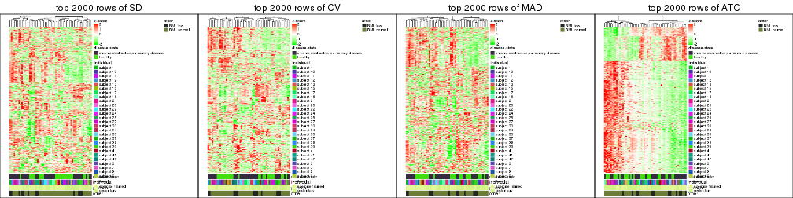</p>

</div>
<div id='tab-top-rows-heatmap-3'>
<pre><code class="r">top_rows_heatmap(res_list, top_n = 3000)
</code></pre>

<p>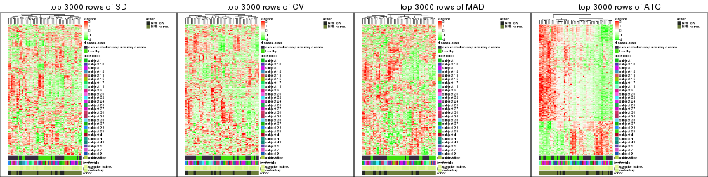</p>

</div>
<div id='tab-top-rows-heatmap-4'>
<pre><code class="r">top_rows_heatmap(res_list, top_n = 4000)
</code></pre>

<p>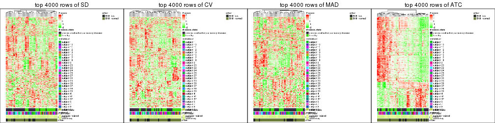</p>

</div>
<div id='tab-top-rows-heatmap-5'>
<pre><code class="r">top_rows_heatmap(res_list, top_n = 5000)
</code></pre>

<p>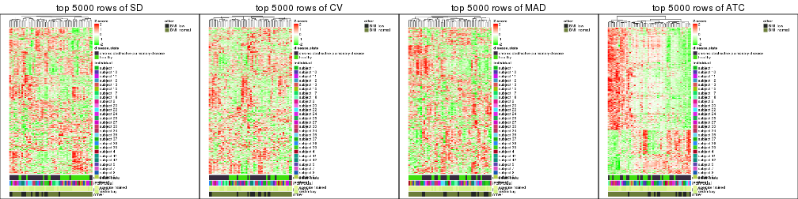</p>

</div>
</div>


### Test to known annotations


Test correlation between subgroups and known annotations. If the known
annotation is numeric, one-way ANOVA test is applied, and if the known
annotation is discrete, chi-squared contingency table test is applied.


<script>
$( function() {
	$( '#tabs-test-to-known-factors-from-consensus-partition-list' ).tabs();
} );
</script>
<div id='tabs-test-to-known-factors-from-consensus-partition-list'>
<ul>
<li><a href='#tab-test-to-known-factors-from-consensus-partition-list-1'>k = 2</a></li>
<li><a href='#tab-test-to-known-factors-from-consensus-partition-list-2'>k = 3</a></li>
<li><a href='#tab-test-to-known-factors-from-consensus-partition-list-3'>k = 4</a></li>
<li><a href='#tab-test-to-known-factors-from-consensus-partition-list-4'>k = 5</a></li>
<li><a href='#tab-test-to-known-factors-from-consensus-partition-list-5'>k = 6</a></li>
</ul>
<div id='tab-test-to-known-factors-from-consensus-partition-list-1'>
<pre><code class="r">test_to_known_factors(res_list, k = 2)
</code></pre>

<pre><code>#&gt;              n disease.state(p) individual(p) protocol(p) other(p) k
#&gt; SD:NMF      54           0.2071         0.826    1.07e-05    0.686 2
#&gt; CV:NMF      54           0.2071         0.826    1.07e-05    0.686 2
#&gt; MAD:NMF     52           0.2912         0.892    2.38e-06    0.803 2
#&gt; ATC:NMF     53           0.5690         0.591    1.12e-03    0.617 2
#&gt; SD:skmeans  53           0.5145         0.996    1.76e-08    0.446 2
#&gt; CV:skmeans  52           0.4271         0.992    2.92e-08    0.493 2
#&gt; MAD:skmeans 52           0.5924         0.992    2.84e-08    0.592 2
#&gt; ATC:skmeans 54           0.6047         0.465    5.66e-02    0.856 2
#&gt; SD:mclust   31           0.0113         0.335    3.18e-02    0.515 2
#&gt; CV:mclust   52           0.9241         0.776    1.17e-04    1.000 2
#&gt; MAD:mclust  52           0.1277         0.934    1.26e-06    0.610 2
#&gt; ATC:mclust   0               NA            NA          NA       NA 2
#&gt; SD:kmeans   52           0.2912         0.979    1.31e-07    0.592 2
#&gt; CV:kmeans   53           0.2457         0.968    3.22e-07    0.639 2
#&gt; MAD:kmeans  52           0.5924         0.992    2.84e-08    0.592 2
#&gt; ATC:kmeans  50           0.3483         0.344    3.92e-02    0.299 2
#&gt; SD:pam      51           0.4676         0.634    1.26e-03    0.151 2
#&gt; CV:pam      50           0.7394         0.578    1.85e-03    0.404 2
#&gt; MAD:pam     52           0.3789         0.529    2.21e-03    0.183 2
#&gt; ATC:pam     51           0.3408         0.728    8.77e-04    0.382 2
#&gt; SD:hclust   39           0.3474         0.657    2.31e-04    1.000 2
#&gt; CV:hclust   50           0.1689         0.957    6.51e-06    0.551 2
#&gt; MAD:hclust  43           0.2744         0.520    4.54e-04    0.929 2
#&gt; ATC:hclust  47           0.4727         0.410    2.84e-02    0.543 2
</code></pre>

</div>
<div id='tab-test-to-known-factors-from-consensus-partition-list-2'>
<pre><code class="r">test_to_known_factors(res_list, k = 3)
</code></pre>

<pre><code>#&gt;              n disease.state(p) individual(p) protocol(p) other(p) k
#&gt; SD:NMF      42         1.11e-01        0.3641    4.12e-05  0.71220 3
#&gt; CV:NMF      46         1.53e-01        0.4872    7.42e-06  0.70705 3
#&gt; MAD:NMF     51         5.84e-02        0.3490    8.43e-06  0.65483 3
#&gt; ATC:NMF     51         3.73e-01        0.4199    3.80e-04  0.10927 3
#&gt; SD:skmeans  54         1.42e-01        0.8084    1.84e-07  0.47590 3
#&gt; CV:skmeans  54         9.36e-02        0.8155    5.54e-07  0.39917 3
#&gt; MAD:skmeans 51         2.02e-01        0.7105    6.43e-07  0.30021 3
#&gt; ATC:skmeans 52         1.65e-01        0.5003    3.09e-03  0.04214 3
#&gt; SD:mclust   34         1.29e-02        0.4791    1.92e-04  0.50207 3
#&gt; CV:mclust   41         1.35e-01        0.3797    2.17e-05  0.49450 3
#&gt; MAD:mclust  40         3.32e-05        0.4734    2.19e-06  0.07649 3
#&gt; ATC:mclust  51         4.54e-01        0.4275    4.20e-03  0.16901 3
#&gt; SD:kmeans   47         2.25e-01        0.5509    1.38e-06  0.36256 3
#&gt; CV:kmeans   48         1.62e-01        0.6369    2.92e-06  0.67059 3
#&gt; MAD:kmeans  28         1.67e-01        0.6397    3.09e-04  1.00000 3
#&gt; ATC:kmeans  49         2.57e-01        0.3962    3.64e-03  0.17809 3
#&gt; SD:pam      17               NA            NA          NA       NA 3
#&gt; CV:pam      52         4.35e-01        0.0936    1.18e-03  0.00941 3
#&gt; MAD:pam     34         3.80e-02        0.3851    1.83e-04  0.24468 3
#&gt; ATC:pam     53         2.29e-01        0.3835    5.52e-04  0.09660 3
#&gt; SD:hclust   46         2.01e-04        0.2743    2.81e-03  0.14790 3
#&gt; CV:hclust   45         1.04e-04        0.2603    9.45e-05  0.19017 3
#&gt; MAD:hclust  50         2.06e-04        0.3780    2.62e-04  0.35781 3
#&gt; ATC:hclust  42         1.51e-01        0.2602    3.13e-03  0.16388 3
</code></pre>

</div>
<div id='tab-test-to-known-factors-from-consensus-partition-list-3'>
<pre><code class="r">test_to_known_factors(res_list, k = 4)
</code></pre>

<pre><code>#&gt;              n disease.state(p) individual(p) protocol(p) other(p) k
#&gt; SD:NMF      46         0.000552        0.3713    8.12e-05   0.0221 4
#&gt; CV:NMF      48         0.004563        0.3205    2.80e-05   0.0937 4
#&gt; MAD:NMF     36         0.000955        0.2071    9.66e-04   0.1239 4
#&gt; ATC:NMF     46         0.154812        0.7067    9.82e-04   0.1208 4
#&gt; SD:skmeans  52         0.000141        0.7098    1.49e-07   0.2016 4
#&gt; CV:skmeans  54         0.000591        0.7511    2.60e-07   0.1678 4
#&gt; MAD:skmeans 52         0.000141        0.7098    1.49e-07   0.2016 4
#&gt; ATC:skmeans 46         0.025302        0.1798    2.30e-03   0.0240 4
#&gt; SD:mclust   49         0.000201        0.3027    8.73e-05   0.1409 4
#&gt; CV:mclust   50         0.001368        0.4592    1.77e-04   0.2552 4
#&gt; MAD:mclust  46         0.000124        0.3518    3.43e-05   0.2156 4
#&gt; ATC:mclust  44         0.094504        0.3769    9.75e-04   0.0356 4
#&gt; SD:kmeans   52         0.000304        0.5982    2.38e-06   0.1479 4
#&gt; CV:kmeans   52         0.000304        0.5982    2.38e-06   0.1479 4
#&gt; MAD:kmeans  50         0.000587        0.6547    1.41e-06   0.1687 4
#&gt; ATC:kmeans  48         0.194094        0.1898    3.17e-02   0.0715 4
#&gt; SD:pam      47         0.104982        0.2781    5.48e-05   0.0368 4
#&gt; CV:pam      53         0.468660        0.3829    3.69e-05   0.0302 4
#&gt; MAD:pam     52         0.072421        0.2879    1.23e-04   0.0383 4
#&gt; ATC:pam     53         0.051116        0.2469    1.13e-04   0.0137 4
#&gt; SD:hclust   34         0.001140        0.6746    3.01e-05   0.1568 4
#&gt; CV:hclust   46         0.000209        0.0218    3.30e-04   0.0198 4
#&gt; MAD:hclust  31         0.001706        0.3980    9.86e-05   0.0531 4
#&gt; ATC:hclust  37         0.143567        0.3661    1.53e-02   0.0888 4
</code></pre>

</div>
<div id='tab-test-to-known-factors-from-consensus-partition-list-4'>
<pre><code class="r">test_to_known_factors(res_list, k = 5)
</code></pre>

<pre><code>#&gt;              n disease.state(p) individual(p) protocol(p) other(p) k
#&gt; SD:NMF      36         9.51e-03        0.3528    3.57e-03  0.36632 5
#&gt; CV:NMF      45         1.16e-03        0.4018    1.25e-04  0.18451 5
#&gt; MAD:NMF     23         2.65e-03        0.2685    7.78e-01  0.40697 5
#&gt; ATC:NMF     37         6.00e-02        0.7074    2.24e-05  0.08693 5
#&gt; SD:skmeans  51         3.95e-05        0.1910    7.61e-06  0.07089 5
#&gt; CV:skmeans  49         9.02e-05        0.3295    7.61e-06  0.09783 5
#&gt; MAD:skmeans 50         1.76e-05        0.1896    1.17e-05  0.05464 5
#&gt; ATC:skmeans 43         4.05e-02        0.0715    1.65e-03  0.03452 5
#&gt; SD:mclust   50         4.56e-05        0.4263    5.02e-05  0.23931 5
#&gt; CV:mclust   29         3.98e-04        0.3123    6.51e-04  0.16276 5
#&gt; MAD:mclust  41         9.93e-06        0.3335    2.00e-04  0.07270 5
#&gt; ATC:mclust  51         2.02e-01        0.6311    2.23e-05  0.22670 5
#&gt; SD:kmeans   46         6.53e-05        0.4170    3.05e-05  0.08302 5
#&gt; CV:kmeans   45         2.08e-04        0.4103    2.88e-05  0.12558 5
#&gt; MAD:kmeans  51         2.54e-04        0.2499    1.56e-05  0.18695 5
#&gt; ATC:kmeans  40         4.04e-02        0.5451    1.60e-03  0.00976 5
#&gt; SD:pam      44         7.85e-02        0.4106    8.10e-05  0.09554 5
#&gt; CV:pam      52         1.67e-01        0.2525    1.73e-04  0.00216 5
#&gt; MAD:pam     48         1.14e-02        0.3662    1.74e-04  0.01031 5
#&gt; ATC:pam     50         1.44e-01        0.2386    2.51e-04  0.04781 5
#&gt; SD:hclust   24         2.50e-05        0.0871    3.83e-02  0.13734 5
#&gt; CV:hclust   27         4.04e-04        0.7112    1.79e-04  0.18535 5
#&gt; MAD:hclust  17         5.43e-03        0.1350    6.50e-02  0.13567 5
#&gt; ATC:hclust  38         7.94e-02        0.4254    2.21e-02  0.11562 5
</code></pre>

</div>
<div id='tab-test-to-known-factors-from-consensus-partition-list-5'>
<pre><code class="r">test_to_known_factors(res_list, k = 6)
</code></pre>

<pre><code>#&gt;              n disease.state(p) individual(p) protocol(p) other(p) k
#&gt; SD:NMF      37         2.62e-03        0.5171    6.83e-04 6.83e-02 6
#&gt; CV:NMF      42         5.27e-04        0.1871    2.06e-03 2.68e-02 6
#&gt; MAD:NMF     37         2.06e-04        0.4434    3.29e-04 2.11e-01 6
#&gt; ATC:NMF     35         1.06e-01        0.4374    1.74e-04 1.05e-01 6
#&gt; SD:skmeans  41         4.67e-05        0.4206    2.29e-04 3.17e-02 6
#&gt; CV:skmeans  41         7.20e-05        0.6225    9.13e-05 3.17e-02 6
#&gt; MAD:skmeans 40         1.13e-05        0.3937    3.79e-04 1.85e-02 6
#&gt; ATC:skmeans 43         1.20e-01        0.3257    3.44e-04 2.30e-02 6
#&gt; SD:mclust   36         1.22e-04        0.5370    8.84e-04 1.60e-01 6
#&gt; CV:mclust   34         1.16e-04        0.2505    6.43e-03 3.56e-02 6
#&gt; MAD:mclust  43         3.84e-05        0.4787    1.90e-04 1.94e-02 6
#&gt; ATC:mclust  49         3.88e-01        0.6404    4.37e-05 1.21e-01 6
#&gt; SD:kmeans   46         3.48e-04        0.2419    1.06e-04 5.24e-02 6
#&gt; CV:kmeans   42         2.81e-04        0.4343    1.69e-04 1.35e-03 6
#&gt; MAD:kmeans  43         4.00e-04        0.5472    3.61e-04 2.86e-02 6
#&gt; ATC:kmeans  35         1.01e-01        0.5023    8.11e-04 1.24e-02 6
#&gt; SD:pam      49         3.77e-02        0.2642    1.94e-05 1.20e-02 6
#&gt; CV:pam      47         4.25e-02        0.2707    3.60e-04 8.25e-05 6
#&gt; MAD:pam     46         3.42e-02        0.3032    1.61e-05 2.04e-03 6
#&gt; ATC:pam     48         7.44e-02        0.1650    3.25e-04 2.04e-02 6
#&gt; SD:hclust   38         9.48e-05        0.0171    5.55e-04 1.60e-02 6
#&gt; CV:hclust   43         7.70e-05        0.0664    4.69e-04 2.74e-02 6
#&gt; MAD:hclust  29         4.47e-04        0.0180    1.89e-02 4.66e-02 6
#&gt; ATC:hclust  39         1.28e-01        0.3463    3.99e-02 7.44e-02 6
</code></pre>

</div>
</div>


 
## Results for each method


---------------------------------------------------


### SD:hclust


The object with results only for a single top-value method and a single partition method 
can be extracted as:

```r
res = res_list["SD", "hclust"]
# you can also extract it by
# res = res_list["SD:hclust"]
```

A summary of `res` and all the functions that can be applied to it:

```r
res
```

```
#> A 'ConsensusPartition' object with k = 2, 3, 4, 5, 6.
#>   On a matrix with 51941 rows and 54 columns.
#>   Top rows (1000, 2000, 3000, 4000, 5000) are extracted by 'SD' method.
#>   Subgroups are detected by 'hclust' method.
#>   Performed in total 1250 partitions by row resampling.
#>   Best k for subgroups seems to be 3.
#> 
#> Following methods can be applied to this 'ConsensusPartition' object:
#>  [1] "cola_report"             "collect_classes"         "collect_plots"          
#>  [4] "collect_stats"           "colnames"                "compare_signatures"     
#>  [7] "consensus_heatmap"       "dimension_reduction"     "functional_enrichment"  
#> [10] "get_anno_col"            "get_anno"                "get_classes"            
#> [13] "get_consensus"           "get_matrix"              "get_membership"         
#> [16] "get_param"               "get_signatures"          "get_stats"              
#> [19] "is_best_k"               "is_stable_k"             "membership_heatmap"     
#> [22] "ncol"                    "nrow"                    "plot_ecdf"              
#> [25] "rownames"                "select_partition_number" "show"                   
#> [28] "suggest_best_k"          "test_to_known_factors"
```

`collect_plots()` function collects all the plots made from `res` for all `k` (number of partitions)
into one single page to provide an easy and fast comparison between different `k`.

```r
collect_plots(res)
```

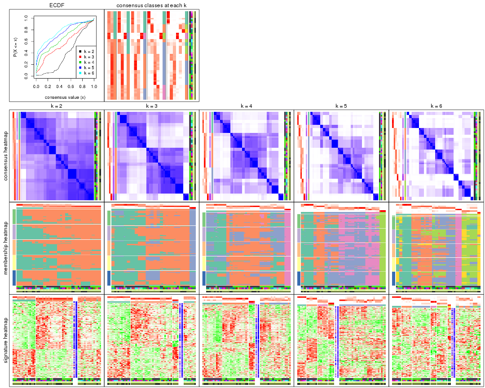

The plots are:

- The first row: a plot of the ECDF (empirical cumulative distribution
  function) curves of the consensus matrix for each `k` and the heatmap of
  predicted classes for each `k`.
- The second row: heatmaps of the consensus matrix for each `k`.
- The third row: heatmaps of the membership matrix for each `k`.
- The fouth row: heatmaps of the signatures for each `k`.

All the plots in panels can be made by individual functions and they are
plotted later in this section.

`select_partition_number()` produces several plots showing different
statistics for choosing "optimized" `k`. There are following statistics:

- ECDF curves of the consensus matrix for each `k`;
- 1-PAC. [The PAC
  score](https://en.wikipedia.org/wiki/Consensus_clustering#Over-interpretation_potential_of_consensus_clustering)
  measures the proportion of the ambiguous subgrouping.
- Mean silhouette score.
- Concordance. The mean probability of fiting the consensus class ids in all
  partitions.
- Area increased. Denote $A_k$ as the area under the ECDF curve for current
  `k`, the area increased is defined as $A_k - A_{k-1}$.
- Rand index. The percent of pairs of samples that are both in a same cluster
  or both are not in a same cluster in the partition of k and k-1.
- Jaccard index. The ratio of pairs of samples are both in a same cluster in
  the partition of k and k-1 and the pairs of samples are both in a same
  cluster in the partition k or k-1.

The detailed explanations of these statistics can be found in [the _cola_
vignette](http://bioconductor.org/packages/devel/bioc/vignettes/cola/inst/doc/cola.html#toc_13).

Generally speaking, lower PAC score, higher mean silhouette score or higher
concordance corresponds to better partition. Rand index and Jaccard index
measure how similar the current partition is compared to partition with `k-1`.
If they are too similar, we won't accept `k` is better than `k-1`.

```r
select_partition_number(res)
```

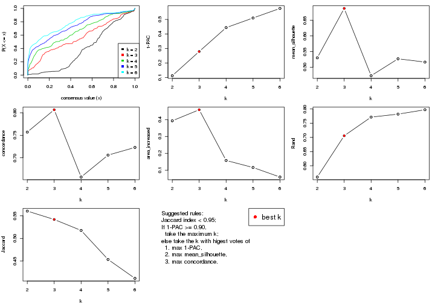

The numeric values for all these statistics can be obtained by `get_stats()`.

```r
get_stats(res)
```

```
#>   k 1-PAC mean_silhouette concordance area_increased  Rand Jaccard
#> 2 2 0.112           0.530       0.757         0.3930 0.560   0.560
#> 3 3 0.279           0.688       0.807         0.4585 0.706   0.542
#> 4 4 0.443           0.473       0.657         0.1577 0.771   0.518
#> 5 5 0.510           0.527       0.706         0.1160 0.782   0.454
#> 6 6 0.576           0.517       0.723         0.0595 0.797   0.412
```

`suggest_best_k()` suggests the best $k$ based on these statistics. The rules are as follows:

- All $k$ with Jaccard index larger than 0.95 are removed because increasing
  $k$ does not provide enough extra information. If all $k$ are removed, it is
  marked as no subgroup is detected.
- For all $k$ with 1-PAC score larger than 0.9, the maximal $k$ is taken as
  the best $k$, and other $k$ are marked as optional $k$.
- If it does not fit the second rule. The $k$ with the maximal vote of the
  highest 1-PAC score, highest mean silhouette, and highest concordance is
  taken as the best $k$.

```r
suggest_best_k(res)
```

```
#> [1] 3
```


Following shows the table of the partitions (You need to click the **show/hide
code output** link to see it). The membership matrix (columns with name `p*`)
is inferred by
[`clue::cl_consensus()`](https://www.rdocumentation.org/link/cl_consensus?package=clue)
function with the `SE` method. Basically the value in the membership matrix
represents the probability to belong to a certain group. The finall class
label for an item is determined with the group with highest probability it
belongs to.

In `get_classes()` function, the entropy is calculated from the membership
matrix and the silhouette score is calculated from the consensus matrix.


<script>
$( function() {
	$( '#tabs-SD-hclust-get-classes' ).tabs();
} );
</script>
<div id='tabs-SD-hclust-get-classes'>
<ul>
<li><a href='#tab-SD-hclust-get-classes-1'>k = 2</a></li>
<li><a href='#tab-SD-hclust-get-classes-2'>k = 3</a></li>
<li><a href='#tab-SD-hclust-get-classes-3'>k = 4</a></li>
<li><a href='#tab-SD-hclust-get-classes-4'>k = 5</a></li>
<li><a href='#tab-SD-hclust-get-classes-5'>k = 6</a></li>
</ul>

<div id='tab-SD-hclust-get-classes-1'>
<p><a id='tab-SD-hclust-get-classes-1-a' style='color:#0366d6' href='#'>show/hide code output</a></p>
<pre><code class="r">cbind(get_classes(res, k = 2), get_membership(res, k = 2))
</code></pre>

<pre><code>#&gt;           class entropy silhouette    p1    p2
#&gt; GSM680053     2   0.886      0.258 0.304 0.696
#&gt; GSM680062     2   0.886      0.258 0.304 0.696
#&gt; GSM680054     2   0.886      0.258 0.304 0.696
#&gt; GSM680063     2   0.886      0.258 0.304 0.696
#&gt; GSM680055     2   0.886      0.258 0.304 0.696
#&gt; GSM680064     1   0.936      0.665 0.648 0.352
#&gt; GSM680056     2   0.991     -0.233 0.444 0.556
#&gt; GSM680065     2   0.991     -0.233 0.444 0.556
#&gt; GSM680057     2   0.373      0.693 0.072 0.928
#&gt; GSM680066     1   0.943      0.663 0.640 0.360
#&gt; GSM680058     2   0.295      0.667 0.052 0.948
#&gt; GSM680067     2   0.833      0.559 0.264 0.736
#&gt; GSM680059     2   0.295      0.667 0.052 0.948
#&gt; GSM680068     1   0.943      0.663 0.640 0.360
#&gt; GSM680060     1   0.995      0.530 0.540 0.460
#&gt; GSM680069     1   0.995      0.530 0.540 0.460
#&gt; GSM680061     2   0.833      0.559 0.264 0.736
#&gt; GSM680070     1   0.943      0.663 0.640 0.360
#&gt; GSM680071     1   0.994      0.538 0.544 0.456
#&gt; GSM680077     1   0.983      0.580 0.576 0.424
#&gt; GSM680072     2   0.295      0.667 0.052 0.948
#&gt; GSM680078     1   0.958      0.639 0.620 0.380
#&gt; GSM680073     2   0.295      0.667 0.052 0.948
#&gt; GSM680079     1   0.936      0.665 0.648 0.352
#&gt; GSM680074     2   0.295      0.667 0.052 0.948
#&gt; GSM680080     2   0.295      0.667 0.052 0.948
#&gt; GSM680075     2   0.605      0.658 0.148 0.852
#&gt; GSM680081     2   0.574      0.653 0.136 0.864
#&gt; GSM680076     1   1.000      0.468 0.512 0.488
#&gt; GSM680082     1   1.000      0.468 0.512 0.488
#&gt; GSM680029     2   0.373      0.688 0.072 0.928
#&gt; GSM680041     1   0.295      0.509 0.948 0.052
#&gt; GSM680035     2   0.295      0.691 0.052 0.948
#&gt; GSM680047     1   0.443      0.503 0.908 0.092
#&gt; GSM680036     2   0.402      0.683 0.080 0.920
#&gt; GSM680048     2   0.952      0.430 0.372 0.628
#&gt; GSM680037     2   0.295      0.691 0.052 0.948
#&gt; GSM680049     1   0.295      0.509 0.948 0.052
#&gt; GSM680038     2   0.430      0.690 0.088 0.912
#&gt; GSM680050     1   0.981      0.582 0.580 0.420
#&gt; GSM680039     2   0.343      0.697 0.064 0.936
#&gt; GSM680051     2   0.876      0.536 0.296 0.704
#&gt; GSM680040     2   0.295      0.691 0.052 0.948
#&gt; GSM680052     2   0.952      0.430 0.372 0.628
#&gt; GSM680030     2   0.373      0.693 0.072 0.928
#&gt; GSM680042     1   0.295      0.509 0.948 0.052
#&gt; GSM680031     2   0.814      0.579 0.252 0.748
#&gt; GSM680043     2   0.814      0.579 0.252 0.748
#&gt; GSM680032     2   0.917      0.289 0.332 0.668
#&gt; GSM680044     2   0.917      0.289 0.332 0.668
#&gt; GSM680033     2   0.295      0.691 0.052 0.948
#&gt; GSM680045     2   0.925      0.473 0.340 0.660
#&gt; GSM680034     2   0.373      0.693 0.072 0.928
#&gt; GSM680046     2   0.925      0.473 0.340 0.660
</code></pre>

<script>
$('#tab-SD-hclust-get-classes-1-a').parent().next().next().hide();
$('#tab-SD-hclust-get-classes-1-a').click(function(){
  $('#tab-SD-hclust-get-classes-1-a').parent().next().next().toggle();
  return(false);
});
</script>
</div>

<div id='tab-SD-hclust-get-classes-2'>
<p><a id='tab-SD-hclust-get-classes-2-a' style='color:#0366d6' href='#'>show/hide code output</a></p>
<pre><code class="r">cbind(get_classes(res, k = 3), get_membership(res, k = 3))
</code></pre>

<pre><code>#&gt;           class entropy silhouette    p1    p2    p3
#&gt; GSM680053     1  0.6291      0.395 0.532 0.468 0.000
#&gt; GSM680062     1  0.6291      0.395 0.532 0.468 0.000
#&gt; GSM680054     1  0.6291      0.395 0.532 0.468 0.000
#&gt; GSM680063     1  0.6291      0.395 0.532 0.468 0.000
#&gt; GSM680055     1  0.6291      0.395 0.532 0.468 0.000
#&gt; GSM680064     1  0.4892      0.692 0.840 0.048 0.112
#&gt; GSM680056     1  0.5147      0.716 0.800 0.180 0.020
#&gt; GSM680065     1  0.5147      0.716 0.800 0.180 0.020
#&gt; GSM680057     2  0.3472      0.797 0.040 0.904 0.056
#&gt; GSM680066     1  0.5094      0.695 0.832 0.056 0.112
#&gt; GSM680058     2  0.2096      0.779 0.052 0.944 0.004
#&gt; GSM680067     2  0.6854      0.666 0.068 0.716 0.216
#&gt; GSM680059     2  0.2096      0.779 0.052 0.944 0.004
#&gt; GSM680068     1  0.5191      0.695 0.828 0.060 0.112
#&gt; GSM680060     1  0.2772      0.705 0.916 0.080 0.004
#&gt; GSM680069     1  0.2682      0.705 0.920 0.076 0.004
#&gt; GSM680061     2  0.6854      0.666 0.068 0.716 0.216
#&gt; GSM680070     1  0.5094      0.695 0.832 0.056 0.112
#&gt; GSM680071     1  0.2590      0.703 0.924 0.072 0.004
#&gt; GSM680077     1  0.0829      0.689 0.984 0.012 0.004
#&gt; GSM680072     2  0.2096      0.779 0.052 0.944 0.004
#&gt; GSM680078     1  0.5722      0.701 0.804 0.084 0.112
#&gt; GSM680073     2  0.2096      0.779 0.052 0.944 0.004
#&gt; GSM680079     1  0.4892      0.692 0.840 0.048 0.112
#&gt; GSM680074     2  0.2096      0.779 0.052 0.944 0.004
#&gt; GSM680080     2  0.2096      0.779 0.052 0.944 0.004
#&gt; GSM680075     2  0.5623      0.506 0.280 0.716 0.004
#&gt; GSM680081     2  0.5497      0.495 0.292 0.708 0.000
#&gt; GSM680076     1  0.3193      0.695 0.896 0.100 0.004
#&gt; GSM680082     1  0.3193      0.695 0.896 0.100 0.004
#&gt; GSM680029     2  0.3030      0.770 0.092 0.904 0.004
#&gt; GSM680041     3  0.0237      0.975 0.000 0.004 0.996
#&gt; GSM680035     2  0.2537      0.777 0.080 0.920 0.000
#&gt; GSM680047     3  0.2414      0.921 0.020 0.040 0.940
#&gt; GSM680036     2  0.3425      0.751 0.112 0.884 0.004
#&gt; GSM680048     2  0.7992      0.583 0.080 0.592 0.328
#&gt; GSM680037     2  0.2537      0.777 0.080 0.920 0.000
#&gt; GSM680049     3  0.0237      0.975 0.000 0.004 0.996
#&gt; GSM680038     2  0.3888      0.797 0.064 0.888 0.048
#&gt; GSM680050     1  0.1877      0.684 0.956 0.012 0.032
#&gt; GSM680039     2  0.3112      0.793 0.056 0.916 0.028
#&gt; GSM680051     2  0.7411      0.672 0.076 0.668 0.256
#&gt; GSM680040     2  0.2448      0.779 0.076 0.924 0.000
#&gt; GSM680052     2  0.7992      0.583 0.080 0.592 0.328
#&gt; GSM680030     2  0.3797      0.795 0.052 0.892 0.056
#&gt; GSM680042     3  0.0237      0.975 0.000 0.004 0.996
#&gt; GSM680031     2  0.7047      0.711 0.084 0.712 0.204
#&gt; GSM680043     2  0.7047      0.711 0.084 0.712 0.204
#&gt; GSM680032     1  0.8056      0.384 0.532 0.400 0.068
#&gt; GSM680044     1  0.8056      0.384 0.532 0.400 0.068
#&gt; GSM680033     2  0.2448      0.779 0.076 0.924 0.000
#&gt; GSM680045     2  0.8285      0.604 0.112 0.600 0.288
#&gt; GSM680034     2  0.3472      0.797 0.040 0.904 0.056
#&gt; GSM680046     2  0.8285      0.604 0.112 0.600 0.288
</code></pre>

<script>
$('#tab-SD-hclust-get-classes-2-a').parent().next().next().hide();
$('#tab-SD-hclust-get-classes-2-a').click(function(){
  $('#tab-SD-hclust-get-classes-2-a').parent().next().next().toggle();
  return(false);
});
</script>
</div>

<div id='tab-SD-hclust-get-classes-3'>
<p><a id='tab-SD-hclust-get-classes-3-a' style='color:#0366d6' href='#'>show/hide code output</a></p>
<pre><code class="r">cbind(get_classes(res, k = 4), get_membership(res, k = 4))
</code></pre>

<pre><code>#&gt;           class entropy silhouette    p1    p2    p3    p4
#&gt; GSM680053     3  0.5994     0.3610 0.068 0.296 0.636 0.000
#&gt; GSM680062     3  0.5994     0.3610 0.068 0.296 0.636 0.000
#&gt; GSM680054     3  0.5994     0.3610 0.068 0.296 0.636 0.000
#&gt; GSM680063     3  0.5994     0.3610 0.068 0.296 0.636 0.000
#&gt; GSM680055     3  0.5994     0.3610 0.068 0.296 0.636 0.000
#&gt; GSM680064     1  0.4244     0.6937 0.804 0.000 0.160 0.036
#&gt; GSM680056     3  0.5175    -0.2227 0.328 0.012 0.656 0.004
#&gt; GSM680065     3  0.5175    -0.2227 0.328 0.012 0.656 0.004
#&gt; GSM680057     2  0.4012     0.6376 0.000 0.800 0.184 0.016
#&gt; GSM680066     1  0.4613     0.6922 0.792 0.008 0.164 0.036
#&gt; GSM680058     2  0.0524     0.6525 0.004 0.988 0.008 0.000
#&gt; GSM680067     2  0.4831     0.3102 0.000 0.704 0.280 0.016
#&gt; GSM680059     2  0.1109     0.6592 0.004 0.968 0.028 0.000
#&gt; GSM680068     1  0.4739     0.6899 0.788 0.012 0.164 0.036
#&gt; GSM680060     1  0.6044     0.5810 0.528 0.044 0.428 0.000
#&gt; GSM680069     1  0.5971     0.5807 0.532 0.040 0.428 0.000
#&gt; GSM680061     2  0.4831     0.3102 0.000 0.704 0.280 0.016
#&gt; GSM680070     1  0.4613     0.6922 0.792 0.008 0.164 0.036
#&gt; GSM680071     1  0.5964     0.5855 0.536 0.040 0.424 0.000
#&gt; GSM680077     1  0.2281     0.6570 0.904 0.000 0.096 0.000
#&gt; GSM680072     2  0.0524     0.6525 0.004 0.988 0.008 0.000
#&gt; GSM680078     1  0.5036     0.6706 0.760 0.012 0.192 0.036
#&gt; GSM680073     2  0.1305     0.6560 0.004 0.960 0.036 0.000
#&gt; GSM680079     1  0.4244     0.6937 0.804 0.000 0.160 0.036
#&gt; GSM680074     2  0.0524     0.6525 0.004 0.988 0.008 0.000
#&gt; GSM680080     2  0.0524     0.6525 0.004 0.988 0.008 0.000
#&gt; GSM680075     2  0.6396     0.2420 0.076 0.564 0.360 0.000
#&gt; GSM680081     2  0.6451     0.2103 0.072 0.524 0.404 0.000
#&gt; GSM680076     1  0.5756     0.5763 0.568 0.032 0.400 0.000
#&gt; GSM680082     1  0.5756     0.5763 0.568 0.032 0.400 0.000
#&gt; GSM680029     2  0.4690     0.5941 0.012 0.712 0.276 0.000
#&gt; GSM680041     4  0.0000     0.9711 0.000 0.000 0.000 1.000
#&gt; GSM680035     2  0.4222     0.5985 0.000 0.728 0.272 0.000
#&gt; GSM680047     4  0.1824     0.9106 0.004 0.000 0.060 0.936
#&gt; GSM680036     2  0.4844     0.5638 0.012 0.688 0.300 0.000
#&gt; GSM680048     3  0.7280     0.0409 0.004 0.384 0.480 0.132
#&gt; GSM680037     2  0.4222     0.5985 0.000 0.728 0.272 0.000
#&gt; GSM680049     4  0.0000     0.9711 0.000 0.000 0.000 1.000
#&gt; GSM680038     2  0.3925     0.6450 0.000 0.808 0.176 0.016
#&gt; GSM680050     1  0.3182     0.6462 0.876 0.000 0.096 0.028
#&gt; GSM680039     2  0.4485     0.6280 0.000 0.740 0.248 0.012
#&gt; GSM680051     3  0.6561    -0.1094 0.004 0.460 0.472 0.064
#&gt; GSM680040     2  0.4193     0.6018 0.000 0.732 0.268 0.000
#&gt; GSM680052     3  0.7280     0.0409 0.004 0.384 0.480 0.132
#&gt; GSM680030     2  0.4356     0.6290 0.004 0.780 0.200 0.016
#&gt; GSM680042     4  0.0000     0.9711 0.000 0.000 0.000 1.000
#&gt; GSM680031     3  0.5464    -0.1606 0.004 0.492 0.496 0.008
#&gt; GSM680043     3  0.5464    -0.1606 0.004 0.492 0.496 0.008
#&gt; GSM680032     3  0.7984     0.2653 0.264 0.232 0.488 0.016
#&gt; GSM680044     3  0.7984     0.2653 0.264 0.232 0.488 0.016
#&gt; GSM680033     2  0.4193     0.6018 0.000 0.732 0.268 0.000
#&gt; GSM680045     3  0.7547     0.0514 0.056 0.392 0.492 0.060
#&gt; GSM680034     2  0.4012     0.6376 0.000 0.800 0.184 0.016
#&gt; GSM680046     3  0.7547     0.0514 0.056 0.392 0.492 0.060
</code></pre>

<script>
$('#tab-SD-hclust-get-classes-3-a').parent().next().next().hide();
$('#tab-SD-hclust-get-classes-3-a').click(function(){
  $('#tab-SD-hclust-get-classes-3-a').parent().next().next().toggle();
  return(false);
});
</script>
</div>

<div id='tab-SD-hclust-get-classes-4'>
<p><a id='tab-SD-hclust-get-classes-4-a' style='color:#0366d6' href='#'>show/hide code output</a></p>
<pre><code class="r">cbind(get_classes(res, k = 5), get_membership(res, k = 5))
</code></pre>

<pre><code>#&gt;           class entropy silhouette    p1    p2    p3    p4    p5
#&gt; GSM680053     3  0.6380     0.1927 0.136 0.324 0.528 0.012 0.000
#&gt; GSM680062     3  0.6380     0.1927 0.136 0.324 0.528 0.012 0.000
#&gt; GSM680054     3  0.6380     0.1927 0.136 0.324 0.528 0.012 0.000
#&gt; GSM680063     3  0.6380     0.1927 0.136 0.324 0.528 0.012 0.000
#&gt; GSM680055     3  0.6380     0.1927 0.136 0.324 0.528 0.012 0.000
#&gt; GSM680064     1  0.0162     0.8453 0.996 0.000 0.004 0.000 0.000
#&gt; GSM680056     2  0.6276     0.5122 0.176 0.584 0.228 0.012 0.000
#&gt; GSM680065     2  0.6276     0.5122 0.176 0.584 0.228 0.012 0.000
#&gt; GSM680057     3  0.4593     0.0924 0.000 0.004 0.512 0.480 0.004
#&gt; GSM680066     1  0.0798     0.8479 0.976 0.008 0.016 0.000 0.000
#&gt; GSM680058     3  0.4367     0.3901 0.004 0.000 0.580 0.416 0.000
#&gt; GSM680067     4  0.2351     0.4819 0.000 0.016 0.088 0.896 0.000
#&gt; GSM680059     3  0.3949     0.4181 0.004 0.000 0.696 0.300 0.000
#&gt; GSM680068     1  0.0898     0.8461 0.972 0.008 0.020 0.000 0.000
#&gt; GSM680060     2  0.2344     0.7562 0.064 0.904 0.000 0.032 0.000
#&gt; GSM680069     2  0.2331     0.7580 0.064 0.908 0.004 0.024 0.000
#&gt; GSM680061     4  0.2351     0.4819 0.000 0.016 0.088 0.896 0.000
#&gt; GSM680070     1  0.0798     0.8479 0.976 0.008 0.016 0.000 0.000
#&gt; GSM680071     2  0.2171     0.7573 0.064 0.912 0.000 0.024 0.000
#&gt; GSM680077     1  0.4331     0.4506 0.596 0.400 0.000 0.004 0.000
#&gt; GSM680072     3  0.4367     0.3901 0.004 0.000 0.580 0.416 0.000
#&gt; GSM680078     1  0.1282     0.8218 0.952 0.004 0.044 0.000 0.000
#&gt; GSM680073     3  0.4009     0.4187 0.004 0.000 0.684 0.312 0.000
#&gt; GSM680079     1  0.0162     0.8453 0.996 0.000 0.004 0.000 0.000
#&gt; GSM680074     3  0.4375     0.3881 0.004 0.000 0.576 0.420 0.000
#&gt; GSM680080     3  0.4375     0.3881 0.004 0.000 0.576 0.420 0.000
#&gt; GSM680075     3  0.5778     0.4528 0.068 0.164 0.692 0.076 0.000
#&gt; GSM680081     3  0.4665     0.4310 0.056 0.168 0.756 0.020 0.000
#&gt; GSM680076     2  0.1851     0.6921 0.000 0.912 0.000 0.088 0.000
#&gt; GSM680082     2  0.1851     0.6921 0.000 0.912 0.000 0.088 0.000
#&gt; GSM680029     3  0.1538     0.4792 0.008 0.008 0.948 0.036 0.000
#&gt; GSM680041     5  0.0000     0.9701 0.000 0.000 0.000 0.000 1.000
#&gt; GSM680035     3  0.0794     0.4586 0.000 0.000 0.972 0.028 0.000
#&gt; GSM680047     5  0.1717     0.9083 0.008 0.000 0.052 0.004 0.936
#&gt; GSM680036     3  0.2467     0.4914 0.016 0.024 0.908 0.052 0.000
#&gt; GSM680048     4  0.6658     0.7504 0.008 0.016 0.336 0.516 0.124
#&gt; GSM680037     3  0.0794     0.4586 0.000 0.000 0.972 0.028 0.000
#&gt; GSM680049     5  0.0000     0.9701 0.000 0.000 0.000 0.000 1.000
#&gt; GSM680038     3  0.4835     0.1627 0.004 0.008 0.528 0.456 0.004
#&gt; GSM680050     1  0.5033     0.4283 0.568 0.400 0.000 0.004 0.028
#&gt; GSM680039     3  0.3039     0.3635 0.000 0.000 0.808 0.192 0.000
#&gt; GSM680051     4  0.5870     0.7060 0.008 0.016 0.372 0.556 0.048
#&gt; GSM680040     3  0.0510     0.4648 0.000 0.000 0.984 0.016 0.000
#&gt; GSM680052     4  0.6658     0.7504 0.008 0.016 0.336 0.516 0.124
#&gt; GSM680030     3  0.4595     0.0954 0.000 0.004 0.504 0.488 0.004
#&gt; GSM680042     5  0.0000     0.9701 0.000 0.000 0.000 0.000 1.000
#&gt; GSM680031     4  0.4997     0.6980 0.008 0.016 0.468 0.508 0.000
#&gt; GSM680043     4  0.4997     0.6980 0.008 0.016 0.468 0.508 0.000
#&gt; GSM680032     3  0.7872     0.0474 0.328 0.192 0.400 0.076 0.004
#&gt; GSM680044     3  0.7872     0.0474 0.328 0.192 0.400 0.076 0.004
#&gt; GSM680033     3  0.0510     0.4648 0.000 0.000 0.984 0.016 0.000
#&gt; GSM680045     4  0.6896     0.7502 0.084 0.016 0.340 0.520 0.040
#&gt; GSM680034     3  0.4593     0.0924 0.000 0.004 0.512 0.480 0.004
#&gt; GSM680046     4  0.6896     0.7502 0.084 0.016 0.340 0.520 0.040
</code></pre>

<script>
$('#tab-SD-hclust-get-classes-4-a').parent().next().next().hide();
$('#tab-SD-hclust-get-classes-4-a').click(function(){
  $('#tab-SD-hclust-get-classes-4-a').parent().next().next().toggle();
  return(false);
});
</script>
</div>

<div id='tab-SD-hclust-get-classes-5'>
<p><a id='tab-SD-hclust-get-classes-5-a' style='color:#0366d6' href='#'>show/hide code output</a></p>
<pre><code class="r">cbind(get_classes(res, k = 6), get_membership(res, k = 6))
</code></pre>

<pre><code>#&gt;           class entropy silhouette    p1    p2    p3    p4    p5    p6
#&gt; GSM680053     5  0.6061     0.5386 0.072 0.064 0.388 0.000 0.476 0.000
#&gt; GSM680062     5  0.6061     0.5386 0.072 0.064 0.388 0.000 0.476 0.000
#&gt; GSM680054     5  0.6061     0.5386 0.072 0.064 0.388 0.000 0.476 0.000
#&gt; GSM680063     5  0.6061     0.5386 0.072 0.064 0.388 0.000 0.476 0.000
#&gt; GSM680055     5  0.6061     0.5386 0.072 0.064 0.388 0.000 0.476 0.000
#&gt; GSM680064     1  0.0000     0.6862 1.000 0.000 0.000 0.000 0.000 0.000
#&gt; GSM680056     5  0.5950     0.5176 0.112 0.044 0.108 0.000 0.672 0.064
#&gt; GSM680065     5  0.5950     0.5176 0.112 0.044 0.108 0.000 0.672 0.064
#&gt; GSM680057     2  0.3881     0.3009 0.000 0.600 0.396 0.000 0.004 0.000
#&gt; GSM680066     1  0.0696     0.6922 0.980 0.008 0.004 0.000 0.004 0.004
#&gt; GSM680058     3  0.4344     0.5051 0.000 0.060 0.720 0.004 0.212 0.004
#&gt; GSM680067     2  0.4576     0.4524 0.000 0.716 0.208 0.004 0.052 0.020
#&gt; GSM680059     3  0.4186     0.5450 0.000 0.080 0.728 0.000 0.192 0.000
#&gt; GSM680068     1  0.0810     0.6914 0.976 0.008 0.008 0.000 0.004 0.004
#&gt; GSM680060     5  0.4420     0.0736 0.008 0.012 0.008 0.000 0.624 0.348
#&gt; GSM680069     5  0.4223     0.0795 0.008 0.008 0.004 0.000 0.632 0.348
#&gt; GSM680061     2  0.4576     0.4524 0.000 0.716 0.208 0.004 0.052 0.020
#&gt; GSM680070     1  0.0696     0.6922 0.980 0.008 0.004 0.000 0.004 0.004
#&gt; GSM680071     5  0.4236     0.0721 0.008 0.008 0.004 0.000 0.628 0.352
#&gt; GSM680077     1  0.4975     0.2482 0.596 0.000 0.000 0.000 0.092 0.312
#&gt; GSM680072     3  0.4344     0.5051 0.000 0.060 0.720 0.004 0.212 0.004
#&gt; GSM680078     1  0.1312     0.6794 0.956 0.008 0.020 0.000 0.012 0.004
#&gt; GSM680073     3  0.4008     0.5469 0.000 0.064 0.740 0.000 0.196 0.000
#&gt; GSM680079     1  0.0000     0.6862 1.000 0.000 0.000 0.000 0.000 0.000
#&gt; GSM680074     3  0.4399     0.5044 0.000 0.064 0.716 0.004 0.212 0.004
#&gt; GSM680080     3  0.4399     0.5044 0.000 0.064 0.716 0.004 0.212 0.004
#&gt; GSM680075     3  0.6196     0.3050 0.048 0.064 0.556 0.000 0.304 0.028
#&gt; GSM680081     3  0.6829     0.3041 0.048 0.184 0.536 0.000 0.200 0.032
#&gt; GSM680076     6  0.0777     1.0000 0.000 0.000 0.004 0.000 0.024 0.972
#&gt; GSM680082     6  0.0777     1.0000 0.000 0.000 0.004 0.000 0.024 0.972
#&gt; GSM680029     3  0.4030     0.5592 0.000 0.172 0.748 0.000 0.080 0.000
#&gt; GSM680041     4  0.0146     0.9652 0.000 0.004 0.000 0.996 0.000 0.000
#&gt; GSM680035     3  0.3468     0.5165 0.000 0.284 0.712 0.000 0.004 0.000
#&gt; GSM680047     4  0.1644     0.8942 0.012 0.052 0.004 0.932 0.000 0.000
#&gt; GSM680036     3  0.4371     0.5380 0.008 0.132 0.740 0.000 0.120 0.000
#&gt; GSM680048     2  0.3702     0.6285 0.012 0.808 0.056 0.120 0.004 0.000
#&gt; GSM680037     3  0.3468     0.5165 0.000 0.284 0.712 0.000 0.004 0.000
#&gt; GSM680049     4  0.0146     0.9652 0.000 0.004 0.000 0.996 0.000 0.000
#&gt; GSM680038     2  0.4620     0.1873 0.000 0.532 0.428 0.000 0.040 0.000
#&gt; GSM680050     1  0.5605     0.2205 0.568 0.000 0.000 0.028 0.092 0.312
#&gt; GSM680039     3  0.3937     0.2292 0.000 0.424 0.572 0.000 0.004 0.000
#&gt; GSM680051     2  0.3493     0.6313 0.012 0.828 0.108 0.044 0.008 0.000
#&gt; GSM680040     3  0.3405     0.5286 0.000 0.272 0.724 0.000 0.004 0.000
#&gt; GSM680052     2  0.3702     0.6285 0.012 0.808 0.056 0.120 0.004 0.000
#&gt; GSM680030     2  0.4411     0.2740 0.000 0.576 0.400 0.000 0.012 0.012
#&gt; GSM680042     4  0.0146     0.9652 0.000 0.004 0.000 0.996 0.000 0.000
#&gt; GSM680031     2  0.3053     0.5947 0.012 0.812 0.172 0.000 0.004 0.000
#&gt; GSM680043     2  0.3053     0.5947 0.012 0.812 0.172 0.000 0.004 0.000
#&gt; GSM680032     1  0.8424     0.0549 0.332 0.144 0.244 0.000 0.076 0.204
#&gt; GSM680044     1  0.8424     0.0549 0.332 0.144 0.244 0.000 0.076 0.204
#&gt; GSM680033     3  0.3405     0.5286 0.000 0.272 0.724 0.000 0.004 0.000
#&gt; GSM680045     2  0.3871     0.6299 0.088 0.812 0.060 0.036 0.004 0.000
#&gt; GSM680034     2  0.3881     0.3009 0.000 0.600 0.396 0.000 0.004 0.000
#&gt; GSM680046     2  0.3871     0.6299 0.088 0.812 0.060 0.036 0.004 0.000
</code></pre>

<script>
$('#tab-SD-hclust-get-classes-5-a').parent().next().next().hide();
$('#tab-SD-hclust-get-classes-5-a').click(function(){
  $('#tab-SD-hclust-get-classes-5-a').parent().next().next().toggle();
  return(false);
});
</script>
</div>
</div>

Heatmaps for the consensus matrix. It visualizes the probability of two
samples to be in a same group.


<script>
$( function() {
	$( '#tabs-SD-hclust-consensus-heatmap' ).tabs();
} );
</script>
<div id='tabs-SD-hclust-consensus-heatmap'>
<ul>
<li><a href='#tab-SD-hclust-consensus-heatmap-1'>k = 2</a></li>
<li><a href='#tab-SD-hclust-consensus-heatmap-2'>k = 3</a></li>
<li><a href='#tab-SD-hclust-consensus-heatmap-3'>k = 4</a></li>
<li><a href='#tab-SD-hclust-consensus-heatmap-4'>k = 5</a></li>
<li><a href='#tab-SD-hclust-consensus-heatmap-5'>k = 6</a></li>
</ul>
<div id='tab-SD-hclust-consensus-heatmap-1'>
<pre><code class="r">consensus_heatmap(res, k = 2)
</code></pre>

<p>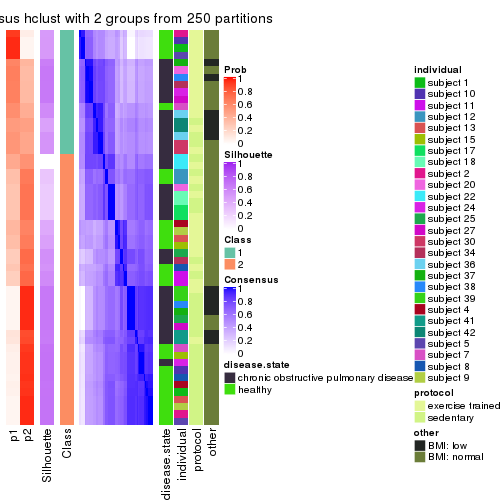</p>

</div>
<div id='tab-SD-hclust-consensus-heatmap-2'>
<pre><code class="r">consensus_heatmap(res, k = 3)
</code></pre>

<p>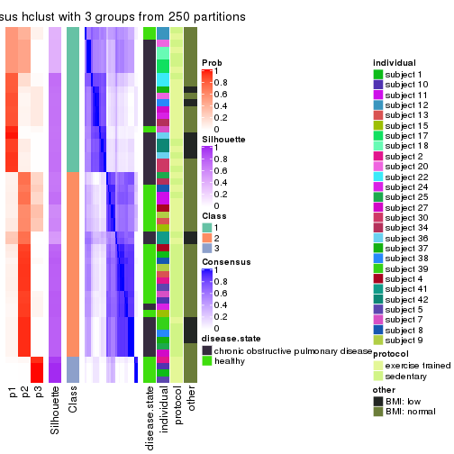</p>

</div>
<div id='tab-SD-hclust-consensus-heatmap-3'>
<pre><code class="r">consensus_heatmap(res, k = 4)
</code></pre>

<p>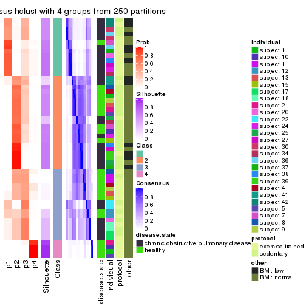</p>

</div>
<div id='tab-SD-hclust-consensus-heatmap-4'>
<pre><code class="r">consensus_heatmap(res, k = 5)
</code></pre>

<p>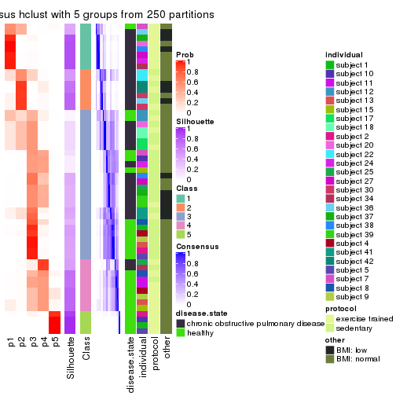</p>

</div>
<div id='tab-SD-hclust-consensus-heatmap-5'>
<pre><code class="r">consensus_heatmap(res, k = 6)
</code></pre>

<p>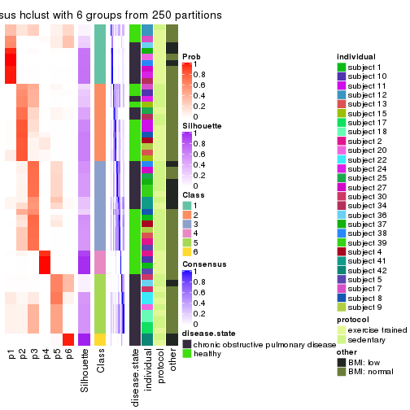</p>

</div>
</div>

Heatmaps for the membership of samples in all partitions to see how consistent they are:


<script>
$( function() {
	$( '#tabs-SD-hclust-membership-heatmap' ).tabs();
} );
</script>
<div id='tabs-SD-hclust-membership-heatmap'>
<ul>
<li><a href='#tab-SD-hclust-membership-heatmap-1'>k = 2</a></li>
<li><a href='#tab-SD-hclust-membership-heatmap-2'>k = 3</a></li>
<li><a href='#tab-SD-hclust-membership-heatmap-3'>k = 4</a></li>
<li><a href='#tab-SD-hclust-membership-heatmap-4'>k = 5</a></li>
<li><a href='#tab-SD-hclust-membership-heatmap-5'>k = 6</a></li>
</ul>
<div id='tab-SD-hclust-membership-heatmap-1'>
<pre><code class="r">membership_heatmap(res, k = 2)
</code></pre>

<p>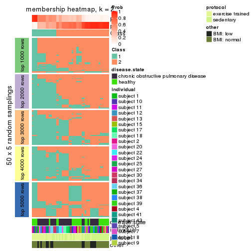</p>

</div>
<div id='tab-SD-hclust-membership-heatmap-2'>
<pre><code class="r">membership_heatmap(res, k = 3)
</code></pre>

<p>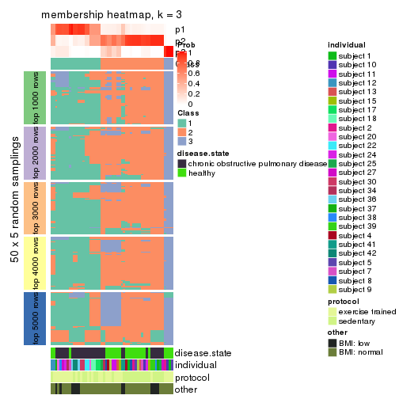</p>

</div>
<div id='tab-SD-hclust-membership-heatmap-3'>
<pre><code class="r">membership_heatmap(res, k = 4)
</code></pre>

<p>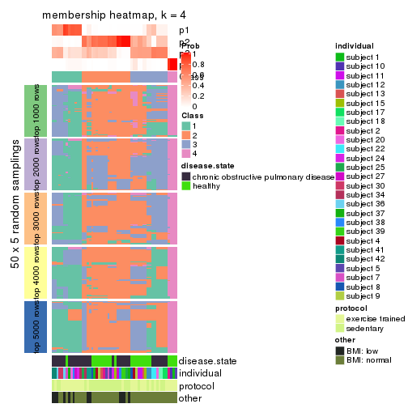</p>

</div>
<div id='tab-SD-hclust-membership-heatmap-4'>
<pre><code class="r">membership_heatmap(res, k = 5)
</code></pre>

<p>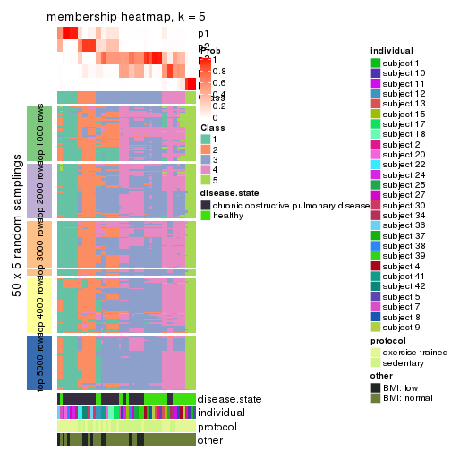</p>

</div>
<div id='tab-SD-hclust-membership-heatmap-5'>
<pre><code class="r">membership_heatmap(res, k = 6)
</code></pre>

<p>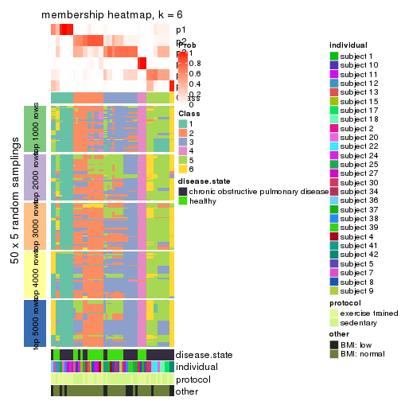</p>

</div>
</div>

As soon as we have had the classes for columns, we can look for signatures
which are significantly different between classes which can be candidate marks
for certain classes. Following are the heatmaps for signatures.


Signature heatmaps where rows are scaled:


<script>
$( function() {
	$( '#tabs-SD-hclust-get-signatures' ).tabs();
} );
</script>
<div id='tabs-SD-hclust-get-signatures'>
<ul>
<li><a href='#tab-SD-hclust-get-signatures-1'>k = 2</a></li>
<li><a href='#tab-SD-hclust-get-signatures-2'>k = 3</a></li>
<li><a href='#tab-SD-hclust-get-signatures-3'>k = 4</a></li>
<li><a href='#tab-SD-hclust-get-signatures-4'>k = 5</a></li>
<li><a href='#tab-SD-hclust-get-signatures-5'>k = 6</a></li>
</ul>
<div id='tab-SD-hclust-get-signatures-1'>
<pre><code class="r">get_signatures(res, k = 2)
</code></pre>

<p>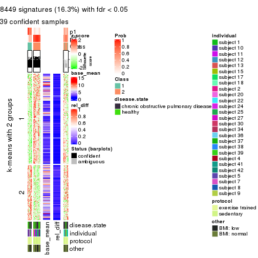</p>

</div>
<div id='tab-SD-hclust-get-signatures-2'>
<pre><code class="r">get_signatures(res, k = 3)
</code></pre>

<p>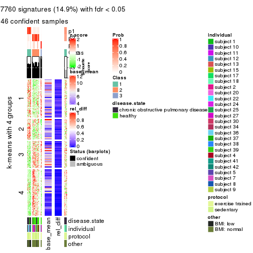</p>

</div>
<div id='tab-SD-hclust-get-signatures-3'>
<pre><code class="r">get_signatures(res, k = 4)
</code></pre>

<p>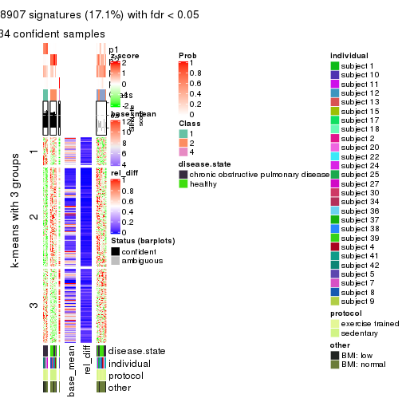</p>

</div>
<div id='tab-SD-hclust-get-signatures-4'>
<pre><code class="r">get_signatures(res, k = 5)
</code></pre>

<p>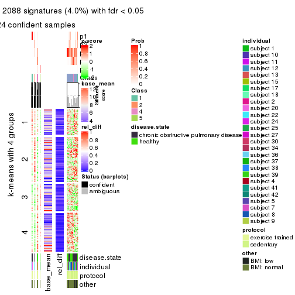</p>

</div>
<div id='tab-SD-hclust-get-signatures-5'>
<pre><code class="r">get_signatures(res, k = 6)
</code></pre>

<pre><code>#&gt; Error in mat[ceiling(1:nr/h_ratio), ceiling(1:nc/w_ratio), drop = FALSE]: subscript out of bounds
</code></pre>

<p></p>

</div>
</div>


Signature heatmaps where rows are not scaled:


<script>
$( function() {
	$( '#tabs-SD-hclust-get-signatures-no-scale' ).tabs();
} );
</script>
<div id='tabs-SD-hclust-get-signatures-no-scale'>
<ul>
<li><a href='#tab-SD-hclust-get-signatures-no-scale-1'>k = 2</a></li>
<li><a href='#tab-SD-hclust-get-signatures-no-scale-2'>k = 3</a></li>
<li><a href='#tab-SD-hclust-get-signatures-no-scale-3'>k = 4</a></li>
<li><a href='#tab-SD-hclust-get-signatures-no-scale-4'>k = 5</a></li>
<li><a href='#tab-SD-hclust-get-signatures-no-scale-5'>k = 6</a></li>
</ul>
<div id='tab-SD-hclust-get-signatures-no-scale-1'>
<pre><code class="r">get_signatures(res, k = 2, scale_rows = FALSE)
</code></pre>

<p>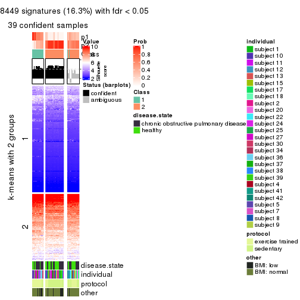</p>

</div>
<div id='tab-SD-hclust-get-signatures-no-scale-2'>
<pre><code class="r">get_signatures(res, k = 3, scale_rows = FALSE)
</code></pre>

<p>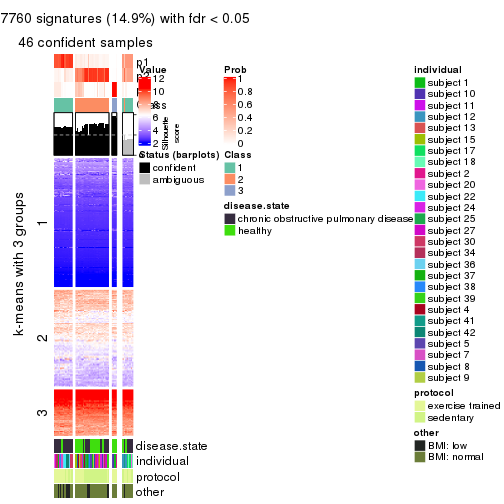</p>

</div>
<div id='tab-SD-hclust-get-signatures-no-scale-3'>
<pre><code class="r">get_signatures(res, k = 4, scale_rows = FALSE)
</code></pre>

<p>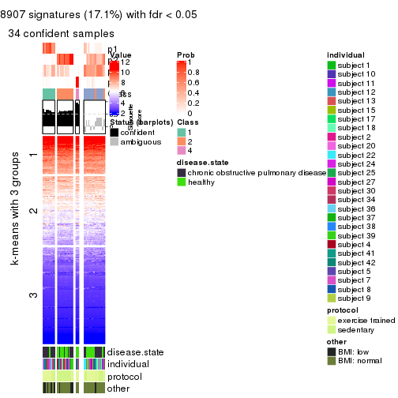</p>

</div>
<div id='tab-SD-hclust-get-signatures-no-scale-4'>
<pre><code class="r">get_signatures(res, k = 5, scale_rows = FALSE)
</code></pre>

<p>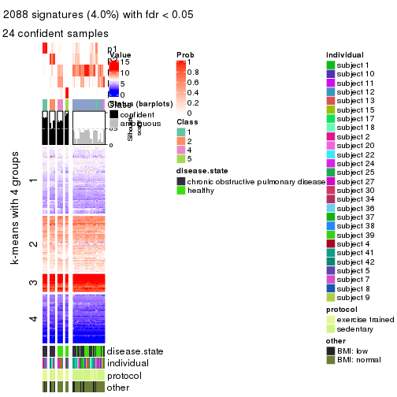</p>

</div>
<div id='tab-SD-hclust-get-signatures-no-scale-5'>
<pre><code class="r">get_signatures(res, k = 6, scale_rows = FALSE)
</code></pre>

<p>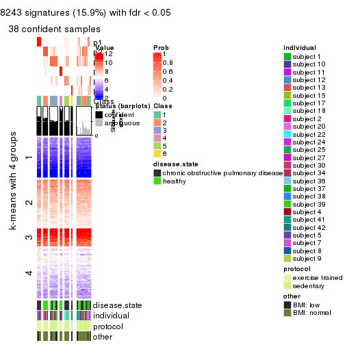</p>

</div>
</div>


Compare the overlap of signatures from different k:

```r
compare_signatures(res)
```

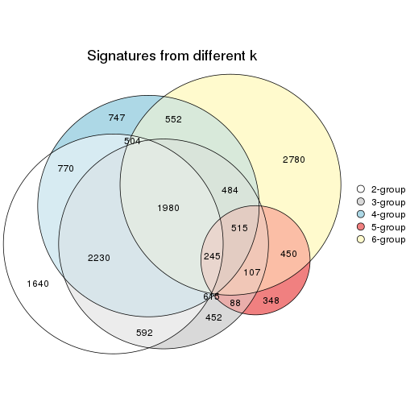

`get_signature()` returns a data frame invisibly. TO get the list of signatures, the function
call should be assigned to a variable explicitly. In following code, if `plot` argument is set
to `FALSE`, no heatmap is plotted while only the differential analysis is performed.

```r
# code only for demonstration
tb = get_signature(res, k = ..., plot = FALSE)
```

An example of the output of `tb` is:

```
#>   which_row         fdr    mean_1    mean_2 scaled_mean_1 scaled_mean_2 km
#> 1        38 0.042760348  8.373488  9.131774    -0.5533452     0.5164555  1
#> 2        40 0.018707592  7.106213  8.469186    -0.6173731     0.5762149  1
#> 3        55 0.019134737 10.221463 11.207825    -0.6159697     0.5749050  1
#> 4        59 0.006059896  5.921854  7.869574    -0.6899429     0.6439467  1
#> 5        60 0.018055526  8.928898 10.211722    -0.6204761     0.5791110  1
#> 6        98 0.009384629 15.714769 14.887706     0.6635654    -0.6193277  2
...
```

The columns in `tb` are:

1. `which_row`: row indices corresponding to the input matrix.
2. `fdr`: FDR for the differential test. 
3. `mean_x`: The mean value in group x.
4. `scaled_mean_x`: The mean value in group x after rows are scaled.
5. `km`: Row groups if k-means clustering is applied to rows.


UMAP plot which shows how samples are separated.


<script>
$( function() {
	$( '#tabs-SD-hclust-dimension-reduction' ).tabs();
} );
</script>
<div id='tabs-SD-hclust-dimension-reduction'>
<ul>
<li><a href='#tab-SD-hclust-dimension-reduction-1'>k = 2</a></li>
<li><a href='#tab-SD-hclust-dimension-reduction-2'>k = 3</a></li>
<li><a href='#tab-SD-hclust-dimension-reduction-3'>k = 4</a></li>
<li><a href='#tab-SD-hclust-dimension-reduction-4'>k = 5</a></li>
<li><a href='#tab-SD-hclust-dimension-reduction-5'>k = 6</a></li>
</ul>
<div id='tab-SD-hclust-dimension-reduction-1'>
<pre><code class="r">dimension_reduction(res, k = 2, method = &quot;UMAP&quot;)
</code></pre>

<p>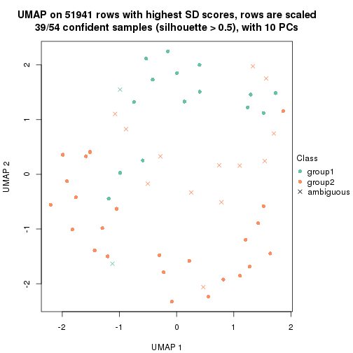</p>

</div>
<div id='tab-SD-hclust-dimension-reduction-2'>
<pre><code class="r">dimension_reduction(res, k = 3, method = &quot;UMAP&quot;)
</code></pre>

<p>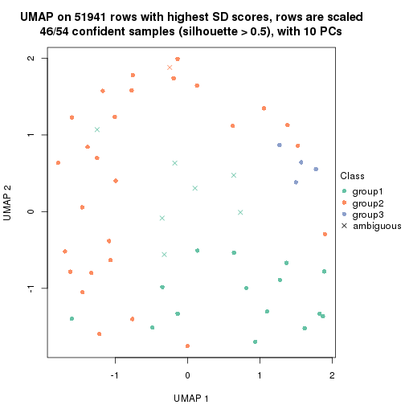</p>

</div>
<div id='tab-SD-hclust-dimension-reduction-3'>
<pre><code class="r">dimension_reduction(res, k = 4, method = &quot;UMAP&quot;)
</code></pre>

<p>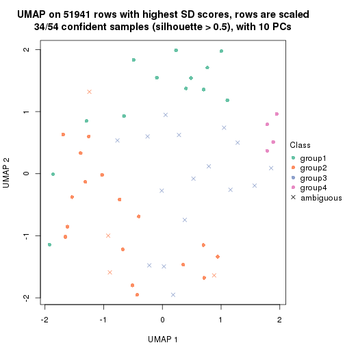</p>

</div>
<div id='tab-SD-hclust-dimension-reduction-4'>
<pre><code class="r">dimension_reduction(res, k = 5, method = &quot;UMAP&quot;)
</code></pre>

<p>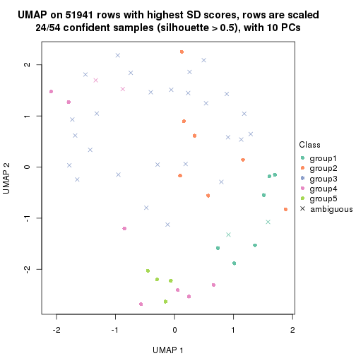</p>

</div>
<div id='tab-SD-hclust-dimension-reduction-5'>
<pre><code class="r">dimension_reduction(res, k = 6, method = &quot;UMAP&quot;)
</code></pre>

<p>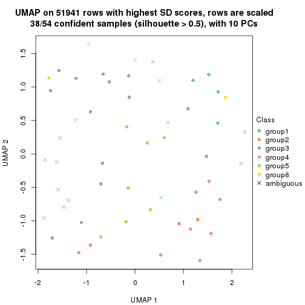</p>

</div>
</div>


Following heatmap shows how subgroups are split when increasing `k`:

```r
collect_classes(res)
```

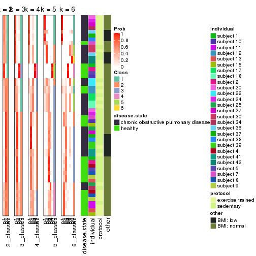


Test correlation between subgroups and known annotations. If the known
annotation is numeric, one-way ANOVA test is applied, and if the known
annotation is discrete, chi-squared contingency table test is applied.

```r
test_to_known_factors(res)
```

```
#>            n disease.state(p) individual(p) protocol(p) other(p) k
#> SD:hclust 39         3.47e-01        0.6569    2.31e-04    1.000 2
#> SD:hclust 46         2.01e-04        0.2743    2.81e-03    0.148 3
#> SD:hclust 34         1.14e-03        0.6746    3.01e-05    0.157 4
#> SD:hclust 24         2.50e-05        0.0871    3.83e-02    0.137 5
#> SD:hclust 38         9.48e-05        0.0171    5.55e-04    0.016 6
```


If matrix rows can be associated to genes, consider to use `functional_enrichment(res,
...)` to perform function enrichment for the signature genes. See [this vignette](http://bioconductor.org/packages/devel/bioc/vignettes/cola/inst/doc/functional_enrichment.html) for more detailed explanations.


 

---------------------------------------------------


### SD:kmeans**


The object with results only for a single top-value method and a single partition method 
can be extracted as:

```r
res = res_list["SD", "kmeans"]
# you can also extract it by
# res = res_list["SD:kmeans"]
```

A summary of `res` and all the functions that can be applied to it:

```r
res
```

```
#> A 'ConsensusPartition' object with k = 2, 3, 4, 5, 6.
#>   On a matrix with 51941 rows and 54 columns.
#>   Top rows (1000, 2000, 3000, 4000, 5000) are extracted by 'SD' method.
#>   Subgroups are detected by 'kmeans' method.
#>   Performed in total 1250 partitions by row resampling.
#>   Best k for subgroups seems to be 2.
#> 
#> Following methods can be applied to this 'ConsensusPartition' object:
#>  [1] "cola_report"             "collect_classes"         "collect_plots"          
#>  [4] "collect_stats"           "colnames"                "compare_signatures"     
#>  [7] "consensus_heatmap"       "dimension_reduction"     "functional_enrichment"  
#> [10] "get_anno_col"            "get_anno"                "get_classes"            
#> [13] "get_consensus"           "get_matrix"              "get_membership"         
#> [16] "get_param"               "get_signatures"          "get_stats"              
#> [19] "is_best_k"               "is_stable_k"             "membership_heatmap"     
#> [22] "ncol"                    "nrow"                    "plot_ecdf"              
#> [25] "rownames"                "select_partition_number" "show"                   
#> [28] "suggest_best_k"          "test_to_known_factors"
```

`collect_plots()` function collects all the plots made from `res` for all `k` (number of partitions)
into one single page to provide an easy and fast comparison between different `k`.

```r
collect_plots(res)
```

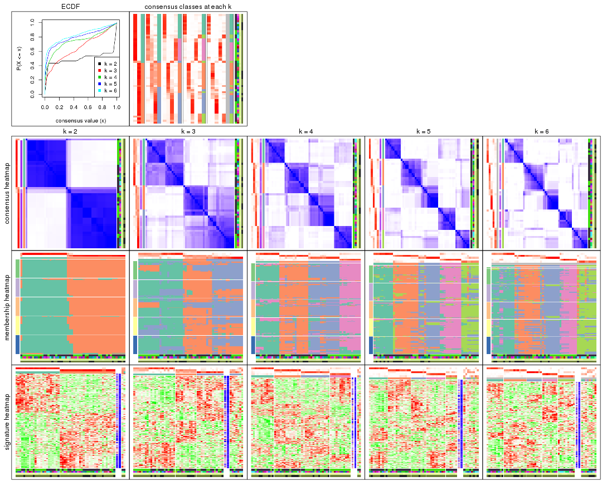

The plots are:

- The first row: a plot of the ECDF (empirical cumulative distribution
  function) curves of the consensus matrix for each `k` and the heatmap of
  predicted classes for each `k`.
- The second row: heatmaps of the consensus matrix for each `k`.
- The third row: heatmaps of the membership matrix for each `k`.
- The fouth row: heatmaps of the signatures for each `k`.

All the plots in panels can be made by individual functions and they are
plotted later in this section.

`select_partition_number()` produces several plots showing different
statistics for choosing "optimized" `k`. There are following statistics:

- ECDF curves of the consensus matrix for each `k`;
- 1-PAC. [The PAC
  score](https://en.wikipedia.org/wiki/Consensus_clustering#Over-interpretation_potential_of_consensus_clustering)
  measures the proportion of the ambiguous subgrouping.
- Mean silhouette score.
- Concordance. The mean probability of fiting the consensus class ids in all
  partitions.
- Area increased. Denote $A_k$ as the area under the ECDF curve for current
  `k`, the area increased is defined as $A_k - A_{k-1}$.
- Rand index. The percent of pairs of samples that are both in a same cluster
  or both are not in a same cluster in the partition of k and k-1.
- Jaccard index. The ratio of pairs of samples are both in a same cluster in
  the partition of k and k-1 and the pairs of samples are both in a same
  cluster in the partition k or k-1.

The detailed explanations of these statistics can be found in [the _cola_
vignette](http://bioconductor.org/packages/devel/bioc/vignettes/cola/inst/doc/cola.html#toc_13).

Generally speaking, lower PAC score, higher mean silhouette score or higher
concordance corresponds to better partition. Rand index and Jaccard index
measure how similar the current partition is compared to partition with `k-1`.
If they are too similar, we won't accept `k` is better than `k-1`.

```r
select_partition_number(res)
```

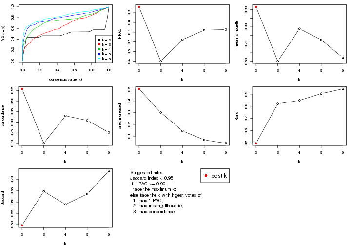

The numeric values for all these statistics can be obtained by `get_stats()`.

```r
get_stats(res)
```

```
#>   k 1-PAC mean_silhouette concordance area_increased  Rand Jaccard
#> 2 2 0.961           0.916       0.957         0.5028 0.497   0.497
#> 3 3 0.400           0.601       0.701         0.3014 0.820   0.647
#> 4 4 0.623           0.789       0.830         0.1447 0.849   0.589
#> 5 5 0.721           0.725       0.809         0.0685 0.904   0.636
#> 6 6 0.727           0.621       0.752         0.0396 0.943   0.739
```

`suggest_best_k()` suggests the best $k$ based on these statistics. The rules are as follows:

- All $k$ with Jaccard index larger than 0.95 are removed because increasing
  $k$ does not provide enough extra information. If all $k$ are removed, it is
  marked as no subgroup is detected.
- For all $k$ with 1-PAC score larger than 0.9, the maximal $k$ is taken as
  the best $k$, and other $k$ are marked as optional $k$.
- If it does not fit the second rule. The $k$ with the maximal vote of the
  highest 1-PAC score, highest mean silhouette, and highest concordance is
  taken as the best $k$.

```r
suggest_best_k(res)
```

```
#> [1] 2
```


Following shows the table of the partitions (You need to click the **show/hide
code output** link to see it). The membership matrix (columns with name `p*`)
is inferred by
[`clue::cl_consensus()`](https://www.rdocumentation.org/link/cl_consensus?package=clue)
function with the `SE` method. Basically the value in the membership matrix
represents the probability to belong to a certain group. The finall class
label for an item is determined with the group with highest probability it
belongs to.

In `get_classes()` function, the entropy is calculated from the membership
matrix and the silhouette score is calculated from the consensus matrix.


<script>
$( function() {
	$( '#tabs-SD-kmeans-get-classes' ).tabs();
} );
</script>
<div id='tabs-SD-kmeans-get-classes'>
<ul>
<li><a href='#tab-SD-kmeans-get-classes-1'>k = 2</a></li>
<li><a href='#tab-SD-kmeans-get-classes-2'>k = 3</a></li>
<li><a href='#tab-SD-kmeans-get-classes-3'>k = 4</a></li>
<li><a href='#tab-SD-kmeans-get-classes-4'>k = 5</a></li>
<li><a href='#tab-SD-kmeans-get-classes-5'>k = 6</a></li>
</ul>

<div id='tab-SD-kmeans-get-classes-1'>
<p><a id='tab-SD-kmeans-get-classes-1-a' style='color:#0366d6' href='#'>show/hide code output</a></p>
<pre><code class="r">cbind(get_classes(res, k = 2), get_membership(res, k = 2))
</code></pre>

<pre><code>#&gt;           class entropy silhouette    p1    p2
#&gt; GSM680053     2  0.0672     0.9537 0.008 0.992
#&gt; GSM680062     1  0.9977     0.0176 0.528 0.472
#&gt; GSM680054     2  0.0000     0.9548 0.000 1.000
#&gt; GSM680063     2  0.9909     0.1832 0.444 0.556
#&gt; GSM680055     2  0.0672     0.9537 0.008 0.992
#&gt; GSM680064     1  0.2043     0.9598 0.968 0.032
#&gt; GSM680056     1  0.2603     0.9550 0.956 0.044
#&gt; GSM680065     1  0.2236     0.9593 0.964 0.036
#&gt; GSM680057     2  0.2043     0.9500 0.032 0.968
#&gt; GSM680066     1  0.1843     0.9605 0.972 0.028
#&gt; GSM680058     2  0.0938     0.9534 0.012 0.988
#&gt; GSM680067     2  0.2236     0.9480 0.036 0.964
#&gt; GSM680059     2  0.1184     0.9549 0.016 0.984
#&gt; GSM680068     1  0.1843     0.9605 0.972 0.028
#&gt; GSM680060     2  0.0938     0.9534 0.012 0.988
#&gt; GSM680069     2  0.7139     0.7488 0.196 0.804
#&gt; GSM680061     2  0.2236     0.9480 0.036 0.964
#&gt; GSM680070     1  0.2236     0.9593 0.964 0.036
#&gt; GSM680071     2  0.7219     0.7504 0.200 0.800
#&gt; GSM680077     1  0.2236     0.9593 0.964 0.036
#&gt; GSM680072     2  0.0000     0.9548 0.000 1.000
#&gt; GSM680078     1  0.2236     0.9593 0.964 0.036
#&gt; GSM680073     2  0.0672     0.9537 0.008 0.992
#&gt; GSM680079     1  0.2236     0.9593 0.964 0.036
#&gt; GSM680074     2  0.0938     0.9534 0.012 0.988
#&gt; GSM680080     2  0.0000     0.9548 0.000 1.000
#&gt; GSM680075     2  0.0672     0.9537 0.008 0.992
#&gt; GSM680081     2  0.0672     0.9537 0.008 0.992
#&gt; GSM680076     2  0.0376     0.9546 0.004 0.996
#&gt; GSM680082     1  0.2043     0.9599 0.968 0.032
#&gt; GSM680029     2  0.0938     0.9546 0.012 0.988
#&gt; GSM680041     1  0.0672     0.9570 0.992 0.008
#&gt; GSM680035     2  0.1843     0.9541 0.028 0.972
#&gt; GSM680047     1  0.0376     0.9584 0.996 0.004
#&gt; GSM680036     2  0.0672     0.9537 0.008 0.992
#&gt; GSM680048     1  0.0672     0.9570 0.992 0.008
#&gt; GSM680037     2  0.1843     0.9541 0.028 0.972
#&gt; GSM680049     1  0.0672     0.9570 0.992 0.008
#&gt; GSM680038     2  0.2043     0.9500 0.032 0.968
#&gt; GSM680050     1  0.1414     0.9594 0.980 0.020
#&gt; GSM680039     2  0.1843     0.9514 0.028 0.972
#&gt; GSM680051     1  0.0672     0.9570 0.992 0.008
#&gt; GSM680040     2  0.1843     0.9541 0.028 0.972
#&gt; GSM680052     1  0.0672     0.9570 0.992 0.008
#&gt; GSM680030     2  0.2043     0.9500 0.032 0.968
#&gt; GSM680042     1  0.0376     0.9584 0.996 0.004
#&gt; GSM680031     2  0.1843     0.9541 0.028 0.972
#&gt; GSM680043     1  0.0376     0.9592 0.996 0.004
#&gt; GSM680032     1  0.2236     0.9593 0.964 0.036
#&gt; GSM680044     1  0.1184     0.9590 0.984 0.016
#&gt; GSM680033     2  0.1843     0.9541 0.028 0.972
#&gt; GSM680045     1  0.0000     0.9588 1.000 0.000
#&gt; GSM680034     2  0.2236     0.9480 0.036 0.964
#&gt; GSM680046     1  0.0376     0.9584 0.996 0.004
</code></pre>

<script>
$('#tab-SD-kmeans-get-classes-1-a').parent().next().next().hide();
$('#tab-SD-kmeans-get-classes-1-a').click(function(){
  $('#tab-SD-kmeans-get-classes-1-a').parent().next().next().toggle();
  return(false);
});
</script>
</div>

<div id='tab-SD-kmeans-get-classes-2'>
<p><a id='tab-SD-kmeans-get-classes-2-a' style='color:#0366d6' href='#'>show/hide code output</a></p>
<pre><code class="r">cbind(get_classes(res, k = 3), get_membership(res, k = 3))
</code></pre>

<pre><code>#&gt;           class entropy silhouette    p1    p2    p3
#&gt; GSM680053     3  0.6271      0.614 0.088 0.140 0.772
#&gt; GSM680062     3  0.6808      0.543 0.084 0.184 0.732
#&gt; GSM680054     3  0.5926     -0.193 0.000 0.356 0.644
#&gt; GSM680063     3  0.6625      0.565 0.080 0.176 0.744
#&gt; GSM680055     3  0.6271      0.614 0.088 0.140 0.772
#&gt; GSM680064     1  0.2959      0.747 0.900 0.100 0.000
#&gt; GSM680056     1  0.8937      0.230 0.540 0.152 0.308
#&gt; GSM680065     1  0.4677      0.718 0.840 0.132 0.028
#&gt; GSM680057     3  0.6308     -0.742 0.000 0.492 0.508
#&gt; GSM680066     1  0.4128      0.719 0.856 0.012 0.132
#&gt; GSM680058     2  0.6244      0.759 0.000 0.560 0.440
#&gt; GSM680067     2  0.5733      0.659 0.000 0.676 0.324
#&gt; GSM680059     3  0.3482      0.529 0.000 0.128 0.872
#&gt; GSM680068     1  0.2636      0.747 0.932 0.020 0.048
#&gt; GSM680060     2  0.6235      0.758 0.000 0.564 0.436
#&gt; GSM680069     3  0.8474      0.436 0.252 0.144 0.604
#&gt; GSM680061     2  0.5785      0.667 0.000 0.668 0.332
#&gt; GSM680070     1  0.1525      0.740 0.964 0.004 0.032
#&gt; GSM680071     2  0.7642      0.322 0.248 0.660 0.092
#&gt; GSM680077     1  0.2031      0.736 0.952 0.016 0.032
#&gt; GSM680072     2  0.6286      0.739 0.000 0.536 0.464
#&gt; GSM680078     1  0.5115      0.631 0.796 0.016 0.188
#&gt; GSM680073     3  0.4399      0.465 0.000 0.188 0.812
#&gt; GSM680079     1  0.1289      0.741 0.968 0.000 0.032
#&gt; GSM680074     2  0.6286      0.752 0.000 0.536 0.464
#&gt; GSM680080     2  0.6291      0.749 0.000 0.532 0.468
#&gt; GSM680075     3  0.4369      0.641 0.040 0.096 0.864
#&gt; GSM680081     3  0.3459      0.649 0.096 0.012 0.892
#&gt; GSM680076     2  0.8314      0.690 0.092 0.556 0.352
#&gt; GSM680082     1  0.1877      0.737 0.956 0.012 0.032
#&gt; GSM680029     3  0.1163      0.674 0.028 0.000 0.972
#&gt; GSM680041     1  0.6735      0.729 0.564 0.424 0.012
#&gt; GSM680035     3  0.0424      0.668 0.000 0.008 0.992
#&gt; GSM680047     1  0.8570      0.705 0.476 0.428 0.096
#&gt; GSM680036     3  0.3550      0.657 0.024 0.080 0.896
#&gt; GSM680048     1  0.8608      0.709 0.488 0.412 0.100
#&gt; GSM680037     3  0.0475      0.671 0.004 0.004 0.992
#&gt; GSM680049     1  0.6490      0.737 0.628 0.360 0.012
#&gt; GSM680038     2  0.6295      0.735 0.000 0.528 0.472
#&gt; GSM680050     1  0.2165      0.752 0.936 0.064 0.000
#&gt; GSM680039     3  0.6252     -0.668 0.000 0.444 0.556
#&gt; GSM680051     1  0.8608      0.709 0.488 0.412 0.100
#&gt; GSM680040     3  0.0424      0.668 0.000 0.008 0.992
#&gt; GSM680052     1  0.8608      0.709 0.488 0.412 0.100
#&gt; GSM680030     2  0.6309      0.719 0.000 0.504 0.496
#&gt; GSM680042     1  0.6701      0.733 0.576 0.412 0.012
#&gt; GSM680031     3  0.0237      0.670 0.000 0.004 0.996
#&gt; GSM680043     1  0.8394      0.722 0.576 0.316 0.108
#&gt; GSM680032     1  0.3148      0.734 0.916 0.048 0.036
#&gt; GSM680044     1  0.8464      0.731 0.596 0.272 0.132
#&gt; GSM680033     3  0.0592      0.664 0.000 0.012 0.988
#&gt; GSM680045     1  0.8394      0.722 0.576 0.316 0.108
#&gt; GSM680034     2  0.6126      0.592 0.000 0.600 0.400
#&gt; GSM680046     1  0.7533      0.738 0.600 0.348 0.052
</code></pre>

<script>
$('#tab-SD-kmeans-get-classes-2-a').parent().next().next().hide();
$('#tab-SD-kmeans-get-classes-2-a').click(function(){
  $('#tab-SD-kmeans-get-classes-2-a').parent().next().next().toggle();
  return(false);
});
</script>
</div>

<div id='tab-SD-kmeans-get-classes-3'>
<p><a id='tab-SD-kmeans-get-classes-3-a' style='color:#0366d6' href='#'>show/hide code output</a></p>
<pre><code class="r">cbind(get_classes(res, k = 4), get_membership(res, k = 4))
</code></pre>

<pre><code>#&gt;           class entropy silhouette    p1    p2    p3    p4
#&gt; GSM680053     3   0.562      0.739 0.044 0.072 0.768 0.116
#&gt; GSM680062     3   0.590      0.732 0.048 0.060 0.744 0.148
#&gt; GSM680054     2   0.706      0.369 0.016 0.544 0.352 0.088
#&gt; GSM680063     3   0.587      0.731 0.048 0.064 0.748 0.140
#&gt; GSM680055     3   0.577      0.736 0.048 0.076 0.760 0.116
#&gt; GSM680064     1   0.380      0.810 0.832 0.012 0.008 0.148
#&gt; GSM680056     1   0.776      0.536 0.612 0.076 0.148 0.164
#&gt; GSM680065     1   0.596      0.673 0.724 0.020 0.088 0.168
#&gt; GSM680057     2   0.336      0.817 0.000 0.824 0.176 0.000
#&gt; GSM680066     1   0.329      0.838 0.884 0.016 0.020 0.080
#&gt; GSM680058     2   0.149      0.844 0.000 0.952 0.044 0.004
#&gt; GSM680067     2   0.323      0.811 0.000 0.880 0.048 0.072
#&gt; GSM680059     3   0.464      0.691 0.004 0.208 0.764 0.024
#&gt; GSM680068     1   0.252      0.852 0.908 0.016 0.000 0.076
#&gt; GSM680060     2   0.121      0.843 0.000 0.964 0.032 0.004
#&gt; GSM680069     3   0.848      0.381 0.288 0.084 0.500 0.128
#&gt; GSM680061     2   0.324      0.812 0.000 0.880 0.052 0.068
#&gt; GSM680070     1   0.182      0.862 0.936 0.004 0.000 0.060
#&gt; GSM680071     2   0.638      0.637 0.060 0.720 0.084 0.136
#&gt; GSM680077     1   0.198      0.864 0.940 0.016 0.004 0.040
#&gt; GSM680072     2   0.293      0.827 0.004 0.896 0.076 0.024
#&gt; GSM680078     1   0.192      0.852 0.944 0.004 0.024 0.028
#&gt; GSM680073     3   0.600      0.661 0.032 0.284 0.660 0.024
#&gt; GSM680079     1   0.166      0.864 0.944 0.004 0.000 0.052
#&gt; GSM680074     2   0.236      0.840 0.000 0.920 0.056 0.024
#&gt; GSM680080     2   0.236      0.840 0.000 0.920 0.056 0.024
#&gt; GSM680075     3   0.578      0.738 0.044 0.208 0.720 0.028
#&gt; GSM680081     3   0.320      0.791 0.036 0.060 0.892 0.012
#&gt; GSM680076     2   0.274      0.821 0.052 0.912 0.012 0.024
#&gt; GSM680082     1   0.168      0.866 0.948 0.012 0.000 0.040
#&gt; GSM680029     3   0.267      0.798 0.020 0.060 0.912 0.008
#&gt; GSM680041     4   0.326      0.857 0.108 0.008 0.012 0.872
#&gt; GSM680035     3   0.280      0.798 0.020 0.060 0.908 0.012
#&gt; GSM680047     4   0.299      0.892 0.100 0.004 0.012 0.884
#&gt; GSM680036     3   0.517      0.756 0.036 0.088 0.796 0.080
#&gt; GSM680048     4   0.368      0.907 0.120 0.016 0.012 0.852
#&gt; GSM680037     3   0.280      0.798 0.020 0.060 0.908 0.012
#&gt; GSM680049     4   0.363      0.885 0.184 0.004 0.000 0.812
#&gt; GSM680038     2   0.292      0.827 0.000 0.860 0.140 0.000
#&gt; GSM680050     1   0.345      0.829 0.864 0.012 0.012 0.112
#&gt; GSM680039     2   0.472      0.661 0.004 0.672 0.324 0.000
#&gt; GSM680051     4   0.410      0.906 0.112 0.016 0.032 0.840
#&gt; GSM680040     3   0.280      0.798 0.020 0.060 0.908 0.012
#&gt; GSM680052     4   0.410      0.906 0.112 0.016 0.032 0.840
#&gt; GSM680030     2   0.340      0.822 0.004 0.832 0.164 0.000
#&gt; GSM680042     4   0.363      0.883 0.144 0.008 0.008 0.840
#&gt; GSM680031     3   0.280      0.798 0.020 0.060 0.908 0.012
#&gt; GSM680043     4   0.556      0.843 0.228 0.016 0.040 0.716
#&gt; GSM680032     1   0.194      0.857 0.944 0.008 0.016 0.032
#&gt; GSM680044     4   0.551      0.792 0.284 0.020 0.016 0.680
#&gt; GSM680033     3   0.280      0.798 0.020 0.060 0.908 0.012
#&gt; GSM680045     4   0.544      0.861 0.196 0.016 0.048 0.740
#&gt; GSM680034     2   0.500      0.770 0.000 0.768 0.148 0.084
#&gt; GSM680046     4   0.433      0.895 0.172 0.016 0.012 0.800
</code></pre>

<script>
$('#tab-SD-kmeans-get-classes-3-a').parent().next().next().hide();
$('#tab-SD-kmeans-get-classes-3-a').click(function(){
  $('#tab-SD-kmeans-get-classes-3-a').parent().next().next().toggle();
  return(false);
});
</script>
</div>

<div id='tab-SD-kmeans-get-classes-4'>
<p><a id='tab-SD-kmeans-get-classes-4-a' style='color:#0366d6' href='#'>show/hide code output</a></p>
<pre><code class="r">cbind(get_classes(res, k = 5), get_membership(res, k = 5))
</code></pre>

<pre><code>#&gt;           class entropy silhouette    p1    p2    p3    p4    p5
#&gt; GSM680053     5  0.4783     0.6885 0.008 0.008 0.372 0.004 0.608
#&gt; GSM680062     5  0.5413     0.7126 0.012 0.008 0.340 0.032 0.608
#&gt; GSM680054     5  0.6458     0.4598 0.000 0.280 0.224 0.000 0.496
#&gt; GSM680063     5  0.5413     0.7126 0.012 0.008 0.340 0.032 0.608
#&gt; GSM680055     5  0.5041     0.7164 0.012 0.008 0.328 0.016 0.636
#&gt; GSM680064     1  0.4113     0.8200 0.804 0.004 0.004 0.108 0.080
#&gt; GSM680056     5  0.4812     0.6098 0.172 0.004 0.048 0.024 0.752
#&gt; GSM680065     5  0.4268     0.4504 0.268 0.000 0.000 0.024 0.708
#&gt; GSM680057     2  0.3280     0.7707 0.000 0.824 0.160 0.004 0.012
#&gt; GSM680066     1  0.2056     0.8932 0.928 0.008 0.008 0.048 0.008
#&gt; GSM680058     2  0.2011     0.8181 0.000 0.928 0.020 0.008 0.044
#&gt; GSM680067     2  0.1467     0.8133 0.004 0.956 0.016 0.016 0.008
#&gt; GSM680059     3  0.5746     0.5962 0.000 0.148 0.692 0.044 0.116
#&gt; GSM680068     1  0.1877     0.8940 0.932 0.004 0.004 0.052 0.008
#&gt; GSM680060     2  0.1549     0.8193 0.000 0.944 0.016 0.000 0.040
#&gt; GSM680069     5  0.5120     0.6866 0.068 0.012 0.156 0.020 0.744
#&gt; GSM680061     2  0.1340     0.8137 0.004 0.960 0.016 0.016 0.004
#&gt; GSM680070     1  0.0833     0.9104 0.976 0.000 0.004 0.016 0.004
#&gt; GSM680071     2  0.4841     0.2329 0.004 0.520 0.004 0.008 0.464
#&gt; GSM680077     1  0.3106     0.8757 0.856 0.008 0.020 0.000 0.116
#&gt; GSM680072     2  0.5232     0.7076 0.000 0.704 0.040 0.044 0.212
#&gt; GSM680078     1  0.1369     0.9097 0.956 0.000 0.008 0.008 0.028
#&gt; GSM680073     3  0.6987     0.4252 0.000 0.168 0.528 0.044 0.260
#&gt; GSM680079     1  0.2290     0.9067 0.920 0.004 0.016 0.016 0.044
#&gt; GSM680074     2  0.4038     0.7777 0.000 0.808 0.032 0.028 0.132
#&gt; GSM680080     2  0.4038     0.7777 0.000 0.808 0.032 0.028 0.132
#&gt; GSM680075     3  0.6461     0.4392 0.000 0.104 0.584 0.044 0.268
#&gt; GSM680081     3  0.1404     0.7418 0.028 0.004 0.956 0.004 0.008
#&gt; GSM680076     2  0.4795     0.7477 0.036 0.764 0.012 0.028 0.160
#&gt; GSM680082     1  0.1717     0.9029 0.936 0.008 0.004 0.000 0.052
#&gt; GSM680029     3  0.1685     0.7572 0.004 0.016 0.948 0.016 0.016
#&gt; GSM680041     4  0.2694     0.8344 0.032 0.000 0.004 0.888 0.076
#&gt; GSM680035     3  0.1093     0.7677 0.004 0.020 0.968 0.004 0.004
#&gt; GSM680047     4  0.2308     0.8465 0.036 0.000 0.004 0.912 0.048
#&gt; GSM680036     5  0.4994     0.4937 0.000 0.008 0.464 0.016 0.512
#&gt; GSM680048     4  0.2291     0.8548 0.048 0.012 0.000 0.916 0.024
#&gt; GSM680037     3  0.1093     0.7677 0.004 0.020 0.968 0.004 0.004
#&gt; GSM680049     4  0.3002     0.8418 0.076 0.000 0.004 0.872 0.048
#&gt; GSM680038     2  0.3435     0.7718 0.000 0.820 0.156 0.004 0.020
#&gt; GSM680050     1  0.4184     0.8528 0.808 0.008 0.016 0.044 0.124
#&gt; GSM680039     3  0.4437    -0.0106 0.000 0.464 0.532 0.004 0.000
#&gt; GSM680051     4  0.2309     0.8507 0.036 0.028 0.012 0.920 0.004
#&gt; GSM680040     3  0.0932     0.7683 0.004 0.020 0.972 0.004 0.000
#&gt; GSM680052     4  0.2246     0.8530 0.048 0.020 0.008 0.920 0.004
#&gt; GSM680030     2  0.3674     0.7679 0.008 0.816 0.152 0.004 0.020
#&gt; GSM680042     4  0.2740     0.8396 0.044 0.000 0.004 0.888 0.064
#&gt; GSM680031     3  0.1093     0.7677 0.004 0.020 0.968 0.004 0.004
#&gt; GSM680043     4  0.6082     0.5087 0.352 0.024 0.048 0.564 0.012
#&gt; GSM680032     1  0.2359     0.8946 0.912 0.008 0.004 0.016 0.060
#&gt; GSM680044     4  0.6154     0.3881 0.408 0.028 0.012 0.512 0.040
#&gt; GSM680033     3  0.0932     0.7683 0.004 0.020 0.972 0.004 0.000
#&gt; GSM680045     4  0.5178     0.7505 0.180 0.024 0.052 0.732 0.012
#&gt; GSM680034     2  0.3820     0.7553 0.004 0.816 0.132 0.044 0.004
#&gt; GSM680046     4  0.3153     0.8412 0.076 0.024 0.012 0.876 0.012
</code></pre>

<script>
$('#tab-SD-kmeans-get-classes-4-a').parent().next().next().hide();
$('#tab-SD-kmeans-get-classes-4-a').click(function(){
  $('#tab-SD-kmeans-get-classes-4-a').parent().next().next().toggle();
  return(false);
});
</script>
</div>

<div id='tab-SD-kmeans-get-classes-5'>
<p><a id='tab-SD-kmeans-get-classes-5-a' style='color:#0366d6' href='#'>show/hide code output</a></p>
<pre><code class="r">cbind(get_classes(res, k = 6), get_membership(res, k = 6))
</code></pre>

<pre><code>#&gt;           class entropy silhouette    p1    p2    p3    p4    p5 p6
#&gt; GSM680053     5  0.3536     0.7254 0.000 0.008 0.252 0.000 0.736 NA
#&gt; GSM680062     5  0.3944     0.7347 0.004 0.008 0.240 0.012 0.732 NA
#&gt; GSM680054     5  0.5792     0.6294 0.000 0.180 0.136 0.004 0.632 NA
#&gt; GSM680063     5  0.3944     0.7347 0.004 0.008 0.240 0.012 0.732 NA
#&gt; GSM680055     5  0.3357     0.7400 0.000 0.008 0.224 0.000 0.764 NA
#&gt; GSM680064     1  0.6618     0.4926 0.540 0.000 0.000 0.192 0.116 NA
#&gt; GSM680056     5  0.2495     0.6772 0.052 0.000 0.012 0.004 0.896 NA
#&gt; GSM680065     5  0.2651     0.6430 0.088 0.000 0.000 0.004 0.872 NA
#&gt; GSM680057     2  0.5484     0.6783 0.000 0.568 0.148 0.004 0.000 NA
#&gt; GSM680066     1  0.2044     0.7022 0.920 0.000 0.008 0.028 0.004 NA
#&gt; GSM680058     2  0.3328     0.7154 0.000 0.788 0.008 0.000 0.012 NA
#&gt; GSM680067     2  0.4618     0.7165 0.000 0.652 0.008 0.032 0.008 NA
#&gt; GSM680059     3  0.5555     0.5037 0.004 0.280 0.592 0.000 0.016 NA
#&gt; GSM680068     1  0.1755     0.7052 0.932 0.000 0.008 0.028 0.000 NA
#&gt; GSM680060     2  0.3766     0.7179 0.000 0.684 0.000 0.000 0.012 NA
#&gt; GSM680069     5  0.3492     0.7265 0.028 0.004 0.084 0.000 0.836 NA
#&gt; GSM680061     2  0.4159     0.7209 0.000 0.672 0.008 0.020 0.000 NA
#&gt; GSM680070     1  0.1857     0.7240 0.928 0.000 0.000 0.012 0.032 NA
#&gt; GSM680071     5  0.5911     0.0576 0.000 0.280 0.000 0.000 0.468 NA
#&gt; GSM680077     1  0.5594     0.6001 0.548 0.000 0.000 0.008 0.136 NA
#&gt; GSM680072     2  0.4024     0.5097 0.000 0.784 0.020 0.000 0.080 NA
#&gt; GSM680078     1  0.2084     0.7188 0.916 0.000 0.016 0.000 0.044 NA
#&gt; GSM680073     2  0.7093    -0.3573 0.004 0.380 0.372 0.000 0.120 NA
#&gt; GSM680079     1  0.5148     0.6504 0.636 0.000 0.000 0.016 0.092 NA
#&gt; GSM680074     2  0.0363     0.6592 0.000 0.988 0.012 0.000 0.000 NA
#&gt; GSM680080     2  0.0363     0.6592 0.000 0.988 0.012 0.000 0.000 NA
#&gt; GSM680075     3  0.7177     0.3112 0.008 0.284 0.448 0.000 0.136 NA
#&gt; GSM680081     3  0.0622     0.7863 0.012 0.000 0.980 0.000 0.000 NA
#&gt; GSM680076     2  0.2786     0.6002 0.024 0.864 0.000 0.000 0.012 NA
#&gt; GSM680082     1  0.3465     0.7151 0.812 0.000 0.000 0.008 0.048 NA
#&gt; GSM680029     3  0.1707     0.7587 0.004 0.000 0.928 0.000 0.012 NA
#&gt; GSM680041     4  0.2795     0.8061 0.000 0.000 0.000 0.856 0.044 NA
#&gt; GSM680035     3  0.0000     0.7950 0.000 0.000 1.000 0.000 0.000 NA
#&gt; GSM680047     4  0.2653     0.8136 0.004 0.000 0.000 0.868 0.028 NA
#&gt; GSM680036     5  0.5434     0.5340 0.004 0.012 0.324 0.000 0.572 NA
#&gt; GSM680048     4  0.0291     0.8157 0.004 0.000 0.000 0.992 0.004 NA
#&gt; GSM680037     3  0.0000     0.7950 0.000 0.000 1.000 0.000 0.000 NA
#&gt; GSM680049     4  0.2492     0.8127 0.004 0.000 0.000 0.876 0.020 NA
#&gt; GSM680038     2  0.5907     0.6805 0.000 0.556 0.140 0.004 0.020 NA
#&gt; GSM680050     1  0.6091     0.5820 0.500 0.000 0.000 0.028 0.144 NA
#&gt; GSM680039     3  0.5828    -0.0572 0.000 0.272 0.516 0.004 0.000 NA
#&gt; GSM680051     4  0.1679     0.8035 0.028 0.008 0.000 0.936 0.000 NA
#&gt; GSM680040     3  0.0000     0.7950 0.000 0.000 1.000 0.000 0.000 NA
#&gt; GSM680052     4  0.1743     0.8038 0.028 0.008 0.000 0.936 0.004 NA
#&gt; GSM680030     2  0.5732     0.6716 0.004 0.524 0.144 0.004 0.000 NA
#&gt; GSM680042     4  0.2795     0.8061 0.000 0.000 0.000 0.856 0.044 NA
#&gt; GSM680031     3  0.0291     0.7908 0.000 0.004 0.992 0.000 0.004 NA
#&gt; GSM680043     1  0.5943     0.1481 0.524 0.012 0.048 0.368 0.004 NA
#&gt; GSM680032     1  0.3249     0.7078 0.836 0.000 0.000 0.008 0.060 NA
#&gt; GSM680044     1  0.5647     0.2747 0.556 0.000 0.004 0.328 0.020 NA
#&gt; GSM680033     3  0.0000     0.7950 0.000 0.000 1.000 0.000 0.000 NA
#&gt; GSM680045     4  0.6101     0.0662 0.408 0.012 0.056 0.476 0.004 NA
#&gt; GSM680034     2  0.6476     0.6596 0.012 0.516 0.124 0.048 0.000 NA
#&gt; GSM680046     4  0.3414     0.7034 0.140 0.008 0.000 0.812 0.000 NA
</code></pre>

<script>
$('#tab-SD-kmeans-get-classes-5-a').parent().next().next().hide();
$('#tab-SD-kmeans-get-classes-5-a').click(function(){
  $('#tab-SD-kmeans-get-classes-5-a').parent().next().next().toggle();
  return(false);
});
</script>
</div>
</div>

Heatmaps for the consensus matrix. It visualizes the probability of two
samples to be in a same group.


<script>
$( function() {
	$( '#tabs-SD-kmeans-consensus-heatmap' ).tabs();
} );
</script>
<div id='tabs-SD-kmeans-consensus-heatmap'>
<ul>
<li><a href='#tab-SD-kmeans-consensus-heatmap-1'>k = 2</a></li>
<li><a href='#tab-SD-kmeans-consensus-heatmap-2'>k = 3</a></li>
<li><a href='#tab-SD-kmeans-consensus-heatmap-3'>k = 4</a></li>
<li><a href='#tab-SD-kmeans-consensus-heatmap-4'>k = 5</a></li>
<li><a href='#tab-SD-kmeans-consensus-heatmap-5'>k = 6</a></li>
</ul>
<div id='tab-SD-kmeans-consensus-heatmap-1'>
<pre><code class="r">consensus_heatmap(res, k = 2)
</code></pre>

<p>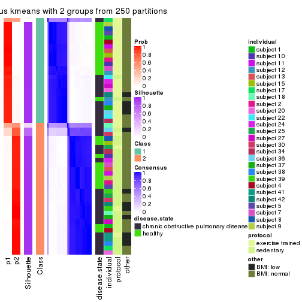</p>

</div>
<div id='tab-SD-kmeans-consensus-heatmap-2'>
<pre><code class="r">consensus_heatmap(res, k = 3)
</code></pre>

<p>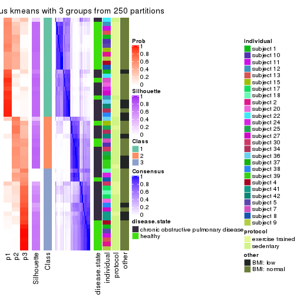</p>

</div>
<div id='tab-SD-kmeans-consensus-heatmap-3'>
<pre><code class="r">consensus_heatmap(res, k = 4)
</code></pre>

<p>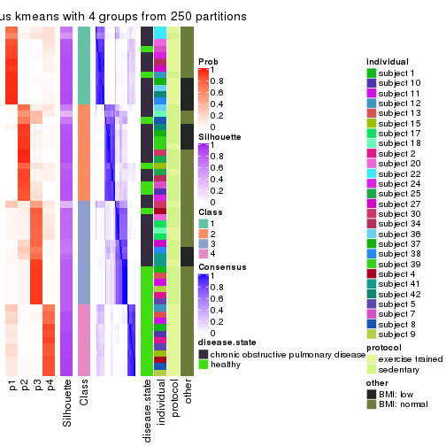</p>

</div>
<div id='tab-SD-kmeans-consensus-heatmap-4'>
<pre><code class="r">consensus_heatmap(res, k = 5)
</code></pre>

<p>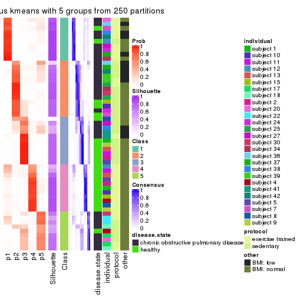</p>

</div>
<div id='tab-SD-kmeans-consensus-heatmap-5'>
<pre><code class="r">consensus_heatmap(res, k = 6)
</code></pre>

<p>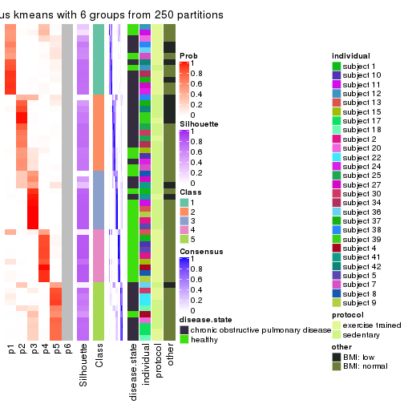</p>

</div>
</div>

Heatmaps for the membership of samples in all partitions to see how consistent they are:


<script>
$( function() {
	$( '#tabs-SD-kmeans-membership-heatmap' ).tabs();
} );
</script>
<div id='tabs-SD-kmeans-membership-heatmap'>
<ul>
<li><a href='#tab-SD-kmeans-membership-heatmap-1'>k = 2</a></li>
<li><a href='#tab-SD-kmeans-membership-heatmap-2'>k = 3</a></li>
<li><a href='#tab-SD-kmeans-membership-heatmap-3'>k = 4</a></li>
<li><a href='#tab-SD-kmeans-membership-heatmap-4'>k = 5</a></li>
<li><a href='#tab-SD-kmeans-membership-heatmap-5'>k = 6</a></li>
</ul>
<div id='tab-SD-kmeans-membership-heatmap-1'>
<pre><code class="r">membership_heatmap(res, k = 2)
</code></pre>

<p>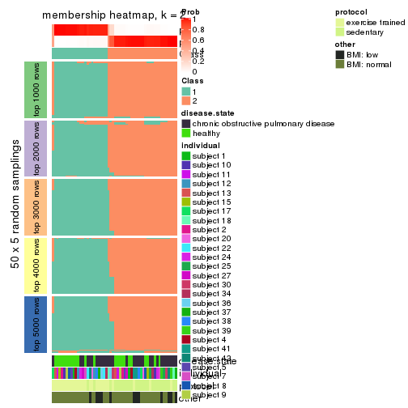</p>

</div>
<div id='tab-SD-kmeans-membership-heatmap-2'>
<pre><code class="r">membership_heatmap(res, k = 3)
</code></pre>

<p>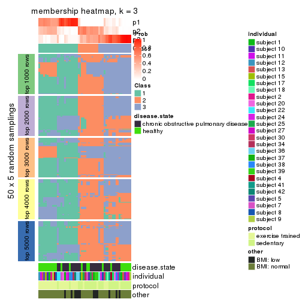</p>

</div>
<div id='tab-SD-kmeans-membership-heatmap-3'>
<pre><code class="r">membership_heatmap(res, k = 4)
</code></pre>

<p>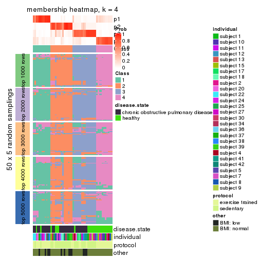</p>

</div>
<div id='tab-SD-kmeans-membership-heatmap-4'>
<pre><code class="r">membership_heatmap(res, k = 5)
</code></pre>

<p>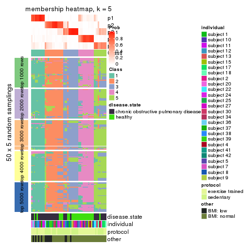</p>

</div>
<div id='tab-SD-kmeans-membership-heatmap-5'>
<pre><code class="r">membership_heatmap(res, k = 6)
</code></pre>

<p>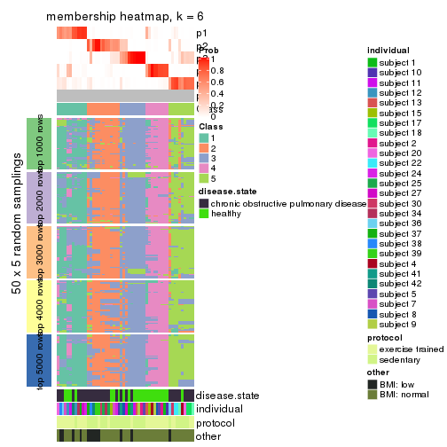</p>

</div>
</div>

As soon as we have had the classes for columns, we can look for signatures
which are significantly different between classes which can be candidate marks
for certain classes. Following are the heatmaps for signatures.


Signature heatmaps where rows are scaled:


<script>
$( function() {
	$( '#tabs-SD-kmeans-get-signatures' ).tabs();
} );
</script>
<div id='tabs-SD-kmeans-get-signatures'>
<ul>
<li><a href='#tab-SD-kmeans-get-signatures-1'>k = 2</a></li>
<li><a href='#tab-SD-kmeans-get-signatures-2'>k = 3</a></li>
<li><a href='#tab-SD-kmeans-get-signatures-3'>k = 4</a></li>
<li><a href='#tab-SD-kmeans-get-signatures-4'>k = 5</a></li>
<li><a href='#tab-SD-kmeans-get-signatures-5'>k = 6</a></li>
</ul>
<div id='tab-SD-kmeans-get-signatures-1'>
<pre><code class="r">get_signatures(res, k = 2)
</code></pre>

<p>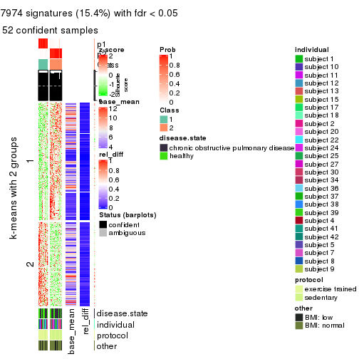</p>

</div>
<div id='tab-SD-kmeans-get-signatures-2'>
<pre><code class="r">get_signatures(res, k = 3)
</code></pre>

<p>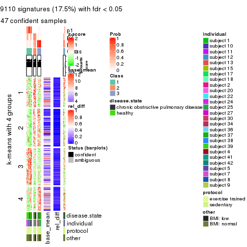</p>

</div>
<div id='tab-SD-kmeans-get-signatures-3'>
<pre><code class="r">get_signatures(res, k = 4)
</code></pre>

<p>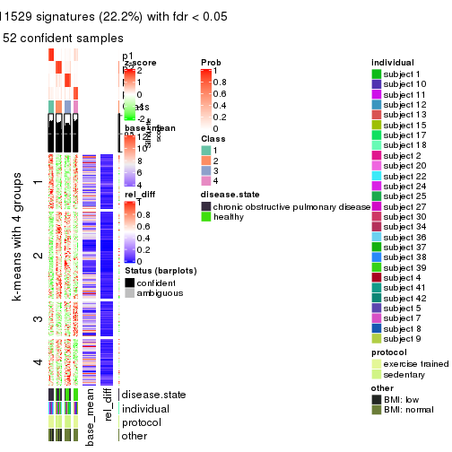</p>

</div>
<div id='tab-SD-kmeans-get-signatures-4'>
<pre><code class="r">get_signatures(res, k = 5)
</code></pre>

<p>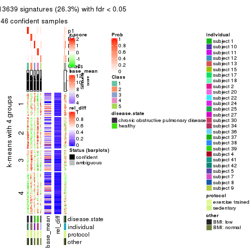</p>

</div>
<div id='tab-SD-kmeans-get-signatures-5'>
<pre><code class="r">get_signatures(res, k = 6)
</code></pre>

<p>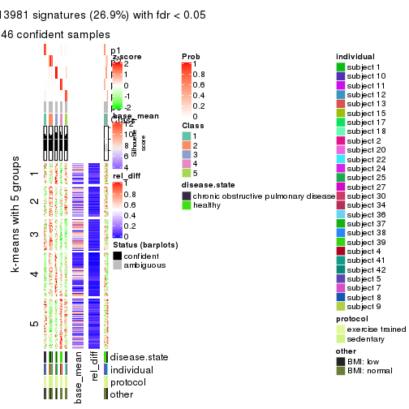</p>

</div>
</div>


Signature heatmaps where rows are not scaled:


<script>
$( function() {
	$( '#tabs-SD-kmeans-get-signatures-no-scale' ).tabs();
} );
</script>
<div id='tabs-SD-kmeans-get-signatures-no-scale'>
<ul>
<li><a href='#tab-SD-kmeans-get-signatures-no-scale-1'>k = 2</a></li>
<li><a href='#tab-SD-kmeans-get-signatures-no-scale-2'>k = 3</a></li>
<li><a href='#tab-SD-kmeans-get-signatures-no-scale-3'>k = 4</a></li>
<li><a href='#tab-SD-kmeans-get-signatures-no-scale-4'>k = 5</a></li>
<li><a href='#tab-SD-kmeans-get-signatures-no-scale-5'>k = 6</a></li>
</ul>
<div id='tab-SD-kmeans-get-signatures-no-scale-1'>
<pre><code class="r">get_signatures(res, k = 2, scale_rows = FALSE)
</code></pre>

<p>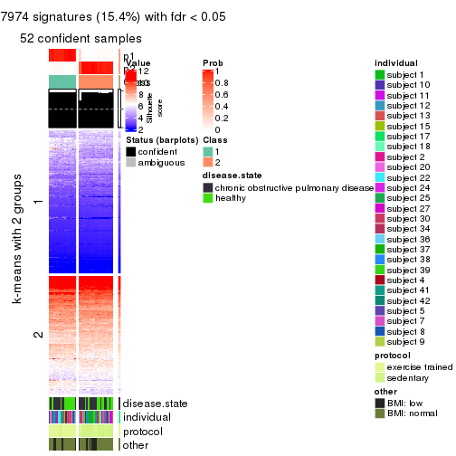</p>

</div>
<div id='tab-SD-kmeans-get-signatures-no-scale-2'>
<pre><code class="r">get_signatures(res, k = 3, scale_rows = FALSE)
</code></pre>

<p>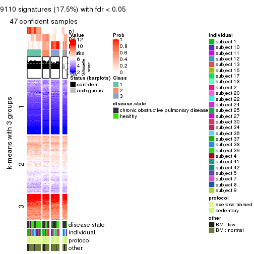</p>

</div>
<div id='tab-SD-kmeans-get-signatures-no-scale-3'>
<pre><code class="r">get_signatures(res, k = 4, scale_rows = FALSE)
</code></pre>

<p>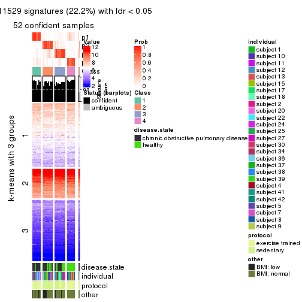</p>

</div>
<div id='tab-SD-kmeans-get-signatures-no-scale-4'>
<pre><code class="r">get_signatures(res, k = 5, scale_rows = FALSE)
</code></pre>

<p>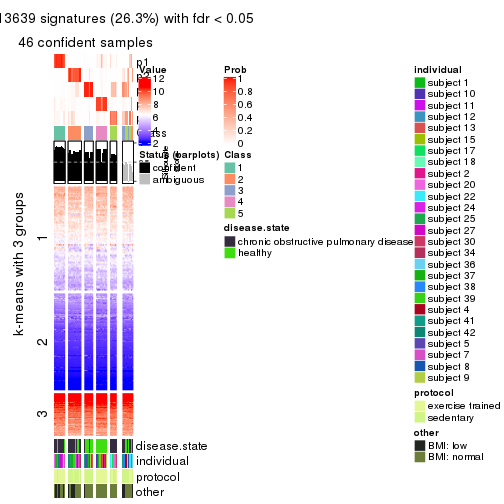</p>

</div>
<div id='tab-SD-kmeans-get-signatures-no-scale-5'>
<pre><code class="r">get_signatures(res, k = 6, scale_rows = FALSE)
</code></pre>

<p>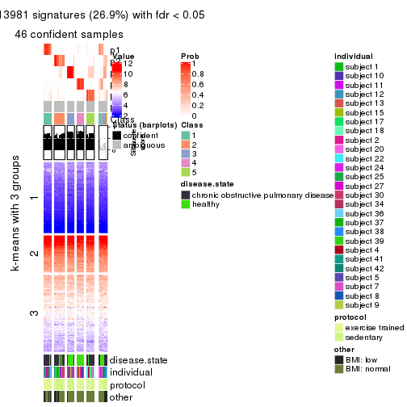</p>

</div>
</div>


Compare the overlap of signatures from different k:

```r
compare_signatures(res)
```

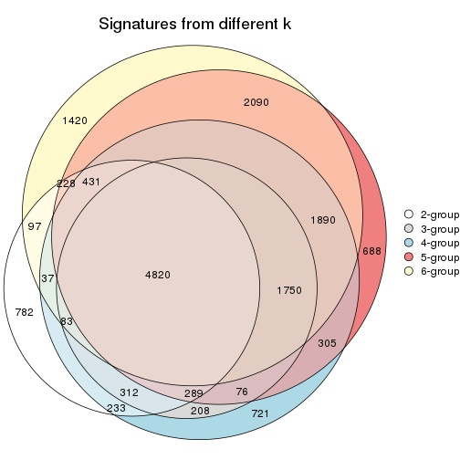

`get_signature()` returns a data frame invisibly. TO get the list of signatures, the function
call should be assigned to a variable explicitly. In following code, if `plot` argument is set
to `FALSE`, no heatmap is plotted while only the differential analysis is performed.

```r
# code only for demonstration
tb = get_signature(res, k = ..., plot = FALSE)
```

An example of the output of `tb` is:

```
#>   which_row         fdr    mean_1    mean_2 scaled_mean_1 scaled_mean_2 km
#> 1        38 0.042760348  8.373488  9.131774    -0.5533452     0.5164555  1
#> 2        40 0.018707592  7.106213  8.469186    -0.6173731     0.5762149  1
#> 3        55 0.019134737 10.221463 11.207825    -0.6159697     0.5749050  1
#> 4        59 0.006059896  5.921854  7.869574    -0.6899429     0.6439467  1
#> 5        60 0.018055526  8.928898 10.211722    -0.6204761     0.5791110  1
#> 6        98 0.009384629 15.714769 14.887706     0.6635654    -0.6193277  2
...
```

The columns in `tb` are:

1. `which_row`: row indices corresponding to the input matrix.
2. `fdr`: FDR for the differential test. 
3. `mean_x`: The mean value in group x.
4. `scaled_mean_x`: The mean value in group x after rows are scaled.
5. `km`: Row groups if k-means clustering is applied to rows.


UMAP plot which shows how samples are separated.


<script>
$( function() {
	$( '#tabs-SD-kmeans-dimension-reduction' ).tabs();
} );
</script>
<div id='tabs-SD-kmeans-dimension-reduction'>
<ul>
<li><a href='#tab-SD-kmeans-dimension-reduction-1'>k = 2</a></li>
<li><a href='#tab-SD-kmeans-dimension-reduction-2'>k = 3</a></li>
<li><a href='#tab-SD-kmeans-dimension-reduction-3'>k = 4</a></li>
<li><a href='#tab-SD-kmeans-dimension-reduction-4'>k = 5</a></li>
<li><a href='#tab-SD-kmeans-dimension-reduction-5'>k = 6</a></li>
</ul>
<div id='tab-SD-kmeans-dimension-reduction-1'>
<pre><code class="r">dimension_reduction(res, k = 2, method = &quot;UMAP&quot;)
</code></pre>

<p>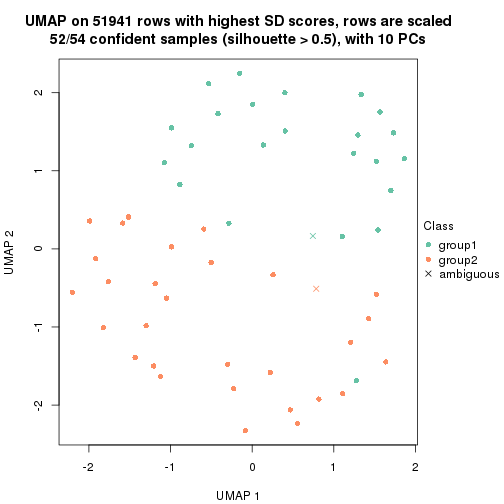</p>

</div>
<div id='tab-SD-kmeans-dimension-reduction-2'>
<pre><code class="r">dimension_reduction(res, k = 3, method = &quot;UMAP&quot;)
</code></pre>

<p>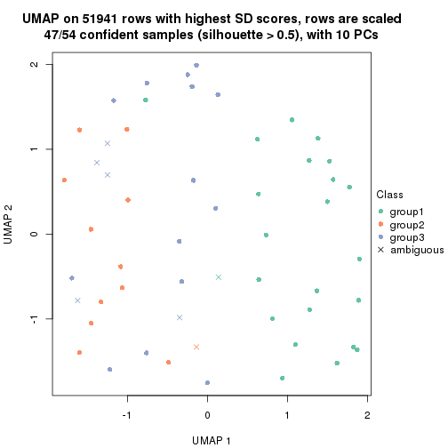</p>

</div>
<div id='tab-SD-kmeans-dimension-reduction-3'>
<pre><code class="r">dimension_reduction(res, k = 4, method = &quot;UMAP&quot;)
</code></pre>

<p>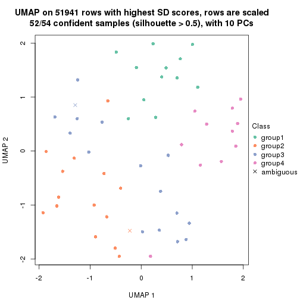</p>

</div>
<div id='tab-SD-kmeans-dimension-reduction-4'>
<pre><code class="r">dimension_reduction(res, k = 5, method = &quot;UMAP&quot;)
</code></pre>

<p>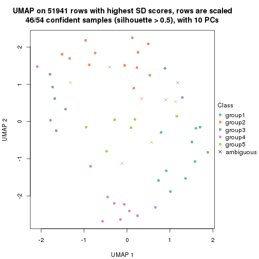</p>

</div>
<div id='tab-SD-kmeans-dimension-reduction-5'>
<pre><code class="r">dimension_reduction(res, k = 6, method = &quot;UMAP&quot;)
</code></pre>

<p>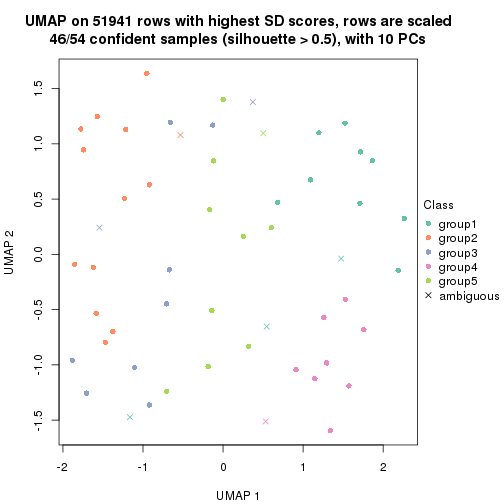</p>

</div>
</div>


Following heatmap shows how subgroups are split when increasing `k`:

```r
collect_classes(res)
```

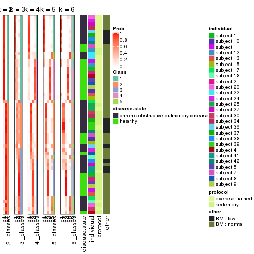


Test correlation between subgroups and known annotations. If the known
annotation is numeric, one-way ANOVA test is applied, and if the known
annotation is discrete, chi-squared contingency table test is applied.

```r
test_to_known_factors(res)
```

```
#>            n disease.state(p) individual(p) protocol(p) other(p) k
#> SD:kmeans 52         2.91e-01         0.979    1.31e-07   0.5925 2
#> SD:kmeans 47         2.25e-01         0.551    1.38e-06   0.3626 3
#> SD:kmeans 52         3.04e-04         0.598    2.38e-06   0.1479 4
#> SD:kmeans 46         6.53e-05         0.417    3.05e-05   0.0830 5
#> SD:kmeans 46         3.48e-04         0.242    1.06e-04   0.0524 6
```


If matrix rows can be associated to genes, consider to use `functional_enrichment(res,
...)` to perform function enrichment for the signature genes. See [this vignette](http://bioconductor.org/packages/devel/bioc/vignettes/cola/inst/doc/functional_enrichment.html) for more detailed explanations.


 

---------------------------------------------------


### SD:skmeans**


The object with results only for a single top-value method and a single partition method 
can be extracted as:

```r
res = res_list["SD", "skmeans"]
# you can also extract it by
# res = res_list["SD:skmeans"]
```

A summary of `res` and all the functions that can be applied to it:

```r
res
```

```
#> A 'ConsensusPartition' object with k = 2, 3, 4, 5, 6.
#>   On a matrix with 51941 rows and 54 columns.
#>   Top rows (1000, 2000, 3000, 4000, 5000) are extracted by 'SD' method.
#>   Subgroups are detected by 'skmeans' method.
#>   Performed in total 1250 partitions by row resampling.
#>   Best k for subgroups seems to be 2.
#> 
#> Following methods can be applied to this 'ConsensusPartition' object:
#>  [1] "cola_report"             "collect_classes"         "collect_plots"          
#>  [4] "collect_stats"           "colnames"                "compare_signatures"     
#>  [7] "consensus_heatmap"       "dimension_reduction"     "functional_enrichment"  
#> [10] "get_anno_col"            "get_anno"                "get_classes"            
#> [13] "get_consensus"           "get_matrix"              "get_membership"         
#> [16] "get_param"               "get_signatures"          "get_stats"              
#> [19] "is_best_k"               "is_stable_k"             "membership_heatmap"     
#> [22] "ncol"                    "nrow"                    "plot_ecdf"              
#> [25] "rownames"                "select_partition_number" "show"                   
#> [28] "suggest_best_k"          "test_to_known_factors"
```

`collect_plots()` function collects all the plots made from `res` for all `k` (number of partitions)
into one single page to provide an easy and fast comparison between different `k`.

```r
collect_plots(res)
```

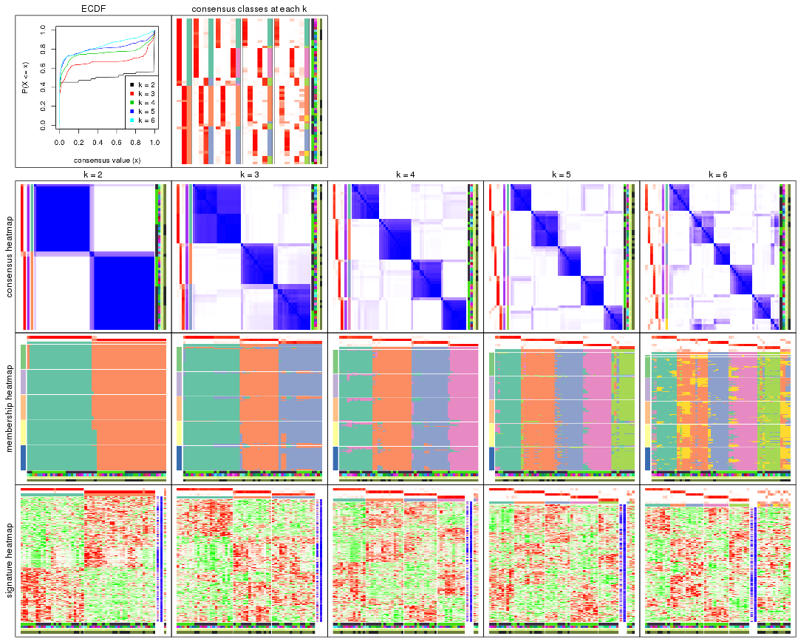

The plots are:

- The first row: a plot of the ECDF (empirical cumulative distribution
  function) curves of the consensus matrix for each `k` and the heatmap of
  predicted classes for each `k`.
- The second row: heatmaps of the consensus matrix for each `k`.
- The third row: heatmaps of the membership matrix for each `k`.
- The fouth row: heatmaps of the signatures for each `k`.

All the plots in panels can be made by individual functions and they are
plotted later in this section.

`select_partition_number()` produces several plots showing different
statistics for choosing "optimized" `k`. There are following statistics:

- ECDF curves of the consensus matrix for each `k`;
- 1-PAC. [The PAC
  score](https://en.wikipedia.org/wiki/Consensus_clustering#Over-interpretation_potential_of_consensus_clustering)
  measures the proportion of the ambiguous subgrouping.
- Mean silhouette score.
- Concordance. The mean probability of fiting the consensus class ids in all
  partitions.
- Area increased. Denote $A_k$ as the area under the ECDF curve for current
  `k`, the area increased is defined as $A_k - A_{k-1}$.
- Rand index. The percent of pairs of samples that are both in a same cluster
  or both are not in a same cluster in the partition of k and k-1.
- Jaccard index. The ratio of pairs of samples are both in a same cluster in
  the partition of k and k-1 and the pairs of samples are both in a same
  cluster in the partition k or k-1.

The detailed explanations of these statistics can be found in [the _cola_
vignette](http://bioconductor.org/packages/devel/bioc/vignettes/cola/inst/doc/cola.html#toc_13).

Generally speaking, lower PAC score, higher mean silhouette score or higher
concordance corresponds to better partition. Rand index and Jaccard index
measure how similar the current partition is compared to partition with `k-1`.
If they are too similar, we won't accept `k` is better than `k-1`.

```r
select_partition_number(res)
```

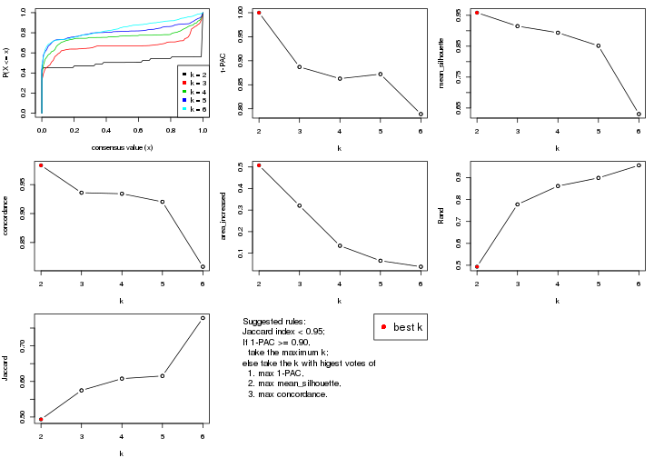

The numeric values for all these statistics can be obtained by `get_stats()`.

```r
get_stats(res)
```

```
#>   k 1-PAC mean_silhouette concordance area_increased  Rand Jaccard
#> 2 2 1.000           0.958       0.983         0.5074 0.493   0.493
#> 3 3 0.887           0.915       0.936         0.3205 0.778   0.575
#> 4 4 0.863           0.894       0.934         0.1344 0.862   0.608
#> 5 5 0.872           0.851       0.920         0.0650 0.899   0.615
#> 6 6 0.789           0.630       0.808         0.0372 0.956   0.778
```

`suggest_best_k()` suggests the best $k$ based on these statistics. The rules are as follows:

- All $k$ with Jaccard index larger than 0.95 are removed because increasing
  $k$ does not provide enough extra information. If all $k$ are removed, it is
  marked as no subgroup is detected.
- For all $k$ with 1-PAC score larger than 0.9, the maximal $k$ is taken as
  the best $k$, and other $k$ are marked as optional $k$.
- If it does not fit the second rule. The $k$ with the maximal vote of the
  highest 1-PAC score, highest mean silhouette, and highest concordance is
  taken as the best $k$.

```r
suggest_best_k(res)
```

```
#> [1] 2
```


Following shows the table of the partitions (You need to click the **show/hide
code output** link to see it). The membership matrix (columns with name `p*`)
is inferred by
[`clue::cl_consensus()`](https://www.rdocumentation.org/link/cl_consensus?package=clue)
function with the `SE` method. Basically the value in the membership matrix
represents the probability to belong to a certain group. The finall class
label for an item is determined with the group with highest probability it
belongs to.

In `get_classes()` function, the entropy is calculated from the membership
matrix and the silhouette score is calculated from the consensus matrix.


<script>
$( function() {
	$( '#tabs-SD-skmeans-get-classes' ).tabs();
} );
</script>
<div id='tabs-SD-skmeans-get-classes'>
<ul>
<li><a href='#tab-SD-skmeans-get-classes-1'>k = 2</a></li>
<li><a href='#tab-SD-skmeans-get-classes-2'>k = 3</a></li>
<li><a href='#tab-SD-skmeans-get-classes-3'>k = 4</a></li>
<li><a href='#tab-SD-skmeans-get-classes-4'>k = 5</a></li>
<li><a href='#tab-SD-skmeans-get-classes-5'>k = 6</a></li>
</ul>

<div id='tab-SD-skmeans-get-classes-1'>
<p><a id='tab-SD-skmeans-get-classes-1-a' style='color:#0366d6' href='#'>show/hide code output</a></p>
<pre><code class="r">cbind(get_classes(res, k = 2), get_membership(res, k = 2))
</code></pre>

<pre><code>#&gt;           class entropy silhouette    p1    p2
#&gt; GSM680053     2  0.0000      0.974 0.000 1.000
#&gt; GSM680062     1  0.0376      0.987 0.996 0.004
#&gt; GSM680054     2  0.0000      0.974 0.000 1.000
#&gt; GSM680063     1  0.7219      0.738 0.800 0.200
#&gt; GSM680055     2  0.0000      0.974 0.000 1.000
#&gt; GSM680064     1  0.0000      0.991 1.000 0.000
#&gt; GSM680056     1  0.0000      0.991 1.000 0.000
#&gt; GSM680065     1  0.0000      0.991 1.000 0.000
#&gt; GSM680057     2  0.0000      0.974 0.000 1.000
#&gt; GSM680066     1  0.0000      0.991 1.000 0.000
#&gt; GSM680058     2  0.0000      0.974 0.000 1.000
#&gt; GSM680067     2  0.0000      0.974 0.000 1.000
#&gt; GSM680059     2  0.0000      0.974 0.000 1.000
#&gt; GSM680068     1  0.0000      0.991 1.000 0.000
#&gt; GSM680060     2  0.0000      0.974 0.000 1.000
#&gt; GSM680069     2  0.9552      0.406 0.376 0.624
#&gt; GSM680061     2  0.0000      0.974 0.000 1.000
#&gt; GSM680070     1  0.0000      0.991 1.000 0.000
#&gt; GSM680071     2  0.9087      0.524 0.324 0.676
#&gt; GSM680077     1  0.0000      0.991 1.000 0.000
#&gt; GSM680072     2  0.0000      0.974 0.000 1.000
#&gt; GSM680078     1  0.0000      0.991 1.000 0.000
#&gt; GSM680073     2  0.0000      0.974 0.000 1.000
#&gt; GSM680079     1  0.0000      0.991 1.000 0.000
#&gt; GSM680074     2  0.0000      0.974 0.000 1.000
#&gt; GSM680080     2  0.0000      0.974 0.000 1.000
#&gt; GSM680075     2  0.0000      0.974 0.000 1.000
#&gt; GSM680081     2  0.0000      0.974 0.000 1.000
#&gt; GSM680076     2  0.0000      0.974 0.000 1.000
#&gt; GSM680082     1  0.0000      0.991 1.000 0.000
#&gt; GSM680029     2  0.0000      0.974 0.000 1.000
#&gt; GSM680041     1  0.0000      0.991 1.000 0.000
#&gt; GSM680035     2  0.0000      0.974 0.000 1.000
#&gt; GSM680047     1  0.0000      0.991 1.000 0.000
#&gt; GSM680036     2  0.0000      0.974 0.000 1.000
#&gt; GSM680048     1  0.0000      0.991 1.000 0.000
#&gt; GSM680037     2  0.0000      0.974 0.000 1.000
#&gt; GSM680049     1  0.0000      0.991 1.000 0.000
#&gt; GSM680038     2  0.0000      0.974 0.000 1.000
#&gt; GSM680050     1  0.0000      0.991 1.000 0.000
#&gt; GSM680039     2  0.0000      0.974 0.000 1.000
#&gt; GSM680051     1  0.0000      0.991 1.000 0.000
#&gt; GSM680040     2  0.0000      0.974 0.000 1.000
#&gt; GSM680052     1  0.0000      0.991 1.000 0.000
#&gt; GSM680030     2  0.0000      0.974 0.000 1.000
#&gt; GSM680042     1  0.0000      0.991 1.000 0.000
#&gt; GSM680031     2  0.0000      0.974 0.000 1.000
#&gt; GSM680043     1  0.0000      0.991 1.000 0.000
#&gt; GSM680032     1  0.0000      0.991 1.000 0.000
#&gt; GSM680044     1  0.0000      0.991 1.000 0.000
#&gt; GSM680033     2  0.0000      0.974 0.000 1.000
#&gt; GSM680045     1  0.0000      0.991 1.000 0.000
#&gt; GSM680034     2  0.0000      0.974 0.000 1.000
#&gt; GSM680046     1  0.0000      0.991 1.000 0.000
</code></pre>

<script>
$('#tab-SD-skmeans-get-classes-1-a').parent().next().next().hide();
$('#tab-SD-skmeans-get-classes-1-a').click(function(){
  $('#tab-SD-skmeans-get-classes-1-a').parent().next().next().toggle();
  return(false);
});
</script>
</div>

<div id='tab-SD-skmeans-get-classes-2'>
<p><a id='tab-SD-skmeans-get-classes-2-a' style='color:#0366d6' href='#'>show/hide code output</a></p>
<pre><code class="r">cbind(get_classes(res, k = 3), get_membership(res, k = 3))
</code></pre>

<pre><code>#&gt;           class entropy silhouette    p1    p2    p3
#&gt; GSM680053     3  0.2066      0.919 0.000 0.060 0.940
#&gt; GSM680062     3  0.2448      0.883 0.076 0.000 0.924
#&gt; GSM680054     2  0.5431      0.586 0.000 0.716 0.284
#&gt; GSM680063     3  0.2651      0.893 0.060 0.012 0.928
#&gt; GSM680055     3  0.1860      0.917 0.000 0.052 0.948
#&gt; GSM680064     1  0.2356      0.951 0.928 0.000 0.072
#&gt; GSM680056     3  0.1964      0.847 0.056 0.000 0.944
#&gt; GSM680065     1  0.3192      0.929 0.888 0.000 0.112
#&gt; GSM680057     2  0.0424      0.950 0.000 0.992 0.008
#&gt; GSM680066     1  0.2261      0.951 0.932 0.000 0.068
#&gt; GSM680058     2  0.1031      0.946 0.000 0.976 0.024
#&gt; GSM680067     2  0.2165      0.903 0.064 0.936 0.000
#&gt; GSM680059     3  0.5733      0.661 0.000 0.324 0.676
#&gt; GSM680068     1  0.2066      0.953 0.940 0.000 0.060
#&gt; GSM680060     2  0.0592      0.950 0.000 0.988 0.012
#&gt; GSM680069     3  0.0424      0.882 0.008 0.000 0.992
#&gt; GSM680061     2  0.0592      0.944 0.012 0.988 0.000
#&gt; GSM680070     1  0.2261      0.951 0.932 0.000 0.068
#&gt; GSM680071     2  0.3349      0.873 0.004 0.888 0.108
#&gt; GSM680077     1  0.2448      0.949 0.924 0.000 0.076
#&gt; GSM680072     2  0.1163      0.944 0.000 0.972 0.028
#&gt; GSM680078     1  0.4842      0.793 0.776 0.000 0.224
#&gt; GSM680073     3  0.5621      0.670 0.000 0.308 0.692
#&gt; GSM680079     1  0.2356      0.950 0.928 0.000 0.072
#&gt; GSM680074     2  0.0424      0.950 0.000 0.992 0.008
#&gt; GSM680080     2  0.0424      0.950 0.000 0.992 0.008
#&gt; GSM680075     3  0.2356      0.921 0.000 0.072 0.928
#&gt; GSM680081     3  0.1711      0.893 0.008 0.032 0.960
#&gt; GSM680076     2  0.1315      0.941 0.008 0.972 0.020
#&gt; GSM680082     1  0.2448      0.949 0.924 0.000 0.076
#&gt; GSM680029     3  0.2711      0.921 0.000 0.088 0.912
#&gt; GSM680041     1  0.0661      0.955 0.988 0.008 0.004
#&gt; GSM680035     3  0.3116      0.917 0.000 0.108 0.892
#&gt; GSM680047     1  0.0661      0.955 0.988 0.008 0.004
#&gt; GSM680036     3  0.2165      0.920 0.000 0.064 0.936
#&gt; GSM680048     1  0.0424      0.956 0.992 0.008 0.000
#&gt; GSM680037     3  0.3038      0.918 0.000 0.104 0.896
#&gt; GSM680049     1  0.0424      0.956 0.992 0.008 0.000
#&gt; GSM680038     2  0.0592      0.950 0.000 0.988 0.012
#&gt; GSM680050     1  0.2165      0.953 0.936 0.000 0.064
#&gt; GSM680039     2  0.0424      0.950 0.000 0.992 0.008
#&gt; GSM680051     1  0.0424      0.956 0.992 0.008 0.000
#&gt; GSM680040     3  0.3116      0.917 0.000 0.108 0.892
#&gt; GSM680052     1  0.0424      0.956 0.992 0.008 0.000
#&gt; GSM680030     2  0.0000      0.949 0.000 1.000 0.000
#&gt; GSM680042     1  0.0661      0.955 0.988 0.008 0.004
#&gt; GSM680031     3  0.3038      0.918 0.000 0.104 0.896
#&gt; GSM680043     1  0.0424      0.956 0.992 0.008 0.000
#&gt; GSM680032     1  0.2537      0.947 0.920 0.000 0.080
#&gt; GSM680044     1  0.0237      0.956 0.996 0.004 0.000
#&gt; GSM680033     3  0.3192      0.915 0.000 0.112 0.888
#&gt; GSM680045     1  0.0424      0.956 0.992 0.008 0.000
#&gt; GSM680034     2  0.1753      0.918 0.048 0.952 0.000
#&gt; GSM680046     1  0.0424      0.956 0.992 0.008 0.000
</code></pre>

<script>
$('#tab-SD-skmeans-get-classes-2-a').parent().next().next().hide();
$('#tab-SD-skmeans-get-classes-2-a').click(function(){
  $('#tab-SD-skmeans-get-classes-2-a').parent().next().next().toggle();
  return(false);
});
</script>
</div>

<div id='tab-SD-skmeans-get-classes-3'>
<p><a id='tab-SD-skmeans-get-classes-3-a' style='color:#0366d6' href='#'>show/hide code output</a></p>
<pre><code class="r">cbind(get_classes(res, k = 4), get_membership(res, k = 4))
</code></pre>

<pre><code>#&gt;           class entropy silhouette    p1    p2    p3    p4
#&gt; GSM680053     3  0.2281     0.8863 0.096 0.000 0.904 0.000
#&gt; GSM680062     4  0.6792    -0.0156 0.096 0.000 0.428 0.476
#&gt; GSM680054     2  0.4444     0.8085 0.072 0.808 0.120 0.000
#&gt; GSM680063     3  0.6415     0.4719 0.100 0.000 0.612 0.288
#&gt; GSM680055     3  0.2530     0.8778 0.112 0.000 0.888 0.000
#&gt; GSM680064     1  0.2973     0.9090 0.856 0.000 0.000 0.144
#&gt; GSM680056     1  0.1733     0.8817 0.948 0.000 0.024 0.028
#&gt; GSM680065     1  0.1510     0.8859 0.956 0.000 0.016 0.028
#&gt; GSM680057     2  0.0336     0.9573 0.000 0.992 0.008 0.000
#&gt; GSM680066     1  0.2844     0.9134 0.900 0.000 0.052 0.048
#&gt; GSM680058     2  0.0000     0.9591 0.000 1.000 0.000 0.000
#&gt; GSM680067     2  0.0336     0.9564 0.000 0.992 0.000 0.008
#&gt; GSM680059     3  0.1867     0.8997 0.000 0.072 0.928 0.000
#&gt; GSM680068     1  0.2345     0.9298 0.900 0.000 0.000 0.100
#&gt; GSM680060     2  0.0000     0.9591 0.000 1.000 0.000 0.000
#&gt; GSM680069     1  0.2715     0.8247 0.892 0.004 0.100 0.004
#&gt; GSM680061     2  0.0000     0.9591 0.000 1.000 0.000 0.000
#&gt; GSM680070     1  0.2149     0.9353 0.912 0.000 0.000 0.088
#&gt; GSM680071     2  0.2923     0.8968 0.080 0.896 0.016 0.008
#&gt; GSM680077     1  0.2011     0.9356 0.920 0.000 0.000 0.080
#&gt; GSM680072     2  0.1022     0.9452 0.000 0.968 0.032 0.000
#&gt; GSM680078     1  0.2282     0.9276 0.924 0.000 0.024 0.052
#&gt; GSM680073     3  0.2408     0.8729 0.000 0.104 0.896 0.000
#&gt; GSM680079     1  0.2149     0.9353 0.912 0.000 0.000 0.088
#&gt; GSM680074     2  0.0000     0.9591 0.000 1.000 0.000 0.000
#&gt; GSM680080     2  0.0000     0.9591 0.000 1.000 0.000 0.000
#&gt; GSM680075     3  0.1174     0.9254 0.012 0.020 0.968 0.000
#&gt; GSM680081     3  0.1637     0.9019 0.060 0.000 0.940 0.000
#&gt; GSM680076     2  0.0336     0.9562 0.008 0.992 0.000 0.000
#&gt; GSM680082     1  0.2149     0.9353 0.912 0.000 0.000 0.088
#&gt; GSM680029     3  0.0524     0.9257 0.008 0.004 0.988 0.000
#&gt; GSM680041     4  0.0188     0.9332 0.004 0.000 0.000 0.996
#&gt; GSM680035     3  0.0592     0.9286 0.000 0.016 0.984 0.000
#&gt; GSM680047     4  0.0188     0.9332 0.004 0.000 0.000 0.996
#&gt; GSM680036     3  0.1940     0.8967 0.076 0.000 0.924 0.000
#&gt; GSM680048     4  0.0000     0.9346 0.000 0.000 0.000 1.000
#&gt; GSM680037     3  0.0592     0.9286 0.000 0.016 0.984 0.000
#&gt; GSM680049     4  0.0000     0.9346 0.000 0.000 0.000 1.000
#&gt; GSM680038     2  0.0188     0.9583 0.000 0.996 0.004 0.000
#&gt; GSM680050     1  0.3610     0.8526 0.800 0.000 0.000 0.200
#&gt; GSM680039     2  0.3074     0.8304 0.000 0.848 0.152 0.000
#&gt; GSM680051     4  0.0000     0.9346 0.000 0.000 0.000 1.000
#&gt; GSM680040     3  0.0592     0.9286 0.000 0.016 0.984 0.000
#&gt; GSM680052     4  0.0000     0.9346 0.000 0.000 0.000 1.000
#&gt; GSM680030     2  0.0188     0.9584 0.000 0.996 0.004 0.000
#&gt; GSM680042     4  0.0188     0.9332 0.004 0.000 0.000 0.996
#&gt; GSM680031     3  0.0592     0.9286 0.000 0.016 0.984 0.000
#&gt; GSM680043     4  0.1118     0.9166 0.036 0.000 0.000 0.964
#&gt; GSM680032     1  0.2266     0.9352 0.912 0.004 0.000 0.084
#&gt; GSM680044     4  0.1557     0.9011 0.056 0.000 0.000 0.944
#&gt; GSM680033     3  0.0592     0.9286 0.000 0.016 0.984 0.000
#&gt; GSM680045     4  0.0817     0.9242 0.024 0.000 0.000 0.976
#&gt; GSM680034     2  0.2266     0.8986 0.000 0.912 0.004 0.084
#&gt; GSM680046     4  0.0469     0.9306 0.012 0.000 0.000 0.988
</code></pre>

<script>
$('#tab-SD-skmeans-get-classes-3-a').parent().next().next().hide();
$('#tab-SD-skmeans-get-classes-3-a').click(function(){
  $('#tab-SD-skmeans-get-classes-3-a').parent().next().next().toggle();
  return(false);
});
</script>
</div>

<div id='tab-SD-skmeans-get-classes-4'>
<p><a id='tab-SD-skmeans-get-classes-4-a' style='color:#0366d6' href='#'>show/hide code output</a></p>
<pre><code class="r">cbind(get_classes(res, k = 5), get_membership(res, k = 5))
</code></pre>

<pre><code>#&gt;           class entropy silhouette    p1    p2    p3    p4    p5
#&gt; GSM680053     5  0.1544      0.841 0.000 0.000 0.068 0.000 0.932
#&gt; GSM680062     5  0.1918      0.839 0.000 0.000 0.036 0.036 0.928
#&gt; GSM680054     5  0.4169      0.609 0.000 0.240 0.028 0.000 0.732
#&gt; GSM680063     5  0.1809      0.842 0.000 0.000 0.060 0.012 0.928
#&gt; GSM680055     5  0.1478      0.842 0.000 0.000 0.064 0.000 0.936
#&gt; GSM680064     1  0.3412      0.820 0.820 0.000 0.000 0.152 0.028
#&gt; GSM680056     5  0.1430      0.832 0.052 0.000 0.000 0.004 0.944
#&gt; GSM680065     5  0.3689      0.610 0.256 0.000 0.000 0.004 0.740
#&gt; GSM680057     2  0.1710      0.909 0.004 0.940 0.040 0.000 0.016
#&gt; GSM680066     1  0.0867      0.939 0.976 0.000 0.008 0.008 0.008
#&gt; GSM680058     2  0.0404      0.926 0.000 0.988 0.000 0.000 0.012
#&gt; GSM680067     2  0.1267      0.917 0.004 0.960 0.000 0.024 0.012
#&gt; GSM680059     3  0.1764      0.874 0.000 0.064 0.928 0.000 0.008
#&gt; GSM680068     1  0.0579      0.942 0.984 0.000 0.000 0.008 0.008
#&gt; GSM680060     2  0.0510      0.925 0.000 0.984 0.000 0.000 0.016
#&gt; GSM680069     5  0.1502      0.832 0.056 0.000 0.004 0.000 0.940
#&gt; GSM680061     2  0.0727      0.923 0.004 0.980 0.000 0.004 0.012
#&gt; GSM680070     1  0.0290      0.943 0.992 0.000 0.000 0.008 0.000
#&gt; GSM680071     2  0.4270      0.484 0.004 0.656 0.000 0.004 0.336
#&gt; GSM680077     1  0.0727      0.940 0.980 0.004 0.000 0.004 0.012
#&gt; GSM680072     2  0.1757      0.903 0.004 0.936 0.012 0.000 0.048
#&gt; GSM680078     1  0.0324      0.942 0.992 0.000 0.004 0.004 0.000
#&gt; GSM680073     3  0.4522      0.723 0.004 0.192 0.744 0.000 0.060
#&gt; GSM680079     1  0.0451      0.943 0.988 0.000 0.000 0.008 0.004
#&gt; GSM680074     2  0.0510      0.925 0.000 0.984 0.000 0.000 0.016
#&gt; GSM680080     2  0.0510      0.925 0.000 0.984 0.000 0.000 0.016
#&gt; GSM680075     3  0.3397      0.827 0.004 0.068 0.848 0.000 0.080
#&gt; GSM680081     3  0.1205      0.877 0.040 0.000 0.956 0.000 0.004
#&gt; GSM680076     2  0.0703      0.924 0.000 0.976 0.000 0.000 0.024
#&gt; GSM680082     1  0.0579      0.943 0.984 0.000 0.000 0.008 0.008
#&gt; GSM680029     3  0.0162      0.900 0.004 0.000 0.996 0.000 0.000
#&gt; GSM680041     4  0.0162      0.942 0.000 0.000 0.000 0.996 0.004
#&gt; GSM680035     3  0.0162      0.902 0.000 0.000 0.996 0.000 0.004
#&gt; GSM680047     4  0.0000      0.944 0.000 0.000 0.000 1.000 0.000
#&gt; GSM680036     5  0.4551      0.228 0.004 0.004 0.436 0.000 0.556
#&gt; GSM680048     4  0.0000      0.944 0.000 0.000 0.000 1.000 0.000
#&gt; GSM680037     3  0.0162      0.902 0.000 0.000 0.996 0.000 0.004
#&gt; GSM680049     4  0.0000      0.944 0.000 0.000 0.000 1.000 0.000
#&gt; GSM680038     2  0.1403      0.919 0.000 0.952 0.024 0.000 0.024
#&gt; GSM680050     1  0.4240      0.718 0.736 0.000 0.000 0.228 0.036
#&gt; GSM680039     3  0.4553      0.489 0.004 0.328 0.652 0.000 0.016
#&gt; GSM680051     4  0.0324      0.940 0.000 0.004 0.000 0.992 0.004
#&gt; GSM680040     3  0.0162      0.902 0.000 0.000 0.996 0.000 0.004
#&gt; GSM680052     4  0.0000      0.944 0.000 0.000 0.000 1.000 0.000
#&gt; GSM680030     2  0.1547      0.913 0.004 0.948 0.032 0.000 0.016
#&gt; GSM680042     4  0.0000      0.944 0.000 0.000 0.000 1.000 0.000
#&gt; GSM680031     3  0.0162      0.902 0.000 0.000 0.996 0.000 0.004
#&gt; GSM680043     4  0.3289      0.797 0.172 0.000 0.004 0.816 0.008
#&gt; GSM680032     1  0.0566      0.938 0.984 0.000 0.000 0.004 0.012
#&gt; GSM680044     4  0.4156      0.616 0.288 0.000 0.004 0.700 0.008
#&gt; GSM680033     3  0.0162      0.902 0.000 0.000 0.996 0.000 0.004
#&gt; GSM680045     4  0.1492      0.918 0.040 0.000 0.004 0.948 0.008
#&gt; GSM680034     2  0.4465      0.766 0.004 0.780 0.052 0.148 0.016
#&gt; GSM680046     4  0.0324      0.942 0.004 0.000 0.000 0.992 0.004
</code></pre>

<script>
$('#tab-SD-skmeans-get-classes-4-a').parent().next().next().hide();
$('#tab-SD-skmeans-get-classes-4-a').click(function(){
  $('#tab-SD-skmeans-get-classes-4-a').parent().next().next().toggle();
  return(false);
});
</script>
</div>

<div id='tab-SD-skmeans-get-classes-5'>
<p><a id='tab-SD-skmeans-get-classes-5-a' style='color:#0366d6' href='#'>show/hide code output</a></p>
<pre><code class="r">cbind(get_classes(res, k = 6), get_membership(res, k = 6))
</code></pre>

<pre><code>#&gt;           class entropy silhouette    p1    p2    p3    p4    p5    p6
#&gt; GSM680053     5  0.1219     0.8150 0.000 0.000 0.048 0.000 0.948 0.004
#&gt; GSM680062     5  0.2112     0.8086 0.000 0.000 0.036 0.020 0.916 0.028
#&gt; GSM680054     5  0.4350     0.6227 0.000 0.188 0.020 0.000 0.736 0.056
#&gt; GSM680063     5  0.1572     0.8157 0.000 0.000 0.036 0.000 0.936 0.028
#&gt; GSM680055     5  0.0891     0.8187 0.000 0.000 0.024 0.000 0.968 0.008
#&gt; GSM680064     1  0.4438     0.6630 0.712 0.000 0.000 0.224 0.024 0.040
#&gt; GSM680056     5  0.1745     0.8031 0.012 0.000 0.000 0.000 0.920 0.068
#&gt; GSM680065     5  0.4255     0.6067 0.224 0.000 0.000 0.000 0.708 0.068
#&gt; GSM680057     2  0.1088     0.5828 0.000 0.960 0.024 0.000 0.000 0.016
#&gt; GSM680066     1  0.2003     0.8527 0.884 0.000 0.000 0.000 0.000 0.116
#&gt; GSM680058     2  0.3810     0.1494 0.000 0.572 0.000 0.000 0.000 0.428
#&gt; GSM680067     2  0.1082     0.5870 0.000 0.956 0.000 0.004 0.000 0.040
#&gt; GSM680059     3  0.3888     0.3705 0.000 0.016 0.672 0.000 0.000 0.312
#&gt; GSM680068     1  0.2003     0.8491 0.884 0.000 0.000 0.000 0.000 0.116
#&gt; GSM680060     2  0.3371     0.3957 0.000 0.708 0.000 0.000 0.000 0.292
#&gt; GSM680069     5  0.2009     0.7993 0.008 0.004 0.000 0.000 0.904 0.084
#&gt; GSM680061     2  0.0632     0.5877 0.000 0.976 0.000 0.000 0.000 0.024
#&gt; GSM680070     1  0.0935     0.8725 0.964 0.000 0.000 0.000 0.004 0.032
#&gt; GSM680071     2  0.6554     0.1324 0.016 0.416 0.000 0.008 0.328 0.232
#&gt; GSM680077     1  0.1572     0.8619 0.936 0.000 0.000 0.000 0.028 0.036
#&gt; GSM680072     6  0.4780     0.0847 0.000 0.364 0.016 0.000 0.032 0.588
#&gt; GSM680078     1  0.1732     0.8703 0.920 0.000 0.004 0.000 0.004 0.072
#&gt; GSM680073     6  0.5531     0.3699 0.000 0.060 0.344 0.000 0.040 0.556
#&gt; GSM680079     1  0.0820     0.8700 0.972 0.000 0.000 0.000 0.012 0.016
#&gt; GSM680074     2  0.3857     0.0528 0.000 0.532 0.000 0.000 0.000 0.468
#&gt; GSM680080     2  0.3860     0.0399 0.000 0.528 0.000 0.000 0.000 0.472
#&gt; GSM680075     6  0.5259     0.0519 0.008 0.008 0.452 0.000 0.052 0.480
#&gt; GSM680081     3  0.1401     0.8836 0.020 0.004 0.948 0.000 0.000 0.028
#&gt; GSM680076     6  0.4205    -0.1442 0.016 0.420 0.000 0.000 0.000 0.564
#&gt; GSM680082     1  0.1588     0.8665 0.924 0.000 0.000 0.000 0.004 0.072
#&gt; GSM680029     3  0.1267     0.8732 0.000 0.000 0.940 0.000 0.000 0.060
#&gt; GSM680041     4  0.0547     0.8671 0.000 0.000 0.000 0.980 0.000 0.020
#&gt; GSM680035     3  0.0291     0.9092 0.000 0.004 0.992 0.000 0.004 0.000
#&gt; GSM680047     4  0.0260     0.8698 0.000 0.000 0.000 0.992 0.000 0.008
#&gt; GSM680036     5  0.5896     0.1722 0.000 0.000 0.324 0.000 0.456 0.220
#&gt; GSM680048     4  0.0260     0.8704 0.000 0.000 0.000 0.992 0.000 0.008
#&gt; GSM680037     3  0.0260     0.9093 0.000 0.000 0.992 0.000 0.008 0.000
#&gt; GSM680049     4  0.0260     0.8697 0.000 0.000 0.000 0.992 0.000 0.008
#&gt; GSM680038     2  0.2544     0.5531 0.000 0.864 0.012 0.000 0.004 0.120
#&gt; GSM680050     1  0.5113     0.5457 0.628 0.000 0.000 0.288 0.036 0.048
#&gt; GSM680039     2  0.4184    -0.0548 0.000 0.504 0.484 0.000 0.000 0.012
#&gt; GSM680051     4  0.0993     0.8656 0.000 0.012 0.000 0.964 0.000 0.024
#&gt; GSM680040     3  0.0000     0.9092 0.000 0.000 1.000 0.000 0.000 0.000
#&gt; GSM680052     4  0.0632     0.8679 0.000 0.000 0.000 0.976 0.000 0.024
#&gt; GSM680030     2  0.2069     0.5719 0.004 0.908 0.020 0.000 0.000 0.068
#&gt; GSM680042     4  0.0458     0.8686 0.000 0.000 0.000 0.984 0.000 0.016
#&gt; GSM680031     3  0.1124     0.8868 0.000 0.000 0.956 0.000 0.008 0.036
#&gt; GSM680043     4  0.6047     0.5267 0.220 0.000 0.016 0.544 0.004 0.216
#&gt; GSM680032     1  0.2405     0.8511 0.880 0.004 0.000 0.000 0.016 0.100
#&gt; GSM680044     4  0.6108     0.3731 0.272 0.000 0.000 0.488 0.012 0.228
#&gt; GSM680033     3  0.0291     0.9091 0.000 0.000 0.992 0.000 0.004 0.004
#&gt; GSM680045     4  0.4427     0.7501 0.044 0.000 0.020 0.728 0.004 0.204
#&gt; GSM680034     2  0.3224     0.5056 0.000 0.848 0.036 0.084 0.000 0.032
#&gt; GSM680046     4  0.2357     0.8324 0.012 0.000 0.000 0.872 0.000 0.116
</code></pre>

<script>
$('#tab-SD-skmeans-get-classes-5-a').parent().next().next().hide();
$('#tab-SD-skmeans-get-classes-5-a').click(function(){
  $('#tab-SD-skmeans-get-classes-5-a').parent().next().next().toggle();
  return(false);
});
</script>
</div>
</div>

Heatmaps for the consensus matrix. It visualizes the probability of two
samples to be in a same group.


<script>
$( function() {
	$( '#tabs-SD-skmeans-consensus-heatmap' ).tabs();
} );
</script>
<div id='tabs-SD-skmeans-consensus-heatmap'>
<ul>
<li><a href='#tab-SD-skmeans-consensus-heatmap-1'>k = 2</a></li>
<li><a href='#tab-SD-skmeans-consensus-heatmap-2'>k = 3</a></li>
<li><a href='#tab-SD-skmeans-consensus-heatmap-3'>k = 4</a></li>
<li><a href='#tab-SD-skmeans-consensus-heatmap-4'>k = 5</a></li>
<li><a href='#tab-SD-skmeans-consensus-heatmap-5'>k = 6</a></li>
</ul>
<div id='tab-SD-skmeans-consensus-heatmap-1'>
<pre><code class="r">consensus_heatmap(res, k = 2)
</code></pre>

<p>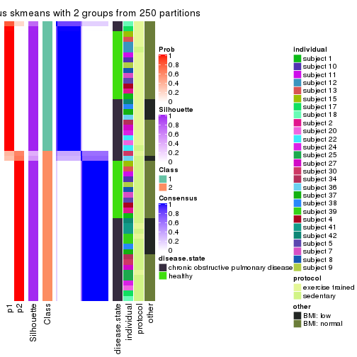</p>

</div>
<div id='tab-SD-skmeans-consensus-heatmap-2'>
<pre><code class="r">consensus_heatmap(res, k = 3)
</code></pre>

<p>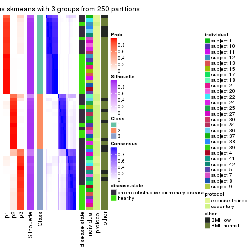</p>

</div>
<div id='tab-SD-skmeans-consensus-heatmap-3'>
<pre><code class="r">consensus_heatmap(res, k = 4)
</code></pre>

<p>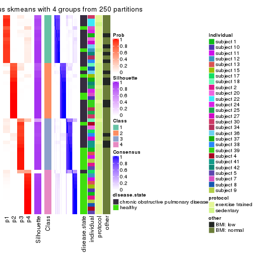</p>

</div>
<div id='tab-SD-skmeans-consensus-heatmap-4'>
<pre><code class="r">consensus_heatmap(res, k = 5)
</code></pre>

<p>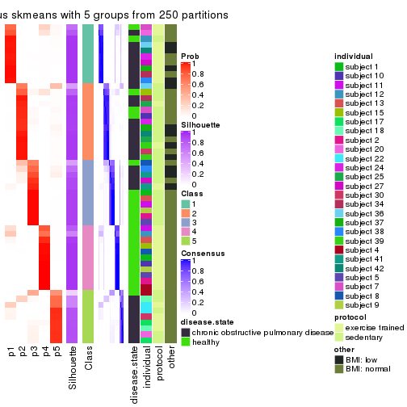</p>

</div>
<div id='tab-SD-skmeans-consensus-heatmap-5'>
<pre><code class="r">consensus_heatmap(res, k = 6)
</code></pre>

<p>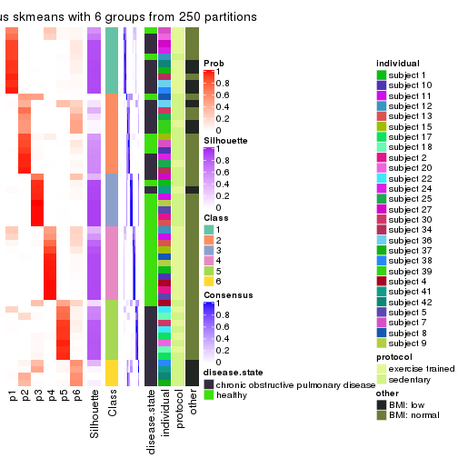</p>

</div>
</div>

Heatmaps for the membership of samples in all partitions to see how consistent they are:


<script>
$( function() {
	$( '#tabs-SD-skmeans-membership-heatmap' ).tabs();
} );
</script>
<div id='tabs-SD-skmeans-membership-heatmap'>
<ul>
<li><a href='#tab-SD-skmeans-membership-heatmap-1'>k = 2</a></li>
<li><a href='#tab-SD-skmeans-membership-heatmap-2'>k = 3</a></li>
<li><a href='#tab-SD-skmeans-membership-heatmap-3'>k = 4</a></li>
<li><a href='#tab-SD-skmeans-membership-heatmap-4'>k = 5</a></li>
<li><a href='#tab-SD-skmeans-membership-heatmap-5'>k = 6</a></li>
</ul>
<div id='tab-SD-skmeans-membership-heatmap-1'>
<pre><code class="r">membership_heatmap(res, k = 2)
</code></pre>

<p>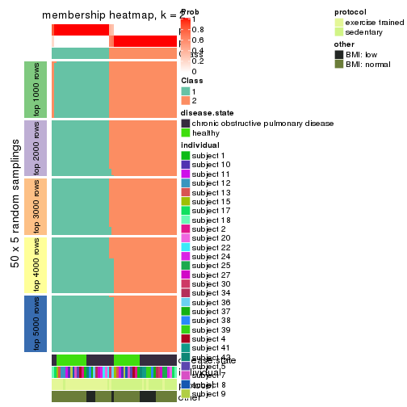</p>

</div>
<div id='tab-SD-skmeans-membership-heatmap-2'>
<pre><code class="r">membership_heatmap(res, k = 3)
</code></pre>

<p>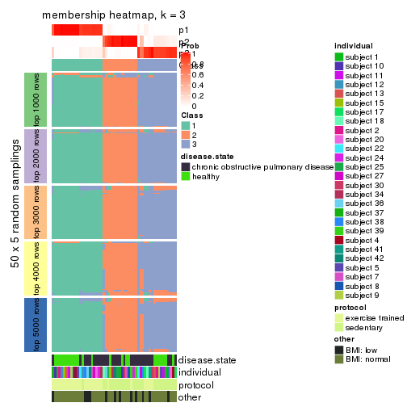</p>

</div>
<div id='tab-SD-skmeans-membership-heatmap-3'>
<pre><code class="r">membership_heatmap(res, k = 4)
</code></pre>

<p>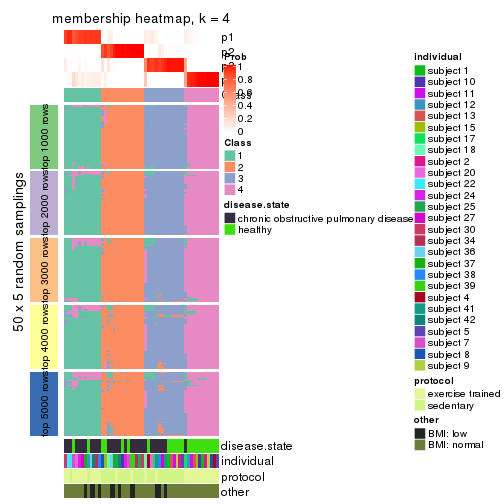</p>

</div>
<div id='tab-SD-skmeans-membership-heatmap-4'>
<pre><code class="r">membership_heatmap(res, k = 5)
</code></pre>

<p>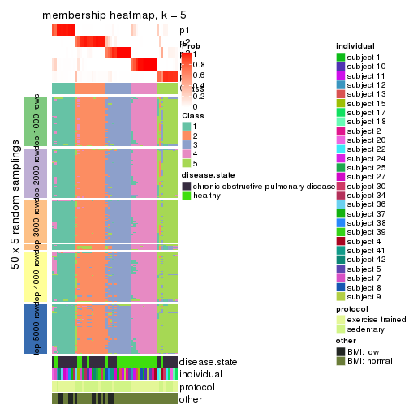</p>

</div>
<div id='tab-SD-skmeans-membership-heatmap-5'>
<pre><code class="r">membership_heatmap(res, k = 6)
</code></pre>

<p>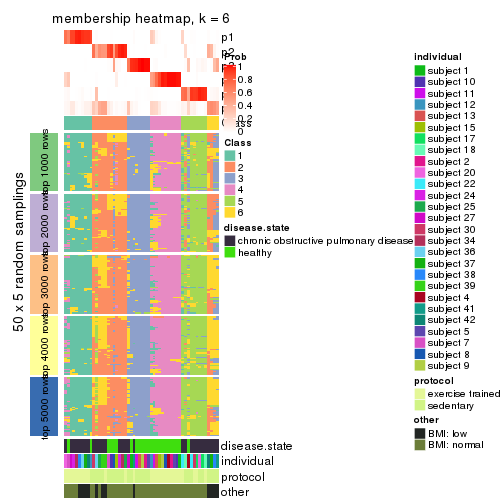</p>

</div>
</div>

As soon as we have had the classes for columns, we can look for signatures
which are significantly different between classes which can be candidate marks
for certain classes. Following are the heatmaps for signatures.


Signature heatmaps where rows are scaled:


<script>
$( function() {
	$( '#tabs-SD-skmeans-get-signatures' ).tabs();
} );
</script>
<div id='tabs-SD-skmeans-get-signatures'>
<ul>
<li><a href='#tab-SD-skmeans-get-signatures-1'>k = 2</a></li>
<li><a href='#tab-SD-skmeans-get-signatures-2'>k = 3</a></li>
<li><a href='#tab-SD-skmeans-get-signatures-3'>k = 4</a></li>
<li><a href='#tab-SD-skmeans-get-signatures-4'>k = 5</a></li>
<li><a href='#tab-SD-skmeans-get-signatures-5'>k = 6</a></li>
</ul>
<div id='tab-SD-skmeans-get-signatures-1'>
<pre><code class="r">get_signatures(res, k = 2)
</code></pre>

<pre><code>#&gt; Error in mat[ceiling(1:nr/h_ratio), ceiling(1:nc/w_ratio), drop = FALSE]: subscript out of bounds
</code></pre>

<p>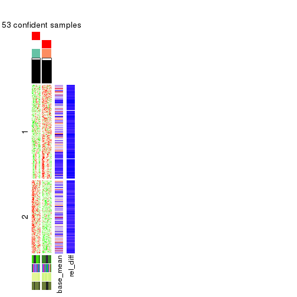</p>

</div>
<div id='tab-SD-skmeans-get-signatures-2'>
<pre><code class="r">get_signatures(res, k = 3)
</code></pre>

<p>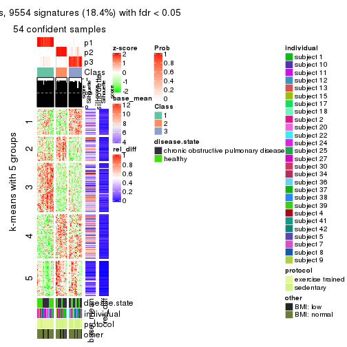</p>

</div>
<div id='tab-SD-skmeans-get-signatures-3'>
<pre><code class="r">get_signatures(res, k = 4)
</code></pre>

<p>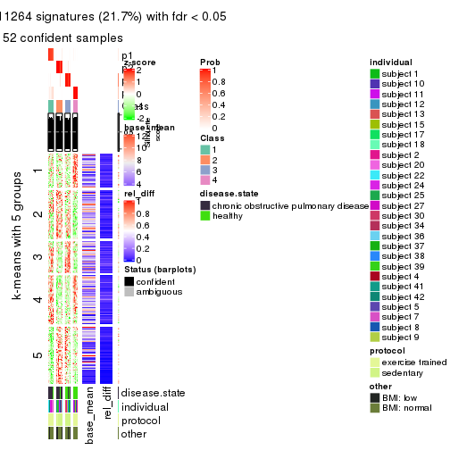</p>

</div>
<div id='tab-SD-skmeans-get-signatures-4'>
<pre><code class="r">get_signatures(res, k = 5)
</code></pre>

<p>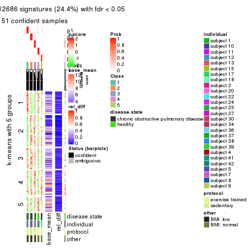</p>

</div>
<div id='tab-SD-skmeans-get-signatures-5'>
<pre><code class="r">get_signatures(res, k = 6)
</code></pre>

<p>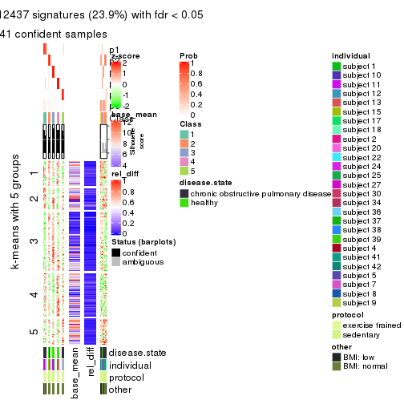</p>

</div>
</div>


Signature heatmaps where rows are not scaled:


<script>
$( function() {
	$( '#tabs-SD-skmeans-get-signatures-no-scale' ).tabs();
} );
</script>
<div id='tabs-SD-skmeans-get-signatures-no-scale'>
<ul>
<li><a href='#tab-SD-skmeans-get-signatures-no-scale-1'>k = 2</a></li>
<li><a href='#tab-SD-skmeans-get-signatures-no-scale-2'>k = 3</a></li>
<li><a href='#tab-SD-skmeans-get-signatures-no-scale-3'>k = 4</a></li>
<li><a href='#tab-SD-skmeans-get-signatures-no-scale-4'>k = 5</a></li>
<li><a href='#tab-SD-skmeans-get-signatures-no-scale-5'>k = 6</a></li>
</ul>
<div id='tab-SD-skmeans-get-signatures-no-scale-1'>
<pre><code class="r">get_signatures(res, k = 2, scale_rows = FALSE)
</code></pre>

<p>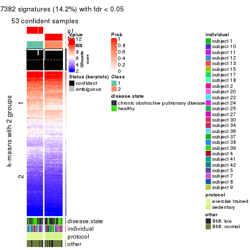</p>

</div>
<div id='tab-SD-skmeans-get-signatures-no-scale-2'>
<pre><code class="r">get_signatures(res, k = 3, scale_rows = FALSE)
</code></pre>

<p>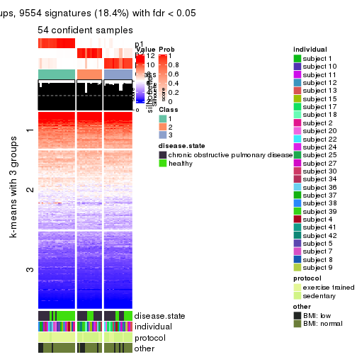</p>

</div>
<div id='tab-SD-skmeans-get-signatures-no-scale-3'>
<pre><code class="r">get_signatures(res, k = 4, scale_rows = FALSE)
</code></pre>

<p>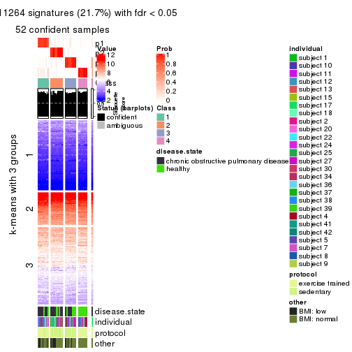</p>

</div>
<div id='tab-SD-skmeans-get-signatures-no-scale-4'>
<pre><code class="r">get_signatures(res, k = 5, scale_rows = FALSE)
</code></pre>

<p>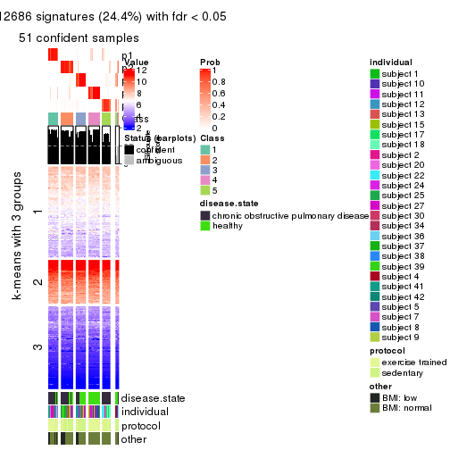</p>

</div>
<div id='tab-SD-skmeans-get-signatures-no-scale-5'>
<pre><code class="r">get_signatures(res, k = 6, scale_rows = FALSE)
</code></pre>

<p>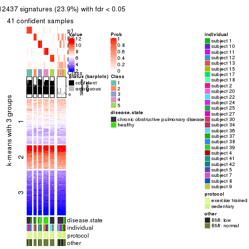</p>

</div>
</div>


Compare the overlap of signatures from different k:

```r
compare_signatures(res)
```

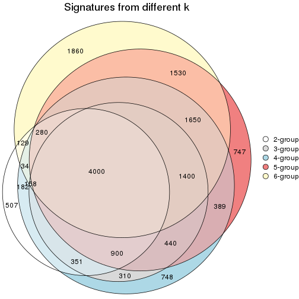

`get_signature()` returns a data frame invisibly. TO get the list of signatures, the function
call should be assigned to a variable explicitly. In following code, if `plot` argument is set
to `FALSE`, no heatmap is plotted while only the differential analysis is performed.

```r
# code only for demonstration
tb = get_signature(res, k = ..., plot = FALSE)
```

An example of the output of `tb` is:

```
#>   which_row         fdr    mean_1    mean_2 scaled_mean_1 scaled_mean_2 km
#> 1        38 0.042760348  8.373488  9.131774    -0.5533452     0.5164555  1
#> 2        40 0.018707592  7.106213  8.469186    -0.6173731     0.5762149  1
#> 3        55 0.019134737 10.221463 11.207825    -0.6159697     0.5749050  1
#> 4        59 0.006059896  5.921854  7.869574    -0.6899429     0.6439467  1
#> 5        60 0.018055526  8.928898 10.211722    -0.6204761     0.5791110  1
#> 6        98 0.009384629 15.714769 14.887706     0.6635654    -0.6193277  2
...
```

The columns in `tb` are:

1. `which_row`: row indices corresponding to the input matrix.
2. `fdr`: FDR for the differential test. 
3. `mean_x`: The mean value in group x.
4. `scaled_mean_x`: The mean value in group x after rows are scaled.
5. `km`: Row groups if k-means clustering is applied to rows.


UMAP plot which shows how samples are separated.


<script>
$( function() {
	$( '#tabs-SD-skmeans-dimension-reduction' ).tabs();
} );
</script>
<div id='tabs-SD-skmeans-dimension-reduction'>
<ul>
<li><a href='#tab-SD-skmeans-dimension-reduction-1'>k = 2</a></li>
<li><a href='#tab-SD-skmeans-dimension-reduction-2'>k = 3</a></li>
<li><a href='#tab-SD-skmeans-dimension-reduction-3'>k = 4</a></li>
<li><a href='#tab-SD-skmeans-dimension-reduction-4'>k = 5</a></li>
<li><a href='#tab-SD-skmeans-dimension-reduction-5'>k = 6</a></li>
</ul>
<div id='tab-SD-skmeans-dimension-reduction-1'>
<pre><code class="r">dimension_reduction(res, k = 2, method = &quot;UMAP&quot;)
</code></pre>

<p>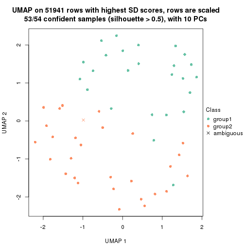</p>

</div>
<div id='tab-SD-skmeans-dimension-reduction-2'>
<pre><code class="r">dimension_reduction(res, k = 3, method = &quot;UMAP&quot;)
</code></pre>

<p>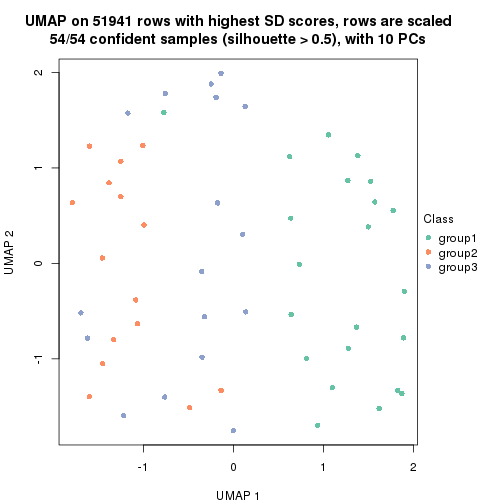</p>

</div>
<div id='tab-SD-skmeans-dimension-reduction-3'>
<pre><code class="r">dimension_reduction(res, k = 4, method = &quot;UMAP&quot;)
</code></pre>

<p>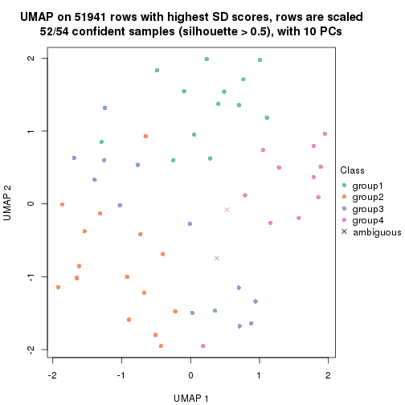</p>

</div>
<div id='tab-SD-skmeans-dimension-reduction-4'>
<pre><code class="r">dimension_reduction(res, k = 5, method = &quot;UMAP&quot;)
</code></pre>

<p>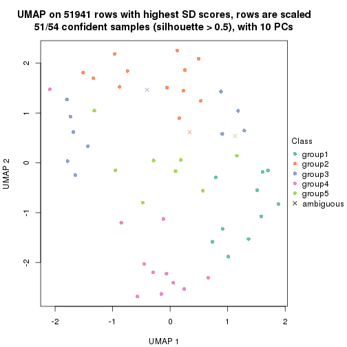</p>

</div>
<div id='tab-SD-skmeans-dimension-reduction-5'>
<pre><code class="r">dimension_reduction(res, k = 6, method = &quot;UMAP&quot;)
</code></pre>

<p>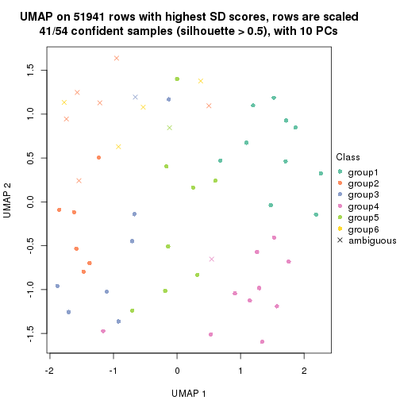</p>

</div>
</div>


Following heatmap shows how subgroups are split when increasing `k`:

```r
collect_classes(res)
```

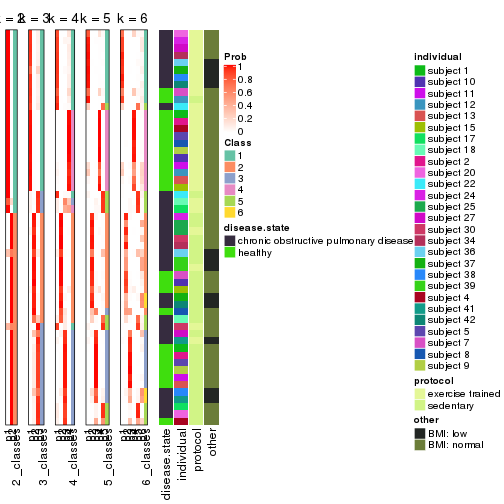


Test correlation between subgroups and known annotations. If the known
annotation is numeric, one-way ANOVA test is applied, and if the known
annotation is discrete, chi-squared contingency table test is applied.

```r
test_to_known_factors(res)
```

```
#>             n disease.state(p) individual(p) protocol(p) other(p) k
#> SD:skmeans 53         5.14e-01         0.996    1.76e-08   0.4455 2
#> SD:skmeans 54         1.42e-01         0.808    1.84e-07   0.4759 3
#> SD:skmeans 52         1.41e-04         0.710    1.49e-07   0.2016 4
#> SD:skmeans 51         3.95e-05         0.191    7.61e-06   0.0709 5
#> SD:skmeans 41         4.67e-05         0.421    2.29e-04   0.0317 6
```


If matrix rows can be associated to genes, consider to use `functional_enrichment(res,
...)` to perform function enrichment for the signature genes. See [this vignette](http://bioconductor.org/packages/devel/bioc/vignettes/cola/inst/doc/functional_enrichment.html) for more detailed explanations.


 

---------------------------------------------------


### SD:pam*


The object with results only for a single top-value method and a single partition method 
can be extracted as:

```r
res = res_list["SD", "pam"]
# you can also extract it by
# res = res_list["SD:pam"]
```

A summary of `res` and all the functions that can be applied to it:

```r
res
```

```
#> A 'ConsensusPartition' object with k = 2, 3, 4, 5, 6.
#>   On a matrix with 51941 rows and 54 columns.
#>   Top rows (1000, 2000, 3000, 4000, 5000) are extracted by 'SD' method.
#>   Subgroups are detected by 'pam' method.
#>   Performed in total 1250 partitions by row resampling.
#>   Best k for subgroups seems to be 6.
#> 
#> Following methods can be applied to this 'ConsensusPartition' object:
#>  [1] "cola_report"             "collect_classes"         "collect_plots"          
#>  [4] "collect_stats"           "colnames"                "compare_signatures"     
#>  [7] "consensus_heatmap"       "dimension_reduction"     "functional_enrichment"  
#> [10] "get_anno_col"            "get_anno"                "get_classes"            
#> [13] "get_consensus"           "get_matrix"              "get_membership"         
#> [16] "get_param"               "get_signatures"          "get_stats"              
#> [19] "is_best_k"               "is_stable_k"             "membership_heatmap"     
#> [22] "ncol"                    "nrow"                    "plot_ecdf"              
#> [25] "rownames"                "select_partition_number" "show"                   
#> [28] "suggest_best_k"          "test_to_known_factors"
```

`collect_plots()` function collects all the plots made from `res` for all `k` (number of partitions)
into one single page to provide an easy and fast comparison between different `k`.

```r
collect_plots(res)
```

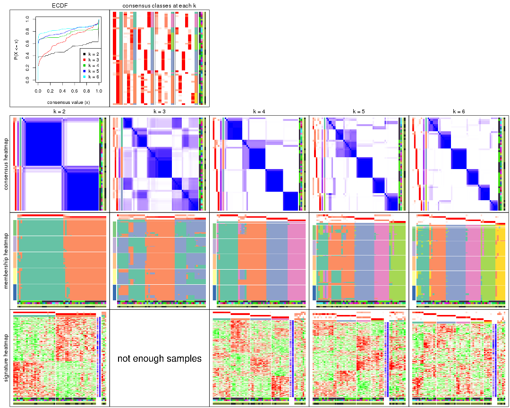

The plots are:

- The first row: a plot of the ECDF (empirical cumulative distribution
  function) curves of the consensus matrix for each `k` and the heatmap of
  predicted classes for each `k`.
- The second row: heatmaps of the consensus matrix for each `k`.
- The third row: heatmaps of the membership matrix for each `k`.
- The fouth row: heatmaps of the signatures for each `k`.

All the plots in panels can be made by individual functions and they are
plotted later in this section.

`select_partition_number()` produces several plots showing different
statistics for choosing "optimized" `k`. There are following statistics:

- ECDF curves of the consensus matrix for each `k`;
- 1-PAC. [The PAC
  score](https://en.wikipedia.org/wiki/Consensus_clustering#Over-interpretation_potential_of_consensus_clustering)
  measures the proportion of the ambiguous subgrouping.
- Mean silhouette score.
- Concordance. The mean probability of fiting the consensus class ids in all
  partitions.
- Area increased. Denote $A_k$ as the area under the ECDF curve for current
  `k`, the area increased is defined as $A_k - A_{k-1}$.
- Rand index. The percent of pairs of samples that are both in a same cluster
  or both are not in a same cluster in the partition of k and k-1.
- Jaccard index. The ratio of pairs of samples are both in a same cluster in
  the partition of k and k-1 and the pairs of samples are both in a same
  cluster in the partition k or k-1.

The detailed explanations of these statistics can be found in [the _cola_
vignette](http://bioconductor.org/packages/devel/bioc/vignettes/cola/inst/doc/cola.html#toc_13).

Generally speaking, lower PAC score, higher mean silhouette score or higher
concordance corresponds to better partition. Rand index and Jaccard index
measure how similar the current partition is compared to partition with `k-1`.
If they are too similar, we won't accept `k` is better than `k-1`.

```r
select_partition_number(res)
```

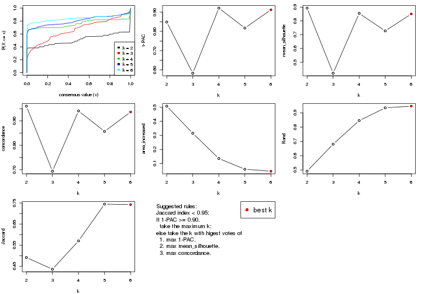

The numeric values for all these statistics can be obtained by `get_stats()`.

```r
get_stats(res)
```

```
#>   k 1-PAC mean_silhouette concordance area_increased  Rand Jaccard
#> 2 2 0.849           0.893       0.960         0.5084 0.491   0.491
#> 3 3 0.583           0.421       0.694         0.3152 0.681   0.436
#> 4 4 0.921           0.855       0.940         0.1357 0.846   0.570
#> 5 5 0.817           0.728       0.857         0.0593 0.935   0.745
#> 6 6 0.912           0.850       0.936         0.0452 0.947   0.742
```

`suggest_best_k()` suggests the best $k$ based on these statistics. The rules are as follows:

- All $k$ with Jaccard index larger than 0.95 are removed because increasing
  $k$ does not provide enough extra information. If all $k$ are removed, it is
  marked as no subgroup is detected.
- For all $k$ with 1-PAC score larger than 0.9, the maximal $k$ is taken as
  the best $k$, and other $k$ are marked as optional $k$.
- If it does not fit the second rule. The $k$ with the maximal vote of the
  highest 1-PAC score, highest mean silhouette, and highest concordance is
  taken as the best $k$.

```r
suggest_best_k(res)
```

```
#> [1] 6
#> attr(,"optional")
#> [1] 4
```

There is also optional best $k$ = 4 that is worth to check.

Following shows the table of the partitions (You need to click the **show/hide
code output** link to see it). The membership matrix (columns with name `p*`)
is inferred by
[`clue::cl_consensus()`](https://www.rdocumentation.org/link/cl_consensus?package=clue)
function with the `SE` method. Basically the value in the membership matrix
represents the probability to belong to a certain group. The finall class
label for an item is determined with the group with highest probability it
belongs to.

In `get_classes()` function, the entropy is calculated from the membership
matrix and the silhouette score is calculated from the consensus matrix.


<script>
$( function() {
	$( '#tabs-SD-pam-get-classes' ).tabs();
} );
</script>
<div id='tabs-SD-pam-get-classes'>
<ul>
<li><a href='#tab-SD-pam-get-classes-1'>k = 2</a></li>
<li><a href='#tab-SD-pam-get-classes-2'>k = 3</a></li>
<li><a href='#tab-SD-pam-get-classes-3'>k = 4</a></li>
<li><a href='#tab-SD-pam-get-classes-4'>k = 5</a></li>
<li><a href='#tab-SD-pam-get-classes-5'>k = 6</a></li>
</ul>

<div id='tab-SD-pam-get-classes-1'>
<p><a id='tab-SD-pam-get-classes-1-a' style='color:#0366d6' href='#'>show/hide code output</a></p>
<pre><code class="r">cbind(get_classes(res, k = 2), get_membership(res, k = 2))
</code></pre>

<pre><code>#&gt;           class entropy silhouette    p1    p2
#&gt; GSM680053     1  0.0000     0.9561 1.000 0.000
#&gt; GSM680062     1  0.0000     0.9561 1.000 0.000
#&gt; GSM680054     2  0.0000     0.9555 0.000 1.000
#&gt; GSM680063     1  0.0000     0.9561 1.000 0.000
#&gt; GSM680055     1  0.0000     0.9561 1.000 0.000
#&gt; GSM680064     1  0.0000     0.9561 1.000 0.000
#&gt; GSM680056     1  0.0000     0.9561 1.000 0.000
#&gt; GSM680065     1  0.0000     0.9561 1.000 0.000
#&gt; GSM680057     2  0.0000     0.9555 0.000 1.000
#&gt; GSM680066     2  0.0000     0.9555 0.000 1.000
#&gt; GSM680058     2  0.0000     0.9555 0.000 1.000
#&gt; GSM680067     2  0.0000     0.9555 0.000 1.000
#&gt; GSM680059     2  0.0672     0.9492 0.008 0.992
#&gt; GSM680068     1  0.0000     0.9561 1.000 0.000
#&gt; GSM680060     2  0.0000     0.9555 0.000 1.000
#&gt; GSM680069     1  0.0000     0.9561 1.000 0.000
#&gt; GSM680061     2  0.0000     0.9555 0.000 1.000
#&gt; GSM680070     1  0.0000     0.9561 1.000 0.000
#&gt; GSM680071     2  0.6438     0.7879 0.164 0.836
#&gt; GSM680077     1  0.9944     0.1414 0.544 0.456
#&gt; GSM680072     2  0.0000     0.9555 0.000 1.000
#&gt; GSM680078     1  0.0000     0.9561 1.000 0.000
#&gt; GSM680073     2  0.8443     0.6124 0.272 0.728
#&gt; GSM680079     1  0.0000     0.9561 1.000 0.000
#&gt; GSM680074     2  0.0000     0.9555 0.000 1.000
#&gt; GSM680080     2  0.0000     0.9555 0.000 1.000
#&gt; GSM680075     1  0.0000     0.9561 1.000 0.000
#&gt; GSM680081     2  0.0000     0.9555 0.000 1.000
#&gt; GSM680076     2  0.0000     0.9555 0.000 1.000
#&gt; GSM680082     2  0.0000     0.9555 0.000 1.000
#&gt; GSM680029     1  0.7453     0.7086 0.788 0.212
#&gt; GSM680041     1  0.0000     0.9561 1.000 0.000
#&gt; GSM680035     2  0.0000     0.9555 0.000 1.000
#&gt; GSM680047     1  0.0000     0.9561 1.000 0.000
#&gt; GSM680036     2  0.9996     0.0265 0.488 0.512
#&gt; GSM680048     1  0.0000     0.9561 1.000 0.000
#&gt; GSM680037     1  0.0000     0.9561 1.000 0.000
#&gt; GSM680049     1  0.9909     0.1624 0.556 0.444
#&gt; GSM680038     2  0.0000     0.9555 0.000 1.000
#&gt; GSM680050     1  0.0000     0.9561 1.000 0.000
#&gt; GSM680039     2  0.0000     0.9555 0.000 1.000
#&gt; GSM680051     2  0.5059     0.8511 0.112 0.888
#&gt; GSM680040     2  0.0000     0.9555 0.000 1.000
#&gt; GSM680052     1  0.0000     0.9561 1.000 0.000
#&gt; GSM680030     2  0.0000     0.9555 0.000 1.000
#&gt; GSM680042     1  0.0000     0.9561 1.000 0.000
#&gt; GSM680031     1  0.0000     0.9561 1.000 0.000
#&gt; GSM680043     1  0.0000     0.9561 1.000 0.000
#&gt; GSM680032     2  0.0000     0.9555 0.000 1.000
#&gt; GSM680044     1  0.0000     0.9561 1.000 0.000
#&gt; GSM680033     2  0.0000     0.9555 0.000 1.000
#&gt; GSM680045     1  0.0000     0.9561 1.000 0.000
#&gt; GSM680034     2  0.0000     0.9555 0.000 1.000
#&gt; GSM680046     1  0.0000     0.9561 1.000 0.000
</code></pre>

<script>
$('#tab-SD-pam-get-classes-1-a').parent().next().next().hide();
$('#tab-SD-pam-get-classes-1-a').click(function(){
  $('#tab-SD-pam-get-classes-1-a').parent().next().next().toggle();
  return(false);
});
</script>
</div>

<div id='tab-SD-pam-get-classes-2'>
<p><a id='tab-SD-pam-get-classes-2-a' style='color:#0366d6' href='#'>show/hide code output</a></p>
<pre><code class="r">cbind(get_classes(res, k = 3), get_membership(res, k = 3))
</code></pre>

<pre><code>#&gt;           class entropy silhouette    p1    p2    p3
#&gt; GSM680053     3  0.1031     0.4805 0.000 0.024 0.976
#&gt; GSM680062     3  0.3276     0.4329 0.068 0.024 0.908
#&gt; GSM680054     2  0.1163     0.9151 0.000 0.972 0.028
#&gt; GSM680063     3  0.1411     0.4754 0.000 0.036 0.964
#&gt; GSM680055     3  0.1031     0.4805 0.000 0.024 0.976
#&gt; GSM680064     1  0.6286     0.1772 0.536 0.000 0.464
#&gt; GSM680056     3  0.2165     0.4552 0.000 0.064 0.936
#&gt; GSM680065     3  0.0892     0.4805 0.000 0.020 0.980
#&gt; GSM680057     2  0.0000     0.9292 0.000 1.000 0.000
#&gt; GSM680066     2  0.2945     0.8710 0.004 0.908 0.088
#&gt; GSM680058     2  0.0000     0.9292 0.000 1.000 0.000
#&gt; GSM680067     2  0.0000     0.9292 0.000 1.000 0.000
#&gt; GSM680059     1  0.9615    -0.0505 0.456 0.220 0.324
#&gt; GSM680068     1  0.0000     0.0826 1.000 0.000 0.000
#&gt; GSM680060     2  0.0000     0.9292 0.000 1.000 0.000
#&gt; GSM680069     3  0.0747     0.4798 0.000 0.016 0.984
#&gt; GSM680061     2  0.0000     0.9292 0.000 1.000 0.000
#&gt; GSM680070     1  0.6154     0.1582 0.592 0.000 0.408
#&gt; GSM680071     2  0.3619     0.7867 0.000 0.864 0.136
#&gt; GSM680077     2  0.6062     0.3234 0.000 0.616 0.384
#&gt; GSM680072     2  0.1781     0.9096 0.020 0.960 0.020
#&gt; GSM680078     3  0.6274     0.3121 0.456 0.000 0.544
#&gt; GSM680073     1  0.9136    -0.1647 0.456 0.144 0.400
#&gt; GSM680079     3  0.6307     0.2978 0.488 0.000 0.512
#&gt; GSM680074     2  0.0000     0.9292 0.000 1.000 0.000
#&gt; GSM680080     2  0.0000     0.9292 0.000 1.000 0.000
#&gt; GSM680075     3  0.6274     0.3121 0.456 0.000 0.544
#&gt; GSM680081     1  0.9615    -0.0505 0.456 0.220 0.324
#&gt; GSM680076     2  0.0000     0.9292 0.000 1.000 0.000
#&gt; GSM680082     1  0.6274    -0.0594 0.544 0.456 0.000
#&gt; GSM680029     3  0.7169     0.2864 0.456 0.024 0.520
#&gt; GSM680041     3  0.6008     0.0691 0.372 0.000 0.628
#&gt; GSM680035     1  0.9615    -0.0505 0.456 0.220 0.324
#&gt; GSM680047     3  0.5926     0.0982 0.356 0.000 0.644
#&gt; GSM680036     3  0.6931     0.2976 0.456 0.016 0.528
#&gt; GSM680048     3  0.5926     0.0982 0.356 0.000 0.644
#&gt; GSM680037     3  0.6654     0.3064 0.456 0.008 0.536
#&gt; GSM680049     1  0.9151     0.2158 0.544 0.228 0.228
#&gt; GSM680038     2  0.0000     0.9292 0.000 1.000 0.000
#&gt; GSM680050     3  0.8067     0.1489 0.188 0.160 0.652
#&gt; GSM680039     2  0.2711     0.8723 0.000 0.912 0.088
#&gt; GSM680051     1  0.6641    -0.0408 0.544 0.448 0.008
#&gt; GSM680040     1  0.9568    -0.0648 0.456 0.208 0.336
#&gt; GSM680052     1  0.6274     0.1867 0.544 0.000 0.456
#&gt; GSM680030     2  0.0000     0.9292 0.000 1.000 0.000
#&gt; GSM680042     1  0.6274     0.1867 0.544 0.000 0.456
#&gt; GSM680031     3  0.6527     0.3281 0.404 0.008 0.588
#&gt; GSM680043     1  0.6274     0.1867 0.544 0.000 0.456
#&gt; GSM680032     2  0.3120     0.8744 0.012 0.908 0.080
#&gt; GSM680044     3  0.5760     0.1327 0.328 0.000 0.672
#&gt; GSM680033     1  0.9615    -0.0505 0.456 0.220 0.324
#&gt; GSM680045     1  0.6274     0.1867 0.544 0.000 0.456
#&gt; GSM680034     2  0.2796     0.8551 0.092 0.908 0.000
#&gt; GSM680046     1  0.6274     0.1867 0.544 0.000 0.456
</code></pre>

<script>
$('#tab-SD-pam-get-classes-2-a').parent().next().next().hide();
$('#tab-SD-pam-get-classes-2-a').click(function(){
  $('#tab-SD-pam-get-classes-2-a').parent().next().next().toggle();
  return(false);
});
</script>
</div>

<div id='tab-SD-pam-get-classes-3'>
<p><a id='tab-SD-pam-get-classes-3-a' style='color:#0366d6' href='#'>show/hide code output</a></p>
<pre><code class="r">cbind(get_classes(res, k = 4), get_membership(res, k = 4))
</code></pre>

<pre><code>#&gt;           class entropy silhouette    p1    p2    p3    p4
#&gt; GSM680053     1  0.0000      0.924 1.000 0.000 0.000 0.000
#&gt; GSM680062     1  0.0000      0.924 1.000 0.000 0.000 0.000
#&gt; GSM680054     2  0.4843      0.330 0.396 0.604 0.000 0.000
#&gt; GSM680063     1  0.0000      0.924 1.000 0.000 0.000 0.000
#&gt; GSM680055     1  0.0000      0.924 1.000 0.000 0.000 0.000
#&gt; GSM680064     4  0.0000      0.998 0.000 0.000 0.000 1.000
#&gt; GSM680056     1  0.0000      0.924 1.000 0.000 0.000 0.000
#&gt; GSM680065     1  0.0000      0.924 1.000 0.000 0.000 0.000
#&gt; GSM680057     2  0.0000      0.852 0.000 1.000 0.000 0.000
#&gt; GSM680066     2  0.5827      0.294 0.000 0.532 0.436 0.032
#&gt; GSM680058     2  0.0000      0.852 0.000 1.000 0.000 0.000
#&gt; GSM680067     2  0.0000      0.852 0.000 1.000 0.000 0.000
#&gt; GSM680059     3  0.0000      0.991 0.000 0.000 1.000 0.000
#&gt; GSM680068     4  0.0000      0.998 0.000 0.000 0.000 1.000
#&gt; GSM680060     2  0.0000      0.852 0.000 1.000 0.000 0.000
#&gt; GSM680069     1  0.0524      0.918 0.988 0.008 0.004 0.000
#&gt; GSM680061     2  0.0000      0.852 0.000 1.000 0.000 0.000
#&gt; GSM680070     4  0.0707      0.979 0.020 0.000 0.000 0.980
#&gt; GSM680071     2  0.0188      0.849 0.004 0.996 0.000 0.000
#&gt; GSM680077     1  0.4985      0.126 0.532 0.468 0.000 0.000
#&gt; GSM680072     2  0.0000      0.852 0.000 1.000 0.000 0.000
#&gt; GSM680078     3  0.0000      0.991 0.000 0.000 1.000 0.000
#&gt; GSM680073     3  0.0000      0.991 0.000 0.000 1.000 0.000
#&gt; GSM680079     3  0.0188      0.988 0.004 0.000 0.996 0.000
#&gt; GSM680074     2  0.0000      0.852 0.000 1.000 0.000 0.000
#&gt; GSM680080     2  0.0000      0.852 0.000 1.000 0.000 0.000
#&gt; GSM680075     3  0.0000      0.991 0.000 0.000 1.000 0.000
#&gt; GSM680081     3  0.0000      0.991 0.000 0.000 1.000 0.000
#&gt; GSM680076     2  0.0000      0.852 0.000 1.000 0.000 0.000
#&gt; GSM680082     4  0.0000      0.998 0.000 0.000 0.000 1.000
#&gt; GSM680029     3  0.0000      0.991 0.000 0.000 1.000 0.000
#&gt; GSM680041     1  0.4713      0.422 0.640 0.000 0.000 0.360
#&gt; GSM680035     3  0.0000      0.991 0.000 0.000 1.000 0.000
#&gt; GSM680047     1  0.0336      0.922 0.992 0.000 0.000 0.008
#&gt; GSM680036     3  0.0000      0.991 0.000 0.000 1.000 0.000
#&gt; GSM680048     1  0.0336      0.922 0.992 0.000 0.000 0.008
#&gt; GSM680037     3  0.0000      0.991 0.000 0.000 1.000 0.000
#&gt; GSM680049     4  0.0000      0.998 0.000 0.000 0.000 1.000
#&gt; GSM680038     2  0.0000      0.852 0.000 1.000 0.000 0.000
#&gt; GSM680050     1  0.0336      0.922 0.992 0.000 0.000 0.008
#&gt; GSM680039     2  0.4985      0.247 0.000 0.532 0.468 0.000
#&gt; GSM680051     4  0.0000      0.998 0.000 0.000 0.000 1.000
#&gt; GSM680040     3  0.0000      0.991 0.000 0.000 1.000 0.000
#&gt; GSM680052     4  0.0000      0.998 0.000 0.000 0.000 1.000
#&gt; GSM680030     2  0.0000      0.852 0.000 1.000 0.000 0.000
#&gt; GSM680042     4  0.0000      0.998 0.000 0.000 0.000 1.000
#&gt; GSM680031     3  0.2281      0.891 0.096 0.000 0.904 0.000
#&gt; GSM680043     4  0.0000      0.998 0.000 0.000 0.000 1.000
#&gt; GSM680032     2  0.6644      0.435 0.008 0.572 0.344 0.076
#&gt; GSM680044     1  0.0000      0.924 1.000 0.000 0.000 0.000
#&gt; GSM680033     3  0.0000      0.991 0.000 0.000 1.000 0.000
#&gt; GSM680045     4  0.0000      0.998 0.000 0.000 0.000 1.000
#&gt; GSM680034     2  0.4985      0.191 0.000 0.532 0.000 0.468
#&gt; GSM680046     4  0.0000      0.998 0.000 0.000 0.000 1.000
</code></pre>

<script>
$('#tab-SD-pam-get-classes-3-a').parent().next().next().hide();
$('#tab-SD-pam-get-classes-3-a').click(function(){
  $('#tab-SD-pam-get-classes-3-a').parent().next().next().toggle();
  return(false);
});
</script>
</div>

<div id='tab-SD-pam-get-classes-4'>
<p><a id='tab-SD-pam-get-classes-4-a' style='color:#0366d6' href='#'>show/hide code output</a></p>
<pre><code class="r">cbind(get_classes(res, k = 5), get_membership(res, k = 5))
</code></pre>

<pre><code>#&gt;           class entropy silhouette    p1    p2    p3    p4    p5
#&gt; GSM680053     5  0.0000   0.867856 0.000 0.000 0.000 0.000 1.000
#&gt; GSM680062     5  0.0000   0.867856 0.000 0.000 0.000 0.000 1.000
#&gt; GSM680054     2  0.2020   0.701478 0.000 0.900 0.000 0.000 0.100
#&gt; GSM680063     5  0.0000   0.867856 0.000 0.000 0.000 0.000 1.000
#&gt; GSM680055     5  0.0000   0.867856 0.000 0.000 0.000 0.000 1.000
#&gt; GSM680064     1  0.1671   0.134810 0.924 0.000 0.000 0.076 0.000
#&gt; GSM680056     1  0.4305   0.000699 0.512 0.000 0.000 0.000 0.488
#&gt; GSM680065     1  0.4305   0.000699 0.512 0.000 0.000 0.000 0.488
#&gt; GSM680057     2  0.0000   0.752657 0.000 1.000 0.000 0.000 0.000
#&gt; GSM680066     2  0.3635   0.665154 0.040 0.836 0.108 0.016 0.000
#&gt; GSM680058     2  0.4138   0.656576 0.000 0.616 0.000 0.384 0.000
#&gt; GSM680067     2  0.3949   0.670966 0.000 0.668 0.000 0.332 0.000
#&gt; GSM680059     3  0.0162   0.985365 0.000 0.000 0.996 0.004 0.000
#&gt; GSM680068     4  0.4201   0.960804 0.408 0.000 0.000 0.592 0.000
#&gt; GSM680060     2  0.4074   0.663637 0.000 0.636 0.000 0.364 0.000
#&gt; GSM680069     5  0.1731   0.811332 0.060 0.004 0.004 0.000 0.932
#&gt; GSM680061     2  0.0000   0.752657 0.000 1.000 0.000 0.000 0.000
#&gt; GSM680070     4  0.4561   0.850298 0.488 0.000 0.000 0.504 0.008
#&gt; GSM680071     1  0.6787  -0.003602 0.380 0.288 0.000 0.332 0.000
#&gt; GSM680077     1  0.6503   0.434484 0.616 0.132 0.000 0.196 0.056
#&gt; GSM680072     2  0.4138   0.656576 0.000 0.616 0.000 0.384 0.000
#&gt; GSM680078     3  0.0000   0.988941 0.000 0.000 1.000 0.000 0.000
#&gt; GSM680073     3  0.0000   0.988941 0.000 0.000 1.000 0.000 0.000
#&gt; GSM680079     1  0.4415   0.102211 0.552 0.000 0.444 0.000 0.004
#&gt; GSM680074     2  0.4138   0.656576 0.000 0.616 0.000 0.384 0.000
#&gt; GSM680080     2  0.1270   0.749080 0.000 0.948 0.000 0.052 0.000
#&gt; GSM680075     3  0.0000   0.988941 0.000 0.000 1.000 0.000 0.000
#&gt; GSM680081     3  0.0000   0.988941 0.000 0.000 1.000 0.000 0.000
#&gt; GSM680076     2  0.5360   0.619053 0.060 0.556 0.000 0.384 0.000
#&gt; GSM680082     1  0.0000   0.256828 1.000 0.000 0.000 0.000 0.000
#&gt; GSM680029     3  0.0000   0.988941 0.000 0.000 1.000 0.000 0.000
#&gt; GSM680041     5  0.4840   0.400179 0.040 0.000 0.000 0.320 0.640
#&gt; GSM680035     3  0.0000   0.988941 0.000 0.000 1.000 0.000 0.000
#&gt; GSM680047     5  0.0290   0.864583 0.000 0.000 0.000 0.008 0.992
#&gt; GSM680036     3  0.0000   0.988941 0.000 0.000 1.000 0.000 0.000
#&gt; GSM680048     5  0.0290   0.864583 0.000 0.000 0.000 0.008 0.992
#&gt; GSM680037     3  0.0000   0.988941 0.000 0.000 1.000 0.000 0.000
#&gt; GSM680049     4  0.4138   0.978621 0.384 0.000 0.000 0.616 0.000
#&gt; GSM680038     2  0.0000   0.752657 0.000 1.000 0.000 0.000 0.000
#&gt; GSM680050     5  0.4425  -0.026756 0.452 0.000 0.000 0.004 0.544
#&gt; GSM680039     2  0.2773   0.646241 0.000 0.836 0.164 0.000 0.000
#&gt; GSM680051     4  0.4138   0.978621 0.384 0.000 0.000 0.616 0.000
#&gt; GSM680040     3  0.0000   0.988941 0.000 0.000 1.000 0.000 0.000
#&gt; GSM680052     4  0.4138   0.978621 0.384 0.000 0.000 0.616 0.000
#&gt; GSM680030     2  0.0000   0.752657 0.000 1.000 0.000 0.000 0.000
#&gt; GSM680042     4  0.4138   0.978621 0.384 0.000 0.000 0.616 0.000
#&gt; GSM680031     3  0.1965   0.873759 0.000 0.000 0.904 0.000 0.096
#&gt; GSM680043     4  0.4288   0.975551 0.384 0.000 0.000 0.612 0.004
#&gt; GSM680032     2  0.4451   0.357275 0.340 0.644 0.016 0.000 0.000
#&gt; GSM680044     5  0.0000   0.867856 0.000 0.000 0.000 0.000 1.000
#&gt; GSM680033     3  0.0000   0.988941 0.000 0.000 1.000 0.000 0.000
#&gt; GSM680045     4  0.4138   0.978621 0.384 0.000 0.000 0.616 0.000
#&gt; GSM680034     2  0.2773   0.647384 0.000 0.836 0.000 0.164 0.000
#&gt; GSM680046     4  0.4138   0.978621 0.384 0.000 0.000 0.616 0.000
</code></pre>

<script>
$('#tab-SD-pam-get-classes-4-a').parent().next().next().hide();
$('#tab-SD-pam-get-classes-4-a').click(function(){
  $('#tab-SD-pam-get-classes-4-a').parent().next().next().toggle();
  return(false);
});
</script>
</div>

<div id='tab-SD-pam-get-classes-5'>
<p><a id='tab-SD-pam-get-classes-5-a' style='color:#0366d6' href='#'>show/hide code output</a></p>
<pre><code class="r">cbind(get_classes(res, k = 6), get_membership(res, k = 6))
</code></pre>

<pre><code>#&gt;           class entropy silhouette    p1    p2    p3    p4    p5    p6
#&gt; GSM680053     5  0.0000      0.917 0.000 0.000 0.000 0.000 1.000 0.000
#&gt; GSM680062     5  0.0000      0.917 0.000 0.000 0.000 0.000 1.000 0.000
#&gt; GSM680054     2  0.0000      0.895 0.000 1.000 0.000 0.000 0.000 0.000
#&gt; GSM680063     5  0.0000      0.917 0.000 0.000 0.000 0.000 1.000 0.000
#&gt; GSM680055     5  0.0000      0.917 0.000 0.000 0.000 0.000 1.000 0.000
#&gt; GSM680064     1  0.1204      0.800 0.944 0.000 0.000 0.056 0.000 0.000
#&gt; GSM680056     1  0.2969      0.718 0.776 0.000 0.000 0.000 0.224 0.000
#&gt; GSM680065     1  0.2969      0.718 0.776 0.000 0.000 0.000 0.224 0.000
#&gt; GSM680057     2  0.0000      0.895 0.000 1.000 0.000 0.000 0.000 0.000
#&gt; GSM680066     2  0.1003      0.875 0.028 0.964 0.004 0.004 0.000 0.000
#&gt; GSM680058     6  0.0260      0.872 0.000 0.008 0.000 0.000 0.000 0.992
#&gt; GSM680067     2  0.3695      0.305 0.000 0.624 0.000 0.000 0.000 0.376
#&gt; GSM680059     3  0.0146      0.987 0.000 0.000 0.996 0.000 0.000 0.004
#&gt; GSM680068     4  0.0865      0.948 0.036 0.000 0.000 0.964 0.000 0.000
#&gt; GSM680060     6  0.2135      0.791 0.000 0.128 0.000 0.000 0.000 0.872
#&gt; GSM680069     5  0.2703      0.713 0.172 0.000 0.004 0.000 0.824 0.000
#&gt; GSM680061     2  0.0000      0.895 0.000 1.000 0.000 0.000 0.000 0.000
#&gt; GSM680070     4  0.2772      0.782 0.180 0.000 0.000 0.816 0.004 0.000
#&gt; GSM680071     1  0.5653      0.135 0.468 0.156 0.000 0.000 0.000 0.376
#&gt; GSM680077     1  0.0146      0.810 0.996 0.000 0.000 0.000 0.000 0.004
#&gt; GSM680072     6  0.0260      0.872 0.000 0.008 0.000 0.000 0.000 0.992
#&gt; GSM680078     3  0.0000      0.990 0.000 0.000 1.000 0.000 0.000 0.000
#&gt; GSM680073     3  0.0000      0.990 0.000 0.000 1.000 0.000 0.000 0.000
#&gt; GSM680079     1  0.0713      0.805 0.972 0.000 0.028 0.000 0.000 0.000
#&gt; GSM680074     6  0.0260      0.872 0.000 0.008 0.000 0.000 0.000 0.992
#&gt; GSM680080     6  0.3659      0.396 0.000 0.364 0.000 0.000 0.000 0.636
#&gt; GSM680075     3  0.0000      0.990 0.000 0.000 1.000 0.000 0.000 0.000
#&gt; GSM680081     3  0.0000      0.990 0.000 0.000 1.000 0.000 0.000 0.000
#&gt; GSM680076     6  0.0632      0.857 0.024 0.000 0.000 0.000 0.000 0.976
#&gt; GSM680082     1  0.0260      0.810 0.992 0.000 0.000 0.000 0.000 0.008
#&gt; GSM680029     3  0.0000      0.990 0.000 0.000 1.000 0.000 0.000 0.000
#&gt; GSM680041     5  0.3647      0.438 0.000 0.000 0.000 0.360 0.640 0.000
#&gt; GSM680035     3  0.0000      0.990 0.000 0.000 1.000 0.000 0.000 0.000
#&gt; GSM680047     5  0.0146      0.915 0.000 0.000 0.000 0.004 0.996 0.000
#&gt; GSM680036     3  0.0000      0.990 0.000 0.000 1.000 0.000 0.000 0.000
#&gt; GSM680048     5  0.0146      0.915 0.000 0.000 0.000 0.004 0.996 0.000
#&gt; GSM680037     3  0.0000      0.990 0.000 0.000 1.000 0.000 0.000 0.000
#&gt; GSM680049     4  0.0000      0.972 0.000 0.000 0.000 1.000 0.000 0.000
#&gt; GSM680038     2  0.0000      0.895 0.000 1.000 0.000 0.000 0.000 0.000
#&gt; GSM680050     1  0.2668      0.751 0.828 0.000 0.000 0.004 0.168 0.000
#&gt; GSM680039     2  0.0260      0.890 0.000 0.992 0.008 0.000 0.000 0.000
#&gt; GSM680051     4  0.0000      0.972 0.000 0.000 0.000 1.000 0.000 0.000
#&gt; GSM680040     3  0.0000      0.990 0.000 0.000 1.000 0.000 0.000 0.000
#&gt; GSM680052     4  0.0000      0.972 0.000 0.000 0.000 1.000 0.000 0.000
#&gt; GSM680030     2  0.0000      0.895 0.000 1.000 0.000 0.000 0.000 0.000
#&gt; GSM680042     4  0.0000      0.972 0.000 0.000 0.000 1.000 0.000 0.000
#&gt; GSM680031     3  0.1765      0.890 0.000 0.000 0.904 0.000 0.096 0.000
#&gt; GSM680043     4  0.0146      0.969 0.000 0.000 0.000 0.996 0.004 0.000
#&gt; GSM680032     2  0.3874      0.410 0.356 0.636 0.000 0.000 0.000 0.008
#&gt; GSM680044     5  0.0000      0.917 0.000 0.000 0.000 0.000 1.000 0.000
#&gt; GSM680033     3  0.0000      0.990 0.000 0.000 1.000 0.000 0.000 0.000
#&gt; GSM680045     4  0.0000      0.972 0.000 0.000 0.000 1.000 0.000 0.000
#&gt; GSM680034     2  0.0260      0.891 0.000 0.992 0.000 0.008 0.000 0.000
#&gt; GSM680046     4  0.0000      0.972 0.000 0.000 0.000 1.000 0.000 0.000
</code></pre>

<script>
$('#tab-SD-pam-get-classes-5-a').parent().next().next().hide();
$('#tab-SD-pam-get-classes-5-a').click(function(){
  $('#tab-SD-pam-get-classes-5-a').parent().next().next().toggle();
  return(false);
});
</script>
</div>
</div>

Heatmaps for the consensus matrix. It visualizes the probability of two
samples to be in a same group.


<script>
$( function() {
	$( '#tabs-SD-pam-consensus-heatmap' ).tabs();
} );
</script>
<div id='tabs-SD-pam-consensus-heatmap'>
<ul>
<li><a href='#tab-SD-pam-consensus-heatmap-1'>k = 2</a></li>
<li><a href='#tab-SD-pam-consensus-heatmap-2'>k = 3</a></li>
<li><a href='#tab-SD-pam-consensus-heatmap-3'>k = 4</a></li>
<li><a href='#tab-SD-pam-consensus-heatmap-4'>k = 5</a></li>
<li><a href='#tab-SD-pam-consensus-heatmap-5'>k = 6</a></li>
</ul>
<div id='tab-SD-pam-consensus-heatmap-1'>
<pre><code class="r">consensus_heatmap(res, k = 2)
</code></pre>

<p>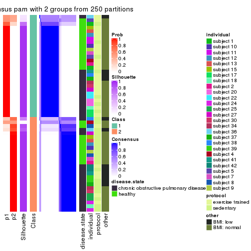</p>

</div>
<div id='tab-SD-pam-consensus-heatmap-2'>
<pre><code class="r">consensus_heatmap(res, k = 3)
</code></pre>

<p>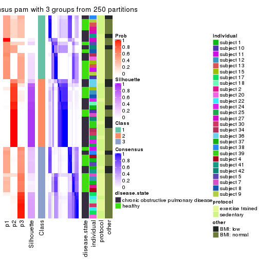</p>

</div>
<div id='tab-SD-pam-consensus-heatmap-3'>
<pre><code class="r">consensus_heatmap(res, k = 4)
</code></pre>

<p>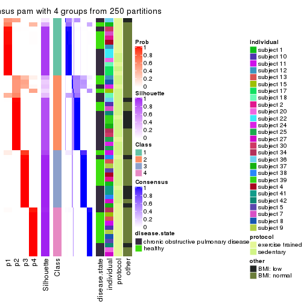</p>

</div>
<div id='tab-SD-pam-consensus-heatmap-4'>
<pre><code class="r">consensus_heatmap(res, k = 5)
</code></pre>

<p>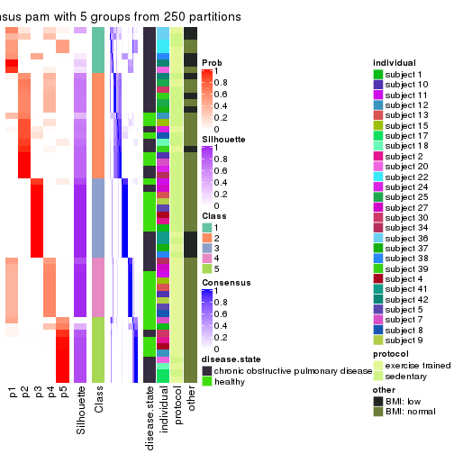</p>

</div>
<div id='tab-SD-pam-consensus-heatmap-5'>
<pre><code class="r">consensus_heatmap(res, k = 6)
</code></pre>

<p>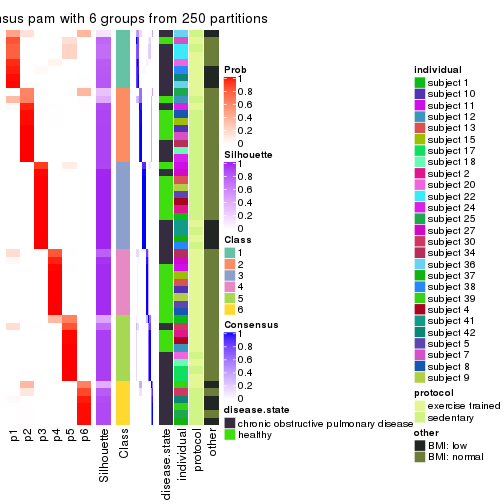</p>

</div>
</div>

Heatmaps for the membership of samples in all partitions to see how consistent they are:


<script>
$( function() {
	$( '#tabs-SD-pam-membership-heatmap' ).tabs();
} );
</script>
<div id='tabs-SD-pam-membership-heatmap'>
<ul>
<li><a href='#tab-SD-pam-membership-heatmap-1'>k = 2</a></li>
<li><a href='#tab-SD-pam-membership-heatmap-2'>k = 3</a></li>
<li><a href='#tab-SD-pam-membership-heatmap-3'>k = 4</a></li>
<li><a href='#tab-SD-pam-membership-heatmap-4'>k = 5</a></li>
<li><a href='#tab-SD-pam-membership-heatmap-5'>k = 6</a></li>
</ul>
<div id='tab-SD-pam-membership-heatmap-1'>
<pre><code class="r">membership_heatmap(res, k = 2)
</code></pre>

<p>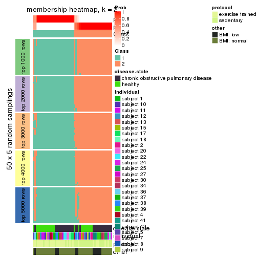</p>

</div>
<div id='tab-SD-pam-membership-heatmap-2'>
<pre><code class="r">membership_heatmap(res, k = 3)
</code></pre>

<p>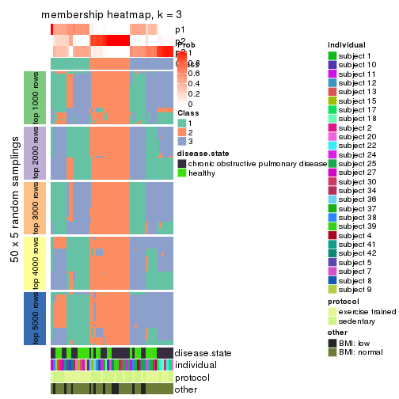</p>

</div>
<div id='tab-SD-pam-membership-heatmap-3'>
<pre><code class="r">membership_heatmap(res, k = 4)
</code></pre>

<p>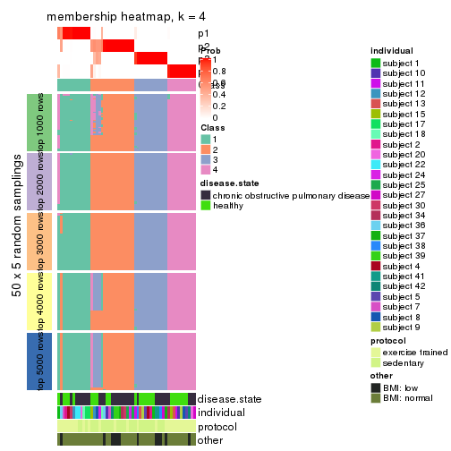</p>

</div>
<div id='tab-SD-pam-membership-heatmap-4'>
<pre><code class="r">membership_heatmap(res, k = 5)
</code></pre>

<p>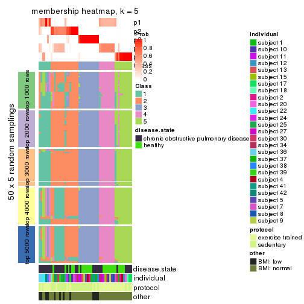</p>

</div>
<div id='tab-SD-pam-membership-heatmap-5'>
<pre><code class="r">membership_heatmap(res, k = 6)
</code></pre>

<p>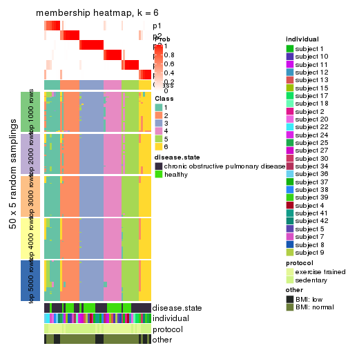</p>

</div>
</div>

As soon as we have had the classes for columns, we can look for signatures
which are significantly different between classes which can be candidate marks
for certain classes. Following are the heatmaps for signatures.


Signature heatmaps where rows are scaled:


<script>
$( function() {
	$( '#tabs-SD-pam-get-signatures' ).tabs();
} );
</script>
<div id='tabs-SD-pam-get-signatures'>
<ul>
<li><a href='#tab-SD-pam-get-signatures-1'>k = 2</a></li>
<li><a href='#tab-SD-pam-get-signatures-2'>k = 3</a></li>
<li><a href='#tab-SD-pam-get-signatures-3'>k = 4</a></li>
<li><a href='#tab-SD-pam-get-signatures-4'>k = 5</a></li>
<li><a href='#tab-SD-pam-get-signatures-5'>k = 6</a></li>
</ul>
<div id='tab-SD-pam-get-signatures-1'>
<pre><code class="r">get_signatures(res, k = 2)
</code></pre>

<p>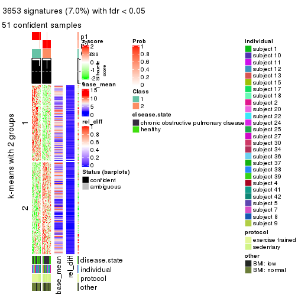</p>

</div>
<div id='tab-SD-pam-get-signatures-2'>
<pre><code class="r">get_signatures(res, k = 3)
</code></pre>

<p></p>

</div>
<div id='tab-SD-pam-get-signatures-3'>
<pre><code class="r">get_signatures(res, k = 4)
</code></pre>

<p>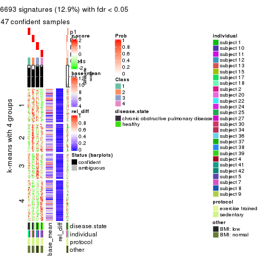</p>

</div>
<div id='tab-SD-pam-get-signatures-4'>
<pre><code class="r">get_signatures(res, k = 5)
</code></pre>

<p>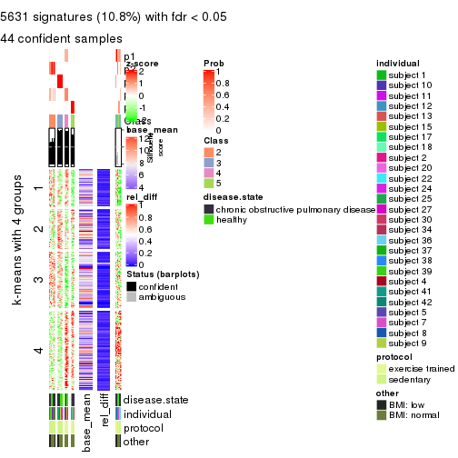</p>

</div>
<div id='tab-SD-pam-get-signatures-5'>
<pre><code class="r">get_signatures(res, k = 6)
</code></pre>

<p>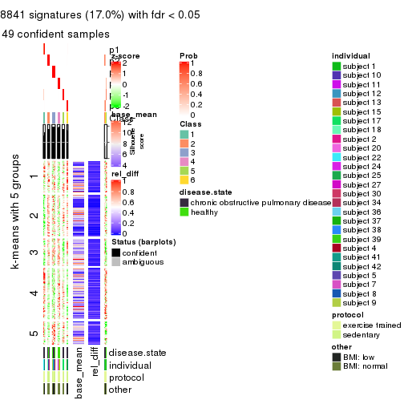</p>

</div>
</div>


Signature heatmaps where rows are not scaled:


<script>
$( function() {
	$( '#tabs-SD-pam-get-signatures-no-scale' ).tabs();
} );
</script>
<div id='tabs-SD-pam-get-signatures-no-scale'>
<ul>
<li><a href='#tab-SD-pam-get-signatures-no-scale-1'>k = 2</a></li>
<li><a href='#tab-SD-pam-get-signatures-no-scale-2'>k = 3</a></li>
<li><a href='#tab-SD-pam-get-signatures-no-scale-3'>k = 4</a></li>
<li><a href='#tab-SD-pam-get-signatures-no-scale-4'>k = 5</a></li>
<li><a href='#tab-SD-pam-get-signatures-no-scale-5'>k = 6</a></li>
</ul>
<div id='tab-SD-pam-get-signatures-no-scale-1'>
<pre><code class="r">get_signatures(res, k = 2, scale_rows = FALSE)
</code></pre>

<p>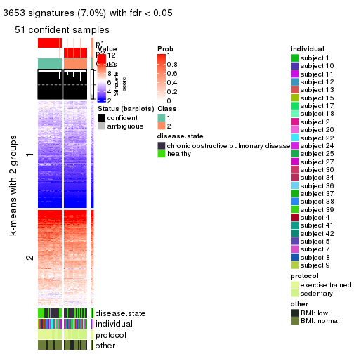</p>

</div>
<div id='tab-SD-pam-get-signatures-no-scale-2'>
<pre><code class="r">get_signatures(res, k = 3, scale_rows = FALSE)
</code></pre>

<p></p>

</div>
<div id='tab-SD-pam-get-signatures-no-scale-3'>
<pre><code class="r">get_signatures(res, k = 4, scale_rows = FALSE)
</code></pre>

<p>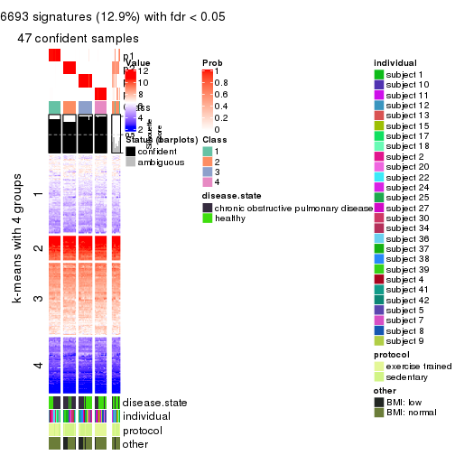</p>

</div>
<div id='tab-SD-pam-get-signatures-no-scale-4'>
<pre><code class="r">get_signatures(res, k = 5, scale_rows = FALSE)
</code></pre>

<p>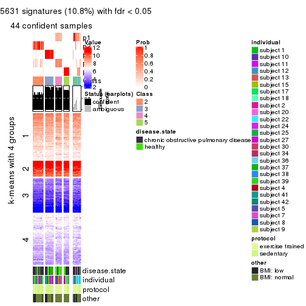</p>

</div>
<div id='tab-SD-pam-get-signatures-no-scale-5'>
<pre><code class="r">get_signatures(res, k = 6, scale_rows = FALSE)
</code></pre>

<p>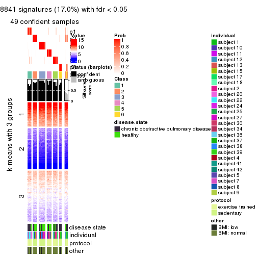</p>

</div>
</div>


Compare the overlap of signatures from different k:

```r
compare_signatures(res)
```

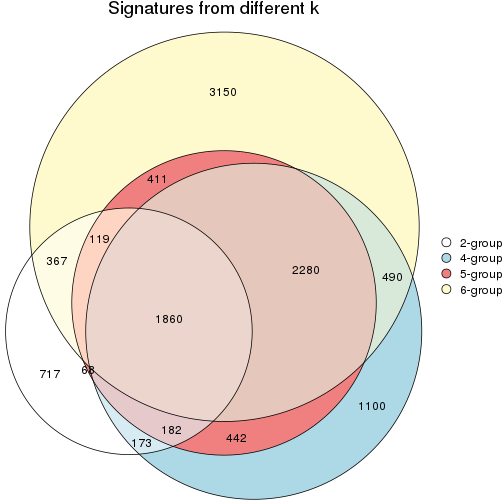

`get_signature()` returns a data frame invisibly. TO get the list of signatures, the function
call should be assigned to a variable explicitly. In following code, if `plot` argument is set
to `FALSE`, no heatmap is plotted while only the differential analysis is performed.

```r
# code only for demonstration
tb = get_signature(res, k = ..., plot = FALSE)
```

An example of the output of `tb` is:

```
#>   which_row         fdr    mean_1    mean_2 scaled_mean_1 scaled_mean_2 km
#> 1        38 0.042760348  8.373488  9.131774    -0.5533452     0.5164555  1
#> 2        40 0.018707592  7.106213  8.469186    -0.6173731     0.5762149  1
#> 3        55 0.019134737 10.221463 11.207825    -0.6159697     0.5749050  1
#> 4        59 0.006059896  5.921854  7.869574    -0.6899429     0.6439467  1
#> 5        60 0.018055526  8.928898 10.211722    -0.6204761     0.5791110  1
#> 6        98 0.009384629 15.714769 14.887706     0.6635654    -0.6193277  2
...
```

The columns in `tb` are:

1. `which_row`: row indices corresponding to the input matrix.
2. `fdr`: FDR for the differential test. 
3. `mean_x`: The mean value in group x.
4. `scaled_mean_x`: The mean value in group x after rows are scaled.
5. `km`: Row groups if k-means clustering is applied to rows.


UMAP plot which shows how samples are separated.


<script>
$( function() {
	$( '#tabs-SD-pam-dimension-reduction' ).tabs();
} );
</script>
<div id='tabs-SD-pam-dimension-reduction'>
<ul>
<li><a href='#tab-SD-pam-dimension-reduction-1'>k = 2</a></li>
<li><a href='#tab-SD-pam-dimension-reduction-2'>k = 3</a></li>
<li><a href='#tab-SD-pam-dimension-reduction-3'>k = 4</a></li>
<li><a href='#tab-SD-pam-dimension-reduction-4'>k = 5</a></li>
<li><a href='#tab-SD-pam-dimension-reduction-5'>k = 6</a></li>
</ul>
<div id='tab-SD-pam-dimension-reduction-1'>
<pre><code class="r">dimension_reduction(res, k = 2, method = &quot;UMAP&quot;)
</code></pre>

<p>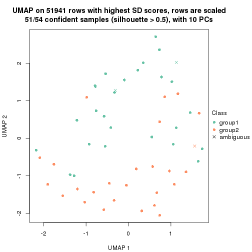</p>

</div>
<div id='tab-SD-pam-dimension-reduction-2'>
<pre><code class="r">dimension_reduction(res, k = 3, method = &quot;UMAP&quot;)
</code></pre>

<p>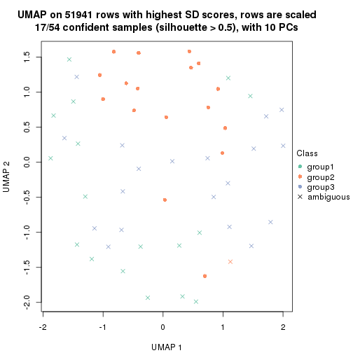</p>

</div>
<div id='tab-SD-pam-dimension-reduction-3'>
<pre><code class="r">dimension_reduction(res, k = 4, method = &quot;UMAP&quot;)
</code></pre>

<p>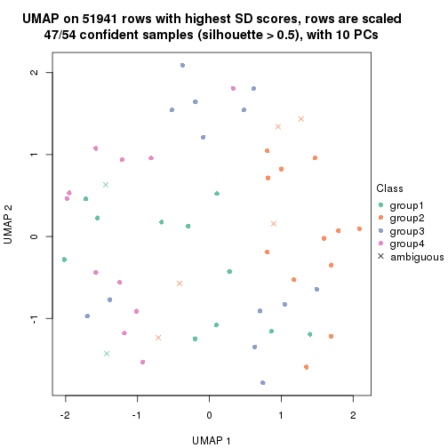</p>

</div>
<div id='tab-SD-pam-dimension-reduction-4'>
<pre><code class="r">dimension_reduction(res, k = 5, method = &quot;UMAP&quot;)
</code></pre>

<p>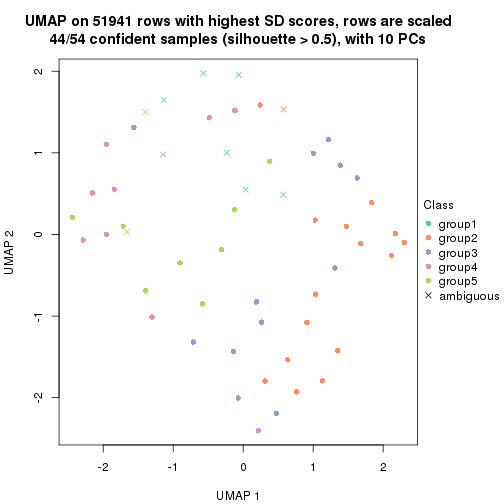</p>

</div>
<div id='tab-SD-pam-dimension-reduction-5'>
<pre><code class="r">dimension_reduction(res, k = 6, method = &quot;UMAP&quot;)
</code></pre>

<p>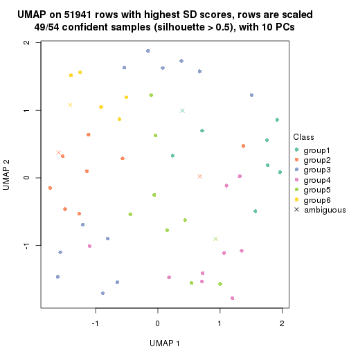</p>

</div>
</div>


Following heatmap shows how subgroups are split when increasing `k`:

```r
collect_classes(res)
```

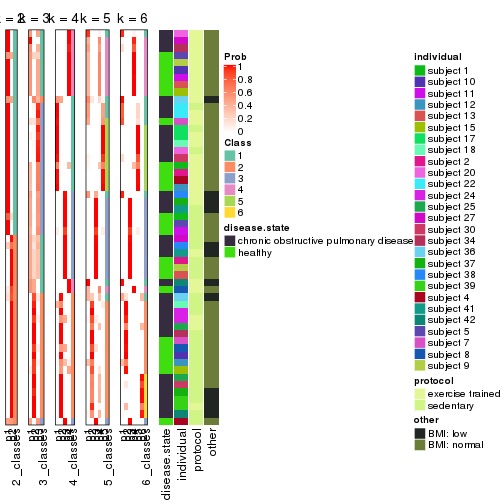


Test correlation between subgroups and known annotations. If the known
annotation is numeric, one-way ANOVA test is applied, and if the known
annotation is discrete, chi-squared contingency table test is applied.

```r
test_to_known_factors(res)
```

```
#>         n disease.state(p) individual(p) protocol(p) other(p) k
#> SD:pam 51           0.4676         0.634    1.26e-03   0.1511 2
#> SD:pam 17               NA            NA          NA       NA 3
#> SD:pam 47           0.1050         0.278    5.48e-05   0.0368 4
#> SD:pam 44           0.0785         0.411    8.10e-05   0.0955 5
#> SD:pam 49           0.0377         0.264    1.94e-05   0.0120 6
```


If matrix rows can be associated to genes, consider to use `functional_enrichment(res,
...)` to perform function enrichment for the signature genes. See [this vignette](http://bioconductor.org/packages/devel/bioc/vignettes/cola/inst/doc/functional_enrichment.html) for more detailed explanations.


 

---------------------------------------------------


### SD:mclust


The object with results only for a single top-value method and a single partition method 
can be extracted as:

```r
res = res_list["SD", "mclust"]
# you can also extract it by
# res = res_list["SD:mclust"]
```

A summary of `res` and all the functions that can be applied to it:

```r
res
```

```
#> A 'ConsensusPartition' object with k = 2, 3, 4, 5, 6.
#>   On a matrix with 51941 rows and 54 columns.
#>   Top rows (1000, 2000, 3000, 4000, 5000) are extracted by 'SD' method.
#>   Subgroups are detected by 'mclust' method.
#>   Performed in total 1250 partitions by row resampling.
#>   Best k for subgroups seems to be 4.
#> 
#> Following methods can be applied to this 'ConsensusPartition' object:
#>  [1] "cola_report"             "collect_classes"         "collect_plots"          
#>  [4] "collect_stats"           "colnames"                "compare_signatures"     
#>  [7] "consensus_heatmap"       "dimension_reduction"     "functional_enrichment"  
#> [10] "get_anno_col"            "get_anno"                "get_classes"            
#> [13] "get_consensus"           "get_matrix"              "get_membership"         
#> [16] "get_param"               "get_signatures"          "get_stats"              
#> [19] "is_best_k"               "is_stable_k"             "membership_heatmap"     
#> [22] "ncol"                    "nrow"                    "plot_ecdf"              
#> [25] "rownames"                "select_partition_number" "show"                   
#> [28] "suggest_best_k"          "test_to_known_factors"
```

`collect_plots()` function collects all the plots made from `res` for all `k` (number of partitions)
into one single page to provide an easy and fast comparison between different `k`.

```r
collect_plots(res)
```

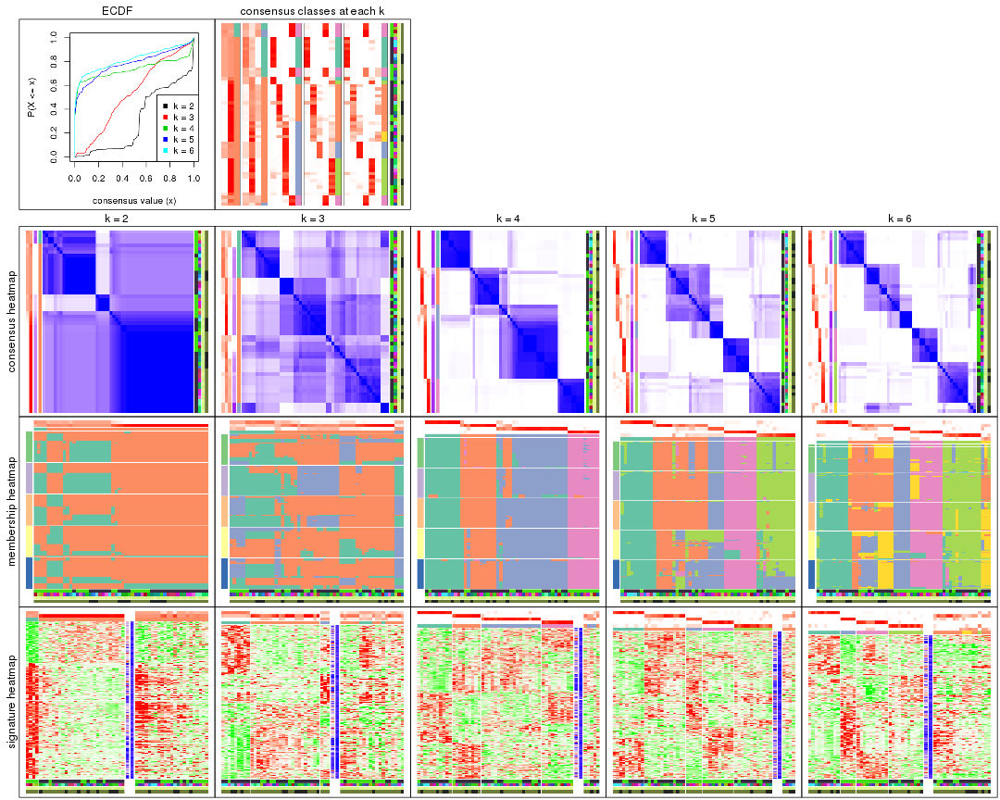

The plots are:

- The first row: a plot of the ECDF (empirical cumulative distribution
  function) curves of the consensus matrix for each `k` and the heatmap of
  predicted classes for each `k`.
- The second row: heatmaps of the consensus matrix for each `k`.
- The third row: heatmaps of the membership matrix for each `k`.
- The fouth row: heatmaps of the signatures for each `k`.

All the plots in panels can be made by individual functions and they are
plotted later in this section.

`select_partition_number()` produces several plots showing different
statistics for choosing "optimized" `k`. There are following statistics:

- ECDF curves of the consensus matrix for each `k`;
- 1-PAC. [The PAC
  score](https://en.wikipedia.org/wiki/Consensus_clustering#Over-interpretation_potential_of_consensus_clustering)
  measures the proportion of the ambiguous subgrouping.
- Mean silhouette score.
- Concordance. The mean probability of fiting the consensus class ids in all
  partitions.
- Area increased. Denote $A_k$ as the area under the ECDF curve for current
  `k`, the area increased is defined as $A_k - A_{k-1}$.
- Rand index. The percent of pairs of samples that are both in a same cluster
  or both are not in a same cluster in the partition of k and k-1.
- Jaccard index. The ratio of pairs of samples are both in a same cluster in
  the partition of k and k-1 and the pairs of samples are both in a same
  cluster in the partition k or k-1.

The detailed explanations of these statistics can be found in [the _cola_
vignette](http://bioconductor.org/packages/devel/bioc/vignettes/cola/inst/doc/cola.html#toc_13).

Generally speaking, lower PAC score, higher mean silhouette score or higher
concordance corresponds to better partition. Rand index and Jaccard index
measure how similar the current partition is compared to partition with `k-1`.
If they are too similar, we won't accept `k` is better than `k-1`.

```r
select_partition_number(res)
```

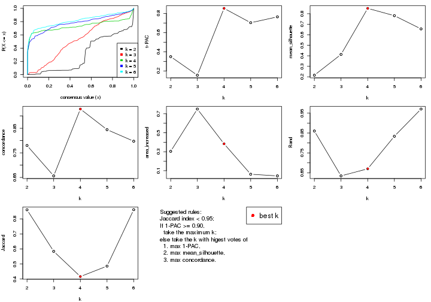

The numeric values for all these statistics can be obtained by `get_stats()`.

```r
get_stats(res)
```

```
#>   k 1-PAC mean_silhouette concordance area_increased  Rand Jaccard
#> 2 2 0.349           0.215       0.780         0.3044 0.860   0.860
#> 3 3 0.155           0.413       0.656         0.7497 0.635   0.584
#> 4 4 0.853           0.851       0.928         0.3837 0.670   0.417
#> 5 5 0.703           0.781       0.844         0.0631 0.834   0.486
#> 6 6 0.764           0.655       0.797         0.0457 0.971   0.861
```

`suggest_best_k()` suggests the best $k$ based on these statistics. The rules are as follows:

- All $k$ with Jaccard index larger than 0.95 are removed because increasing
  $k$ does not provide enough extra information. If all $k$ are removed, it is
  marked as no subgroup is detected.
- For all $k$ with 1-PAC score larger than 0.9, the maximal $k$ is taken as
  the best $k$, and other $k$ are marked as optional $k$.
- If it does not fit the second rule. The $k$ with the maximal vote of the
  highest 1-PAC score, highest mean silhouette, and highest concordance is
  taken as the best $k$.

```r
suggest_best_k(res)
```

```
#> [1] 4
```


Following shows the table of the partitions (You need to click the **show/hide
code output** link to see it). The membership matrix (columns with name `p*`)
is inferred by
[`clue::cl_consensus()`](https://www.rdocumentation.org/link/cl_consensus?package=clue)
function with the `SE` method. Basically the value in the membership matrix
represents the probability to belong to a certain group. The finall class
label for an item is determined with the group with highest probability it
belongs to.

In `get_classes()` function, the entropy is calculated from the membership
matrix and the silhouette score is calculated from the consensus matrix.


<script>
$( function() {
	$( '#tabs-SD-mclust-get-classes' ).tabs();
} );
</script>
<div id='tabs-SD-mclust-get-classes'>
<ul>
<li><a href='#tab-SD-mclust-get-classes-1'>k = 2</a></li>
<li><a href='#tab-SD-mclust-get-classes-2'>k = 3</a></li>
<li><a href='#tab-SD-mclust-get-classes-3'>k = 4</a></li>
<li><a href='#tab-SD-mclust-get-classes-4'>k = 5</a></li>
<li><a href='#tab-SD-mclust-get-classes-5'>k = 6</a></li>
</ul>

<div id='tab-SD-mclust-get-classes-1'>
<p><a id='tab-SD-mclust-get-classes-1-a' style='color:#0366d6' href='#'>show/hide code output</a></p>
<pre><code class="r">cbind(get_classes(res, k = 2), get_membership(res, k = 2))
</code></pre>

<pre><code>#&gt;           class entropy silhouette    p1    p2
#&gt; GSM680053     2  0.0000      0.616 0.000 1.000
#&gt; GSM680062     2  0.0000      0.616 0.000 1.000
#&gt; GSM680054     2  0.0000      0.616 0.000 1.000
#&gt; GSM680063     2  0.0000      0.616 0.000 1.000
#&gt; GSM680055     2  0.0000      0.616 0.000 1.000
#&gt; GSM680064     2  0.9963     -0.760 0.464 0.536
#&gt; GSM680056     2  0.9922     -0.734 0.448 0.552
#&gt; GSM680065     2  0.9963     -0.760 0.464 0.536
#&gt; GSM680057     2  0.0000      0.616 0.000 1.000
#&gt; GSM680066     2  0.0000      0.616 0.000 1.000
#&gt; GSM680058     2  0.0000      0.616 0.000 1.000
#&gt; GSM680067     2  0.0000      0.616 0.000 1.000
#&gt; GSM680059     2  0.0000      0.616 0.000 1.000
#&gt; GSM680068     2  0.9963     -0.760 0.464 0.536
#&gt; GSM680060     2  0.0000      0.616 0.000 1.000
#&gt; GSM680069     2  0.0000      0.616 0.000 1.000
#&gt; GSM680061     2  0.0000      0.616 0.000 1.000
#&gt; GSM680070     2  0.9963     -0.760 0.464 0.536
#&gt; GSM680071     2  0.4431      0.489 0.092 0.908
#&gt; GSM680077     2  0.9963     -0.760 0.464 0.536
#&gt; GSM680072     2  0.0938      0.605 0.012 0.988
#&gt; GSM680078     2  0.2948      0.553 0.052 0.948
#&gt; GSM680073     2  0.0000      0.616 0.000 1.000
#&gt; GSM680079     2  0.9963     -0.760 0.464 0.536
#&gt; GSM680074     2  0.0000      0.616 0.000 1.000
#&gt; GSM680080     2  0.0938      0.605 0.012 0.988
#&gt; GSM680075     2  0.0000      0.616 0.000 1.000
#&gt; GSM680081     2  0.0000      0.616 0.000 1.000
#&gt; GSM680076     2  0.0000      0.616 0.000 1.000
#&gt; GSM680082     2  0.9963     -0.760 0.464 0.536
#&gt; GSM680029     2  0.0000      0.616 0.000 1.000
#&gt; GSM680041     2  0.9963     -0.760 0.464 0.536
#&gt; GSM680035     2  0.9754      0.240 0.408 0.592
#&gt; GSM680047     1  0.9998      0.849 0.508 0.492
#&gt; GSM680036     2  0.0000      0.616 0.000 1.000
#&gt; GSM680048     1  0.9815      0.821 0.580 0.420
#&gt; GSM680037     2  0.9393      0.274 0.356 0.644
#&gt; GSM680049     2  0.9963     -0.760 0.464 0.536
#&gt; GSM680038     2  0.0000      0.616 0.000 1.000
#&gt; GSM680050     2  0.9963     -0.760 0.464 0.536
#&gt; GSM680039     2  0.0000      0.616 0.000 1.000
#&gt; GSM680051     2  0.9754     -0.503 0.408 0.592
#&gt; GSM680040     2  0.9754      0.240 0.408 0.592
#&gt; GSM680052     1  0.9996      0.777 0.512 0.488
#&gt; GSM680030     2  0.0000      0.616 0.000 1.000
#&gt; GSM680042     2  0.9963     -0.760 0.464 0.536
#&gt; GSM680031     2  0.9754      0.240 0.408 0.592
#&gt; GSM680043     2  0.9922     -0.704 0.448 0.552
#&gt; GSM680032     2  0.9087     -0.354 0.324 0.676
#&gt; GSM680044     2  0.6048      0.368 0.148 0.852
#&gt; GSM680033     2  0.9754      0.240 0.408 0.592
#&gt; GSM680045     2  0.7299      0.323 0.204 0.796
#&gt; GSM680034     2  0.0000      0.616 0.000 1.000
#&gt; GSM680046     1  0.9996      0.855 0.512 0.488
</code></pre>

<script>
$('#tab-SD-mclust-get-classes-1-a').parent().next().next().hide();
$('#tab-SD-mclust-get-classes-1-a').click(function(){
  $('#tab-SD-mclust-get-classes-1-a').parent().next().next().toggle();
  return(false);
});
</script>
</div>

<div id='tab-SD-mclust-get-classes-2'>
<p><a id='tab-SD-mclust-get-classes-2-a' style='color:#0366d6' href='#'>show/hide code output</a></p>
<pre><code class="r">cbind(get_classes(res, k = 3), get_membership(res, k = 3))
</code></pre>

<pre><code>#&gt;           class entropy silhouette    p1    p2    p3
#&gt; GSM680053     2  0.0592     0.6107 0.012 0.988 0.000
#&gt; GSM680062     2  0.2796     0.5785 0.092 0.908 0.000
#&gt; GSM680054     2  0.4139     0.6186 0.016 0.860 0.124
#&gt; GSM680063     2  0.1411     0.6074 0.036 0.964 0.000
#&gt; GSM680055     2  0.0237     0.6113 0.004 0.996 0.000
#&gt; GSM680064     1  0.5560     0.6289 0.700 0.300 0.000
#&gt; GSM680056     1  0.5905     0.6100 0.648 0.352 0.000
#&gt; GSM680065     1  0.5560     0.6289 0.700 0.300 0.000
#&gt; GSM680057     2  0.6931     0.5643 0.032 0.640 0.328
#&gt; GSM680066     2  0.4931     0.3799 0.232 0.768 0.000
#&gt; GSM680058     2  0.7291     0.5394 0.040 0.604 0.356
#&gt; GSM680067     2  0.8157     0.4928 0.076 0.540 0.384
#&gt; GSM680059     2  0.1031     0.6093 0.024 0.976 0.000
#&gt; GSM680068     1  0.6079     0.5745 0.612 0.388 0.000
#&gt; GSM680060     2  0.8058     0.5028 0.072 0.552 0.376
#&gt; GSM680069     2  0.4346     0.4704 0.184 0.816 0.000
#&gt; GSM680061     2  0.8180     0.4910 0.076 0.532 0.392
#&gt; GSM680070     1  0.5560     0.6289 0.700 0.300 0.000
#&gt; GSM680071     2  0.9450     0.3383 0.212 0.492 0.296
#&gt; GSM680077     1  0.6172     0.6275 0.680 0.308 0.012
#&gt; GSM680072     2  0.5254     0.5952 0.000 0.736 0.264
#&gt; GSM680078     2  0.6045    -0.1105 0.380 0.620 0.000
#&gt; GSM680073     2  0.0000     0.6124 0.000 1.000 0.000
#&gt; GSM680079     1  0.5560     0.6289 0.700 0.300 0.000
#&gt; GSM680074     2  0.8071     0.5005 0.072 0.548 0.380
#&gt; GSM680080     2  0.7567     0.5213 0.048 0.576 0.376
#&gt; GSM680075     2  0.0424     0.6102 0.008 0.992 0.000
#&gt; GSM680081     2  0.0237     0.6113 0.004 0.996 0.000
#&gt; GSM680076     2  0.8037     0.5047 0.076 0.572 0.352
#&gt; GSM680082     1  0.6019     0.6210 0.700 0.288 0.012
#&gt; GSM680029     2  0.0892     0.6093 0.020 0.980 0.000
#&gt; GSM680041     1  0.9247    -0.5946 0.452 0.156 0.392
#&gt; GSM680035     2  0.7657     0.4311 0.208 0.676 0.116
#&gt; GSM680047     1  0.9256    -0.6278 0.444 0.156 0.400
#&gt; GSM680036     2  0.0237     0.6120 0.004 0.996 0.000
#&gt; GSM680048     3  0.8848     1.0000 0.372 0.124 0.504
#&gt; GSM680037     2  0.7613     0.4340 0.204 0.680 0.116
#&gt; GSM680049     1  0.9724    -0.0822 0.448 0.252 0.300
#&gt; GSM680038     2  0.6452     0.5948 0.036 0.712 0.252
#&gt; GSM680050     1  0.6313     0.5408 0.676 0.308 0.016
#&gt; GSM680039     2  0.3889     0.6178 0.032 0.884 0.084
#&gt; GSM680051     3  0.8848     1.0000 0.372 0.124 0.504
#&gt; GSM680040     2  0.7657     0.4311 0.208 0.676 0.116
#&gt; GSM680052     3  0.8848     1.0000 0.372 0.124 0.504
#&gt; GSM680030     2  0.7107     0.5585 0.036 0.624 0.340
#&gt; GSM680042     1  0.9560    -0.3646 0.452 0.204 0.344
#&gt; GSM680031     2  0.7657     0.4311 0.208 0.676 0.116
#&gt; GSM680043     2  0.9889    -0.3951 0.296 0.408 0.296
#&gt; GSM680032     2  0.6079    -0.0359 0.388 0.612 0.000
#&gt; GSM680044     2  0.6008     0.0616 0.372 0.628 0.000
#&gt; GSM680033     2  0.7657     0.4311 0.208 0.676 0.116
#&gt; GSM680045     2  0.9962    -0.4633 0.304 0.376 0.320
#&gt; GSM680034     2  0.8000     0.5193 0.076 0.580 0.344
#&gt; GSM680046     1  0.9256    -0.6278 0.444 0.156 0.400
</code></pre>

<script>
$('#tab-SD-mclust-get-classes-2-a').parent().next().next().hide();
$('#tab-SD-mclust-get-classes-2-a').click(function(){
  $('#tab-SD-mclust-get-classes-2-a').parent().next().next().toggle();
  return(false);
});
</script>
</div>

<div id='tab-SD-mclust-get-classes-3'>
<p><a id='tab-SD-mclust-get-classes-3-a' style='color:#0366d6' href='#'>show/hide code output</a></p>
<pre><code class="r">cbind(get_classes(res, k = 4), get_membership(res, k = 4))
</code></pre>

<pre><code>#&gt;           class entropy silhouette    p1    p2    p3    p4
#&gt; GSM680053     3  0.0817      0.879 0.024 0.000 0.976 0.000
#&gt; GSM680062     3  0.1297      0.881 0.020 0.016 0.964 0.000
#&gt; GSM680054     3  0.4431      0.584 0.000 0.304 0.696 0.000
#&gt; GSM680063     3  0.1406      0.881 0.024 0.016 0.960 0.000
#&gt; GSM680055     3  0.1867      0.856 0.072 0.000 0.928 0.000
#&gt; GSM680064     1  0.0000      0.986 1.000 0.000 0.000 0.000
#&gt; GSM680056     1  0.0592      0.978 0.984 0.000 0.016 0.000
#&gt; GSM680065     1  0.0592      0.978 0.984 0.000 0.016 0.000
#&gt; GSM680057     2  0.0895      0.888 0.000 0.976 0.020 0.004
#&gt; GSM680066     3  0.6883      0.484 0.260 0.156 0.584 0.000
#&gt; GSM680058     2  0.0592      0.890 0.000 0.984 0.016 0.000
#&gt; GSM680067     2  0.0707      0.889 0.000 0.980 0.000 0.020
#&gt; GSM680059     3  0.1118      0.875 0.000 0.036 0.964 0.000
#&gt; GSM680068     1  0.0188      0.984 0.996 0.000 0.004 0.000
#&gt; GSM680060     2  0.0000      0.895 0.000 1.000 0.000 0.000
#&gt; GSM680069     3  0.4500      0.586 0.316 0.000 0.684 0.000
#&gt; GSM680061     2  0.0707      0.889 0.000 0.980 0.000 0.020
#&gt; GSM680070     1  0.0000      0.986 1.000 0.000 0.000 0.000
#&gt; GSM680071     2  0.4866      0.354 0.404 0.596 0.000 0.000
#&gt; GSM680077     1  0.0707      0.974 0.980 0.020 0.000 0.000
#&gt; GSM680072     3  0.4977      0.177 0.000 0.460 0.540 0.000
#&gt; GSM680078     1  0.0469      0.978 0.988 0.000 0.012 0.000
#&gt; GSM680073     3  0.0895      0.880 0.020 0.004 0.976 0.000
#&gt; GSM680079     1  0.0000      0.986 1.000 0.000 0.000 0.000
#&gt; GSM680074     2  0.0000      0.895 0.000 1.000 0.000 0.000
#&gt; GSM680080     2  0.0000      0.895 0.000 1.000 0.000 0.000
#&gt; GSM680075     3  0.0817      0.879 0.024 0.000 0.976 0.000
#&gt; GSM680081     3  0.1406      0.881 0.024 0.016 0.960 0.000
#&gt; GSM680076     2  0.0592      0.889 0.016 0.984 0.000 0.000
#&gt; GSM680082     1  0.0707      0.974 0.980 0.020 0.000 0.000
#&gt; GSM680029     3  0.0707      0.880 0.020 0.000 0.980 0.000
#&gt; GSM680041     4  0.0927      0.967 0.008 0.016 0.000 0.976
#&gt; GSM680035     3  0.0592      0.879 0.000 0.016 0.984 0.000
#&gt; GSM680047     4  0.0336      0.971 0.008 0.000 0.000 0.992
#&gt; GSM680036     3  0.0817      0.879 0.024 0.000 0.976 0.000
#&gt; GSM680048     4  0.0000      0.971 0.000 0.000 0.000 1.000
#&gt; GSM680037     3  0.0592      0.879 0.000 0.016 0.984 0.000
#&gt; GSM680049     4  0.1042      0.964 0.008 0.020 0.000 0.972
#&gt; GSM680038     3  0.5165      0.135 0.000 0.484 0.512 0.004
#&gt; GSM680050     1  0.0707      0.974 0.980 0.020 0.000 0.000
#&gt; GSM680039     3  0.1305      0.874 0.000 0.036 0.960 0.004
#&gt; GSM680051     4  0.0000      0.971 0.000 0.000 0.000 1.000
#&gt; GSM680040     3  0.0592      0.879 0.000 0.016 0.984 0.000
#&gt; GSM680052     4  0.0000      0.971 0.000 0.000 0.000 1.000
#&gt; GSM680030     2  0.4382      0.485 0.000 0.704 0.296 0.000
#&gt; GSM680042     4  0.0927      0.967 0.008 0.016 0.000 0.976
#&gt; GSM680031     3  0.0592      0.879 0.000 0.016 0.984 0.000
#&gt; GSM680043     4  0.0921      0.956 0.000 0.000 0.028 0.972
#&gt; GSM680032     1  0.0000      0.986 1.000 0.000 0.000 0.000
#&gt; GSM680044     3  0.3280      0.822 0.124 0.016 0.860 0.000
#&gt; GSM680033     3  0.0592      0.879 0.000 0.016 0.984 0.000
#&gt; GSM680045     4  0.2469      0.868 0.000 0.000 0.108 0.892
#&gt; GSM680034     2  0.3088      0.789 0.000 0.864 0.008 0.128
#&gt; GSM680046     4  0.0336      0.971 0.008 0.000 0.000 0.992
</code></pre>

<script>
$('#tab-SD-mclust-get-classes-3-a').parent().next().next().hide();
$('#tab-SD-mclust-get-classes-3-a').click(function(){
  $('#tab-SD-mclust-get-classes-3-a').parent().next().next().toggle();
  return(false);
});
</script>
</div>

<div id='tab-SD-mclust-get-classes-4'>
<p><a id='tab-SD-mclust-get-classes-4-a' style='color:#0366d6' href='#'>show/hide code output</a></p>
<pre><code class="r">cbind(get_classes(res, k = 5), get_membership(res, k = 5))
</code></pre>

<pre><code>#&gt;           class entropy silhouette    p1    p2    p3    p4    p5
#&gt; GSM680053     5  0.0162      0.811 0.004 0.000 0.000 0.000 0.996
#&gt; GSM680062     5  0.1517      0.806 0.004 0.012 0.028 0.004 0.952
#&gt; GSM680054     2  0.5575      0.571 0.000 0.612 0.108 0.000 0.280
#&gt; GSM680063     5  0.1267      0.807 0.004 0.012 0.024 0.000 0.960
#&gt; GSM680055     5  0.0290      0.812 0.008 0.000 0.000 0.000 0.992
#&gt; GSM680064     1  0.0510      0.940 0.984 0.000 0.000 0.000 0.016
#&gt; GSM680056     1  0.2329      0.864 0.876 0.000 0.000 0.000 0.124
#&gt; GSM680065     1  0.1043      0.930 0.960 0.000 0.000 0.000 0.040
#&gt; GSM680057     2  0.4879      0.673 0.000 0.720 0.124 0.000 0.156
#&gt; GSM680066     5  0.5754      0.505 0.260 0.136 0.000 0.000 0.604
#&gt; GSM680058     2  0.0798      0.719 0.008 0.976 0.016 0.000 0.000
#&gt; GSM680067     2  0.3810      0.697 0.000 0.788 0.176 0.036 0.000
#&gt; GSM680059     2  0.6170      0.356 0.000 0.524 0.320 0.000 0.156
#&gt; GSM680068     1  0.2970      0.798 0.828 0.004 0.000 0.000 0.168
#&gt; GSM680060     2  0.0290      0.716 0.008 0.992 0.000 0.000 0.000
#&gt; GSM680069     5  0.1671      0.781 0.076 0.000 0.000 0.000 0.924
#&gt; GSM680061     2  0.3810      0.697 0.000 0.788 0.176 0.036 0.000
#&gt; GSM680070     1  0.0510      0.940 0.984 0.000 0.000 0.000 0.016
#&gt; GSM680071     2  0.4359      0.361 0.412 0.584 0.000 0.000 0.004
#&gt; GSM680077     1  0.0162      0.933 0.996 0.000 0.004 0.000 0.000
#&gt; GSM680072     2  0.4793      0.674 0.000 0.708 0.076 0.000 0.216
#&gt; GSM680078     5  0.3707      0.536 0.284 0.000 0.000 0.000 0.716
#&gt; GSM680073     2  0.5341      0.326 0.000 0.504 0.052 0.000 0.444
#&gt; GSM680079     1  0.0510      0.940 0.984 0.000 0.000 0.000 0.016
#&gt; GSM680074     2  0.0290      0.716 0.008 0.992 0.000 0.000 0.000
#&gt; GSM680080     2  0.0798      0.715 0.000 0.976 0.016 0.000 0.008
#&gt; GSM680075     5  0.2964      0.706 0.000 0.120 0.024 0.000 0.856
#&gt; GSM680081     5  0.2102      0.776 0.004 0.012 0.068 0.000 0.916
#&gt; GSM680076     2  0.1121      0.712 0.044 0.956 0.000 0.000 0.000
#&gt; GSM680082     1  0.0162      0.933 0.996 0.000 0.004 0.000 0.000
#&gt; GSM680029     5  0.3366      0.534 0.000 0.004 0.212 0.000 0.784
#&gt; GSM680041     4  0.1924      0.950 0.064 0.000 0.008 0.924 0.004
#&gt; GSM680035     3  0.3039      0.993 0.000 0.000 0.808 0.000 0.192
#&gt; GSM680047     4  0.1638      0.951 0.064 0.000 0.004 0.932 0.000
#&gt; GSM680036     5  0.0566      0.807 0.000 0.004 0.012 0.000 0.984
#&gt; GSM680048     4  0.0000      0.947 0.000 0.000 0.000 1.000 0.000
#&gt; GSM680037     3  0.3177      0.980 0.000 0.000 0.792 0.000 0.208
#&gt; GSM680049     4  0.2084      0.949 0.064 0.004 0.008 0.920 0.004
#&gt; GSM680038     2  0.5059      0.655 0.000 0.700 0.124 0.000 0.176
#&gt; GSM680050     1  0.0451      0.938 0.988 0.004 0.000 0.000 0.008
#&gt; GSM680039     2  0.6425      0.297 0.000 0.476 0.336 0.000 0.188
#&gt; GSM680051     4  0.0000      0.947 0.000 0.000 0.000 1.000 0.000
#&gt; GSM680040     3  0.3039      0.993 0.000 0.000 0.808 0.000 0.192
#&gt; GSM680052     4  0.0000      0.947 0.000 0.000 0.000 1.000 0.000
#&gt; GSM680030     2  0.4964      0.668 0.000 0.712 0.132 0.000 0.156
#&gt; GSM680042     4  0.1924      0.950 0.064 0.000 0.008 0.924 0.004
#&gt; GSM680031     3  0.3074      0.992 0.000 0.000 0.804 0.000 0.196
#&gt; GSM680043     4  0.1124      0.929 0.000 0.000 0.004 0.960 0.036
#&gt; GSM680032     1  0.2763      0.828 0.848 0.004 0.000 0.000 0.148
#&gt; GSM680044     5  0.4700      0.692 0.076 0.012 0.024 0.100 0.788
#&gt; GSM680033     3  0.3039      0.993 0.000 0.000 0.808 0.000 0.192
#&gt; GSM680045     4  0.0865      0.937 0.000 0.000 0.004 0.972 0.024
#&gt; GSM680034     2  0.5895      0.608 0.000 0.588 0.260 0.152 0.000
#&gt; GSM680046     4  0.1638      0.951 0.064 0.000 0.004 0.932 0.000
</code></pre>

<script>
$('#tab-SD-mclust-get-classes-4-a').parent().next().next().hide();
$('#tab-SD-mclust-get-classes-4-a').click(function(){
  $('#tab-SD-mclust-get-classes-4-a').parent().next().next().toggle();
  return(false);
});
</script>
</div>

<div id='tab-SD-mclust-get-classes-5'>
<p><a id='tab-SD-mclust-get-classes-5-a' style='color:#0366d6' href='#'>show/hide code output</a></p>
<pre><code class="r">cbind(get_classes(res, k = 6), get_membership(res, k = 6))
</code></pre>

<pre><code>#&gt;           class entropy silhouette    p1    p2    p3    p4    p5    p6
#&gt; GSM680053     5  0.0692     0.8497 0.000 0.000 0.004 0.000 0.976 0.020
#&gt; GSM680062     5  0.1198     0.8496 0.004 0.004 0.020 0.000 0.960 0.012
#&gt; GSM680054     2  0.6992     0.1990 0.000 0.440 0.288 0.000 0.172 0.100
#&gt; GSM680063     5  0.0696     0.8526 0.004 0.004 0.008 0.000 0.980 0.004
#&gt; GSM680055     5  0.0260     0.8527 0.008 0.000 0.000 0.000 0.992 0.000
#&gt; GSM680064     1  0.0767     0.9127 0.976 0.000 0.004 0.000 0.008 0.012
#&gt; GSM680056     1  0.3650     0.6033 0.716 0.000 0.004 0.000 0.272 0.008
#&gt; GSM680065     1  0.0951     0.9096 0.968 0.000 0.004 0.000 0.020 0.008
#&gt; GSM680057     2  0.3867     0.3983 0.000 0.688 0.296 0.000 0.004 0.012
#&gt; GSM680066     5  0.4756     0.4273 0.332 0.056 0.000 0.000 0.608 0.004
#&gt; GSM680058     2  0.4351     0.1475 0.008 0.516 0.004 0.000 0.004 0.468
#&gt; GSM680067     2  0.1461     0.3215 0.000 0.940 0.016 0.000 0.000 0.044
#&gt; GSM680059     6  0.6550     0.2507 0.000 0.256 0.348 0.000 0.024 0.372
#&gt; GSM680068     1  0.2320     0.8208 0.864 0.000 0.000 0.000 0.132 0.004
#&gt; GSM680060     2  0.4222     0.1499 0.008 0.516 0.004 0.000 0.000 0.472
#&gt; GSM680069     5  0.0458     0.8518 0.016 0.000 0.000 0.000 0.984 0.000
#&gt; GSM680061     2  0.1461     0.3215 0.000 0.940 0.016 0.000 0.000 0.044
#&gt; GSM680070     1  0.0260     0.9142 0.992 0.000 0.000 0.000 0.008 0.000
#&gt; GSM680071     2  0.5921     0.0682 0.400 0.432 0.000 0.000 0.008 0.160
#&gt; GSM680077     1  0.0547     0.9097 0.980 0.000 0.000 0.000 0.000 0.020
#&gt; GSM680072     6  0.4582     0.1349 0.000 0.356 0.008 0.000 0.032 0.604
#&gt; GSM680078     5  0.2178     0.7887 0.132 0.000 0.000 0.000 0.868 0.000
#&gt; GSM680073     6  0.6137     0.3682 0.000 0.252 0.008 0.000 0.280 0.460
#&gt; GSM680079     1  0.0260     0.9142 0.992 0.000 0.000 0.000 0.008 0.000
#&gt; GSM680074     2  0.4091     0.1428 0.008 0.520 0.000 0.000 0.000 0.472
#&gt; GSM680080     2  0.4097     0.0934 0.008 0.500 0.000 0.000 0.000 0.492
#&gt; GSM680075     5  0.3976     0.6437 0.000 0.052 0.004 0.000 0.748 0.196
#&gt; GSM680081     5  0.1759     0.8274 0.004 0.004 0.064 0.000 0.924 0.004
#&gt; GSM680076     2  0.4093     0.1382 0.008 0.516 0.000 0.000 0.000 0.476
#&gt; GSM680082     1  0.0547     0.9097 0.980 0.000 0.000 0.000 0.000 0.020
#&gt; GSM680029     5  0.2706     0.7318 0.000 0.000 0.160 0.000 0.832 0.008
#&gt; GSM680041     4  0.4291     0.7896 0.052 0.000 0.000 0.680 0.000 0.268
#&gt; GSM680035     3  0.0547     0.9987 0.000 0.000 0.980 0.000 0.020 0.000
#&gt; GSM680047     4  0.1682     0.8769 0.052 0.000 0.000 0.928 0.000 0.020
#&gt; GSM680036     5  0.0692     0.8497 0.000 0.000 0.004 0.000 0.976 0.020
#&gt; GSM680048     4  0.0000     0.8812 0.000 0.000 0.000 1.000 0.000 0.000
#&gt; GSM680037     3  0.0632     0.9947 0.000 0.000 0.976 0.000 0.024 0.000
#&gt; GSM680049     4  0.4469     0.7814 0.052 0.004 0.000 0.668 0.000 0.276
#&gt; GSM680038     2  0.4113     0.3872 0.000 0.668 0.308 0.000 0.016 0.008
#&gt; GSM680050     1  0.0436     0.9118 0.988 0.004 0.000 0.004 0.000 0.004
#&gt; GSM680039     2  0.4072     0.2599 0.000 0.544 0.448 0.000 0.008 0.000
#&gt; GSM680051     4  0.0000     0.8812 0.000 0.000 0.000 1.000 0.000 0.000
#&gt; GSM680040     3  0.0547     0.9987 0.000 0.000 0.980 0.000 0.020 0.000
#&gt; GSM680052     4  0.0000     0.8812 0.000 0.000 0.000 1.000 0.000 0.000
#&gt; GSM680030     2  0.3772     0.3980 0.000 0.692 0.296 0.000 0.008 0.004
#&gt; GSM680042     4  0.4291     0.7896 0.052 0.000 0.000 0.680 0.000 0.268
#&gt; GSM680031     3  0.0547     0.9987 0.000 0.000 0.980 0.000 0.020 0.000
#&gt; GSM680043     4  0.1225     0.8653 0.000 0.000 0.000 0.952 0.036 0.012
#&gt; GSM680032     1  0.2562     0.7800 0.828 0.000 0.000 0.000 0.172 0.000
#&gt; GSM680044     5  0.4951     0.6680 0.092 0.004 0.016 0.156 0.720 0.012
#&gt; GSM680033     3  0.0547     0.9987 0.000 0.000 0.980 0.000 0.020 0.000
#&gt; GSM680045     4  0.1297     0.8627 0.000 0.000 0.000 0.948 0.040 0.012
#&gt; GSM680034     2  0.2728     0.3591 0.000 0.864 0.100 0.032 0.000 0.004
#&gt; GSM680046     4  0.1682     0.8769 0.052 0.000 0.000 0.928 0.000 0.020
</code></pre>

<script>
$('#tab-SD-mclust-get-classes-5-a').parent().next().next().hide();
$('#tab-SD-mclust-get-classes-5-a').click(function(){
  $('#tab-SD-mclust-get-classes-5-a').parent().next().next().toggle();
  return(false);
});
</script>
</div>
</div>

Heatmaps for the consensus matrix. It visualizes the probability of two
samples to be in a same group.


<script>
$( function() {
	$( '#tabs-SD-mclust-consensus-heatmap' ).tabs();
} );
</script>
<div id='tabs-SD-mclust-consensus-heatmap'>
<ul>
<li><a href='#tab-SD-mclust-consensus-heatmap-1'>k = 2</a></li>
<li><a href='#tab-SD-mclust-consensus-heatmap-2'>k = 3</a></li>
<li><a href='#tab-SD-mclust-consensus-heatmap-3'>k = 4</a></li>
<li><a href='#tab-SD-mclust-consensus-heatmap-4'>k = 5</a></li>
<li><a href='#tab-SD-mclust-consensus-heatmap-5'>k = 6</a></li>
</ul>
<div id='tab-SD-mclust-consensus-heatmap-1'>
<pre><code class="r">consensus_heatmap(res, k = 2)
</code></pre>

<p>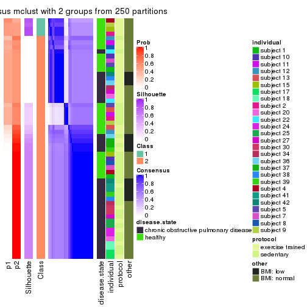</p>

</div>
<div id='tab-SD-mclust-consensus-heatmap-2'>
<pre><code class="r">consensus_heatmap(res, k = 3)
</code></pre>

<p>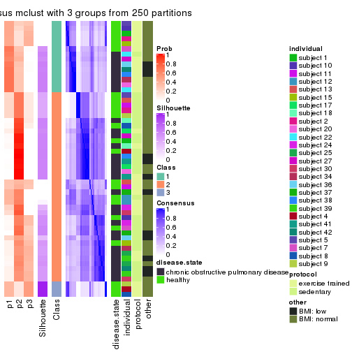</p>

</div>
<div id='tab-SD-mclust-consensus-heatmap-3'>
<pre><code class="r">consensus_heatmap(res, k = 4)
</code></pre>

<p>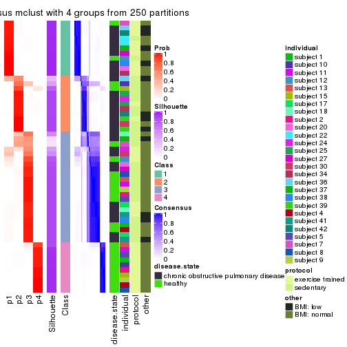</p>

</div>
<div id='tab-SD-mclust-consensus-heatmap-4'>
<pre><code class="r">consensus_heatmap(res, k = 5)
</code></pre>

<p>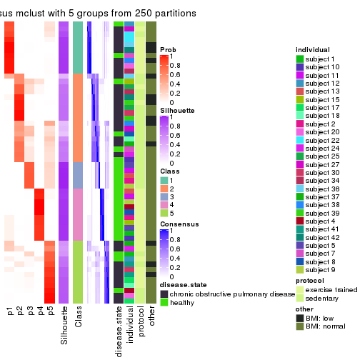</p>

</div>
<div id='tab-SD-mclust-consensus-heatmap-5'>
<pre><code class="r">consensus_heatmap(res, k = 6)
</code></pre>

<p>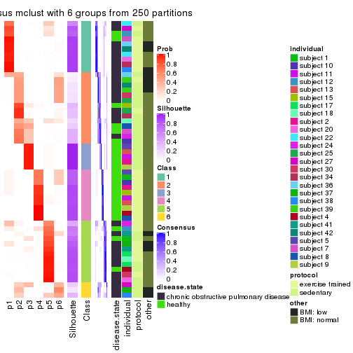</p>

</div>
</div>

Heatmaps for the membership of samples in all partitions to see how consistent they are:


<script>
$( function() {
	$( '#tabs-SD-mclust-membership-heatmap' ).tabs();
} );
</script>
<div id='tabs-SD-mclust-membership-heatmap'>
<ul>
<li><a href='#tab-SD-mclust-membership-heatmap-1'>k = 2</a></li>
<li><a href='#tab-SD-mclust-membership-heatmap-2'>k = 3</a></li>
<li><a href='#tab-SD-mclust-membership-heatmap-3'>k = 4</a></li>
<li><a href='#tab-SD-mclust-membership-heatmap-4'>k = 5</a></li>
<li><a href='#tab-SD-mclust-membership-heatmap-5'>k = 6</a></li>
</ul>
<div id='tab-SD-mclust-membership-heatmap-1'>
<pre><code class="r">membership_heatmap(res, k = 2)
</code></pre>

<p>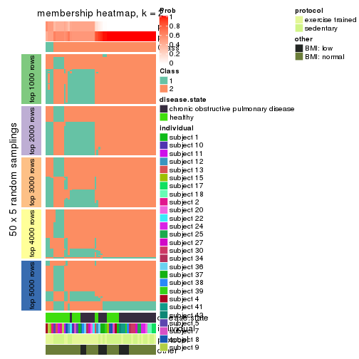</p>

</div>
<div id='tab-SD-mclust-membership-heatmap-2'>
<pre><code class="r">membership_heatmap(res, k = 3)
</code></pre>

<p>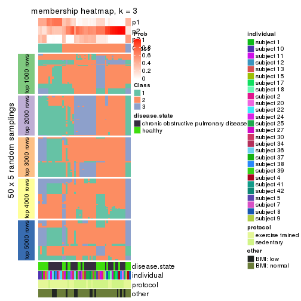</p>

</div>
<div id='tab-SD-mclust-membership-heatmap-3'>
<pre><code class="r">membership_heatmap(res, k = 4)
</code></pre>

<p>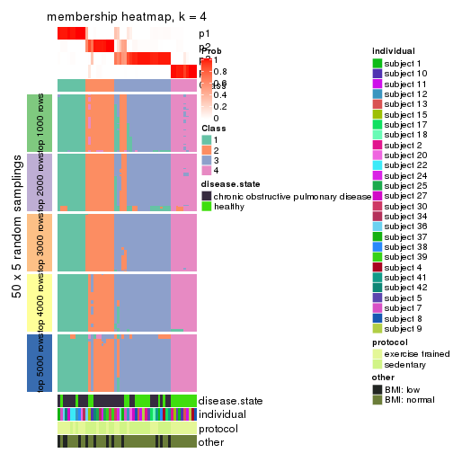</p>

</div>
<div id='tab-SD-mclust-membership-heatmap-4'>
<pre><code class="r">membership_heatmap(res, k = 5)
</code></pre>

<p>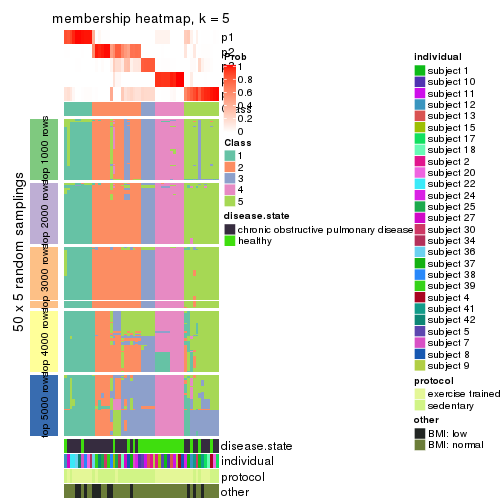</p>

</div>
<div id='tab-SD-mclust-membership-heatmap-5'>
<pre><code class="r">membership_heatmap(res, k = 6)
</code></pre>

<p>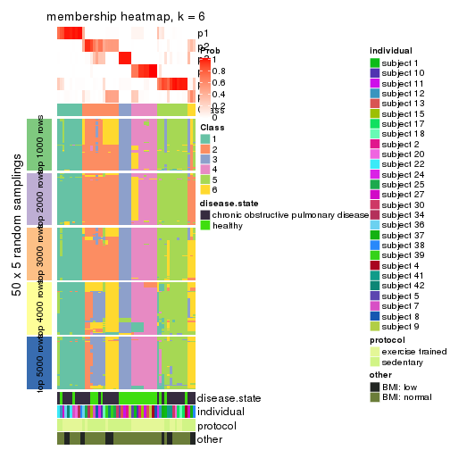</p>

</div>
</div>

As soon as we have had the classes for columns, we can look for signatures
which are significantly different between classes which can be candidate marks
for certain classes. Following are the heatmaps for signatures.


Signature heatmaps where rows are scaled:


<script>
$( function() {
	$( '#tabs-SD-mclust-get-signatures' ).tabs();
} );
</script>
<div id='tabs-SD-mclust-get-signatures'>
<ul>
<li><a href='#tab-SD-mclust-get-signatures-1'>k = 2</a></li>
<li><a href='#tab-SD-mclust-get-signatures-2'>k = 3</a></li>
<li><a href='#tab-SD-mclust-get-signatures-3'>k = 4</a></li>
<li><a href='#tab-SD-mclust-get-signatures-4'>k = 5</a></li>
<li><a href='#tab-SD-mclust-get-signatures-5'>k = 6</a></li>
</ul>
<div id='tab-SD-mclust-get-signatures-1'>
<pre><code class="r">get_signatures(res, k = 2)
</code></pre>

<p>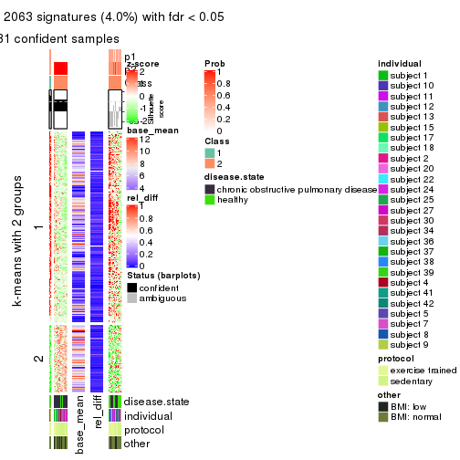</p>

</div>
<div id='tab-SD-mclust-get-signatures-2'>
<pre><code class="r">get_signatures(res, k = 3)
</code></pre>

<p>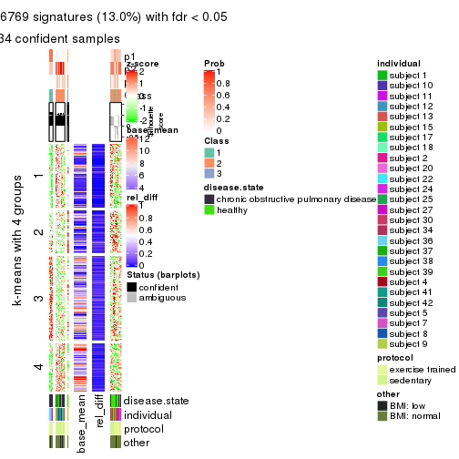</p>

</div>
<div id='tab-SD-mclust-get-signatures-3'>
<pre><code class="r">get_signatures(res, k = 4)
</code></pre>

<p>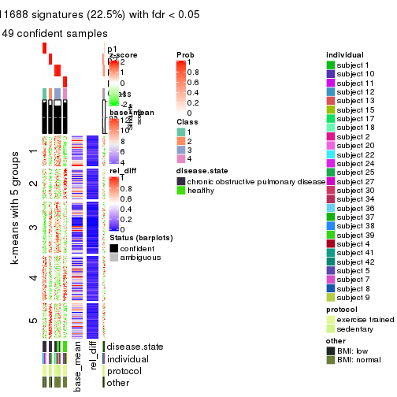</p>

</div>
<div id='tab-SD-mclust-get-signatures-4'>
<pre><code class="r">get_signatures(res, k = 5)
</code></pre>

<p>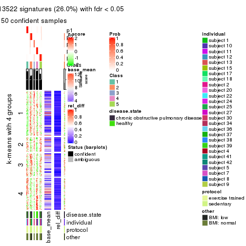</p>

</div>
<div id='tab-SD-mclust-get-signatures-5'>
<pre><code class="r">get_signatures(res, k = 6)
</code></pre>

<p>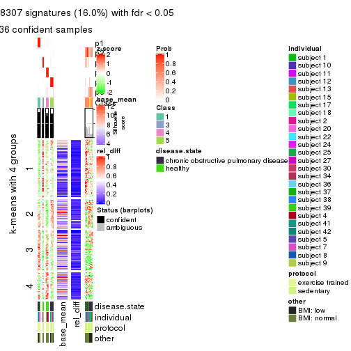</p>

</div>
</div>


Signature heatmaps where rows are not scaled:


<script>
$( function() {
	$( '#tabs-SD-mclust-get-signatures-no-scale' ).tabs();
} );
</script>
<div id='tabs-SD-mclust-get-signatures-no-scale'>
<ul>
<li><a href='#tab-SD-mclust-get-signatures-no-scale-1'>k = 2</a></li>
<li><a href='#tab-SD-mclust-get-signatures-no-scale-2'>k = 3</a></li>
<li><a href='#tab-SD-mclust-get-signatures-no-scale-3'>k = 4</a></li>
<li><a href='#tab-SD-mclust-get-signatures-no-scale-4'>k = 5</a></li>
<li><a href='#tab-SD-mclust-get-signatures-no-scale-5'>k = 6</a></li>
</ul>
<div id='tab-SD-mclust-get-signatures-no-scale-1'>
<pre><code class="r">get_signatures(res, k = 2, scale_rows = FALSE)
</code></pre>

<p>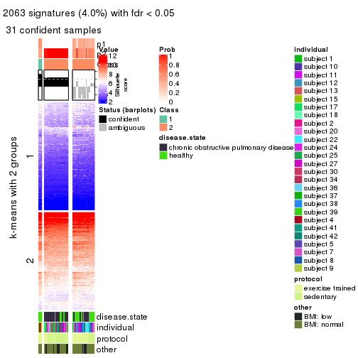</p>

</div>
<div id='tab-SD-mclust-get-signatures-no-scale-2'>
<pre><code class="r">get_signatures(res, k = 3, scale_rows = FALSE)
</code></pre>

<p>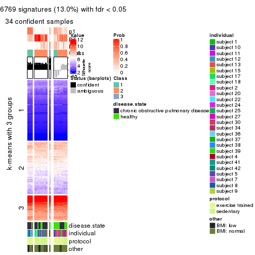</p>

</div>
<div id='tab-SD-mclust-get-signatures-no-scale-3'>
<pre><code class="r">get_signatures(res, k = 4, scale_rows = FALSE)
</code></pre>

<p>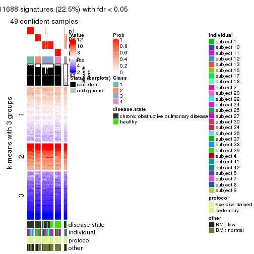</p>

</div>
<div id='tab-SD-mclust-get-signatures-no-scale-4'>
<pre><code class="r">get_signatures(res, k = 5, scale_rows = FALSE)
</code></pre>

<p>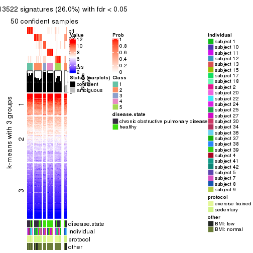</p>

</div>
<div id='tab-SD-mclust-get-signatures-no-scale-5'>
<pre><code class="r">get_signatures(res, k = 6, scale_rows = FALSE)
</code></pre>

<p>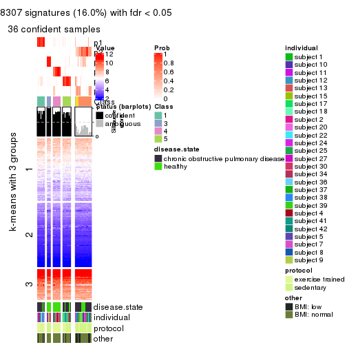</p>

</div>
</div>


Compare the overlap of signatures from different k:

```r
compare_signatures(res)
```

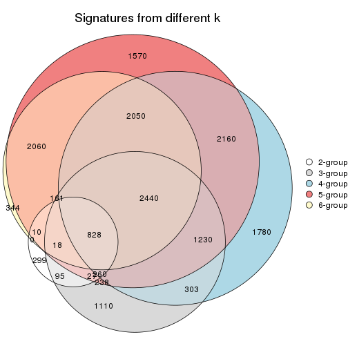

`get_signature()` returns a data frame invisibly. TO get the list of signatures, the function
call should be assigned to a variable explicitly. In following code, if `plot` argument is set
to `FALSE`, no heatmap is plotted while only the differential analysis is performed.

```r
# code only for demonstration
tb = get_signature(res, k = ..., plot = FALSE)
```

An example of the output of `tb` is:

```
#>   which_row         fdr    mean_1    mean_2 scaled_mean_1 scaled_mean_2 km
#> 1        38 0.042760348  8.373488  9.131774    -0.5533452     0.5164555  1
#> 2        40 0.018707592  7.106213  8.469186    -0.6173731     0.5762149  1
#> 3        55 0.019134737 10.221463 11.207825    -0.6159697     0.5749050  1
#> 4        59 0.006059896  5.921854  7.869574    -0.6899429     0.6439467  1
#> 5        60 0.018055526  8.928898 10.211722    -0.6204761     0.5791110  1
#> 6        98 0.009384629 15.714769 14.887706     0.6635654    -0.6193277  2
...
```

The columns in `tb` are:

1. `which_row`: row indices corresponding to the input matrix.
2. `fdr`: FDR for the differential test. 
3. `mean_x`: The mean value in group x.
4. `scaled_mean_x`: The mean value in group x after rows are scaled.
5. `km`: Row groups if k-means clustering is applied to rows.


UMAP plot which shows how samples are separated.


<script>
$( function() {
	$( '#tabs-SD-mclust-dimension-reduction' ).tabs();
} );
</script>
<div id='tabs-SD-mclust-dimension-reduction'>
<ul>
<li><a href='#tab-SD-mclust-dimension-reduction-1'>k = 2</a></li>
<li><a href='#tab-SD-mclust-dimension-reduction-2'>k = 3</a></li>
<li><a href='#tab-SD-mclust-dimension-reduction-3'>k = 4</a></li>
<li><a href='#tab-SD-mclust-dimension-reduction-4'>k = 5</a></li>
<li><a href='#tab-SD-mclust-dimension-reduction-5'>k = 6</a></li>
</ul>
<div id='tab-SD-mclust-dimension-reduction-1'>
<pre><code class="r">dimension_reduction(res, k = 2, method = &quot;UMAP&quot;)
</code></pre>

<p>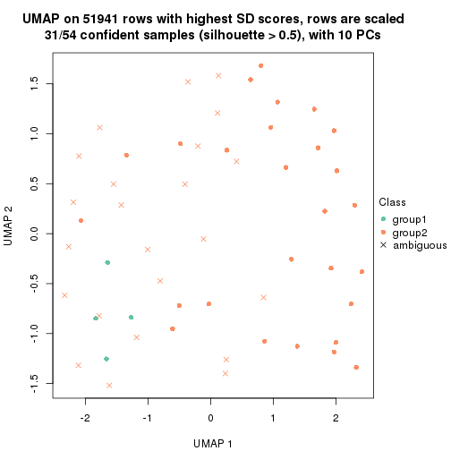</p>

</div>
<div id='tab-SD-mclust-dimension-reduction-2'>
<pre><code class="r">dimension_reduction(res, k = 3, method = &quot;UMAP&quot;)
</code></pre>

<p>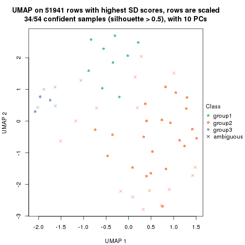</p>

</div>
<div id='tab-SD-mclust-dimension-reduction-3'>
<pre><code class="r">dimension_reduction(res, k = 4, method = &quot;UMAP&quot;)
</code></pre>

<p>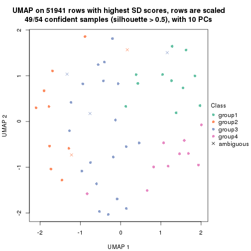</p>

</div>
<div id='tab-SD-mclust-dimension-reduction-4'>
<pre><code class="r">dimension_reduction(res, k = 5, method = &quot;UMAP&quot;)
</code></pre>

<p>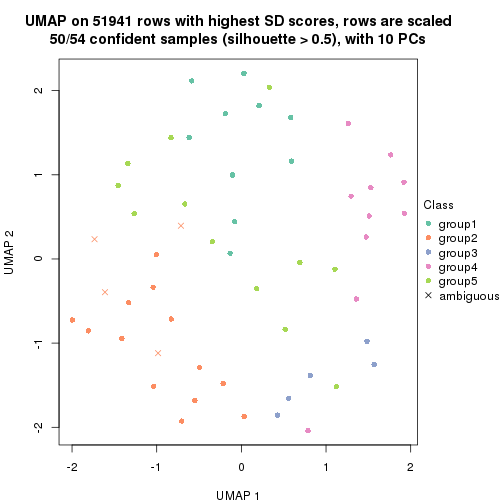</p>

</div>
<div id='tab-SD-mclust-dimension-reduction-5'>
<pre><code class="r">dimension_reduction(res, k = 6, method = &quot;UMAP&quot;)
</code></pre>

<p>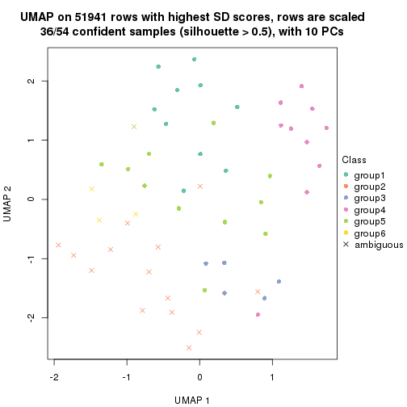</p>

</div>
</div>


Following heatmap shows how subgroups are split when increasing `k`:

```r
collect_classes(res)
```

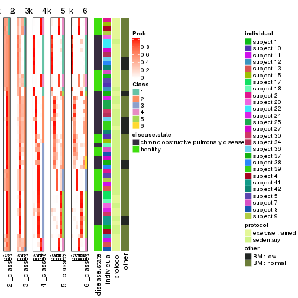


Test correlation between subgroups and known annotations. If the known
annotation is numeric, one-way ANOVA test is applied, and if the known
annotation is discrete, chi-squared contingency table test is applied.

```r
test_to_known_factors(res)
```

```
#>            n disease.state(p) individual(p) protocol(p) other(p) k
#> SD:mclust 31         1.13e-02         0.335    3.18e-02    0.515 2
#> SD:mclust 34         1.29e-02         0.479    1.92e-04    0.502 3
#> SD:mclust 49         2.01e-04         0.303    8.73e-05    0.141 4
#> SD:mclust 50         4.56e-05         0.426    5.02e-05    0.239 5
#> SD:mclust 36         1.22e-04         0.537    8.84e-04    0.160 6
```


If matrix rows can be associated to genes, consider to use `functional_enrichment(res,
...)` to perform function enrichment for the signature genes. See [this vignette](http://bioconductor.org/packages/devel/bioc/vignettes/cola/inst/doc/functional_enrichment.html) for more detailed explanations.


 

---------------------------------------------------


### SD:NMF*


The object with results only for a single top-value method and a single partition method 
can be extracted as:

```r
res = res_list["SD", "NMF"]
# you can also extract it by
# res = res_list["SD:NMF"]
```

A summary of `res` and all the functions that can be applied to it:

```r
res
```

```
#> A 'ConsensusPartition' object with k = 2, 3, 4, 5, 6.
#>   On a matrix with 51941 rows and 54 columns.
#>   Top rows (1000, 2000, 3000, 4000, 5000) are extracted by 'SD' method.
#>   Subgroups are detected by 'NMF' method.
#>   Performed in total 1250 partitions by row resampling.
#>   Best k for subgroups seems to be 2.
#> 
#> Following methods can be applied to this 'ConsensusPartition' object:
#>  [1] "cola_report"             "collect_classes"         "collect_plots"          
#>  [4] "collect_stats"           "colnames"                "compare_signatures"     
#>  [7] "consensus_heatmap"       "dimension_reduction"     "functional_enrichment"  
#> [10] "get_anno_col"            "get_anno"                "get_classes"            
#> [13] "get_consensus"           "get_matrix"              "get_membership"         
#> [16] "get_param"               "get_signatures"          "get_stats"              
#> [19] "is_best_k"               "is_stable_k"             "membership_heatmap"     
#> [22] "ncol"                    "nrow"                    "plot_ecdf"              
#> [25] "rownames"                "select_partition_number" "show"                   
#> [28] "suggest_best_k"          "test_to_known_factors"
```

`collect_plots()` function collects all the plots made from `res` for all `k` (number of partitions)
into one single page to provide an easy and fast comparison between different `k`.

```r
collect_plots(res)
```

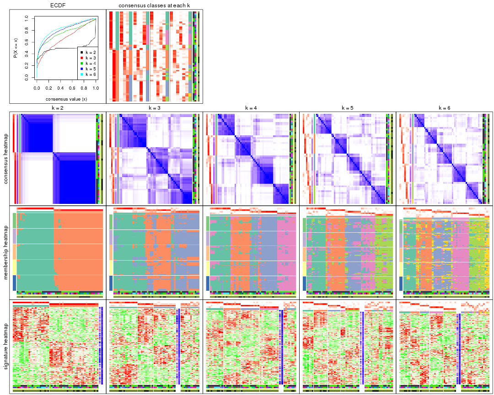

The plots are:

- The first row: a plot of the ECDF (empirical cumulative distribution
  function) curves of the consensus matrix for each `k` and the heatmap of
  predicted classes for each `k`.
- The second row: heatmaps of the consensus matrix for each `k`.
- The third row: heatmaps of the membership matrix for each `k`.
- The fouth row: heatmaps of the signatures for each `k`.

All the plots in panels can be made by individual functions and they are
plotted later in this section.

`select_partition_number()` produces several plots showing different
statistics for choosing "optimized" `k`. There are following statistics:

- ECDF curves of the consensus matrix for each `k`;
- 1-PAC. [The PAC
  score](https://en.wikipedia.org/wiki/Consensus_clustering#Over-interpretation_potential_of_consensus_clustering)
  measures the proportion of the ambiguous subgrouping.
- Mean silhouette score.
- Concordance. The mean probability of fiting the consensus class ids in all
  partitions.
- Area increased. Denote $A_k$ as the area under the ECDF curve for current
  `k`, the area increased is defined as $A_k - A_{k-1}$.
- Rand index. The percent of pairs of samples that are both in a same cluster
  or both are not in a same cluster in the partition of k and k-1.
- Jaccard index. The ratio of pairs of samples are both in a same cluster in
  the partition of k and k-1 and the pairs of samples are both in a same
  cluster in the partition k or k-1.

The detailed explanations of these statistics can be found in [the _cola_
vignette](http://bioconductor.org/packages/devel/bioc/vignettes/cola/inst/doc/cola.html#toc_13).

Generally speaking, lower PAC score, higher mean silhouette score or higher
concordance corresponds to better partition. Rand index and Jaccard index
measure how similar the current partition is compared to partition with `k-1`.
If they are too similar, we won't accept `k` is better than `k-1`.

```r
select_partition_number(res)
```

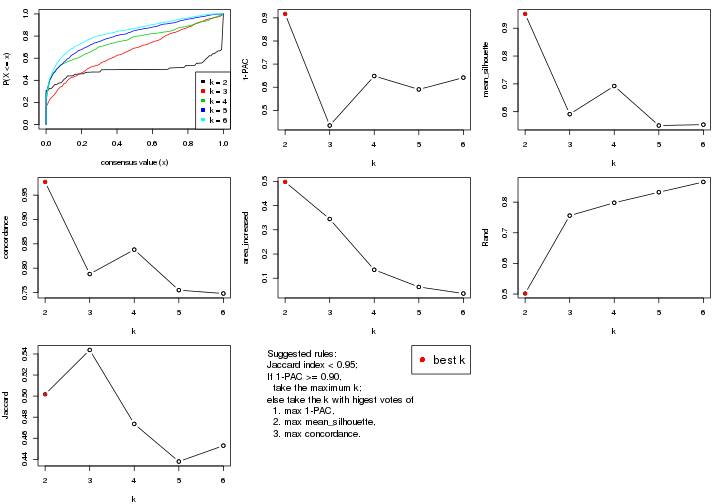

The numeric values for all these statistics can be obtained by `get_stats()`.

```r
get_stats(res)
```

```
#>   k 1-PAC mean_silhouette concordance area_increased  Rand Jaccard
#> 2 2 0.917           0.951       0.977         0.4973 0.502   0.502
#> 3 3 0.435           0.591       0.788         0.3444 0.756   0.544
#> 4 4 0.649           0.692       0.838         0.1349 0.798   0.474
#> 5 5 0.591           0.550       0.755         0.0640 0.832   0.438
#> 6 6 0.642           0.553       0.748         0.0369 0.866   0.453
```

`suggest_best_k()` suggests the best $k$ based on these statistics. The rules are as follows:

- All $k$ with Jaccard index larger than 0.95 are removed because increasing
  $k$ does not provide enough extra information. If all $k$ are removed, it is
  marked as no subgroup is detected.
- For all $k$ with 1-PAC score larger than 0.9, the maximal $k$ is taken as
  the best $k$, and other $k$ are marked as optional $k$.
- If it does not fit the second rule. The $k$ with the maximal vote of the
  highest 1-PAC score, highest mean silhouette, and highest concordance is
  taken as the best $k$.

```r
suggest_best_k(res)
```

```
#> [1] 2
```


Following shows the table of the partitions (You need to click the **show/hide
code output** link to see it). The membership matrix (columns with name `p*`)
is inferred by
[`clue::cl_consensus()`](https://www.rdocumentation.org/link/cl_consensus?package=clue)
function with the `SE` method. Basically the value in the membership matrix
represents the probability to belong to a certain group. The finall class
label for an item is determined with the group with highest probability it
belongs to.

In `get_classes()` function, the entropy is calculated from the membership
matrix and the silhouette score is calculated from the consensus matrix.


<script>
$( function() {
	$( '#tabs-SD-NMF-get-classes' ).tabs();
} );
</script>
<div id='tabs-SD-NMF-get-classes'>
<ul>
<li><a href='#tab-SD-NMF-get-classes-1'>k = 2</a></li>
<li><a href='#tab-SD-NMF-get-classes-2'>k = 3</a></li>
<li><a href='#tab-SD-NMF-get-classes-3'>k = 4</a></li>
<li><a href='#tab-SD-NMF-get-classes-4'>k = 5</a></li>
<li><a href='#tab-SD-NMF-get-classes-5'>k = 6</a></li>
</ul>

<div id='tab-SD-NMF-get-classes-1'>
<p><a id='tab-SD-NMF-get-classes-1-a' style='color:#0366d6' href='#'>show/hide code output</a></p>
<pre><code class="r">cbind(get_classes(res, k = 2), get_membership(res, k = 2))
</code></pre>

<pre><code>#&gt;           class entropy silhouette    p1    p2
#&gt; GSM680053     2  0.0000      0.978 0.000 1.000
#&gt; GSM680062     1  0.8955      0.557 0.688 0.312
#&gt; GSM680054     2  0.0000      0.978 0.000 1.000
#&gt; GSM680063     2  0.7528      0.728 0.216 0.784
#&gt; GSM680055     2  0.0000      0.978 0.000 1.000
#&gt; GSM680064     1  0.0000      0.971 1.000 0.000
#&gt; GSM680056     1  0.2236      0.948 0.964 0.036
#&gt; GSM680065     1  0.0000      0.971 1.000 0.000
#&gt; GSM680057     2  0.0000      0.978 0.000 1.000
#&gt; GSM680066     2  0.3431      0.925 0.064 0.936
#&gt; GSM680058     2  0.0000      0.978 0.000 1.000
#&gt; GSM680067     2  0.6343      0.814 0.160 0.840
#&gt; GSM680059     2  0.0000      0.978 0.000 1.000
#&gt; GSM680068     1  0.0000      0.971 1.000 0.000
#&gt; GSM680060     2  0.0000      0.978 0.000 1.000
#&gt; GSM680069     2  0.4939      0.879 0.108 0.892
#&gt; GSM680061     2  0.0000      0.978 0.000 1.000
#&gt; GSM680070     1  0.0000      0.971 1.000 0.000
#&gt; GSM680071     1  0.2603      0.942 0.956 0.044
#&gt; GSM680077     1  0.0000      0.971 1.000 0.000
#&gt; GSM680072     2  0.0000      0.978 0.000 1.000
#&gt; GSM680078     2  0.4161      0.905 0.084 0.916
#&gt; GSM680073     2  0.0000      0.978 0.000 1.000
#&gt; GSM680079     1  0.0000      0.971 1.000 0.000
#&gt; GSM680074     2  0.0000      0.978 0.000 1.000
#&gt; GSM680080     2  0.0000      0.978 0.000 1.000
#&gt; GSM680075     2  0.0000      0.978 0.000 1.000
#&gt; GSM680081     2  0.0000      0.978 0.000 1.000
#&gt; GSM680076     2  0.0000      0.978 0.000 1.000
#&gt; GSM680082     1  0.0000      0.971 1.000 0.000
#&gt; GSM680029     2  0.0000      0.978 0.000 1.000
#&gt; GSM680041     1  0.0000      0.971 1.000 0.000
#&gt; GSM680035     2  0.0000      0.978 0.000 1.000
#&gt; GSM680047     1  0.0000      0.971 1.000 0.000
#&gt; GSM680036     2  0.0000      0.978 0.000 1.000
#&gt; GSM680048     1  0.0000      0.971 1.000 0.000
#&gt; GSM680037     2  0.0000      0.978 0.000 1.000
#&gt; GSM680049     1  0.0000      0.971 1.000 0.000
#&gt; GSM680038     2  0.0000      0.978 0.000 1.000
#&gt; GSM680050     1  0.0000      0.971 1.000 0.000
#&gt; GSM680039     2  0.0000      0.978 0.000 1.000
#&gt; GSM680051     1  0.0000      0.971 1.000 0.000
#&gt; GSM680040     2  0.0000      0.978 0.000 1.000
#&gt; GSM680052     1  0.0000      0.971 1.000 0.000
#&gt; GSM680030     2  0.0000      0.978 0.000 1.000
#&gt; GSM680042     1  0.0000      0.971 1.000 0.000
#&gt; GSM680031     2  0.0000      0.978 0.000 1.000
#&gt; GSM680043     1  0.0000      0.971 1.000 0.000
#&gt; GSM680032     1  0.4431      0.894 0.908 0.092
#&gt; GSM680044     1  0.0938      0.964 0.988 0.012
#&gt; GSM680033     2  0.0000      0.978 0.000 1.000
#&gt; GSM680045     1  0.5059      0.873 0.888 0.112
#&gt; GSM680034     2  0.0000      0.978 0.000 1.000
#&gt; GSM680046     1  0.0000      0.971 1.000 0.000
</code></pre>

<script>
$('#tab-SD-NMF-get-classes-1-a').parent().next().next().hide();
$('#tab-SD-NMF-get-classes-1-a').click(function(){
  $('#tab-SD-NMF-get-classes-1-a').parent().next().next().toggle();
  return(false);
});
</script>
</div>

<div id='tab-SD-NMF-get-classes-2'>
<p><a id='tab-SD-NMF-get-classes-2-a' style='color:#0366d6' href='#'>show/hide code output</a></p>
<pre><code class="r">cbind(get_classes(res, k = 3), get_membership(res, k = 3))
</code></pre>

<pre><code>#&gt;           class entropy silhouette    p1    p2    p3
#&gt; GSM680053     3  0.3941    0.62175 0.000 0.156 0.844
#&gt; GSM680062     3  0.5726    0.57927 0.216 0.024 0.760
#&gt; GSM680054     2  0.6062    0.16951 0.000 0.616 0.384
#&gt; GSM680063     3  0.5944    0.64416 0.120 0.088 0.792
#&gt; GSM680055     3  0.3551    0.56827 0.000 0.132 0.868
#&gt; GSM680064     1  0.2878    0.81574 0.904 0.000 0.096
#&gt; GSM680056     3  0.8675   -0.13490 0.388 0.108 0.504
#&gt; GSM680065     1  0.6195    0.71102 0.704 0.020 0.276
#&gt; GSM680057     2  0.3551    0.64032 0.000 0.868 0.132
#&gt; GSM680066     3  0.8454    0.13203 0.088 0.432 0.480
#&gt; GSM680058     2  0.1753    0.67138 0.000 0.952 0.048
#&gt; GSM680067     2  0.5538    0.62141 0.116 0.812 0.072
#&gt; GSM680059     3  0.6079    0.45792 0.000 0.388 0.612
#&gt; GSM680068     1  0.2625    0.81853 0.916 0.000 0.084
#&gt; GSM680060     2  0.2959    0.64332 0.000 0.900 0.100
#&gt; GSM680069     3  0.7851    0.24622 0.100 0.256 0.644
#&gt; GSM680061     2  0.2796    0.66662 0.000 0.908 0.092
#&gt; GSM680070     1  0.3941    0.79789 0.844 0.000 0.156
#&gt; GSM680071     2  0.9178    0.23871 0.240 0.540 0.220
#&gt; GSM680077     1  0.8799    0.58390 0.584 0.196 0.220
#&gt; GSM680072     2  0.5058    0.49638 0.000 0.756 0.244
#&gt; GSM680078     3  0.4056    0.56576 0.032 0.092 0.876
#&gt; GSM680073     2  0.6215    0.00216 0.000 0.572 0.428
#&gt; GSM680079     1  0.4834    0.77242 0.792 0.004 0.204
#&gt; GSM680074     2  0.0424    0.68362 0.000 0.992 0.008
#&gt; GSM680080     2  0.0424    0.68353 0.000 0.992 0.008
#&gt; GSM680075     3  0.4555    0.55186 0.000 0.200 0.800
#&gt; GSM680081     3  0.4702    0.67012 0.000 0.212 0.788
#&gt; GSM680076     2  0.4291    0.57733 0.000 0.820 0.180
#&gt; GSM680082     1  0.7344    0.70893 0.696 0.100 0.204
#&gt; GSM680029     3  0.4887    0.66686 0.000 0.228 0.772
#&gt; GSM680041     1  0.0000    0.82470 1.000 0.000 0.000
#&gt; GSM680035     3  0.4796    0.66671 0.000 0.220 0.780
#&gt; GSM680047     1  0.0592    0.82372 0.988 0.000 0.012
#&gt; GSM680036     3  0.4974    0.62372 0.000 0.236 0.764
#&gt; GSM680048     1  0.0592    0.82372 0.988 0.000 0.012
#&gt; GSM680037     3  0.4750    0.66882 0.000 0.216 0.784
#&gt; GSM680049     1  0.0000    0.82470 1.000 0.000 0.000
#&gt; GSM680038     2  0.5016    0.53178 0.000 0.760 0.240
#&gt; GSM680050     1  0.4121    0.79309 0.832 0.000 0.168
#&gt; GSM680039     2  0.6204    0.08896 0.000 0.576 0.424
#&gt; GSM680051     1  0.2400    0.80596 0.932 0.004 0.064
#&gt; GSM680040     3  0.4796    0.66671 0.000 0.220 0.780
#&gt; GSM680052     1  0.2066    0.80851 0.940 0.000 0.060
#&gt; GSM680030     2  0.2711    0.66917 0.000 0.912 0.088
#&gt; GSM680042     1  0.0000    0.82470 1.000 0.000 0.000
#&gt; GSM680031     3  0.4750    0.66882 0.000 0.216 0.784
#&gt; GSM680043     1  0.6448    0.40808 0.636 0.012 0.352
#&gt; GSM680032     1  0.7576    0.65962 0.648 0.076 0.276
#&gt; GSM680044     1  0.3192    0.77355 0.888 0.000 0.112
#&gt; GSM680033     3  0.4842    0.66369 0.000 0.224 0.776
#&gt; GSM680045     1  0.7534    0.15423 0.532 0.040 0.428
#&gt; GSM680034     2  0.6229    0.45193 0.020 0.700 0.280
#&gt; GSM680046     1  0.1163    0.82018 0.972 0.000 0.028
</code></pre>

<script>
$('#tab-SD-NMF-get-classes-2-a').parent().next().next().hide();
$('#tab-SD-NMF-get-classes-2-a').click(function(){
  $('#tab-SD-NMF-get-classes-2-a').parent().next().next().toggle();
  return(false);
});
</script>
</div>

<div id='tab-SD-NMF-get-classes-3'>
<p><a id='tab-SD-NMF-get-classes-3-a' style='color:#0366d6' href='#'>show/hide code output</a></p>
<pre><code class="r">cbind(get_classes(res, k = 4), get_membership(res, k = 4))
</code></pre>

<pre><code>#&gt;           class entropy silhouette    p1    p2    p3    p4
#&gt; GSM680053     3  0.4252     0.6182 0.252 0.004 0.744 0.000
#&gt; GSM680062     3  0.1936     0.7716 0.032 0.000 0.940 0.028
#&gt; GSM680054     3  0.7618     0.3529 0.284 0.244 0.472 0.000
#&gt; GSM680063     3  0.2142     0.7665 0.056 0.000 0.928 0.016
#&gt; GSM680055     1  0.4401     0.4769 0.724 0.004 0.272 0.000
#&gt; GSM680064     1  0.4933     0.3523 0.568 0.000 0.000 0.432
#&gt; GSM680056     1  0.1209     0.7732 0.964 0.000 0.032 0.004
#&gt; GSM680065     1  0.1356     0.7877 0.960 0.000 0.008 0.032
#&gt; GSM680057     2  0.1297     0.8419 0.000 0.964 0.020 0.016
#&gt; GSM680066     3  0.9022     0.0802 0.060 0.300 0.372 0.268
#&gt; GSM680058     2  0.1970     0.8389 0.060 0.932 0.008 0.000
#&gt; GSM680067     2  0.2654     0.7919 0.000 0.888 0.004 0.108
#&gt; GSM680059     3  0.2048     0.7638 0.008 0.064 0.928 0.000
#&gt; GSM680068     4  0.3560     0.7974 0.140 0.004 0.012 0.844
#&gt; GSM680060     2  0.1022     0.8458 0.032 0.968 0.000 0.000
#&gt; GSM680069     1  0.1890     0.7542 0.936 0.008 0.056 0.000
#&gt; GSM680061     2  0.1398     0.8347 0.000 0.956 0.004 0.040
#&gt; GSM680070     1  0.4761     0.5541 0.664 0.004 0.000 0.332
#&gt; GSM680071     1  0.2999     0.6993 0.864 0.132 0.000 0.004
#&gt; GSM680077     1  0.1510     0.7845 0.956 0.016 0.000 0.028
#&gt; GSM680072     2  0.5879     0.5994 0.248 0.672 0.080 0.000
#&gt; GSM680078     1  0.3982     0.5779 0.776 0.000 0.220 0.004
#&gt; GSM680073     3  0.7645     0.3390 0.264 0.268 0.468 0.000
#&gt; GSM680079     1  0.3610     0.7209 0.800 0.000 0.000 0.200
#&gt; GSM680074     2  0.0804     0.8464 0.012 0.980 0.008 0.000
#&gt; GSM680080     2  0.1767     0.8448 0.044 0.944 0.012 0.000
#&gt; GSM680075     3  0.5512     0.1597 0.488 0.016 0.496 0.000
#&gt; GSM680081     3  0.0376     0.7841 0.000 0.004 0.992 0.004
#&gt; GSM680076     2  0.3311     0.7587 0.172 0.828 0.000 0.000
#&gt; GSM680082     1  0.3351     0.7559 0.844 0.008 0.000 0.148
#&gt; GSM680029     3  0.0336     0.7823 0.008 0.000 0.992 0.000
#&gt; GSM680041     4  0.2868     0.8036 0.136 0.000 0.000 0.864
#&gt; GSM680035     3  0.0524     0.7843 0.000 0.004 0.988 0.008
#&gt; GSM680047     4  0.1411     0.8715 0.020 0.000 0.020 0.960
#&gt; GSM680036     3  0.4372     0.6075 0.268 0.004 0.728 0.000
#&gt; GSM680048     4  0.0672     0.8701 0.008 0.000 0.008 0.984
#&gt; GSM680037     3  0.0524     0.7843 0.000 0.004 0.988 0.008
#&gt; GSM680049     4  0.1824     0.8516 0.060 0.004 0.000 0.936
#&gt; GSM680038     2  0.5120     0.6628 0.044 0.752 0.196 0.008
#&gt; GSM680050     1  0.4277     0.6344 0.720 0.000 0.000 0.280
#&gt; GSM680039     3  0.6976     0.2994 0.000 0.320 0.544 0.136
#&gt; GSM680051     4  0.1575     0.8638 0.004 0.012 0.028 0.956
#&gt; GSM680040     3  0.0804     0.7839 0.000 0.012 0.980 0.008
#&gt; GSM680052     4  0.0921     0.8677 0.000 0.000 0.028 0.972
#&gt; GSM680030     2  0.1377     0.8451 0.008 0.964 0.020 0.008
#&gt; GSM680042     4  0.3074     0.7803 0.152 0.000 0.000 0.848
#&gt; GSM680031     3  0.0804     0.7834 0.000 0.008 0.980 0.012
#&gt; GSM680043     4  0.3870     0.7176 0.000 0.004 0.208 0.788
#&gt; GSM680032     1  0.1978     0.7877 0.928 0.004 0.000 0.068
#&gt; GSM680044     4  0.3828     0.8343 0.068 0.000 0.084 0.848
#&gt; GSM680033     3  0.0804     0.7839 0.000 0.012 0.980 0.008
#&gt; GSM680045     4  0.4594     0.6075 0.000 0.008 0.280 0.712
#&gt; GSM680034     2  0.5938     0.0316 0.000 0.488 0.036 0.476
#&gt; GSM680046     4  0.0524     0.8691 0.004 0.000 0.008 0.988
</code></pre>

<script>
$('#tab-SD-NMF-get-classes-3-a').parent().next().next().hide();
$('#tab-SD-NMF-get-classes-3-a').click(function(){
  $('#tab-SD-NMF-get-classes-3-a').parent().next().next().toggle();
  return(false);
});
</script>
</div>

<div id='tab-SD-NMF-get-classes-4'>
<p><a id='tab-SD-NMF-get-classes-4-a' style='color:#0366d6' href='#'>show/hide code output</a></p>
<pre><code class="r">cbind(get_classes(res, k = 5), get_membership(res, k = 5))
</code></pre>

<pre><code>#&gt;           class entropy silhouette    p1    p2    p3    p4    p5
#&gt; GSM680053     5  0.3262     0.7329 0.000 0.000 0.124 0.036 0.840
#&gt; GSM680062     5  0.5649     0.4929 0.000 0.000 0.108 0.296 0.596
#&gt; GSM680054     5  0.3649     0.7547 0.000 0.064 0.032 0.056 0.848
#&gt; GSM680063     5  0.5592     0.5879 0.000 0.000 0.144 0.220 0.636
#&gt; GSM680055     5  0.2586     0.7555 0.012 0.000 0.084 0.012 0.892
#&gt; GSM680064     1  0.4088     0.4980 0.776 0.000 0.000 0.168 0.056
#&gt; GSM680056     5  0.1857     0.7499 0.060 0.000 0.004 0.008 0.928
#&gt; GSM680065     5  0.4594     0.4989 0.284 0.000 0.000 0.036 0.680
#&gt; GSM680057     2  0.1732     0.7632 0.000 0.920 0.000 0.080 0.000
#&gt; GSM680066     1  0.5158     0.4670 0.632 0.008 0.316 0.044 0.000
#&gt; GSM680058     2  0.2648     0.7113 0.000 0.848 0.000 0.000 0.152
#&gt; GSM680067     2  0.2020     0.7534 0.000 0.900 0.000 0.100 0.000
#&gt; GSM680059     3  0.0775     0.6831 0.004 0.008 0.980 0.004 0.004
#&gt; GSM680068     1  0.3130     0.6516 0.856 0.000 0.096 0.048 0.000
#&gt; GSM680060     2  0.1671     0.7576 0.000 0.924 0.000 0.000 0.076
#&gt; GSM680069     5  0.3188     0.7319 0.100 0.000 0.012 0.028 0.860
#&gt; GSM680061     2  0.1478     0.7663 0.000 0.936 0.000 0.064 0.000
#&gt; GSM680070     1  0.0865     0.6840 0.972 0.000 0.024 0.004 0.000
#&gt; GSM680071     5  0.4945     0.6707 0.056 0.148 0.000 0.044 0.752
#&gt; GSM680077     1  0.3384     0.6586 0.864 0.012 0.012 0.032 0.080
#&gt; GSM680072     2  0.4900     0.2542 0.004 0.564 0.000 0.020 0.412
#&gt; GSM680078     1  0.6529     0.2687 0.468 0.000 0.408 0.032 0.092
#&gt; GSM680073     3  0.7912    -0.0280 0.016 0.280 0.356 0.036 0.312
#&gt; GSM680079     1  0.0510     0.6856 0.984 0.000 0.016 0.000 0.000
#&gt; GSM680074     2  0.0609     0.7685 0.000 0.980 0.000 0.000 0.020
#&gt; GSM680080     2  0.0794     0.7683 0.000 0.972 0.000 0.000 0.028
#&gt; GSM680075     3  0.6005     0.3154 0.060 0.016 0.652 0.032 0.240
#&gt; GSM680081     3  0.1885     0.6895 0.020 0.000 0.932 0.044 0.004
#&gt; GSM680076     2  0.3769     0.7075 0.100 0.828 0.004 0.004 0.064
#&gt; GSM680082     1  0.1603     0.6828 0.948 0.012 0.004 0.004 0.032
#&gt; GSM680029     3  0.1251     0.6916 0.000 0.000 0.956 0.008 0.036
#&gt; GSM680041     4  0.5748     0.3998 0.116 0.000 0.000 0.584 0.300
#&gt; GSM680035     3  0.5026     0.6423 0.000 0.000 0.656 0.280 0.064
#&gt; GSM680047     4  0.4132     0.4653 0.020 0.000 0.000 0.720 0.260
#&gt; GSM680036     5  0.3090     0.7454 0.000 0.000 0.104 0.040 0.856
#&gt; GSM680048     4  0.4297     0.6077 0.164 0.000 0.000 0.764 0.072
#&gt; GSM680037     3  0.4536     0.6800 0.000 0.000 0.712 0.240 0.048
#&gt; GSM680049     1  0.5283    -0.1811 0.508 0.000 0.000 0.444 0.048
#&gt; GSM680038     5  0.5430     0.5982 0.000 0.192 0.000 0.148 0.660
#&gt; GSM680050     1  0.0898     0.6791 0.972 0.000 0.000 0.008 0.020
#&gt; GSM680039     2  0.6725    -0.0125 0.000 0.400 0.256 0.344 0.000
#&gt; GSM680051     4  0.1618     0.6214 0.008 0.000 0.008 0.944 0.040
#&gt; GSM680040     3  0.4248     0.6873 0.000 0.000 0.728 0.240 0.032
#&gt; GSM680052     4  0.2850     0.6290 0.092 0.000 0.036 0.872 0.000
#&gt; GSM680030     2  0.3806     0.6901 0.000 0.804 0.004 0.040 0.152
#&gt; GSM680042     4  0.5752     0.2207 0.412 0.000 0.000 0.500 0.088
#&gt; GSM680031     3  0.3109     0.6893 0.000 0.000 0.800 0.200 0.000
#&gt; GSM680043     4  0.6036     0.3085 0.144 0.000 0.308 0.548 0.000
#&gt; GSM680032     1  0.4408     0.5589 0.752 0.008 0.004 0.032 0.204
#&gt; GSM680044     1  0.6803    -0.2277 0.412 0.004 0.172 0.404 0.008
#&gt; GSM680033     3  0.4250     0.6811 0.000 0.000 0.720 0.252 0.028
#&gt; GSM680045     4  0.5455     0.3615 0.036 0.040 0.268 0.656 0.000
#&gt; GSM680034     2  0.4655     0.2161 0.000 0.512 0.012 0.476 0.000
#&gt; GSM680046     4  0.4108     0.4747 0.308 0.000 0.008 0.684 0.000
</code></pre>

<script>
$('#tab-SD-NMF-get-classes-4-a').parent().next().next().hide();
$('#tab-SD-NMF-get-classes-4-a').click(function(){
  $('#tab-SD-NMF-get-classes-4-a').parent().next().next().toggle();
  return(false);
});
</script>
</div>

<div id='tab-SD-NMF-get-classes-5'>
<p><a id='tab-SD-NMF-get-classes-5-a' style='color:#0366d6' href='#'>show/hide code output</a></p>
<pre><code class="r">cbind(get_classes(res, k = 6), get_membership(res, k = 6))
</code></pre>

<pre><code>#&gt;           class entropy silhouette    p1    p2    p3    p4    p5    p6
#&gt; GSM680053     5  0.3898     0.6132 0.004 0.000 0.048 0.004 0.768 0.176
#&gt; GSM680062     4  0.7068    -0.0103 0.008 0.000 0.056 0.400 0.308 0.228
#&gt; GSM680054     5  0.2856     0.6935 0.004 0.032 0.036 0.004 0.884 0.040
#&gt; GSM680063     5  0.6716     0.1829 0.000 0.000 0.072 0.164 0.464 0.300
#&gt; GSM680055     5  0.3482     0.6887 0.032 0.004 0.024 0.004 0.836 0.100
#&gt; GSM680064     4  0.3281     0.6694 0.200 0.000 0.000 0.784 0.012 0.004
#&gt; GSM680056     5  0.3248     0.6946 0.144 0.000 0.008 0.008 0.824 0.016
#&gt; GSM680065     5  0.4416     0.4485 0.372 0.000 0.000 0.008 0.600 0.020
#&gt; GSM680057     3  0.5110     0.3362 0.004 0.324 0.600 0.000 0.012 0.060
#&gt; GSM680066     1  0.5855     0.3905 0.576 0.012 0.288 0.024 0.000 0.100
#&gt; GSM680058     2  0.2679     0.6600 0.000 0.864 0.000 0.000 0.096 0.040
#&gt; GSM680067     2  0.4287     0.5425 0.008 0.748 0.188 0.008 0.004 0.044
#&gt; GSM680059     6  0.4707     0.4584 0.004 0.040 0.308 0.004 0.004 0.640
#&gt; GSM680068     1  0.6171     0.5121 0.600 0.000 0.164 0.132 0.000 0.104
#&gt; GSM680060     2  0.3352     0.6428 0.032 0.836 0.004 0.000 0.108 0.020
#&gt; GSM680069     5  0.3627     0.6735 0.224 0.000 0.000 0.004 0.752 0.020
#&gt; GSM680061     2  0.4333     0.4808 0.008 0.708 0.240 0.004 0.000 0.040
#&gt; GSM680070     1  0.2173     0.7451 0.904 0.000 0.000 0.064 0.004 0.028
#&gt; GSM680071     5  0.4848     0.5725 0.300 0.032 0.000 0.004 0.640 0.024
#&gt; GSM680077     1  0.2077     0.7161 0.920 0.008 0.000 0.008 0.040 0.024
#&gt; GSM680072     2  0.5386     0.4231 0.004 0.604 0.000 0.000 0.204 0.188
#&gt; GSM680078     6  0.6177     0.4488 0.224 0.036 0.040 0.012 0.064 0.624
#&gt; GSM680073     2  0.6165     0.0260 0.004 0.428 0.020 0.000 0.140 0.408
#&gt; GSM680079     1  0.3253     0.7282 0.832 0.000 0.000 0.096 0.004 0.068
#&gt; GSM680074     2  0.1168     0.6700 0.000 0.956 0.000 0.000 0.016 0.028
#&gt; GSM680080     2  0.1408     0.6696 0.000 0.944 0.000 0.000 0.020 0.036
#&gt; GSM680075     6  0.4978     0.6228 0.024 0.036 0.092 0.000 0.108 0.740
#&gt; GSM680081     3  0.4470     0.5260 0.076 0.000 0.752 0.004 0.024 0.144
#&gt; GSM680076     2  0.3754     0.6115 0.076 0.812 0.004 0.000 0.016 0.092
#&gt; GSM680082     1  0.3129     0.7108 0.868 0.048 0.000 0.040 0.012 0.032
#&gt; GSM680029     3  0.4472    -0.0676 0.000 0.000 0.496 0.000 0.028 0.476
#&gt; GSM680041     4  0.1542     0.7928 0.000 0.000 0.008 0.936 0.052 0.004
#&gt; GSM680035     3  0.3566     0.5772 0.000 0.000 0.812 0.008 0.076 0.104
#&gt; GSM680047     4  0.2479     0.7746 0.000 0.000 0.028 0.892 0.064 0.016
#&gt; GSM680036     5  0.3242     0.6580 0.000 0.004 0.032 0.000 0.816 0.148
#&gt; GSM680048     4  0.0551     0.8004 0.004 0.000 0.004 0.984 0.008 0.000
#&gt; GSM680037     3  0.3946     0.4987 0.000 0.000 0.748 0.012 0.032 0.208
#&gt; GSM680049     4  0.1686     0.7914 0.064 0.000 0.012 0.924 0.000 0.000
#&gt; GSM680038     5  0.4408     0.6405 0.004 0.048 0.056 0.024 0.796 0.072
#&gt; GSM680050     1  0.2925     0.7205 0.856 0.000 0.000 0.104 0.024 0.016
#&gt; GSM680039     3  0.4007     0.5352 0.000 0.176 0.764 0.008 0.004 0.048
#&gt; GSM680051     3  0.5034     0.3067 0.000 0.000 0.580 0.356 0.024 0.040
#&gt; GSM680040     3  0.3159     0.5704 0.000 0.000 0.820 0.008 0.020 0.152
#&gt; GSM680052     4  0.1845     0.7894 0.008 0.000 0.072 0.916 0.000 0.004
#&gt; GSM680030     2  0.7895     0.1604 0.028 0.360 0.272 0.008 0.248 0.084
#&gt; GSM680042     4  0.1340     0.7986 0.040 0.000 0.000 0.948 0.008 0.004
#&gt; GSM680031     3  0.3686     0.5251 0.004 0.000 0.772 0.012 0.016 0.196
#&gt; GSM680043     3  0.5271     0.4048 0.024 0.008 0.648 0.248 0.000 0.072
#&gt; GSM680032     1  0.6109     0.5534 0.676 0.120 0.012 0.044 0.068 0.080
#&gt; GSM680044     4  0.4703     0.7098 0.080 0.048 0.028 0.776 0.004 0.064
#&gt; GSM680033     3  0.2476     0.5872 0.000 0.000 0.880 0.004 0.024 0.092
#&gt; GSM680045     4  0.4364     0.4091 0.004 0.000 0.364 0.608 0.000 0.024
#&gt; GSM680034     3  0.5480     0.4255 0.004 0.260 0.636 0.044 0.008 0.048
#&gt; GSM680046     4  0.2848     0.7684 0.036 0.000 0.104 0.856 0.000 0.004
</code></pre>

<script>
$('#tab-SD-NMF-get-classes-5-a').parent().next().next().hide();
$('#tab-SD-NMF-get-classes-5-a').click(function(){
  $('#tab-SD-NMF-get-classes-5-a').parent().next().next().toggle();
  return(false);
});
</script>
</div>
</div>

Heatmaps for the consensus matrix. It visualizes the probability of two
samples to be in a same group.


<script>
$( function() {
	$( '#tabs-SD-NMF-consensus-heatmap' ).tabs();
} );
</script>
<div id='tabs-SD-NMF-consensus-heatmap'>
<ul>
<li><a href='#tab-SD-NMF-consensus-heatmap-1'>k = 2</a></li>
<li><a href='#tab-SD-NMF-consensus-heatmap-2'>k = 3</a></li>
<li><a href='#tab-SD-NMF-consensus-heatmap-3'>k = 4</a></li>
<li><a href='#tab-SD-NMF-consensus-heatmap-4'>k = 5</a></li>
<li><a href='#tab-SD-NMF-consensus-heatmap-5'>k = 6</a></li>
</ul>
<div id='tab-SD-NMF-consensus-heatmap-1'>
<pre><code class="r">consensus_heatmap(res, k = 2)
</code></pre>

<p>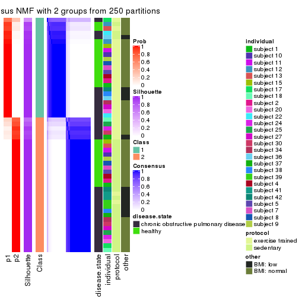</p>

</div>
<div id='tab-SD-NMF-consensus-heatmap-2'>
<pre><code class="r">consensus_heatmap(res, k = 3)
</code></pre>

<p>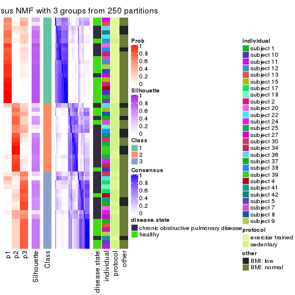</p>

</div>
<div id='tab-SD-NMF-consensus-heatmap-3'>
<pre><code class="r">consensus_heatmap(res, k = 4)
</code></pre>

<p>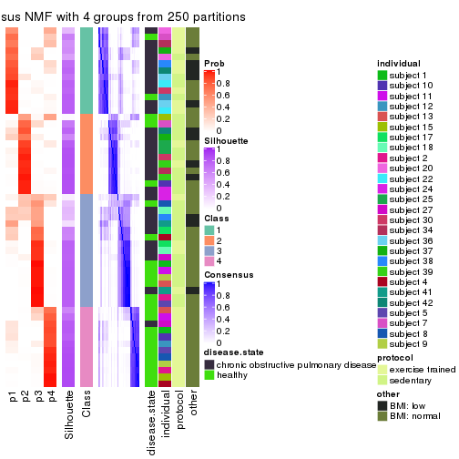</p>

</div>
<div id='tab-SD-NMF-consensus-heatmap-4'>
<pre><code class="r">consensus_heatmap(res, k = 5)
</code></pre>

<p>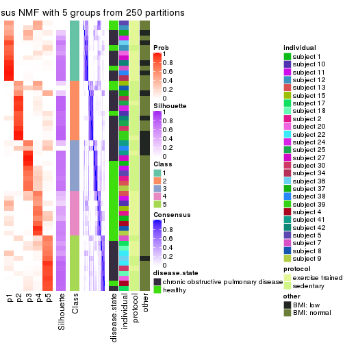</p>

</div>
<div id='tab-SD-NMF-consensus-heatmap-5'>
<pre><code class="r">consensus_heatmap(res, k = 6)
</code></pre>

<p>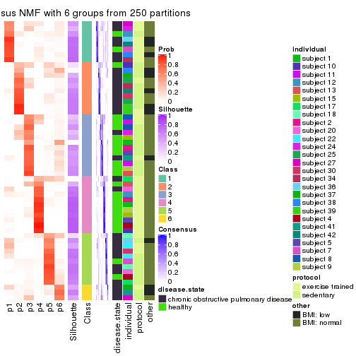</p>

</div>
</div>

Heatmaps for the membership of samples in all partitions to see how consistent they are:


<script>
$( function() {
	$( '#tabs-SD-NMF-membership-heatmap' ).tabs();
} );
</script>
<div id='tabs-SD-NMF-membership-heatmap'>
<ul>
<li><a href='#tab-SD-NMF-membership-heatmap-1'>k = 2</a></li>
<li><a href='#tab-SD-NMF-membership-heatmap-2'>k = 3</a></li>
<li><a href='#tab-SD-NMF-membership-heatmap-3'>k = 4</a></li>
<li><a href='#tab-SD-NMF-membership-heatmap-4'>k = 5</a></li>
<li><a href='#tab-SD-NMF-membership-heatmap-5'>k = 6</a></li>
</ul>
<div id='tab-SD-NMF-membership-heatmap-1'>
<pre><code class="r">membership_heatmap(res, k = 2)
</code></pre>

<p>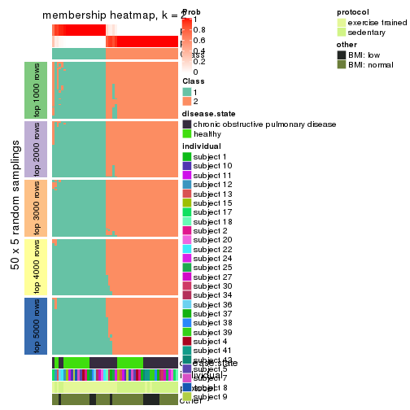</p>

</div>
<div id='tab-SD-NMF-membership-heatmap-2'>
<pre><code class="r">membership_heatmap(res, k = 3)
</code></pre>

<p>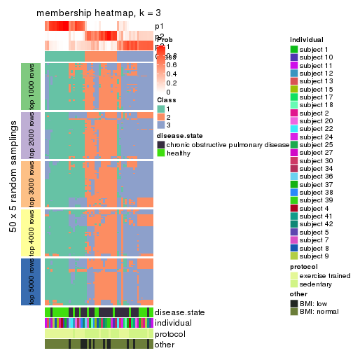</p>

</div>
<div id='tab-SD-NMF-membership-heatmap-3'>
<pre><code class="r">membership_heatmap(res, k = 4)
</code></pre>

<p>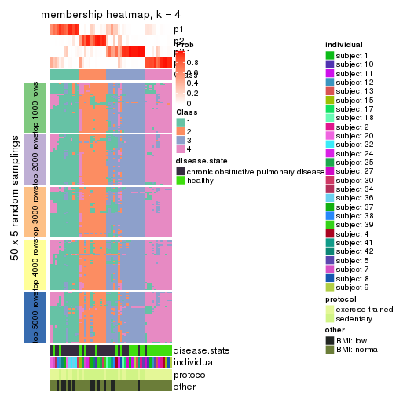</p>

</div>
<div id='tab-SD-NMF-membership-heatmap-4'>
<pre><code class="r">membership_heatmap(res, k = 5)
</code></pre>

<p>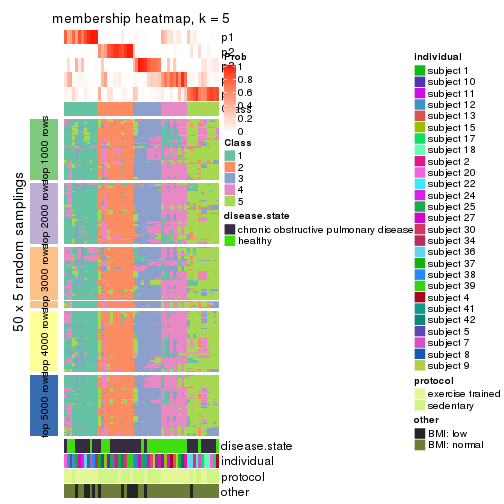</p>

</div>
<div id='tab-SD-NMF-membership-heatmap-5'>
<pre><code class="r">membership_heatmap(res, k = 6)
</code></pre>

<p>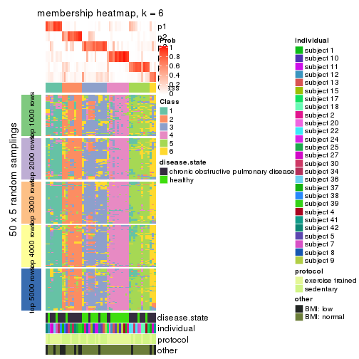</p>

</div>
</div>

As soon as we have had the classes for columns, we can look for signatures
which are significantly different between classes which can be candidate marks
for certain classes. Following are the heatmaps for signatures.


Signature heatmaps where rows are scaled:


<script>
$( function() {
	$( '#tabs-SD-NMF-get-signatures' ).tabs();
} );
</script>
<div id='tabs-SD-NMF-get-signatures'>
<ul>
<li><a href='#tab-SD-NMF-get-signatures-1'>k = 2</a></li>
<li><a href='#tab-SD-NMF-get-signatures-2'>k = 3</a></li>
<li><a href='#tab-SD-NMF-get-signatures-3'>k = 4</a></li>
<li><a href='#tab-SD-NMF-get-signatures-4'>k = 5</a></li>
<li><a href='#tab-SD-NMF-get-signatures-5'>k = 6</a></li>
</ul>
<div id='tab-SD-NMF-get-signatures-1'>
<pre><code class="r">get_signatures(res, k = 2)
</code></pre>

<p>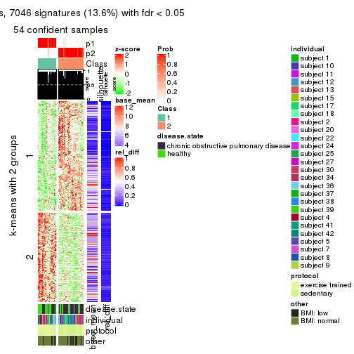</p>

</div>
<div id='tab-SD-NMF-get-signatures-2'>
<pre><code class="r">get_signatures(res, k = 3)
</code></pre>

<p>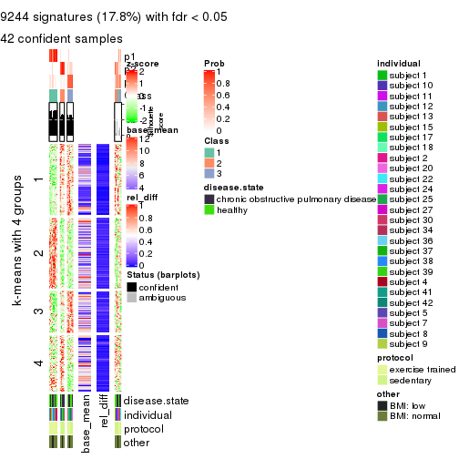</p>

</div>
<div id='tab-SD-NMF-get-signatures-3'>
<pre><code class="r">get_signatures(res, k = 4)
</code></pre>

<p>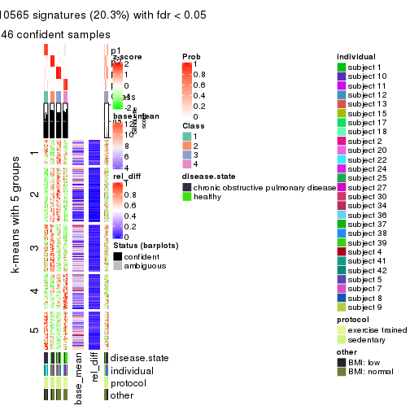</p>

</div>
<div id='tab-SD-NMF-get-signatures-4'>
<pre><code class="r">get_signatures(res, k = 5)
</code></pre>

<pre><code>#&gt; Error in mat[ceiling(1:nr/h_ratio), ceiling(1:nc/w_ratio), drop = FALSE]: subscript out of bounds
</code></pre>

<p></p>

</div>
<div id='tab-SD-NMF-get-signatures-5'>
<pre><code class="r">get_signatures(res, k = 6)
</code></pre>

<p>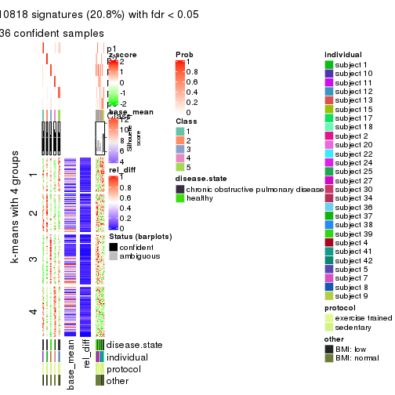</p>

</div>
</div>


Signature heatmaps where rows are not scaled:


<script>
$( function() {
	$( '#tabs-SD-NMF-get-signatures-no-scale' ).tabs();
} );
</script>
<div id='tabs-SD-NMF-get-signatures-no-scale'>
<ul>
<li><a href='#tab-SD-NMF-get-signatures-no-scale-1'>k = 2</a></li>
<li><a href='#tab-SD-NMF-get-signatures-no-scale-2'>k = 3</a></li>
<li><a href='#tab-SD-NMF-get-signatures-no-scale-3'>k = 4</a></li>
<li><a href='#tab-SD-NMF-get-signatures-no-scale-4'>k = 5</a></li>
<li><a href='#tab-SD-NMF-get-signatures-no-scale-5'>k = 6</a></li>
</ul>
<div id='tab-SD-NMF-get-signatures-no-scale-1'>
<pre><code class="r">get_signatures(res, k = 2, scale_rows = FALSE)
</code></pre>

<p>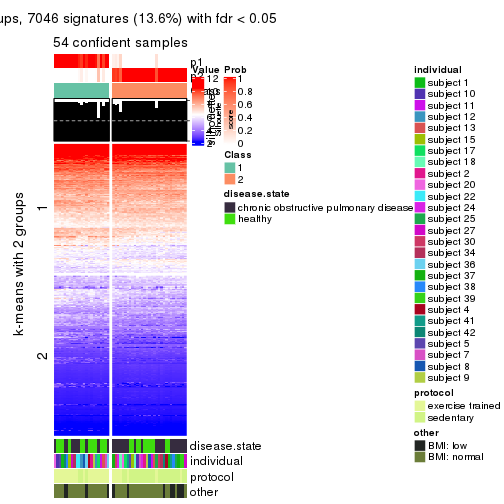</p>

</div>
<div id='tab-SD-NMF-get-signatures-no-scale-2'>
<pre><code class="r">get_signatures(res, k = 3, scale_rows = FALSE)
</code></pre>

<p>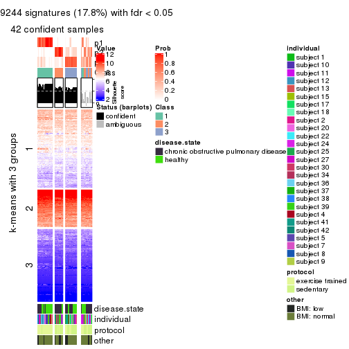</p>

</div>
<div id='tab-SD-NMF-get-signatures-no-scale-3'>
<pre><code class="r">get_signatures(res, k = 4, scale_rows = FALSE)
</code></pre>

<p>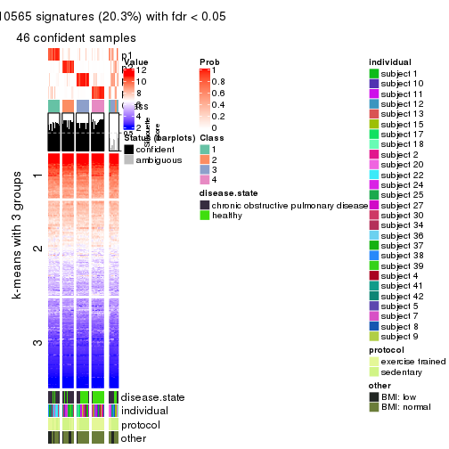</p>

</div>
<div id='tab-SD-NMF-get-signatures-no-scale-4'>
<pre><code class="r">get_signatures(res, k = 5, scale_rows = FALSE)
</code></pre>

<p>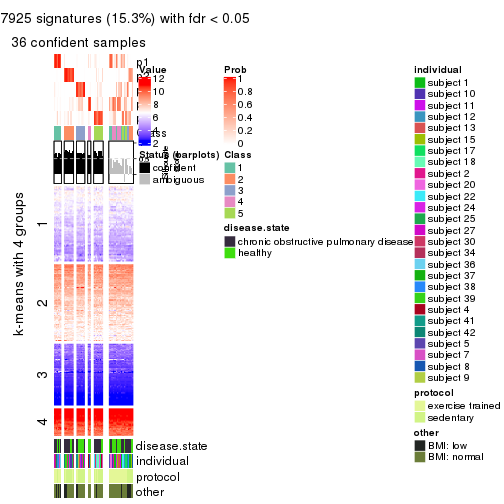</p>

</div>
<div id='tab-SD-NMF-get-signatures-no-scale-5'>
<pre><code class="r">get_signatures(res, k = 6, scale_rows = FALSE)
</code></pre>

<p>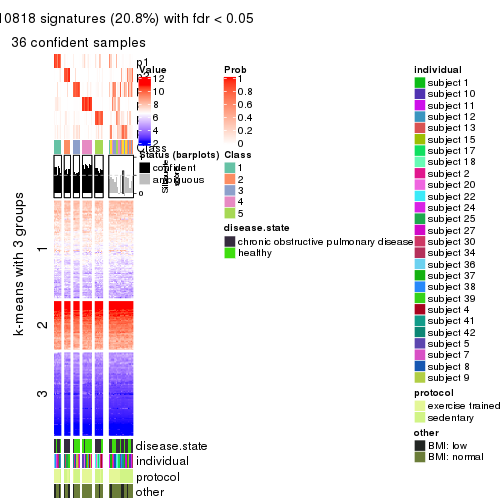</p>

</div>
</div>


Compare the overlap of signatures from different k:

```r
compare_signatures(res)
```

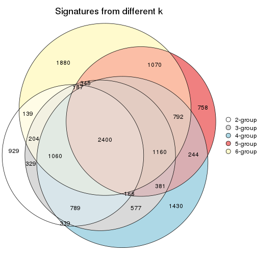

`get_signature()` returns a data frame invisibly. TO get the list of signatures, the function
call should be assigned to a variable explicitly. In following code, if `plot` argument is set
to `FALSE`, no heatmap is plotted while only the differential analysis is performed.

```r
# code only for demonstration
tb = get_signature(res, k = ..., plot = FALSE)
```

An example of the output of `tb` is:

```
#>   which_row         fdr    mean_1    mean_2 scaled_mean_1 scaled_mean_2 km
#> 1        38 0.042760348  8.373488  9.131774    -0.5533452     0.5164555  1
#> 2        40 0.018707592  7.106213  8.469186    -0.6173731     0.5762149  1
#> 3        55 0.019134737 10.221463 11.207825    -0.6159697     0.5749050  1
#> 4        59 0.006059896  5.921854  7.869574    -0.6899429     0.6439467  1
#> 5        60 0.018055526  8.928898 10.211722    -0.6204761     0.5791110  1
#> 6        98 0.009384629 15.714769 14.887706     0.6635654    -0.6193277  2
...
```

The columns in `tb` are:

1. `which_row`: row indices corresponding to the input matrix.
2. `fdr`: FDR for the differential test. 
3. `mean_x`: The mean value in group x.
4. `scaled_mean_x`: The mean value in group x after rows are scaled.
5. `km`: Row groups if k-means clustering is applied to rows.


UMAP plot which shows how samples are separated.


<script>
$( function() {
	$( '#tabs-SD-NMF-dimension-reduction' ).tabs();
} );
</script>
<div id='tabs-SD-NMF-dimension-reduction'>
<ul>
<li><a href='#tab-SD-NMF-dimension-reduction-1'>k = 2</a></li>
<li><a href='#tab-SD-NMF-dimension-reduction-2'>k = 3</a></li>
<li><a href='#tab-SD-NMF-dimension-reduction-3'>k = 4</a></li>
<li><a href='#tab-SD-NMF-dimension-reduction-4'>k = 5</a></li>
<li><a href='#tab-SD-NMF-dimension-reduction-5'>k = 6</a></li>
</ul>
<div id='tab-SD-NMF-dimension-reduction-1'>
<pre><code class="r">dimension_reduction(res, k = 2, method = &quot;UMAP&quot;)
</code></pre>

<p>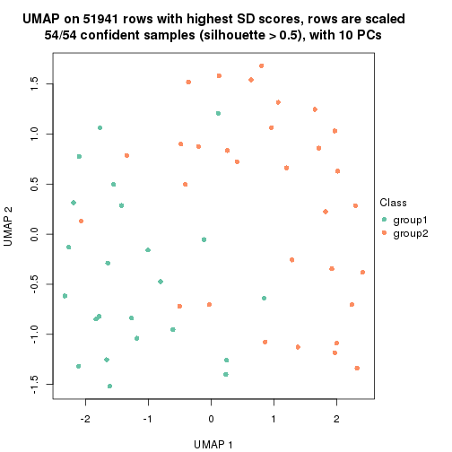</p>

</div>
<div id='tab-SD-NMF-dimension-reduction-2'>
<pre><code class="r">dimension_reduction(res, k = 3, method = &quot;UMAP&quot;)
</code></pre>

<p>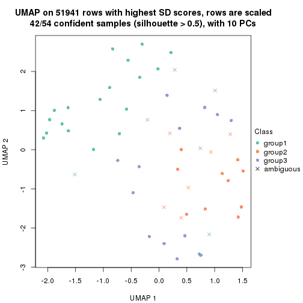</p>

</div>
<div id='tab-SD-NMF-dimension-reduction-3'>
<pre><code class="r">dimension_reduction(res, k = 4, method = &quot;UMAP&quot;)
</code></pre>

<p>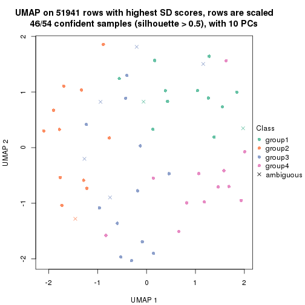</p>

</div>
<div id='tab-SD-NMF-dimension-reduction-4'>
<pre><code class="r">dimension_reduction(res, k = 5, method = &quot;UMAP&quot;)
</code></pre>

<p>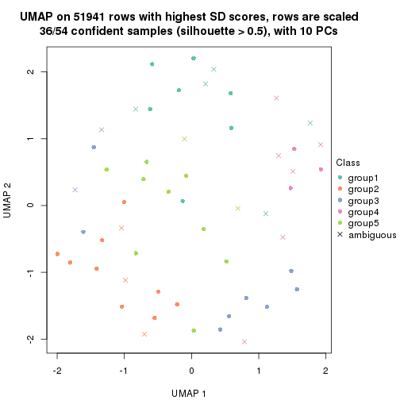</p>

</div>
<div id='tab-SD-NMF-dimension-reduction-5'>
<pre><code class="r">dimension_reduction(res, k = 6, method = &quot;UMAP&quot;)
</code></pre>

<p>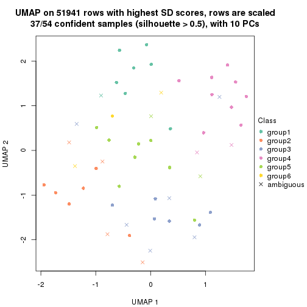</p>

</div>
</div>


Following heatmap shows how subgroups are split when increasing `k`:

```r
collect_classes(res)
```

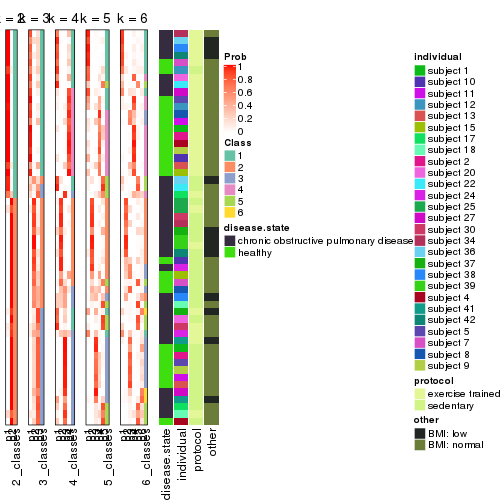


Test correlation between subgroups and known annotations. If the known
annotation is numeric, one-way ANOVA test is applied, and if the known
annotation is discrete, chi-squared contingency table test is applied.

```r
test_to_known_factors(res)
```

```
#>         n disease.state(p) individual(p) protocol(p) other(p) k
#> SD:NMF 54         0.207125         0.826    1.07e-05   0.6858 2
#> SD:NMF 42         0.110602         0.364    4.12e-05   0.7122 3
#> SD:NMF 46         0.000552         0.371    8.12e-05   0.0221 4
#> SD:NMF 36         0.009513         0.353    3.57e-03   0.3663 5
#> SD:NMF 37         0.002622         0.517    6.83e-04   0.0683 6
```


If matrix rows can be associated to genes, consider to use `functional_enrichment(res,
...)` to perform function enrichment for the signature genes. See [this vignette](http://bioconductor.org/packages/devel/bioc/vignettes/cola/inst/doc/functional_enrichment.html) for more detailed explanations.


 

---------------------------------------------------


### CV:hclust


The object with results only for a single top-value method and a single partition method 
can be extracted as:

```r
res = res_list["CV", "hclust"]
# you can also extract it by
# res = res_list["CV:hclust"]
```

A summary of `res` and all the functions that can be applied to it:

```r
res
```

```
#> A 'ConsensusPartition' object with k = 2, 3, 4, 5, 6.
#>   On a matrix with 51941 rows and 54 columns.
#>   Top rows (1000, 2000, 3000, 4000, 5000) are extracted by 'CV' method.
#>   Subgroups are detected by 'hclust' method.
#>   Performed in total 1250 partitions by row resampling.
#>   Best k for subgroups seems to be 3.
#> 
#> Following methods can be applied to this 'ConsensusPartition' object:
#>  [1] "cola_report"             "collect_classes"         "collect_plots"          
#>  [4] "collect_stats"           "colnames"                "compare_signatures"     
#>  [7] "consensus_heatmap"       "dimension_reduction"     "functional_enrichment"  
#> [10] "get_anno_col"            "get_anno"                "get_classes"            
#> [13] "get_consensus"           "get_matrix"              "get_membership"         
#> [16] "get_param"               "get_signatures"          "get_stats"              
#> [19] "is_best_k"               "is_stable_k"             "membership_heatmap"     
#> [22] "ncol"                    "nrow"                    "plot_ecdf"              
#> [25] "rownames"                "select_partition_number" "show"                   
#> [28] "suggest_best_k"          "test_to_known_factors"
```

`collect_plots()` function collects all the plots made from `res` for all `k` (number of partitions)
into one single page to provide an easy and fast comparison between different `k`.

```r
collect_plots(res)
```

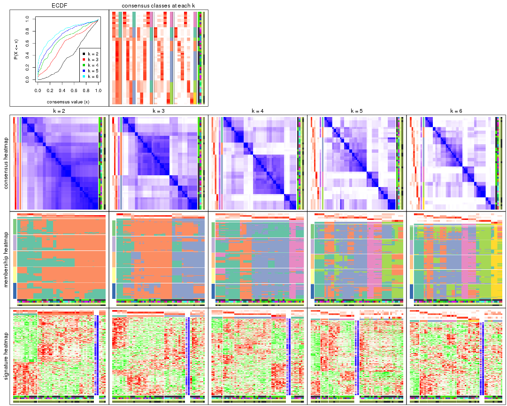

The plots are:

- The first row: a plot of the ECDF (empirical cumulative distribution
  function) curves of the consensus matrix for each `k` and the heatmap of
  predicted classes for each `k`.
- The second row: heatmaps of the consensus matrix for each `k`.
- The third row: heatmaps of the membership matrix for each `k`.
- The fouth row: heatmaps of the signatures for each `k`.

All the plots in panels can be made by individual functions and they are
plotted later in this section.

`select_partition_number()` produces several plots showing different
statistics for choosing "optimized" `k`. There are following statistics:

- ECDF curves of the consensus matrix for each `k`;
- 1-PAC. [The PAC
  score](https://en.wikipedia.org/wiki/Consensus_clustering#Over-interpretation_potential_of_consensus_clustering)
  measures the proportion of the ambiguous subgrouping.
- Mean silhouette score.
- Concordance. The mean probability of fiting the consensus class ids in all
  partitions.
- Area increased. Denote $A_k$ as the area under the ECDF curve for current
  `k`, the area increased is defined as $A_k - A_{k-1}$.
- Rand index. The percent of pairs of samples that are both in a same cluster
  or both are not in a same cluster in the partition of k and k-1.
- Jaccard index. The ratio of pairs of samples are both in a same cluster in
  the partition of k and k-1 and the pairs of samples are both in a same
  cluster in the partition k or k-1.

The detailed explanations of these statistics can be found in [the _cola_
vignette](http://bioconductor.org/packages/devel/bioc/vignettes/cola/inst/doc/cola.html#toc_13).

Generally speaking, lower PAC score, higher mean silhouette score or higher
concordance corresponds to better partition. Rand index and Jaccard index
measure how similar the current partition is compared to partition with `k-1`.
If they are too similar, we won't accept `k` is better than `k-1`.

```r
select_partition_number(res)
```

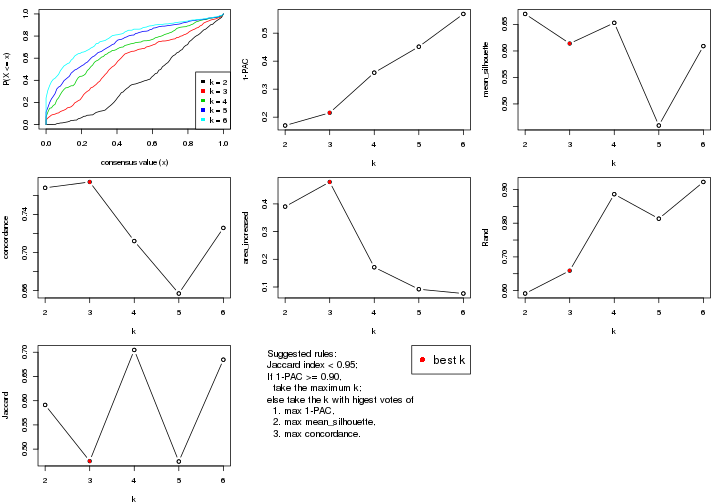

The numeric values for all these statistics can be obtained by `get_stats()`.

```r
get_stats(res)
```

```
#>   k 1-PAC mean_silhouette concordance area_increased  Rand Jaccard
#> 2 2 0.170           0.670       0.768         0.3902 0.591   0.591
#> 3 3 0.216           0.614       0.774         0.4792 0.659   0.475
#> 4 4 0.359           0.653       0.712         0.1712 0.886   0.705
#> 5 5 0.452           0.459       0.657         0.0920 0.813   0.474
#> 6 6 0.569           0.609       0.726         0.0765 0.922   0.685
```

`suggest_best_k()` suggests the best $k$ based on these statistics. The rules are as follows:

- All $k$ with Jaccard index larger than 0.95 are removed because increasing
  $k$ does not provide enough extra information. If all $k$ are removed, it is
  marked as no subgroup is detected.
- For all $k$ with 1-PAC score larger than 0.9, the maximal $k$ is taken as
  the best $k$, and other $k$ are marked as optional $k$.
- If it does not fit the second rule. The $k$ with the maximal vote of the
  highest 1-PAC score, highest mean silhouette, and highest concordance is
  taken as the best $k$.

```r
suggest_best_k(res)
```

```
#> [1] 3
```


Following shows the table of the partitions (You need to click the **show/hide
code output** link to see it). The membership matrix (columns with name `p*`)
is inferred by
[`clue::cl_consensus()`](https://www.rdocumentation.org/link/cl_consensus?package=clue)
function with the `SE` method. Basically the value in the membership matrix
represents the probability to belong to a certain group. The finall class
label for an item is determined with the group with highest probability it
belongs to.

In `get_classes()` function, the entropy is calculated from the membership
matrix and the silhouette score is calculated from the consensus matrix.


<script>
$( function() {
	$( '#tabs-CV-hclust-get-classes' ).tabs();
} );
</script>
<div id='tabs-CV-hclust-get-classes'>
<ul>
<li><a href='#tab-CV-hclust-get-classes-1'>k = 2</a></li>
<li><a href='#tab-CV-hclust-get-classes-2'>k = 3</a></li>
<li><a href='#tab-CV-hclust-get-classes-3'>k = 4</a></li>
<li><a href='#tab-CV-hclust-get-classes-4'>k = 5</a></li>
<li><a href='#tab-CV-hclust-get-classes-5'>k = 6</a></li>
</ul>

<div id='tab-CV-hclust-get-classes-1'>
<p><a id='tab-CV-hclust-get-classes-1-a' style='color:#0366d6' href='#'>show/hide code output</a></p>
<pre><code class="r">cbind(get_classes(res, k = 2), get_membership(res, k = 2))
</code></pre>

<pre><code>#&gt;           class entropy silhouette    p1    p2
#&gt; GSM680053     2  0.8713      0.672 0.292 0.708
#&gt; GSM680062     2  0.8713      0.672 0.292 0.708
#&gt; GSM680054     2  0.8499      0.685 0.276 0.724
#&gt; GSM680063     2  0.8713      0.672 0.292 0.708
#&gt; GSM680055     2  0.8713      0.672 0.292 0.708
#&gt; GSM680064     1  0.6712      0.656 0.824 0.176
#&gt; GSM680056     2  0.8813      0.663 0.300 0.700
#&gt; GSM680065     2  0.8813      0.663 0.300 0.700
#&gt; GSM680057     2  0.2778      0.766 0.048 0.952
#&gt; GSM680066     1  0.9323      0.583 0.652 0.348
#&gt; GSM680058     2  0.1184      0.760 0.016 0.984
#&gt; GSM680067     2  0.1414      0.758 0.020 0.980
#&gt; GSM680059     2  0.0000      0.764 0.000 1.000
#&gt; GSM680068     1  0.9286      0.591 0.656 0.344
#&gt; GSM680060     2  0.7745      0.685 0.228 0.772
#&gt; GSM680069     2  0.7745      0.685 0.228 0.772
#&gt; GSM680061     2  0.1414      0.758 0.020 0.980
#&gt; GSM680070     1  0.9286      0.591 0.656 0.344
#&gt; GSM680071     2  0.7745      0.685 0.228 0.772
#&gt; GSM680077     2  0.9522      0.422 0.372 0.628
#&gt; GSM680072     2  0.0376      0.764 0.004 0.996
#&gt; GSM680078     1  0.9248      0.575 0.660 0.340
#&gt; GSM680073     2  0.4690      0.759 0.100 0.900
#&gt; GSM680079     1  0.6973      0.651 0.812 0.188
#&gt; GSM680074     2  0.0376      0.764 0.004 0.996
#&gt; GSM680080     2  0.0376      0.764 0.004 0.996
#&gt; GSM680075     2  0.4939      0.758 0.108 0.892
#&gt; GSM680081     2  0.5629      0.740 0.132 0.868
#&gt; GSM680076     2  0.9209      0.505 0.336 0.664
#&gt; GSM680082     2  0.9209      0.505 0.336 0.664
#&gt; GSM680029     2  0.6623      0.751 0.172 0.828
#&gt; GSM680041     1  0.3114      0.664 0.944 0.056
#&gt; GSM680035     2  0.5408      0.740 0.124 0.876
#&gt; GSM680047     1  0.6247      0.693 0.844 0.156
#&gt; GSM680036     2  0.6623      0.753 0.172 0.828
#&gt; GSM680048     1  0.9427      0.648 0.640 0.360
#&gt; GSM680037     2  0.5408      0.740 0.124 0.876
#&gt; GSM680049     1  0.2778      0.658 0.952 0.048
#&gt; GSM680038     2  0.2778      0.773 0.048 0.952
#&gt; GSM680050     2  0.9661      0.379 0.392 0.608
#&gt; GSM680039     2  0.4161      0.765 0.084 0.916
#&gt; GSM680051     1  0.9815      0.572 0.580 0.420
#&gt; GSM680040     2  0.3879      0.764 0.076 0.924
#&gt; GSM680052     1  0.9661      0.619 0.608 0.392
#&gt; GSM680030     2  0.3114      0.770 0.056 0.944
#&gt; GSM680042     1  0.3114      0.664 0.944 0.056
#&gt; GSM680031     2  0.3584      0.764 0.068 0.932
#&gt; GSM680043     2  0.3584      0.764 0.068 0.932
#&gt; GSM680032     2  0.9427      0.376 0.360 0.640
#&gt; GSM680044     2  0.9427      0.376 0.360 0.640
#&gt; GSM680033     2  0.3879      0.764 0.076 0.924
#&gt; GSM680045     1  0.9732      0.606 0.596 0.404
#&gt; GSM680034     2  0.2778      0.766 0.048 0.952
#&gt; GSM680046     1  0.9710      0.612 0.600 0.400
</code></pre>

<script>
$('#tab-CV-hclust-get-classes-1-a').parent().next().next().hide();
$('#tab-CV-hclust-get-classes-1-a').click(function(){
  $('#tab-CV-hclust-get-classes-1-a').parent().next().next().toggle();
  return(false);
});
</script>
</div>

<div id='tab-CV-hclust-get-classes-2'>
<p><a id='tab-CV-hclust-get-classes-2-a' style='color:#0366d6' href='#'>show/hide code output</a></p>
<pre><code class="r">cbind(get_classes(res, k = 3), get_membership(res, k = 3))
</code></pre>

<pre><code>#&gt;           class entropy silhouette    p1    p2    p3
#&gt; GSM680053     3  0.5397      0.615 0.000 0.280 0.720
#&gt; GSM680062     3  0.5397      0.615 0.000 0.280 0.720
#&gt; GSM680054     3  0.5988      0.467 0.000 0.368 0.632
#&gt; GSM680063     3  0.5397      0.615 0.000 0.280 0.720
#&gt; GSM680055     3  0.5397      0.615 0.000 0.280 0.720
#&gt; GSM680064     3  0.6675      0.205 0.404 0.012 0.584
#&gt; GSM680056     3  0.5618      0.628 0.008 0.260 0.732
#&gt; GSM680065     3  0.5618      0.628 0.008 0.260 0.732
#&gt; GSM680057     2  0.3009      0.803 0.028 0.920 0.052
#&gt; GSM680066     3  0.9389      0.335 0.352 0.180 0.468
#&gt; GSM680058     2  0.2414      0.796 0.020 0.940 0.040
#&gt; GSM680067     2  0.2443      0.794 0.028 0.940 0.032
#&gt; GSM680059     2  0.1031      0.807 0.000 0.976 0.024
#&gt; GSM680068     3  0.9328      0.330 0.356 0.172 0.472
#&gt; GSM680060     3  0.6698      0.590 0.036 0.280 0.684
#&gt; GSM680069     3  0.6698      0.590 0.036 0.280 0.684
#&gt; GSM680061     2  0.2443      0.794 0.028 0.940 0.032
#&gt; GSM680070     3  0.9328      0.330 0.356 0.172 0.472
#&gt; GSM680071     3  0.6698      0.590 0.036 0.280 0.684
#&gt; GSM680077     3  0.3412      0.550 0.000 0.124 0.876
#&gt; GSM680072     2  0.1529      0.803 0.000 0.960 0.040
#&gt; GSM680078     3  0.9447      0.342 0.348 0.188 0.464
#&gt; GSM680073     2  0.3752      0.732 0.000 0.856 0.144
#&gt; GSM680079     3  0.6566      0.232 0.376 0.012 0.612
#&gt; GSM680074     2  0.1411      0.804 0.000 0.964 0.036
#&gt; GSM680080     2  0.1411      0.804 0.000 0.964 0.036
#&gt; GSM680075     2  0.3941      0.718 0.000 0.844 0.156
#&gt; GSM680081     2  0.4002      0.752 0.000 0.840 0.160
#&gt; GSM680076     3  0.4473      0.573 0.008 0.164 0.828
#&gt; GSM680082     3  0.4413      0.573 0.008 0.160 0.832
#&gt; GSM680029     2  0.4452      0.705 0.000 0.808 0.192
#&gt; GSM680041     1  0.0000      0.630 1.000 0.000 0.000
#&gt; GSM680035     2  0.3816      0.759 0.000 0.852 0.148
#&gt; GSM680047     1  0.3532      0.668 0.884 0.108 0.008
#&gt; GSM680036     2  0.5016      0.622 0.000 0.760 0.240
#&gt; GSM680048     1  0.7218      0.681 0.652 0.296 0.052
#&gt; GSM680037     2  0.3816      0.759 0.000 0.852 0.148
#&gt; GSM680049     1  0.0424      0.625 0.992 0.000 0.008
#&gt; GSM680038     2  0.5223      0.706 0.024 0.800 0.176
#&gt; GSM680050     3  0.5138      0.545 0.052 0.120 0.828
#&gt; GSM680039     2  0.2955      0.798 0.008 0.912 0.080
#&gt; GSM680051     1  0.7658      0.640 0.588 0.356 0.056
#&gt; GSM680040     2  0.2537      0.795 0.000 0.920 0.080
#&gt; GSM680052     1  0.7425      0.677 0.620 0.328 0.052
#&gt; GSM680030     2  0.4683      0.753 0.024 0.836 0.140
#&gt; GSM680042     1  0.0000      0.630 1.000 0.000 0.000
#&gt; GSM680031     2  0.3045      0.802 0.020 0.916 0.064
#&gt; GSM680043     2  0.3045      0.802 0.020 0.916 0.064
#&gt; GSM680032     2  0.9247     -0.199 0.156 0.452 0.392
#&gt; GSM680044     2  0.9247     -0.199 0.156 0.452 0.392
#&gt; GSM680033     2  0.2537      0.795 0.000 0.920 0.080
#&gt; GSM680045     1  0.7492      0.664 0.608 0.340 0.052
#&gt; GSM680034     2  0.3009      0.803 0.028 0.920 0.052
#&gt; GSM680046     1  0.7470      0.670 0.612 0.336 0.052
</code></pre>

<script>
$('#tab-CV-hclust-get-classes-2-a').parent().next().next().hide();
$('#tab-CV-hclust-get-classes-2-a').click(function(){
  $('#tab-CV-hclust-get-classes-2-a').parent().next().next().toggle();
  return(false);
});
</script>
</div>

<div id='tab-CV-hclust-get-classes-3'>
<p><a id='tab-CV-hclust-get-classes-3-a' style='color:#0366d6' href='#'>show/hide code output</a></p>
<pre><code class="r">cbind(get_classes(res, k = 4), get_membership(res, k = 4))
</code></pre>

<pre><code>#&gt;           class entropy silhouette    p1    p2    p3    p4
#&gt; GSM680053     1  0.7456      0.563 0.488 0.316 0.196 0.000
#&gt; GSM680062     1  0.7456      0.563 0.488 0.316 0.196 0.000
#&gt; GSM680054     1  0.7688      0.534 0.456 0.260 0.284 0.000
#&gt; GSM680063     1  0.7456      0.563 0.488 0.316 0.196 0.000
#&gt; GSM680055     1  0.7456      0.563 0.488 0.316 0.196 0.000
#&gt; GSM680064     1  0.5953      0.312 0.692 0.092 0.004 0.212
#&gt; GSM680056     1  0.7629      0.549 0.488 0.332 0.172 0.008
#&gt; GSM680065     1  0.7629      0.549 0.488 0.332 0.172 0.008
#&gt; GSM680057     3  0.4401      0.736 0.068 0.084 0.832 0.016
#&gt; GSM680066     1  0.6720      0.494 0.684 0.040 0.116 0.160
#&gt; GSM680058     3  0.4294      0.748 0.052 0.104 0.832 0.012
#&gt; GSM680067     3  0.3935      0.738 0.060 0.060 0.860 0.020
#&gt; GSM680059     3  0.3229      0.771 0.072 0.048 0.880 0.000
#&gt; GSM680068     1  0.6616      0.492 0.692 0.040 0.108 0.160
#&gt; GSM680060     2  0.3319      0.811 0.036 0.888 0.060 0.016
#&gt; GSM680069     2  0.3319      0.811 0.036 0.888 0.060 0.016
#&gt; GSM680061     3  0.3935      0.738 0.060 0.060 0.860 0.020
#&gt; GSM680070     1  0.6616      0.492 0.692 0.040 0.108 0.160
#&gt; GSM680071     2  0.3319      0.811 0.036 0.888 0.060 0.016
#&gt; GSM680077     2  0.3764      0.756 0.216 0.784 0.000 0.000
#&gt; GSM680072     3  0.3978      0.750 0.056 0.108 0.836 0.000
#&gt; GSM680078     1  0.6942      0.493 0.672 0.048 0.128 0.152
#&gt; GSM680073     3  0.5165      0.684 0.168 0.080 0.752 0.000
#&gt; GSM680079     1  0.5674      0.309 0.724 0.096 0.004 0.176
#&gt; GSM680074     3  0.4072      0.739 0.052 0.120 0.828 0.000
#&gt; GSM680080     3  0.4072      0.739 0.052 0.120 0.828 0.000
#&gt; GSM680075     3  0.5314      0.671 0.176 0.084 0.740 0.000
#&gt; GSM680081     3  0.3870      0.696 0.208 0.004 0.788 0.000
#&gt; GSM680076     2  0.2401      0.823 0.092 0.904 0.004 0.000
#&gt; GSM680082     2  0.2216      0.822 0.092 0.908 0.000 0.000
#&gt; GSM680029     3  0.4818      0.629 0.216 0.036 0.748 0.000
#&gt; GSM680041     4  0.0188      0.641 0.004 0.000 0.000 0.996
#&gt; GSM680035     3  0.3610      0.708 0.200 0.000 0.800 0.000
#&gt; GSM680047     4  0.2899      0.693 0.004 0.004 0.112 0.880
#&gt; GSM680036     3  0.5716      0.526 0.252 0.068 0.680 0.000
#&gt; GSM680048     4  0.6217      0.717 0.052 0.016 0.288 0.644
#&gt; GSM680037     3  0.3610      0.708 0.200 0.000 0.800 0.000
#&gt; GSM680049     4  0.0469      0.635 0.012 0.000 0.000 0.988
#&gt; GSM680038     3  0.6499      0.626 0.156 0.148 0.680 0.016
#&gt; GSM680050     2  0.4994      0.740 0.208 0.744 0.000 0.048
#&gt; GSM680039     3  0.3160      0.760 0.120 0.004 0.868 0.008
#&gt; GSM680051     4  0.6656      0.682 0.056 0.020 0.344 0.580
#&gt; GSM680040     3  0.2760      0.753 0.128 0.000 0.872 0.000
#&gt; GSM680052     4  0.6467      0.713 0.052 0.020 0.316 0.612
#&gt; GSM680030     3  0.5926      0.664 0.144 0.112 0.728 0.016
#&gt; GSM680042     4  0.0188      0.641 0.004 0.000 0.000 0.996
#&gt; GSM680031     3  0.3255      0.755 0.092 0.016 0.880 0.012
#&gt; GSM680043     3  0.3255      0.755 0.092 0.016 0.880 0.012
#&gt; GSM680032     1  0.7437      0.353 0.516 0.080 0.368 0.036
#&gt; GSM680044     1  0.7437      0.353 0.516 0.080 0.368 0.036
#&gt; GSM680033     3  0.2760      0.753 0.128 0.000 0.872 0.000
#&gt; GSM680045     4  0.6734      0.698 0.068 0.020 0.316 0.596
#&gt; GSM680034     3  0.4401      0.736 0.068 0.084 0.832 0.016
#&gt; GSM680046     4  0.6670      0.706 0.064 0.020 0.316 0.600
</code></pre>

<script>
$('#tab-CV-hclust-get-classes-3-a').parent().next().next().hide();
$('#tab-CV-hclust-get-classes-3-a').click(function(){
  $('#tab-CV-hclust-get-classes-3-a').parent().next().next().toggle();
  return(false);
});
</script>
</div>

<div id='tab-CV-hclust-get-classes-4'>
<p><a id='tab-CV-hclust-get-classes-4-a' style='color:#0366d6' href='#'>show/hide code output</a></p>
<pre><code class="r">cbind(get_classes(res, k = 5), get_membership(res, k = 5))
</code></pre>

<pre><code>#&gt;           class entropy silhouette    p1    p2    p3    p4    p5
#&gt; GSM680053     5  0.8490     0.2996 0.276 0.168 0.268 0.000 0.288
#&gt; GSM680062     5  0.8490     0.2996 0.276 0.168 0.268 0.000 0.288
#&gt; GSM680054     3  0.8461    -0.2705 0.244 0.180 0.336 0.000 0.240
#&gt; GSM680063     5  0.8490     0.2996 0.276 0.168 0.268 0.000 0.288
#&gt; GSM680055     5  0.8490     0.2996 0.276 0.168 0.268 0.000 0.288
#&gt; GSM680064     1  0.1788     0.7460 0.932 0.004 0.000 0.056 0.008
#&gt; GSM680056     5  0.8601     0.2983 0.280 0.168 0.244 0.004 0.304
#&gt; GSM680065     5  0.8601     0.2983 0.280 0.168 0.244 0.004 0.304
#&gt; GSM680057     2  0.4108     0.7211 0.000 0.684 0.308 0.008 0.000
#&gt; GSM680066     1  0.3516     0.8513 0.812 0.004 0.164 0.020 0.000
#&gt; GSM680058     3  0.4736    -0.1948 0.000 0.404 0.576 0.000 0.020
#&gt; GSM680067     2  0.3700     0.6891 0.000 0.752 0.240 0.008 0.000
#&gt; GSM680059     3  0.1728     0.4767 0.000 0.036 0.940 0.004 0.020
#&gt; GSM680068     1  0.3435     0.8575 0.820 0.004 0.156 0.020 0.000
#&gt; GSM680060     5  0.3786     0.4384 0.016 0.204 0.000 0.004 0.776
#&gt; GSM680069     5  0.3786     0.4384 0.016 0.204 0.000 0.004 0.776
#&gt; GSM680061     2  0.3700     0.6891 0.000 0.752 0.240 0.008 0.000
#&gt; GSM680070     1  0.3435     0.8575 0.820 0.004 0.156 0.020 0.000
#&gt; GSM680071     5  0.3786     0.4384 0.016 0.204 0.000 0.004 0.776
#&gt; GSM680077     5  0.3607     0.3146 0.244 0.004 0.000 0.000 0.752
#&gt; GSM680072     3  0.4675    -0.1125 0.000 0.380 0.600 0.000 0.020
#&gt; GSM680078     1  0.3461     0.8248 0.812 0.000 0.168 0.016 0.004
#&gt; GSM680073     3  0.4338     0.4924 0.068 0.072 0.808 0.000 0.052
#&gt; GSM680079     1  0.1377     0.7466 0.956 0.004 0.000 0.020 0.020
#&gt; GSM680074     3  0.4752    -0.1863 0.000 0.412 0.568 0.000 0.020
#&gt; GSM680080     3  0.4752    -0.1863 0.000 0.412 0.568 0.000 0.020
#&gt; GSM680075     3  0.4531     0.4909 0.072 0.072 0.796 0.000 0.060
#&gt; GSM680081     3  0.3210     0.5315 0.092 0.040 0.860 0.000 0.008
#&gt; GSM680076     5  0.0932     0.4355 0.020 0.004 0.004 0.000 0.972
#&gt; GSM680082     5  0.0865     0.4343 0.024 0.004 0.000 0.000 0.972
#&gt; GSM680029     3  0.4060     0.5288 0.120 0.032 0.812 0.000 0.036
#&gt; GSM680041     4  0.0162     0.6792 0.004 0.000 0.000 0.996 0.000
#&gt; GSM680035     3  0.2871     0.5336 0.088 0.040 0.872 0.000 0.000
#&gt; GSM680047     4  0.3073     0.7133 0.004 0.052 0.076 0.868 0.000
#&gt; GSM680036     3  0.5022     0.4879 0.136 0.060 0.752 0.000 0.052
#&gt; GSM680048     4  0.6050     0.7237 0.024 0.216 0.128 0.632 0.000
#&gt; GSM680037     3  0.2871     0.5336 0.088 0.040 0.872 0.000 0.000
#&gt; GSM680049     4  0.0794     0.6696 0.028 0.000 0.000 0.972 0.000
#&gt; GSM680038     2  0.6299     0.3575 0.044 0.464 0.444 0.004 0.044
#&gt; GSM680050     5  0.4608     0.2997 0.260 0.004 0.000 0.036 0.700
#&gt; GSM680039     3  0.2885     0.5033 0.052 0.064 0.880 0.004 0.000
#&gt; GSM680051     4  0.6370     0.6787 0.020 0.260 0.144 0.576 0.000
#&gt; GSM680040     3  0.1591     0.5382 0.052 0.004 0.940 0.004 0.000
#&gt; GSM680052     4  0.6155     0.7138 0.020 0.240 0.132 0.608 0.000
#&gt; GSM680030     2  0.5202     0.5976 0.012 0.636 0.316 0.004 0.032
#&gt; GSM680042     4  0.0162     0.6792 0.004 0.000 0.000 0.996 0.000
#&gt; GSM680031     3  0.4245     0.3067 0.024 0.224 0.744 0.008 0.000
#&gt; GSM680043     3  0.4245     0.3067 0.024 0.224 0.744 0.008 0.000
#&gt; GSM680032     3  0.7923    -0.0179 0.352 0.176 0.388 0.008 0.076
#&gt; GSM680044     3  0.7923    -0.0179 0.352 0.176 0.388 0.008 0.076
#&gt; GSM680033     3  0.1830     0.5362 0.052 0.012 0.932 0.004 0.000
#&gt; GSM680045     4  0.6436     0.7006 0.028 0.236 0.148 0.588 0.000
#&gt; GSM680034     2  0.4108     0.7211 0.000 0.684 0.308 0.008 0.000
#&gt; GSM680046     4  0.6389     0.7069 0.028 0.240 0.140 0.592 0.000
</code></pre>

<script>
$('#tab-CV-hclust-get-classes-4-a').parent().next().next().hide();
$('#tab-CV-hclust-get-classes-4-a').click(function(){
  $('#tab-CV-hclust-get-classes-4-a').parent().next().next().toggle();
  return(false);
});
</script>
</div>

<div id='tab-CV-hclust-get-classes-5'>
<p><a id='tab-CV-hclust-get-classes-5-a' style='color:#0366d6' href='#'>show/hide code output</a></p>
<pre><code class="r">cbind(get_classes(res, k = 6), get_membership(res, k = 6))
</code></pre>

<pre><code>#&gt;           class entropy silhouette    p1    p2    p3    p4    p5    p6
#&gt; GSM680053     5  0.2277     0.8290 0.032 0.000 0.076 0.000 0.892 0.000
#&gt; GSM680062     5  0.2277     0.8290 0.032 0.000 0.076 0.000 0.892 0.000
#&gt; GSM680054     5  0.3399     0.7495 0.020 0.024 0.140 0.000 0.816 0.000
#&gt; GSM680063     5  0.2277     0.8290 0.032 0.000 0.076 0.000 0.892 0.000
#&gt; GSM680055     5  0.2277     0.8290 0.032 0.000 0.076 0.000 0.892 0.000
#&gt; GSM680064     1  0.1382     0.7875 0.948 0.000 0.000 0.036 0.008 0.008
#&gt; GSM680056     5  0.1930     0.8180 0.036 0.000 0.048 0.000 0.916 0.000
#&gt; GSM680065     5  0.1930     0.8180 0.036 0.000 0.048 0.000 0.916 0.000
#&gt; GSM680057     2  0.3841     0.7011 0.000 0.764 0.168 0.000 0.068 0.000
#&gt; GSM680066     1  0.3462     0.8678 0.816 0.004 0.080 0.000 0.100 0.000
#&gt; GSM680058     3  0.4962     0.0802 0.004 0.412 0.536 0.000 0.040 0.008
#&gt; GSM680067     2  0.1901     0.6214 0.000 0.912 0.076 0.004 0.008 0.000
#&gt; GSM680059     3  0.0976     0.5795 0.000 0.008 0.968 0.000 0.016 0.008
#&gt; GSM680068     1  0.3324     0.8763 0.824 0.004 0.060 0.000 0.112 0.000
#&gt; GSM680060     6  0.5463     0.6453 0.000 0.148 0.000 0.000 0.312 0.540
#&gt; GSM680069     6  0.5463     0.6453 0.000 0.148 0.000 0.000 0.312 0.540
#&gt; GSM680061     2  0.1901     0.6214 0.000 0.912 0.076 0.004 0.008 0.000
#&gt; GSM680070     1  0.3324     0.8763 0.824 0.004 0.060 0.000 0.112 0.000
#&gt; GSM680071     6  0.5463     0.6453 0.000 0.148 0.000 0.000 0.312 0.540
#&gt; GSM680077     6  0.3641     0.5986 0.248 0.000 0.000 0.000 0.020 0.732
#&gt; GSM680072     3  0.5025     0.1501 0.004 0.384 0.556 0.000 0.048 0.008
#&gt; GSM680078     1  0.3370     0.8404 0.812 0.000 0.064 0.000 0.124 0.000
#&gt; GSM680073     3  0.3806     0.5104 0.004 0.008 0.724 0.000 0.256 0.008
#&gt; GSM680079     1  0.0717     0.7884 0.976 0.000 0.000 0.000 0.008 0.016
#&gt; GSM680074     3  0.4863     0.0848 0.004 0.428 0.528 0.000 0.032 0.008
#&gt; GSM680080     3  0.4863     0.0848 0.004 0.428 0.528 0.000 0.032 0.008
#&gt; GSM680075     3  0.4087     0.4569 0.004 0.008 0.668 0.000 0.312 0.008
#&gt; GSM680081     3  0.3490     0.5423 0.000 0.008 0.724 0.000 0.268 0.000
#&gt; GSM680076     6  0.1176     0.6786 0.020 0.000 0.000 0.000 0.024 0.956
#&gt; GSM680082     6  0.1261     0.6783 0.024 0.000 0.000 0.000 0.024 0.952
#&gt; GSM680029     3  0.3758     0.5206 0.008 0.000 0.668 0.000 0.324 0.000
#&gt; GSM680041     4  0.0146     0.6747 0.000 0.000 0.000 0.996 0.004 0.000
#&gt; GSM680035     3  0.3073     0.5981 0.000 0.008 0.788 0.000 0.204 0.000
#&gt; GSM680047     4  0.2891     0.7148 0.000 0.036 0.060 0.872 0.032 0.000
#&gt; GSM680036     3  0.4063     0.3519 0.004 0.004 0.572 0.000 0.420 0.000
#&gt; GSM680048     4  0.5847     0.7312 0.000 0.172 0.104 0.632 0.092 0.000
#&gt; GSM680037     3  0.3073     0.5981 0.000 0.008 0.788 0.000 0.204 0.000
#&gt; GSM680049     4  0.0777     0.6621 0.024 0.000 0.000 0.972 0.004 0.000
#&gt; GSM680038     2  0.6078     0.2815 0.000 0.420 0.352 0.000 0.224 0.004
#&gt; GSM680050     6  0.4268     0.5840 0.264 0.000 0.000 0.036 0.008 0.692
#&gt; GSM680039     3  0.3384     0.5965 0.000 0.068 0.812 0.000 0.120 0.000
#&gt; GSM680051     4  0.6323     0.6944 0.000 0.216 0.112 0.568 0.104 0.000
#&gt; GSM680040     3  0.2191     0.6192 0.000 0.004 0.876 0.000 0.120 0.000
#&gt; GSM680052     4  0.6090     0.7228 0.000 0.196 0.108 0.600 0.096 0.000
#&gt; GSM680030     2  0.5276     0.5790 0.000 0.604 0.188 0.000 0.208 0.000
#&gt; GSM680042     4  0.0146     0.6747 0.000 0.000 0.000 0.996 0.004 0.000
#&gt; GSM680031     3  0.4383     0.4096 0.000 0.176 0.716 0.000 0.108 0.000
#&gt; GSM680043     3  0.4383     0.4096 0.000 0.176 0.716 0.000 0.108 0.000
#&gt; GSM680032     5  0.7071     0.3320 0.264 0.056 0.212 0.000 0.452 0.016
#&gt; GSM680044     5  0.7071     0.3320 0.264 0.056 0.212 0.000 0.452 0.016
#&gt; GSM680033     3  0.2489     0.6194 0.000 0.012 0.860 0.000 0.128 0.000
#&gt; GSM680045     4  0.6615     0.7088 0.016 0.196 0.116 0.572 0.100 0.000
#&gt; GSM680034     2  0.3841     0.7011 0.000 0.764 0.168 0.000 0.068 0.000
#&gt; GSM680046     4  0.6581     0.7149 0.016 0.196 0.108 0.576 0.104 0.000
</code></pre>

<script>
$('#tab-CV-hclust-get-classes-5-a').parent().next().next().hide();
$('#tab-CV-hclust-get-classes-5-a').click(function(){
  $('#tab-CV-hclust-get-classes-5-a').parent().next().next().toggle();
  return(false);
});
</script>
</div>
</div>

Heatmaps for the consensus matrix. It visualizes the probability of two
samples to be in a same group.


<script>
$( function() {
	$( '#tabs-CV-hclust-consensus-heatmap' ).tabs();
} );
</script>
<div id='tabs-CV-hclust-consensus-heatmap'>
<ul>
<li><a href='#tab-CV-hclust-consensus-heatmap-1'>k = 2</a></li>
<li><a href='#tab-CV-hclust-consensus-heatmap-2'>k = 3</a></li>
<li><a href='#tab-CV-hclust-consensus-heatmap-3'>k = 4</a></li>
<li><a href='#tab-CV-hclust-consensus-heatmap-4'>k = 5</a></li>
<li><a href='#tab-CV-hclust-consensus-heatmap-5'>k = 6</a></li>
</ul>
<div id='tab-CV-hclust-consensus-heatmap-1'>
<pre><code class="r">consensus_heatmap(res, k = 2)
</code></pre>

<p>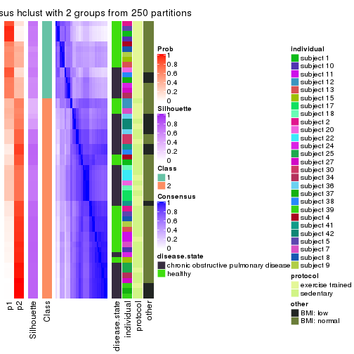</p>

</div>
<div id='tab-CV-hclust-consensus-heatmap-2'>
<pre><code class="r">consensus_heatmap(res, k = 3)
</code></pre>

<p>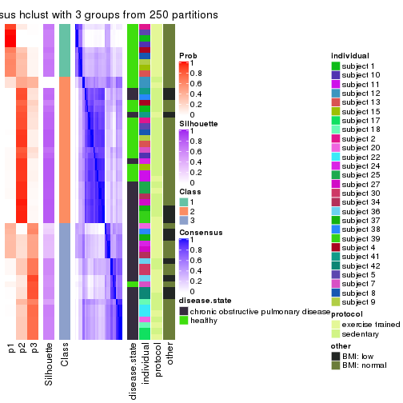</p>

</div>
<div id='tab-CV-hclust-consensus-heatmap-3'>
<pre><code class="r">consensus_heatmap(res, k = 4)
</code></pre>

<p>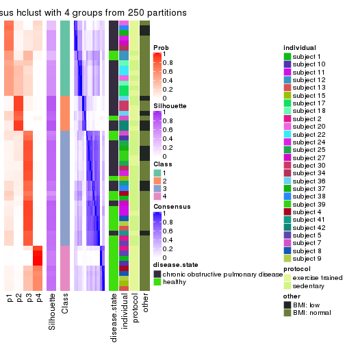</p>

</div>
<div id='tab-CV-hclust-consensus-heatmap-4'>
<pre><code class="r">consensus_heatmap(res, k = 5)
</code></pre>

<p>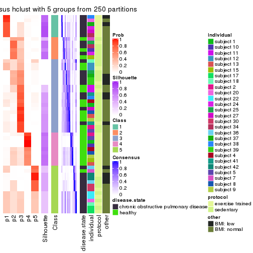</p>

</div>
<div id='tab-CV-hclust-consensus-heatmap-5'>
<pre><code class="r">consensus_heatmap(res, k = 6)
</code></pre>

<p>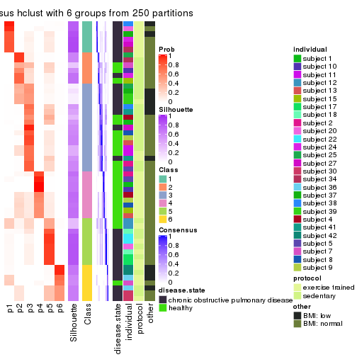</p>

</div>
</div>

Heatmaps for the membership of samples in all partitions to see how consistent they are:


<script>
$( function() {
	$( '#tabs-CV-hclust-membership-heatmap' ).tabs();
} );
</script>
<div id='tabs-CV-hclust-membership-heatmap'>
<ul>
<li><a href='#tab-CV-hclust-membership-heatmap-1'>k = 2</a></li>
<li><a href='#tab-CV-hclust-membership-heatmap-2'>k = 3</a></li>
<li><a href='#tab-CV-hclust-membership-heatmap-3'>k = 4</a></li>
<li><a href='#tab-CV-hclust-membership-heatmap-4'>k = 5</a></li>
<li><a href='#tab-CV-hclust-membership-heatmap-5'>k = 6</a></li>
</ul>
<div id='tab-CV-hclust-membership-heatmap-1'>
<pre><code class="r">membership_heatmap(res, k = 2)
</code></pre>

<p>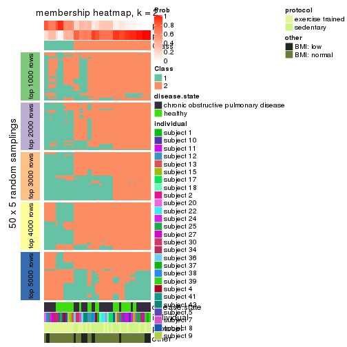</p>

</div>
<div id='tab-CV-hclust-membership-heatmap-2'>
<pre><code class="r">membership_heatmap(res, k = 3)
</code></pre>

<p>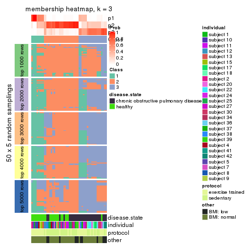</p>

</div>
<div id='tab-CV-hclust-membership-heatmap-3'>
<pre><code class="r">membership_heatmap(res, k = 4)
</code></pre>

<p>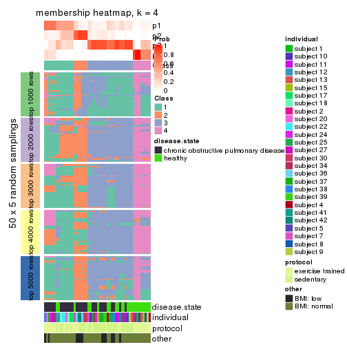</p>

</div>
<div id='tab-CV-hclust-membership-heatmap-4'>
<pre><code class="r">membership_heatmap(res, k = 5)
</code></pre>

<p>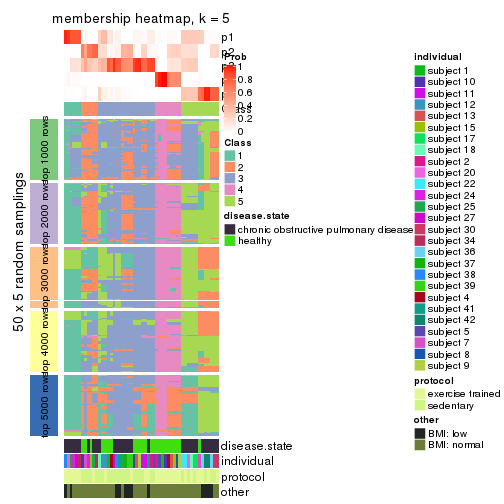</p>

</div>
<div id='tab-CV-hclust-membership-heatmap-5'>
<pre><code class="r">membership_heatmap(res, k = 6)
</code></pre>

<p>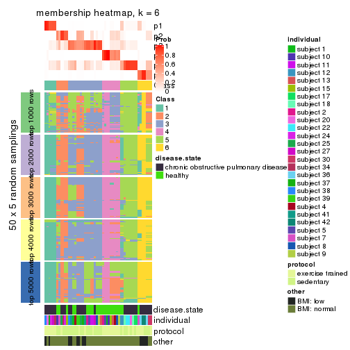</p>

</div>
</div>

As soon as we have had the classes for columns, we can look for signatures
which are significantly different between classes which can be candidate marks
for certain classes. Following are the heatmaps for signatures.


Signature heatmaps where rows are scaled:


<script>
$( function() {
	$( '#tabs-CV-hclust-get-signatures' ).tabs();
} );
</script>
<div id='tabs-CV-hclust-get-signatures'>
<ul>
<li><a href='#tab-CV-hclust-get-signatures-1'>k = 2</a></li>
<li><a href='#tab-CV-hclust-get-signatures-2'>k = 3</a></li>
<li><a href='#tab-CV-hclust-get-signatures-3'>k = 4</a></li>
<li><a href='#tab-CV-hclust-get-signatures-4'>k = 5</a></li>
<li><a href='#tab-CV-hclust-get-signatures-5'>k = 6</a></li>
</ul>
<div id='tab-CV-hclust-get-signatures-1'>
<pre><code class="r">get_signatures(res, k = 2)
</code></pre>

<p>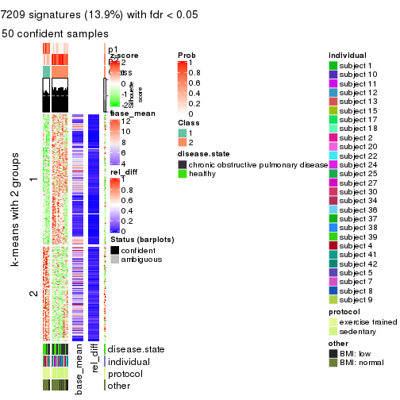</p>

</div>
<div id='tab-CV-hclust-get-signatures-2'>
<pre><code class="r">get_signatures(res, k = 3)
</code></pre>

<p>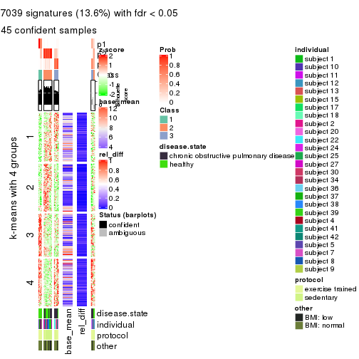</p>

</div>
<div id='tab-CV-hclust-get-signatures-3'>
<pre><code class="r">get_signatures(res, k = 4)
</code></pre>

<p>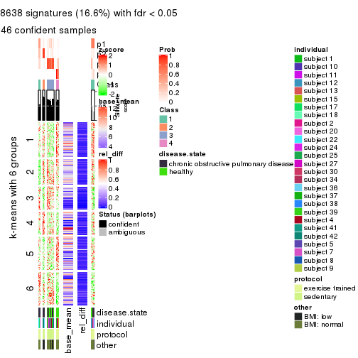</p>

</div>
<div id='tab-CV-hclust-get-signatures-4'>
<pre><code class="r">get_signatures(res, k = 5)
</code></pre>

<p>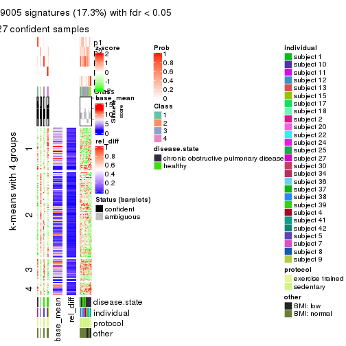</p>

</div>
<div id='tab-CV-hclust-get-signatures-5'>
<pre><code class="r">get_signatures(res, k = 6)
</code></pre>

<p>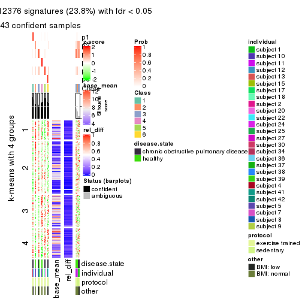</p>

</div>
</div>


Signature heatmaps where rows are not scaled:


<script>
$( function() {
	$( '#tabs-CV-hclust-get-signatures-no-scale' ).tabs();
} );
</script>
<div id='tabs-CV-hclust-get-signatures-no-scale'>
<ul>
<li><a href='#tab-CV-hclust-get-signatures-no-scale-1'>k = 2</a></li>
<li><a href='#tab-CV-hclust-get-signatures-no-scale-2'>k = 3</a></li>
<li><a href='#tab-CV-hclust-get-signatures-no-scale-3'>k = 4</a></li>
<li><a href='#tab-CV-hclust-get-signatures-no-scale-4'>k = 5</a></li>
<li><a href='#tab-CV-hclust-get-signatures-no-scale-5'>k = 6</a></li>
</ul>
<div id='tab-CV-hclust-get-signatures-no-scale-1'>
<pre><code class="r">get_signatures(res, k = 2, scale_rows = FALSE)
</code></pre>

<p>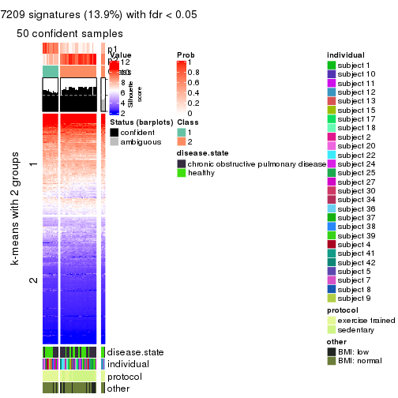</p>

</div>
<div id='tab-CV-hclust-get-signatures-no-scale-2'>
<pre><code class="r">get_signatures(res, k = 3, scale_rows = FALSE)
</code></pre>

<p>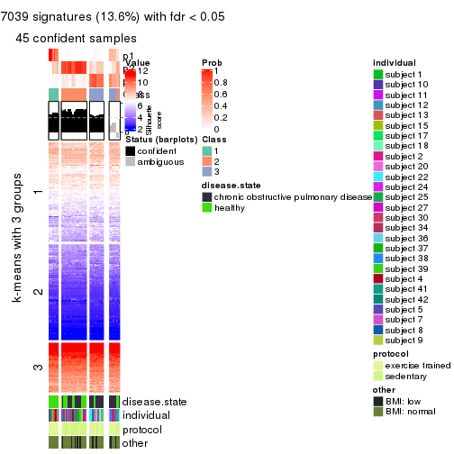</p>

</div>
<div id='tab-CV-hclust-get-signatures-no-scale-3'>
<pre><code class="r">get_signatures(res, k = 4, scale_rows = FALSE)
</code></pre>

<p>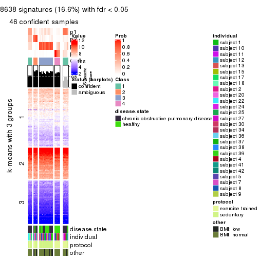</p>

</div>
<div id='tab-CV-hclust-get-signatures-no-scale-4'>
<pre><code class="r">get_signatures(res, k = 5, scale_rows = FALSE)
</code></pre>

<p>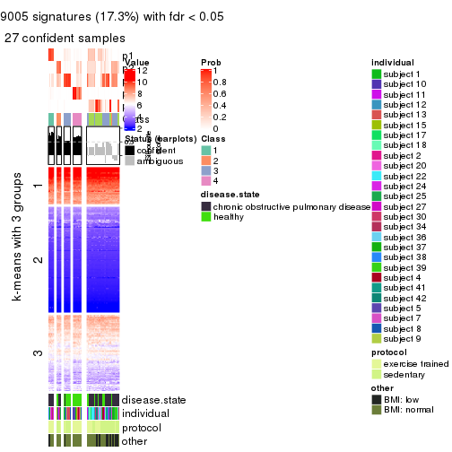</p>

</div>
<div id='tab-CV-hclust-get-signatures-no-scale-5'>
<pre><code class="r">get_signatures(res, k = 6, scale_rows = FALSE)
</code></pre>

<p>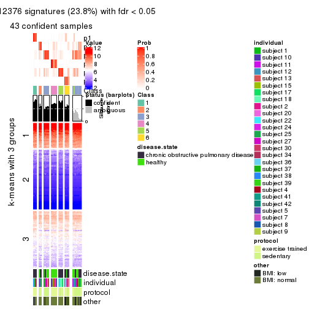</p>

</div>
</div>


Compare the overlap of signatures from different k:

```r
compare_signatures(res)
```

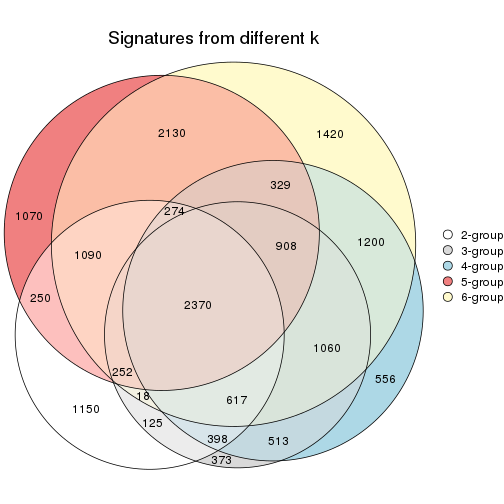

`get_signature()` returns a data frame invisibly. TO get the list of signatures, the function
call should be assigned to a variable explicitly. In following code, if `plot` argument is set
to `FALSE`, no heatmap is plotted while only the differential analysis is performed.

```r
# code only for demonstration
tb = get_signature(res, k = ..., plot = FALSE)
```

An example of the output of `tb` is:

```
#>   which_row         fdr    mean_1    mean_2 scaled_mean_1 scaled_mean_2 km
#> 1        38 0.042760348  8.373488  9.131774    -0.5533452     0.5164555  1
#> 2        40 0.018707592  7.106213  8.469186    -0.6173731     0.5762149  1
#> 3        55 0.019134737 10.221463 11.207825    -0.6159697     0.5749050  1
#> 4        59 0.006059896  5.921854  7.869574    -0.6899429     0.6439467  1
#> 5        60 0.018055526  8.928898 10.211722    -0.6204761     0.5791110  1
#> 6        98 0.009384629 15.714769 14.887706     0.6635654    -0.6193277  2
...
```

The columns in `tb` are:

1. `which_row`: row indices corresponding to the input matrix.
2. `fdr`: FDR for the differential test. 
3. `mean_x`: The mean value in group x.
4. `scaled_mean_x`: The mean value in group x after rows are scaled.
5. `km`: Row groups if k-means clustering is applied to rows.


UMAP plot which shows how samples are separated.


<script>
$( function() {
	$( '#tabs-CV-hclust-dimension-reduction' ).tabs();
} );
</script>
<div id='tabs-CV-hclust-dimension-reduction'>
<ul>
<li><a href='#tab-CV-hclust-dimension-reduction-1'>k = 2</a></li>
<li><a href='#tab-CV-hclust-dimension-reduction-2'>k = 3</a></li>
<li><a href='#tab-CV-hclust-dimension-reduction-3'>k = 4</a></li>
<li><a href='#tab-CV-hclust-dimension-reduction-4'>k = 5</a></li>
<li><a href='#tab-CV-hclust-dimension-reduction-5'>k = 6</a></li>
</ul>
<div id='tab-CV-hclust-dimension-reduction-1'>
<pre><code class="r">dimension_reduction(res, k = 2, method = &quot;UMAP&quot;)
</code></pre>

<p>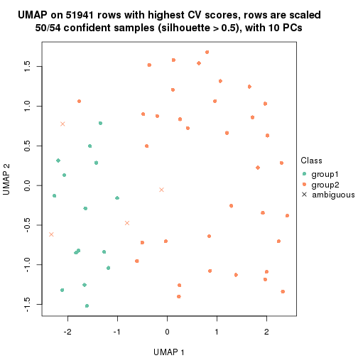</p>

</div>
<div id='tab-CV-hclust-dimension-reduction-2'>
<pre><code class="r">dimension_reduction(res, k = 3, method = &quot;UMAP&quot;)
</code></pre>

<p>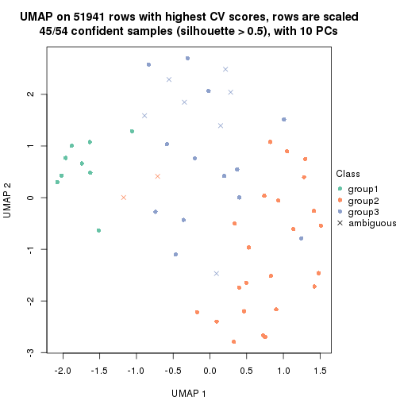</p>

</div>
<div id='tab-CV-hclust-dimension-reduction-3'>
<pre><code class="r">dimension_reduction(res, k = 4, method = &quot;UMAP&quot;)
</code></pre>

<p>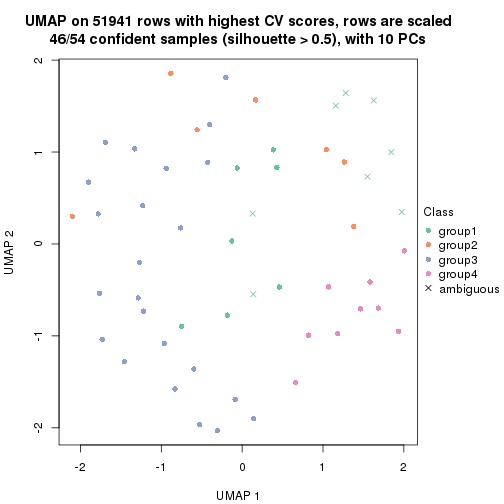</p>

</div>
<div id='tab-CV-hclust-dimension-reduction-4'>
<pre><code class="r">dimension_reduction(res, k = 5, method = &quot;UMAP&quot;)
</code></pre>

<p>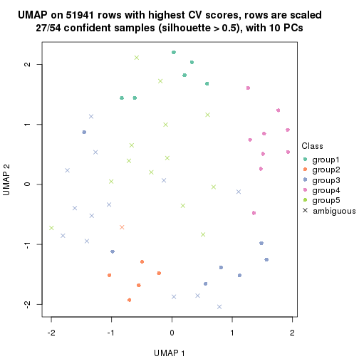</p>

</div>
<div id='tab-CV-hclust-dimension-reduction-5'>
<pre><code class="r">dimension_reduction(res, k = 6, method = &quot;UMAP&quot;)
</code></pre>

<p>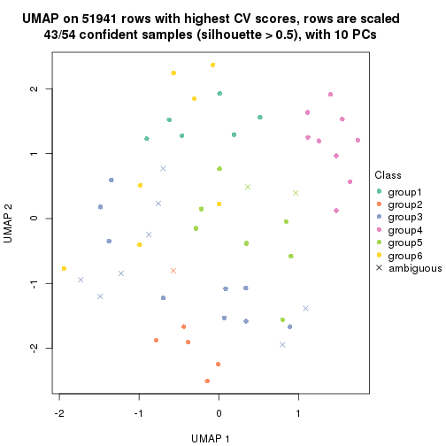</p>

</div>
</div>


Following heatmap shows how subgroups are split when increasing `k`:

```r
collect_classes(res)
```

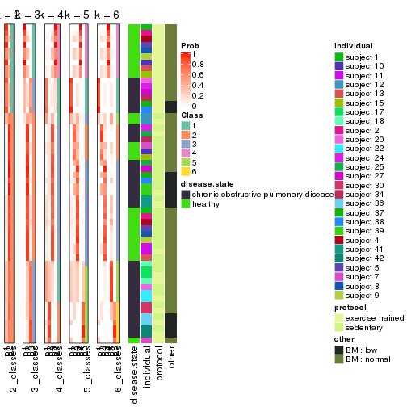


Test correlation between subgroups and known annotations. If the known
annotation is numeric, one-way ANOVA test is applied, and if the known
annotation is discrete, chi-squared contingency table test is applied.

```r
test_to_known_factors(res)
```

```
#>            n disease.state(p) individual(p) protocol(p) other(p) k
#> CV:hclust 50         0.168948        0.9565    6.51e-06   0.5512 2
#> CV:hclust 45         0.000104        0.2603    9.45e-05   0.1902 3
#> CV:hclust 46         0.000209        0.0218    3.30e-04   0.0198 4
#> CV:hclust 27         0.000404        0.7112    1.79e-04   0.1853 5
#> CV:hclust 43         0.000077        0.0664    4.69e-04   0.0274 6
```


If matrix rows can be associated to genes, consider to use `functional_enrichment(res,
...)` to perform function enrichment for the signature genes. See [this vignette](http://bioconductor.org/packages/devel/bioc/vignettes/cola/inst/doc/functional_enrichment.html) for more detailed explanations.


 

---------------------------------------------------


### CV:kmeans*


The object with results only for a single top-value method and a single partition method 
can be extracted as:

```r
res = res_list["CV", "kmeans"]
# you can also extract it by
# res = res_list["CV:kmeans"]
```

A summary of `res` and all the functions that can be applied to it:

```r
res
```

```
#> A 'ConsensusPartition' object with k = 2, 3, 4, 5, 6.
#>   On a matrix with 51941 rows and 54 columns.
#>   Top rows (1000, 2000, 3000, 4000, 5000) are extracted by 'CV' method.
#>   Subgroups are detected by 'kmeans' method.
#>   Performed in total 1250 partitions by row resampling.
#>   Best k for subgroups seems to be 2.
#> 
#> Following methods can be applied to this 'ConsensusPartition' object:
#>  [1] "cola_report"             "collect_classes"         "collect_plots"          
#>  [4] "collect_stats"           "colnames"                "compare_signatures"     
#>  [7] "consensus_heatmap"       "dimension_reduction"     "functional_enrichment"  
#> [10] "get_anno_col"            "get_anno"                "get_classes"            
#> [13] "get_consensus"           "get_matrix"              "get_membership"         
#> [16] "get_param"               "get_signatures"          "get_stats"              
#> [19] "is_best_k"               "is_stable_k"             "membership_heatmap"     
#> [22] "ncol"                    "nrow"                    "plot_ecdf"              
#> [25] "rownames"                "select_partition_number" "show"                   
#> [28] "suggest_best_k"          "test_to_known_factors"
```

`collect_plots()` function collects all the plots made from `res` for all `k` (number of partitions)
into one single page to provide an easy and fast comparison between different `k`.

```r
collect_plots(res)
```

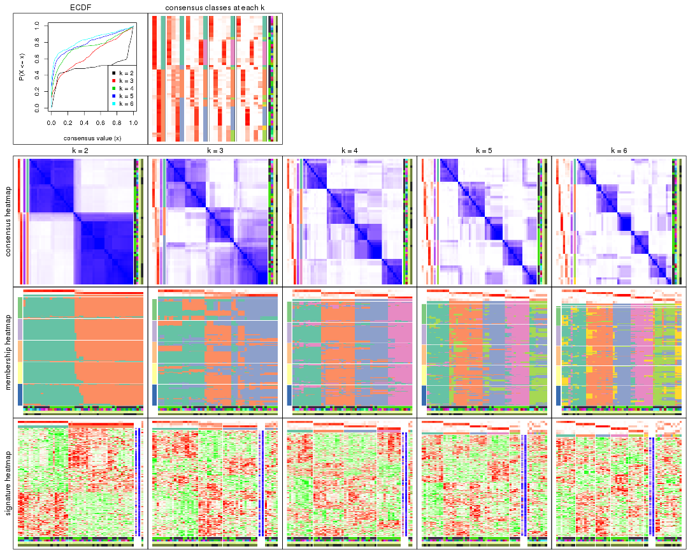

The plots are:

- The first row: a plot of the ECDF (empirical cumulative distribution
  function) curves of the consensus matrix for each `k` and the heatmap of
  predicted classes for each `k`.
- The second row: heatmaps of the consensus matrix for each `k`.
- The third row: heatmaps of the membership matrix for each `k`.
- The fouth row: heatmaps of the signatures for each `k`.

All the plots in panels can be made by individual functions and they are
plotted later in this section.

`select_partition_number()` produces several plots showing different
statistics for choosing "optimized" `k`. There are following statistics:

- ECDF curves of the consensus matrix for each `k`;
- 1-PAC. [The PAC
  score](https://en.wikipedia.org/wiki/Consensus_clustering#Over-interpretation_potential_of_consensus_clustering)
  measures the proportion of the ambiguous subgrouping.
- Mean silhouette score.
- Concordance. The mean probability of fiting the consensus class ids in all
  partitions.
- Area increased. Denote $A_k$ as the area under the ECDF curve for current
  `k`, the area increased is defined as $A_k - A_{k-1}$.
- Rand index. The percent of pairs of samples that are both in a same cluster
  or both are not in a same cluster in the partition of k and k-1.
- Jaccard index. The ratio of pairs of samples are both in a same cluster in
  the partition of k and k-1 and the pairs of samples are both in a same
  cluster in the partition k or k-1.

The detailed explanations of these statistics can be found in [the _cola_
vignette](http://bioconductor.org/packages/devel/bioc/vignettes/cola/inst/doc/cola.html#toc_13).

Generally speaking, lower PAC score, higher mean silhouette score or higher
concordance corresponds to better partition. Rand index and Jaccard index
measure how similar the current partition is compared to partition with `k-1`.
If they are too similar, we won't accept `k` is better than `k-1`.

```r
select_partition_number(res)
```

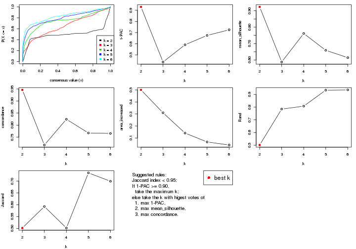

The numeric values for all these statistics can be obtained by `get_stats()`.

```r
get_stats(res)
```

```
#>   k 1-PAC mean_silhouette concordance area_increased  Rand Jaccard
#> 2 2 0.930           0.923       0.946         0.5003 0.502   0.502
#> 3 3 0.436           0.588       0.718         0.3099 0.785   0.593
#> 4 4 0.591           0.761       0.824         0.1410 0.808   0.502
#> 5 5 0.675           0.659       0.767         0.0674 0.934   0.735
#> 6 6 0.725           0.614       0.766         0.0419 0.936   0.699
```

`suggest_best_k()` suggests the best $k$ based on these statistics. The rules are as follows:

- All $k$ with Jaccard index larger than 0.95 are removed because increasing
  $k$ does not provide enough extra information. If all $k$ are removed, it is
  marked as no subgroup is detected.
- For all $k$ with 1-PAC score larger than 0.9, the maximal $k$ is taken as
  the best $k$, and other $k$ are marked as optional $k$.
- If it does not fit the second rule. The $k$ with the maximal vote of the
  highest 1-PAC score, highest mean silhouette, and highest concordance is
  taken as the best $k$.

```r
suggest_best_k(res)
```

```
#> [1] 2
```


Following shows the table of the partitions (You need to click the **show/hide
code output** link to see it). The membership matrix (columns with name `p*`)
is inferred by
[`clue::cl_consensus()`](https://www.rdocumentation.org/link/cl_consensus?package=clue)
function with the `SE` method. Basically the value in the membership matrix
represents the probability to belong to a certain group. The finall class
label for an item is determined with the group with highest probability it
belongs to.

In `get_classes()` function, the entropy is calculated from the membership
matrix and the silhouette score is calculated from the consensus matrix.


<script>
$( function() {
	$( '#tabs-CV-kmeans-get-classes' ).tabs();
} );
</script>
<div id='tabs-CV-kmeans-get-classes'>
<ul>
<li><a href='#tab-CV-kmeans-get-classes-1'>k = 2</a></li>
<li><a href='#tab-CV-kmeans-get-classes-2'>k = 3</a></li>
<li><a href='#tab-CV-kmeans-get-classes-3'>k = 4</a></li>
<li><a href='#tab-CV-kmeans-get-classes-4'>k = 5</a></li>
<li><a href='#tab-CV-kmeans-get-classes-5'>k = 6</a></li>
</ul>

<div id='tab-CV-kmeans-get-classes-1'>
<p><a id='tab-CV-kmeans-get-classes-1-a' style='color:#0366d6' href='#'>show/hide code output</a></p>
<pre><code class="r">cbind(get_classes(res, k = 2), get_membership(res, k = 2))
</code></pre>

<pre><code>#&gt;           class entropy silhouette    p1    p2
#&gt; GSM680053     2  0.1184      0.938 0.016 0.984
#&gt; GSM680062     2  0.9944      0.262 0.456 0.544
#&gt; GSM680054     2  0.1414      0.941 0.020 0.980
#&gt; GSM680063     2  0.8207      0.708 0.256 0.744
#&gt; GSM680055     2  0.1184      0.938 0.016 0.984
#&gt; GSM680064     1  0.2043      0.965 0.968 0.032
#&gt; GSM680056     1  0.5294      0.908 0.880 0.120
#&gt; GSM680065     1  0.3114      0.957 0.944 0.056
#&gt; GSM680057     2  0.3274      0.934 0.060 0.940
#&gt; GSM680066     1  0.3274      0.957 0.940 0.060
#&gt; GSM680058     2  0.1184      0.938 0.016 0.984
#&gt; GSM680067     2  0.3114      0.935 0.056 0.944
#&gt; GSM680059     2  0.0938      0.941 0.012 0.988
#&gt; GSM680068     1  0.1843      0.965 0.972 0.028
#&gt; GSM680060     2  0.1414      0.937 0.020 0.980
#&gt; GSM680069     2  0.6343      0.810 0.160 0.840
#&gt; GSM680061     2  0.3114      0.935 0.056 0.944
#&gt; GSM680070     1  0.2043      0.964 0.968 0.032
#&gt; GSM680071     2  0.7602      0.747 0.220 0.780
#&gt; GSM680077     1  0.3114      0.956 0.944 0.056
#&gt; GSM680072     2  0.0672      0.938 0.008 0.992
#&gt; GSM680078     1  0.4022      0.953 0.920 0.080
#&gt; GSM680073     2  0.0938      0.937 0.012 0.988
#&gt; GSM680079     1  0.3114      0.956 0.944 0.056
#&gt; GSM680074     2  0.1184      0.938 0.016 0.984
#&gt; GSM680080     2  0.0938      0.937 0.012 0.988
#&gt; GSM680075     2  0.0938      0.937 0.012 0.988
#&gt; GSM680081     2  0.2778      0.939 0.048 0.952
#&gt; GSM680076     2  0.1184      0.935 0.016 0.984
#&gt; GSM680082     1  0.3114      0.956 0.944 0.056
#&gt; GSM680029     2  0.1184      0.940 0.016 0.984
#&gt; GSM680041     1  0.0938      0.964 0.988 0.012
#&gt; GSM680035     2  0.2948      0.937 0.052 0.948
#&gt; GSM680047     1  0.1184      0.964 0.984 0.016
#&gt; GSM680036     2  0.1184      0.938 0.016 0.984
#&gt; GSM680048     1  0.1633      0.964 0.976 0.024
#&gt; GSM680037     2  0.2948      0.937 0.052 0.948
#&gt; GSM680049     1  0.0672      0.963 0.992 0.008
#&gt; GSM680038     2  0.2236      0.939 0.036 0.964
#&gt; GSM680050     1  0.2778      0.957 0.952 0.048
#&gt; GSM680039     2  0.3114      0.934 0.056 0.944
#&gt; GSM680051     1  0.2043      0.961 0.968 0.032
#&gt; GSM680040     2  0.2948      0.937 0.052 0.948
#&gt; GSM680052     1  0.2043      0.961 0.968 0.032
#&gt; GSM680030     2  0.3114      0.937 0.056 0.944
#&gt; GSM680042     1  0.0672      0.964 0.992 0.008
#&gt; GSM680031     2  0.2948      0.937 0.052 0.948
#&gt; GSM680043     1  0.1843      0.962 0.972 0.028
#&gt; GSM680032     1  0.3274      0.957 0.940 0.060
#&gt; GSM680044     1  0.2043      0.963 0.968 0.032
#&gt; GSM680033     2  0.2948      0.937 0.052 0.948
#&gt; GSM680045     1  0.2778      0.950 0.952 0.048
#&gt; GSM680034     2  0.3274      0.934 0.060 0.940
#&gt; GSM680046     1  0.0938      0.964 0.988 0.012
</code></pre>

<script>
$('#tab-CV-kmeans-get-classes-1-a').parent().next().next().hide();
$('#tab-CV-kmeans-get-classes-1-a').click(function(){
  $('#tab-CV-kmeans-get-classes-1-a').parent().next().next().toggle();
  return(false);
});
</script>
</div>

<div id='tab-CV-kmeans-get-classes-2'>
<p><a id='tab-CV-kmeans-get-classes-2-a' style='color:#0366d6' href='#'>show/hide code output</a></p>
<pre><code class="r">cbind(get_classes(res, k = 3), get_membership(res, k = 3))
</code></pre>

<pre><code>#&gt;           class entropy silhouette    p1    p2    p3
#&gt; GSM680053     3   0.280     0.6413 0.016 0.060 0.924
#&gt; GSM680062     3   0.683     0.5365 0.148 0.112 0.740
#&gt; GSM680054     3   0.571    -0.1798 0.000 0.320 0.680
#&gt; GSM680063     3   0.453     0.6318 0.052 0.088 0.860
#&gt; GSM680055     3   0.280     0.6413 0.016 0.060 0.924
#&gt; GSM680064     1   0.572     0.7529 0.704 0.292 0.004
#&gt; GSM680056     3   0.958     0.0784 0.216 0.320 0.464
#&gt; GSM680065     1   0.774     0.7243 0.608 0.324 0.068
#&gt; GSM680057     2   0.615     0.6479 0.000 0.592 0.408
#&gt; GSM680066     1   0.910     0.6559 0.456 0.404 0.140
#&gt; GSM680058     2   0.631     0.6609 0.000 0.508 0.492
#&gt; GSM680067     2   0.848     0.5732 0.224 0.612 0.164
#&gt; GSM680059     3   0.319     0.6309 0.000 0.112 0.888
#&gt; GSM680068     1   0.742     0.7473 0.632 0.312 0.056
#&gt; GSM680060     2   0.630     0.6687 0.000 0.520 0.480
#&gt; GSM680069     3   0.576     0.5131 0.028 0.208 0.764
#&gt; GSM680061     2   0.852     0.5940 0.208 0.612 0.180
#&gt; GSM680070     1   0.749     0.7433 0.620 0.324 0.056
#&gt; GSM680071     2   0.680     0.4183 0.072 0.724 0.204
#&gt; GSM680077     1   0.762     0.7363 0.596 0.348 0.056
#&gt; GSM680072     3   0.581    -0.2843 0.000 0.336 0.664
#&gt; GSM680078     3   0.952     0.0482 0.212 0.312 0.476
#&gt; GSM680073     3   0.141     0.6204 0.000 0.036 0.964
#&gt; GSM680079     1   0.754     0.7424 0.612 0.332 0.056
#&gt; GSM680074     2   0.631     0.6606 0.000 0.512 0.488
#&gt; GSM680080     2   0.631     0.6573 0.000 0.508 0.492
#&gt; GSM680075     3   0.153     0.6362 0.000 0.040 0.960
#&gt; GSM680081     3   0.348     0.6514 0.000 0.128 0.872
#&gt; GSM680076     2   0.632     0.6015 0.008 0.636 0.356
#&gt; GSM680082     1   0.749     0.7412 0.608 0.340 0.052
#&gt; GSM680029     3   0.263     0.6612 0.000 0.084 0.916
#&gt; GSM680041     1   0.175     0.7546 0.952 0.048 0.000
#&gt; GSM680035     3   0.364     0.6447 0.004 0.124 0.872
#&gt; GSM680047     1   0.389     0.7339 0.880 0.096 0.024
#&gt; GSM680036     3   0.164     0.6421 0.000 0.044 0.956
#&gt; GSM680048     1   0.380     0.7349 0.884 0.092 0.024
#&gt; GSM680037     3   0.364     0.6447 0.004 0.124 0.872
#&gt; GSM680049     1   0.103     0.7615 0.976 0.024 0.000
#&gt; GSM680038     3   0.631    -0.6949 0.000 0.492 0.508
#&gt; GSM680050     1   0.607     0.7470 0.676 0.316 0.008
#&gt; GSM680039     2   0.623     0.6142 0.000 0.564 0.436
#&gt; GSM680051     1   0.432     0.7215 0.860 0.112 0.028
#&gt; GSM680040     3   0.364     0.6447 0.004 0.124 0.872
#&gt; GSM680052     1   0.432     0.7215 0.860 0.112 0.028
#&gt; GSM680030     2   0.624     0.6674 0.000 0.560 0.440
#&gt; GSM680042     1   0.153     0.7566 0.960 0.040 0.000
#&gt; GSM680031     3   0.364     0.6447 0.004 0.124 0.872
#&gt; GSM680043     1   0.668     0.6927 0.748 0.152 0.100
#&gt; GSM680032     1   0.772     0.7363 0.612 0.320 0.068
#&gt; GSM680044     1   0.492     0.7519 0.844 0.080 0.076
#&gt; GSM680033     3   0.364     0.6447 0.004 0.124 0.872
#&gt; GSM680045     1   0.669     0.6896 0.748 0.148 0.104
#&gt; GSM680034     2   0.873     0.5824 0.208 0.592 0.200
#&gt; GSM680046     1   0.303     0.7472 0.912 0.076 0.012
</code></pre>

<script>
$('#tab-CV-kmeans-get-classes-2-a').parent().next().next().hide();
$('#tab-CV-kmeans-get-classes-2-a').click(function(){
  $('#tab-CV-kmeans-get-classes-2-a').parent().next().next().toggle();
  return(false);
});
</script>
</div>

<div id='tab-CV-kmeans-get-classes-3'>
<p><a id='tab-CV-kmeans-get-classes-3-a' style='color:#0366d6' href='#'>show/hide code output</a></p>
<pre><code class="r">cbind(get_classes(res, k = 4), get_membership(res, k = 4))
</code></pre>

<pre><code>#&gt;           class entropy silhouette    p1    p2    p3    p4
#&gt; GSM680053     3  0.5789      0.745 0.116 0.120 0.744 0.020
#&gt; GSM680062     3  0.6237      0.742 0.116 0.096 0.732 0.056
#&gt; GSM680054     2  0.6566      0.295 0.056 0.552 0.380 0.012
#&gt; GSM680063     3  0.6027      0.743 0.116 0.116 0.736 0.032
#&gt; GSM680055     3  0.5789      0.745 0.116 0.120 0.744 0.020
#&gt; GSM680064     1  0.4408      0.756 0.756 0.008 0.004 0.232
#&gt; GSM680056     1  0.6659      0.585 0.696 0.116 0.140 0.048
#&gt; GSM680065     1  0.5101      0.721 0.800 0.036 0.072 0.092
#&gt; GSM680057     2  0.4364      0.798 0.004 0.792 0.180 0.024
#&gt; GSM680066     1  0.5199      0.753 0.764 0.004 0.088 0.144
#&gt; GSM680058     2  0.1767      0.813 0.000 0.944 0.044 0.012
#&gt; GSM680067     2  0.4535      0.792 0.000 0.804 0.112 0.084
#&gt; GSM680059     3  0.4333      0.752 0.032 0.148 0.812 0.008
#&gt; GSM680068     1  0.3538      0.804 0.832 0.004 0.004 0.160
#&gt; GSM680060     2  0.0804      0.814 0.000 0.980 0.012 0.008
#&gt; GSM680069     1  0.7790     -0.141 0.436 0.128 0.412 0.024
#&gt; GSM680061     2  0.4469      0.794 0.000 0.808 0.112 0.080
#&gt; GSM680070     1  0.3355      0.805 0.836 0.004 0.000 0.160
#&gt; GSM680071     2  0.4484      0.731 0.052 0.836 0.072 0.040
#&gt; GSM680077     1  0.3519      0.812 0.852 0.016 0.004 0.128
#&gt; GSM680072     2  0.5679      0.573 0.068 0.716 0.208 0.008
#&gt; GSM680078     1  0.3558      0.761 0.872 0.008 0.072 0.048
#&gt; GSM680073     3  0.6624      0.728 0.128 0.220 0.644 0.008
#&gt; GSM680079     1  0.3105      0.811 0.856 0.000 0.004 0.140
#&gt; GSM680074     2  0.2923      0.816 0.016 0.896 0.080 0.008
#&gt; GSM680080     2  0.2923      0.816 0.016 0.896 0.080 0.008
#&gt; GSM680075     3  0.6574      0.735 0.132 0.208 0.652 0.008
#&gt; GSM680081     3  0.2563      0.805 0.012 0.060 0.916 0.012
#&gt; GSM680076     2  0.2790      0.789 0.072 0.904 0.012 0.012
#&gt; GSM680082     1  0.3606      0.811 0.840 0.020 0.000 0.140
#&gt; GSM680029     3  0.2652      0.804 0.028 0.056 0.912 0.004
#&gt; GSM680041     4  0.1786      0.878 0.036 0.008 0.008 0.948
#&gt; GSM680035     3  0.2515      0.806 0.004 0.072 0.912 0.012
#&gt; GSM680047     4  0.1151      0.892 0.000 0.008 0.024 0.968
#&gt; GSM680036     3  0.5620      0.759 0.120 0.120 0.748 0.012
#&gt; GSM680048     4  0.1174      0.896 0.012 0.000 0.020 0.968
#&gt; GSM680037     3  0.2515      0.806 0.004 0.072 0.912 0.012
#&gt; GSM680049     4  0.2053      0.873 0.072 0.004 0.000 0.924
#&gt; GSM680038     2  0.3599      0.801 0.020 0.868 0.092 0.020
#&gt; GSM680050     1  0.4527      0.786 0.780 0.020 0.008 0.192
#&gt; GSM680039     2  0.5085      0.707 0.004 0.688 0.292 0.016
#&gt; GSM680051     4  0.1821      0.889 0.008 0.012 0.032 0.948
#&gt; GSM680040     3  0.2515      0.806 0.004 0.072 0.912 0.012
#&gt; GSM680052     4  0.1398      0.893 0.004 0.000 0.040 0.956
#&gt; GSM680030     2  0.3855      0.808 0.004 0.820 0.164 0.012
#&gt; GSM680042     4  0.2221      0.874 0.044 0.016 0.008 0.932
#&gt; GSM680031     3  0.2515      0.806 0.004 0.072 0.912 0.012
#&gt; GSM680043     4  0.5632      0.742 0.084 0.008 0.176 0.732
#&gt; GSM680032     1  0.3823      0.802 0.852 0.028 0.012 0.108
#&gt; GSM680044     4  0.5165      0.734 0.180 0.012 0.048 0.760
#&gt; GSM680033     3  0.2515      0.806 0.004 0.072 0.912 0.012
#&gt; GSM680045     4  0.4698      0.772 0.032 0.008 0.180 0.780
#&gt; GSM680034     2  0.5257      0.780 0.004 0.756 0.160 0.080
#&gt; GSM680046     4  0.1488      0.894 0.032 0.000 0.012 0.956
</code></pre>

<script>
$('#tab-CV-kmeans-get-classes-3-a').parent().next().next().hide();
$('#tab-CV-kmeans-get-classes-3-a').click(function(){
  $('#tab-CV-kmeans-get-classes-3-a').parent().next().next().toggle();
  return(false);
});
</script>
</div>

<div id='tab-CV-kmeans-get-classes-4'>
<p><a id='tab-CV-kmeans-get-classes-4-a' style='color:#0366d6' href='#'>show/hide code output</a></p>
<pre><code class="r">cbind(get_classes(res, k = 5), get_membership(res, k = 5))
</code></pre>

<pre><code>#&gt;           class entropy silhouette    p1    p2    p3    p4    p5
#&gt; GSM680053     5  0.5554      0.558 0.004 0.028 0.452 0.016 0.500
#&gt; GSM680062     5  0.5922      0.556 0.004 0.028 0.452 0.036 0.480
#&gt; GSM680054     2  0.6685     -0.124 0.000 0.388 0.236 0.000 0.376
#&gt; GSM680063     5  0.5718      0.554 0.004 0.028 0.464 0.024 0.480
#&gt; GSM680055     5  0.5756      0.568 0.012 0.028 0.444 0.016 0.500
#&gt; GSM680064     1  0.3806      0.822 0.812 0.000 0.000 0.104 0.084
#&gt; GSM680056     5  0.5805      0.349 0.304 0.008 0.048 0.024 0.616
#&gt; GSM680065     5  0.4907     -0.156 0.488 0.000 0.000 0.024 0.488
#&gt; GSM680057     2  0.3373      0.732 0.000 0.816 0.168 0.008 0.008
#&gt; GSM680066     1  0.3171      0.850 0.872 0.004 0.060 0.056 0.008
#&gt; GSM680058     2  0.2125      0.747 0.000 0.920 0.024 0.004 0.052
#&gt; GSM680067     2  0.3893      0.736 0.004 0.820 0.100 0.072 0.004
#&gt; GSM680059     3  0.5888      0.523 0.020 0.144 0.652 0.000 0.184
#&gt; GSM680068     1  0.2213      0.869 0.912 0.004 0.008 0.072 0.004
#&gt; GSM680060     2  0.1831      0.748 0.000 0.920 0.004 0.000 0.076
#&gt; GSM680069     5  0.6703      0.550 0.176 0.016 0.208 0.016 0.584
#&gt; GSM680061     2  0.3705      0.740 0.004 0.832 0.100 0.060 0.004
#&gt; GSM680070     1  0.0955      0.880 0.968 0.000 0.000 0.028 0.004
#&gt; GSM680071     2  0.4551      0.422 0.004 0.556 0.000 0.004 0.436
#&gt; GSM680077     1  0.3559      0.861 0.844 0.012 0.012 0.020 0.112
#&gt; GSM680072     2  0.6300      0.426 0.020 0.552 0.092 0.004 0.332
#&gt; GSM680078     1  0.3294      0.824 0.868 0.012 0.036 0.008 0.076
#&gt; GSM680073     3  0.6878      0.242 0.020 0.168 0.440 0.000 0.372
#&gt; GSM680079     1  0.2978      0.872 0.880 0.004 0.012 0.024 0.080
#&gt; GSM680074     2  0.3680      0.714 0.004 0.820 0.032 0.004 0.140
#&gt; GSM680080     2  0.3680      0.714 0.004 0.820 0.032 0.004 0.140
#&gt; GSM680075     3  0.6812      0.256 0.024 0.148 0.464 0.000 0.364
#&gt; GSM680081     3  0.0798      0.741 0.016 0.008 0.976 0.000 0.000
#&gt; GSM680076     2  0.4019      0.679 0.028 0.768 0.000 0.004 0.200
#&gt; GSM680082     1  0.3068      0.870 0.876 0.032 0.000 0.020 0.072
#&gt; GSM680029     3  0.2889      0.702 0.016 0.020 0.880 0.000 0.084
#&gt; GSM680041     4  0.2077      0.831 0.008 0.000 0.000 0.908 0.084
#&gt; GSM680035     3  0.0671      0.759 0.000 0.016 0.980 0.004 0.000
#&gt; GSM680047     4  0.1502      0.839 0.004 0.000 0.000 0.940 0.056
#&gt; GSM680036     5  0.5481      0.355 0.016 0.032 0.456 0.000 0.496
#&gt; GSM680048     4  0.1205      0.841 0.004 0.000 0.000 0.956 0.040
#&gt; GSM680037     3  0.0671      0.759 0.000 0.016 0.980 0.004 0.000
#&gt; GSM680049     4  0.2694      0.820 0.040 0.000 0.000 0.884 0.076
#&gt; GSM680038     2  0.3731      0.725 0.000 0.816 0.072 0.000 0.112
#&gt; GSM680050     1  0.4240      0.838 0.792 0.008 0.012 0.036 0.152
#&gt; GSM680039     2  0.4523      0.554 0.000 0.640 0.344 0.012 0.004
#&gt; GSM680051     4  0.1018      0.837 0.000 0.016 0.016 0.968 0.000
#&gt; GSM680040     3  0.0671      0.759 0.000 0.016 0.980 0.004 0.000
#&gt; GSM680052     4  0.0912      0.838 0.000 0.016 0.012 0.972 0.000
#&gt; GSM680030     2  0.3815      0.736 0.000 0.804 0.156 0.008 0.032
#&gt; GSM680042     4  0.2189      0.831 0.012 0.000 0.000 0.904 0.084
#&gt; GSM680031     3  0.0960      0.753 0.000 0.016 0.972 0.004 0.008
#&gt; GSM680043     4  0.6523      0.557 0.128 0.016 0.264 0.580 0.012
#&gt; GSM680032     1  0.3806      0.834 0.824 0.020 0.004 0.024 0.128
#&gt; GSM680044     4  0.6553      0.368 0.328 0.004 0.056 0.548 0.064
#&gt; GSM680033     3  0.0671      0.759 0.000 0.016 0.980 0.004 0.000
#&gt; GSM680045     4  0.5599      0.611 0.052 0.016 0.264 0.656 0.012
#&gt; GSM680034     2  0.4384      0.723 0.004 0.784 0.136 0.068 0.008
#&gt; GSM680046     4  0.1686      0.831 0.036 0.012 0.004 0.944 0.004
</code></pre>

<script>
$('#tab-CV-kmeans-get-classes-4-a').parent().next().next().hide();
$('#tab-CV-kmeans-get-classes-4-a').click(function(){
  $('#tab-CV-kmeans-get-classes-4-a').parent().next().next().toggle();
  return(false);
});
</script>
</div>

<div id='tab-CV-kmeans-get-classes-5'>
<p><a id='tab-CV-kmeans-get-classes-5-a' style='color:#0366d6' href='#'>show/hide code output</a></p>
<pre><code class="r">cbind(get_classes(res, k = 6), get_membership(res, k = 6))
</code></pre>

<pre><code>#&gt;           class entropy silhouette    p1    p2    p3    p4    p5    p6
#&gt; GSM680053     5  0.4470     0.6332 0.000 0.012 0.300 0.000 0.656 0.032
#&gt; GSM680062     5  0.4813     0.6418 0.000 0.008 0.284 0.028 0.656 0.024
#&gt; GSM680054     5  0.6517     0.4073 0.000 0.280 0.188 0.000 0.484 0.048
#&gt; GSM680063     5  0.4759     0.6415 0.000 0.008 0.288 0.024 0.656 0.024
#&gt; GSM680055     5  0.4416     0.6392 0.000 0.012 0.288 0.000 0.668 0.032
#&gt; GSM680064     1  0.5873     0.4927 0.612 0.000 0.000 0.216 0.076 0.096
#&gt; GSM680056     5  0.3209     0.5772 0.124 0.004 0.028 0.004 0.836 0.004
#&gt; GSM680065     5  0.3183     0.5203 0.196 0.000 0.004 0.004 0.792 0.004
#&gt; GSM680057     2  0.2039     0.7655 0.000 0.908 0.072 0.000 0.016 0.004
#&gt; GSM680066     1  0.2432     0.7262 0.908 0.024 0.020 0.036 0.004 0.008
#&gt; GSM680058     2  0.2450     0.7301 0.000 0.868 0.000 0.000 0.016 0.116
#&gt; GSM680067     2  0.1225     0.7693 0.000 0.952 0.012 0.036 0.000 0.000
#&gt; GSM680059     3  0.5090    -0.2971 0.004 0.028 0.528 0.004 0.016 0.420
#&gt; GSM680068     1  0.1585     0.7307 0.940 0.004 0.004 0.044 0.004 0.004
#&gt; GSM680060     2  0.2201     0.7483 0.000 0.896 0.000 0.000 0.028 0.076
#&gt; GSM680069     5  0.3607     0.6057 0.100 0.008 0.072 0.000 0.816 0.004
#&gt; GSM680061     2  0.1151     0.7707 0.000 0.956 0.012 0.032 0.000 0.000
#&gt; GSM680070     1  0.0146     0.7403 0.996 0.000 0.000 0.000 0.004 0.000
#&gt; GSM680071     5  0.5453     0.0695 0.004 0.376 0.000 0.004 0.520 0.096
#&gt; GSM680077     1  0.5198     0.6180 0.608 0.000 0.000 0.000 0.152 0.240
#&gt; GSM680072     6  0.5933     0.2178 0.000 0.320 0.040 0.000 0.104 0.536
#&gt; GSM680078     1  0.3748     0.6784 0.824 0.000 0.036 0.008 0.048 0.084
#&gt; GSM680073     6  0.6495     0.5889 0.008 0.040 0.320 0.004 0.128 0.500
#&gt; GSM680079     1  0.4431     0.6642 0.704 0.000 0.000 0.000 0.096 0.200
#&gt; GSM680074     2  0.4089     0.4667 0.000 0.632 0.004 0.000 0.012 0.352
#&gt; GSM680080     2  0.4089     0.4667 0.000 0.632 0.004 0.000 0.012 0.352
#&gt; GSM680075     6  0.6397     0.5340 0.008 0.028 0.360 0.004 0.128 0.472
#&gt; GSM680081     3  0.0146     0.8590 0.000 0.004 0.996 0.000 0.000 0.000
#&gt; GSM680076     2  0.4841     0.2773 0.012 0.504 0.000 0.000 0.032 0.452
#&gt; GSM680082     1  0.3253     0.7228 0.832 0.004 0.000 0.000 0.068 0.096
#&gt; GSM680029     3  0.3178     0.6245 0.004 0.000 0.816 0.004 0.016 0.160
#&gt; GSM680041     4  0.2917     0.7661 0.004 0.000 0.000 0.852 0.040 0.104
#&gt; GSM680035     3  0.0146     0.8590 0.000 0.004 0.996 0.000 0.000 0.000
#&gt; GSM680047     4  0.2094     0.7832 0.000 0.000 0.000 0.900 0.020 0.080
#&gt; GSM680036     5  0.6191     0.2523 0.000 0.012 0.348 0.004 0.456 0.180
#&gt; GSM680048     4  0.0291     0.7931 0.004 0.000 0.000 0.992 0.000 0.004
#&gt; GSM680037     3  0.0146     0.8590 0.000 0.004 0.996 0.000 0.000 0.000
#&gt; GSM680049     4  0.3198     0.7612 0.032 0.000 0.000 0.844 0.024 0.100
#&gt; GSM680038     2  0.2918     0.7559 0.000 0.868 0.064 0.000 0.048 0.020
#&gt; GSM680050     1  0.6034     0.5591 0.500 0.000 0.000 0.016 0.176 0.308
#&gt; GSM680039     2  0.3323     0.6086 0.000 0.752 0.240 0.000 0.008 0.000
#&gt; GSM680051     4  0.1390     0.7882 0.016 0.032 0.000 0.948 0.004 0.000
#&gt; GSM680040     3  0.0146     0.8590 0.000 0.004 0.996 0.000 0.000 0.000
#&gt; GSM680052     4  0.1401     0.7883 0.020 0.028 0.000 0.948 0.004 0.000
#&gt; GSM680030     2  0.2520     0.7674 0.000 0.888 0.068 0.000 0.012 0.032
#&gt; GSM680042     4  0.3281     0.7592 0.008 0.004 0.000 0.832 0.036 0.120
#&gt; GSM680031     3  0.0779     0.8392 0.000 0.008 0.976 0.000 0.008 0.008
#&gt; GSM680043     4  0.7123     0.3035 0.244 0.044 0.220 0.468 0.012 0.012
#&gt; GSM680032     1  0.4279     0.6967 0.768 0.016 0.000 0.004 0.108 0.104
#&gt; GSM680044     1  0.6477    -0.0238 0.452 0.020 0.024 0.416 0.028 0.060
#&gt; GSM680033     3  0.0146     0.8590 0.000 0.004 0.996 0.000 0.000 0.000
#&gt; GSM680045     4  0.6985     0.3689 0.204 0.044 0.228 0.500 0.012 0.012
#&gt; GSM680034     2  0.2457     0.7615 0.000 0.896 0.056 0.036 0.008 0.004
#&gt; GSM680046     4  0.2065     0.7725 0.052 0.032 0.000 0.912 0.004 0.000
</code></pre>

<script>
$('#tab-CV-kmeans-get-classes-5-a').parent().next().next().hide();
$('#tab-CV-kmeans-get-classes-5-a').click(function(){
  $('#tab-CV-kmeans-get-classes-5-a').parent().next().next().toggle();
  return(false);
});
</script>
</div>
</div>

Heatmaps for the consensus matrix. It visualizes the probability of two
samples to be in a same group.


<script>
$( function() {
	$( '#tabs-CV-kmeans-consensus-heatmap' ).tabs();
} );
</script>
<div id='tabs-CV-kmeans-consensus-heatmap'>
<ul>
<li><a href='#tab-CV-kmeans-consensus-heatmap-1'>k = 2</a></li>
<li><a href='#tab-CV-kmeans-consensus-heatmap-2'>k = 3</a></li>
<li><a href='#tab-CV-kmeans-consensus-heatmap-3'>k = 4</a></li>
<li><a href='#tab-CV-kmeans-consensus-heatmap-4'>k = 5</a></li>
<li><a href='#tab-CV-kmeans-consensus-heatmap-5'>k = 6</a></li>
</ul>
<div id='tab-CV-kmeans-consensus-heatmap-1'>
<pre><code class="r">consensus_heatmap(res, k = 2)
</code></pre>

<p>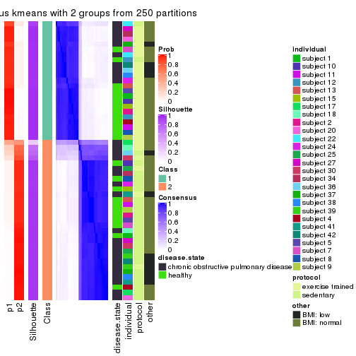</p>

</div>
<div id='tab-CV-kmeans-consensus-heatmap-2'>
<pre><code class="r">consensus_heatmap(res, k = 3)
</code></pre>

<p>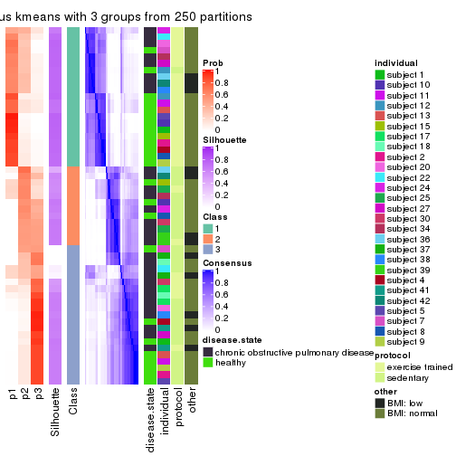</p>

</div>
<div id='tab-CV-kmeans-consensus-heatmap-3'>
<pre><code class="r">consensus_heatmap(res, k = 4)
</code></pre>

<p>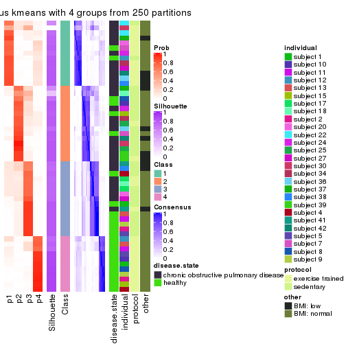</p>

</div>
<div id='tab-CV-kmeans-consensus-heatmap-4'>
<pre><code class="r">consensus_heatmap(res, k = 5)
</code></pre>

<p>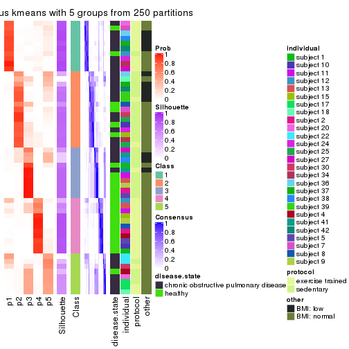</p>

</div>
<div id='tab-CV-kmeans-consensus-heatmap-5'>
<pre><code class="r">consensus_heatmap(res, k = 6)
</code></pre>

<p>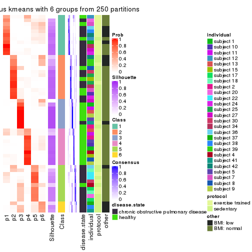</p>

</div>
</div>

Heatmaps for the membership of samples in all partitions to see how consistent they are:


<script>
$( function() {
	$( '#tabs-CV-kmeans-membership-heatmap' ).tabs();
} );
</script>
<div id='tabs-CV-kmeans-membership-heatmap'>
<ul>
<li><a href='#tab-CV-kmeans-membership-heatmap-1'>k = 2</a></li>
<li><a href='#tab-CV-kmeans-membership-heatmap-2'>k = 3</a></li>
<li><a href='#tab-CV-kmeans-membership-heatmap-3'>k = 4</a></li>
<li><a href='#tab-CV-kmeans-membership-heatmap-4'>k = 5</a></li>
<li><a href='#tab-CV-kmeans-membership-heatmap-5'>k = 6</a></li>
</ul>
<div id='tab-CV-kmeans-membership-heatmap-1'>
<pre><code class="r">membership_heatmap(res, k = 2)
</code></pre>

<p>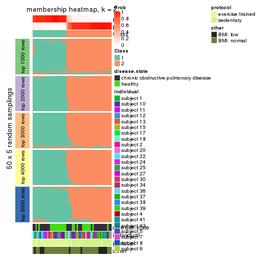</p>

</div>
<div id='tab-CV-kmeans-membership-heatmap-2'>
<pre><code class="r">membership_heatmap(res, k = 3)
</code></pre>

<p>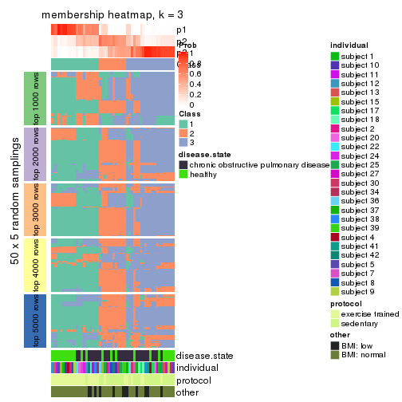</p>

</div>
<div id='tab-CV-kmeans-membership-heatmap-3'>
<pre><code class="r">membership_heatmap(res, k = 4)
</code></pre>

<p>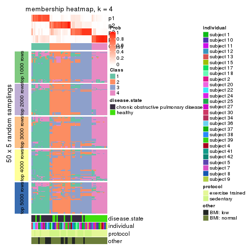</p>

</div>
<div id='tab-CV-kmeans-membership-heatmap-4'>
<pre><code class="r">membership_heatmap(res, k = 5)
</code></pre>

<p>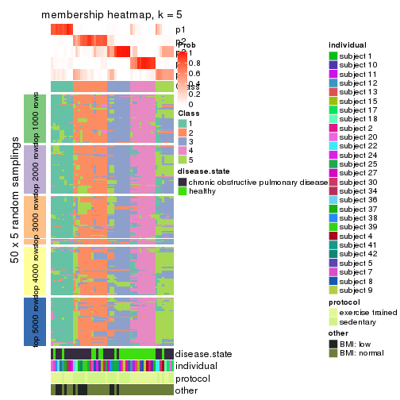</p>

</div>
<div id='tab-CV-kmeans-membership-heatmap-5'>
<pre><code class="r">membership_heatmap(res, k = 6)
</code></pre>

<p>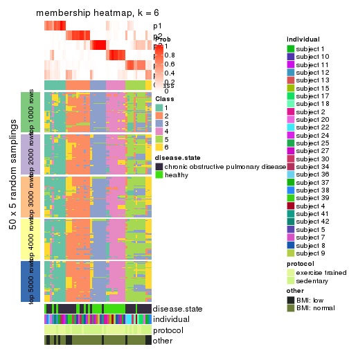</p>

</div>
</div>

As soon as we have had the classes for columns, we can look for signatures
which are significantly different between classes which can be candidate marks
for certain classes. Following are the heatmaps for signatures.


Signature heatmaps where rows are scaled:


<script>
$( function() {
	$( '#tabs-CV-kmeans-get-signatures' ).tabs();
} );
</script>
<div id='tabs-CV-kmeans-get-signatures'>
<ul>
<li><a href='#tab-CV-kmeans-get-signatures-1'>k = 2</a></li>
<li><a href='#tab-CV-kmeans-get-signatures-2'>k = 3</a></li>
<li><a href='#tab-CV-kmeans-get-signatures-3'>k = 4</a></li>
<li><a href='#tab-CV-kmeans-get-signatures-4'>k = 5</a></li>
<li><a href='#tab-CV-kmeans-get-signatures-5'>k = 6</a></li>
</ul>
<div id='tab-CV-kmeans-get-signatures-1'>
<pre><code class="r">get_signatures(res, k = 2)
</code></pre>

<pre><code>#&gt; Error in mat[ceiling(1:nr/h_ratio), ceiling(1:nc/w_ratio), drop = FALSE]: subscript out of bounds
</code></pre>

<p>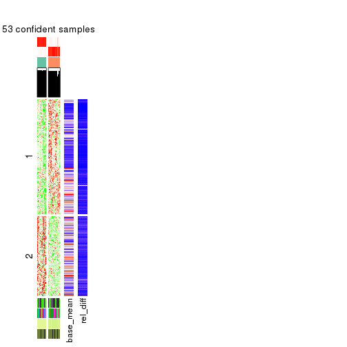</p>

</div>
<div id='tab-CV-kmeans-get-signatures-2'>
<pre><code class="r">get_signatures(res, k = 3)
</code></pre>

<p>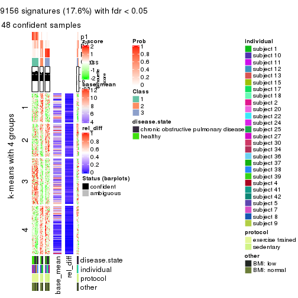</p>

</div>
<div id='tab-CV-kmeans-get-signatures-3'>
<pre><code class="r">get_signatures(res, k = 4)
</code></pre>

<p>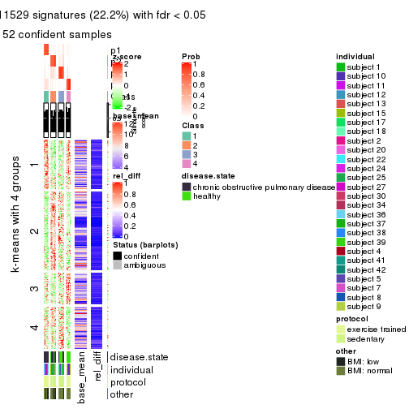</p>

</div>
<div id='tab-CV-kmeans-get-signatures-4'>
<pre><code class="r">get_signatures(res, k = 5)
</code></pre>

<p>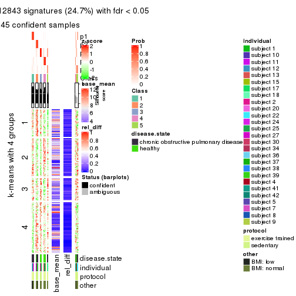</p>

</div>
<div id='tab-CV-kmeans-get-signatures-5'>
<pre><code class="r">get_signatures(res, k = 6)
</code></pre>

<pre><code>#&gt; Error in mat[ceiling(1:nr/h_ratio), ceiling(1:nc/w_ratio), drop = FALSE]: subscript out of bounds
</code></pre>

<p>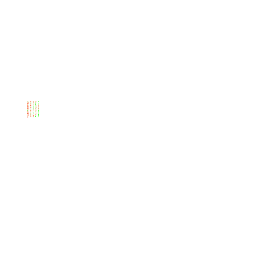</p>

</div>
</div>


Signature heatmaps where rows are not scaled:


<script>
$( function() {
	$( '#tabs-CV-kmeans-get-signatures-no-scale' ).tabs();
} );
</script>
<div id='tabs-CV-kmeans-get-signatures-no-scale'>
<ul>
<li><a href='#tab-CV-kmeans-get-signatures-no-scale-1'>k = 2</a></li>
<li><a href='#tab-CV-kmeans-get-signatures-no-scale-2'>k = 3</a></li>
<li><a href='#tab-CV-kmeans-get-signatures-no-scale-3'>k = 4</a></li>
<li><a href='#tab-CV-kmeans-get-signatures-no-scale-4'>k = 5</a></li>
<li><a href='#tab-CV-kmeans-get-signatures-no-scale-5'>k = 6</a></li>
</ul>
<div id='tab-CV-kmeans-get-signatures-no-scale-1'>
<pre><code class="r">get_signatures(res, k = 2, scale_rows = FALSE)
</code></pre>

<p>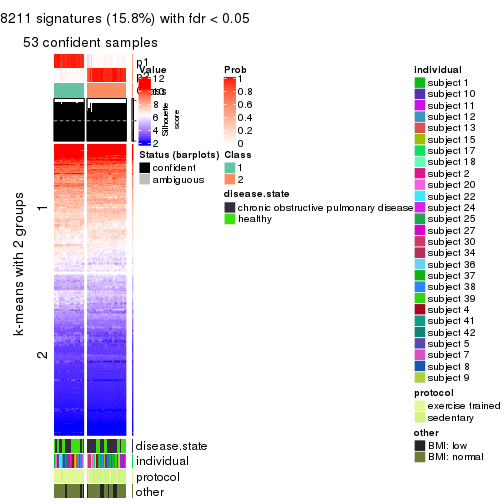</p>

</div>
<div id='tab-CV-kmeans-get-signatures-no-scale-2'>
<pre><code class="r">get_signatures(res, k = 3, scale_rows = FALSE)
</code></pre>

<p>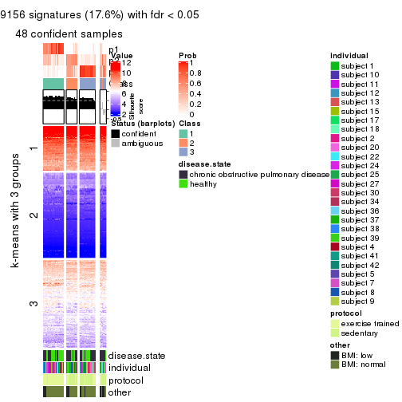</p>

</div>
<div id='tab-CV-kmeans-get-signatures-no-scale-3'>
<pre><code class="r">get_signatures(res, k = 4, scale_rows = FALSE)
</code></pre>

<p>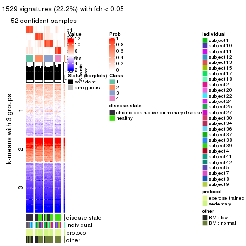</p>

</div>
<div id='tab-CV-kmeans-get-signatures-no-scale-4'>
<pre><code class="r">get_signatures(res, k = 5, scale_rows = FALSE)
</code></pre>

<p>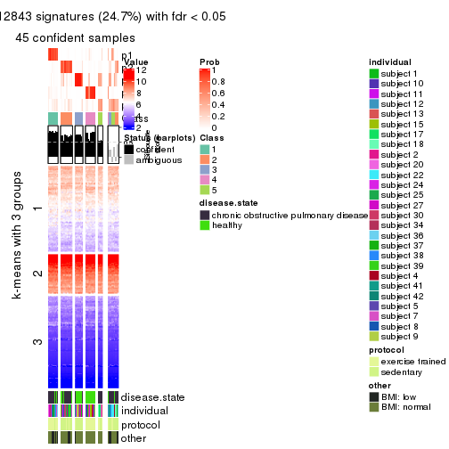</p>

</div>
<div id='tab-CV-kmeans-get-signatures-no-scale-5'>
<pre><code class="r">get_signatures(res, k = 6, scale_rows = FALSE)
</code></pre>

<p>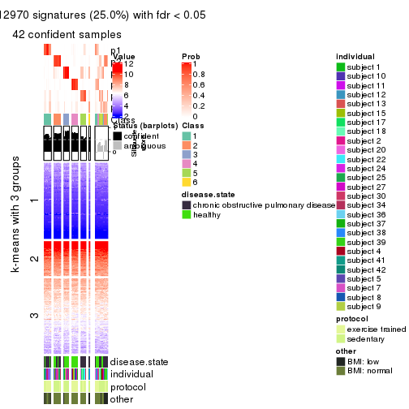</p>

</div>
</div>


Compare the overlap of signatures from different k:

```r
compare_signatures(res)
```

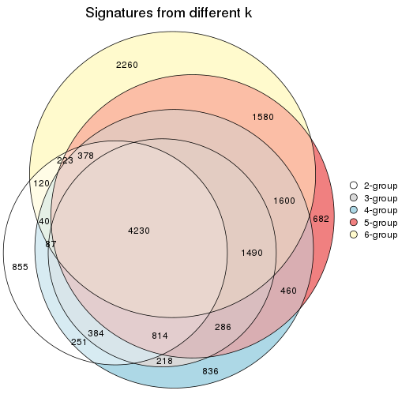

`get_signature()` returns a data frame invisibly. TO get the list of signatures, the function
call should be assigned to a variable explicitly. In following code, if `plot` argument is set
to `FALSE`, no heatmap is plotted while only the differential analysis is performed.

```r
# code only for demonstration
tb = get_signature(res, k = ..., plot = FALSE)
```

An example of the output of `tb` is:

```
#>   which_row         fdr    mean_1    mean_2 scaled_mean_1 scaled_mean_2 km
#> 1        38 0.042760348  8.373488  9.131774    -0.5533452     0.5164555  1
#> 2        40 0.018707592  7.106213  8.469186    -0.6173731     0.5762149  1
#> 3        55 0.019134737 10.221463 11.207825    -0.6159697     0.5749050  1
#> 4        59 0.006059896  5.921854  7.869574    -0.6899429     0.6439467  1
#> 5        60 0.018055526  8.928898 10.211722    -0.6204761     0.5791110  1
#> 6        98 0.009384629 15.714769 14.887706     0.6635654    -0.6193277  2
...
```

The columns in `tb` are:

1. `which_row`: row indices corresponding to the input matrix.
2. `fdr`: FDR for the differential test. 
3. `mean_x`: The mean value in group x.
4. `scaled_mean_x`: The mean value in group x after rows are scaled.
5. `km`: Row groups if k-means clustering is applied to rows.


UMAP plot which shows how samples are separated.


<script>
$( function() {
	$( '#tabs-CV-kmeans-dimension-reduction' ).tabs();
} );
</script>
<div id='tabs-CV-kmeans-dimension-reduction'>
<ul>
<li><a href='#tab-CV-kmeans-dimension-reduction-1'>k = 2</a></li>
<li><a href='#tab-CV-kmeans-dimension-reduction-2'>k = 3</a></li>
<li><a href='#tab-CV-kmeans-dimension-reduction-3'>k = 4</a></li>
<li><a href='#tab-CV-kmeans-dimension-reduction-4'>k = 5</a></li>
<li><a href='#tab-CV-kmeans-dimension-reduction-5'>k = 6</a></li>
</ul>
<div id='tab-CV-kmeans-dimension-reduction-1'>
<pre><code class="r">dimension_reduction(res, k = 2, method = &quot;UMAP&quot;)
</code></pre>

<p>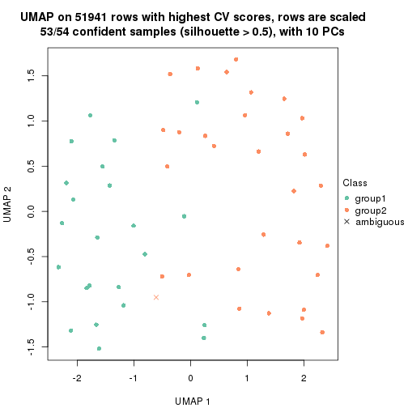</p>

</div>
<div id='tab-CV-kmeans-dimension-reduction-2'>
<pre><code class="r">dimension_reduction(res, k = 3, method = &quot;UMAP&quot;)
</code></pre>

<p>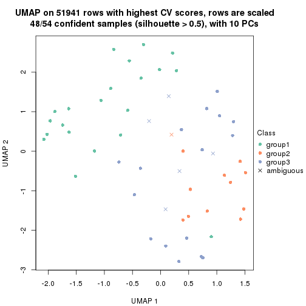</p>

</div>
<div id='tab-CV-kmeans-dimension-reduction-3'>
<pre><code class="r">dimension_reduction(res, k = 4, method = &quot;UMAP&quot;)
</code></pre>

<p>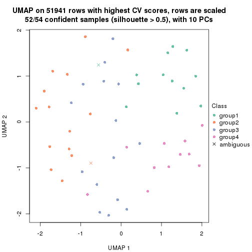</p>

</div>
<div id='tab-CV-kmeans-dimension-reduction-4'>
<pre><code class="r">dimension_reduction(res, k = 5, method = &quot;UMAP&quot;)
</code></pre>

<p>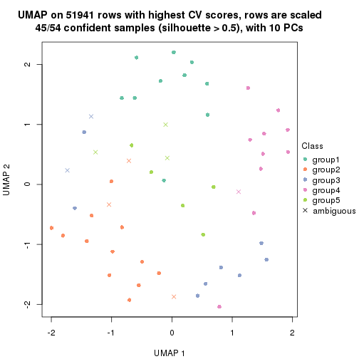</p>

</div>
<div id='tab-CV-kmeans-dimension-reduction-5'>
<pre><code class="r">dimension_reduction(res, k = 6, method = &quot;UMAP&quot;)
</code></pre>

<p>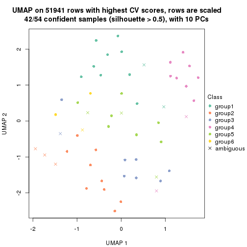</p>

</div>
</div>


Following heatmap shows how subgroups are split when increasing `k`:

```r
collect_classes(res)
```

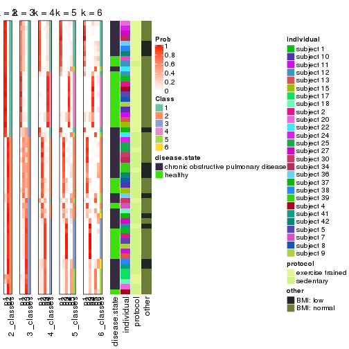


Test correlation between subgroups and known annotations. If the known
annotation is numeric, one-way ANOVA test is applied, and if the known
annotation is discrete, chi-squared contingency table test is applied.

```r
test_to_known_factors(res)
```

```
#>            n disease.state(p) individual(p) protocol(p) other(p) k
#> CV:kmeans 53         0.245708         0.968    3.22e-07  0.63939 2
#> CV:kmeans 48         0.162335         0.637    2.92e-06  0.67059 3
#> CV:kmeans 52         0.000304         0.598    2.38e-06  0.14785 4
#> CV:kmeans 45         0.000208         0.410    2.88e-05  0.12558 5
#> CV:kmeans 42         0.000281         0.434    1.69e-04  0.00135 6
```


If matrix rows can be associated to genes, consider to use `functional_enrichment(res,
...)` to perform function enrichment for the signature genes. See [this vignette](http://bioconductor.org/packages/devel/bioc/vignettes/cola/inst/doc/functional_enrichment.html) for more detailed explanations.


 

---------------------------------------------------


### CV:skmeans**


The object with results only for a single top-value method and a single partition method 
can be extracted as:

```r
res = res_list["CV", "skmeans"]
# you can also extract it by
# res = res_list["CV:skmeans"]
```

A summary of `res` and all the functions that can be applied to it:

```r
res
```

```
#> A 'ConsensusPartition' object with k = 2, 3, 4, 5, 6.
#>   On a matrix with 51941 rows and 54 columns.
#>   Top rows (1000, 2000, 3000, 4000, 5000) are extracted by 'CV' method.
#>   Subgroups are detected by 'skmeans' method.
#>   Performed in total 1250 partitions by row resampling.
#>   Best k for subgroups seems to be 2.
#> 
#> Following methods can be applied to this 'ConsensusPartition' object:
#>  [1] "cola_report"             "collect_classes"         "collect_plots"          
#>  [4] "collect_stats"           "colnames"                "compare_signatures"     
#>  [7] "consensus_heatmap"       "dimension_reduction"     "functional_enrichment"  
#> [10] "get_anno_col"            "get_anno"                "get_classes"            
#> [13] "get_consensus"           "get_matrix"              "get_membership"         
#> [16] "get_param"               "get_signatures"          "get_stats"              
#> [19] "is_best_k"               "is_stable_k"             "membership_heatmap"     
#> [22] "ncol"                    "nrow"                    "plot_ecdf"              
#> [25] "rownames"                "select_partition_number" "show"                   
#> [28] "suggest_best_k"          "test_to_known_factors"
```

`collect_plots()` function collects all the plots made from `res` for all `k` (number of partitions)
into one single page to provide an easy and fast comparison between different `k`.

```r
collect_plots(res)
```

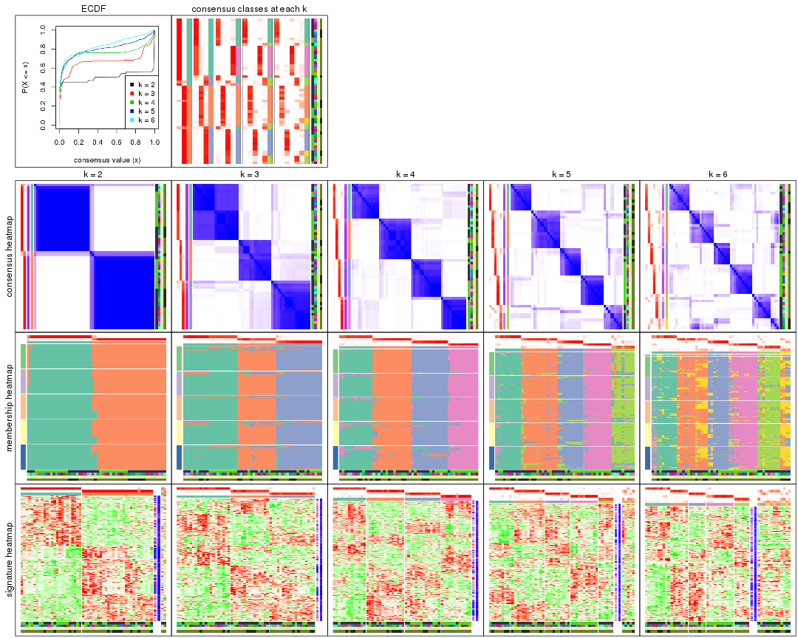

The plots are:

- The first row: a plot of the ECDF (empirical cumulative distribution
  function) curves of the consensus matrix for each `k` and the heatmap of
  predicted classes for each `k`.
- The second row: heatmaps of the consensus matrix for each `k`.
- The third row: heatmaps of the membership matrix for each `k`.
- The fouth row: heatmaps of the signatures for each `k`.

All the plots in panels can be made by individual functions and they are
plotted later in this section.

`select_partition_number()` produces several plots showing different
statistics for choosing "optimized" `k`. There are following statistics:

- ECDF curves of the consensus matrix for each `k`;
- 1-PAC. [The PAC
  score](https://en.wikipedia.org/wiki/Consensus_clustering#Over-interpretation_potential_of_consensus_clustering)
  measures the proportion of the ambiguous subgrouping.
- Mean silhouette score.
- Concordance. The mean probability of fiting the consensus class ids in all
  partitions.
- Area increased. Denote $A_k$ as the area under the ECDF curve for current
  `k`, the area increased is defined as $A_k - A_{k-1}$.
- Rand index. The percent of pairs of samples that are both in a same cluster
  or both are not in a same cluster in the partition of k and k-1.
- Jaccard index. The ratio of pairs of samples are both in a same cluster in
  the partition of k and k-1 and the pairs of samples are both in a same
  cluster in the partition k or k-1.

The detailed explanations of these statistics can be found in [the _cola_
vignette](http://bioconductor.org/packages/devel/bioc/vignettes/cola/inst/doc/cola.html#toc_13).

Generally speaking, lower PAC score, higher mean silhouette score or higher
concordance corresponds to better partition. Rand index and Jaccard index
measure how similar the current partition is compared to partition with `k-1`.
If they are too similar, we won't accept `k` is better than `k-1`.

```r
select_partition_number(res)
```

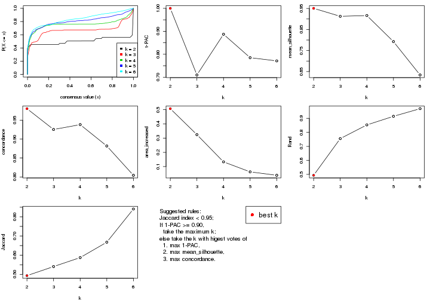

The numeric values for all these statistics can be obtained by `get_stats()`.

```r
get_stats(res)
```

```
#>   k 1-PAC mean_silhouette concordance area_increased  Rand Jaccard
#> 2 2 1.000           0.951       0.980         0.5070 0.493   0.493
#> 3 3 0.710           0.913       0.925         0.3244 0.755   0.541
#> 4 4 0.887           0.916       0.938         0.1330 0.853   0.587
#> 5 5 0.785           0.792       0.882         0.0627 0.915   0.668
#> 6 6 0.771           0.634       0.804         0.0386 0.969   0.841
```

`suggest_best_k()` suggests the best $k$ based on these statistics. The rules are as follows:

- All $k$ with Jaccard index larger than 0.95 are removed because increasing
  $k$ does not provide enough extra information. If all $k$ are removed, it is
  marked as no subgroup is detected.
- For all $k$ with 1-PAC score larger than 0.9, the maximal $k$ is taken as
  the best $k$, and other $k$ are marked as optional $k$.
- If it does not fit the second rule. The $k$ with the maximal vote of the
  highest 1-PAC score, highest mean silhouette, and highest concordance is
  taken as the best $k$.

```r
suggest_best_k(res)
```

```
#> [1] 2
```


Following shows the table of the partitions (You need to click the **show/hide
code output** link to see it). The membership matrix (columns with name `p*`)
is inferred by
[`clue::cl_consensus()`](https://www.rdocumentation.org/link/cl_consensus?package=clue)
function with the `SE` method. Basically the value in the membership matrix
represents the probability to belong to a certain group. The finall class
label for an item is determined with the group with highest probability it
belongs to.

In `get_classes()` function, the entropy is calculated from the membership
matrix and the silhouette score is calculated from the consensus matrix.


<script>
$( function() {
	$( '#tabs-CV-skmeans-get-classes' ).tabs();
} );
</script>
<div id='tabs-CV-skmeans-get-classes'>
<ul>
<li><a href='#tab-CV-skmeans-get-classes-1'>k = 2</a></li>
<li><a href='#tab-CV-skmeans-get-classes-2'>k = 3</a></li>
<li><a href='#tab-CV-skmeans-get-classes-3'>k = 4</a></li>
<li><a href='#tab-CV-skmeans-get-classes-4'>k = 5</a></li>
<li><a href='#tab-CV-skmeans-get-classes-5'>k = 6</a></li>
</ul>

<div id='tab-CV-skmeans-get-classes-1'>
<p><a id='tab-CV-skmeans-get-classes-1-a' style='color:#0366d6' href='#'>show/hide code output</a></p>
<pre><code class="r">cbind(get_classes(res, k = 2), get_membership(res, k = 2))
</code></pre>

<pre><code>#&gt;           class entropy silhouette    p1    p2
#&gt; GSM680053     2  0.0000      0.975 0.000 1.000
#&gt; GSM680062     1  0.1843      0.957 0.972 0.028
#&gt; GSM680054     2  0.0000      0.975 0.000 1.000
#&gt; GSM680063     1  0.9393      0.427 0.644 0.356
#&gt; GSM680055     2  0.0000      0.975 0.000 1.000
#&gt; GSM680064     1  0.0000      0.983 1.000 0.000
#&gt; GSM680056     1  0.0376      0.980 0.996 0.004
#&gt; GSM680065     1  0.0000      0.983 1.000 0.000
#&gt; GSM680057     2  0.0000      0.975 0.000 1.000
#&gt; GSM680066     1  0.0000      0.983 1.000 0.000
#&gt; GSM680058     2  0.0000      0.975 0.000 1.000
#&gt; GSM680067     2  0.0938      0.965 0.012 0.988
#&gt; GSM680059     2  0.0000      0.975 0.000 1.000
#&gt; GSM680068     1  0.0000      0.983 1.000 0.000
#&gt; GSM680060     2  0.0000      0.975 0.000 1.000
#&gt; GSM680069     2  0.9460      0.433 0.364 0.636
#&gt; GSM680061     2  0.0000      0.975 0.000 1.000
#&gt; GSM680070     1  0.0000      0.983 1.000 0.000
#&gt; GSM680071     2  0.8763      0.579 0.296 0.704
#&gt; GSM680077     1  0.0000      0.983 1.000 0.000
#&gt; GSM680072     2  0.0000      0.975 0.000 1.000
#&gt; GSM680078     1  0.0000      0.983 1.000 0.000
#&gt; GSM680073     2  0.0000      0.975 0.000 1.000
#&gt; GSM680079     1  0.0000      0.983 1.000 0.000
#&gt; GSM680074     2  0.0000      0.975 0.000 1.000
#&gt; GSM680080     2  0.0000      0.975 0.000 1.000
#&gt; GSM680075     2  0.0000      0.975 0.000 1.000
#&gt; GSM680081     2  0.0000      0.975 0.000 1.000
#&gt; GSM680076     2  0.0000      0.975 0.000 1.000
#&gt; GSM680082     1  0.0000      0.983 1.000 0.000
#&gt; GSM680029     2  0.0000      0.975 0.000 1.000
#&gt; GSM680041     1  0.0000      0.983 1.000 0.000
#&gt; GSM680035     2  0.0000      0.975 0.000 1.000
#&gt; GSM680047     1  0.0000      0.983 1.000 0.000
#&gt; GSM680036     2  0.0000      0.975 0.000 1.000
#&gt; GSM680048     1  0.0000      0.983 1.000 0.000
#&gt; GSM680037     2  0.0000      0.975 0.000 1.000
#&gt; GSM680049     1  0.0000      0.983 1.000 0.000
#&gt; GSM680038     2  0.0000      0.975 0.000 1.000
#&gt; GSM680050     1  0.0000      0.983 1.000 0.000
#&gt; GSM680039     2  0.0000      0.975 0.000 1.000
#&gt; GSM680051     1  0.0000      0.983 1.000 0.000
#&gt; GSM680040     2  0.0000      0.975 0.000 1.000
#&gt; GSM680052     1  0.0000      0.983 1.000 0.000
#&gt; GSM680030     2  0.0000      0.975 0.000 1.000
#&gt; GSM680042     1  0.0000      0.983 1.000 0.000
#&gt; GSM680031     2  0.0000      0.975 0.000 1.000
#&gt; GSM680043     1  0.0000      0.983 1.000 0.000
#&gt; GSM680032     1  0.0000      0.983 1.000 0.000
#&gt; GSM680044     1  0.0000      0.983 1.000 0.000
#&gt; GSM680033     2  0.0000      0.975 0.000 1.000
#&gt; GSM680045     1  0.0000      0.983 1.000 0.000
#&gt; GSM680034     2  0.0000      0.975 0.000 1.000
#&gt; GSM680046     1  0.0000      0.983 1.000 0.000
</code></pre>

<script>
$('#tab-CV-skmeans-get-classes-1-a').parent().next().next().hide();
$('#tab-CV-skmeans-get-classes-1-a').click(function(){
  $('#tab-CV-skmeans-get-classes-1-a').parent().next().next().toggle();
  return(false);
});
</script>
</div>

<div id='tab-CV-skmeans-get-classes-2'>
<p><a id='tab-CV-skmeans-get-classes-2-a' style='color:#0366d6' href='#'>show/hide code output</a></p>
<pre><code class="r">cbind(get_classes(res, k = 3), get_membership(res, k = 3))
</code></pre>

<pre><code>#&gt;           class entropy silhouette    p1    p2    p3
#&gt; GSM680053     3  0.0592      0.931 0.000 0.012 0.988
#&gt; GSM680062     3  0.3539      0.862 0.012 0.100 0.888
#&gt; GSM680054     2  0.4702      0.849 0.000 0.788 0.212
#&gt; GSM680063     3  0.1832      0.921 0.008 0.036 0.956
#&gt; GSM680055     3  0.0829      0.931 0.004 0.012 0.984
#&gt; GSM680064     1  0.0237      0.932 0.996 0.000 0.004
#&gt; GSM680056     3  0.4692      0.809 0.168 0.012 0.820
#&gt; GSM680065     1  0.1031      0.925 0.976 0.000 0.024
#&gt; GSM680057     2  0.3267      0.928 0.000 0.884 0.116
#&gt; GSM680066     1  0.1399      0.922 0.968 0.004 0.028
#&gt; GSM680058     2  0.3192      0.930 0.000 0.888 0.112
#&gt; GSM680067     2  0.0829      0.880 0.004 0.984 0.012
#&gt; GSM680059     3  0.1163      0.931 0.000 0.028 0.972
#&gt; GSM680068     1  0.0424      0.932 0.992 0.000 0.008
#&gt; GSM680060     2  0.3530      0.923 0.032 0.900 0.068
#&gt; GSM680069     3  0.3845      0.850 0.116 0.012 0.872
#&gt; GSM680061     2  0.1129      0.885 0.004 0.976 0.020
#&gt; GSM680070     1  0.0592      0.931 0.988 0.000 0.012
#&gt; GSM680071     2  0.3752      0.872 0.096 0.884 0.020
#&gt; GSM680077     1  0.0592      0.931 0.988 0.000 0.012
#&gt; GSM680072     2  0.4178      0.890 0.000 0.828 0.172
#&gt; GSM680078     3  0.5982      0.589 0.328 0.004 0.668
#&gt; GSM680073     3  0.1411      0.928 0.000 0.036 0.964
#&gt; GSM680079     1  0.0592      0.931 0.988 0.000 0.012
#&gt; GSM680074     2  0.3267      0.926 0.000 0.884 0.116
#&gt; GSM680080     2  0.3267      0.926 0.000 0.884 0.116
#&gt; GSM680075     3  0.0747      0.931 0.000 0.016 0.984
#&gt; GSM680081     3  0.2031      0.922 0.032 0.016 0.952
#&gt; GSM680076     2  0.3618      0.880 0.104 0.884 0.012
#&gt; GSM680082     1  0.0592      0.931 0.988 0.000 0.012
#&gt; GSM680029     3  0.0747      0.933 0.000 0.016 0.984
#&gt; GSM680041     1  0.3267      0.936 0.884 0.116 0.000
#&gt; GSM680035     3  0.1031      0.933 0.000 0.024 0.976
#&gt; GSM680047     1  0.3267      0.936 0.884 0.116 0.000
#&gt; GSM680036     3  0.0747      0.931 0.000 0.016 0.984
#&gt; GSM680048     1  0.3267      0.936 0.884 0.116 0.000
#&gt; GSM680037     3  0.1031      0.933 0.000 0.024 0.976
#&gt; GSM680049     1  0.3192      0.937 0.888 0.112 0.000
#&gt; GSM680038     2  0.3192      0.930 0.000 0.888 0.112
#&gt; GSM680050     1  0.0237      0.932 0.996 0.000 0.004
#&gt; GSM680039     2  0.3412      0.927 0.000 0.876 0.124
#&gt; GSM680051     1  0.3682      0.934 0.876 0.116 0.008
#&gt; GSM680040     3  0.1031      0.933 0.000 0.024 0.976
#&gt; GSM680052     1  0.3682      0.934 0.876 0.116 0.008
#&gt; GSM680030     2  0.2959      0.930 0.000 0.900 0.100
#&gt; GSM680042     1  0.3116      0.937 0.892 0.108 0.000
#&gt; GSM680031     3  0.1031      0.933 0.000 0.024 0.976
#&gt; GSM680043     1  0.3682      0.934 0.876 0.116 0.008
#&gt; GSM680032     1  0.0829      0.930 0.984 0.004 0.012
#&gt; GSM680044     1  0.2878      0.938 0.904 0.096 0.000
#&gt; GSM680033     3  0.1031      0.933 0.000 0.024 0.976
#&gt; GSM680045     1  0.3682      0.934 0.876 0.116 0.008
#&gt; GSM680034     2  0.0829      0.880 0.004 0.984 0.012
#&gt; GSM680046     1  0.3267      0.936 0.884 0.116 0.000
</code></pre>

<script>
$('#tab-CV-skmeans-get-classes-2-a').parent().next().next().hide();
$('#tab-CV-skmeans-get-classes-2-a').click(function(){
  $('#tab-CV-skmeans-get-classes-2-a').parent().next().next().toggle();
  return(false);
});
</script>
</div>

<div id='tab-CV-skmeans-get-classes-3'>
<p><a id='tab-CV-skmeans-get-classes-3-a' style='color:#0366d6' href='#'>show/hide code output</a></p>
<pre><code class="r">cbind(get_classes(res, k = 4), get_membership(res, k = 4))
</code></pre>

<pre><code>#&gt;           class entropy silhouette    p1    p2    p3    p4
#&gt; GSM680053     3  0.3067      0.905 0.084 0.024 0.888 0.004
#&gt; GSM680062     4  0.5967      0.564 0.080 0.004 0.236 0.680
#&gt; GSM680054     2  0.4944      0.750 0.072 0.768 0.160 0.000
#&gt; GSM680063     3  0.5648      0.745 0.088 0.012 0.740 0.160
#&gt; GSM680055     3  0.3264      0.898 0.096 0.024 0.876 0.004
#&gt; GSM680064     1  0.3311      0.880 0.828 0.000 0.000 0.172
#&gt; GSM680056     1  0.2715      0.869 0.916 0.016 0.032 0.036
#&gt; GSM680065     1  0.1492      0.895 0.956 0.004 0.004 0.036
#&gt; GSM680057     2  0.0707      0.954 0.000 0.980 0.020 0.000
#&gt; GSM680066     1  0.2751      0.916 0.904 0.000 0.040 0.056
#&gt; GSM680058     2  0.0336      0.951 0.000 0.992 0.008 0.000
#&gt; GSM680067     2  0.1174      0.951 0.000 0.968 0.020 0.012
#&gt; GSM680059     3  0.1118      0.942 0.000 0.036 0.964 0.000
#&gt; GSM680068     1  0.2281      0.921 0.904 0.000 0.000 0.096
#&gt; GSM680060     2  0.0188      0.953 0.000 0.996 0.004 0.000
#&gt; GSM680069     1  0.3663      0.818 0.864 0.020 0.096 0.020
#&gt; GSM680061     2  0.0895      0.953 0.000 0.976 0.020 0.004
#&gt; GSM680070     1  0.1940      0.929 0.924 0.000 0.000 0.076
#&gt; GSM680071     2  0.2231      0.920 0.044 0.932 0.012 0.012
#&gt; GSM680077     1  0.1792      0.929 0.932 0.000 0.000 0.068
#&gt; GSM680072     2  0.3441      0.848 0.024 0.856 0.120 0.000
#&gt; GSM680078     1  0.2174      0.907 0.928 0.000 0.052 0.020
#&gt; GSM680073     3  0.2032      0.937 0.028 0.036 0.936 0.000
#&gt; GSM680079     1  0.1940      0.929 0.924 0.000 0.000 0.076
#&gt; GSM680074     2  0.0336      0.955 0.000 0.992 0.008 0.000
#&gt; GSM680080     2  0.0336      0.955 0.000 0.992 0.008 0.000
#&gt; GSM680075     3  0.1677      0.938 0.040 0.012 0.948 0.000
#&gt; GSM680081     3  0.1452      0.934 0.036 0.008 0.956 0.000
#&gt; GSM680076     2  0.0707      0.948 0.020 0.980 0.000 0.000
#&gt; GSM680082     1  0.1940      0.929 0.924 0.000 0.000 0.076
#&gt; GSM680029     3  0.0937      0.946 0.012 0.012 0.976 0.000
#&gt; GSM680041     4  0.0188      0.950 0.004 0.000 0.000 0.996
#&gt; GSM680035     3  0.0469      0.948 0.000 0.012 0.988 0.000
#&gt; GSM680047     4  0.0000      0.952 0.000 0.000 0.000 1.000
#&gt; GSM680036     3  0.2174      0.926 0.052 0.020 0.928 0.000
#&gt; GSM680048     4  0.0000      0.952 0.000 0.000 0.000 1.000
#&gt; GSM680037     3  0.0469      0.948 0.000 0.012 0.988 0.000
#&gt; GSM680049     4  0.0188      0.952 0.004 0.000 0.000 0.996
#&gt; GSM680038     2  0.0188      0.953 0.000 0.996 0.004 0.000
#&gt; GSM680050     1  0.3764      0.824 0.784 0.000 0.000 0.216
#&gt; GSM680039     2  0.1867      0.927 0.000 0.928 0.072 0.000
#&gt; GSM680051     4  0.0000      0.952 0.000 0.000 0.000 1.000
#&gt; GSM680040     3  0.0469      0.948 0.000 0.012 0.988 0.000
#&gt; GSM680052     4  0.0000      0.952 0.000 0.000 0.000 1.000
#&gt; GSM680030     2  0.0707      0.954 0.000 0.980 0.020 0.000
#&gt; GSM680042     4  0.0188      0.952 0.004 0.000 0.000 0.996
#&gt; GSM680031     3  0.0469      0.948 0.000 0.012 0.988 0.000
#&gt; GSM680043     4  0.1798      0.932 0.040 0.000 0.016 0.944
#&gt; GSM680032     1  0.2088      0.929 0.928 0.004 0.004 0.064
#&gt; GSM680044     4  0.1302      0.933 0.044 0.000 0.000 0.956
#&gt; GSM680033     3  0.0469      0.948 0.000 0.012 0.988 0.000
#&gt; GSM680045     4  0.1624      0.935 0.028 0.000 0.020 0.952
#&gt; GSM680034     2  0.1297      0.950 0.000 0.964 0.020 0.016
#&gt; GSM680046     4  0.0817      0.944 0.024 0.000 0.000 0.976
</code></pre>

<script>
$('#tab-CV-skmeans-get-classes-3-a').parent().next().next().hide();
$('#tab-CV-skmeans-get-classes-3-a').click(function(){
  $('#tab-CV-skmeans-get-classes-3-a').parent().next().next().toggle();
  return(false);
});
</script>
</div>

<div id='tab-CV-skmeans-get-classes-4'>
<p><a id='tab-CV-skmeans-get-classes-4-a' style='color:#0366d6' href='#'>show/hide code output</a></p>
<pre><code class="r">cbind(get_classes(res, k = 5), get_membership(res, k = 5))
</code></pre>

<pre><code>#&gt;           class entropy silhouette    p1    p2    p3    p4    p5
#&gt; GSM680053     5  0.2690      0.700 0.000 0.000 0.156 0.000 0.844
#&gt; GSM680062     5  0.4469      0.667 0.000 0.000 0.096 0.148 0.756
#&gt; GSM680054     5  0.5500      0.247 0.000 0.376 0.072 0.000 0.552
#&gt; GSM680063     5  0.3681      0.706 0.000 0.000 0.148 0.044 0.808
#&gt; GSM680055     5  0.2488      0.713 0.004 0.000 0.124 0.000 0.872
#&gt; GSM680064     1  0.3574      0.781 0.804 0.000 0.000 0.168 0.028
#&gt; GSM680056     5  0.3053      0.682 0.164 0.000 0.008 0.000 0.828
#&gt; GSM680065     5  0.4278      0.162 0.452 0.000 0.000 0.000 0.548
#&gt; GSM680057     2  0.1357      0.861 0.000 0.948 0.048 0.000 0.004
#&gt; GSM680066     1  0.1710      0.903 0.944 0.000 0.020 0.024 0.012
#&gt; GSM680058     2  0.1410      0.869 0.000 0.940 0.000 0.000 0.060
#&gt; GSM680067     2  0.1883      0.856 0.000 0.932 0.012 0.048 0.008
#&gt; GSM680059     3  0.3037      0.823 0.000 0.040 0.860 0.000 0.100
#&gt; GSM680068     1  0.1205      0.903 0.956 0.000 0.000 0.040 0.004
#&gt; GSM680060     2  0.0963      0.872 0.000 0.964 0.000 0.000 0.036
#&gt; GSM680069     5  0.3111      0.698 0.144 0.004 0.012 0.000 0.840
#&gt; GSM680061     2  0.1356      0.865 0.000 0.956 0.012 0.028 0.004
#&gt; GSM680070     1  0.0579      0.911 0.984 0.000 0.000 0.008 0.008
#&gt; GSM680071     2  0.4642      0.499 0.020 0.648 0.000 0.004 0.328
#&gt; GSM680077     1  0.0510      0.909 0.984 0.000 0.000 0.000 0.016
#&gt; GSM680072     2  0.4114      0.688 0.000 0.732 0.024 0.000 0.244
#&gt; GSM680078     1  0.2228      0.864 0.912 0.000 0.040 0.000 0.048
#&gt; GSM680073     3  0.5807      0.596 0.008 0.128 0.628 0.000 0.236
#&gt; GSM680079     1  0.0566      0.910 0.984 0.000 0.000 0.004 0.012
#&gt; GSM680074     2  0.1341      0.869 0.000 0.944 0.000 0.000 0.056
#&gt; GSM680080     2  0.1478      0.867 0.000 0.936 0.000 0.000 0.064
#&gt; GSM680075     3  0.5241      0.650 0.012 0.064 0.672 0.000 0.252
#&gt; GSM680081     3  0.1012      0.877 0.020 0.000 0.968 0.000 0.012
#&gt; GSM680076     2  0.2616      0.851 0.036 0.888 0.000 0.000 0.076
#&gt; GSM680082     1  0.0290      0.909 0.992 0.000 0.000 0.000 0.008
#&gt; GSM680029     3  0.1571      0.866 0.000 0.004 0.936 0.000 0.060
#&gt; GSM680041     4  0.0451      0.944 0.004 0.000 0.000 0.988 0.008
#&gt; GSM680035     3  0.0404      0.886 0.000 0.000 0.988 0.000 0.012
#&gt; GSM680047     4  0.0324      0.945 0.004 0.000 0.000 0.992 0.004
#&gt; GSM680036     5  0.4726      0.191 0.000 0.020 0.400 0.000 0.580
#&gt; GSM680048     4  0.0162      0.945 0.004 0.000 0.000 0.996 0.000
#&gt; GSM680037     3  0.0404      0.886 0.000 0.000 0.988 0.000 0.012
#&gt; GSM680049     4  0.1041      0.933 0.032 0.000 0.000 0.964 0.004
#&gt; GSM680038     2  0.1205      0.869 0.000 0.956 0.004 0.000 0.040
#&gt; GSM680050     1  0.4404      0.669 0.712 0.000 0.000 0.252 0.036
#&gt; GSM680039     2  0.4327      0.450 0.000 0.632 0.360 0.000 0.008
#&gt; GSM680051     4  0.0324      0.944 0.000 0.004 0.000 0.992 0.004
#&gt; GSM680040     3  0.0162      0.886 0.000 0.000 0.996 0.000 0.004
#&gt; GSM680052     4  0.0000      0.945 0.000 0.000 0.000 1.000 0.000
#&gt; GSM680030     2  0.1369      0.867 0.008 0.956 0.028 0.000 0.008
#&gt; GSM680042     4  0.0693      0.943 0.012 0.000 0.000 0.980 0.008
#&gt; GSM680031     3  0.0794      0.879 0.000 0.000 0.972 0.000 0.028
#&gt; GSM680043     4  0.3950      0.834 0.076 0.000 0.080 0.824 0.020
#&gt; GSM680032     1  0.1041      0.902 0.964 0.000 0.000 0.004 0.032
#&gt; GSM680044     4  0.3985      0.741 0.196 0.000 0.004 0.772 0.028
#&gt; GSM680033     3  0.0404      0.886 0.000 0.000 0.988 0.000 0.012
#&gt; GSM680045     4  0.2131      0.905 0.008 0.000 0.056 0.920 0.016
#&gt; GSM680034     2  0.2992      0.826 0.000 0.876 0.044 0.072 0.008
#&gt; GSM680046     4  0.0324      0.943 0.004 0.000 0.000 0.992 0.004
</code></pre>

<script>
$('#tab-CV-skmeans-get-classes-4-a').parent().next().next().hide();
$('#tab-CV-skmeans-get-classes-4-a').click(function(){
  $('#tab-CV-skmeans-get-classes-4-a').parent().next().next().toggle();
  return(false);
});
</script>
</div>

<div id='tab-CV-skmeans-get-classes-5'>
<p><a id='tab-CV-skmeans-get-classes-5-a' style='color:#0366d6' href='#'>show/hide code output</a></p>
<pre><code class="r">cbind(get_classes(res, k = 6), get_membership(res, k = 6))
</code></pre>

<pre><code>#&gt;           class entropy silhouette    p1    p2    p3    p4    p5    p6
#&gt; GSM680053     5  0.1549     0.7626 0.000 0.000 0.044 0.000 0.936 0.020
#&gt; GSM680062     5  0.2669     0.7402 0.000 0.000 0.032 0.072 0.880 0.016
#&gt; GSM680054     5  0.5157     0.4145 0.000 0.284 0.024 0.000 0.624 0.068
#&gt; GSM680063     5  0.1838     0.7622 0.000 0.000 0.040 0.020 0.928 0.012
#&gt; GSM680055     5  0.1370     0.7652 0.004 0.000 0.036 0.000 0.948 0.012
#&gt; GSM680064     1  0.4563     0.6483 0.700 0.000 0.000 0.232 0.028 0.040
#&gt; GSM680056     5  0.2461     0.7488 0.044 0.000 0.000 0.004 0.888 0.064
#&gt; GSM680065     5  0.4822     0.4242 0.308 0.000 0.000 0.004 0.620 0.068
#&gt; GSM680057     2  0.1049     0.6379 0.000 0.960 0.032 0.000 0.000 0.008
#&gt; GSM680066     1  0.2669     0.8192 0.864 0.000 0.024 0.004 0.000 0.108
#&gt; GSM680058     2  0.3742     0.4080 0.000 0.648 0.000 0.000 0.004 0.348
#&gt; GSM680067     2  0.1708     0.6374 0.000 0.932 0.004 0.024 0.000 0.040
#&gt; GSM680059     3  0.3903     0.4527 0.000 0.012 0.680 0.000 0.004 0.304
#&gt; GSM680068     1  0.2009     0.8334 0.904 0.000 0.000 0.008 0.004 0.084
#&gt; GSM680060     2  0.3330     0.5029 0.000 0.716 0.000 0.000 0.000 0.284
#&gt; GSM680069     5  0.2772     0.7457 0.040 0.000 0.000 0.004 0.864 0.092
#&gt; GSM680061     2  0.1232     0.6422 0.000 0.956 0.004 0.016 0.000 0.024
#&gt; GSM680070     1  0.1285     0.8393 0.944 0.000 0.000 0.004 0.000 0.052
#&gt; GSM680071     2  0.6633     0.1265 0.016 0.396 0.000 0.008 0.308 0.272
#&gt; GSM680077     1  0.1644     0.8303 0.932 0.000 0.000 0.000 0.028 0.040
#&gt; GSM680072     6  0.5678     0.2037 0.000 0.296 0.036 0.000 0.092 0.576
#&gt; GSM680078     1  0.3461     0.7566 0.804 0.000 0.036 0.000 0.008 0.152
#&gt; GSM680073     6  0.5746     0.3432 0.004 0.036 0.344 0.000 0.072 0.544
#&gt; GSM680079     1  0.0748     0.8377 0.976 0.000 0.000 0.004 0.004 0.016
#&gt; GSM680074     2  0.3727     0.3286 0.000 0.612 0.000 0.000 0.000 0.388
#&gt; GSM680080     2  0.3890     0.2931 0.000 0.596 0.000 0.000 0.004 0.400
#&gt; GSM680075     6  0.5581     0.1854 0.008 0.016 0.408 0.000 0.068 0.500
#&gt; GSM680081     3  0.1080     0.8739 0.004 0.004 0.960 0.000 0.000 0.032
#&gt; GSM680076     6  0.4820    -0.3154 0.036 0.464 0.000 0.000 0.008 0.492
#&gt; GSM680082     1  0.1895     0.8289 0.912 0.000 0.000 0.000 0.016 0.072
#&gt; GSM680029     3  0.2810     0.7457 0.000 0.004 0.832 0.000 0.008 0.156
#&gt; GSM680041     4  0.0520     0.8641 0.000 0.000 0.000 0.984 0.008 0.008
#&gt; GSM680035     3  0.0964     0.8823 0.000 0.012 0.968 0.000 0.016 0.004
#&gt; GSM680047     4  0.0291     0.8653 0.000 0.000 0.000 0.992 0.004 0.004
#&gt; GSM680036     5  0.6140     0.0702 0.000 0.008 0.260 0.000 0.460 0.272
#&gt; GSM680048     4  0.0260     0.8666 0.000 0.000 0.000 0.992 0.000 0.008
#&gt; GSM680037     3  0.0603     0.8857 0.000 0.000 0.980 0.000 0.016 0.004
#&gt; GSM680049     4  0.1151     0.8555 0.032 0.000 0.000 0.956 0.000 0.012
#&gt; GSM680038     2  0.3240     0.5926 0.000 0.820 0.008 0.000 0.028 0.144
#&gt; GSM680050     1  0.5481     0.5116 0.596 0.000 0.000 0.296 0.044 0.064
#&gt; GSM680039     2  0.4206     0.2447 0.000 0.620 0.356 0.000 0.000 0.024
#&gt; GSM680051     4  0.1003     0.8639 0.000 0.016 0.000 0.964 0.000 0.020
#&gt; GSM680040     3  0.0520     0.8834 0.000 0.000 0.984 0.000 0.008 0.008
#&gt; GSM680052     4  0.0790     0.8642 0.000 0.000 0.000 0.968 0.000 0.032
#&gt; GSM680030     2  0.2150     0.6241 0.004 0.912 0.016 0.004 0.004 0.060
#&gt; GSM680042     4  0.1332     0.8553 0.012 0.000 0.000 0.952 0.008 0.028
#&gt; GSM680031     3  0.1624     0.8557 0.000 0.004 0.936 0.000 0.020 0.040
#&gt; GSM680043     4  0.7279     0.5055 0.172 0.008 0.124 0.516 0.016 0.164
#&gt; GSM680032     1  0.4380     0.7631 0.764 0.020 0.000 0.012 0.060 0.144
#&gt; GSM680044     4  0.6120     0.5028 0.224 0.000 0.016 0.580 0.024 0.156
#&gt; GSM680033     3  0.0458     0.8858 0.000 0.000 0.984 0.000 0.016 0.000
#&gt; GSM680045     4  0.5464     0.7301 0.036 0.012 0.088 0.704 0.016 0.144
#&gt; GSM680034     2  0.2919     0.5973 0.000 0.872 0.044 0.044 0.000 0.040
#&gt; GSM680046     4  0.2527     0.8363 0.032 0.000 0.000 0.880 0.004 0.084
</code></pre>

<script>
$('#tab-CV-skmeans-get-classes-5-a').parent().next().next().hide();
$('#tab-CV-skmeans-get-classes-5-a').click(function(){
  $('#tab-CV-skmeans-get-classes-5-a').parent().next().next().toggle();
  return(false);
});
</script>
</div>
</div>

Heatmaps for the consensus matrix. It visualizes the probability of two
samples to be in a same group.


<script>
$( function() {
	$( '#tabs-CV-skmeans-consensus-heatmap' ).tabs();
} );
</script>
<div id='tabs-CV-skmeans-consensus-heatmap'>
<ul>
<li><a href='#tab-CV-skmeans-consensus-heatmap-1'>k = 2</a></li>
<li><a href='#tab-CV-skmeans-consensus-heatmap-2'>k = 3</a></li>
<li><a href='#tab-CV-skmeans-consensus-heatmap-3'>k = 4</a></li>
<li><a href='#tab-CV-skmeans-consensus-heatmap-4'>k = 5</a></li>
<li><a href='#tab-CV-skmeans-consensus-heatmap-5'>k = 6</a></li>
</ul>
<div id='tab-CV-skmeans-consensus-heatmap-1'>
<pre><code class="r">consensus_heatmap(res, k = 2)
</code></pre>

<p>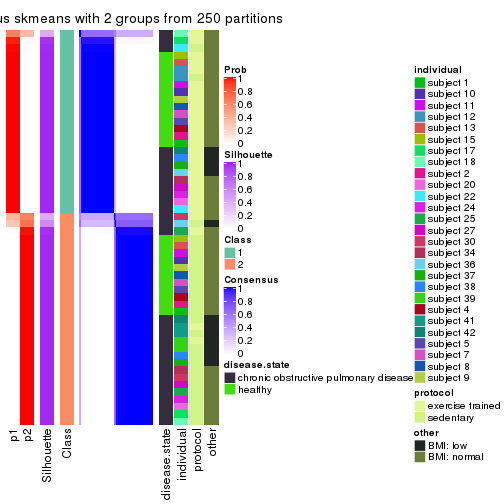</p>

</div>
<div id='tab-CV-skmeans-consensus-heatmap-2'>
<pre><code class="r">consensus_heatmap(res, k = 3)
</code></pre>

<p>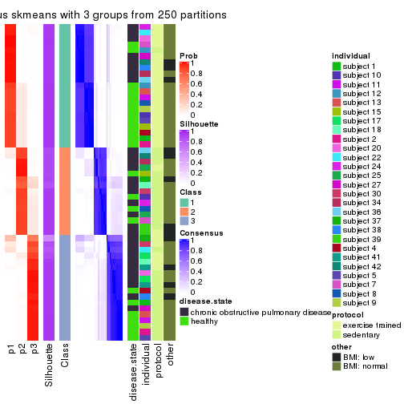</p>

</div>
<div id='tab-CV-skmeans-consensus-heatmap-3'>
<pre><code class="r">consensus_heatmap(res, k = 4)
</code></pre>

<p>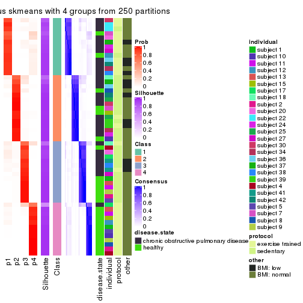</p>

</div>
<div id='tab-CV-skmeans-consensus-heatmap-4'>
<pre><code class="r">consensus_heatmap(res, k = 5)
</code></pre>

<p>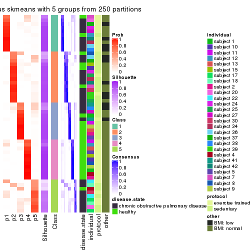</p>

</div>
<div id='tab-CV-skmeans-consensus-heatmap-5'>
<pre><code class="r">consensus_heatmap(res, k = 6)
</code></pre>

<p>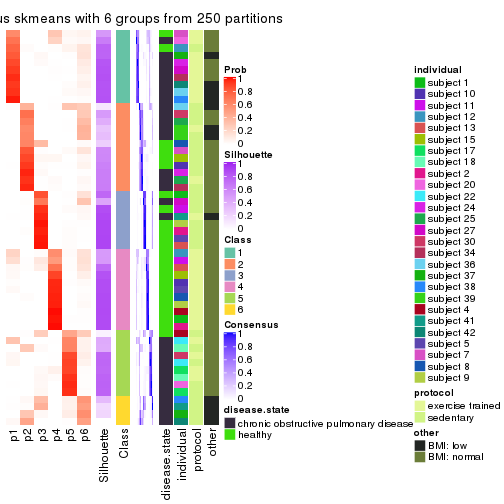</p>

</div>
</div>

Heatmaps for the membership of samples in all partitions to see how consistent they are:


<script>
$( function() {
	$( '#tabs-CV-skmeans-membership-heatmap' ).tabs();
} );
</script>
<div id='tabs-CV-skmeans-membership-heatmap'>
<ul>
<li><a href='#tab-CV-skmeans-membership-heatmap-1'>k = 2</a></li>
<li><a href='#tab-CV-skmeans-membership-heatmap-2'>k = 3</a></li>
<li><a href='#tab-CV-skmeans-membership-heatmap-3'>k = 4</a></li>
<li><a href='#tab-CV-skmeans-membership-heatmap-4'>k = 5</a></li>
<li><a href='#tab-CV-skmeans-membership-heatmap-5'>k = 6</a></li>
</ul>
<div id='tab-CV-skmeans-membership-heatmap-1'>
<pre><code class="r">membership_heatmap(res, k = 2)
</code></pre>

<p>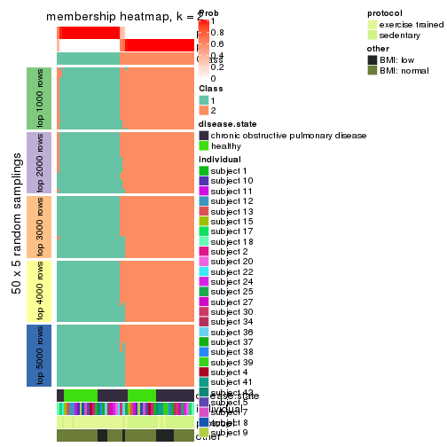</p>

</div>
<div id='tab-CV-skmeans-membership-heatmap-2'>
<pre><code class="r">membership_heatmap(res, k = 3)
</code></pre>

<p>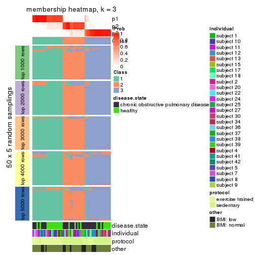</p>

</div>
<div id='tab-CV-skmeans-membership-heatmap-3'>
<pre><code class="r">membership_heatmap(res, k = 4)
</code></pre>

<p>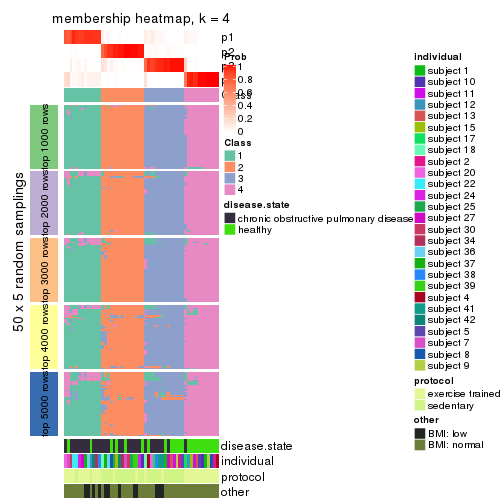</p>

</div>
<div id='tab-CV-skmeans-membership-heatmap-4'>
<pre><code class="r">membership_heatmap(res, k = 5)
</code></pre>

<p>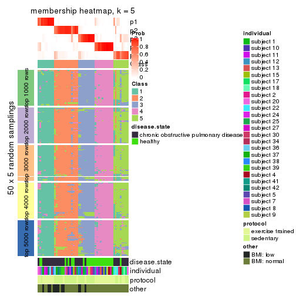</p>

</div>
<div id='tab-CV-skmeans-membership-heatmap-5'>
<pre><code class="r">membership_heatmap(res, k = 6)
</code></pre>

<p>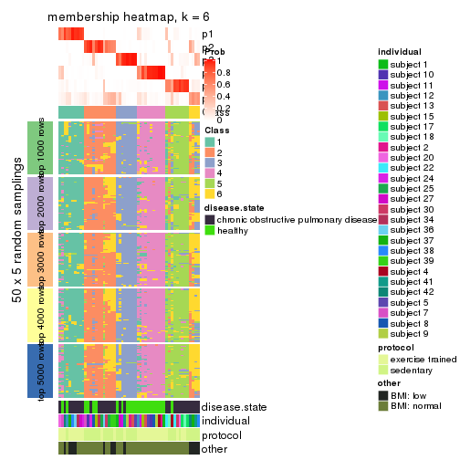</p>

</div>
</div>

As soon as we have had the classes for columns, we can look for signatures
which are significantly different between classes which can be candidate marks
for certain classes. Following are the heatmaps for signatures.


Signature heatmaps where rows are scaled:


<script>
$( function() {
	$( '#tabs-CV-skmeans-get-signatures' ).tabs();
} );
</script>
<div id='tabs-CV-skmeans-get-signatures'>
<ul>
<li><a href='#tab-CV-skmeans-get-signatures-1'>k = 2</a></li>
<li><a href='#tab-CV-skmeans-get-signatures-2'>k = 3</a></li>
<li><a href='#tab-CV-skmeans-get-signatures-3'>k = 4</a></li>
<li><a href='#tab-CV-skmeans-get-signatures-4'>k = 5</a></li>
<li><a href='#tab-CV-skmeans-get-signatures-5'>k = 6</a></li>
</ul>
<div id='tab-CV-skmeans-get-signatures-1'>
<pre><code class="r">get_signatures(res, k = 2)
</code></pre>

<p>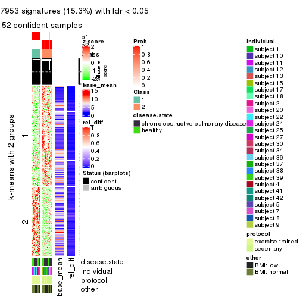</p>

</div>
<div id='tab-CV-skmeans-get-signatures-2'>
<pre><code class="r">get_signatures(res, k = 3)
</code></pre>

<p>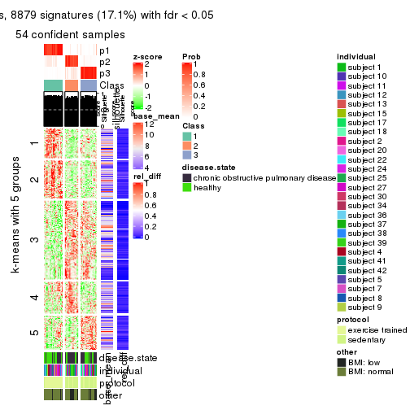</p>

</div>
<div id='tab-CV-skmeans-get-signatures-3'>
<pre><code class="r">get_signatures(res, k = 4)
</code></pre>

<p>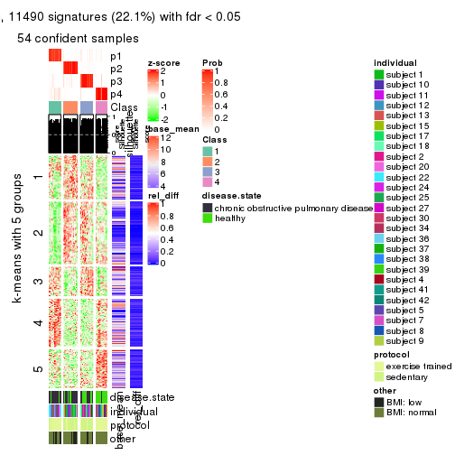</p>

</div>
<div id='tab-CV-skmeans-get-signatures-4'>
<pre><code class="r">get_signatures(res, k = 5)
</code></pre>

<p>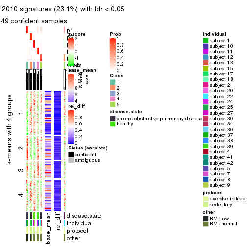</p>

</div>
<div id='tab-CV-skmeans-get-signatures-5'>
<pre><code class="r">get_signatures(res, k = 6)
</code></pre>

<p>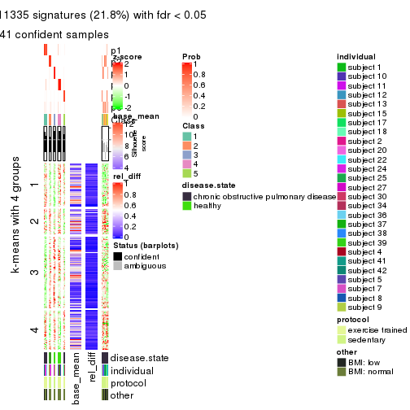</p>

</div>
</div>


Signature heatmaps where rows are not scaled:


<script>
$( function() {
	$( '#tabs-CV-skmeans-get-signatures-no-scale' ).tabs();
} );
</script>
<div id='tabs-CV-skmeans-get-signatures-no-scale'>
<ul>
<li><a href='#tab-CV-skmeans-get-signatures-no-scale-1'>k = 2</a></li>
<li><a href='#tab-CV-skmeans-get-signatures-no-scale-2'>k = 3</a></li>
<li><a href='#tab-CV-skmeans-get-signatures-no-scale-3'>k = 4</a></li>
<li><a href='#tab-CV-skmeans-get-signatures-no-scale-4'>k = 5</a></li>
<li><a href='#tab-CV-skmeans-get-signatures-no-scale-5'>k = 6</a></li>
</ul>
<div id='tab-CV-skmeans-get-signatures-no-scale-1'>
<pre><code class="r">get_signatures(res, k = 2, scale_rows = FALSE)
</code></pre>

<p>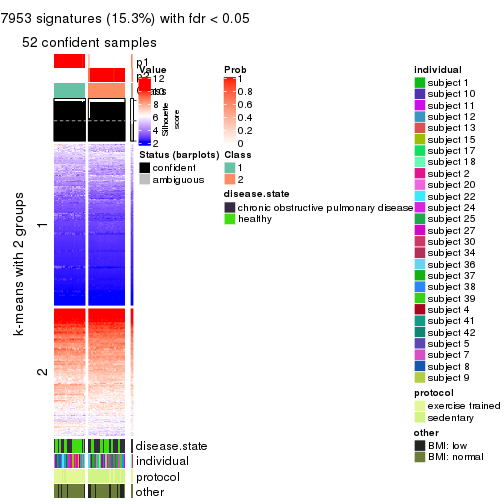</p>

</div>
<div id='tab-CV-skmeans-get-signatures-no-scale-2'>
<pre><code class="r">get_signatures(res, k = 3, scale_rows = FALSE)
</code></pre>

<p>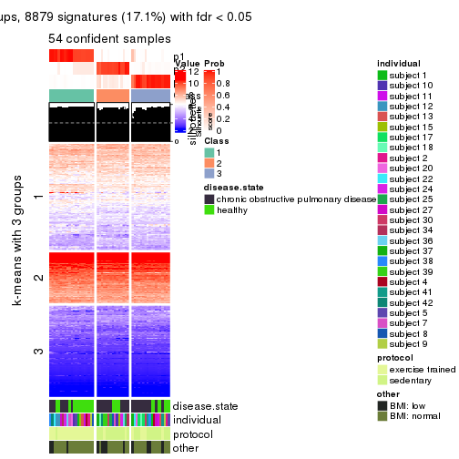</p>

</div>
<div id='tab-CV-skmeans-get-signatures-no-scale-3'>
<pre><code class="r">get_signatures(res, k = 4, scale_rows = FALSE)
</code></pre>

<p>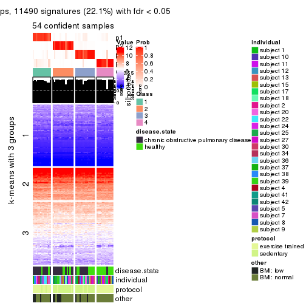</p>

</div>
<div id='tab-CV-skmeans-get-signatures-no-scale-4'>
<pre><code class="r">get_signatures(res, k = 5, scale_rows = FALSE)
</code></pre>

<p>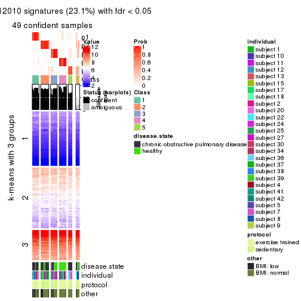</p>

</div>
<div id='tab-CV-skmeans-get-signatures-no-scale-5'>
<pre><code class="r">get_signatures(res, k = 6, scale_rows = FALSE)
</code></pre>

<p>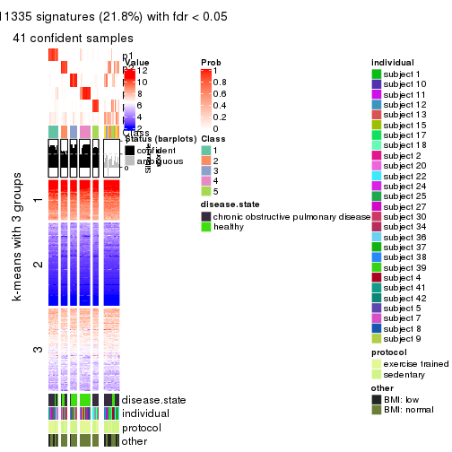</p>

</div>
</div>


Compare the overlap of signatures from different k:

```r
compare_signatures(res)
```

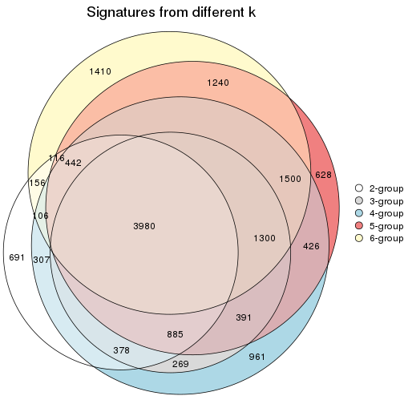

`get_signature()` returns a data frame invisibly. TO get the list of signatures, the function
call should be assigned to a variable explicitly. In following code, if `plot` argument is set
to `FALSE`, no heatmap is plotted while only the differential analysis is performed.

```r
# code only for demonstration
tb = get_signature(res, k = ..., plot = FALSE)
```

An example of the output of `tb` is:

```
#>   which_row         fdr    mean_1    mean_2 scaled_mean_1 scaled_mean_2 km
#> 1        38 0.042760348  8.373488  9.131774    -0.5533452     0.5164555  1
#> 2        40 0.018707592  7.106213  8.469186    -0.6173731     0.5762149  1
#> 3        55 0.019134737 10.221463 11.207825    -0.6159697     0.5749050  1
#> 4        59 0.006059896  5.921854  7.869574    -0.6899429     0.6439467  1
#> 5        60 0.018055526  8.928898 10.211722    -0.6204761     0.5791110  1
#> 6        98 0.009384629 15.714769 14.887706     0.6635654    -0.6193277  2
...
```

The columns in `tb` are:

1. `which_row`: row indices corresponding to the input matrix.
2. `fdr`: FDR for the differential test. 
3. `mean_x`: The mean value in group x.
4. `scaled_mean_x`: The mean value in group x after rows are scaled.
5. `km`: Row groups if k-means clustering is applied to rows.


UMAP plot which shows how samples are separated.


<script>
$( function() {
	$( '#tabs-CV-skmeans-dimension-reduction' ).tabs();
} );
</script>
<div id='tabs-CV-skmeans-dimension-reduction'>
<ul>
<li><a href='#tab-CV-skmeans-dimension-reduction-1'>k = 2</a></li>
<li><a href='#tab-CV-skmeans-dimension-reduction-2'>k = 3</a></li>
<li><a href='#tab-CV-skmeans-dimension-reduction-3'>k = 4</a></li>
<li><a href='#tab-CV-skmeans-dimension-reduction-4'>k = 5</a></li>
<li><a href='#tab-CV-skmeans-dimension-reduction-5'>k = 6</a></li>
</ul>
<div id='tab-CV-skmeans-dimension-reduction-1'>
<pre><code class="r">dimension_reduction(res, k = 2, method = &quot;UMAP&quot;)
</code></pre>

<p>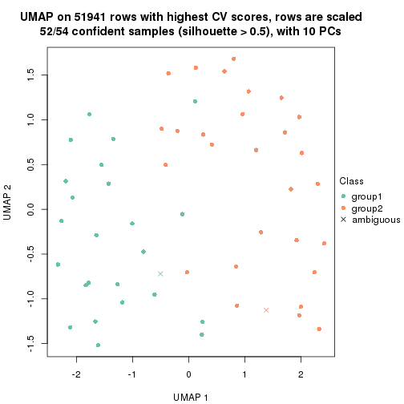</p>

</div>
<div id='tab-CV-skmeans-dimension-reduction-2'>
<pre><code class="r">dimension_reduction(res, k = 3, method = &quot;UMAP&quot;)
</code></pre>

<p>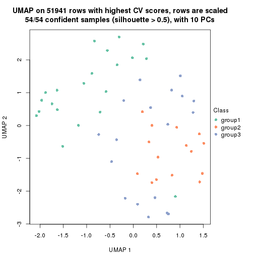</p>

</div>
<div id='tab-CV-skmeans-dimension-reduction-3'>
<pre><code class="r">dimension_reduction(res, k = 4, method = &quot;UMAP&quot;)
</code></pre>

<p>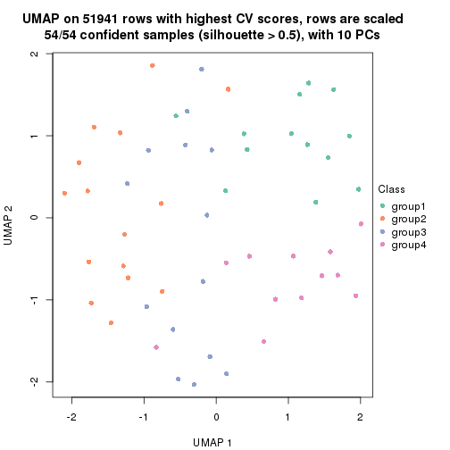</p>

</div>
<div id='tab-CV-skmeans-dimension-reduction-4'>
<pre><code class="r">dimension_reduction(res, k = 5, method = &quot;UMAP&quot;)
</code></pre>

<p>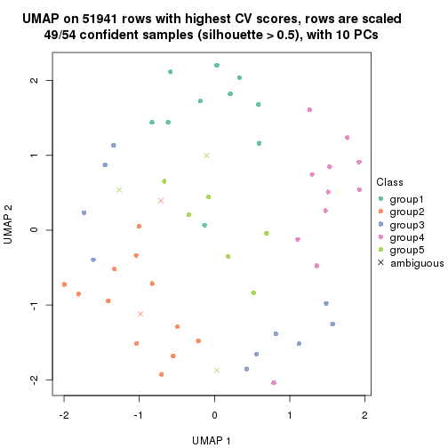</p>

</div>
<div id='tab-CV-skmeans-dimension-reduction-5'>
<pre><code class="r">dimension_reduction(res, k = 6, method = &quot;UMAP&quot;)
</code></pre>

<p>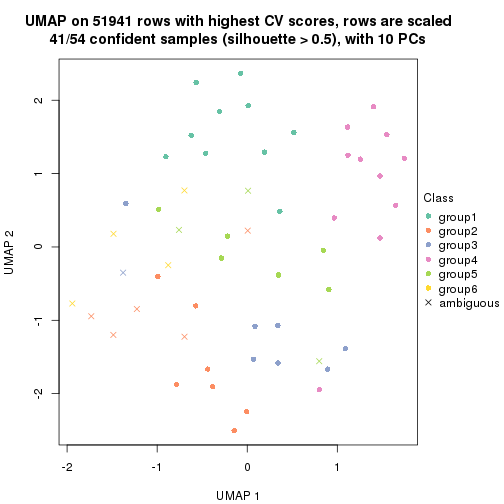</p>

</div>
</div>


Following heatmap shows how subgroups are split when increasing `k`:

```r
collect_classes(res)
```

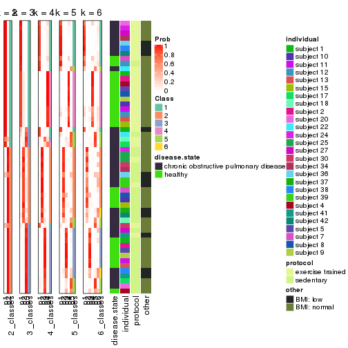


Test correlation between subgroups and known annotations. If the known
annotation is numeric, one-way ANOVA test is applied, and if the known
annotation is discrete, chi-squared contingency table test is applied.

```r
test_to_known_factors(res)
```

```
#>             n disease.state(p) individual(p) protocol(p) other(p) k
#> CV:skmeans 52         4.27e-01         0.992    2.92e-08   0.4929 2
#> CV:skmeans 54         9.36e-02         0.816    5.54e-07   0.3992 3
#> CV:skmeans 54         5.91e-04         0.751    2.60e-07   0.1678 4
#> CV:skmeans 49         9.02e-05         0.330    7.61e-06   0.0978 5
#> CV:skmeans 41         7.20e-05         0.623    9.13e-05   0.0317 6
```


If matrix rows can be associated to genes, consider to use `functional_enrichment(res,
...)` to perform function enrichment for the signature genes. See [this vignette](http://bioconductor.org/packages/devel/bioc/vignettes/cola/inst/doc/functional_enrichment.html) for more detailed explanations.


 

---------------------------------------------------


### CV:pam*


The object with results only for a single top-value method and a single partition method 
can be extracted as:

```r
res = res_list["CV", "pam"]
# you can also extract it by
# res = res_list["CV:pam"]
```

A summary of `res` and all the functions that can be applied to it:

```r
res
```

```
#> A 'ConsensusPartition' object with k = 2, 3, 4, 5, 6.
#>   On a matrix with 51941 rows and 54 columns.
#>   Top rows (1000, 2000, 3000, 4000, 5000) are extracted by 'CV' method.
#>   Subgroups are detected by 'pam' method.
#>   Performed in total 1250 partitions by row resampling.
#>   Best k for subgroups seems to be 3.
#> 
#> Following methods can be applied to this 'ConsensusPartition' object:
#>  [1] "cola_report"             "collect_classes"         "collect_plots"          
#>  [4] "collect_stats"           "colnames"                "compare_signatures"     
#>  [7] "consensus_heatmap"       "dimension_reduction"     "functional_enrichment"  
#> [10] "get_anno_col"            "get_anno"                "get_classes"            
#> [13] "get_consensus"           "get_matrix"              "get_membership"         
#> [16] "get_param"               "get_signatures"          "get_stats"              
#> [19] "is_best_k"               "is_stable_k"             "membership_heatmap"     
#> [22] "ncol"                    "nrow"                    "plot_ecdf"              
#> [25] "rownames"                "select_partition_number" "show"                   
#> [28] "suggest_best_k"          "test_to_known_factors"
```

`collect_plots()` function collects all the plots made from `res` for all `k` (number of partitions)
into one single page to provide an easy and fast comparison between different `k`.

```r
collect_plots(res)
```

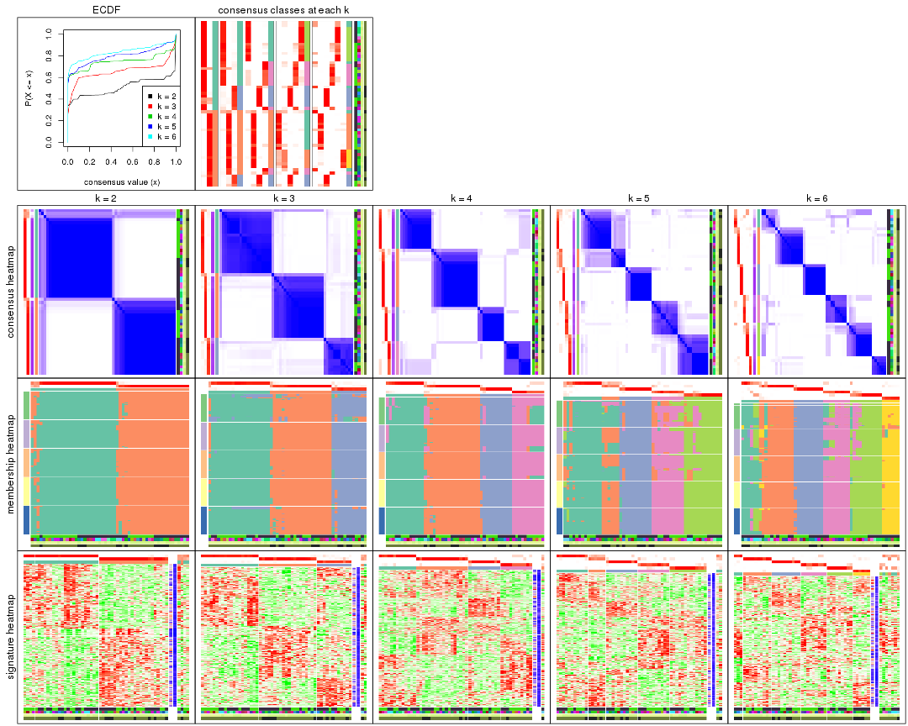

The plots are:

- The first row: a plot of the ECDF (empirical cumulative distribution
  function) curves of the consensus matrix for each `k` and the heatmap of
  predicted classes for each `k`.
- The second row: heatmaps of the consensus matrix for each `k`.
- The third row: heatmaps of the membership matrix for each `k`.
- The fouth row: heatmaps of the signatures for each `k`.

All the plots in panels can be made by individual functions and they are
plotted later in this section.

`select_partition_number()` produces several plots showing different
statistics for choosing "optimized" `k`. There are following statistics:

- ECDF curves of the consensus matrix for each `k`;
- 1-PAC. [The PAC
  score](https://en.wikipedia.org/wiki/Consensus_clustering#Over-interpretation_potential_of_consensus_clustering)
  measures the proportion of the ambiguous subgrouping.
- Mean silhouette score.
- Concordance. The mean probability of fiting the consensus class ids in all
  partitions.
- Area increased. Denote $A_k$ as the area under the ECDF curve for current
  `k`, the area increased is defined as $A_k - A_{k-1}$.
- Rand index. The percent of pairs of samples that are both in a same cluster
  or both are not in a same cluster in the partition of k and k-1.
- Jaccard index. The ratio of pairs of samples are both in a same cluster in
  the partition of k and k-1 and the pairs of samples are both in a same
  cluster in the partition k or k-1.

The detailed explanations of these statistics can be found in [the _cola_
vignette](http://bioconductor.org/packages/devel/bioc/vignettes/cola/inst/doc/cola.html#toc_13).

Generally speaking, lower PAC score, higher mean silhouette score or higher
concordance corresponds to better partition. Rand index and Jaccard index
measure how similar the current partition is compared to partition with `k-1`.
If they are too similar, we won't accept `k` is better than `k-1`.

```r
select_partition_number(res)
```

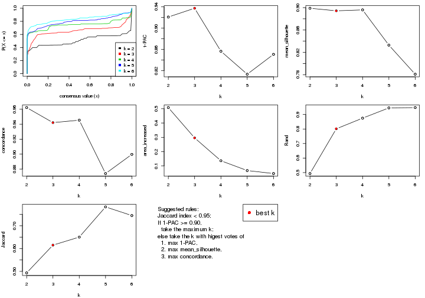

The numeric values for all these statistics can be obtained by `get_stats()`.

```r
get_stats(res)
```

```
#>   k 1-PAC mean_silhouette concordance area_increased  Rand Jaccard
#> 2 2 0.921           0.899       0.962         0.5077 0.493   0.493
#> 3 3 0.937           0.894       0.942         0.2961 0.802   0.615
#> 4 4 0.856           0.896       0.945         0.1364 0.875   0.650
#> 5 5 0.813           0.833       0.874         0.0680 0.945   0.783
#> 6 6 0.851           0.781       0.900         0.0472 0.948   0.745
```

`suggest_best_k()` suggests the best $k$ based on these statistics. The rules are as follows:

- All $k$ with Jaccard index larger than 0.95 are removed because increasing
  $k$ does not provide enough extra information. If all $k$ are removed, it is
  marked as no subgroup is detected.
- For all $k$ with 1-PAC score larger than 0.9, the maximal $k$ is taken as
  the best $k$, and other $k$ are marked as optional $k$.
- If it does not fit the second rule. The $k$ with the maximal vote of the
  highest 1-PAC score, highest mean silhouette, and highest concordance is
  taken as the best $k$.

```r
suggest_best_k(res)
```

```
#> [1] 3
#> attr(,"optional")
#> [1] 2
```

There is also optional best $k$ = 2 that is worth to check.

Following shows the table of the partitions (You need to click the **show/hide
code output** link to see it). The membership matrix (columns with name `p*`)
is inferred by
[`clue::cl_consensus()`](https://www.rdocumentation.org/link/cl_consensus?package=clue)
function with the `SE` method. Basically the value in the membership matrix
represents the probability to belong to a certain group. The finall class
label for an item is determined with the group with highest probability it
belongs to.

In `get_classes()` function, the entropy is calculated from the membership
matrix and the silhouette score is calculated from the consensus matrix.


<script>
$( function() {
	$( '#tabs-CV-pam-get-classes' ).tabs();
} );
</script>
<div id='tabs-CV-pam-get-classes'>
<ul>
<li><a href='#tab-CV-pam-get-classes-1'>k = 2</a></li>
<li><a href='#tab-CV-pam-get-classes-2'>k = 3</a></li>
<li><a href='#tab-CV-pam-get-classes-3'>k = 4</a></li>
<li><a href='#tab-CV-pam-get-classes-4'>k = 5</a></li>
<li><a href='#tab-CV-pam-get-classes-5'>k = 6</a></li>
</ul>

<div id='tab-CV-pam-get-classes-1'>
<p><a id='tab-CV-pam-get-classes-1-a' style='color:#0366d6' href='#'>show/hide code output</a></p>
<pre><code class="r">cbind(get_classes(res, k = 2), get_membership(res, k = 2))
</code></pre>

<pre><code>#&gt;           class entropy silhouette    p1    p2
#&gt; GSM680053     1  0.0000     0.9514 1.000 0.000
#&gt; GSM680062     1  0.0000     0.9514 1.000 0.000
#&gt; GSM680054     2  0.0000     0.9673 0.000 1.000
#&gt; GSM680063     1  0.0000     0.9514 1.000 0.000
#&gt; GSM680055     1  0.0000     0.9514 1.000 0.000
#&gt; GSM680064     1  0.0000     0.9514 1.000 0.000
#&gt; GSM680056     1  0.0000     0.9514 1.000 0.000
#&gt; GSM680065     1  0.0000     0.9514 1.000 0.000
#&gt; GSM680057     2  0.0000     0.9673 0.000 1.000
#&gt; GSM680066     2  0.0000     0.9673 0.000 1.000
#&gt; GSM680058     2  0.0000     0.9673 0.000 1.000
#&gt; GSM680067     2  0.0000     0.9673 0.000 1.000
#&gt; GSM680059     2  0.4939     0.8624 0.108 0.892
#&gt; GSM680068     1  0.0000     0.9514 1.000 0.000
#&gt; GSM680060     2  0.0000     0.9673 0.000 1.000
#&gt; GSM680069     1  0.0000     0.9514 1.000 0.000
#&gt; GSM680061     2  0.0000     0.9673 0.000 1.000
#&gt; GSM680070     1  0.0000     0.9514 1.000 0.000
#&gt; GSM680071     2  0.4562     0.8755 0.096 0.904
#&gt; GSM680077     2  0.9963     0.0986 0.464 0.536
#&gt; GSM680072     2  0.2603     0.9322 0.044 0.956
#&gt; GSM680078     1  0.0000     0.9514 1.000 0.000
#&gt; GSM680073     1  0.2423     0.9167 0.960 0.040
#&gt; GSM680079     1  0.0000     0.9514 1.000 0.000
#&gt; GSM680074     2  0.0000     0.9673 0.000 1.000
#&gt; GSM680080     2  0.0000     0.9673 0.000 1.000
#&gt; GSM680075     1  0.0000     0.9514 1.000 0.000
#&gt; GSM680081     2  0.0000     0.9673 0.000 1.000
#&gt; GSM680076     2  0.0000     0.9673 0.000 1.000
#&gt; GSM680082     2  0.0000     0.9673 0.000 1.000
#&gt; GSM680029     1  0.9866     0.2349 0.568 0.432
#&gt; GSM680041     1  0.0000     0.9514 1.000 0.000
#&gt; GSM680035     2  0.0000     0.9673 0.000 1.000
#&gt; GSM680047     1  0.0000     0.9514 1.000 0.000
#&gt; GSM680036     1  0.9248     0.4860 0.660 0.340
#&gt; GSM680048     1  0.0000     0.9514 1.000 0.000
#&gt; GSM680037     1  0.0376     0.9482 0.996 0.004
#&gt; GSM680049     1  0.9996     0.0583 0.512 0.488
#&gt; GSM680038     2  0.0000     0.9673 0.000 1.000
#&gt; GSM680050     1  0.0000     0.9514 1.000 0.000
#&gt; GSM680039     2  0.0000     0.9673 0.000 1.000
#&gt; GSM680051     2  0.1633     0.9491 0.024 0.976
#&gt; GSM680040     2  0.0000     0.9673 0.000 1.000
#&gt; GSM680052     1  0.0000     0.9514 1.000 0.000
#&gt; GSM680030     2  0.0000     0.9673 0.000 1.000
#&gt; GSM680042     1  0.0000     0.9514 1.000 0.000
#&gt; GSM680031     1  0.0000     0.9514 1.000 0.000
#&gt; GSM680043     1  0.0000     0.9514 1.000 0.000
#&gt; GSM680032     2  0.0000     0.9673 0.000 1.000
#&gt; GSM680044     1  0.0000     0.9514 1.000 0.000
#&gt; GSM680033     2  0.0000     0.9673 0.000 1.000
#&gt; GSM680045     1  0.0000     0.9514 1.000 0.000
#&gt; GSM680034     2  0.0000     0.9673 0.000 1.000
#&gt; GSM680046     1  0.0000     0.9514 1.000 0.000
</code></pre>

<script>
$('#tab-CV-pam-get-classes-1-a').parent().next().next().hide();
$('#tab-CV-pam-get-classes-1-a').click(function(){
  $('#tab-CV-pam-get-classes-1-a').parent().next().next().toggle();
  return(false);
});
</script>
</div>

<div id='tab-CV-pam-get-classes-2'>
<p><a id='tab-CV-pam-get-classes-2-a' style='color:#0366d6' href='#'>show/hide code output</a></p>
<pre><code class="r">cbind(get_classes(res, k = 3), get_membership(res, k = 3))
</code></pre>

<pre><code>#&gt;           class entropy silhouette    p1    p2    p3
#&gt; GSM680053     1  0.1267     0.9439 0.972 0.004 0.024
#&gt; GSM680062     1  0.1267     0.9439 0.972 0.004 0.024
#&gt; GSM680054     2  0.0592     0.9424 0.000 0.988 0.012
#&gt; GSM680063     1  0.1267     0.9439 0.972 0.004 0.024
#&gt; GSM680055     1  0.1267     0.9439 0.972 0.004 0.024
#&gt; GSM680064     1  0.2165     0.9153 0.936 0.000 0.064
#&gt; GSM680056     1  0.1399     0.9438 0.968 0.004 0.028
#&gt; GSM680065     1  0.1399     0.9438 0.968 0.004 0.028
#&gt; GSM680057     2  0.0000     0.9485 0.000 1.000 0.000
#&gt; GSM680066     2  0.0237     0.9468 0.000 0.996 0.004
#&gt; GSM680058     2  0.0000     0.9485 0.000 1.000 0.000
#&gt; GSM680067     2  0.0237     0.9471 0.004 0.996 0.000
#&gt; GSM680059     3  0.3045     0.9181 0.020 0.064 0.916
#&gt; GSM680068     3  0.4062     0.7781 0.164 0.000 0.836
#&gt; GSM680060     2  0.0000     0.9485 0.000 1.000 0.000
#&gt; GSM680069     1  0.1163     0.9431 0.972 0.000 0.028
#&gt; GSM680061     2  0.0000     0.9485 0.000 1.000 0.000
#&gt; GSM680070     1  0.2796     0.8989 0.908 0.000 0.092
#&gt; GSM680071     2  0.2878     0.8657 0.096 0.904 0.000
#&gt; GSM680077     2  0.7969     0.2024 0.396 0.540 0.064
#&gt; GSM680072     2  0.3623     0.8749 0.032 0.896 0.072
#&gt; GSM680078     3  0.1031     0.9153 0.024 0.000 0.976
#&gt; GSM680073     3  0.2165     0.9148 0.064 0.000 0.936
#&gt; GSM680079     3  0.1643     0.9120 0.044 0.000 0.956
#&gt; GSM680074     2  0.0000     0.9485 0.000 1.000 0.000
#&gt; GSM680080     2  0.0000     0.9485 0.000 1.000 0.000
#&gt; GSM680075     3  0.2165     0.9148 0.064 0.000 0.936
#&gt; GSM680081     3  0.2711     0.9028 0.000 0.088 0.912
#&gt; GSM680076     2  0.0000     0.9485 0.000 1.000 0.000
#&gt; GSM680082     2  0.3310     0.8890 0.028 0.908 0.064
#&gt; GSM680029     3  0.2681     0.9234 0.028 0.040 0.932
#&gt; GSM680041     1  0.0000     0.9441 1.000 0.000 0.000
#&gt; GSM680035     2  0.0747     0.9400 0.000 0.984 0.016
#&gt; GSM680047     1  0.0000     0.9441 1.000 0.000 0.000
#&gt; GSM680036     3  0.2879     0.9207 0.024 0.052 0.924
#&gt; GSM680048     1  0.0592     0.9452 0.988 0.000 0.012
#&gt; GSM680037     3  0.2165     0.9148 0.064 0.000 0.936
#&gt; GSM680049     1  0.8045     0.0905 0.504 0.432 0.064
#&gt; GSM680038     2  0.0000     0.9485 0.000 1.000 0.000
#&gt; GSM680050     1  0.1860     0.9361 0.948 0.000 0.052
#&gt; GSM680039     2  0.0000     0.9485 0.000 1.000 0.000
#&gt; GSM680051     2  0.2879     0.9008 0.052 0.924 0.024
#&gt; GSM680040     3  0.2537     0.9080 0.000 0.080 0.920
#&gt; GSM680052     1  0.1031     0.9379 0.976 0.000 0.024
#&gt; GSM680030     2  0.0000     0.9485 0.000 1.000 0.000
#&gt; GSM680042     1  0.1289     0.9350 0.968 0.000 0.032
#&gt; GSM680031     1  0.1163     0.9431 0.972 0.000 0.028
#&gt; GSM680043     1  0.1031     0.9379 0.976 0.000 0.024
#&gt; GSM680032     2  0.2096     0.9184 0.004 0.944 0.052
#&gt; GSM680044     1  0.0747     0.9453 0.984 0.000 0.016
#&gt; GSM680033     3  0.5465     0.6564 0.000 0.288 0.712
#&gt; GSM680045     1  0.1031     0.9379 0.976 0.000 0.024
#&gt; GSM680034     2  0.0237     0.9471 0.004 0.996 0.000
#&gt; GSM680046     1  0.1031     0.9379 0.976 0.000 0.024
</code></pre>

<script>
$('#tab-CV-pam-get-classes-2-a').parent().next().next().hide();
$('#tab-CV-pam-get-classes-2-a').click(function(){
  $('#tab-CV-pam-get-classes-2-a').parent().next().next().toggle();
  return(false);
});
</script>
</div>

<div id='tab-CV-pam-get-classes-3'>
<p><a id='tab-CV-pam-get-classes-3-a' style='color:#0366d6' href='#'>show/hide code output</a></p>
<pre><code class="r">cbind(get_classes(res, k = 4), get_membership(res, k = 4))
</code></pre>

<pre><code>#&gt;           class entropy silhouette    p1    p2    p3    p4
#&gt; GSM680053     1  0.0000      0.962 1.000 0.000 0.000 0.000
#&gt; GSM680062     1  0.0000      0.962 1.000 0.000 0.000 0.000
#&gt; GSM680054     2  0.0000      0.952 0.000 1.000 0.000 0.000
#&gt; GSM680063     1  0.0000      0.962 1.000 0.000 0.000 0.000
#&gt; GSM680055     1  0.0000      0.962 1.000 0.000 0.000 0.000
#&gt; GSM680064     4  0.0000      0.857 0.000 0.000 0.000 1.000
#&gt; GSM680056     1  0.0336      0.957 0.992 0.000 0.000 0.008
#&gt; GSM680065     1  0.0592      0.953 0.984 0.000 0.000 0.016
#&gt; GSM680057     2  0.0000      0.952 0.000 1.000 0.000 0.000
#&gt; GSM680066     2  0.0000      0.952 0.000 1.000 0.000 0.000
#&gt; GSM680058     2  0.0000      0.952 0.000 1.000 0.000 0.000
#&gt; GSM680067     2  0.0000      0.952 0.000 1.000 0.000 0.000
#&gt; GSM680059     3  0.0000      0.952 0.000 0.000 1.000 0.000
#&gt; GSM680068     4  0.0336      0.854 0.000 0.000 0.008 0.992
#&gt; GSM680060     2  0.0000      0.952 0.000 1.000 0.000 0.000
#&gt; GSM680069     1  0.0000      0.962 1.000 0.000 0.000 0.000
#&gt; GSM680061     2  0.0000      0.952 0.000 1.000 0.000 0.000
#&gt; GSM680070     4  0.0000      0.857 0.000 0.000 0.000 1.000
#&gt; GSM680071     2  0.2281      0.867 0.096 0.904 0.000 0.000
#&gt; GSM680077     2  0.7417      0.326 0.284 0.508 0.000 0.208
#&gt; GSM680072     2  0.2830      0.878 0.040 0.900 0.060 0.000
#&gt; GSM680078     3  0.0000      0.952 0.000 0.000 1.000 0.000
#&gt; GSM680073     3  0.0000      0.952 0.000 0.000 1.000 0.000
#&gt; GSM680079     3  0.3649      0.763 0.000 0.000 0.796 0.204
#&gt; GSM680074     2  0.0000      0.952 0.000 1.000 0.000 0.000
#&gt; GSM680080     2  0.0000      0.952 0.000 1.000 0.000 0.000
#&gt; GSM680075     3  0.0000      0.952 0.000 0.000 1.000 0.000
#&gt; GSM680081     3  0.0000      0.952 0.000 0.000 1.000 0.000
#&gt; GSM680076     2  0.0000      0.952 0.000 1.000 0.000 0.000
#&gt; GSM680082     4  0.0000      0.857 0.000 0.000 0.000 1.000
#&gt; GSM680029     3  0.0000      0.952 0.000 0.000 1.000 0.000
#&gt; GSM680041     1  0.3610      0.716 0.800 0.000 0.000 0.200
#&gt; GSM680035     2  0.0469      0.944 0.000 0.988 0.012 0.000
#&gt; GSM680047     1  0.1637      0.909 0.940 0.000 0.000 0.060
#&gt; GSM680036     3  0.0000      0.952 0.000 0.000 1.000 0.000
#&gt; GSM680048     1  0.0000      0.962 1.000 0.000 0.000 0.000
#&gt; GSM680037     3  0.0000      0.952 0.000 0.000 1.000 0.000
#&gt; GSM680049     4  0.0000      0.857 0.000 0.000 0.000 1.000
#&gt; GSM680038     2  0.0000      0.952 0.000 1.000 0.000 0.000
#&gt; GSM680050     1  0.2469      0.856 0.892 0.000 0.000 0.108
#&gt; GSM680039     2  0.0000      0.952 0.000 1.000 0.000 0.000
#&gt; GSM680051     4  0.3688      0.728 0.000 0.208 0.000 0.792
#&gt; GSM680040     3  0.0000      0.952 0.000 0.000 1.000 0.000
#&gt; GSM680052     4  0.3688      0.828 0.208 0.000 0.000 0.792
#&gt; GSM680030     2  0.0000      0.952 0.000 1.000 0.000 0.000
#&gt; GSM680042     4  0.3528      0.833 0.192 0.000 0.000 0.808
#&gt; GSM680031     1  0.0000      0.962 1.000 0.000 0.000 0.000
#&gt; GSM680043     4  0.3688      0.828 0.208 0.000 0.000 0.792
#&gt; GSM680032     2  0.3444      0.781 0.000 0.816 0.000 0.184
#&gt; GSM680044     1  0.0000      0.962 1.000 0.000 0.000 0.000
#&gt; GSM680033     3  0.3873      0.694 0.000 0.228 0.772 0.000
#&gt; GSM680045     4  0.3688      0.828 0.208 0.000 0.000 0.792
#&gt; GSM680034     2  0.0000      0.952 0.000 1.000 0.000 0.000
#&gt; GSM680046     4  0.3688      0.828 0.208 0.000 0.000 0.792
</code></pre>

<script>
$('#tab-CV-pam-get-classes-3-a').parent().next().next().hide();
$('#tab-CV-pam-get-classes-3-a').click(function(){
  $('#tab-CV-pam-get-classes-3-a').parent().next().next().toggle();
  return(false);
});
</script>
</div>

<div id='tab-CV-pam-get-classes-4'>
<p><a id='tab-CV-pam-get-classes-4-a' style='color:#0366d6' href='#'>show/hide code output</a></p>
<pre><code class="r">cbind(get_classes(res, k = 5), get_membership(res, k = 5))
</code></pre>

<pre><code>#&gt;           class entropy silhouette    p1    p2    p3    p4    p5
#&gt; GSM680053     5  0.0000      0.919 0.000 0.000 0.000 0.000 1.000
#&gt; GSM680062     5  0.0000      0.919 0.000 0.000 0.000 0.000 1.000
#&gt; GSM680054     1  0.0162      0.837 0.996 0.000 0.000 0.000 0.004
#&gt; GSM680063     5  0.0000      0.919 0.000 0.000 0.000 0.000 1.000
#&gt; GSM680055     5  0.0000      0.919 0.000 0.000 0.000 0.000 1.000
#&gt; GSM680064     4  0.3039      0.800 0.000 0.192 0.000 0.808 0.000
#&gt; GSM680056     5  0.2280      0.866 0.000 0.120 0.000 0.000 0.880
#&gt; GSM680065     5  0.2439      0.864 0.000 0.120 0.000 0.004 0.876
#&gt; GSM680057     1  0.0000      0.839 1.000 0.000 0.000 0.000 0.000
#&gt; GSM680066     1  0.0324      0.835 0.992 0.000 0.004 0.004 0.000
#&gt; GSM680058     2  0.4015      0.914 0.348 0.652 0.000 0.000 0.000
#&gt; GSM680067     1  0.1851      0.739 0.912 0.088 0.000 0.000 0.000
#&gt; GSM680059     3  0.0000      0.945 0.000 0.000 1.000 0.000 0.000
#&gt; GSM680068     4  0.2233      0.846 0.000 0.104 0.004 0.892 0.000
#&gt; GSM680060     2  0.3999      0.916 0.344 0.656 0.000 0.000 0.000
#&gt; GSM680069     5  0.0000      0.919 0.000 0.000 0.000 0.000 1.000
#&gt; GSM680061     1  0.0000      0.839 1.000 0.000 0.000 0.000 0.000
#&gt; GSM680070     4  0.2389      0.841 0.000 0.116 0.000 0.880 0.004
#&gt; GSM680071     1  0.4457      0.553 0.756 0.152 0.000 0.000 0.092
#&gt; GSM680077     1  0.7529      0.215 0.428 0.348 0.000 0.080 0.144
#&gt; GSM680072     2  0.4736      0.895 0.312 0.656 0.004 0.000 0.028
#&gt; GSM680078     3  0.0000      0.945 0.000 0.000 1.000 0.000 0.000
#&gt; GSM680073     3  0.0000      0.945 0.000 0.000 1.000 0.000 0.000
#&gt; GSM680079     3  0.4847      0.664 0.000 0.216 0.704 0.080 0.000
#&gt; GSM680074     2  0.3999      0.916 0.344 0.656 0.000 0.000 0.000
#&gt; GSM680080     2  0.4242      0.815 0.428 0.572 0.000 0.000 0.000
#&gt; GSM680075     3  0.0000      0.945 0.000 0.000 1.000 0.000 0.000
#&gt; GSM680081     3  0.0000      0.945 0.000 0.000 1.000 0.000 0.000
#&gt; GSM680076     2  0.3242      0.788 0.216 0.784 0.000 0.000 0.000
#&gt; GSM680082     4  0.3999      0.680 0.000 0.344 0.000 0.656 0.000
#&gt; GSM680029     3  0.0000      0.945 0.000 0.000 1.000 0.000 0.000
#&gt; GSM680041     5  0.3913      0.595 0.000 0.000 0.000 0.324 0.676
#&gt; GSM680035     1  0.0609      0.824 0.980 0.000 0.020 0.000 0.000
#&gt; GSM680047     5  0.2966      0.807 0.000 0.000 0.000 0.184 0.816
#&gt; GSM680036     3  0.0000      0.945 0.000 0.000 1.000 0.000 0.000
#&gt; GSM680048     5  0.1908      0.874 0.000 0.000 0.000 0.092 0.908
#&gt; GSM680037     3  0.0000      0.945 0.000 0.000 1.000 0.000 0.000
#&gt; GSM680049     4  0.0162      0.860 0.004 0.000 0.000 0.996 0.000
#&gt; GSM680038     1  0.0510      0.827 0.984 0.016 0.000 0.000 0.000
#&gt; GSM680050     5  0.3012      0.849 0.000 0.104 0.000 0.036 0.860
#&gt; GSM680039     1  0.0000      0.839 1.000 0.000 0.000 0.000 0.000
#&gt; GSM680051     4  0.1908      0.827 0.092 0.000 0.000 0.908 0.000
#&gt; GSM680040     3  0.0000      0.945 0.000 0.000 1.000 0.000 0.000
#&gt; GSM680052     4  0.2077      0.860 0.008 0.000 0.000 0.908 0.084
#&gt; GSM680030     1  0.0000      0.839 1.000 0.000 0.000 0.000 0.000
#&gt; GSM680042     4  0.1544      0.863 0.000 0.000 0.000 0.932 0.068
#&gt; GSM680031     5  0.0000      0.919 0.000 0.000 0.000 0.000 1.000
#&gt; GSM680043     4  0.2966      0.819 0.000 0.000 0.000 0.816 0.184
#&gt; GSM680032     1  0.5004      0.478 0.672 0.256 0.000 0.072 0.000
#&gt; GSM680044     5  0.0000      0.919 0.000 0.000 0.000 0.000 1.000
#&gt; GSM680033     3  0.3336      0.684 0.228 0.000 0.772 0.000 0.000
#&gt; GSM680045     4  0.3093      0.829 0.008 0.000 0.000 0.824 0.168
#&gt; GSM680034     1  0.0000      0.839 1.000 0.000 0.000 0.000 0.000
#&gt; GSM680046     4  0.2077      0.860 0.008 0.000 0.000 0.908 0.084
</code></pre>

<script>
$('#tab-CV-pam-get-classes-4-a').parent().next().next().hide();
$('#tab-CV-pam-get-classes-4-a').click(function(){
  $('#tab-CV-pam-get-classes-4-a').parent().next().next().toggle();
  return(false);
});
</script>
</div>

<div id='tab-CV-pam-get-classes-5'>
<p><a id='tab-CV-pam-get-classes-5-a' style='color:#0366d6' href='#'>show/hide code output</a></p>
<pre><code class="r">cbind(get_classes(res, k = 6), get_membership(res, k = 6))
</code></pre>

<pre><code>#&gt;           class entropy silhouette    p1    p2    p3    p4    p5    p6
#&gt; GSM680053     5  0.0000      0.831 0.000 0.000 0.000 0.000 1.000 0.000
#&gt; GSM680062     5  0.0000      0.831 0.000 0.000 0.000 0.000 1.000 0.000
#&gt; GSM680054     2  0.0260      0.898 0.000 0.992 0.000 0.000 0.008 0.000
#&gt; GSM680063     5  0.0000      0.831 0.000 0.000 0.000 0.000 1.000 0.000
#&gt; GSM680055     5  0.0000      0.831 0.000 0.000 0.000 0.000 1.000 0.000
#&gt; GSM680064     1  0.3634      0.329 0.644 0.000 0.000 0.356 0.000 0.000
#&gt; GSM680056     1  0.3868      0.248 0.504 0.000 0.000 0.000 0.496 0.000
#&gt; GSM680065     1  0.3868      0.248 0.504 0.000 0.000 0.000 0.496 0.000
#&gt; GSM680057     2  0.0000      0.901 0.000 1.000 0.000 0.000 0.000 0.000
#&gt; GSM680066     2  0.0260      0.898 0.000 0.992 0.008 0.000 0.000 0.000
#&gt; GSM680058     6  0.1327      0.922 0.000 0.064 0.000 0.000 0.000 0.936
#&gt; GSM680067     2  0.2048      0.807 0.000 0.880 0.000 0.000 0.000 0.120
#&gt; GSM680059     3  0.0000      0.969 0.000 0.000 1.000 0.000 0.000 0.000
#&gt; GSM680068     4  0.2941      0.739 0.220 0.000 0.000 0.780 0.000 0.000
#&gt; GSM680060     6  0.0865      0.939 0.000 0.036 0.000 0.000 0.000 0.964
#&gt; GSM680069     5  0.0000      0.831 0.000 0.000 0.000 0.000 1.000 0.000
#&gt; GSM680061     2  0.0000      0.901 0.000 1.000 0.000 0.000 0.000 0.000
#&gt; GSM680070     4  0.3189      0.718 0.236 0.000 0.000 0.760 0.004 0.000
#&gt; GSM680071     2  0.6597      0.128 0.324 0.472 0.000 0.000 0.084 0.120
#&gt; GSM680077     1  0.0000      0.653 1.000 0.000 0.000 0.000 0.000 0.000
#&gt; GSM680072     6  0.0806      0.935 0.000 0.020 0.000 0.000 0.008 0.972
#&gt; GSM680078     3  0.0000      0.969 0.000 0.000 1.000 0.000 0.000 0.000
#&gt; GSM680073     3  0.0000      0.969 0.000 0.000 1.000 0.000 0.000 0.000
#&gt; GSM680079     1  0.1610      0.634 0.916 0.000 0.084 0.000 0.000 0.000
#&gt; GSM680074     6  0.0713      0.938 0.000 0.028 0.000 0.000 0.000 0.972
#&gt; GSM680080     6  0.2300      0.850 0.000 0.144 0.000 0.000 0.000 0.856
#&gt; GSM680075     3  0.0000      0.969 0.000 0.000 1.000 0.000 0.000 0.000
#&gt; GSM680081     3  0.0000      0.969 0.000 0.000 1.000 0.000 0.000 0.000
#&gt; GSM680076     6  0.1267      0.888 0.060 0.000 0.000 0.000 0.000 0.940
#&gt; GSM680082     1  0.1257      0.652 0.952 0.000 0.000 0.020 0.000 0.028
#&gt; GSM680029     3  0.0000      0.969 0.000 0.000 1.000 0.000 0.000 0.000
#&gt; GSM680041     5  0.3774      0.472 0.000 0.000 0.000 0.408 0.592 0.000
#&gt; GSM680035     2  0.0458      0.893 0.000 0.984 0.016 0.000 0.000 0.000
#&gt; GSM680047     5  0.3351      0.626 0.000 0.000 0.000 0.288 0.712 0.000
#&gt; GSM680036     3  0.0000      0.969 0.000 0.000 1.000 0.000 0.000 0.000
#&gt; GSM680048     5  0.2697      0.702 0.000 0.000 0.000 0.188 0.812 0.000
#&gt; GSM680037     3  0.0000      0.969 0.000 0.000 1.000 0.000 0.000 0.000
#&gt; GSM680049     4  0.0458      0.849 0.016 0.000 0.000 0.984 0.000 0.000
#&gt; GSM680038     2  0.0363      0.896 0.000 0.988 0.000 0.000 0.000 0.012
#&gt; GSM680050     5  0.3930      0.214 0.420 0.000 0.000 0.004 0.576 0.000
#&gt; GSM680039     2  0.0000      0.901 0.000 1.000 0.000 0.000 0.000 0.000
#&gt; GSM680051     4  0.0713      0.848 0.000 0.028 0.000 0.972 0.000 0.000
#&gt; GSM680040     3  0.0000      0.969 0.000 0.000 1.000 0.000 0.000 0.000
#&gt; GSM680052     4  0.0806      0.856 0.000 0.008 0.000 0.972 0.020 0.000
#&gt; GSM680030     2  0.0000      0.901 0.000 1.000 0.000 0.000 0.000 0.000
#&gt; GSM680042     4  0.0000      0.849 0.000 0.000 0.000 1.000 0.000 0.000
#&gt; GSM680031     5  0.0146      0.828 0.000 0.000 0.004 0.000 0.996 0.000
#&gt; GSM680043     4  0.2912      0.728 0.000 0.000 0.000 0.784 0.216 0.000
#&gt; GSM680032     2  0.4196      0.486 0.332 0.640 0.000 0.000 0.000 0.028
#&gt; GSM680044     5  0.0000      0.831 0.000 0.000 0.000 0.000 1.000 0.000
#&gt; GSM680033     3  0.2996      0.687 0.000 0.228 0.772 0.000 0.000 0.000
#&gt; GSM680045     4  0.2933      0.745 0.000 0.004 0.000 0.796 0.200 0.000
#&gt; GSM680034     2  0.0000      0.901 0.000 1.000 0.000 0.000 0.000 0.000
#&gt; GSM680046     4  0.0891      0.856 0.000 0.008 0.000 0.968 0.024 0.000
</code></pre>

<script>
$('#tab-CV-pam-get-classes-5-a').parent().next().next().hide();
$('#tab-CV-pam-get-classes-5-a').click(function(){
  $('#tab-CV-pam-get-classes-5-a').parent().next().next().toggle();
  return(false);
});
</script>
</div>
</div>

Heatmaps for the consensus matrix. It visualizes the probability of two
samples to be in a same group.


<script>
$( function() {
	$( '#tabs-CV-pam-consensus-heatmap' ).tabs();
} );
</script>
<div id='tabs-CV-pam-consensus-heatmap'>
<ul>
<li><a href='#tab-CV-pam-consensus-heatmap-1'>k = 2</a></li>
<li><a href='#tab-CV-pam-consensus-heatmap-2'>k = 3</a></li>
<li><a href='#tab-CV-pam-consensus-heatmap-3'>k = 4</a></li>
<li><a href='#tab-CV-pam-consensus-heatmap-4'>k = 5</a></li>
<li><a href='#tab-CV-pam-consensus-heatmap-5'>k = 6</a></li>
</ul>
<div id='tab-CV-pam-consensus-heatmap-1'>
<pre><code class="r">consensus_heatmap(res, k = 2)
</code></pre>

<p>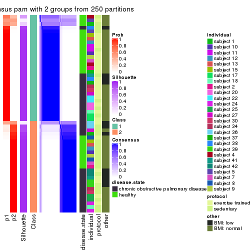</p>

</div>
<div id='tab-CV-pam-consensus-heatmap-2'>
<pre><code class="r">consensus_heatmap(res, k = 3)
</code></pre>

<p>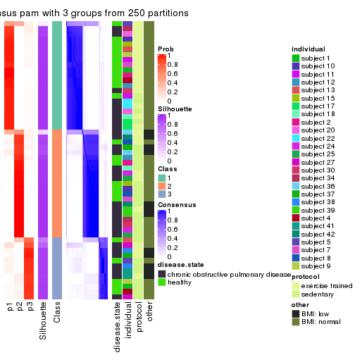</p>

</div>
<div id='tab-CV-pam-consensus-heatmap-3'>
<pre><code class="r">consensus_heatmap(res, k = 4)
</code></pre>

<p>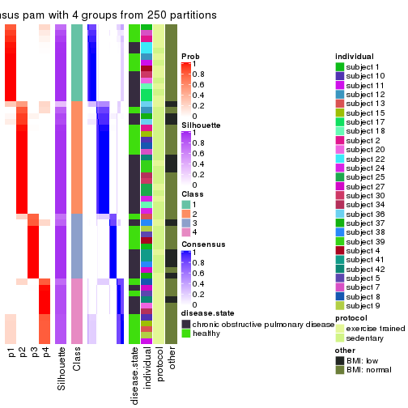</p>

</div>
<div id='tab-CV-pam-consensus-heatmap-4'>
<pre><code class="r">consensus_heatmap(res, k = 5)
</code></pre>

<p>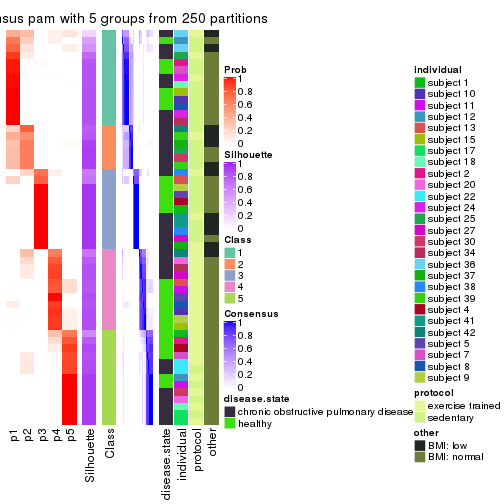</p>

</div>
<div id='tab-CV-pam-consensus-heatmap-5'>
<pre><code class="r">consensus_heatmap(res, k = 6)
</code></pre>

<p>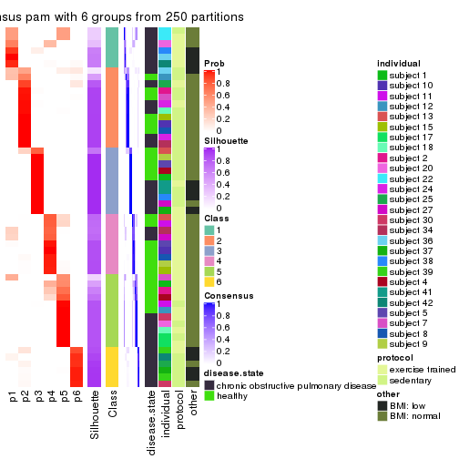</p>

</div>
</div>

Heatmaps for the membership of samples in all partitions to see how consistent they are:


<script>
$( function() {
	$( '#tabs-CV-pam-membership-heatmap' ).tabs();
} );
</script>
<div id='tabs-CV-pam-membership-heatmap'>
<ul>
<li><a href='#tab-CV-pam-membership-heatmap-1'>k = 2</a></li>
<li><a href='#tab-CV-pam-membership-heatmap-2'>k = 3</a></li>
<li><a href='#tab-CV-pam-membership-heatmap-3'>k = 4</a></li>
<li><a href='#tab-CV-pam-membership-heatmap-4'>k = 5</a></li>
<li><a href='#tab-CV-pam-membership-heatmap-5'>k = 6</a></li>
</ul>
<div id='tab-CV-pam-membership-heatmap-1'>
<pre><code class="r">membership_heatmap(res, k = 2)
</code></pre>

<p>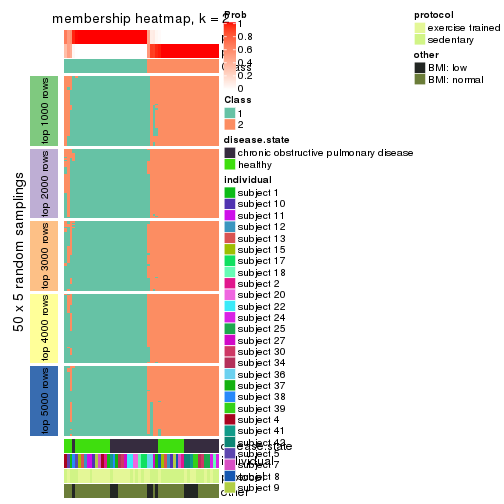</p>

</div>
<div id='tab-CV-pam-membership-heatmap-2'>
<pre><code class="r">membership_heatmap(res, k = 3)
</code></pre>

<p>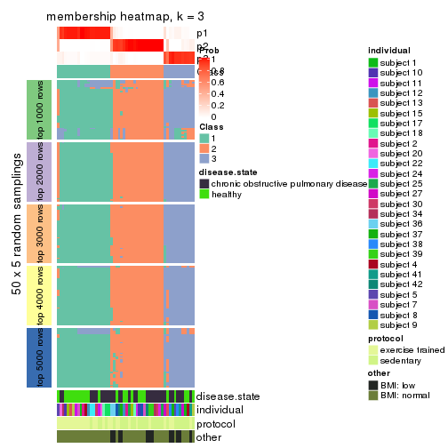</p>

</div>
<div id='tab-CV-pam-membership-heatmap-3'>
<pre><code class="r">membership_heatmap(res, k = 4)
</code></pre>

<p>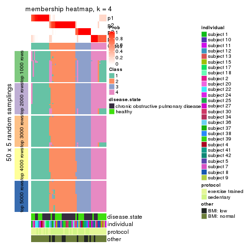</p>

</div>
<div id='tab-CV-pam-membership-heatmap-4'>
<pre><code class="r">membership_heatmap(res, k = 5)
</code></pre>

<p>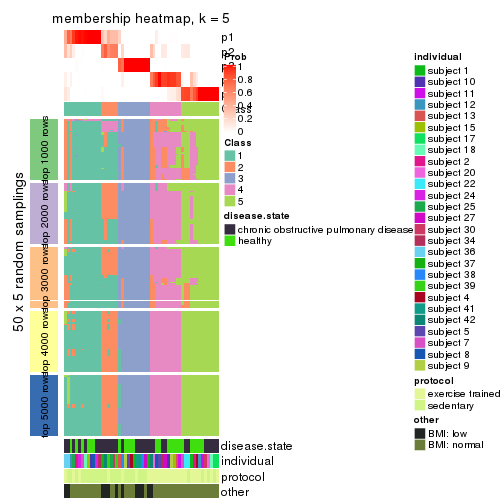</p>

</div>
<div id='tab-CV-pam-membership-heatmap-5'>
<pre><code class="r">membership_heatmap(res, k = 6)
</code></pre>

<p>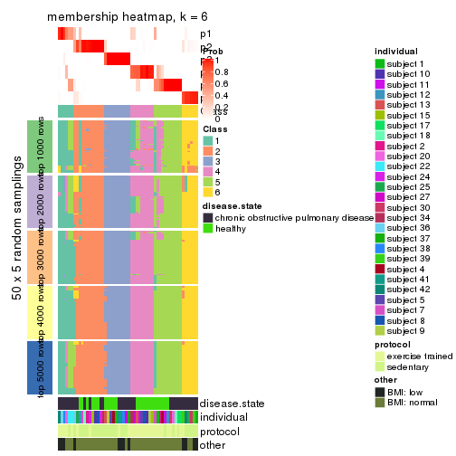</p>

</div>
</div>

As soon as we have had the classes for columns, we can look for signatures
which are significantly different between classes which can be candidate marks
for certain classes. Following are the heatmaps for signatures.


Signature heatmaps where rows are scaled:


<script>
$( function() {
	$( '#tabs-CV-pam-get-signatures' ).tabs();
} );
</script>
<div id='tabs-CV-pam-get-signatures'>
<ul>
<li><a href='#tab-CV-pam-get-signatures-1'>k = 2</a></li>
<li><a href='#tab-CV-pam-get-signatures-2'>k = 3</a></li>
<li><a href='#tab-CV-pam-get-signatures-3'>k = 4</a></li>
<li><a href='#tab-CV-pam-get-signatures-4'>k = 5</a></li>
<li><a href='#tab-CV-pam-get-signatures-5'>k = 6</a></li>
</ul>
<div id='tab-CV-pam-get-signatures-1'>
<pre><code class="r">get_signatures(res, k = 2)
</code></pre>

<p>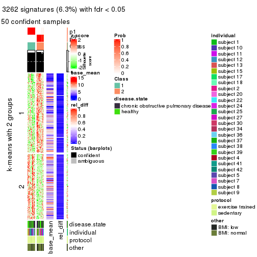</p>

</div>
<div id='tab-CV-pam-get-signatures-2'>
<pre><code class="r">get_signatures(res, k = 3)
</code></pre>

<p>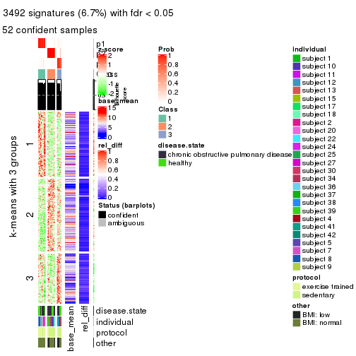</p>

</div>
<div id='tab-CV-pam-get-signatures-3'>
<pre><code class="r">get_signatures(res, k = 4)
</code></pre>

<pre><code>#&gt; Error in mat[ceiling(1:nr/h_ratio), ceiling(1:nc/w_ratio), drop = FALSE]: subscript out of bounds
</code></pre>

<p>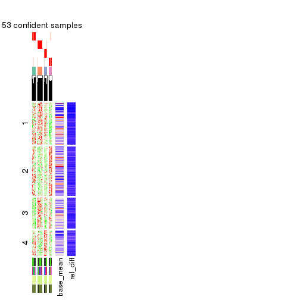</p>

</div>
<div id='tab-CV-pam-get-signatures-4'>
<pre><code class="r">get_signatures(res, k = 5)
</code></pre>

<p>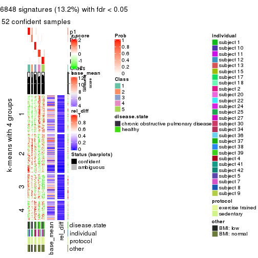</p>

</div>
<div id='tab-CV-pam-get-signatures-5'>
<pre><code class="r">get_signatures(res, k = 6)
</code></pre>

<pre><code>#&gt; Error in mat[ceiling(1:nr/h_ratio), ceiling(1:nc/w_ratio), drop = FALSE]: subscript out of bounds
</code></pre>

<p></p>

</div>
</div>


Signature heatmaps where rows are not scaled:


<script>
$( function() {
	$( '#tabs-CV-pam-get-signatures-no-scale' ).tabs();
} );
</script>
<div id='tabs-CV-pam-get-signatures-no-scale'>
<ul>
<li><a href='#tab-CV-pam-get-signatures-no-scale-1'>k = 2</a></li>
<li><a href='#tab-CV-pam-get-signatures-no-scale-2'>k = 3</a></li>
<li><a href='#tab-CV-pam-get-signatures-no-scale-3'>k = 4</a></li>
<li><a href='#tab-CV-pam-get-signatures-no-scale-4'>k = 5</a></li>
<li><a href='#tab-CV-pam-get-signatures-no-scale-5'>k = 6</a></li>
</ul>
<div id='tab-CV-pam-get-signatures-no-scale-1'>
<pre><code class="r">get_signatures(res, k = 2, scale_rows = FALSE)
</code></pre>

<p>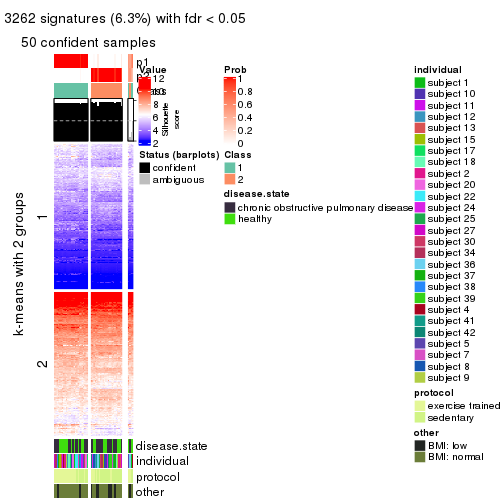</p>

</div>
<div id='tab-CV-pam-get-signatures-no-scale-2'>
<pre><code class="r">get_signatures(res, k = 3, scale_rows = FALSE)
</code></pre>

<p>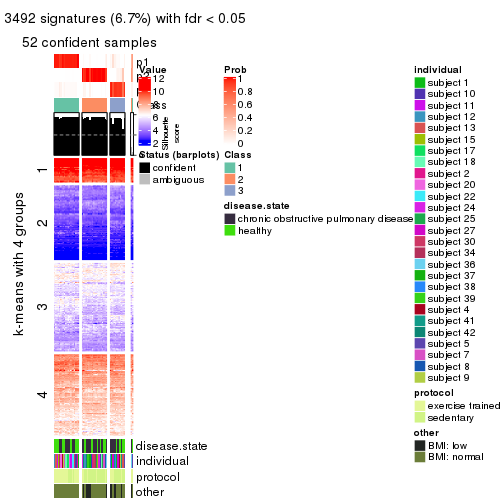</p>

</div>
<div id='tab-CV-pam-get-signatures-no-scale-3'>
<pre><code class="r">get_signatures(res, k = 4, scale_rows = FALSE)
</code></pre>

<p>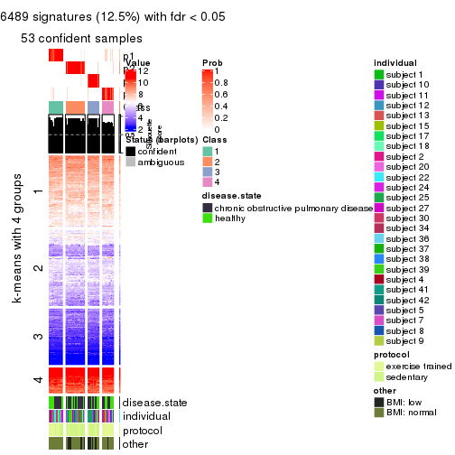</p>

</div>
<div id='tab-CV-pam-get-signatures-no-scale-4'>
<pre><code class="r">get_signatures(res, k = 5, scale_rows = FALSE)
</code></pre>

<p>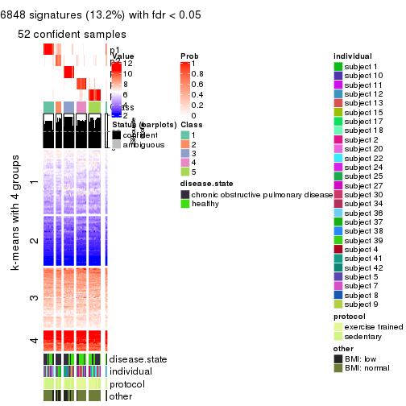</p>

</div>
<div id='tab-CV-pam-get-signatures-no-scale-5'>
<pre><code class="r">get_signatures(res, k = 6, scale_rows = FALSE)
</code></pre>

<p>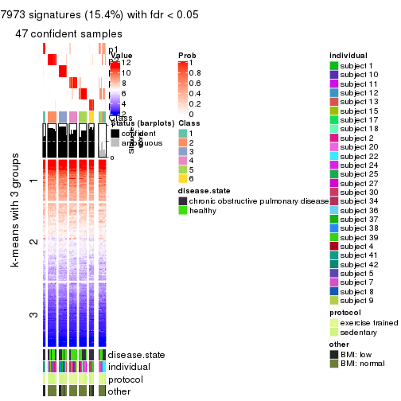</p>

</div>
</div>


Compare the overlap of signatures from different k:

```r
compare_signatures(res)
```

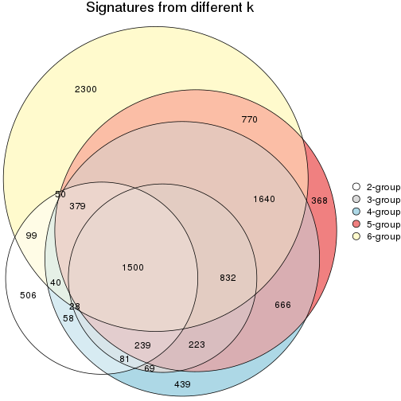

`get_signature()` returns a data frame invisibly. TO get the list of signatures, the function
call should be assigned to a variable explicitly. In following code, if `plot` argument is set
to `FALSE`, no heatmap is plotted while only the differential analysis is performed.

```r
# code only for demonstration
tb = get_signature(res, k = ..., plot = FALSE)
```

An example of the output of `tb` is:

```
#>   which_row         fdr    mean_1    mean_2 scaled_mean_1 scaled_mean_2 km
#> 1        38 0.042760348  8.373488  9.131774    -0.5533452     0.5164555  1
#> 2        40 0.018707592  7.106213  8.469186    -0.6173731     0.5762149  1
#> 3        55 0.019134737 10.221463 11.207825    -0.6159697     0.5749050  1
#> 4        59 0.006059896  5.921854  7.869574    -0.6899429     0.6439467  1
#> 5        60 0.018055526  8.928898 10.211722    -0.6204761     0.5791110  1
#> 6        98 0.009384629 15.714769 14.887706     0.6635654    -0.6193277  2
...
```

The columns in `tb` are:

1. `which_row`: row indices corresponding to the input matrix.
2. `fdr`: FDR for the differential test. 
3. `mean_x`: The mean value in group x.
4. `scaled_mean_x`: The mean value in group x after rows are scaled.
5. `km`: Row groups if k-means clustering is applied to rows.


UMAP plot which shows how samples are separated.


<script>
$( function() {
	$( '#tabs-CV-pam-dimension-reduction' ).tabs();
} );
</script>
<div id='tabs-CV-pam-dimension-reduction'>
<ul>
<li><a href='#tab-CV-pam-dimension-reduction-1'>k = 2</a></li>
<li><a href='#tab-CV-pam-dimension-reduction-2'>k = 3</a></li>
<li><a href='#tab-CV-pam-dimension-reduction-3'>k = 4</a></li>
<li><a href='#tab-CV-pam-dimension-reduction-4'>k = 5</a></li>
<li><a href='#tab-CV-pam-dimension-reduction-5'>k = 6</a></li>
</ul>
<div id='tab-CV-pam-dimension-reduction-1'>
<pre><code class="r">dimension_reduction(res, k = 2, method = &quot;UMAP&quot;)
</code></pre>

<p>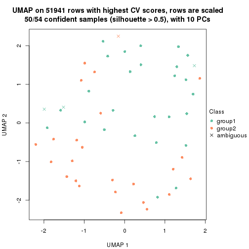</p>

</div>
<div id='tab-CV-pam-dimension-reduction-2'>
<pre><code class="r">dimension_reduction(res, k = 3, method = &quot;UMAP&quot;)
</code></pre>

<p>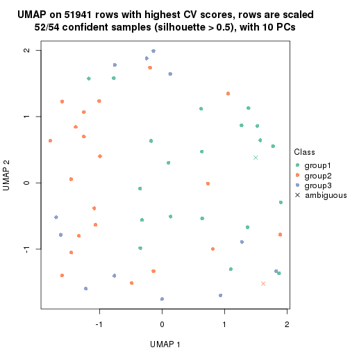</p>

</div>
<div id='tab-CV-pam-dimension-reduction-3'>
<pre><code class="r">dimension_reduction(res, k = 4, method = &quot;UMAP&quot;)
</code></pre>

<p>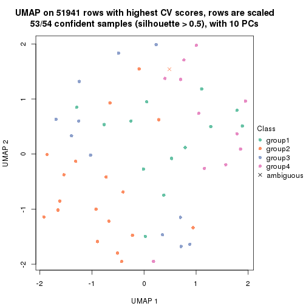</p>

</div>
<div id='tab-CV-pam-dimension-reduction-4'>
<pre><code class="r">dimension_reduction(res, k = 5, method = &quot;UMAP&quot;)
</code></pre>

<p>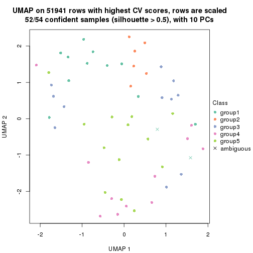</p>

</div>
<div id='tab-CV-pam-dimension-reduction-5'>
<pre><code class="r">dimension_reduction(res, k = 6, method = &quot;UMAP&quot;)
</code></pre>

<p>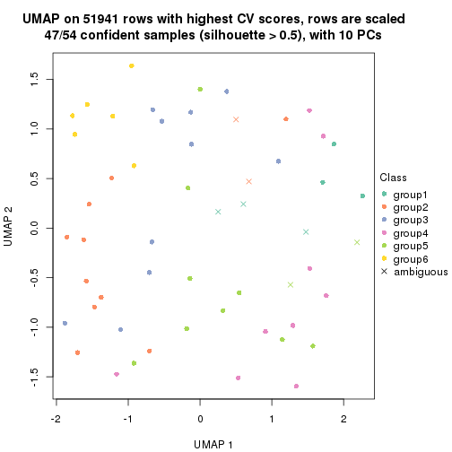</p>

</div>
</div>


Following heatmap shows how subgroups are split when increasing `k`:

```r
collect_classes(res)
```

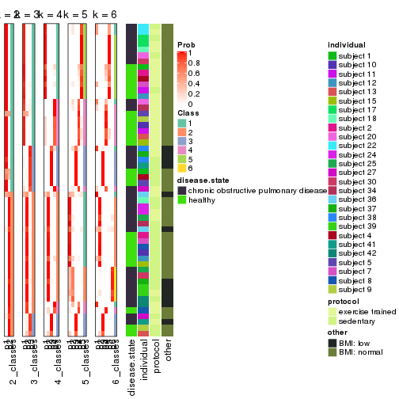


Test correlation between subgroups and known annotations. If the known
annotation is numeric, one-way ANOVA test is applied, and if the known
annotation is discrete, chi-squared contingency table test is applied.

```r
test_to_known_factors(res)
```

```
#>         n disease.state(p) individual(p) protocol(p) other(p) k
#> CV:pam 50           0.7394        0.5783    1.85e-03 4.04e-01 2
#> CV:pam 52           0.4354        0.0936    1.18e-03 9.41e-03 3
#> CV:pam 53           0.4687        0.3829    3.69e-05 3.02e-02 4
#> CV:pam 52           0.1666        0.2525    1.73e-04 2.16e-03 5
#> CV:pam 47           0.0425        0.2707    3.60e-04 8.25e-05 6
```


If matrix rows can be associated to genes, consider to use `functional_enrichment(res,
...)` to perform function enrichment for the signature genes. See [this vignette](http://bioconductor.org/packages/devel/bioc/vignettes/cola/inst/doc/functional_enrichment.html) for more detailed explanations.


 

---------------------------------------------------


### CV:mclust


The object with results only for a single top-value method and a single partition method 
can be extracted as:

```r
res = res_list["CV", "mclust"]
# you can also extract it by
# res = res_list["CV:mclust"]
```

A summary of `res` and all the functions that can be applied to it:

```r
res
```

```
#> A 'ConsensusPartition' object with k = 2, 3, 4, 5, 6.
#>   On a matrix with 51941 rows and 54 columns.
#>   Top rows (1000, 2000, 3000, 4000, 5000) are extracted by 'CV' method.
#>   Subgroups are detected by 'mclust' method.
#>   Performed in total 1250 partitions by row resampling.
#>   Best k for subgroups seems to be 4.
#> 
#> Following methods can be applied to this 'ConsensusPartition' object:
#>  [1] "cola_report"             "collect_classes"         "collect_plots"          
#>  [4] "collect_stats"           "colnames"                "compare_signatures"     
#>  [7] "consensus_heatmap"       "dimension_reduction"     "functional_enrichment"  
#> [10] "get_anno_col"            "get_anno"                "get_classes"            
#> [13] "get_consensus"           "get_matrix"              "get_membership"         
#> [16] "get_param"               "get_signatures"          "get_stats"              
#> [19] "is_best_k"               "is_stable_k"             "membership_heatmap"     
#> [22] "ncol"                    "nrow"                    "plot_ecdf"              
#> [25] "rownames"                "select_partition_number" "show"                   
#> [28] "suggest_best_k"          "test_to_known_factors"
```

`collect_plots()` function collects all the plots made from `res` for all `k` (number of partitions)
into one single page to provide an easy and fast comparison between different `k`.

```r
collect_plots(res)
```

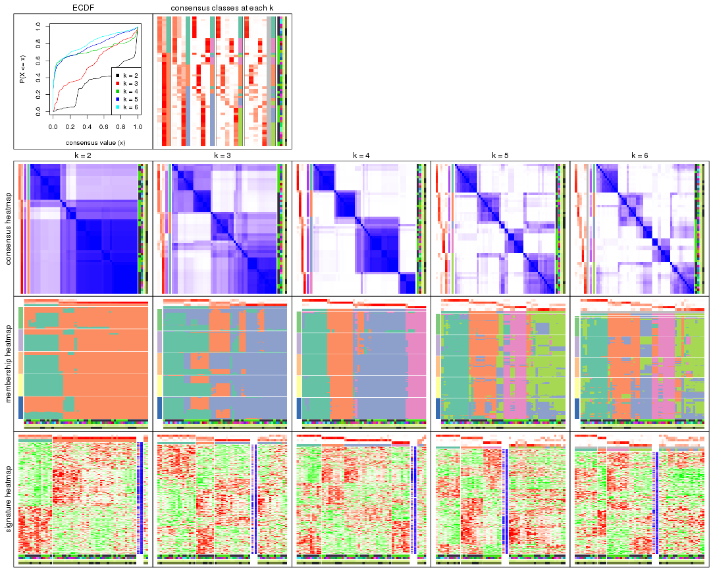

The plots are:

- The first row: a plot of the ECDF (empirical cumulative distribution
  function) curves of the consensus matrix for each `k` and the heatmap of
  predicted classes for each `k`.
- The second row: heatmaps of the consensus matrix for each `k`.
- The third row: heatmaps of the membership matrix for each `k`.
- The fouth row: heatmaps of the signatures for each `k`.

All the plots in panels can be made by individual functions and they are
plotted later in this section.

`select_partition_number()` produces several plots showing different
statistics for choosing "optimized" `k`. There are following statistics:

- ECDF curves of the consensus matrix for each `k`;
- 1-PAC. [The PAC
  score](https://en.wikipedia.org/wiki/Consensus_clustering#Over-interpretation_potential_of_consensus_clustering)
  measures the proportion of the ambiguous subgrouping.
- Mean silhouette score.
- Concordance. The mean probability of fiting the consensus class ids in all
  partitions.
- Area increased. Denote $A_k$ as the area under the ECDF curve for current
  `k`, the area increased is defined as $A_k - A_{k-1}$.
- Rand index. The percent of pairs of samples that are both in a same cluster
  or both are not in a same cluster in the partition of k and k-1.
- Jaccard index. The ratio of pairs of samples are both in a same cluster in
  the partition of k and k-1 and the pairs of samples are both in a same
  cluster in the partition k or k-1.

The detailed explanations of these statistics can be found in [the _cola_
vignette](http://bioconductor.org/packages/devel/bioc/vignettes/cola/inst/doc/cola.html#toc_13).

Generally speaking, lower PAC score, higher mean silhouette score or higher
concordance corresponds to better partition. Rand index and Jaccard index
measure how similar the current partition is compared to partition with `k-1`.
If they are too similar, we won't accept `k` is better than `k-1`.

```r
select_partition_number(res)
```

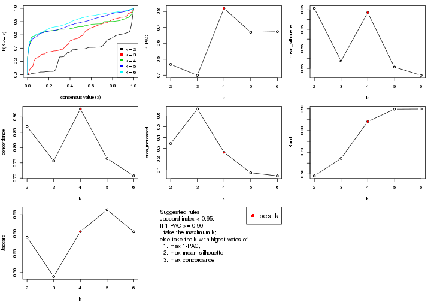

The numeric values for all these statistics can be obtained by `get_stats()`.

```r
get_stats(res)
```

```
#>   k 1-PAC mean_silhouette concordance area_increased  Rand Jaccard
#> 2 2 0.467           0.857       0.869         0.3444 0.591   0.591
#> 3 3 0.399           0.588       0.756         0.6639 0.672   0.490
#> 4 4 0.820           0.836       0.926         0.2631 0.841   0.606
#> 5 5 0.670           0.557       0.764         0.0735 0.899   0.663
#> 6 6 0.673           0.515       0.707         0.0449 0.899   0.605
```

`suggest_best_k()` suggests the best $k$ based on these statistics. The rules are as follows:

- All $k$ with Jaccard index larger than 0.95 are removed because increasing
  $k$ does not provide enough extra information. If all $k$ are removed, it is
  marked as no subgroup is detected.
- For all $k$ with 1-PAC score larger than 0.9, the maximal $k$ is taken as
  the best $k$, and other $k$ are marked as optional $k$.
- If it does not fit the second rule. The $k$ with the maximal vote of the
  highest 1-PAC score, highest mean silhouette, and highest concordance is
  taken as the best $k$.

```r
suggest_best_k(res)
```

```
#> [1] 4
```


Following shows the table of the partitions (You need to click the **show/hide
code output** link to see it). The membership matrix (columns with name `p*`)
is inferred by
[`clue::cl_consensus()`](https://www.rdocumentation.org/link/cl_consensus?package=clue)
function with the `SE` method. Basically the value in the membership matrix
represents the probability to belong to a certain group. The finall class
label for an item is determined with the group with highest probability it
belongs to.

In `get_classes()` function, the entropy is calculated from the membership
matrix and the silhouette score is calculated from the consensus matrix.


<script>
$( function() {
	$( '#tabs-CV-mclust-get-classes' ).tabs();
} );
</script>
<div id='tabs-CV-mclust-get-classes'>
<ul>
<li><a href='#tab-CV-mclust-get-classes-1'>k = 2</a></li>
<li><a href='#tab-CV-mclust-get-classes-2'>k = 3</a></li>
<li><a href='#tab-CV-mclust-get-classes-3'>k = 4</a></li>
<li><a href='#tab-CV-mclust-get-classes-4'>k = 5</a></li>
<li><a href='#tab-CV-mclust-get-classes-5'>k = 6</a></li>
</ul>

<div id='tab-CV-mclust-get-classes-1'>
<p><a id='tab-CV-mclust-get-classes-1-a' style='color:#0366d6' href='#'>show/hide code output</a></p>
<pre><code class="r">cbind(get_classes(res, k = 2), get_membership(res, k = 2))
</code></pre>

<pre><code>#&gt;           class entropy silhouette    p1    p2
#&gt; GSM680053     2  0.0938      0.906 0.012 0.988
#&gt; GSM680062     2  0.0000      0.909 0.000 1.000
#&gt; GSM680054     2  0.2423      0.898 0.040 0.960
#&gt; GSM680063     2  0.0000      0.909 0.000 1.000
#&gt; GSM680055     2  0.0000      0.909 0.000 1.000
#&gt; GSM680064     1  0.8661      0.935 0.712 0.288
#&gt; GSM680056     1  0.9833      0.803 0.576 0.424
#&gt; GSM680065     1  0.8763      0.937 0.704 0.296
#&gt; GSM680057     2  0.1843      0.904 0.028 0.972
#&gt; GSM680066     2  0.0000      0.909 0.000 1.000
#&gt; GSM680058     2  0.1843      0.904 0.028 0.972
#&gt; GSM680067     2  0.1414      0.907 0.020 0.980
#&gt; GSM680059     2  0.1843      0.895 0.028 0.972
#&gt; GSM680068     1  0.9460      0.895 0.636 0.364
#&gt; GSM680060     2  0.1414      0.907 0.020 0.980
#&gt; GSM680069     2  0.0000      0.909 0.000 1.000
#&gt; GSM680061     2  0.1414      0.907 0.020 0.980
#&gt; GSM680070     1  0.8763      0.937 0.704 0.296
#&gt; GSM680071     2  0.1414      0.907 0.020 0.980
#&gt; GSM680077     1  0.8499      0.931 0.724 0.276
#&gt; GSM680072     2  0.1633      0.907 0.024 0.976
#&gt; GSM680078     2  0.0000      0.909 0.000 1.000
#&gt; GSM680073     2  0.0000      0.909 0.000 1.000
#&gt; GSM680079     1  0.8763      0.937 0.704 0.296
#&gt; GSM680074     2  0.1414      0.907 0.020 0.980
#&gt; GSM680080     2  0.1633      0.907 0.024 0.976
#&gt; GSM680075     2  0.0000      0.909 0.000 1.000
#&gt; GSM680081     2  0.0000      0.909 0.000 1.000
#&gt; GSM680076     2  0.1414      0.907 0.020 0.980
#&gt; GSM680082     1  0.8499      0.931 0.724 0.276
#&gt; GSM680029     2  0.0938      0.906 0.012 0.988
#&gt; GSM680041     1  0.8661      0.935 0.712 0.288
#&gt; GSM680035     2  0.8207      0.637 0.256 0.744
#&gt; GSM680047     1  0.9522      0.885 0.628 0.372
#&gt; GSM680036     2  0.0938      0.906 0.012 0.988
#&gt; GSM680048     1  0.9815      0.815 0.580 0.420
#&gt; GSM680037     2  0.6801      0.729 0.180 0.820
#&gt; GSM680049     1  0.8443      0.929 0.728 0.272
#&gt; GSM680038     2  0.1843      0.904 0.028 0.972
#&gt; GSM680050     1  0.8499      0.931 0.724 0.276
#&gt; GSM680039     2  0.0000      0.909 0.000 1.000
#&gt; GSM680051     2  0.8443      0.310 0.272 0.728
#&gt; GSM680040     2  0.8207      0.637 0.256 0.744
#&gt; GSM680052     2  0.8499      0.295 0.276 0.724
#&gt; GSM680030     2  0.1843      0.904 0.028 0.972
#&gt; GSM680042     1  0.8661      0.935 0.712 0.288
#&gt; GSM680031     2  0.7528      0.686 0.216 0.784
#&gt; GSM680043     2  0.0000      0.909 0.000 1.000
#&gt; GSM680032     2  0.6623      0.631 0.172 0.828
#&gt; GSM680044     2  0.0376      0.907 0.004 0.996
#&gt; GSM680033     2  0.8207      0.637 0.256 0.744
#&gt; GSM680045     2  0.0000      0.909 0.000 1.000
#&gt; GSM680034     2  0.0938      0.909 0.012 0.988
#&gt; GSM680046     1  0.9522      0.885 0.628 0.372
</code></pre>

<script>
$('#tab-CV-mclust-get-classes-1-a').parent().next().next().hide();
$('#tab-CV-mclust-get-classes-1-a').click(function(){
  $('#tab-CV-mclust-get-classes-1-a').parent().next().next().toggle();
  return(false);
});
</script>
</div>

<div id='tab-CV-mclust-get-classes-2'>
<p><a id='tab-CV-mclust-get-classes-2-a' style='color:#0366d6' href='#'>show/hide code output</a></p>
<pre><code class="r">cbind(get_classes(res, k = 3), get_membership(res, k = 3))
</code></pre>

<pre><code>#&gt;           class entropy silhouette    p1    p2    p3
#&gt; GSM680053     3  0.1643      0.739 0.044 0.000 0.956
#&gt; GSM680062     3  0.2200      0.732 0.056 0.004 0.940
#&gt; GSM680054     3  0.5247      0.400 0.008 0.224 0.768
#&gt; GSM680063     3  0.2096      0.735 0.052 0.004 0.944
#&gt; GSM680055     3  0.2096      0.734 0.052 0.004 0.944
#&gt; GSM680064     1  0.6381      0.727 0.648 0.340 0.012
#&gt; GSM680056     1  0.7238      0.727 0.628 0.328 0.044
#&gt; GSM680065     1  0.6651      0.729 0.640 0.340 0.020
#&gt; GSM680057     3  0.7578     -0.637 0.040 0.460 0.500
#&gt; GSM680066     3  0.5480      0.426 0.264 0.004 0.732
#&gt; GSM680058     2  0.6822      0.669 0.012 0.508 0.480
#&gt; GSM680067     2  0.7442      0.830 0.048 0.604 0.348
#&gt; GSM680059     3  0.1163      0.734 0.028 0.000 0.972
#&gt; GSM680068     1  0.6890      0.729 0.632 0.340 0.028
#&gt; GSM680060     2  0.6427      0.814 0.012 0.640 0.348
#&gt; GSM680069     3  0.5292      0.490 0.228 0.008 0.764
#&gt; GSM680061     2  0.7328      0.832 0.044 0.612 0.344
#&gt; GSM680070     1  0.6651      0.729 0.640 0.340 0.020
#&gt; GSM680071     2  0.9962      0.456 0.292 0.364 0.344
#&gt; GSM680077     1  0.6104      0.724 0.648 0.348 0.004
#&gt; GSM680072     3  0.5024      0.398 0.004 0.220 0.776
#&gt; GSM680078     3  0.8171      0.328 0.172 0.184 0.644
#&gt; GSM680073     3  0.1878      0.738 0.044 0.004 0.952
#&gt; GSM680079     1  0.6381      0.727 0.648 0.340 0.012
#&gt; GSM680074     2  0.6104      0.803 0.004 0.648 0.348
#&gt; GSM680080     2  0.6521      0.644 0.004 0.504 0.492
#&gt; GSM680075     3  0.1878      0.738 0.044 0.004 0.952
#&gt; GSM680081     3  0.1643      0.739 0.044 0.000 0.956
#&gt; GSM680076     2  0.7442      0.832 0.048 0.604 0.348
#&gt; GSM680082     1  0.6104      0.724 0.648 0.348 0.004
#&gt; GSM680029     3  0.1529      0.739 0.040 0.000 0.960
#&gt; GSM680041     1  0.2866      0.709 0.916 0.008 0.076
#&gt; GSM680035     3  0.0661      0.711 0.004 0.008 0.988
#&gt; GSM680047     1  0.3412      0.696 0.876 0.000 0.124
#&gt; GSM680036     3  0.1643      0.739 0.044 0.000 0.956
#&gt; GSM680048     1  0.3826      0.693 0.868 0.008 0.124
#&gt; GSM680037     3  0.0661      0.711 0.004 0.008 0.988
#&gt; GSM680049     1  0.2749      0.708 0.924 0.012 0.064
#&gt; GSM680038     3  0.7065     -0.235 0.032 0.352 0.616
#&gt; GSM680050     1  0.7847      0.732 0.588 0.344 0.068
#&gt; GSM680039     3  0.5069      0.570 0.044 0.128 0.828
#&gt; GSM680051     1  0.4755      0.664 0.808 0.008 0.184
#&gt; GSM680040     3  0.0661      0.711 0.004 0.008 0.988
#&gt; GSM680052     1  0.4164      0.688 0.848 0.008 0.144
#&gt; GSM680030     3  0.6905     -0.540 0.016 0.440 0.544
#&gt; GSM680042     1  0.2680      0.709 0.924 0.008 0.068
#&gt; GSM680031     3  0.0848      0.714 0.008 0.008 0.984
#&gt; GSM680043     1  0.6678      0.158 0.512 0.008 0.480
#&gt; GSM680032     1  0.6498      0.236 0.596 0.008 0.396
#&gt; GSM680044     1  0.6513      0.178 0.520 0.004 0.476
#&gt; GSM680033     3  0.0661      0.711 0.004 0.008 0.988
#&gt; GSM680045     3  0.6189      0.248 0.364 0.004 0.632
#&gt; GSM680034     2  0.7582      0.811 0.048 0.572 0.380
#&gt; GSM680046     1  0.3644      0.694 0.872 0.004 0.124
</code></pre>

<script>
$('#tab-CV-mclust-get-classes-2-a').parent().next().next().hide();
$('#tab-CV-mclust-get-classes-2-a').click(function(){
  $('#tab-CV-mclust-get-classes-2-a').parent().next().next().toggle();
  return(false);
});
</script>
</div>

<div id='tab-CV-mclust-get-classes-3'>
<p><a id='tab-CV-mclust-get-classes-3-a' style='color:#0366d6' href='#'>show/hide code output</a></p>
<pre><code class="r">cbind(get_classes(res, k = 4), get_membership(res, k = 4))
</code></pre>

<pre><code>#&gt;           class entropy silhouette    p1    p2    p3    p4
#&gt; GSM680053     3  0.0921     0.8902 0.028 0.000 0.972 0.000
#&gt; GSM680062     3  0.1388     0.8872 0.028 0.000 0.960 0.012
#&gt; GSM680054     3  0.4304     0.6278 0.000 0.284 0.716 0.000
#&gt; GSM680063     3  0.1388     0.8872 0.028 0.000 0.960 0.012
#&gt; GSM680055     3  0.1388     0.8872 0.028 0.000 0.960 0.012
#&gt; GSM680064     1  0.0000     0.9406 1.000 0.000 0.000 0.000
#&gt; GSM680056     1  0.2867     0.8619 0.884 0.000 0.104 0.012
#&gt; GSM680065     1  0.0469     0.9384 0.988 0.000 0.000 0.012
#&gt; GSM680057     2  0.0336     0.9382 0.000 0.992 0.008 0.000
#&gt; GSM680066     3  0.6270     0.5992 0.212 0.096 0.680 0.012
#&gt; GSM680058     2  0.0469     0.9357 0.000 0.988 0.012 0.000
#&gt; GSM680067     2  0.0000     0.9406 0.000 1.000 0.000 0.000
#&gt; GSM680059     3  0.0336     0.8877 0.008 0.000 0.992 0.000
#&gt; GSM680068     1  0.0804     0.9367 0.980 0.000 0.008 0.012
#&gt; GSM680060     2  0.0000     0.9406 0.000 1.000 0.000 0.000
#&gt; GSM680069     3  0.2805     0.8436 0.100 0.000 0.888 0.012
#&gt; GSM680061     2  0.0000     0.9406 0.000 1.000 0.000 0.000
#&gt; GSM680070     1  0.0188     0.9412 0.996 0.000 0.000 0.004
#&gt; GSM680071     2  0.5028     0.3536 0.400 0.596 0.004 0.000
#&gt; GSM680077     1  0.0188     0.9396 0.996 0.004 0.000 0.000
#&gt; GSM680072     3  0.4647     0.6165 0.008 0.288 0.704 0.000
#&gt; GSM680078     1  0.3625     0.7940 0.828 0.000 0.160 0.012
#&gt; GSM680073     3  0.0921     0.8902 0.028 0.000 0.972 0.000
#&gt; GSM680079     1  0.0188     0.9412 0.996 0.000 0.000 0.004
#&gt; GSM680074     2  0.0000     0.9406 0.000 1.000 0.000 0.000
#&gt; GSM680080     2  0.0188     0.9394 0.004 0.996 0.000 0.000
#&gt; GSM680075     3  0.0921     0.8902 0.028 0.000 0.972 0.000
#&gt; GSM680081     3  0.0921     0.8902 0.028 0.000 0.972 0.000
#&gt; GSM680076     2  0.0921     0.9193 0.028 0.972 0.000 0.000
#&gt; GSM680082     1  0.0188     0.9396 0.996 0.004 0.000 0.000
#&gt; GSM680029     3  0.0817     0.8902 0.024 0.000 0.976 0.000
#&gt; GSM680041     4  0.1398     0.8985 0.040 0.004 0.000 0.956
#&gt; GSM680035     3  0.0000     0.8860 0.000 0.000 1.000 0.000
#&gt; GSM680047     4  0.0000     0.9109 0.000 0.000 0.000 1.000
#&gt; GSM680036     3  0.0921     0.8902 0.028 0.000 0.972 0.000
#&gt; GSM680048     4  0.0000     0.9109 0.000 0.000 0.000 1.000
#&gt; GSM680037     3  0.0000     0.8860 0.000 0.000 1.000 0.000
#&gt; GSM680049     4  0.1398     0.8985 0.040 0.004 0.000 0.956
#&gt; GSM680038     3  0.4989     0.1865 0.000 0.472 0.528 0.000
#&gt; GSM680050     1  0.0188     0.9396 0.996 0.004 0.000 0.000
#&gt; GSM680039     3  0.1716     0.8651 0.000 0.064 0.936 0.000
#&gt; GSM680051     4  0.0000     0.9109 0.000 0.000 0.000 1.000
#&gt; GSM680040     3  0.0000     0.8860 0.000 0.000 1.000 0.000
#&gt; GSM680052     4  0.0000     0.9109 0.000 0.000 0.000 1.000
#&gt; GSM680030     2  0.1940     0.8715 0.000 0.924 0.076 0.000
#&gt; GSM680042     4  0.1398     0.8985 0.040 0.004 0.000 0.956
#&gt; GSM680031     3  0.0000     0.8860 0.000 0.000 1.000 0.000
#&gt; GSM680043     4  0.5119     0.0819 0.004 0.000 0.440 0.556
#&gt; GSM680032     1  0.3217     0.8339 0.860 0.000 0.128 0.012
#&gt; GSM680044     3  0.3308     0.8316 0.036 0.000 0.872 0.092
#&gt; GSM680033     3  0.0000     0.8860 0.000 0.000 1.000 0.000
#&gt; GSM680045     3  0.5212     0.2537 0.008 0.000 0.572 0.420
#&gt; GSM680034     2  0.0000     0.9406 0.000 1.000 0.000 0.000
#&gt; GSM680046     4  0.0000     0.9109 0.000 0.000 0.000 1.000
</code></pre>

<script>
$('#tab-CV-mclust-get-classes-3-a').parent().next().next().hide();
$('#tab-CV-mclust-get-classes-3-a').click(function(){
  $('#tab-CV-mclust-get-classes-3-a').parent().next().next().toggle();
  return(false);
});
</script>
</div>

<div id='tab-CV-mclust-get-classes-4'>
<p><a id='tab-CV-mclust-get-classes-4-a' style='color:#0366d6' href='#'>show/hide code output</a></p>
<pre><code class="r">cbind(get_classes(res, k = 5), get_membership(res, k = 5))
</code></pre>

<pre><code>#&gt;           class entropy silhouette    p1    p2    p3    p4    p5
#&gt; GSM680053     5  0.4225     0.2987 0.004 0.000 0.364 0.000 0.632
#&gt; GSM680062     5  0.5781     0.3574 0.008 0.000 0.260 0.112 0.620
#&gt; GSM680054     5  0.4497     0.0642 0.000 0.352 0.016 0.000 0.632
#&gt; GSM680063     5  0.4102     0.3824 0.004 0.000 0.300 0.004 0.692
#&gt; GSM680055     5  0.4375     0.3029 0.004 0.000 0.364 0.004 0.628
#&gt; GSM680064     1  0.1591     0.8736 0.940 0.004 0.052 0.004 0.000
#&gt; GSM680056     1  0.3812     0.7508 0.796 0.000 0.168 0.004 0.032
#&gt; GSM680065     1  0.0955     0.8724 0.968 0.000 0.028 0.004 0.000
#&gt; GSM680057     2  0.3408     0.7519 0.004 0.840 0.008 0.020 0.128
#&gt; GSM680066     1  0.7339     0.0798 0.484 0.036 0.188 0.008 0.284
#&gt; GSM680058     2  0.3478     0.7734 0.032 0.844 0.016 0.000 0.108
#&gt; GSM680067     2  0.2142     0.7812 0.000 0.920 0.028 0.048 0.004
#&gt; GSM680059     5  0.4270    -0.1408 0.004 0.004 0.336 0.000 0.656
#&gt; GSM680068     1  0.1798     0.8736 0.928 0.004 0.064 0.004 0.000
#&gt; GSM680060     2  0.3193     0.7791 0.032 0.852 0.112 0.000 0.004
#&gt; GSM680069     5  0.6346     0.1802 0.160 0.000 0.320 0.004 0.516
#&gt; GSM680061     2  0.1828     0.7837 0.000 0.936 0.028 0.032 0.004
#&gt; GSM680070     1  0.1518     0.8741 0.944 0.004 0.048 0.004 0.000
#&gt; GSM680071     2  0.5051     0.3934 0.392 0.576 0.024 0.008 0.000
#&gt; GSM680077     1  0.0671     0.8717 0.980 0.004 0.016 0.000 0.000
#&gt; GSM680072     3  0.6811     0.0867 0.000 0.336 0.360 0.000 0.304
#&gt; GSM680078     1  0.4382     0.6905 0.700 0.000 0.276 0.004 0.020
#&gt; GSM680073     3  0.4507     0.3259 0.004 0.004 0.580 0.000 0.412
#&gt; GSM680079     1  0.1571     0.8744 0.936 0.004 0.060 0.000 0.000
#&gt; GSM680074     2  0.3276     0.7717 0.032 0.836 0.132 0.000 0.000
#&gt; GSM680080     2  0.3396     0.7726 0.028 0.832 0.136 0.000 0.004
#&gt; GSM680075     3  0.4490     0.3244 0.004 0.004 0.588 0.000 0.404
#&gt; GSM680081     5  0.4044     0.4033 0.012 0.004 0.252 0.000 0.732
#&gt; GSM680076     2  0.3759     0.7548 0.056 0.808 0.136 0.000 0.000
#&gt; GSM680082     1  0.0671     0.8717 0.980 0.004 0.016 0.000 0.000
#&gt; GSM680029     5  0.4264     0.2602 0.004 0.000 0.376 0.000 0.620
#&gt; GSM680041     4  0.4734     0.7330 0.108 0.000 0.160 0.732 0.000
#&gt; GSM680035     5  0.0510     0.4475 0.000 0.000 0.016 0.000 0.984
#&gt; GSM680047     4  0.0609     0.8082 0.000 0.000 0.020 0.980 0.000
#&gt; GSM680036     5  0.4321     0.2219 0.004 0.000 0.396 0.000 0.600
#&gt; GSM680048     4  0.0162     0.8084 0.000 0.000 0.004 0.996 0.000
#&gt; GSM680037     5  0.0963     0.4538 0.000 0.000 0.036 0.000 0.964
#&gt; GSM680049     4  0.4888     0.7315 0.108 0.004 0.160 0.728 0.000
#&gt; GSM680038     2  0.5065     0.2267 0.000 0.524 0.008 0.020 0.448
#&gt; GSM680050     1  0.0613     0.8731 0.984 0.004 0.004 0.008 0.000
#&gt; GSM680039     5  0.5282    -0.0359 0.004 0.440 0.024 0.008 0.524
#&gt; GSM680051     4  0.0324     0.8078 0.000 0.004 0.004 0.992 0.000
#&gt; GSM680040     5  0.0510     0.4505 0.000 0.000 0.016 0.000 0.984
#&gt; GSM680052     4  0.0324     0.8078 0.000 0.004 0.004 0.992 0.000
#&gt; GSM680030     2  0.3674     0.7318 0.004 0.816 0.008 0.020 0.152
#&gt; GSM680042     4  0.4734     0.7330 0.108 0.000 0.160 0.732 0.000
#&gt; GSM680031     5  0.0162     0.4527 0.000 0.000 0.004 0.000 0.996
#&gt; GSM680043     4  0.4835     0.4104 0.000 0.016 0.016 0.648 0.320
#&gt; GSM680032     1  0.2234     0.8545 0.916 0.004 0.060 0.004 0.016
#&gt; GSM680044     5  0.7439     0.2518 0.104 0.004 0.172 0.176 0.544
#&gt; GSM680033     5  0.0609     0.4444 0.000 0.000 0.020 0.000 0.980
#&gt; GSM680045     4  0.4882     0.2520 0.000 0.012 0.012 0.588 0.388
#&gt; GSM680034     2  0.3857     0.7648 0.000 0.832 0.028 0.052 0.088
#&gt; GSM680046     4  0.0771     0.8081 0.000 0.004 0.020 0.976 0.000
</code></pre>

<script>
$('#tab-CV-mclust-get-classes-4-a').parent().next().next().hide();
$('#tab-CV-mclust-get-classes-4-a').click(function(){
  $('#tab-CV-mclust-get-classes-4-a').parent().next().next().toggle();
  return(false);
});
</script>
</div>

<div id='tab-CV-mclust-get-classes-5'>
<p><a id='tab-CV-mclust-get-classes-5-a' style='color:#0366d6' href='#'>show/hide code output</a></p>
<pre><code class="r">cbind(get_classes(res, k = 6), get_membership(res, k = 6))
</code></pre>

<pre><code>#&gt;           class entropy silhouette    p1    p2    p3    p4    p5 p6
#&gt; GSM680053     5  0.1350     0.6555 0.020 0.000 0.020 0.000 0.952 NA
#&gt; GSM680062     5  0.5189     0.5300 0.012 0.000 0.108 0.144 0.704 NA
#&gt; GSM680054     5  0.6125    -0.3490 0.000 0.312 0.340 0.000 0.348 NA
#&gt; GSM680063     5  0.3088     0.6213 0.004 0.004 0.064 0.028 0.868 NA
#&gt; GSM680055     5  0.1036     0.6570 0.024 0.000 0.008 0.004 0.964 NA
#&gt; GSM680064     1  0.3067     0.8152 0.868 0.016 0.024 0.012 0.004 NA
#&gt; GSM680056     1  0.5598     0.6155 0.648 0.004 0.044 0.028 0.240 NA
#&gt; GSM680065     1  0.2543     0.8245 0.904 0.004 0.024 0.012 0.024 NA
#&gt; GSM680057     3  0.4810    -0.3420 0.000 0.420 0.536 0.000 0.032 NA
#&gt; GSM680066     1  0.6013     0.2426 0.496 0.028 0.028 0.032 0.404 NA
#&gt; GSM680058     2  0.4130     0.4926 0.000 0.672 0.300 0.000 0.024 NA
#&gt; GSM680067     2  0.5754     0.4902 0.000 0.476 0.380 0.008 0.000 NA
#&gt; GSM680059     5  0.6633     0.2539 0.004 0.020 0.224 0.004 0.416 NA
#&gt; GSM680068     1  0.2015     0.8257 0.916 0.012 0.000 0.000 0.056 NA
#&gt; GSM680060     2  0.1349     0.6291 0.000 0.940 0.056 0.000 0.004 NA
#&gt; GSM680069     5  0.4318     0.5479 0.180 0.004 0.020 0.028 0.756 NA
#&gt; GSM680061     2  0.5694     0.4948 0.000 0.484 0.368 0.004 0.000 NA
#&gt; GSM680070     1  0.0964     0.8304 0.968 0.012 0.000 0.000 0.004 NA
#&gt; GSM680071     2  0.6479     0.3992 0.316 0.500 0.136 0.024 0.024 NA
#&gt; GSM680077     1  0.0767     0.8313 0.976 0.012 0.004 0.000 0.000 NA
#&gt; GSM680072     2  0.7233     0.1785 0.000 0.444 0.136 0.004 0.160 NA
#&gt; GSM680078     1  0.5385     0.2354 0.480 0.004 0.016 0.028 0.456 NA
#&gt; GSM680073     5  0.5205     0.5359 0.024 0.020 0.036 0.004 0.660 NA
#&gt; GSM680079     1  0.1390     0.8274 0.948 0.004 0.016 0.000 0.000 NA
#&gt; GSM680074     2  0.0692     0.6238 0.000 0.976 0.020 0.000 0.000 NA
#&gt; GSM680080     2  0.1485     0.6127 0.000 0.944 0.024 0.000 0.004 NA
#&gt; GSM680075     5  0.4997     0.5419 0.024 0.020 0.024 0.004 0.672 NA
#&gt; GSM680081     5  0.2573     0.5582 0.008 0.000 0.132 0.004 0.856 NA
#&gt; GSM680076     2  0.0146     0.6267 0.004 0.996 0.000 0.000 0.000 NA
#&gt; GSM680082     1  0.0837     0.8311 0.972 0.020 0.004 0.000 0.000 NA
#&gt; GSM680029     5  0.1857     0.6423 0.004 0.000 0.028 0.000 0.924 NA
#&gt; GSM680041     4  0.4786     0.6237 0.044 0.004 0.000 0.540 0.000 NA
#&gt; GSM680035     3  0.5182     0.3704 0.000 0.000 0.532 0.000 0.372 NA
#&gt; GSM680047     4  0.0790     0.7816 0.000 0.000 0.000 0.968 0.000 NA
#&gt; GSM680036     5  0.1718     0.6561 0.020 0.000 0.020 0.000 0.936 NA
#&gt; GSM680048     4  0.0146     0.7834 0.000 0.000 0.000 0.996 0.004 NA
#&gt; GSM680037     3  0.5187     0.2866 0.000 0.000 0.472 0.000 0.440 NA
#&gt; GSM680049     4  0.4903     0.6126 0.044 0.008 0.000 0.524 0.000 NA
#&gt; GSM680038     3  0.5943     0.0534 0.000 0.304 0.508 0.000 0.176 NA
#&gt; GSM680050     1  0.0837     0.8320 0.972 0.020 0.004 0.000 0.004 NA
#&gt; GSM680039     3  0.5434     0.0277 0.000 0.312 0.544 0.000 0.144 NA
#&gt; GSM680051     4  0.0405     0.7822 0.000 0.000 0.004 0.988 0.008 NA
#&gt; GSM680040     3  0.5212     0.3687 0.000 0.000 0.532 0.000 0.368 NA
#&gt; GSM680052     4  0.0405     0.7822 0.000 0.000 0.004 0.988 0.008 NA
#&gt; GSM680030     3  0.5157    -0.3367 0.000 0.416 0.524 0.012 0.040 NA
#&gt; GSM680042     4  0.4780     0.6243 0.044 0.004 0.000 0.544 0.000 NA
#&gt; GSM680031     3  0.5175     0.3155 0.000 0.000 0.492 0.000 0.420 NA
#&gt; GSM680043     4  0.4832     0.5814 0.000 0.004 0.088 0.728 0.144 NA
#&gt; GSM680032     1  0.3121     0.8007 0.868 0.012 0.020 0.028 0.068 NA
#&gt; GSM680044     5  0.6981     0.4194 0.088 0.004 0.136 0.180 0.560 NA
#&gt; GSM680033     3  0.5182     0.3704 0.000 0.000 0.532 0.000 0.372 NA
#&gt; GSM680045     4  0.4753     0.5633 0.000 0.000 0.096 0.724 0.148 NA
#&gt; GSM680034     2  0.5807     0.4430 0.000 0.440 0.428 0.016 0.000 NA
#&gt; GSM680046     4  0.0865     0.7815 0.000 0.000 0.000 0.964 0.000 NA
</code></pre>

<script>
$('#tab-CV-mclust-get-classes-5-a').parent().next().next().hide();
$('#tab-CV-mclust-get-classes-5-a').click(function(){
  $('#tab-CV-mclust-get-classes-5-a').parent().next().next().toggle();
  return(false);
});
</script>
</div>
</div>

Heatmaps for the consensus matrix. It visualizes the probability of two
samples to be in a same group.


<script>
$( function() {
	$( '#tabs-CV-mclust-consensus-heatmap' ).tabs();
} );
</script>
<div id='tabs-CV-mclust-consensus-heatmap'>
<ul>
<li><a href='#tab-CV-mclust-consensus-heatmap-1'>k = 2</a></li>
<li><a href='#tab-CV-mclust-consensus-heatmap-2'>k = 3</a></li>
<li><a href='#tab-CV-mclust-consensus-heatmap-3'>k = 4</a></li>
<li><a href='#tab-CV-mclust-consensus-heatmap-4'>k = 5</a></li>
<li><a href='#tab-CV-mclust-consensus-heatmap-5'>k = 6</a></li>
</ul>
<div id='tab-CV-mclust-consensus-heatmap-1'>
<pre><code class="r">consensus_heatmap(res, k = 2)
</code></pre>

<p>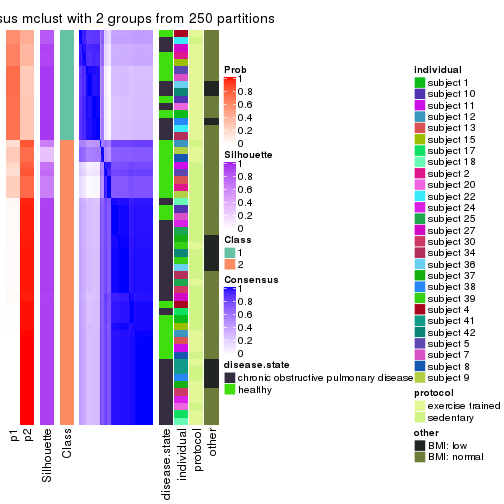</p>

</div>
<div id='tab-CV-mclust-consensus-heatmap-2'>
<pre><code class="r">consensus_heatmap(res, k = 3)
</code></pre>

<p>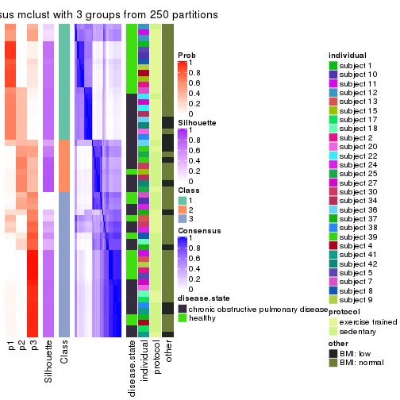</p>

</div>
<div id='tab-CV-mclust-consensus-heatmap-3'>
<pre><code class="r">consensus_heatmap(res, k = 4)
</code></pre>

<p>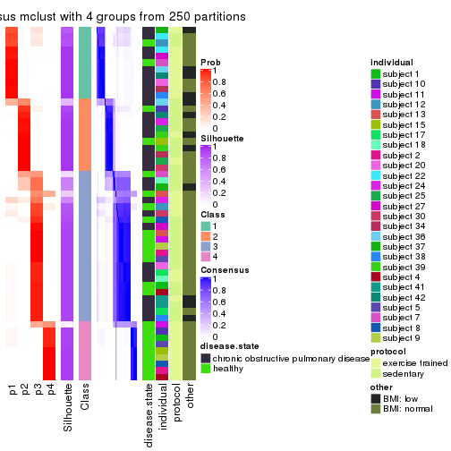</p>

</div>
<div id='tab-CV-mclust-consensus-heatmap-4'>
<pre><code class="r">consensus_heatmap(res, k = 5)
</code></pre>

<p>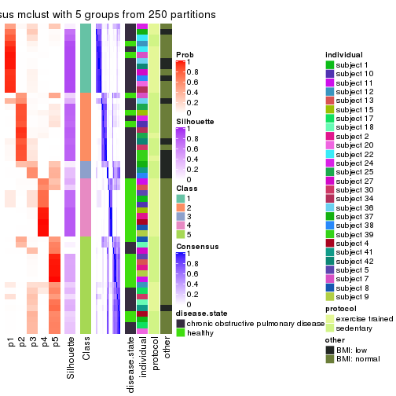</p>

</div>
<div id='tab-CV-mclust-consensus-heatmap-5'>
<pre><code class="r">consensus_heatmap(res, k = 6)
</code></pre>

<p>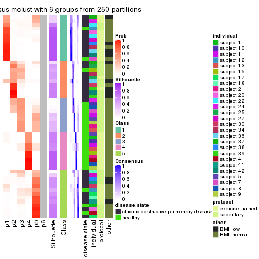</p>

</div>
</div>

Heatmaps for the membership of samples in all partitions to see how consistent they are:


<script>
$( function() {
	$( '#tabs-CV-mclust-membership-heatmap' ).tabs();
} );
</script>
<div id='tabs-CV-mclust-membership-heatmap'>
<ul>
<li><a href='#tab-CV-mclust-membership-heatmap-1'>k = 2</a></li>
<li><a href='#tab-CV-mclust-membership-heatmap-2'>k = 3</a></li>
<li><a href='#tab-CV-mclust-membership-heatmap-3'>k = 4</a></li>
<li><a href='#tab-CV-mclust-membership-heatmap-4'>k = 5</a></li>
<li><a href='#tab-CV-mclust-membership-heatmap-5'>k = 6</a></li>
</ul>
<div id='tab-CV-mclust-membership-heatmap-1'>
<pre><code class="r">membership_heatmap(res, k = 2)
</code></pre>

<p>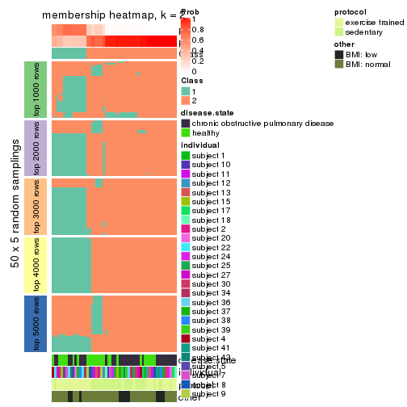</p>

</div>
<div id='tab-CV-mclust-membership-heatmap-2'>
<pre><code class="r">membership_heatmap(res, k = 3)
</code></pre>

<p>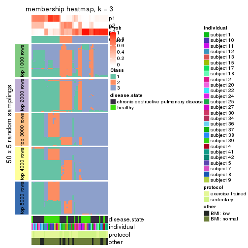</p>

</div>
<div id='tab-CV-mclust-membership-heatmap-3'>
<pre><code class="r">membership_heatmap(res, k = 4)
</code></pre>

<p>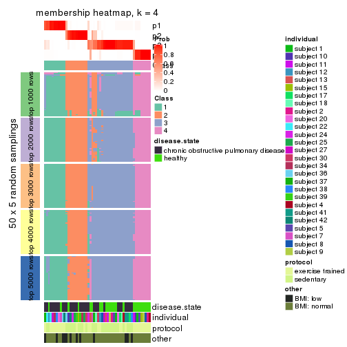</p>

</div>
<div id='tab-CV-mclust-membership-heatmap-4'>
<pre><code class="r">membership_heatmap(res, k = 5)
</code></pre>

<p>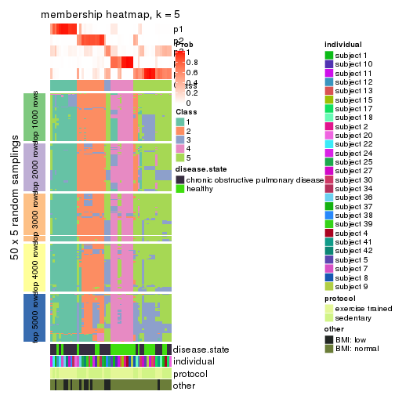</p>

</div>
<div id='tab-CV-mclust-membership-heatmap-5'>
<pre><code class="r">membership_heatmap(res, k = 6)
</code></pre>

<p>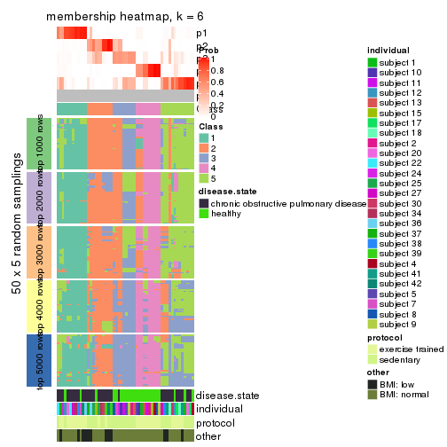</p>

</div>
</div>

As soon as we have had the classes for columns, we can look for signatures
which are significantly different between classes which can be candidate marks
for certain classes. Following are the heatmaps for signatures.


Signature heatmaps where rows are scaled:


<script>
$( function() {
	$( '#tabs-CV-mclust-get-signatures' ).tabs();
} );
</script>
<div id='tabs-CV-mclust-get-signatures'>
<ul>
<li><a href='#tab-CV-mclust-get-signatures-1'>k = 2</a></li>
<li><a href='#tab-CV-mclust-get-signatures-2'>k = 3</a></li>
<li><a href='#tab-CV-mclust-get-signatures-3'>k = 4</a></li>
<li><a href='#tab-CV-mclust-get-signatures-4'>k = 5</a></li>
<li><a href='#tab-CV-mclust-get-signatures-5'>k = 6</a></li>
</ul>
<div id='tab-CV-mclust-get-signatures-1'>
<pre><code class="r">get_signatures(res, k = 2)
</code></pre>

<p>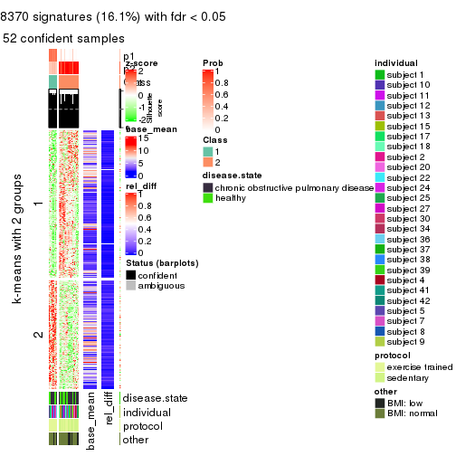</p>

</div>
<div id='tab-CV-mclust-get-signatures-2'>
<pre><code class="r">get_signatures(res, k = 3)
</code></pre>

<p>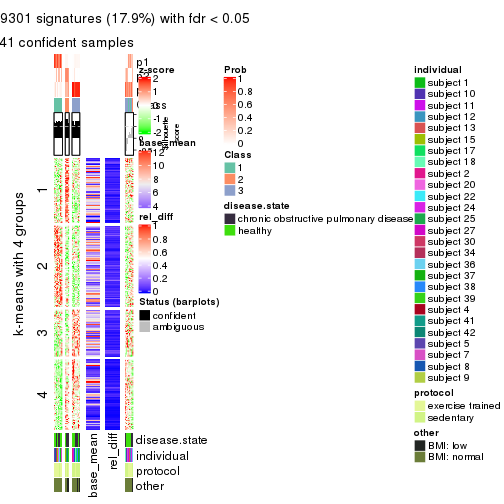</p>

</div>
<div id='tab-CV-mclust-get-signatures-3'>
<pre><code class="r">get_signatures(res, k = 4)
</code></pre>

<p>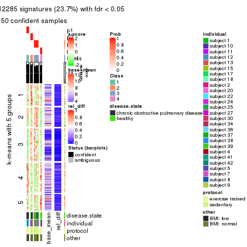</p>

</div>
<div id='tab-CV-mclust-get-signatures-4'>
<pre><code class="r">get_signatures(res, k = 5)
</code></pre>

<p>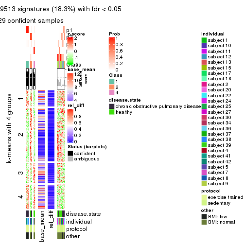</p>

</div>
<div id='tab-CV-mclust-get-signatures-5'>
<pre><code class="r">get_signatures(res, k = 6)
</code></pre>

<p>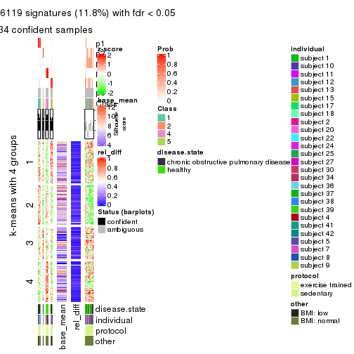</p>

</div>
</div>


Signature heatmaps where rows are not scaled:


<script>
$( function() {
	$( '#tabs-CV-mclust-get-signatures-no-scale' ).tabs();
} );
</script>
<div id='tabs-CV-mclust-get-signatures-no-scale'>
<ul>
<li><a href='#tab-CV-mclust-get-signatures-no-scale-1'>k = 2</a></li>
<li><a href='#tab-CV-mclust-get-signatures-no-scale-2'>k = 3</a></li>
<li><a href='#tab-CV-mclust-get-signatures-no-scale-3'>k = 4</a></li>
<li><a href='#tab-CV-mclust-get-signatures-no-scale-4'>k = 5</a></li>
<li><a href='#tab-CV-mclust-get-signatures-no-scale-5'>k = 6</a></li>
</ul>
<div id='tab-CV-mclust-get-signatures-no-scale-1'>
<pre><code class="r">get_signatures(res, k = 2, scale_rows = FALSE)
</code></pre>

<p>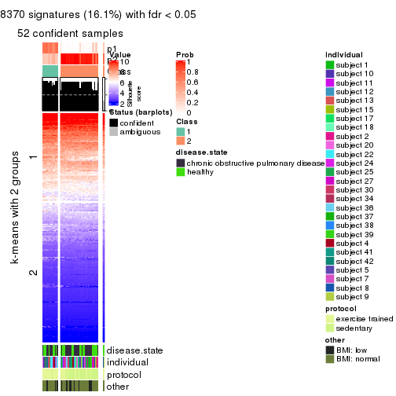</p>

</div>
<div id='tab-CV-mclust-get-signatures-no-scale-2'>
<pre><code class="r">get_signatures(res, k = 3, scale_rows = FALSE)
</code></pre>

<p>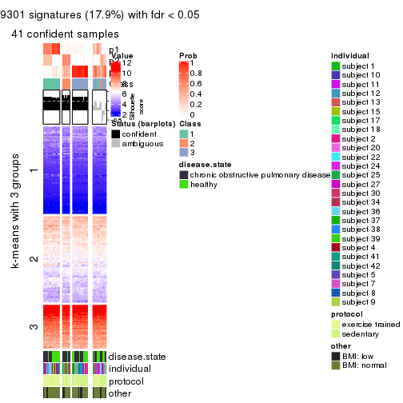</p>

</div>
<div id='tab-CV-mclust-get-signatures-no-scale-3'>
<pre><code class="r">get_signatures(res, k = 4, scale_rows = FALSE)
</code></pre>

<p>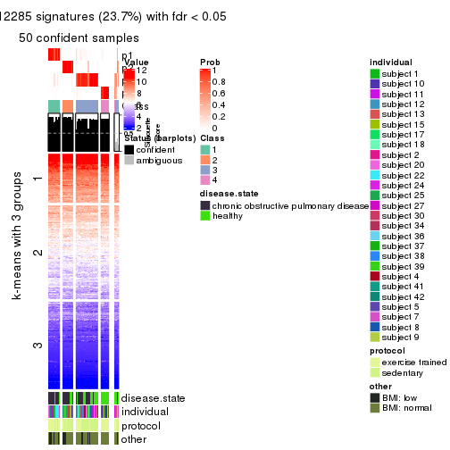</p>

</div>
<div id='tab-CV-mclust-get-signatures-no-scale-4'>
<pre><code class="r">get_signatures(res, k = 5, scale_rows = FALSE)
</code></pre>

<p>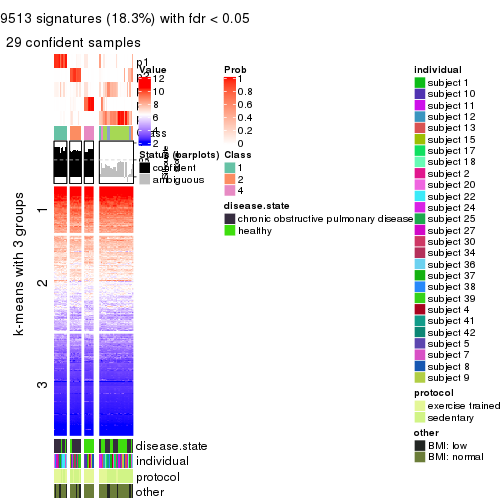</p>

</div>
<div id='tab-CV-mclust-get-signatures-no-scale-5'>
<pre><code class="r">get_signatures(res, k = 6, scale_rows = FALSE)
</code></pre>

<p>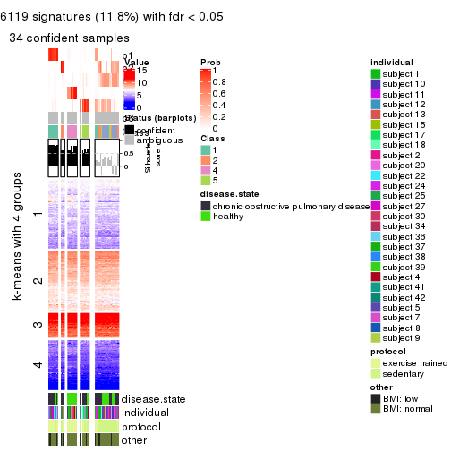</p>

</div>
</div>


Compare the overlap of signatures from different k:

```r
compare_signatures(res)
```

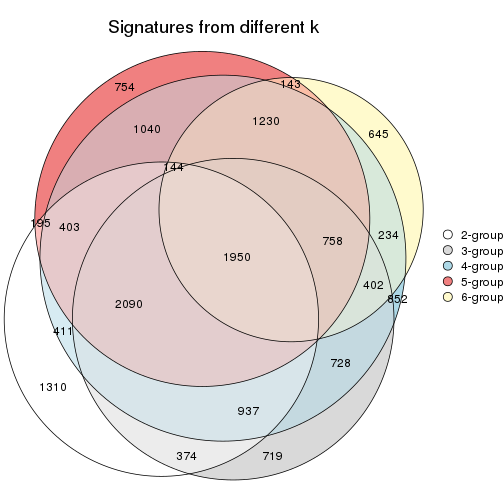

`get_signature()` returns a data frame invisibly. TO get the list of signatures, the function
call should be assigned to a variable explicitly. In following code, if `plot` argument is set
to `FALSE`, no heatmap is plotted while only the differential analysis is performed.

```r
# code only for demonstration
tb = get_signature(res, k = ..., plot = FALSE)
```

An example of the output of `tb` is:

```
#>   which_row         fdr    mean_1    mean_2 scaled_mean_1 scaled_mean_2 km
#> 1        38 0.042760348  8.373488  9.131774    -0.5533452     0.5164555  1
#> 2        40 0.018707592  7.106213  8.469186    -0.6173731     0.5762149  1
#> 3        55 0.019134737 10.221463 11.207825    -0.6159697     0.5749050  1
#> 4        59 0.006059896  5.921854  7.869574    -0.6899429     0.6439467  1
#> 5        60 0.018055526  8.928898 10.211722    -0.6204761     0.5791110  1
#> 6        98 0.009384629 15.714769 14.887706     0.6635654    -0.6193277  2
...
```

The columns in `tb` are:

1. `which_row`: row indices corresponding to the input matrix.
2. `fdr`: FDR for the differential test. 
3. `mean_x`: The mean value in group x.
4. `scaled_mean_x`: The mean value in group x after rows are scaled.
5. `km`: Row groups if k-means clustering is applied to rows.


UMAP plot which shows how samples are separated.


<script>
$( function() {
	$( '#tabs-CV-mclust-dimension-reduction' ).tabs();
} );
</script>
<div id='tabs-CV-mclust-dimension-reduction'>
<ul>
<li><a href='#tab-CV-mclust-dimension-reduction-1'>k = 2</a></li>
<li><a href='#tab-CV-mclust-dimension-reduction-2'>k = 3</a></li>
<li><a href='#tab-CV-mclust-dimension-reduction-3'>k = 4</a></li>
<li><a href='#tab-CV-mclust-dimension-reduction-4'>k = 5</a></li>
<li><a href='#tab-CV-mclust-dimension-reduction-5'>k = 6</a></li>
</ul>
<div id='tab-CV-mclust-dimension-reduction-1'>
<pre><code class="r">dimension_reduction(res, k = 2, method = &quot;UMAP&quot;)
</code></pre>

<p>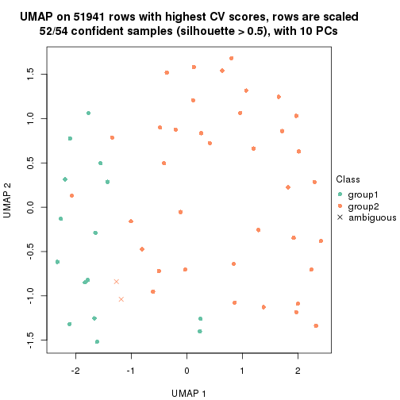</p>

</div>
<div id='tab-CV-mclust-dimension-reduction-2'>
<pre><code class="r">dimension_reduction(res, k = 3, method = &quot;UMAP&quot;)
</code></pre>

<p>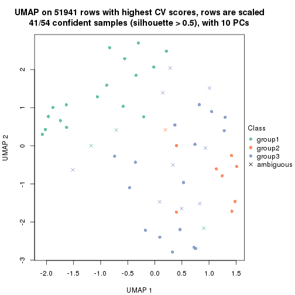</p>

</div>
<div id='tab-CV-mclust-dimension-reduction-3'>
<pre><code class="r">dimension_reduction(res, k = 4, method = &quot;UMAP&quot;)
</code></pre>

<p>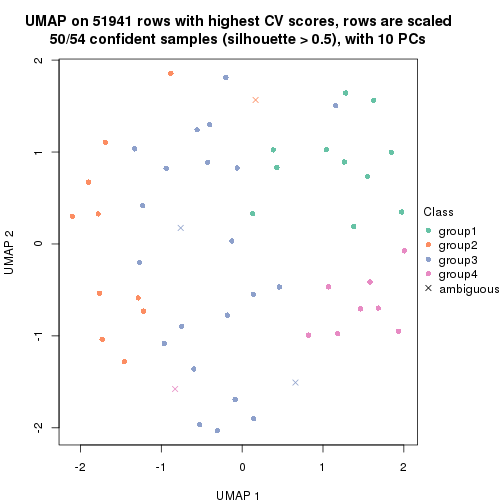</p>

</div>
<div id='tab-CV-mclust-dimension-reduction-4'>
<pre><code class="r">dimension_reduction(res, k = 5, method = &quot;UMAP&quot;)
</code></pre>

<p>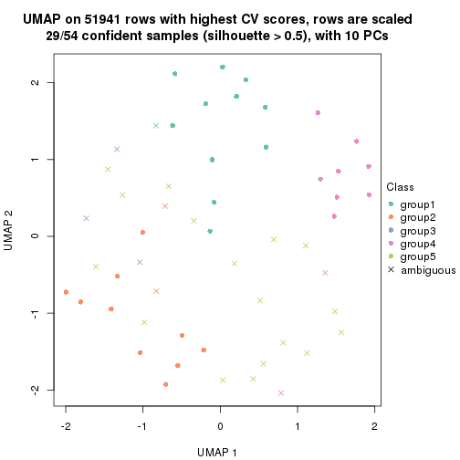</p>

</div>
<div id='tab-CV-mclust-dimension-reduction-5'>
<pre><code class="r">dimension_reduction(res, k = 6, method = &quot;UMAP&quot;)
</code></pre>

<p>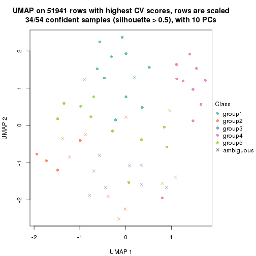</p>

</div>
</div>


Following heatmap shows how subgroups are split when increasing `k`:

```r
collect_classes(res)
```

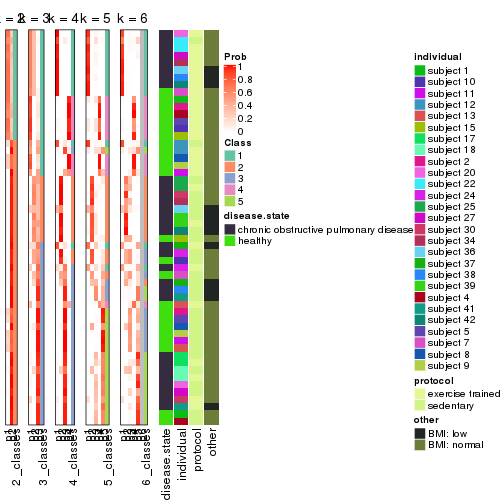


Test correlation between subgroups and known annotations. If the known
annotation is numeric, one-way ANOVA test is applied, and if the known
annotation is discrete, chi-squared contingency table test is applied.

```r
test_to_known_factors(res)
```

```
#>            n disease.state(p) individual(p) protocol(p) other(p) k
#> CV:mclust 52         0.924063         0.776    1.17e-04   1.0000 2
#> CV:mclust 41         0.134749         0.380    2.17e-05   0.4945 3
#> CV:mclust 50         0.001368         0.459    1.77e-04   0.2552 4
#> CV:mclust 29         0.000398         0.312    6.51e-04   0.1628 5
#> CV:mclust 34         0.000116         0.250    6.43e-03   0.0356 6
```


If matrix rows can be associated to genes, consider to use `functional_enrichment(res,
...)` to perform function enrichment for the signature genes. See [this vignette](http://bioconductor.org/packages/devel/bioc/vignettes/cola/inst/doc/functional_enrichment.html) for more detailed explanations.


 

---------------------------------------------------


### CV:NMF**


The object with results only for a single top-value method and a single partition method 
can be extracted as:

```r
res = res_list["CV", "NMF"]
# you can also extract it by
# res = res_list["CV:NMF"]
```

A summary of `res` and all the functions that can be applied to it:

```r
res
```

```
#> A 'ConsensusPartition' object with k = 2, 3, 4, 5, 6.
#>   On a matrix with 51941 rows and 54 columns.
#>   Top rows (1000, 2000, 3000, 4000, 5000) are extracted by 'CV' method.
#>   Subgroups are detected by 'NMF' method.
#>   Performed in total 1250 partitions by row resampling.
#>   Best k for subgroups seems to be 2.
#> 
#> Following methods can be applied to this 'ConsensusPartition' object:
#>  [1] "cola_report"             "collect_classes"         "collect_plots"          
#>  [4] "collect_stats"           "colnames"                "compare_signatures"     
#>  [7] "consensus_heatmap"       "dimension_reduction"     "functional_enrichment"  
#> [10] "get_anno_col"            "get_anno"                "get_classes"            
#> [13] "get_consensus"           "get_matrix"              "get_membership"         
#> [16] "get_param"               "get_signatures"          "get_stats"              
#> [19] "is_best_k"               "is_stable_k"             "membership_heatmap"     
#> [22] "ncol"                    "nrow"                    "plot_ecdf"              
#> [25] "rownames"                "select_partition_number" "show"                   
#> [28] "suggest_best_k"          "test_to_known_factors"
```

`collect_plots()` function collects all the plots made from `res` for all `k` (number of partitions)
into one single page to provide an easy and fast comparison between different `k`.

```r
collect_plots(res)
```

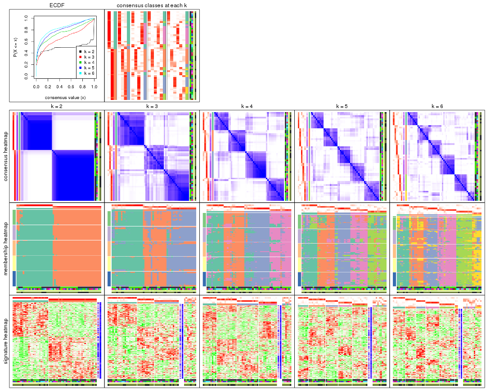

The plots are:

- The first row: a plot of the ECDF (empirical cumulative distribution
  function) curves of the consensus matrix for each `k` and the heatmap of
  predicted classes for each `k`.
- The second row: heatmaps of the consensus matrix for each `k`.
- The third row: heatmaps of the membership matrix for each `k`.
- The fouth row: heatmaps of the signatures for each `k`.

All the plots in panels can be made by individual functions and they are
plotted later in this section.

`select_partition_number()` produces several plots showing different
statistics for choosing "optimized" `k`. There are following statistics:

- ECDF curves of the consensus matrix for each `k`;
- 1-PAC. [The PAC
  score](https://en.wikipedia.org/wiki/Consensus_clustering#Over-interpretation_potential_of_consensus_clustering)
  measures the proportion of the ambiguous subgrouping.
- Mean silhouette score.
- Concordance. The mean probability of fiting the consensus class ids in all
  partitions.
- Area increased. Denote $A_k$ as the area under the ECDF curve for current
  `k`, the area increased is defined as $A_k - A_{k-1}$.
- Rand index. The percent of pairs of samples that are both in a same cluster
  or both are not in a same cluster in the partition of k and k-1.
- Jaccard index. The ratio of pairs of samples are both in a same cluster in
  the partition of k and k-1 and the pairs of samples are both in a same
  cluster in the partition k or k-1.

The detailed explanations of these statistics can be found in [the _cola_
vignette](http://bioconductor.org/packages/devel/bioc/vignettes/cola/inst/doc/cola.html#toc_13).

Generally speaking, lower PAC score, higher mean silhouette score or higher
concordance corresponds to better partition. Rand index and Jaccard index
measure how similar the current partition is compared to partition with `k-1`.
If they are too similar, we won't accept `k` is better than `k-1`.

```r
select_partition_number(res)
```

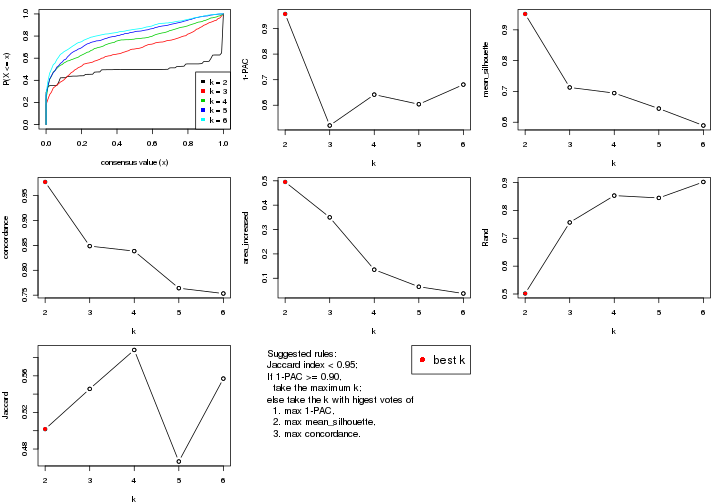

The numeric values for all these statistics can be obtained by `get_stats()`.

```r
get_stats(res)
```

```
#>   k 1-PAC mean_silhouette concordance area_increased  Rand Jaccard
#> 2 2 0.957           0.952       0.977         0.4952 0.502   0.502
#> 3 3 0.521           0.713       0.849         0.3499 0.757   0.546
#> 4 4 0.642           0.695       0.839         0.1354 0.853   0.588
#> 5 5 0.604           0.644       0.764         0.0652 0.845   0.466
#> 6 6 0.681           0.589       0.753         0.0374 0.902   0.557
```

`suggest_best_k()` suggests the best $k$ based on these statistics. The rules are as follows:

- All $k$ with Jaccard index larger than 0.95 are removed because increasing
  $k$ does not provide enough extra information. If all $k$ are removed, it is
  marked as no subgroup is detected.
- For all $k$ with 1-PAC score larger than 0.9, the maximal $k$ is taken as
  the best $k$, and other $k$ are marked as optional $k$.
- If it does not fit the second rule. The $k$ with the maximal vote of the
  highest 1-PAC score, highest mean silhouette, and highest concordance is
  taken as the best $k$.

```r
suggest_best_k(res)
```

```
#> [1] 2
```


Following shows the table of the partitions (You need to click the **show/hide
code output** link to see it). The membership matrix (columns with name `p*`)
is inferred by
[`clue::cl_consensus()`](https://www.rdocumentation.org/link/cl_consensus?package=clue)
function with the `SE` method. Basically the value in the membership matrix
represents the probability to belong to a certain group. The finall class
label for an item is determined with the group with highest probability it
belongs to.

In `get_classes()` function, the entropy is calculated from the membership
matrix and the silhouette score is calculated from the consensus matrix.


<script>
$( function() {
	$( '#tabs-CV-NMF-get-classes' ).tabs();
} );
</script>
<div id='tabs-CV-NMF-get-classes'>
<ul>
<li><a href='#tab-CV-NMF-get-classes-1'>k = 2</a></li>
<li><a href='#tab-CV-NMF-get-classes-2'>k = 3</a></li>
<li><a href='#tab-CV-NMF-get-classes-3'>k = 4</a></li>
<li><a href='#tab-CV-NMF-get-classes-4'>k = 5</a></li>
<li><a href='#tab-CV-NMF-get-classes-5'>k = 6</a></li>
</ul>

<div id='tab-CV-NMF-get-classes-1'>
<p><a id='tab-CV-NMF-get-classes-1-a' style='color:#0366d6' href='#'>show/hide code output</a></p>
<pre><code class="r">cbind(get_classes(res, k = 2), get_membership(res, k = 2))
</code></pre>

<pre><code>#&gt;           class entropy silhouette    p1    p2
#&gt; GSM680053     2  0.0000      0.986 0.000 1.000
#&gt; GSM680062     1  0.8955      0.578 0.688 0.312
#&gt; GSM680054     2  0.0000      0.986 0.000 1.000
#&gt; GSM680063     2  0.5059      0.868 0.112 0.888
#&gt; GSM680055     2  0.0000      0.986 0.000 1.000
#&gt; GSM680064     1  0.0000      0.963 1.000 0.000
#&gt; GSM680056     1  0.3879      0.907 0.924 0.076
#&gt; GSM680065     1  0.0000      0.963 1.000 0.000
#&gt; GSM680057     2  0.0000      0.986 0.000 1.000
#&gt; GSM680066     2  0.0938      0.976 0.012 0.988
#&gt; GSM680058     2  0.0000      0.986 0.000 1.000
#&gt; GSM680067     2  0.7528      0.724 0.216 0.784
#&gt; GSM680059     2  0.0000      0.986 0.000 1.000
#&gt; GSM680068     1  0.0000      0.963 1.000 0.000
#&gt; GSM680060     2  0.0000      0.986 0.000 1.000
#&gt; GSM680069     2  0.3584      0.921 0.068 0.932
#&gt; GSM680061     2  0.0000      0.986 0.000 1.000
#&gt; GSM680070     1  0.0000      0.963 1.000 0.000
#&gt; GSM680071     1  0.3879      0.908 0.924 0.076
#&gt; GSM680077     1  0.0000      0.963 1.000 0.000
#&gt; GSM680072     2  0.0000      0.986 0.000 1.000
#&gt; GSM680078     2  0.0376      0.982 0.004 0.996
#&gt; GSM680073     2  0.0000      0.986 0.000 1.000
#&gt; GSM680079     1  0.0000      0.963 1.000 0.000
#&gt; GSM680074     2  0.0000      0.986 0.000 1.000
#&gt; GSM680080     2  0.0000      0.986 0.000 1.000
#&gt; GSM680075     2  0.0000      0.986 0.000 1.000
#&gt; GSM680081     2  0.0000      0.986 0.000 1.000
#&gt; GSM680076     2  0.0000      0.986 0.000 1.000
#&gt; GSM680082     1  0.0000      0.963 1.000 0.000
#&gt; GSM680029     2  0.0000      0.986 0.000 1.000
#&gt; GSM680041     1  0.0000      0.963 1.000 0.000
#&gt; GSM680035     2  0.0000      0.986 0.000 1.000
#&gt; GSM680047     1  0.0000      0.963 1.000 0.000
#&gt; GSM680036     2  0.0000      0.986 0.000 1.000
#&gt; GSM680048     1  0.0000      0.963 1.000 0.000
#&gt; GSM680037     2  0.0000      0.986 0.000 1.000
#&gt; GSM680049     1  0.0000      0.963 1.000 0.000
#&gt; GSM680038     2  0.0000      0.986 0.000 1.000
#&gt; GSM680050     1  0.0000      0.963 1.000 0.000
#&gt; GSM680039     2  0.0000      0.986 0.000 1.000
#&gt; GSM680051     1  0.0000      0.963 1.000 0.000
#&gt; GSM680040     2  0.0000      0.986 0.000 1.000
#&gt; GSM680052     1  0.0000      0.963 1.000 0.000
#&gt; GSM680030     2  0.0000      0.986 0.000 1.000
#&gt; GSM680042     1  0.0000      0.963 1.000 0.000
#&gt; GSM680031     2  0.0000      0.986 0.000 1.000
#&gt; GSM680043     1  0.0376      0.961 0.996 0.004
#&gt; GSM680032     1  0.3431      0.916 0.936 0.064
#&gt; GSM680044     1  0.0672      0.958 0.992 0.008
#&gt; GSM680033     2  0.0000      0.986 0.000 1.000
#&gt; GSM680045     1  0.8386      0.658 0.732 0.268
#&gt; GSM680034     2  0.0000      0.986 0.000 1.000
#&gt; GSM680046     1  0.0000      0.963 1.000 0.000
</code></pre>

<script>
$('#tab-CV-NMF-get-classes-1-a').parent().next().next().hide();
$('#tab-CV-NMF-get-classes-1-a').click(function(){
  $('#tab-CV-NMF-get-classes-1-a').parent().next().next().toggle();
  return(false);
});
</script>
</div>

<div id='tab-CV-NMF-get-classes-2'>
<p><a id='tab-CV-NMF-get-classes-2-a' style='color:#0366d6' href='#'>show/hide code output</a></p>
<pre><code class="r">cbind(get_classes(res, k = 3), get_membership(res, k = 3))
</code></pre>

<pre><code>#&gt;           class entropy silhouette    p1    p2    p3
#&gt; GSM680053     3  0.2878      0.756 0.000 0.096 0.904
#&gt; GSM680062     3  0.4047      0.733 0.148 0.004 0.848
#&gt; GSM680054     3  0.6204      0.356 0.000 0.424 0.576
#&gt; GSM680063     3  0.3583      0.803 0.044 0.056 0.900
#&gt; GSM680055     3  0.2448      0.753 0.000 0.076 0.924
#&gt; GSM680064     1  0.0892      0.880 0.980 0.000 0.020
#&gt; GSM680056     3  0.9375      0.190 0.308 0.196 0.496
#&gt; GSM680065     1  0.4662      0.829 0.844 0.032 0.124
#&gt; GSM680057     2  0.3551      0.716 0.000 0.868 0.132
#&gt; GSM680066     2  0.7555      0.150 0.040 0.520 0.440
#&gt; GSM680058     2  0.1753      0.746 0.000 0.952 0.048
#&gt; GSM680067     2  0.4921      0.680 0.164 0.816 0.020
#&gt; GSM680059     3  0.3551      0.803 0.000 0.132 0.868
#&gt; GSM680068     1  0.1289      0.876 0.968 0.000 0.032
#&gt; GSM680060     2  0.2537      0.731 0.000 0.920 0.080
#&gt; GSM680069     3  0.7457      0.478 0.104 0.208 0.688
#&gt; GSM680061     2  0.2590      0.745 0.004 0.924 0.072
#&gt; GSM680070     1  0.2860      0.862 0.912 0.004 0.084
#&gt; GSM680071     2  0.8790      0.179 0.328 0.540 0.132
#&gt; GSM680077     1  0.7680      0.670 0.680 0.188 0.132
#&gt; GSM680072     2  0.6225      0.036 0.000 0.568 0.432
#&gt; GSM680078     3  0.1031      0.779 0.000 0.024 0.976
#&gt; GSM680073     3  0.4291      0.771 0.000 0.180 0.820
#&gt; GSM680079     1  0.3771      0.846 0.876 0.012 0.112
#&gt; GSM680074     2  0.1289      0.756 0.000 0.968 0.032
#&gt; GSM680080     2  0.1643      0.754 0.000 0.956 0.044
#&gt; GSM680075     3  0.2448      0.770 0.000 0.076 0.924
#&gt; GSM680081     3  0.3619      0.805 0.000 0.136 0.864
#&gt; GSM680076     2  0.3551      0.692 0.000 0.868 0.132
#&gt; GSM680082     1  0.6460      0.762 0.764 0.124 0.112
#&gt; GSM680029     3  0.3267      0.807 0.000 0.116 0.884
#&gt; GSM680041     1  0.0000      0.880 1.000 0.000 0.000
#&gt; GSM680035     3  0.3619      0.805 0.000 0.136 0.864
#&gt; GSM680047     1  0.0000      0.880 1.000 0.000 0.000
#&gt; GSM680036     3  0.2878      0.799 0.000 0.096 0.904
#&gt; GSM680048     1  0.0000      0.880 1.000 0.000 0.000
#&gt; GSM680037     3  0.3619      0.805 0.000 0.136 0.864
#&gt; GSM680049     1  0.0000      0.880 1.000 0.000 0.000
#&gt; GSM680038     2  0.4399      0.667 0.000 0.812 0.188
#&gt; GSM680050     1  0.3030      0.859 0.904 0.004 0.092
#&gt; GSM680039     2  0.5678      0.491 0.000 0.684 0.316
#&gt; GSM680051     1  0.1774      0.869 0.960 0.024 0.016
#&gt; GSM680040     3  0.3619      0.805 0.000 0.136 0.864
#&gt; GSM680052     1  0.1482      0.872 0.968 0.020 0.012
#&gt; GSM680030     2  0.1031      0.755 0.000 0.976 0.024
#&gt; GSM680042     1  0.0237      0.880 0.996 0.000 0.004
#&gt; GSM680031     3  0.3784      0.803 0.004 0.132 0.864
#&gt; GSM680043     1  0.6897      0.615 0.712 0.068 0.220
#&gt; GSM680032     1  0.6783      0.748 0.744 0.116 0.140
#&gt; GSM680044     1  0.0747      0.879 0.984 0.000 0.016
#&gt; GSM680033     3  0.3752      0.799 0.000 0.144 0.856
#&gt; GSM680045     1  0.8117      0.282 0.552 0.076 0.372
#&gt; GSM680034     2  0.4963      0.658 0.008 0.792 0.200
#&gt; GSM680046     1  0.0747      0.877 0.984 0.016 0.000
</code></pre>

<script>
$('#tab-CV-NMF-get-classes-2-a').parent().next().next().hide();
$('#tab-CV-NMF-get-classes-2-a').click(function(){
  $('#tab-CV-NMF-get-classes-2-a').parent().next().next().toggle();
  return(false);
});
</script>
</div>

<div id='tab-CV-NMF-get-classes-3'>
<p><a id='tab-CV-NMF-get-classes-3-a' style='color:#0366d6' href='#'>show/hide code output</a></p>
<pre><code class="r">cbind(get_classes(res, k = 4), get_membership(res, k = 4))
</code></pre>

<pre><code>#&gt;           class entropy silhouette    p1    p2    p3    p4
#&gt; GSM680053     3  0.4331     0.6436 0.288 0.000 0.712 0.000
#&gt; GSM680062     3  0.2335     0.8016 0.020 0.000 0.920 0.060
#&gt; GSM680054     3  0.7846     0.1885 0.300 0.296 0.404 0.000
#&gt; GSM680063     3  0.1722     0.8173 0.048 0.000 0.944 0.008
#&gt; GSM680055     1  0.4643     0.2789 0.656 0.000 0.344 0.000
#&gt; GSM680064     4  0.4933     0.2197 0.432 0.000 0.000 0.568
#&gt; GSM680056     1  0.1847     0.7729 0.940 0.004 0.052 0.004
#&gt; GSM680065     1  0.1824     0.7809 0.936 0.000 0.004 0.060
#&gt; GSM680057     2  0.2329     0.8294 0.000 0.916 0.012 0.072
#&gt; GSM680066     4  0.8792     0.1371 0.048 0.236 0.324 0.392
#&gt; GSM680058     2  0.1389     0.8333 0.048 0.952 0.000 0.000
#&gt; GSM680067     2  0.3219     0.7772 0.000 0.836 0.000 0.164
#&gt; GSM680059     3  0.0927     0.8276 0.008 0.016 0.976 0.000
#&gt; GSM680068     4  0.4035     0.7258 0.176 0.000 0.020 0.804
#&gt; GSM680060     2  0.0921     0.8380 0.028 0.972 0.000 0.000
#&gt; GSM680069     1  0.2466     0.7525 0.916 0.028 0.056 0.000
#&gt; GSM680061     2  0.2589     0.8109 0.000 0.884 0.000 0.116
#&gt; GSM680070     1  0.5126     0.0893 0.552 0.004 0.000 0.444
#&gt; GSM680071     1  0.4235     0.6485 0.792 0.188 0.004 0.016
#&gt; GSM680077     1  0.1767     0.7778 0.944 0.044 0.000 0.012
#&gt; GSM680072     2  0.6273     0.5318 0.248 0.644 0.108 0.000
#&gt; GSM680078     3  0.4776     0.4934 0.376 0.000 0.624 0.000
#&gt; GSM680073     3  0.5532     0.6645 0.228 0.068 0.704 0.000
#&gt; GSM680079     1  0.3668     0.6837 0.808 0.000 0.004 0.188
#&gt; GSM680074     2  0.0921     0.8380 0.028 0.972 0.000 0.000
#&gt; GSM680080     2  0.1109     0.8380 0.028 0.968 0.004 0.000
#&gt; GSM680075     3  0.5055     0.5274 0.368 0.008 0.624 0.000
#&gt; GSM680081     3  0.0967     0.8292 0.004 0.004 0.976 0.016
#&gt; GSM680076     2  0.3873     0.6745 0.228 0.772 0.000 0.000
#&gt; GSM680082     1  0.2546     0.7655 0.900 0.008 0.000 0.092
#&gt; GSM680029     3  0.0376     0.8284 0.004 0.004 0.992 0.000
#&gt; GSM680041     4  0.3311     0.7303 0.172 0.000 0.000 0.828
#&gt; GSM680035     3  0.0779     0.8295 0.000 0.004 0.980 0.016
#&gt; GSM680047     4  0.2125     0.7804 0.076 0.000 0.004 0.920
#&gt; GSM680036     3  0.3975     0.6966 0.240 0.000 0.760 0.000
#&gt; GSM680048     4  0.0895     0.7818 0.020 0.004 0.000 0.976
#&gt; GSM680037     3  0.0779     0.8295 0.000 0.004 0.980 0.016
#&gt; GSM680049     4  0.2814     0.7600 0.132 0.000 0.000 0.868
#&gt; GSM680038     2  0.3938     0.7879 0.080 0.852 0.060 0.008
#&gt; GSM680050     1  0.3873     0.6278 0.772 0.000 0.000 0.228
#&gt; GSM680039     2  0.6871     0.5608 0.000 0.592 0.240 0.168
#&gt; GSM680051     4  0.1471     0.7714 0.004 0.024 0.012 0.960
#&gt; GSM680040     3  0.0779     0.8295 0.000 0.004 0.980 0.016
#&gt; GSM680052     4  0.1520     0.7692 0.000 0.020 0.024 0.956
#&gt; GSM680030     2  0.1139     0.8396 0.008 0.972 0.008 0.012
#&gt; GSM680042     4  0.3444     0.7193 0.184 0.000 0.000 0.816
#&gt; GSM680031     3  0.1209     0.8226 0.000 0.004 0.964 0.032
#&gt; GSM680043     4  0.3901     0.6802 0.004 0.012 0.168 0.816
#&gt; GSM680032     1  0.1576     0.7848 0.948 0.000 0.004 0.048
#&gt; GSM680044     4  0.2928     0.7734 0.108 0.000 0.012 0.880
#&gt; GSM680033     3  0.0927     0.8285 0.000 0.008 0.976 0.016
#&gt; GSM680045     4  0.4741     0.6156 0.000 0.028 0.228 0.744
#&gt; GSM680034     2  0.4485     0.6868 0.000 0.740 0.012 0.248
#&gt; GSM680046     4  0.0000     0.7801 0.000 0.000 0.000 1.000
</code></pre>

<script>
$('#tab-CV-NMF-get-classes-3-a').parent().next().next().hide();
$('#tab-CV-NMF-get-classes-3-a').click(function(){
  $('#tab-CV-NMF-get-classes-3-a').parent().next().next().toggle();
  return(false);
});
</script>
</div>

<div id='tab-CV-NMF-get-classes-4'>
<p><a id='tab-CV-NMF-get-classes-4-a' style='color:#0366d6' href='#'>show/hide code output</a></p>
<pre><code class="r">cbind(get_classes(res, k = 5), get_membership(res, k = 5))
</code></pre>

<pre><code>#&gt;           class entropy silhouette    p1    p2    p3    p4    p5
#&gt; GSM680053     5  0.3132     0.6811 0.000 0.000 0.172 0.008 0.820
#&gt; GSM680062     5  0.6358     0.2742 0.000 0.000 0.180 0.328 0.492
#&gt; GSM680054     5  0.3122     0.7238 0.000 0.120 0.024 0.004 0.852
#&gt; GSM680063     5  0.5565     0.5336 0.000 0.000 0.216 0.144 0.640
#&gt; GSM680055     5  0.3086     0.7277 0.040 0.000 0.092 0.004 0.864
#&gt; GSM680064     1  0.5131     0.1936 0.588 0.000 0.000 0.364 0.048
#&gt; GSM680056     5  0.2006     0.7291 0.072 0.000 0.000 0.012 0.916
#&gt; GSM680065     5  0.4193     0.5620 0.256 0.000 0.000 0.024 0.720
#&gt; GSM680057     2  0.2536     0.7889 0.000 0.868 0.004 0.128 0.000
#&gt; GSM680066     1  0.5751     0.4200 0.568 0.008 0.356 0.064 0.004
#&gt; GSM680058     2  0.3961     0.5600 0.016 0.736 0.000 0.000 0.248
#&gt; GSM680067     2  0.2773     0.7721 0.000 0.836 0.000 0.164 0.000
#&gt; GSM680059     3  0.0566     0.7922 0.004 0.000 0.984 0.000 0.012
#&gt; GSM680068     1  0.4859     0.6420 0.732 0.000 0.112 0.152 0.004
#&gt; GSM680060     2  0.1608     0.7825 0.000 0.928 0.000 0.000 0.072
#&gt; GSM680069     5  0.2462     0.7229 0.112 0.000 0.008 0.000 0.880
#&gt; GSM680061     2  0.1851     0.7976 0.000 0.912 0.000 0.088 0.000
#&gt; GSM680070     1  0.2758     0.7331 0.888 0.000 0.024 0.076 0.012
#&gt; GSM680071     5  0.5077     0.6743 0.156 0.108 0.000 0.012 0.724
#&gt; GSM680077     1  0.1731     0.7391 0.932 0.004 0.004 0.000 0.060
#&gt; GSM680072     5  0.5166     0.3987 0.044 0.348 0.004 0.000 0.604
#&gt; GSM680078     1  0.5109     0.2456 0.504 0.000 0.460 0.000 0.036
#&gt; GSM680073     3  0.6750     0.0251 0.068 0.068 0.476 0.000 0.388
#&gt; GSM680079     1  0.2444     0.7465 0.912 0.000 0.028 0.036 0.024
#&gt; GSM680074     2  0.1741     0.7874 0.040 0.936 0.000 0.000 0.024
#&gt; GSM680080     2  0.2304     0.7816 0.048 0.908 0.000 0.000 0.044
#&gt; GSM680075     3  0.4675     0.4887 0.044 0.004 0.704 0.000 0.248
#&gt; GSM680081     3  0.1808     0.8079 0.012 0.000 0.936 0.044 0.008
#&gt; GSM680076     2  0.5039     0.6388 0.184 0.700 0.000 0.000 0.116
#&gt; GSM680082     1  0.1983     0.7312 0.924 0.008 0.000 0.008 0.060
#&gt; GSM680029     3  0.0609     0.7996 0.000 0.000 0.980 0.000 0.020
#&gt; GSM680041     4  0.4637     0.6535 0.100 0.000 0.000 0.740 0.160
#&gt; GSM680035     3  0.3595     0.8041 0.000 0.000 0.816 0.140 0.044
#&gt; GSM680047     4  0.3612     0.6723 0.028 0.000 0.000 0.800 0.172
#&gt; GSM680036     5  0.2891     0.6811 0.000 0.000 0.176 0.000 0.824
#&gt; GSM680048     4  0.3209     0.7215 0.068 0.008 0.000 0.864 0.060
#&gt; GSM680037     3  0.2813     0.8219 0.000 0.000 0.876 0.084 0.040
#&gt; GSM680049     4  0.4687     0.5706 0.288 0.000 0.000 0.672 0.040
#&gt; GSM680038     5  0.4517     0.6373 0.008 0.208 0.004 0.036 0.744
#&gt; GSM680050     1  0.2153     0.7397 0.916 0.000 0.000 0.044 0.040
#&gt; GSM680039     2  0.5190     0.6457 0.000 0.680 0.088 0.228 0.004
#&gt; GSM680051     4  0.2217     0.7017 0.000 0.044 0.012 0.920 0.024
#&gt; GSM680040     3  0.3115     0.8181 0.000 0.000 0.852 0.112 0.036
#&gt; GSM680052     4  0.1569     0.7027 0.004 0.044 0.008 0.944 0.000
#&gt; GSM680030     2  0.4108     0.7568 0.044 0.808 0.004 0.016 0.128
#&gt; GSM680042     4  0.4617     0.6249 0.224 0.000 0.000 0.716 0.060
#&gt; GSM680031     3  0.2964     0.7797 0.000 0.004 0.840 0.152 0.004
#&gt; GSM680043     4  0.5679     0.2775 0.028 0.032 0.352 0.584 0.004
#&gt; GSM680032     1  0.3289     0.6633 0.816 0.004 0.000 0.008 0.172
#&gt; GSM680044     4  0.5732     0.6158 0.236 0.000 0.052 0.660 0.052
#&gt; GSM680033     3  0.3432     0.8081 0.000 0.000 0.828 0.132 0.040
#&gt; GSM680045     4  0.5169     0.4245 0.004 0.052 0.284 0.656 0.004
#&gt; GSM680034     2  0.4065     0.6779 0.000 0.720 0.016 0.264 0.000
#&gt; GSM680046     4  0.2904     0.7006 0.112 0.008 0.008 0.868 0.004
</code></pre>

<script>
$('#tab-CV-NMF-get-classes-4-a').parent().next().next().hide();
$('#tab-CV-NMF-get-classes-4-a').click(function(){
  $('#tab-CV-NMF-get-classes-4-a').parent().next().next().toggle();
  return(false);
});
</script>
</div>

<div id='tab-CV-NMF-get-classes-5'>
<p><a id='tab-CV-NMF-get-classes-5-a' style='color:#0366d6' href='#'>show/hide code output</a></p>
<pre><code class="r">cbind(get_classes(res, k = 6), get_membership(res, k = 6))
</code></pre>

<pre><code>#&gt;           class entropy silhouette    p1    p2    p3    p4    p5    p6
#&gt; GSM680053     5  0.3548     0.7619 0.004 0.000 0.048 0.000 0.796 0.152
#&gt; GSM680062     4  0.6359     0.2873 0.004 0.000 0.072 0.528 0.296 0.100
#&gt; GSM680054     5  0.3371     0.7886 0.004 0.040 0.044 0.000 0.848 0.064
#&gt; GSM680063     5  0.5138     0.6506 0.000 0.000 0.068 0.052 0.680 0.200
#&gt; GSM680055     5  0.3590     0.7835 0.024 0.000 0.032 0.000 0.808 0.136
#&gt; GSM680064     4  0.2809     0.6727 0.168 0.000 0.000 0.824 0.004 0.004
#&gt; GSM680056     5  0.2658     0.7878 0.080 0.000 0.000 0.008 0.876 0.036
#&gt; GSM680065     5  0.4023     0.6468 0.240 0.000 0.000 0.004 0.720 0.036
#&gt; GSM680057     3  0.4850     0.1574 0.004 0.456 0.508 0.012 0.012 0.008
#&gt; GSM680066     1  0.6121     0.5150 0.596 0.032 0.252 0.040 0.000 0.080
#&gt; GSM680058     2  0.4636     0.5080 0.000 0.692 0.000 0.000 0.160 0.148
#&gt; GSM680067     2  0.3013     0.5531 0.004 0.848 0.116 0.024 0.000 0.008
#&gt; GSM680059     6  0.4034     0.4801 0.000 0.020 0.328 0.000 0.000 0.652
#&gt; GSM680068     1  0.5455     0.6534 0.660 0.000 0.100 0.184 0.000 0.056
#&gt; GSM680060     2  0.2948     0.6009 0.012 0.860 0.000 0.000 0.084 0.044
#&gt; GSM680069     5  0.1957     0.7938 0.112 0.000 0.000 0.000 0.888 0.000
#&gt; GSM680061     2  0.2485     0.5789 0.004 0.884 0.088 0.020 0.000 0.004
#&gt; GSM680070     1  0.1707     0.7908 0.928 0.000 0.004 0.056 0.000 0.012
#&gt; GSM680071     5  0.4044     0.7267 0.200 0.028 0.000 0.004 0.752 0.016
#&gt; GSM680077     1  0.2001     0.7705 0.924 0.012 0.000 0.004 0.032 0.028
#&gt; GSM680072     6  0.5939    -0.1367 0.000 0.372 0.000 0.000 0.216 0.412
#&gt; GSM680078     6  0.4667     0.5273 0.132 0.000 0.108 0.000 0.028 0.732
#&gt; GSM680073     6  0.4668     0.4663 0.004 0.120 0.040 0.000 0.088 0.748
#&gt; GSM680079     1  0.2944     0.7770 0.856 0.000 0.000 0.068 0.004 0.072
#&gt; GSM680074     2  0.3073     0.5851 0.000 0.788 0.000 0.000 0.008 0.204
#&gt; GSM680080     2  0.3533     0.5610 0.004 0.748 0.000 0.000 0.012 0.236
#&gt; GSM680075     6  0.4494     0.6092 0.016 0.016 0.156 0.000 0.060 0.752
#&gt; GSM680081     3  0.2222     0.6931 0.040 0.000 0.908 0.000 0.012 0.040
#&gt; GSM680076     2  0.4762     0.5208 0.060 0.668 0.000 0.000 0.016 0.256
#&gt; GSM680082     1  0.3508     0.7368 0.828 0.008 0.000 0.020 0.032 0.112
#&gt; GSM680029     6  0.4096     0.1900 0.000 0.000 0.484 0.000 0.008 0.508
#&gt; GSM680041     4  0.1003     0.7899 0.016 0.000 0.000 0.964 0.020 0.000
#&gt; GSM680035     3  0.1562     0.7116 0.000 0.000 0.940 0.004 0.024 0.032
#&gt; GSM680047     4  0.1251     0.7893 0.000 0.000 0.012 0.956 0.024 0.008
#&gt; GSM680036     5  0.3293     0.7717 0.008 0.000 0.040 0.000 0.824 0.128
#&gt; GSM680048     4  0.0622     0.7910 0.012 0.000 0.000 0.980 0.008 0.000
#&gt; GSM680037     3  0.2070     0.6578 0.000 0.000 0.892 0.000 0.008 0.100
#&gt; GSM680049     4  0.1387     0.7763 0.068 0.000 0.000 0.932 0.000 0.000
#&gt; GSM680038     5  0.3181     0.7721 0.012 0.052 0.024 0.004 0.868 0.040
#&gt; GSM680050     1  0.2602     0.7803 0.884 0.000 0.000 0.072 0.024 0.020
#&gt; GSM680039     3  0.4917     0.4187 0.000 0.328 0.616 0.028 0.008 0.020
#&gt; GSM680051     4  0.6209    -0.0907 0.000 0.092 0.432 0.432 0.020 0.024
#&gt; GSM680040     3  0.1700     0.6874 0.000 0.000 0.916 0.000 0.004 0.080
#&gt; GSM680052     4  0.2806     0.7548 0.000 0.056 0.060 0.872 0.000 0.012
#&gt; GSM680030     2  0.8050     0.2612 0.040 0.380 0.180 0.000 0.236 0.164
#&gt; GSM680042     4  0.0935     0.7869 0.032 0.000 0.000 0.964 0.004 0.000
#&gt; GSM680031     3  0.2202     0.6961 0.000 0.012 0.904 0.008 0.004 0.072
#&gt; GSM680043     3  0.6212     0.3503 0.020 0.100 0.556 0.288 0.000 0.036
#&gt; GSM680032     1  0.5373     0.6224 0.680 0.016 0.000 0.024 0.112 0.168
#&gt; GSM680044     4  0.3626     0.7251 0.060 0.004 0.004 0.820 0.008 0.104
#&gt; GSM680033     3  0.1338     0.7144 0.000 0.004 0.952 0.004 0.008 0.032
#&gt; GSM680045     4  0.5359     0.4871 0.012 0.076 0.268 0.628 0.000 0.016
#&gt; GSM680034     2  0.4915    -0.2482 0.004 0.488 0.468 0.028 0.000 0.012
#&gt; GSM680046     4  0.2044     0.7827 0.028 0.004 0.040 0.920 0.000 0.008
</code></pre>

<script>
$('#tab-CV-NMF-get-classes-5-a').parent().next().next().hide();
$('#tab-CV-NMF-get-classes-5-a').click(function(){
  $('#tab-CV-NMF-get-classes-5-a').parent().next().next().toggle();
  return(false);
});
</script>
</div>
</div>

Heatmaps for the consensus matrix. It visualizes the probability of two
samples to be in a same group.


<script>
$( function() {
	$( '#tabs-CV-NMF-consensus-heatmap' ).tabs();
} );
</script>
<div id='tabs-CV-NMF-consensus-heatmap'>
<ul>
<li><a href='#tab-CV-NMF-consensus-heatmap-1'>k = 2</a></li>
<li><a href='#tab-CV-NMF-consensus-heatmap-2'>k = 3</a></li>
<li><a href='#tab-CV-NMF-consensus-heatmap-3'>k = 4</a></li>
<li><a href='#tab-CV-NMF-consensus-heatmap-4'>k = 5</a></li>
<li><a href='#tab-CV-NMF-consensus-heatmap-5'>k = 6</a></li>
</ul>
<div id='tab-CV-NMF-consensus-heatmap-1'>
<pre><code class="r">consensus_heatmap(res, k = 2)
</code></pre>

<p>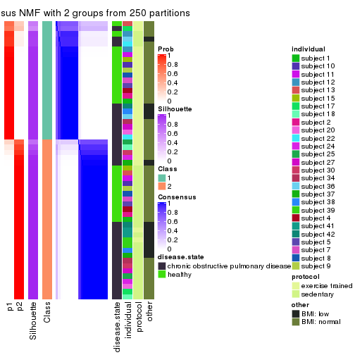</p>

</div>
<div id='tab-CV-NMF-consensus-heatmap-2'>
<pre><code class="r">consensus_heatmap(res, k = 3)
</code></pre>

<p>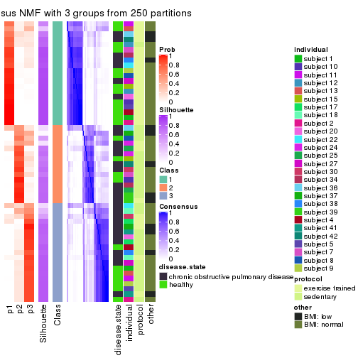</p>

</div>
<div id='tab-CV-NMF-consensus-heatmap-3'>
<pre><code class="r">consensus_heatmap(res, k = 4)
</code></pre>

<p>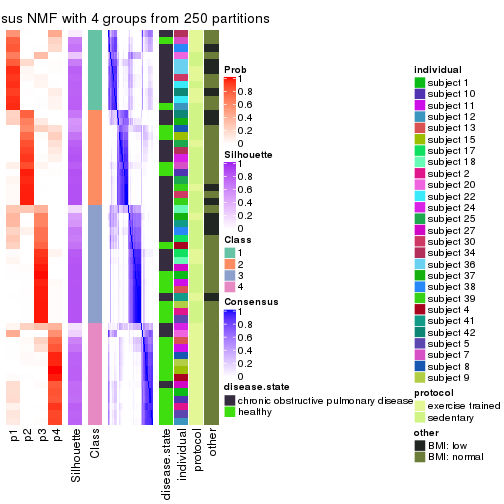</p>

</div>
<div id='tab-CV-NMF-consensus-heatmap-4'>
<pre><code class="r">consensus_heatmap(res, k = 5)
</code></pre>

<p>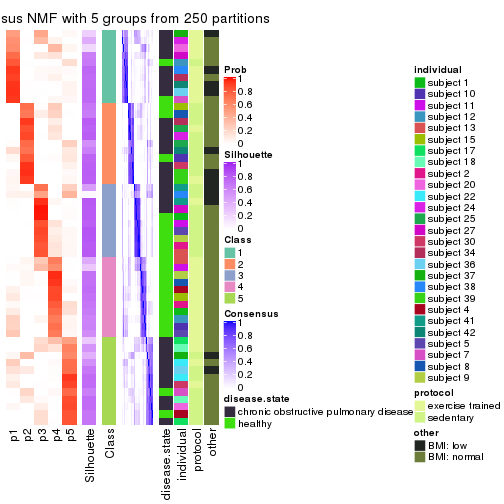</p>

</div>
<div id='tab-CV-NMF-consensus-heatmap-5'>
<pre><code class="r">consensus_heatmap(res, k = 6)
</code></pre>

<p>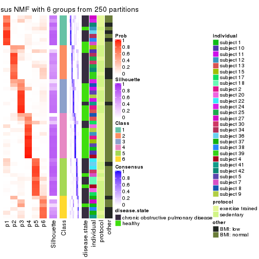</p>

</div>
</div>

Heatmaps for the membership of samples in all partitions to see how consistent they are:


<script>
$( function() {
	$( '#tabs-CV-NMF-membership-heatmap' ).tabs();
} );
</script>
<div id='tabs-CV-NMF-membership-heatmap'>
<ul>
<li><a href='#tab-CV-NMF-membership-heatmap-1'>k = 2</a></li>
<li><a href='#tab-CV-NMF-membership-heatmap-2'>k = 3</a></li>
<li><a href='#tab-CV-NMF-membership-heatmap-3'>k = 4</a></li>
<li><a href='#tab-CV-NMF-membership-heatmap-4'>k = 5</a></li>
<li><a href='#tab-CV-NMF-membership-heatmap-5'>k = 6</a></li>
</ul>
<div id='tab-CV-NMF-membership-heatmap-1'>
<pre><code class="r">membership_heatmap(res, k = 2)
</code></pre>

<p>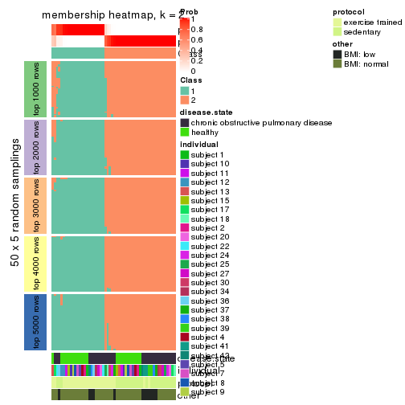</p>

</div>
<div id='tab-CV-NMF-membership-heatmap-2'>
<pre><code class="r">membership_heatmap(res, k = 3)
</code></pre>

<p>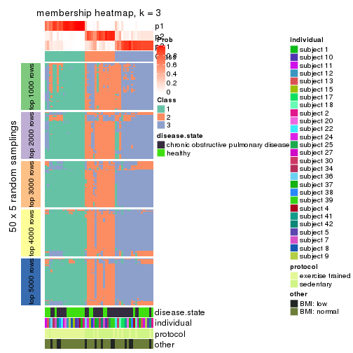</p>

</div>
<div id='tab-CV-NMF-membership-heatmap-3'>
<pre><code class="r">membership_heatmap(res, k = 4)
</code></pre>

<p>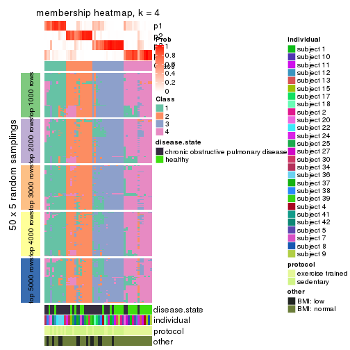</p>

</div>
<div id='tab-CV-NMF-membership-heatmap-4'>
<pre><code class="r">membership_heatmap(res, k = 5)
</code></pre>

<p>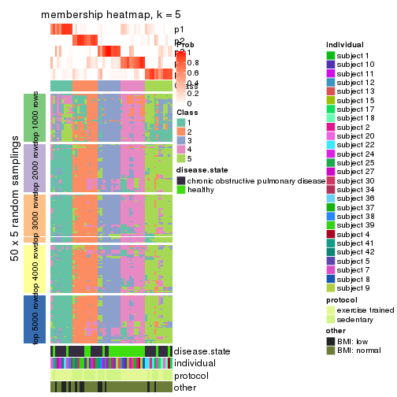</p>

</div>
<div id='tab-CV-NMF-membership-heatmap-5'>
<pre><code class="r">membership_heatmap(res, k = 6)
</code></pre>

<p>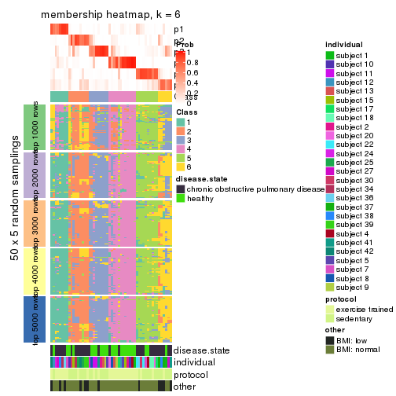</p>

</div>
</div>

As soon as we have had the classes for columns, we can look for signatures
which are significantly different between classes which can be candidate marks
for certain classes. Following are the heatmaps for signatures.


Signature heatmaps where rows are scaled:


<script>
$( function() {
	$( '#tabs-CV-NMF-get-signatures' ).tabs();
} );
</script>
<div id='tabs-CV-NMF-get-signatures'>
<ul>
<li><a href='#tab-CV-NMF-get-signatures-1'>k = 2</a></li>
<li><a href='#tab-CV-NMF-get-signatures-2'>k = 3</a></li>
<li><a href='#tab-CV-NMF-get-signatures-3'>k = 4</a></li>
<li><a href='#tab-CV-NMF-get-signatures-4'>k = 5</a></li>
<li><a href='#tab-CV-NMF-get-signatures-5'>k = 6</a></li>
</ul>
<div id='tab-CV-NMF-get-signatures-1'>
<pre><code class="r">get_signatures(res, k = 2)
</code></pre>

<p>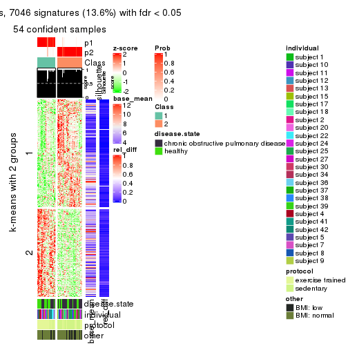</p>

</div>
<div id='tab-CV-NMF-get-signatures-2'>
<pre><code class="r">get_signatures(res, k = 3)
</code></pre>

<p>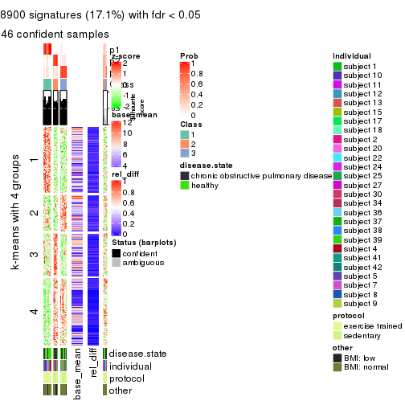</p>

</div>
<div id='tab-CV-NMF-get-signatures-3'>
<pre><code class="r">get_signatures(res, k = 4)
</code></pre>

<p>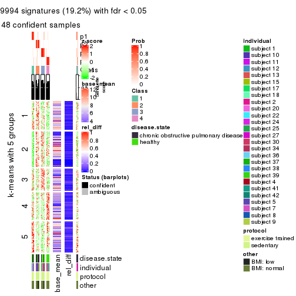</p>

</div>
<div id='tab-CV-NMF-get-signatures-4'>
<pre><code class="r">get_signatures(res, k = 5)
</code></pre>

<p>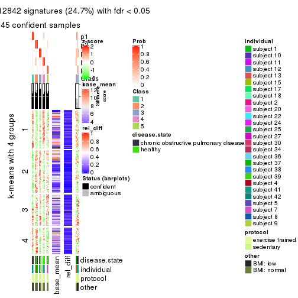</p>

</div>
<div id='tab-CV-NMF-get-signatures-5'>
<pre><code class="r">get_signatures(res, k = 6)
</code></pre>

<pre><code>#&gt; Error in mat[ceiling(1:nr/h_ratio), ceiling(1:nc/w_ratio), drop = FALSE]: subscript out of bounds
</code></pre>

<p>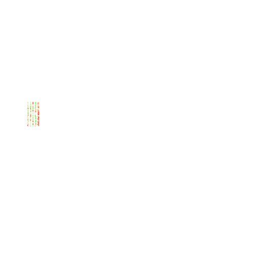</p>

</div>
</div>


Signature heatmaps where rows are not scaled:


<script>
$( function() {
	$( '#tabs-CV-NMF-get-signatures-no-scale' ).tabs();
} );
</script>
<div id='tabs-CV-NMF-get-signatures-no-scale'>
<ul>
<li><a href='#tab-CV-NMF-get-signatures-no-scale-1'>k = 2</a></li>
<li><a href='#tab-CV-NMF-get-signatures-no-scale-2'>k = 3</a></li>
<li><a href='#tab-CV-NMF-get-signatures-no-scale-3'>k = 4</a></li>
<li><a href='#tab-CV-NMF-get-signatures-no-scale-4'>k = 5</a></li>
<li><a href='#tab-CV-NMF-get-signatures-no-scale-5'>k = 6</a></li>
</ul>
<div id='tab-CV-NMF-get-signatures-no-scale-1'>
<pre><code class="r">get_signatures(res, k = 2, scale_rows = FALSE)
</code></pre>

<p>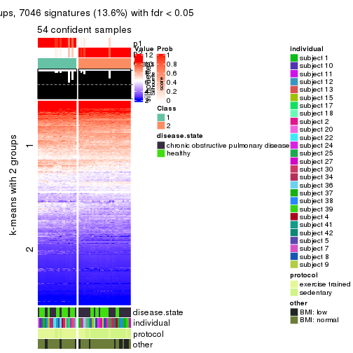</p>

</div>
<div id='tab-CV-NMF-get-signatures-no-scale-2'>
<pre><code class="r">get_signatures(res, k = 3, scale_rows = FALSE)
</code></pre>

<p>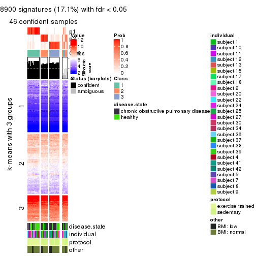</p>

</div>
<div id='tab-CV-NMF-get-signatures-no-scale-3'>
<pre><code class="r">get_signatures(res, k = 4, scale_rows = FALSE)
</code></pre>

<p>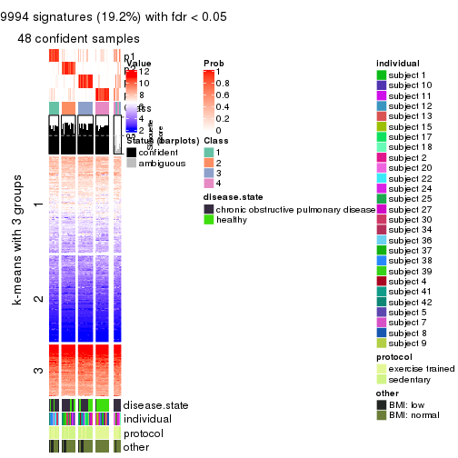</p>

</div>
<div id='tab-CV-NMF-get-signatures-no-scale-4'>
<pre><code class="r">get_signatures(res, k = 5, scale_rows = FALSE)
</code></pre>

<p>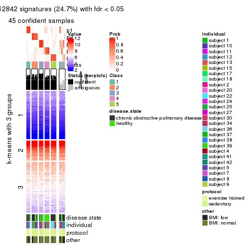</p>

</div>
<div id='tab-CV-NMF-get-signatures-no-scale-5'>
<pre><code class="r">get_signatures(res, k = 6, scale_rows = FALSE)
</code></pre>

<p>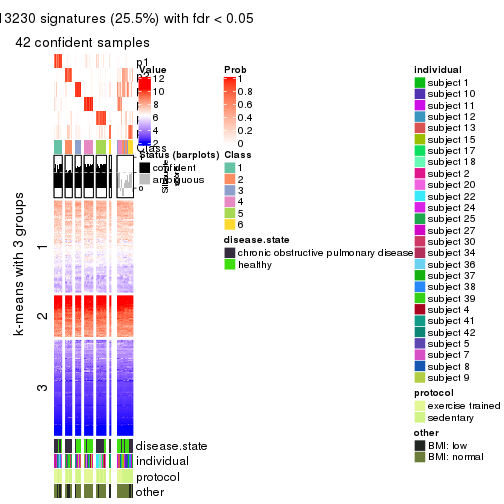</p>

</div>
</div>


Compare the overlap of signatures from different k:

```r
compare_signatures(res)
```

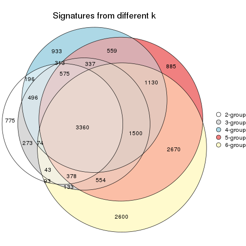

`get_signature()` returns a data frame invisibly. TO get the list of signatures, the function
call should be assigned to a variable explicitly. In following code, if `plot` argument is set
to `FALSE`, no heatmap is plotted while only the differential analysis is performed.

```r
# code only for demonstration
tb = get_signature(res, k = ..., plot = FALSE)
```

An example of the output of `tb` is:

```
#>   which_row         fdr    mean_1    mean_2 scaled_mean_1 scaled_mean_2 km
#> 1        38 0.042760348  8.373488  9.131774    -0.5533452     0.5164555  1
#> 2        40 0.018707592  7.106213  8.469186    -0.6173731     0.5762149  1
#> 3        55 0.019134737 10.221463 11.207825    -0.6159697     0.5749050  1
#> 4        59 0.006059896  5.921854  7.869574    -0.6899429     0.6439467  1
#> 5        60 0.018055526  8.928898 10.211722    -0.6204761     0.5791110  1
#> 6        98 0.009384629 15.714769 14.887706     0.6635654    -0.6193277  2
...
```

The columns in `tb` are:

1. `which_row`: row indices corresponding to the input matrix.
2. `fdr`: FDR for the differential test. 
3. `mean_x`: The mean value in group x.
4. `scaled_mean_x`: The mean value in group x after rows are scaled.
5. `km`: Row groups if k-means clustering is applied to rows.


UMAP plot which shows how samples are separated.


<script>
$( function() {
	$( '#tabs-CV-NMF-dimension-reduction' ).tabs();
} );
</script>
<div id='tabs-CV-NMF-dimension-reduction'>
<ul>
<li><a href='#tab-CV-NMF-dimension-reduction-1'>k = 2</a></li>
<li><a href='#tab-CV-NMF-dimension-reduction-2'>k = 3</a></li>
<li><a href='#tab-CV-NMF-dimension-reduction-3'>k = 4</a></li>
<li><a href='#tab-CV-NMF-dimension-reduction-4'>k = 5</a></li>
<li><a href='#tab-CV-NMF-dimension-reduction-5'>k = 6</a></li>
</ul>
<div id='tab-CV-NMF-dimension-reduction-1'>
<pre><code class="r">dimension_reduction(res, k = 2, method = &quot;UMAP&quot;)
</code></pre>

<p>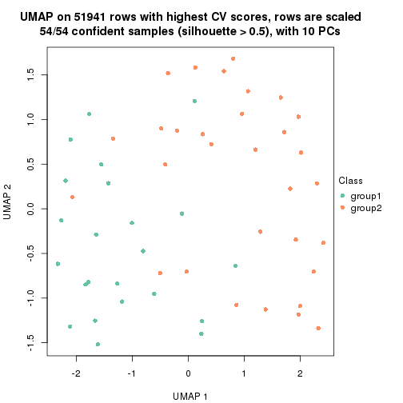</p>

</div>
<div id='tab-CV-NMF-dimension-reduction-2'>
<pre><code class="r">dimension_reduction(res, k = 3, method = &quot;UMAP&quot;)
</code></pre>

<p>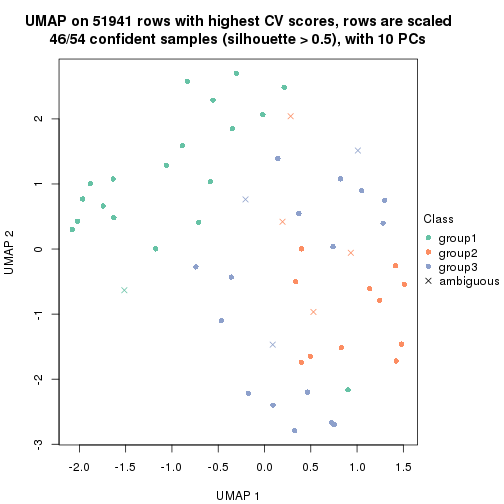</p>

</div>
<div id='tab-CV-NMF-dimension-reduction-3'>
<pre><code class="r">dimension_reduction(res, k = 4, method = &quot;UMAP&quot;)
</code></pre>

<p>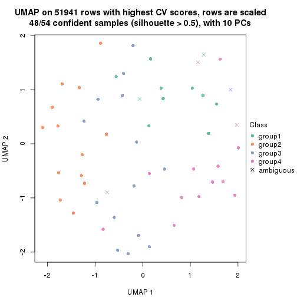</p>

</div>
<div id='tab-CV-NMF-dimension-reduction-4'>
<pre><code class="r">dimension_reduction(res, k = 5, method = &quot;UMAP&quot;)
</code></pre>

<p>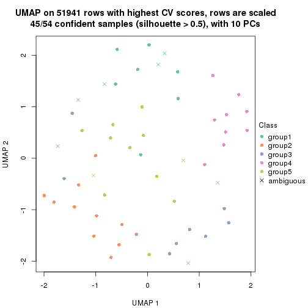</p>

</div>
<div id='tab-CV-NMF-dimension-reduction-5'>
<pre><code class="r">dimension_reduction(res, k = 6, method = &quot;UMAP&quot;)
</code></pre>

<p>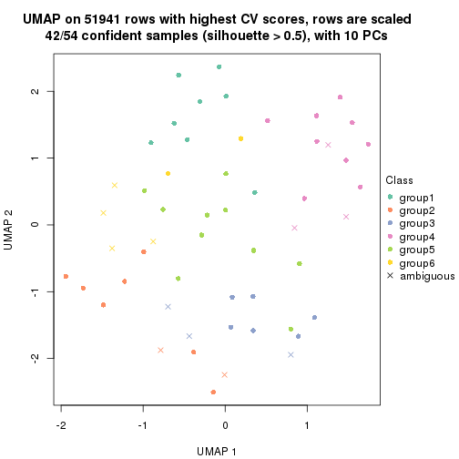</p>

</div>
</div>


Following heatmap shows how subgroups are split when increasing `k`:

```r
collect_classes(res)
```

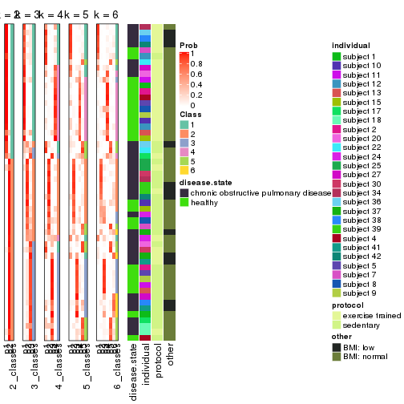


Test correlation between subgroups and known annotations. If the known
annotation is numeric, one-way ANOVA test is applied, and if the known
annotation is discrete, chi-squared contingency table test is applied.

```r
test_to_known_factors(res)
```

```
#>         n disease.state(p) individual(p) protocol(p) other(p) k
#> CV:NMF 54         0.207125         0.826    1.07e-05   0.6858 2
#> CV:NMF 46         0.152692         0.487    7.42e-06   0.7071 3
#> CV:NMF 48         0.004563         0.321    2.80e-05   0.0937 4
#> CV:NMF 45         0.001156         0.402    1.25e-04   0.1845 5
#> CV:NMF 42         0.000527         0.187    2.06e-03   0.0268 6
```


If matrix rows can be associated to genes, consider to use `functional_enrichment(res,
...)` to perform function enrichment for the signature genes. See [this vignette](http://bioconductor.org/packages/devel/bioc/vignettes/cola/inst/doc/functional_enrichment.html) for more detailed explanations.


 

---------------------------------------------------


### MAD:hclust


The object with results only for a single top-value method and a single partition method 
can be extracted as:

```r
res = res_list["MAD", "hclust"]
# you can also extract it by
# res = res_list["MAD:hclust"]
```

A summary of `res` and all the functions that can be applied to it:

```r
res
```

```
#> A 'ConsensusPartition' object with k = 2, 3, 4, 5, 6.
#>   On a matrix with 51941 rows and 54 columns.
#>   Top rows (1000, 2000, 3000, 4000, 5000) are extracted by 'MAD' method.
#>   Subgroups are detected by 'hclust' method.
#>   Performed in total 1250 partitions by row resampling.
#>   Best k for subgroups seems to be 3.
#> 
#> Following methods can be applied to this 'ConsensusPartition' object:
#>  [1] "cola_report"             "collect_classes"         "collect_plots"          
#>  [4] "collect_stats"           "colnames"                "compare_signatures"     
#>  [7] "consensus_heatmap"       "dimension_reduction"     "functional_enrichment"  
#> [10] "get_anno_col"            "get_anno"                "get_classes"            
#> [13] "get_consensus"           "get_matrix"              "get_membership"         
#> [16] "get_param"               "get_signatures"          "get_stats"              
#> [19] "is_best_k"               "is_stable_k"             "membership_heatmap"     
#> [22] "ncol"                    "nrow"                    "plot_ecdf"              
#> [25] "rownames"                "select_partition_number" "show"                   
#> [28] "suggest_best_k"          "test_to_known_factors"
```

`collect_plots()` function collects all the plots made from `res` for all `k` (number of partitions)
into one single page to provide an easy and fast comparison between different `k`.

```r
collect_plots(res)
```

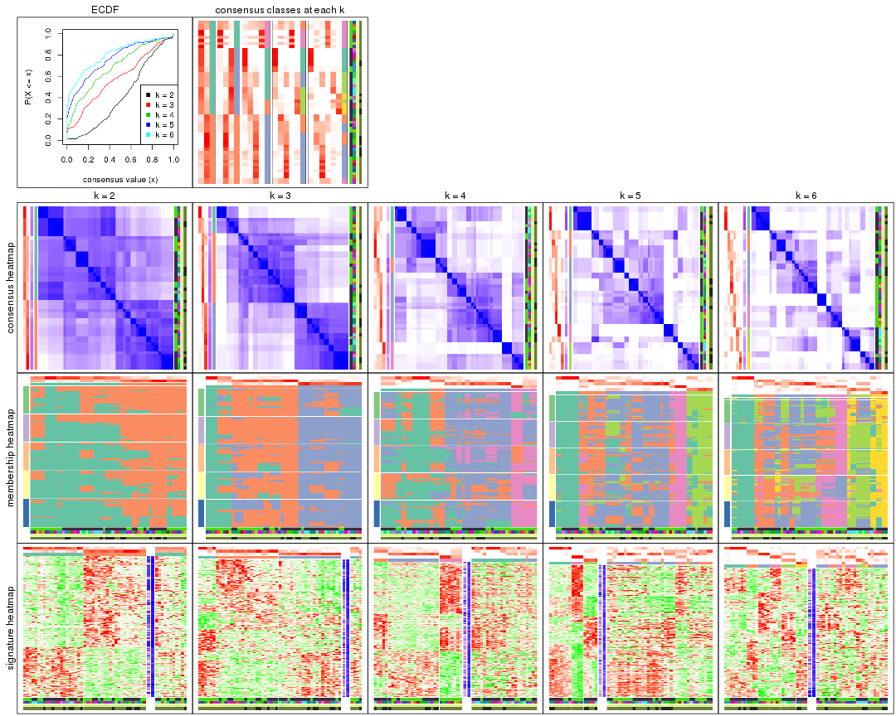

The plots are:

- The first row: a plot of the ECDF (empirical cumulative distribution
  function) curves of the consensus matrix for each `k` and the heatmap of
  predicted classes for each `k`.
- The second row: heatmaps of the consensus matrix for each `k`.
- The third row: heatmaps of the membership matrix for each `k`.
- The fouth row: heatmaps of the signatures for each `k`.

All the plots in panels can be made by individual functions and they are
plotted later in this section.

`select_partition_number()` produces several plots showing different
statistics for choosing "optimized" `k`. There are following statistics:

- ECDF curves of the consensus matrix for each `k`;
- 1-PAC. [The PAC
  score](https://en.wikipedia.org/wiki/Consensus_clustering#Over-interpretation_potential_of_consensus_clustering)
  measures the proportion of the ambiguous subgrouping.
- Mean silhouette score.
- Concordance. The mean probability of fiting the consensus class ids in all
  partitions.
- Area increased. Denote $A_k$ as the area under the ECDF curve for current
  `k`, the area increased is defined as $A_k - A_{k-1}$.
- Rand index. The percent of pairs of samples that are both in a same cluster
  or both are not in a same cluster in the partition of k and k-1.
- Jaccard index. The ratio of pairs of samples are both in a same cluster in
  the partition of k and k-1 and the pairs of samples are both in a same
  cluster in the partition k or k-1.

The detailed explanations of these statistics can be found in [the _cola_
vignette](http://bioconductor.org/packages/devel/bioc/vignettes/cola/inst/doc/cola.html#toc_13).

Generally speaking, lower PAC score, higher mean silhouette score or higher
concordance corresponds to better partition. Rand index and Jaccard index
measure how similar the current partition is compared to partition with `k-1`.
If they are too similar, we won't accept `k` is better than `k-1`.

```r
select_partition_number(res)
```

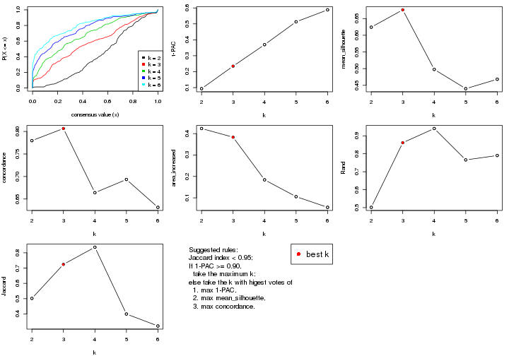

The numeric values for all these statistics can be obtained by `get_stats()`.

```r
get_stats(res)
```

```
#>   k  1-PAC mean_silhouette concordance area_increased  Rand Jaccard
#> 2 2 0.0935           0.624       0.780         0.4238 0.502   0.502
#> 3 3 0.2345           0.676       0.807         0.3833 0.862   0.724
#> 4 4 0.3695           0.498       0.664         0.1842 0.941   0.837
#> 5 5 0.5128           0.440       0.693         0.1056 0.766   0.400
#> 6 6 0.5878           0.468       0.632         0.0557 0.790   0.321
```

`suggest_best_k()` suggests the best $k$ based on these statistics. The rules are as follows:

- All $k$ with Jaccard index larger than 0.95 are removed because increasing
  $k$ does not provide enough extra information. If all $k$ are removed, it is
  marked as no subgroup is detected.
- For all $k$ with 1-PAC score larger than 0.9, the maximal $k$ is taken as
  the best $k$, and other $k$ are marked as optional $k$.
- If it does not fit the second rule. The $k$ with the maximal vote of the
  highest 1-PAC score, highest mean silhouette, and highest concordance is
  taken as the best $k$.

```r
suggest_best_k(res)
```

```
#> [1] 3
```


Following shows the table of the partitions (You need to click the **show/hide
code output** link to see it). The membership matrix (columns with name `p*`)
is inferred by
[`clue::cl_consensus()`](https://www.rdocumentation.org/link/cl_consensus?package=clue)
function with the `SE` method. Basically the value in the membership matrix
represents the probability to belong to a certain group. The finall class
label for an item is determined with the group with highest probability it
belongs to.

In `get_classes()` function, the entropy is calculated from the membership
matrix and the silhouette score is calculated from the consensus matrix.


<script>
$( function() {
	$( '#tabs-MAD-hclust-get-classes' ).tabs();
} );
</script>
<div id='tabs-MAD-hclust-get-classes'>
<ul>
<li><a href='#tab-MAD-hclust-get-classes-1'>k = 2</a></li>
<li><a href='#tab-MAD-hclust-get-classes-2'>k = 3</a></li>
<li><a href='#tab-MAD-hclust-get-classes-3'>k = 4</a></li>
<li><a href='#tab-MAD-hclust-get-classes-4'>k = 5</a></li>
<li><a href='#tab-MAD-hclust-get-classes-5'>k = 6</a></li>
</ul>

<div id='tab-MAD-hclust-get-classes-1'>
<p><a id='tab-MAD-hclust-get-classes-1-a' style='color:#0366d6' href='#'>show/hide code output</a></p>
<pre><code class="r">cbind(get_classes(res, k = 2), get_membership(res, k = 2))
</code></pre>

<pre><code>#&gt;           class entropy silhouette    p1    p2
#&gt; GSM680053     1  0.9850      0.475 0.572 0.428
#&gt; GSM680062     1  0.9833      0.482 0.576 0.424
#&gt; GSM680054     1  0.9866      0.466 0.568 0.432
#&gt; GSM680063     1  0.9833      0.482 0.576 0.424
#&gt; GSM680055     1  0.9850      0.475 0.572 0.428
#&gt; GSM680064     1  0.4690      0.716 0.900 0.100
#&gt; GSM680056     1  0.6887      0.716 0.816 0.184
#&gt; GSM680065     1  0.6887      0.716 0.816 0.184
#&gt; GSM680057     2  0.8081      0.708 0.248 0.752
#&gt; GSM680066     1  0.4815      0.718 0.896 0.104
#&gt; GSM680058     2  0.0000      0.726 0.000 1.000
#&gt; GSM680067     2  0.6048      0.704 0.148 0.852
#&gt; GSM680059     2  0.0938      0.732 0.012 0.988
#&gt; GSM680068     1  0.4815      0.718 0.896 0.104
#&gt; GSM680060     1  0.9552      0.566 0.624 0.376
#&gt; GSM680069     1  0.9552      0.566 0.624 0.376
#&gt; GSM680061     2  0.6048      0.704 0.148 0.852
#&gt; GSM680070     1  0.4815      0.718 0.896 0.104
#&gt; GSM680071     1  0.9170      0.623 0.668 0.332
#&gt; GSM680077     1  0.7883      0.703 0.764 0.236
#&gt; GSM680072     2  0.0000      0.726 0.000 1.000
#&gt; GSM680078     1  0.4815      0.718 0.896 0.104
#&gt; GSM680073     2  0.4690      0.718 0.100 0.900
#&gt; GSM680079     1  0.4690      0.716 0.900 0.100
#&gt; GSM680074     2  0.0000      0.726 0.000 1.000
#&gt; GSM680080     2  0.0000      0.726 0.000 1.000
#&gt; GSM680075     2  0.9710      0.308 0.400 0.600
#&gt; GSM680081     2  0.8909      0.608 0.308 0.692
#&gt; GSM680076     1  0.9552      0.587 0.624 0.376
#&gt; GSM680082     1  0.9552      0.587 0.624 0.376
#&gt; GSM680029     2  0.8763      0.532 0.296 0.704
#&gt; GSM680041     1  0.0000      0.649 1.000 0.000
#&gt; GSM680035     2  0.6623      0.735 0.172 0.828
#&gt; GSM680047     1  0.0000      0.649 1.000 0.000
#&gt; GSM680036     2  0.8813      0.523 0.300 0.700
#&gt; GSM680048     1  0.9552      0.395 0.624 0.376
#&gt; GSM680037     2  0.6623      0.735 0.172 0.828
#&gt; GSM680049     1  0.0000      0.649 1.000 0.000
#&gt; GSM680038     2  0.7056      0.739 0.192 0.808
#&gt; GSM680050     1  0.7883      0.703 0.764 0.236
#&gt; GSM680039     2  0.6438      0.763 0.164 0.836
#&gt; GSM680051     1  0.9983      0.113 0.524 0.476
#&gt; GSM680040     2  0.5519      0.759 0.128 0.872
#&gt; GSM680052     1  0.9552      0.395 0.624 0.376
#&gt; GSM680030     2  0.8081      0.708 0.248 0.752
#&gt; GSM680042     1  0.0000      0.649 1.000 0.000
#&gt; GSM680031     2  0.8909      0.607 0.308 0.692
#&gt; GSM680043     2  0.8955      0.606 0.312 0.688
#&gt; GSM680032     1  0.7219      0.708 0.800 0.200
#&gt; GSM680044     1  0.7219      0.708 0.800 0.200
#&gt; GSM680033     2  0.5629      0.761 0.132 0.868
#&gt; GSM680045     1  0.9686      0.389 0.604 0.396
#&gt; GSM680034     2  0.8081      0.708 0.248 0.752
#&gt; GSM680046     1  0.9686      0.389 0.604 0.396
</code></pre>

<script>
$('#tab-MAD-hclust-get-classes-1-a').parent().next().next().hide();
$('#tab-MAD-hclust-get-classes-1-a').click(function(){
  $('#tab-MAD-hclust-get-classes-1-a').parent().next().next().toggle();
  return(false);
});
</script>
</div>

<div id='tab-MAD-hclust-get-classes-2'>
<p><a id='tab-MAD-hclust-get-classes-2-a' style='color:#0366d6' href='#'>show/hide code output</a></p>
<pre><code class="r">cbind(get_classes(res, k = 3), get_membership(res, k = 3))
</code></pre>

<pre><code>#&gt;           class entropy silhouette    p1    p2    p3
#&gt; GSM680053     3  0.5591      0.611 0.000 0.304 0.696
#&gt; GSM680062     3  0.5560      0.617 0.000 0.300 0.700
#&gt; GSM680054     3  0.5905      0.522 0.000 0.352 0.648
#&gt; GSM680063     3  0.5560      0.617 0.000 0.300 0.700
#&gt; GSM680055     3  0.5591      0.611 0.000 0.304 0.696
#&gt; GSM680064     3  0.2537      0.791 0.080 0.000 0.920
#&gt; GSM680056     3  0.0983      0.801 0.004 0.016 0.980
#&gt; GSM680065     3  0.0983      0.801 0.004 0.016 0.980
#&gt; GSM680057     2  0.6834      0.716 0.112 0.740 0.148
#&gt; GSM680066     3  0.2772      0.793 0.080 0.004 0.916
#&gt; GSM680058     2  0.0747      0.725 0.000 0.984 0.016
#&gt; GSM680067     2  0.4291      0.597 0.152 0.840 0.008
#&gt; GSM680059     2  0.0892      0.732 0.000 0.980 0.020
#&gt; GSM680068     3  0.2955      0.793 0.080 0.008 0.912
#&gt; GSM680060     3  0.4887      0.701 0.000 0.228 0.772
#&gt; GSM680069     3  0.4887      0.701 0.000 0.228 0.772
#&gt; GSM680061     2  0.4291      0.597 0.152 0.840 0.008
#&gt; GSM680070     3  0.2772      0.793 0.080 0.004 0.916
#&gt; GSM680071     3  0.4346      0.742 0.000 0.184 0.816
#&gt; GSM680077     3  0.2400      0.788 0.004 0.064 0.932
#&gt; GSM680072     2  0.0747      0.725 0.000 0.984 0.016
#&gt; GSM680078     3  0.2772      0.793 0.080 0.004 0.916
#&gt; GSM680073     2  0.3340      0.714 0.000 0.880 0.120
#&gt; GSM680079     3  0.2537      0.791 0.080 0.000 0.920
#&gt; GSM680074     2  0.0237      0.723 0.000 0.996 0.004
#&gt; GSM680080     2  0.0237      0.723 0.000 0.996 0.004
#&gt; GSM680075     2  0.6244      0.344 0.000 0.560 0.440
#&gt; GSM680081     2  0.6008      0.618 0.004 0.664 0.332
#&gt; GSM680076     3  0.5024      0.716 0.004 0.220 0.776
#&gt; GSM680082     3  0.5024      0.716 0.004 0.220 0.776
#&gt; GSM680029     2  0.5810      0.547 0.000 0.664 0.336
#&gt; GSM680041     1  0.0237      0.657 0.996 0.000 0.004
#&gt; GSM680035     2  0.4346      0.746 0.000 0.816 0.184
#&gt; GSM680047     1  0.0237      0.657 0.996 0.000 0.004
#&gt; GSM680036     2  0.5859      0.532 0.000 0.656 0.344
#&gt; GSM680048     1  0.7710      0.526 0.576 0.368 0.056
#&gt; GSM680037     2  0.4346      0.746 0.000 0.816 0.184
#&gt; GSM680049     1  0.0237      0.657 0.996 0.000 0.004
#&gt; GSM680038     2  0.5883      0.723 0.092 0.796 0.112
#&gt; GSM680050     3  0.2400      0.788 0.004 0.064 0.932
#&gt; GSM680039     2  0.5094      0.765 0.040 0.824 0.136
#&gt; GSM680051     1  0.7752      0.272 0.496 0.456 0.048
#&gt; GSM680040     2  0.3851      0.764 0.004 0.860 0.136
#&gt; GSM680052     1  0.7710      0.526 0.576 0.368 0.056
#&gt; GSM680030     2  0.6834      0.716 0.112 0.740 0.148
#&gt; GSM680042     1  0.0237      0.657 0.996 0.000 0.004
#&gt; GSM680031     2  0.7731      0.650 0.108 0.664 0.228
#&gt; GSM680043     2  0.7796      0.644 0.112 0.660 0.228
#&gt; GSM680032     3  0.5304      0.782 0.068 0.108 0.824
#&gt; GSM680044     3  0.5304      0.782 0.068 0.108 0.824
#&gt; GSM680033     2  0.4033      0.764 0.008 0.856 0.136
#&gt; GSM680045     1  0.8586      0.488 0.520 0.376 0.104
#&gt; GSM680034     2  0.6834      0.716 0.112 0.740 0.148
#&gt; GSM680046     1  0.8586      0.488 0.520 0.376 0.104
</code></pre>

<script>
$('#tab-MAD-hclust-get-classes-2-a').parent().next().next().hide();
$('#tab-MAD-hclust-get-classes-2-a').click(function(){
  $('#tab-MAD-hclust-get-classes-2-a').parent().next().next().toggle();
  return(false);
});
</script>
</div>

<div id='tab-MAD-hclust-get-classes-3'>
<p><a id='tab-MAD-hclust-get-classes-3-a' style='color:#0366d6' href='#'>show/hide code output</a></p>
<pre><code class="r">cbind(get_classes(res, k = 4), get_membership(res, k = 4))
</code></pre>

<pre><code>#&gt;           class entropy silhouette    p1    p2    p3    p4
#&gt; GSM680053     1  0.7599     0.3136 0.424 0.200 0.376 0.000
#&gt; GSM680062     1  0.7595     0.3158 0.428 0.200 0.372 0.000
#&gt; GSM680054     1  0.7953     0.2797 0.416 0.192 0.380 0.012
#&gt; GSM680063     1  0.7595     0.3158 0.428 0.200 0.372 0.000
#&gt; GSM680055     1  0.7599     0.3136 0.424 0.200 0.376 0.000
#&gt; GSM680064     1  0.0188     0.4802 0.996 0.000 0.000 0.004
#&gt; GSM680056     1  0.4957     0.0626 0.656 0.336 0.004 0.004
#&gt; GSM680065     1  0.4957     0.0626 0.656 0.336 0.004 0.004
#&gt; GSM680057     3  0.6914     0.6094 0.076 0.200 0.664 0.060
#&gt; GSM680066     1  0.0376     0.4840 0.992 0.000 0.004 0.004
#&gt; GSM680058     3  0.4012     0.6475 0.000 0.184 0.800 0.016
#&gt; GSM680067     3  0.6737     0.4018 0.004 0.408 0.508 0.080
#&gt; GSM680059     3  0.1716     0.6844 0.000 0.064 0.936 0.000
#&gt; GSM680068     1  0.0524     0.4833 0.988 0.000 0.008 0.004
#&gt; GSM680060     2  0.5936     0.8305 0.324 0.620 0.056 0.000
#&gt; GSM680069     2  0.5936     0.8305 0.324 0.620 0.056 0.000
#&gt; GSM680061     3  0.6737     0.4018 0.004 0.408 0.508 0.080
#&gt; GSM680070     1  0.0376     0.4840 0.992 0.000 0.004 0.004
#&gt; GSM680071     2  0.5560     0.7308 0.392 0.584 0.024 0.000
#&gt; GSM680077     1  0.4985    -0.4508 0.532 0.468 0.000 0.000
#&gt; GSM680072     3  0.4012     0.6475 0.000 0.184 0.800 0.016
#&gt; GSM680078     1  0.0376     0.4840 0.992 0.000 0.004 0.004
#&gt; GSM680073     3  0.4155     0.6634 0.072 0.100 0.828 0.000
#&gt; GSM680079     1  0.0188     0.4802 0.996 0.000 0.000 0.004
#&gt; GSM680074     3  0.3881     0.6511 0.000 0.172 0.812 0.016
#&gt; GSM680080     3  0.3881     0.6511 0.000 0.172 0.812 0.016
#&gt; GSM680075     3  0.6429     0.3654 0.324 0.088 0.588 0.000
#&gt; GSM680081     3  0.5489     0.5745 0.240 0.060 0.700 0.000
#&gt; GSM680076     2  0.5339     0.8281 0.272 0.688 0.040 0.000
#&gt; GSM680082     2  0.5339     0.8281 0.272 0.688 0.040 0.000
#&gt; GSM680029     3  0.5318     0.5239 0.196 0.072 0.732 0.000
#&gt; GSM680041     4  0.1302     0.5768 0.044 0.000 0.000 0.956
#&gt; GSM680035     3  0.2983     0.6835 0.068 0.040 0.892 0.000
#&gt; GSM680047     4  0.1302     0.5768 0.044 0.000 0.000 0.956
#&gt; GSM680036     3  0.5421     0.5135 0.200 0.076 0.724 0.000
#&gt; GSM680048     4  0.8936     0.5494 0.076 0.236 0.240 0.448
#&gt; GSM680037     3  0.2983     0.6835 0.068 0.040 0.892 0.000
#&gt; GSM680049     4  0.1302     0.5768 0.044 0.000 0.000 0.956
#&gt; GSM680038     3  0.6578     0.6223 0.056 0.200 0.684 0.060
#&gt; GSM680050     1  0.4985    -0.4508 0.532 0.468 0.000 0.000
#&gt; GSM680039     3  0.4273     0.6901 0.052 0.044 0.848 0.056
#&gt; GSM680051     4  0.8598     0.3822 0.036 0.244 0.308 0.412
#&gt; GSM680040     3  0.1854     0.6947 0.048 0.012 0.940 0.000
#&gt; GSM680052     4  0.8936     0.5494 0.076 0.236 0.240 0.448
#&gt; GSM680030     3  0.6914     0.6094 0.076 0.200 0.664 0.060
#&gt; GSM680042     4  0.1302     0.5768 0.044 0.000 0.000 0.956
#&gt; GSM680031     3  0.7946     0.4316 0.192 0.252 0.528 0.028
#&gt; GSM680043     3  0.7987     0.4172 0.192 0.260 0.520 0.028
#&gt; GSM680032     1  0.3372     0.4373 0.868 0.036 0.096 0.000
#&gt; GSM680044     1  0.3372     0.4373 0.868 0.036 0.096 0.000
#&gt; GSM680033     3  0.1975     0.6953 0.048 0.016 0.936 0.000
#&gt; GSM680045     4  0.9646     0.5139 0.148 0.236 0.248 0.368
#&gt; GSM680034     3  0.6914     0.6094 0.076 0.200 0.664 0.060
#&gt; GSM680046     4  0.9646     0.5139 0.148 0.236 0.248 0.368
</code></pre>

<script>
$('#tab-MAD-hclust-get-classes-3-a').parent().next().next().hide();
$('#tab-MAD-hclust-get-classes-3-a').click(function(){
  $('#tab-MAD-hclust-get-classes-3-a').parent().next().next().toggle();
  return(false);
});
</script>
</div>

<div id='tab-MAD-hclust-get-classes-4'>
<p><a id='tab-MAD-hclust-get-classes-4-a' style='color:#0366d6' href='#'>show/hide code output</a></p>
<pre><code class="r">cbind(get_classes(res, k = 5), get_membership(res, k = 5))
</code></pre>

<pre><code>#&gt;           class entropy silhouette    p1    p2    p3    p4    p5
#&gt; GSM680053     3  0.6956     0.2871 0.240 0.012 0.440 0.000 0.308
#&gt; GSM680062     3  0.6971     0.2829 0.244 0.012 0.436 0.000 0.308
#&gt; GSM680054     3  0.8025     0.2716 0.232 0.100 0.392 0.000 0.276
#&gt; GSM680063     3  0.6971     0.2829 0.244 0.012 0.436 0.000 0.308
#&gt; GSM680055     3  0.6956     0.2871 0.240 0.012 0.440 0.000 0.308
#&gt; GSM680064     1  0.0000     0.9204 1.000 0.000 0.000 0.000 0.000
#&gt; GSM680056     5  0.5059     0.2657 0.400 0.012 0.012 0.004 0.572
#&gt; GSM680065     5  0.5059     0.2657 0.400 0.012 0.012 0.004 0.572
#&gt; GSM680057     2  0.5232     0.4189 0.008 0.492 0.472 0.000 0.028
#&gt; GSM680066     1  0.0162     0.9239 0.996 0.000 0.004 0.000 0.000
#&gt; GSM680058     3  0.4736     0.2759 0.000 0.404 0.576 0.000 0.020
#&gt; GSM680067     2  0.2674     0.4276 0.000 0.868 0.120 0.000 0.012
#&gt; GSM680059     3  0.2471     0.4044 0.000 0.136 0.864 0.000 0.000
#&gt; GSM680068     1  0.0324     0.9214 0.992 0.004 0.004 0.000 0.000
#&gt; GSM680060     5  0.5275     0.6754 0.108 0.132 0.032 0.000 0.728
#&gt; GSM680069     5  0.5275     0.6754 0.108 0.132 0.032 0.000 0.728
#&gt; GSM680061     2  0.2674     0.4276 0.000 0.868 0.120 0.000 0.012
#&gt; GSM680070     1  0.0162     0.9239 0.996 0.000 0.004 0.000 0.000
#&gt; GSM680071     5  0.2804     0.6695 0.068 0.044 0.004 0.000 0.884
#&gt; GSM680077     5  0.5672     0.4519 0.368 0.088 0.000 0.000 0.544
#&gt; GSM680072     3  0.4736     0.2759 0.000 0.404 0.576 0.000 0.020
#&gt; GSM680078     1  0.0162     0.9239 0.996 0.000 0.004 0.000 0.000
#&gt; GSM680073     3  0.4394     0.4529 0.000 0.136 0.764 0.000 0.100
#&gt; GSM680079     1  0.0000     0.9204 1.000 0.000 0.000 0.000 0.000
#&gt; GSM680074     3  0.4464     0.2741 0.000 0.408 0.584 0.000 0.008
#&gt; GSM680080     3  0.4464     0.2741 0.000 0.408 0.584 0.000 0.008
#&gt; GSM680075     3  0.6151     0.3943 0.120 0.028 0.620 0.000 0.232
#&gt; GSM680081     3  0.5386     0.3584 0.116 0.040 0.724 0.000 0.120
#&gt; GSM680076     5  0.3239     0.6759 0.012 0.156 0.004 0.000 0.828
#&gt; GSM680082     5  0.3239     0.6759 0.012 0.156 0.004 0.000 0.828
#&gt; GSM680029     3  0.4147     0.4878 0.056 0.012 0.796 0.000 0.136
#&gt; GSM680041     4  0.0000     0.7241 0.000 0.000 0.000 1.000 0.000
#&gt; GSM680035     3  0.1623     0.4651 0.016 0.016 0.948 0.000 0.020
#&gt; GSM680047     4  0.0000     0.7241 0.000 0.000 0.000 1.000 0.000
#&gt; GSM680036     3  0.4255     0.4872 0.060 0.012 0.788 0.000 0.140
#&gt; GSM680048     4  0.7211     0.0407 0.044 0.356 0.140 0.456 0.004
#&gt; GSM680037     3  0.1623     0.4651 0.016 0.016 0.948 0.000 0.020
#&gt; GSM680049     4  0.0162     0.7230 0.000 0.004 0.000 0.996 0.000
#&gt; GSM680038     2  0.5222     0.3820 0.008 0.512 0.452 0.000 0.028
#&gt; GSM680050     5  0.5672     0.4519 0.368 0.088 0.000 0.000 0.544
#&gt; GSM680039     3  0.2891     0.2556 0.000 0.176 0.824 0.000 0.000
#&gt; GSM680051     2  0.7070     0.0629 0.024 0.436 0.196 0.344 0.000
#&gt; GSM680040     3  0.0404     0.4511 0.000 0.012 0.988 0.000 0.000
#&gt; GSM680052     4  0.7211     0.0407 0.044 0.356 0.140 0.456 0.004
#&gt; GSM680030     2  0.5232     0.4189 0.008 0.492 0.472 0.000 0.028
#&gt; GSM680042     4  0.0000     0.7241 0.000 0.000 0.000 1.000 0.000
#&gt; GSM680031     3  0.7026    -0.3393 0.168 0.376 0.428 0.000 0.028
#&gt; GSM680043     3  0.7031    -0.3488 0.168 0.384 0.420 0.000 0.028
#&gt; GSM680032     1  0.4074     0.7655 0.820 0.036 0.092 0.000 0.052
#&gt; GSM680044     1  0.4074     0.7655 0.820 0.036 0.092 0.000 0.052
#&gt; GSM680033     3  0.0510     0.4480 0.000 0.016 0.984 0.000 0.000
#&gt; GSM680045     2  0.8173    -0.0724 0.144 0.360 0.144 0.348 0.004
#&gt; GSM680034     2  0.5232     0.4189 0.008 0.492 0.472 0.000 0.028
#&gt; GSM680046     2  0.8173    -0.0724 0.144 0.360 0.144 0.348 0.004
</code></pre>

<script>
$('#tab-MAD-hclust-get-classes-4-a').parent().next().next().hide();
$('#tab-MAD-hclust-get-classes-4-a').click(function(){
  $('#tab-MAD-hclust-get-classes-4-a').parent().next().next().toggle();
  return(false);
});
</script>
</div>

<div id='tab-MAD-hclust-get-classes-5'>
<p><a id='tab-MAD-hclust-get-classes-5-a' style='color:#0366d6' href='#'>show/hide code output</a></p>
<pre><code class="r">cbind(get_classes(res, k = 6), get_membership(res, k = 6))
</code></pre>

<pre><code>#&gt;           class entropy silhouette    p1    p2    p3    p4    p5    p6
#&gt; GSM680053     5  0.4488     0.5905 0.016 0.004 0.432 0.000 0.544 0.004
#&gt; GSM680062     5  0.4559     0.5930 0.020 0.004 0.428 0.000 0.544 0.004
#&gt; GSM680054     5  0.5495     0.5112 0.012 0.096 0.368 0.000 0.524 0.000
#&gt; GSM680063     5  0.4559     0.5930 0.020 0.004 0.428 0.000 0.544 0.004
#&gt; GSM680055     5  0.4488     0.5905 0.016 0.004 0.432 0.000 0.544 0.004
#&gt; GSM680064     1  0.0458     0.9107 0.984 0.000 0.000 0.000 0.000 0.016
#&gt; GSM680056     5  0.3844     0.3561 0.108 0.000 0.004 0.004 0.792 0.092
#&gt; GSM680065     5  0.3844     0.3561 0.108 0.000 0.004 0.004 0.792 0.092
#&gt; GSM680057     3  0.7467    -0.1225 0.000 0.316 0.328 0.272 0.064 0.020
#&gt; GSM680066     1  0.0260     0.9162 0.992 0.000 0.000 0.000 0.000 0.008
#&gt; GSM680058     2  0.4531     0.5428 0.000 0.608 0.352 0.000 0.036 0.004
#&gt; GSM680067     2  0.3969     0.3612 0.000 0.644 0.008 0.344 0.004 0.000
#&gt; GSM680059     3  0.3583     0.2510 0.000 0.260 0.728 0.004 0.008 0.000
#&gt; GSM680068     1  0.0146     0.9140 0.996 0.000 0.000 0.000 0.000 0.004
#&gt; GSM680060     6  0.5519     0.5323 0.084 0.012 0.012 0.004 0.272 0.616
#&gt; GSM680069     6  0.5519     0.5323 0.084 0.012 0.012 0.004 0.272 0.616
#&gt; GSM680061     2  0.3969     0.3612 0.000 0.644 0.008 0.344 0.004 0.000
#&gt; GSM680070     1  0.0260     0.9162 0.992 0.000 0.000 0.000 0.000 0.008
#&gt; GSM680071     5  0.4122    -0.3928 0.000 0.004 0.000 0.004 0.520 0.472
#&gt; GSM680077     6  0.3912     0.4768 0.340 0.000 0.000 0.000 0.012 0.648
#&gt; GSM680072     2  0.4531     0.5428 0.000 0.608 0.352 0.000 0.036 0.004
#&gt; GSM680078     1  0.0146     0.9164 0.996 0.000 0.000 0.000 0.000 0.004
#&gt; GSM680073     3  0.5165     0.2480 0.000 0.256 0.628 0.004 0.108 0.004
#&gt; GSM680079     1  0.0458     0.9107 0.984 0.000 0.000 0.000 0.000 0.016
#&gt; GSM680074     2  0.4353     0.5418 0.000 0.612 0.360 0.000 0.024 0.004
#&gt; GSM680080     2  0.4353     0.5418 0.000 0.612 0.360 0.000 0.024 0.004
#&gt; GSM680075     3  0.6275     0.2587 0.052 0.012 0.592 0.004 0.224 0.116
#&gt; GSM680081     3  0.5119     0.4206 0.056 0.000 0.720 0.008 0.104 0.112
#&gt; GSM680076     6  0.1152     0.6663 0.004 0.000 0.000 0.000 0.044 0.952
#&gt; GSM680082     6  0.1152     0.6663 0.004 0.000 0.000 0.000 0.044 0.952
#&gt; GSM680029     3  0.3561     0.3642 0.004 0.012 0.776 0.004 0.200 0.004
#&gt; GSM680041     4  0.5239     0.4428 0.000 0.248 0.000 0.600 0.152 0.000
#&gt; GSM680035     3  0.1082     0.5386 0.000 0.000 0.956 0.004 0.040 0.000
#&gt; GSM680047     4  0.5239     0.4428 0.000 0.248 0.000 0.600 0.152 0.000
#&gt; GSM680036     3  0.3620     0.3513 0.004 0.012 0.768 0.004 0.208 0.004
#&gt; GSM680048     4  0.2963     0.5504 0.036 0.000 0.096 0.856 0.012 0.000
#&gt; GSM680037     3  0.1082     0.5386 0.000 0.000 0.956 0.004 0.040 0.000
#&gt; GSM680049     4  0.5208     0.4435 0.000 0.248 0.000 0.604 0.148 0.000
#&gt; GSM680038     2  0.7395     0.0608 0.000 0.384 0.284 0.248 0.064 0.020
#&gt; GSM680050     6  0.3912     0.4768 0.340 0.000 0.000 0.000 0.012 0.648
#&gt; GSM680039     3  0.4378     0.4017 0.000 0.108 0.760 0.104 0.028 0.000
#&gt; GSM680051     4  0.5031     0.4733 0.016 0.068 0.132 0.736 0.044 0.004
#&gt; GSM680040     3  0.0405     0.5577 0.000 0.008 0.988 0.004 0.000 0.000
#&gt; GSM680052     4  0.2963     0.5504 0.036 0.000 0.096 0.856 0.012 0.000
#&gt; GSM680030     3  0.7467    -0.1225 0.000 0.316 0.328 0.272 0.064 0.020
#&gt; GSM680042     4  0.5239     0.4428 0.000 0.248 0.000 0.600 0.152 0.000
#&gt; GSM680031     4  0.7599     0.1167 0.152 0.036 0.368 0.376 0.052 0.016
#&gt; GSM680043     4  0.7597     0.1350 0.152 0.036 0.360 0.384 0.052 0.016
#&gt; GSM680032     1  0.4328     0.7585 0.800 0.004 0.072 0.020 0.056 0.048
#&gt; GSM680044     1  0.4328     0.7585 0.800 0.004 0.072 0.020 0.056 0.048
#&gt; GSM680033     3  0.0520     0.5579 0.000 0.008 0.984 0.008 0.000 0.000
#&gt; GSM680045     4  0.4423     0.5292 0.140 0.000 0.096 0.748 0.012 0.004
#&gt; GSM680034     3  0.7467    -0.1225 0.000 0.316 0.328 0.272 0.064 0.020
#&gt; GSM680046     4  0.4423     0.5292 0.140 0.000 0.096 0.748 0.012 0.004
</code></pre>

<script>
$('#tab-MAD-hclust-get-classes-5-a').parent().next().next().hide();
$('#tab-MAD-hclust-get-classes-5-a').click(function(){
  $('#tab-MAD-hclust-get-classes-5-a').parent().next().next().toggle();
  return(false);
});
</script>
</div>
</div>

Heatmaps for the consensus matrix. It visualizes the probability of two
samples to be in a same group.


<script>
$( function() {
	$( '#tabs-MAD-hclust-consensus-heatmap' ).tabs();
} );
</script>
<div id='tabs-MAD-hclust-consensus-heatmap'>
<ul>
<li><a href='#tab-MAD-hclust-consensus-heatmap-1'>k = 2</a></li>
<li><a href='#tab-MAD-hclust-consensus-heatmap-2'>k = 3</a></li>
<li><a href='#tab-MAD-hclust-consensus-heatmap-3'>k = 4</a></li>
<li><a href='#tab-MAD-hclust-consensus-heatmap-4'>k = 5</a></li>
<li><a href='#tab-MAD-hclust-consensus-heatmap-5'>k = 6</a></li>
</ul>
<div id='tab-MAD-hclust-consensus-heatmap-1'>
<pre><code class="r">consensus_heatmap(res, k = 2)
</code></pre>

<p>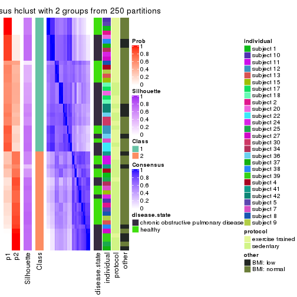</p>

</div>
<div id='tab-MAD-hclust-consensus-heatmap-2'>
<pre><code class="r">consensus_heatmap(res, k = 3)
</code></pre>

<p>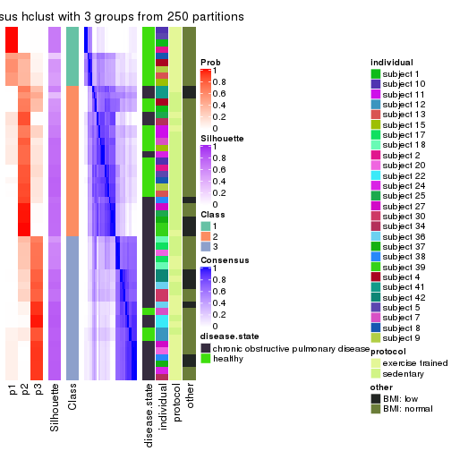</p>

</div>
<div id='tab-MAD-hclust-consensus-heatmap-3'>
<pre><code class="r">consensus_heatmap(res, k = 4)
</code></pre>

<p>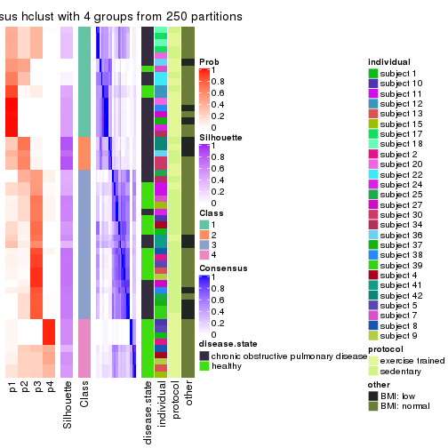</p>

</div>
<div id='tab-MAD-hclust-consensus-heatmap-4'>
<pre><code class="r">consensus_heatmap(res, k = 5)
</code></pre>

<p>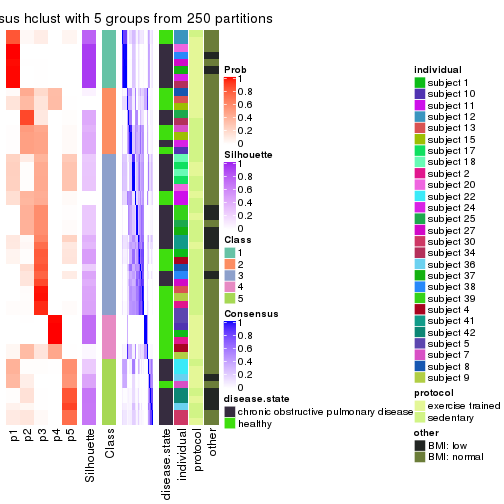</p>

</div>
<div id='tab-MAD-hclust-consensus-heatmap-5'>
<pre><code class="r">consensus_heatmap(res, k = 6)
</code></pre>

<p>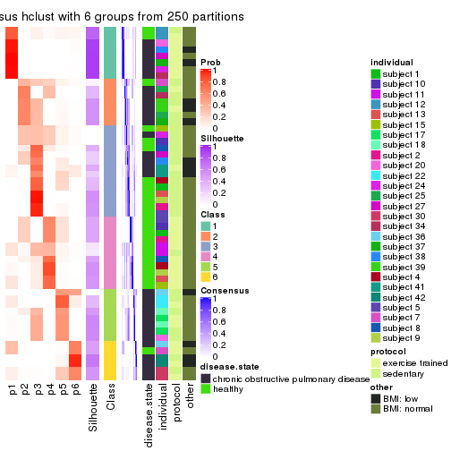</p>

</div>
</div>

Heatmaps for the membership of samples in all partitions to see how consistent they are:


<script>
$( function() {
	$( '#tabs-MAD-hclust-membership-heatmap' ).tabs();
} );
</script>
<div id='tabs-MAD-hclust-membership-heatmap'>
<ul>
<li><a href='#tab-MAD-hclust-membership-heatmap-1'>k = 2</a></li>
<li><a href='#tab-MAD-hclust-membership-heatmap-2'>k = 3</a></li>
<li><a href='#tab-MAD-hclust-membership-heatmap-3'>k = 4</a></li>
<li><a href='#tab-MAD-hclust-membership-heatmap-4'>k = 5</a></li>
<li><a href='#tab-MAD-hclust-membership-heatmap-5'>k = 6</a></li>
</ul>
<div id='tab-MAD-hclust-membership-heatmap-1'>
<pre><code class="r">membership_heatmap(res, k = 2)
</code></pre>

<p>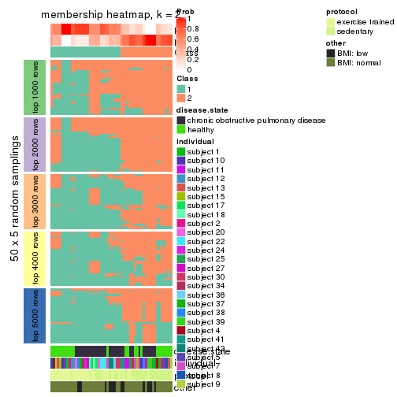</p>

</div>
<div id='tab-MAD-hclust-membership-heatmap-2'>
<pre><code class="r">membership_heatmap(res, k = 3)
</code></pre>

<p>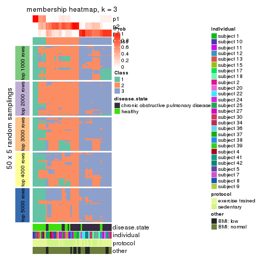</p>

</div>
<div id='tab-MAD-hclust-membership-heatmap-3'>
<pre><code class="r">membership_heatmap(res, k = 4)
</code></pre>

<p>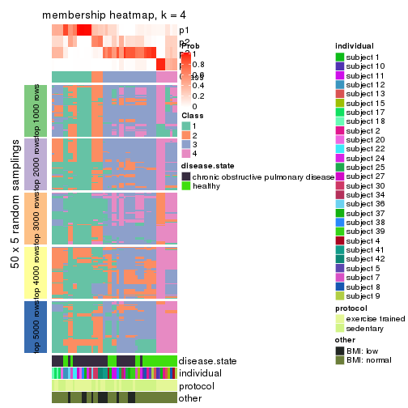</p>

</div>
<div id='tab-MAD-hclust-membership-heatmap-4'>
<pre><code class="r">membership_heatmap(res, k = 5)
</code></pre>

<p>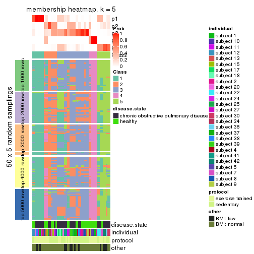</p>

</div>
<div id='tab-MAD-hclust-membership-heatmap-5'>
<pre><code class="r">membership_heatmap(res, k = 6)
</code></pre>

<p>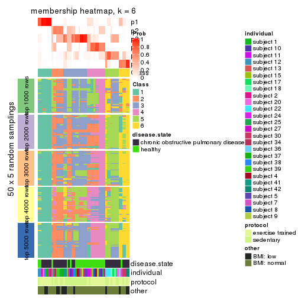</p>

</div>
</div>

As soon as we have had the classes for columns, we can look for signatures
which are significantly different between classes which can be candidate marks
for certain classes. Following are the heatmaps for signatures.


Signature heatmaps where rows are scaled:


<script>
$( function() {
	$( '#tabs-MAD-hclust-get-signatures' ).tabs();
} );
</script>
<div id='tabs-MAD-hclust-get-signatures'>
<ul>
<li><a href='#tab-MAD-hclust-get-signatures-1'>k = 2</a></li>
<li><a href='#tab-MAD-hclust-get-signatures-2'>k = 3</a></li>
<li><a href='#tab-MAD-hclust-get-signatures-3'>k = 4</a></li>
<li><a href='#tab-MAD-hclust-get-signatures-4'>k = 5</a></li>
<li><a href='#tab-MAD-hclust-get-signatures-5'>k = 6</a></li>
</ul>
<div id='tab-MAD-hclust-get-signatures-1'>
<pre><code class="r">get_signatures(res, k = 2)
</code></pre>

<p>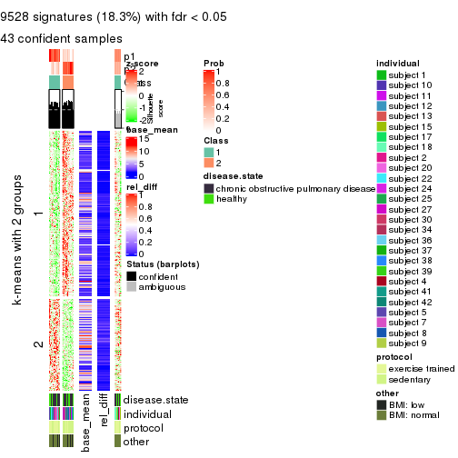</p>

</div>
<div id='tab-MAD-hclust-get-signatures-2'>
<pre><code class="r">get_signatures(res, k = 3)
</code></pre>

<p>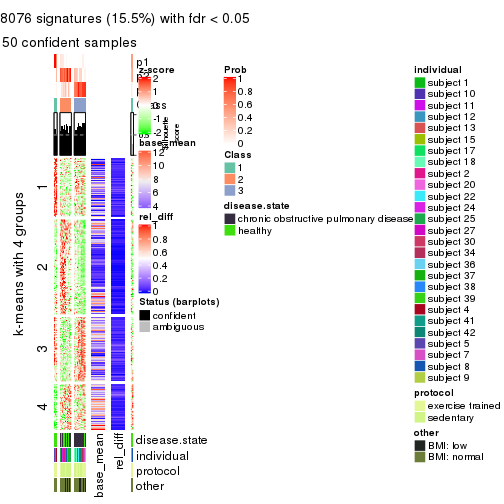</p>

</div>
<div id='tab-MAD-hclust-get-signatures-3'>
<pre><code class="r">get_signatures(res, k = 4)
</code></pre>

<p>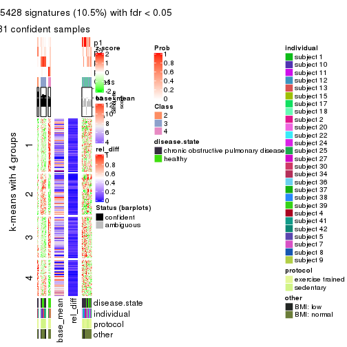</p>

</div>
<div id='tab-MAD-hclust-get-signatures-4'>
<pre><code class="r">get_signatures(res, k = 5)
</code></pre>

<p>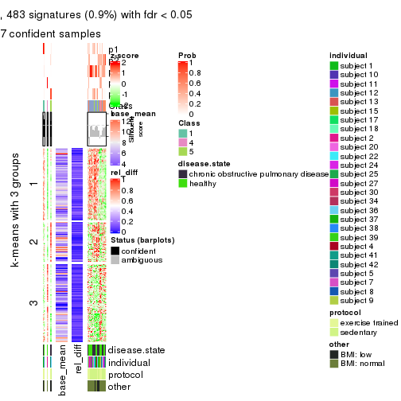</p>

</div>
<div id='tab-MAD-hclust-get-signatures-5'>
<pre><code class="r">get_signatures(res, k = 6)
</code></pre>

<pre><code>#&gt; Error in mat[ceiling(1:nr/h_ratio), ceiling(1:nc/w_ratio), drop = FALSE]: subscript out of bounds
</code></pre>

<p></p>

</div>
</div>


Signature heatmaps where rows are not scaled:


<script>
$( function() {
	$( '#tabs-MAD-hclust-get-signatures-no-scale' ).tabs();
} );
</script>
<div id='tabs-MAD-hclust-get-signatures-no-scale'>
<ul>
<li><a href='#tab-MAD-hclust-get-signatures-no-scale-1'>k = 2</a></li>
<li><a href='#tab-MAD-hclust-get-signatures-no-scale-2'>k = 3</a></li>
<li><a href='#tab-MAD-hclust-get-signatures-no-scale-3'>k = 4</a></li>
<li><a href='#tab-MAD-hclust-get-signatures-no-scale-4'>k = 5</a></li>
<li><a href='#tab-MAD-hclust-get-signatures-no-scale-5'>k = 6</a></li>
</ul>
<div id='tab-MAD-hclust-get-signatures-no-scale-1'>
<pre><code class="r">get_signatures(res, k = 2, scale_rows = FALSE)
</code></pre>

<p>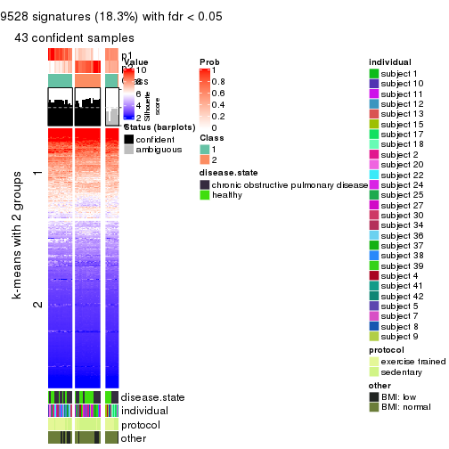</p>

</div>
<div id='tab-MAD-hclust-get-signatures-no-scale-2'>
<pre><code class="r">get_signatures(res, k = 3, scale_rows = FALSE)
</code></pre>

<p>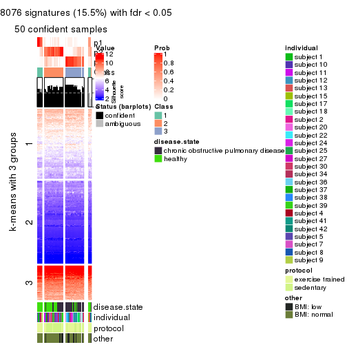</p>

</div>
<div id='tab-MAD-hclust-get-signatures-no-scale-3'>
<pre><code class="r">get_signatures(res, k = 4, scale_rows = FALSE)
</code></pre>

<p>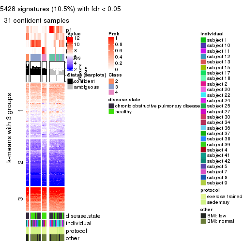</p>

</div>
<div id='tab-MAD-hclust-get-signatures-no-scale-4'>
<pre><code class="r">get_signatures(res, k = 5, scale_rows = FALSE)
</code></pre>

<p>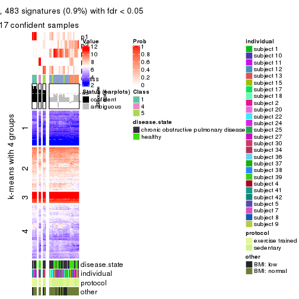</p>

</div>
<div id='tab-MAD-hclust-get-signatures-no-scale-5'>
<pre><code class="r">get_signatures(res, k = 6, scale_rows = FALSE)
</code></pre>

<p>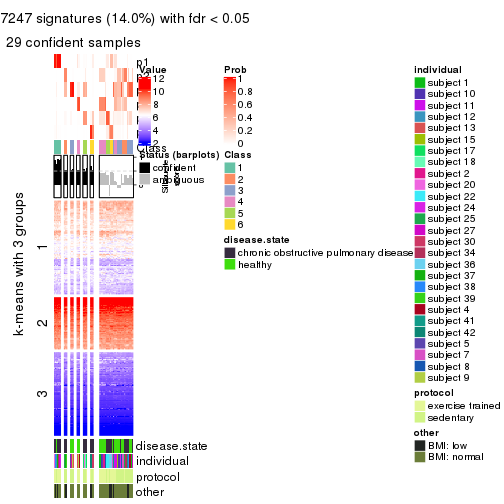</p>

</div>
</div>


Compare the overlap of signatures from different k:

```r
compare_signatures(res)
```

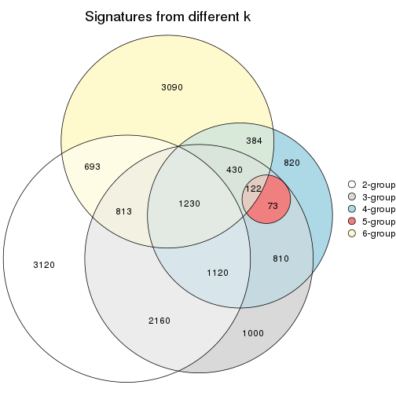

`get_signature()` returns a data frame invisibly. TO get the list of signatures, the function
call should be assigned to a variable explicitly. In following code, if `plot` argument is set
to `FALSE`, no heatmap is plotted while only the differential analysis is performed.

```r
# code only for demonstration
tb = get_signature(res, k = ..., plot = FALSE)
```

An example of the output of `tb` is:

```
#>   which_row         fdr    mean_1    mean_2 scaled_mean_1 scaled_mean_2 km
#> 1        38 0.042760348  8.373488  9.131774    -0.5533452     0.5164555  1
#> 2        40 0.018707592  7.106213  8.469186    -0.6173731     0.5762149  1
#> 3        55 0.019134737 10.221463 11.207825    -0.6159697     0.5749050  1
#> 4        59 0.006059896  5.921854  7.869574    -0.6899429     0.6439467  1
#> 5        60 0.018055526  8.928898 10.211722    -0.6204761     0.5791110  1
#> 6        98 0.009384629 15.714769 14.887706     0.6635654    -0.6193277  2
...
```

The columns in `tb` are:

1. `which_row`: row indices corresponding to the input matrix.
2. `fdr`: FDR for the differential test. 
3. `mean_x`: The mean value in group x.
4. `scaled_mean_x`: The mean value in group x after rows are scaled.
5. `km`: Row groups if k-means clustering is applied to rows.


UMAP plot which shows how samples are separated.


<script>
$( function() {
	$( '#tabs-MAD-hclust-dimension-reduction' ).tabs();
} );
</script>
<div id='tabs-MAD-hclust-dimension-reduction'>
<ul>
<li><a href='#tab-MAD-hclust-dimension-reduction-1'>k = 2</a></li>
<li><a href='#tab-MAD-hclust-dimension-reduction-2'>k = 3</a></li>
<li><a href='#tab-MAD-hclust-dimension-reduction-3'>k = 4</a></li>
<li><a href='#tab-MAD-hclust-dimension-reduction-4'>k = 5</a></li>
<li><a href='#tab-MAD-hclust-dimension-reduction-5'>k = 6</a></li>
</ul>
<div id='tab-MAD-hclust-dimension-reduction-1'>
<pre><code class="r">dimension_reduction(res, k = 2, method = &quot;UMAP&quot;)
</code></pre>

<p>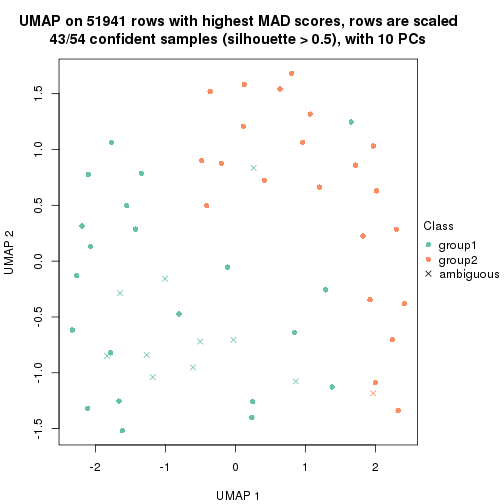</p>

</div>
<div id='tab-MAD-hclust-dimension-reduction-2'>
<pre><code class="r">dimension_reduction(res, k = 3, method = &quot;UMAP&quot;)
</code></pre>

<p>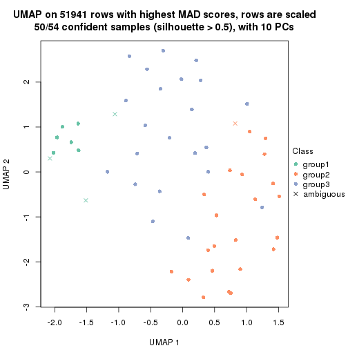</p>

</div>
<div id='tab-MAD-hclust-dimension-reduction-3'>
<pre><code class="r">dimension_reduction(res, k = 4, method = &quot;UMAP&quot;)
</code></pre>

<p>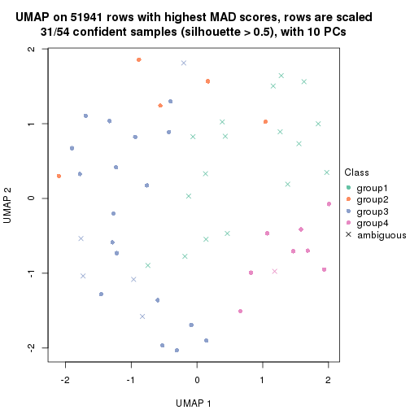</p>

</div>
<div id='tab-MAD-hclust-dimension-reduction-4'>
<pre><code class="r">dimension_reduction(res, k = 5, method = &quot;UMAP&quot;)
</code></pre>

<p>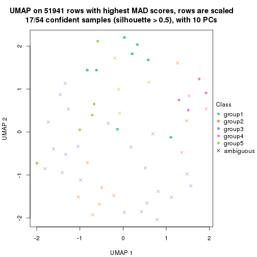</p>

</div>
<div id='tab-MAD-hclust-dimension-reduction-5'>
<pre><code class="r">dimension_reduction(res, k = 6, method = &quot;UMAP&quot;)
</code></pre>

<p>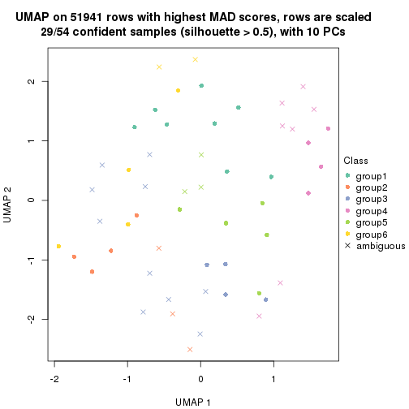</p>

</div>
</div>


Following heatmap shows how subgroups are split when increasing `k`:

```r
collect_classes(res)
```

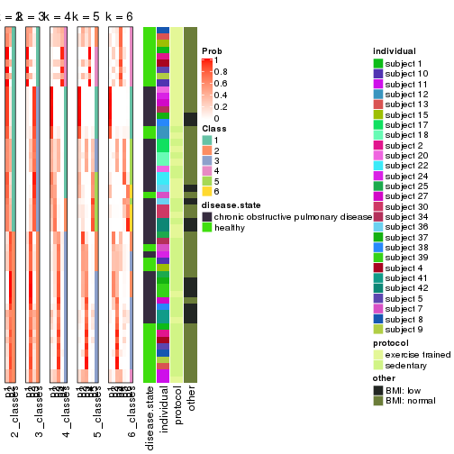


Test correlation between subgroups and known annotations. If the known
annotation is numeric, one-way ANOVA test is applied, and if the known
annotation is discrete, chi-squared contingency table test is applied.

```r
test_to_known_factors(res)
```

```
#>             n disease.state(p) individual(p) protocol(p) other(p) k
#> MAD:hclust 43         0.274425         0.520    4.54e-04   0.9287 2
#> MAD:hclust 50         0.000206         0.378    2.62e-04   0.3578 3
#> MAD:hclust 31         0.001706         0.398    9.86e-05   0.0531 4
#> MAD:hclust 17         0.005429         0.135    6.50e-02   0.1357 5
#> MAD:hclust 29         0.000447         0.018    1.89e-02   0.0466 6
```


If matrix rows can be associated to genes, consider to use `functional_enrichment(res,
...)` to perform function enrichment for the signature genes. See [this vignette](http://bioconductor.org/packages/devel/bioc/vignettes/cola/inst/doc/functional_enrichment.html) for more detailed explanations.


 

---------------------------------------------------


### MAD:kmeans**


The object with results only for a single top-value method and a single partition method 
can be extracted as:

```r
res = res_list["MAD", "kmeans"]
# you can also extract it by
# res = res_list["MAD:kmeans"]
```

A summary of `res` and all the functions that can be applied to it:

```r
res
```

```
#> A 'ConsensusPartition' object with k = 2, 3, 4, 5, 6.
#>   On a matrix with 51941 rows and 54 columns.
#>   Top rows (1000, 2000, 3000, 4000, 5000) are extracted by 'MAD' method.
#>   Subgroups are detected by 'kmeans' method.
#>   Performed in total 1250 partitions by row resampling.
#>   Best k for subgroups seems to be 2.
#> 
#> Following methods can be applied to this 'ConsensusPartition' object:
#>  [1] "cola_report"             "collect_classes"         "collect_plots"          
#>  [4] "collect_stats"           "colnames"                "compare_signatures"     
#>  [7] "consensus_heatmap"       "dimension_reduction"     "functional_enrichment"  
#> [10] "get_anno_col"            "get_anno"                "get_classes"            
#> [13] "get_consensus"           "get_matrix"              "get_membership"         
#> [16] "get_param"               "get_signatures"          "get_stats"              
#> [19] "is_best_k"               "is_stable_k"             "membership_heatmap"     
#> [22] "ncol"                    "nrow"                    "plot_ecdf"              
#> [25] "rownames"                "select_partition_number" "show"                   
#> [28] "suggest_best_k"          "test_to_known_factors"
```

`collect_plots()` function collects all the plots made from `res` for all `k` (number of partitions)
into one single page to provide an easy and fast comparison between different `k`.

```r
collect_plots(res)
```

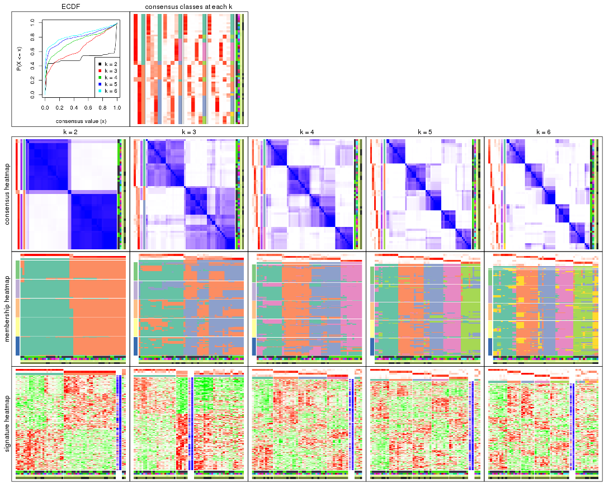

The plots are:

- The first row: a plot of the ECDF (empirical cumulative distribution
  function) curves of the consensus matrix for each `k` and the heatmap of
  predicted classes for each `k`.
- The second row: heatmaps of the consensus matrix for each `k`.
- The third row: heatmaps of the membership matrix for each `k`.
- The fouth row: heatmaps of the signatures for each `k`.

All the plots in panels can be made by individual functions and they are
plotted later in this section.

`select_partition_number()` produces several plots showing different
statistics for choosing "optimized" `k`. There are following statistics:

- ECDF curves of the consensus matrix for each `k`;
- 1-PAC. [The PAC
  score](https://en.wikipedia.org/wiki/Consensus_clustering#Over-interpretation_potential_of_consensus_clustering)
  measures the proportion of the ambiguous subgrouping.
- Mean silhouette score.
- Concordance. The mean probability of fiting the consensus class ids in all
  partitions.
- Area increased. Denote $A_k$ as the area under the ECDF curve for current
  `k`, the area increased is defined as $A_k - A_{k-1}$.
- Rand index. The percent of pairs of samples that are both in a same cluster
  or both are not in a same cluster in the partition of k and k-1.
- Jaccard index. The ratio of pairs of samples are both in a same cluster in
  the partition of k and k-1 and the pairs of samples are both in a same
  cluster in the partition k or k-1.

The detailed explanations of these statistics can be found in [the _cola_
vignette](http://bioconductor.org/packages/devel/bioc/vignettes/cola/inst/doc/cola.html#toc_13).

Generally speaking, lower PAC score, higher mean silhouette score or higher
concordance corresponds to better partition. Rand index and Jaccard index
measure how similar the current partition is compared to partition with `k-1`.
If they are too similar, we won't accept `k` is better than `k-1`.

```r
select_partition_number(res)
```

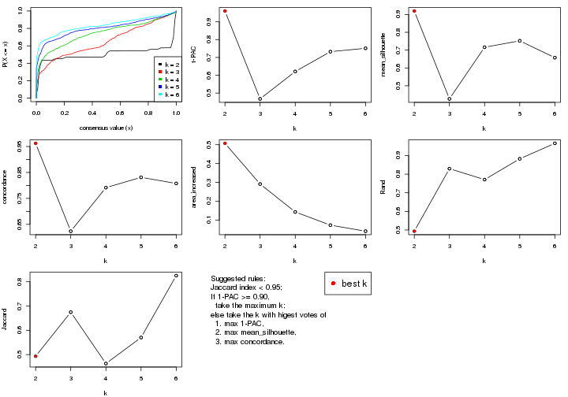

The numeric values for all these statistics can be obtained by `get_stats()`.

```r
get_stats(res)
```

```
#>   k 1-PAC mean_silhouette concordance area_increased  Rand Jaccard
#> 2 2 0.961           0.919       0.962         0.5072 0.493   0.493
#> 3 3 0.467           0.426       0.624         0.2911 0.829   0.675
#> 4 4 0.621           0.716       0.792         0.1429 0.771   0.463
#> 5 5 0.733           0.752       0.831         0.0729 0.883   0.570
#> 6 6 0.751           0.658       0.808         0.0408 0.966   0.825
```

`suggest_best_k()` suggests the best $k$ based on these statistics. The rules are as follows:

- All $k$ with Jaccard index larger than 0.95 are removed because increasing
  $k$ does not provide enough extra information. If all $k$ are removed, it is
  marked as no subgroup is detected.
- For all $k$ with 1-PAC score larger than 0.9, the maximal $k$ is taken as
  the best $k$, and other $k$ are marked as optional $k$.
- If it does not fit the second rule. The $k$ with the maximal vote of the
  highest 1-PAC score, highest mean silhouette, and highest concordance is
  taken as the best $k$.

```r
suggest_best_k(res)
```

```
#> [1] 2
```


Following shows the table of the partitions (You need to click the **show/hide
code output** link to see it). The membership matrix (columns with name `p*`)
is inferred by
[`clue::cl_consensus()`](https://www.rdocumentation.org/link/cl_consensus?package=clue)
function with the `SE` method. Basically the value in the membership matrix
represents the probability to belong to a certain group. The finall class
label for an item is determined with the group with highest probability it
belongs to.

In `get_classes()` function, the entropy is calculated from the membership
matrix and the silhouette score is calculated from the consensus matrix.


<script>
$( function() {
	$( '#tabs-MAD-kmeans-get-classes' ).tabs();
} );
</script>
<div id='tabs-MAD-kmeans-get-classes'>
<ul>
<li><a href='#tab-MAD-kmeans-get-classes-1'>k = 2</a></li>
<li><a href='#tab-MAD-kmeans-get-classes-2'>k = 3</a></li>
<li><a href='#tab-MAD-kmeans-get-classes-3'>k = 4</a></li>
<li><a href='#tab-MAD-kmeans-get-classes-4'>k = 5</a></li>
<li><a href='#tab-MAD-kmeans-get-classes-5'>k = 6</a></li>
</ul>

<div id='tab-MAD-kmeans-get-classes-1'>
<p><a id='tab-MAD-kmeans-get-classes-1-a' style='color:#0366d6' href='#'>show/hide code output</a></p>
<pre><code class="r">cbind(get_classes(res, k = 2), get_membership(res, k = 2))
</code></pre>

<pre><code>#&gt;           class entropy silhouette    p1    p2
#&gt; GSM680053     2  0.0376     0.9508 0.004 0.996
#&gt; GSM680062     1  0.5408     0.8670 0.876 0.124
#&gt; GSM680054     2  0.0376     0.9508 0.004 0.996
#&gt; GSM680063     1  0.7376     0.7566 0.792 0.208
#&gt; GSM680055     2  0.0376     0.9508 0.004 0.996
#&gt; GSM680064     1  0.1633     0.9736 0.976 0.024
#&gt; GSM680056     1  0.1843     0.9729 0.972 0.028
#&gt; GSM680065     1  0.1843     0.9729 0.972 0.028
#&gt; GSM680057     2  0.1633     0.9491 0.024 0.976
#&gt; GSM680066     1  0.1184     0.9753 0.984 0.016
#&gt; GSM680058     2  0.0938     0.9507 0.012 0.988
#&gt; GSM680067     2  0.1843     0.9479 0.028 0.972
#&gt; GSM680059     2  0.0938     0.9512 0.012 0.988
#&gt; GSM680068     1  0.1184     0.9753 0.984 0.016
#&gt; GSM680060     2  0.0938     0.9507 0.012 0.988
#&gt; GSM680069     2  0.9998    -0.0145 0.492 0.508
#&gt; GSM680061     2  0.1843     0.9479 0.028 0.972
#&gt; GSM680070     1  0.1414     0.9747 0.980 0.020
#&gt; GSM680071     2  1.0000    -0.0159 0.496 0.504
#&gt; GSM680077     1  0.1633     0.9736 0.976 0.024
#&gt; GSM680072     2  0.0376     0.9508 0.004 0.996
#&gt; GSM680078     1  0.1843     0.9729 0.972 0.028
#&gt; GSM680073     2  0.0376     0.9508 0.004 0.996
#&gt; GSM680079     1  0.1843     0.9729 0.972 0.028
#&gt; GSM680074     2  0.0938     0.9507 0.012 0.988
#&gt; GSM680080     2  0.0672     0.9506 0.008 0.992
#&gt; GSM680075     2  0.0376     0.9508 0.004 0.996
#&gt; GSM680081     2  0.0672     0.9509 0.008 0.992
#&gt; GSM680076     2  0.0672     0.9506 0.008 0.992
#&gt; GSM680082     1  0.1633     0.9736 0.976 0.024
#&gt; GSM680029     2  0.0376     0.9508 0.004 0.996
#&gt; GSM680041     1  0.0672     0.9745 0.992 0.008
#&gt; GSM680035     2  0.1414     0.9504 0.020 0.980
#&gt; GSM680047     1  0.0672     0.9745 0.992 0.008
#&gt; GSM680036     2  0.0376     0.9508 0.004 0.996
#&gt; GSM680048     1  0.0000     0.9748 1.000 0.000
#&gt; GSM680037     2  0.1414     0.9504 0.020 0.980
#&gt; GSM680049     1  0.0376     0.9737 0.996 0.004
#&gt; GSM680038     2  0.1414     0.9505 0.020 0.980
#&gt; GSM680050     1  0.1414     0.9745 0.980 0.020
#&gt; GSM680039     2  0.1843     0.9479 0.028 0.972
#&gt; GSM680051     1  0.0000     0.9748 1.000 0.000
#&gt; GSM680040     2  0.1414     0.9504 0.020 0.980
#&gt; GSM680052     1  0.0000     0.9748 1.000 0.000
#&gt; GSM680030     2  0.1633     0.9491 0.024 0.976
#&gt; GSM680042     1  0.0672     0.9745 0.992 0.008
#&gt; GSM680031     2  0.1414     0.9504 0.020 0.980
#&gt; GSM680043     1  0.0376     0.9737 0.996 0.004
#&gt; GSM680032     1  0.1843     0.9729 0.972 0.028
#&gt; GSM680044     1  0.0376     0.9754 0.996 0.004
#&gt; GSM680033     2  0.1843     0.9499 0.028 0.972
#&gt; GSM680045     1  0.0376     0.9737 0.996 0.004
#&gt; GSM680034     2  0.1843     0.9479 0.028 0.972
#&gt; GSM680046     1  0.0376     0.9737 0.996 0.004
</code></pre>

<script>
$('#tab-MAD-kmeans-get-classes-1-a').parent().next().next().hide();
$('#tab-MAD-kmeans-get-classes-1-a').click(function(){
  $('#tab-MAD-kmeans-get-classes-1-a').parent().next().next().toggle();
  return(false);
});
</script>
</div>

<div id='tab-MAD-kmeans-get-classes-2'>
<p><a id='tab-MAD-kmeans-get-classes-2-a' style='color:#0366d6' href='#'>show/hide code output</a></p>
<pre><code class="r">cbind(get_classes(res, k = 3), get_membership(res, k = 3))
</code></pre>

<pre><code>#&gt;           class entropy silhouette    p1    p2    p3
#&gt; GSM680053     3  0.6940     0.3940 0.068 0.224 0.708
#&gt; GSM680062     3  0.8784     0.2859 0.124 0.352 0.524
#&gt; GSM680054     3  0.5431     0.2552 0.000 0.284 0.716
#&gt; GSM680063     3  0.8784     0.2859 0.124 0.352 0.524
#&gt; GSM680055     3  0.7339     0.3850 0.088 0.224 0.688
#&gt; GSM680064     1  0.4233     0.7648 0.836 0.160 0.004
#&gt; GSM680056     1  0.9776     0.1622 0.440 0.284 0.276
#&gt; GSM680065     1  0.5681     0.7054 0.748 0.236 0.016
#&gt; GSM680057     3  0.6225    -0.5823 0.000 0.432 0.568
#&gt; GSM680066     1  0.2550     0.7839 0.932 0.012 0.056
#&gt; GSM680058     2  0.6521     0.5724 0.004 0.500 0.496
#&gt; GSM680067     2  0.6260     0.6215 0.000 0.552 0.448
#&gt; GSM680059     3  0.4291     0.2572 0.008 0.152 0.840
#&gt; GSM680068     1  0.2050     0.7934 0.952 0.028 0.020
#&gt; GSM680060     2  0.6521     0.5724 0.004 0.500 0.496
#&gt; GSM680069     3  0.9429     0.2638 0.264 0.232 0.504
#&gt; GSM680061     2  0.6274     0.6227 0.000 0.544 0.456
#&gt; GSM680070     1  0.0829     0.7890 0.984 0.004 0.012
#&gt; GSM680071     2  0.7381     0.0901 0.244 0.676 0.080
#&gt; GSM680077     1  0.1337     0.7868 0.972 0.016 0.012
#&gt; GSM680072     3  0.6513    -0.5698 0.004 0.476 0.520
#&gt; GSM680078     1  0.2446     0.7809 0.936 0.012 0.052
#&gt; GSM680073     3  0.4883     0.2680 0.004 0.208 0.788
#&gt; GSM680079     1  0.0983     0.7889 0.980 0.004 0.016
#&gt; GSM680074     3  0.6521    -0.6421 0.004 0.492 0.504
#&gt; GSM680080     3  0.6521    -0.6421 0.004 0.492 0.504
#&gt; GSM680075     3  0.4768     0.4407 0.052 0.100 0.848
#&gt; GSM680081     3  0.4409     0.3962 0.172 0.004 0.824
#&gt; GSM680076     2  0.6825     0.5754 0.012 0.496 0.492
#&gt; GSM680082     1  0.1015     0.7890 0.980 0.008 0.012
#&gt; GSM680029     3  0.1585     0.4634 0.028 0.008 0.964
#&gt; GSM680041     1  0.6260     0.7499 0.552 0.448 0.000
#&gt; GSM680035     3  0.0661     0.4576 0.008 0.004 0.988
#&gt; GSM680047     1  0.7722     0.7447 0.520 0.432 0.048
#&gt; GSM680036     3  0.4485     0.4439 0.020 0.136 0.844
#&gt; GSM680048     1  0.7517     0.7673 0.588 0.364 0.048
#&gt; GSM680037     3  0.0661     0.4576 0.008 0.004 0.988
#&gt; GSM680049     1  0.5760     0.7845 0.672 0.328 0.000
#&gt; GSM680038     3  0.6295    -0.6141 0.000 0.472 0.528
#&gt; GSM680050     1  0.4121     0.7819 0.832 0.168 0.000
#&gt; GSM680039     3  0.6398    -0.5616 0.004 0.416 0.580
#&gt; GSM680051     1  0.7676     0.7654 0.584 0.360 0.056
#&gt; GSM680040     3  0.0661     0.4576 0.008 0.004 0.988
#&gt; GSM680052     1  0.7676     0.7654 0.584 0.360 0.056
#&gt; GSM680030     3  0.6225    -0.5823 0.000 0.432 0.568
#&gt; GSM680042     1  0.6192     0.7621 0.580 0.420 0.000
#&gt; GSM680031     3  0.0661     0.4576 0.008 0.004 0.988
#&gt; GSM680043     1  0.7180     0.7689 0.672 0.268 0.060
#&gt; GSM680032     1  0.1015     0.7881 0.980 0.008 0.012
#&gt; GSM680044     1  0.6542     0.7870 0.736 0.204 0.060
#&gt; GSM680033     3  0.0848     0.4541 0.008 0.008 0.984
#&gt; GSM680045     1  0.7246     0.7692 0.664 0.276 0.060
#&gt; GSM680034     2  0.6676     0.5872 0.008 0.516 0.476
#&gt; GSM680046     1  0.6062     0.7799 0.708 0.276 0.016
</code></pre>

<script>
$('#tab-MAD-kmeans-get-classes-2-a').parent().next().next().hide();
$('#tab-MAD-kmeans-get-classes-2-a').click(function(){
  $('#tab-MAD-kmeans-get-classes-2-a').parent().next().next().toggle();
  return(false);
});
</script>
</div>

<div id='tab-MAD-kmeans-get-classes-3'>
<p><a id='tab-MAD-kmeans-get-classes-3-a' style='color:#0366d6' href='#'>show/hide code output</a></p>
<pre><code class="r">cbind(get_classes(res, k = 4), get_membership(res, k = 4))
</code></pre>

<pre><code>#&gt;           class entropy silhouette    p1    p2    p3    p4
#&gt; GSM680053     3  0.5466     0.6400 0.220 0.068 0.712 0.000
#&gt; GSM680062     3  0.6392     0.6083 0.232 0.052 0.676 0.040
#&gt; GSM680054     3  0.7332     0.2121 0.164 0.356 0.480 0.000
#&gt; GSM680063     3  0.6317     0.6116 0.232 0.048 0.680 0.040
#&gt; GSM680055     3  0.5565     0.6327 0.232 0.068 0.700 0.000
#&gt; GSM680064     1  0.5038     0.6573 0.684 0.000 0.020 0.296
#&gt; GSM680056     1  0.6367     0.4174 0.692 0.032 0.200 0.076
#&gt; GSM680065     1  0.5113     0.5036 0.760 0.000 0.152 0.088
#&gt; GSM680057     2  0.3402     0.8214 0.000 0.832 0.164 0.004
#&gt; GSM680066     1  0.5185     0.7564 0.728 0.032 0.008 0.232
#&gt; GSM680058     2  0.1356     0.8424 0.008 0.960 0.032 0.000
#&gt; GSM680067     2  0.3353     0.8191 0.004 0.880 0.060 0.056
#&gt; GSM680059     3  0.4804     0.6174 0.016 0.276 0.708 0.000
#&gt; GSM680068     1  0.5126     0.7550 0.728 0.028 0.008 0.236
#&gt; GSM680060     2  0.0657     0.8413 0.004 0.984 0.012 0.000
#&gt; GSM680069     1  0.6461    -0.0158 0.564 0.068 0.364 0.004
#&gt; GSM680061     2  0.3241     0.8255 0.004 0.884 0.072 0.040
#&gt; GSM680070     1  0.4895     0.7628 0.740 0.020 0.008 0.232
#&gt; GSM680071     2  0.7912     0.3132 0.296 0.520 0.152 0.032
#&gt; GSM680077     1  0.4192     0.7607 0.780 0.008 0.004 0.208
#&gt; GSM680072     2  0.3803     0.7268 0.032 0.836 0.132 0.000
#&gt; GSM680078     1  0.4514     0.7662 0.756 0.008 0.008 0.228
#&gt; GSM680073     3  0.5548     0.5967 0.032 0.340 0.628 0.000
#&gt; GSM680079     1  0.4088     0.7639 0.764 0.000 0.004 0.232
#&gt; GSM680074     2  0.1798     0.8423 0.016 0.944 0.040 0.000
#&gt; GSM680080     2  0.1798     0.8423 0.016 0.944 0.040 0.000
#&gt; GSM680075     3  0.5170     0.6949 0.048 0.228 0.724 0.000
#&gt; GSM680081     3  0.4162     0.6979 0.088 0.052 0.844 0.016
#&gt; GSM680076     2  0.1151     0.8352 0.024 0.968 0.008 0.000
#&gt; GSM680082     1  0.4788     0.7640 0.744 0.016 0.008 0.232
#&gt; GSM680029     3  0.3680     0.7302 0.012 0.120 0.852 0.016
#&gt; GSM680041     4  0.3342     0.7684 0.100 0.000 0.032 0.868
#&gt; GSM680035     3  0.3575     0.7279 0.004 0.124 0.852 0.020
#&gt; GSM680047     4  0.1545     0.8592 0.040 0.000 0.008 0.952
#&gt; GSM680036     3  0.5361     0.6702 0.148 0.108 0.744 0.000
#&gt; GSM680048     4  0.0376     0.8861 0.004 0.004 0.000 0.992
#&gt; GSM680037     3  0.3519     0.7291 0.004 0.120 0.856 0.020
#&gt; GSM680049     4  0.0817     0.8813 0.024 0.000 0.000 0.976
#&gt; GSM680038     2  0.2773     0.8347 0.000 0.880 0.116 0.004
#&gt; GSM680050     1  0.5339     0.6303 0.624 0.000 0.020 0.356
#&gt; GSM680039     2  0.4372     0.7208 0.000 0.728 0.268 0.004
#&gt; GSM680051     4  0.0376     0.8839 0.000 0.004 0.004 0.992
#&gt; GSM680040     3  0.3575     0.7279 0.004 0.124 0.852 0.020
#&gt; GSM680052     4  0.0564     0.8856 0.004 0.004 0.004 0.988
#&gt; GSM680030     2  0.3355     0.8237 0.000 0.836 0.160 0.004
#&gt; GSM680042     4  0.2222     0.8543 0.060 0.000 0.016 0.924
#&gt; GSM680031     3  0.3575     0.7279 0.004 0.124 0.852 0.020
#&gt; GSM680043     4  0.4374     0.7427 0.168 0.024 0.008 0.800
#&gt; GSM680032     1  0.4879     0.7651 0.744 0.016 0.012 0.228
#&gt; GSM680044     4  0.4709     0.6922 0.200 0.024 0.008 0.768
#&gt; GSM680033     3  0.3575     0.7279 0.004 0.124 0.852 0.020
#&gt; GSM680045     4  0.3341     0.8313 0.084 0.024 0.012 0.880
#&gt; GSM680034     2  0.4565     0.7918 0.000 0.796 0.140 0.064
#&gt; GSM680046     4  0.2125     0.8714 0.052 0.012 0.004 0.932
</code></pre>

<script>
$('#tab-MAD-kmeans-get-classes-3-a').parent().next().next().hide();
$('#tab-MAD-kmeans-get-classes-3-a').click(function(){
  $('#tab-MAD-kmeans-get-classes-3-a').parent().next().next().toggle();
  return(false);
});
</script>
</div>

<div id='tab-MAD-kmeans-get-classes-4'>
<p><a id='tab-MAD-kmeans-get-classes-4-a' style='color:#0366d6' href='#'>show/hide code output</a></p>
<pre><code class="r">cbind(get_classes(res, k = 5), get_membership(res, k = 5))
</code></pre>

<pre><code>#&gt;           class entropy silhouette    p1    p2    p3    p4    p5
#&gt; GSM680053     5  0.3949      0.706 0.000 0.004 0.300 0.000 0.696
#&gt; GSM680062     5  0.4395      0.731 0.012 0.000 0.272 0.012 0.704
#&gt; GSM680054     5  0.5590      0.663 0.000 0.156 0.204 0.000 0.640
#&gt; GSM680063     5  0.4395      0.731 0.012 0.000 0.272 0.012 0.704
#&gt; GSM680055     5  0.3511      0.756 0.012 0.004 0.184 0.000 0.800
#&gt; GSM680064     1  0.4599      0.739 0.768 0.004 0.012 0.064 0.152
#&gt; GSM680056     5  0.3497      0.706 0.140 0.000 0.012 0.020 0.828
#&gt; GSM680065     5  0.3516      0.675 0.164 0.004 0.000 0.020 0.812
#&gt; GSM680057     2  0.3554      0.757 0.000 0.776 0.216 0.004 0.004
#&gt; GSM680066     1  0.1412      0.830 0.952 0.004 0.000 0.008 0.036
#&gt; GSM680058     2  0.2980      0.798 0.000 0.884 0.024 0.036 0.056
#&gt; GSM680067     2  0.1757      0.799 0.000 0.936 0.048 0.012 0.004
#&gt; GSM680059     3  0.5617      0.669 0.000 0.180 0.696 0.052 0.072
#&gt; GSM680068     1  0.1412      0.830 0.952 0.004 0.000 0.008 0.036
#&gt; GSM680060     2  0.1725      0.805 0.000 0.936 0.020 0.000 0.044
#&gt; GSM680069     5  0.3222      0.736 0.108 0.004 0.036 0.000 0.852
#&gt; GSM680061     2  0.1764      0.802 0.000 0.928 0.064 0.008 0.000
#&gt; GSM680070     1  0.0867      0.841 0.976 0.008 0.000 0.008 0.008
#&gt; GSM680071     5  0.4505      0.551 0.020 0.244 0.000 0.016 0.720
#&gt; GSM680077     1  0.1924      0.832 0.924 0.004 0.008 0.000 0.064
#&gt; GSM680072     2  0.5007      0.723 0.004 0.748 0.036 0.052 0.160
#&gt; GSM680078     1  0.0703      0.845 0.976 0.000 0.000 0.000 0.024
#&gt; GSM680073     3  0.6906      0.554 0.004 0.228 0.572 0.052 0.144
#&gt; GSM680079     1  0.1616      0.845 0.948 0.004 0.008 0.008 0.032
#&gt; GSM680074     2  0.3908      0.783 0.004 0.832 0.028 0.040 0.096
#&gt; GSM680080     2  0.3908      0.783 0.004 0.832 0.028 0.040 0.096
#&gt; GSM680075     3  0.6564      0.534 0.000 0.128 0.600 0.052 0.220
#&gt; GSM680081     3  0.1408      0.806 0.044 0.000 0.948 0.000 0.008
#&gt; GSM680076     2  0.3964      0.781 0.012 0.832 0.020 0.040 0.096
#&gt; GSM680082     1  0.1041      0.845 0.964 0.000 0.000 0.004 0.032
#&gt; GSM680029     3  0.1503      0.840 0.000 0.020 0.952 0.008 0.020
#&gt; GSM680041     4  0.2139      0.889 0.012 0.000 0.012 0.920 0.056
#&gt; GSM680035     3  0.0609      0.849 0.000 0.020 0.980 0.000 0.000
#&gt; GSM680047     4  0.2253      0.910 0.036 0.000 0.016 0.920 0.028
#&gt; GSM680036     5  0.4852      0.548 0.000 0.008 0.380 0.016 0.596
#&gt; GSM680048     4  0.2285      0.919 0.052 0.024 0.004 0.916 0.004
#&gt; GSM680037     3  0.0609      0.849 0.000 0.020 0.980 0.000 0.000
#&gt; GSM680049     4  0.2026      0.915 0.056 0.000 0.012 0.924 0.008
#&gt; GSM680038     2  0.3719      0.762 0.000 0.776 0.208 0.004 0.012
#&gt; GSM680050     1  0.5549      0.699 0.700 0.004 0.020 0.116 0.160
#&gt; GSM680039     2  0.4446      0.279 0.000 0.520 0.476 0.004 0.000
#&gt; GSM680051     4  0.2301      0.917 0.048 0.028 0.004 0.916 0.004
#&gt; GSM680040     3  0.0609      0.849 0.000 0.020 0.980 0.000 0.000
#&gt; GSM680052     4  0.2374      0.918 0.052 0.028 0.004 0.912 0.004
#&gt; GSM680030     2  0.3554      0.757 0.000 0.776 0.216 0.004 0.004
#&gt; GSM680042     4  0.2228      0.910 0.040 0.000 0.012 0.920 0.028
#&gt; GSM680031     3  0.0771      0.847 0.000 0.020 0.976 0.000 0.004
#&gt; GSM680043     1  0.5989      0.237 0.556 0.032 0.004 0.364 0.044
#&gt; GSM680032     1  0.0880      0.845 0.968 0.000 0.000 0.000 0.032
#&gt; GSM680044     1  0.5757      0.269 0.568 0.028 0.000 0.360 0.044
#&gt; GSM680033     3  0.0609      0.849 0.000 0.020 0.980 0.000 0.000
#&gt; GSM680045     4  0.5353      0.690 0.228 0.032 0.004 0.692 0.044
#&gt; GSM680034     2  0.3427      0.747 0.000 0.796 0.192 0.012 0.000
#&gt; GSM680046     4  0.3938      0.863 0.104 0.032 0.000 0.824 0.040
</code></pre>

<script>
$('#tab-MAD-kmeans-get-classes-4-a').parent().next().next().hide();
$('#tab-MAD-kmeans-get-classes-4-a').click(function(){
  $('#tab-MAD-kmeans-get-classes-4-a').parent().next().next().toggle();
  return(false);
});
</script>
</div>

<div id='tab-MAD-kmeans-get-classes-5'>
<p><a id='tab-MAD-kmeans-get-classes-5-a' style='color:#0366d6' href='#'>show/hide code output</a></p>
<pre><code class="r">cbind(get_classes(res, k = 6), get_membership(res, k = 6))
</code></pre>

<pre><code>#&gt;           class entropy silhouette    p1    p2    p3    p4    p5    p6
#&gt; GSM680053     5  0.2378     0.7975 0.000 0.000 0.152 0.000 0.848 0.000
#&gt; GSM680062     5  0.2520     0.7971 0.000 0.000 0.152 0.000 0.844 0.004
#&gt; GSM680054     5  0.3960     0.7556 0.000 0.072 0.128 0.000 0.784 0.016
#&gt; GSM680063     5  0.2520     0.7971 0.000 0.000 0.152 0.000 0.844 0.004
#&gt; GSM680055     5  0.1765     0.8039 0.000 0.000 0.096 0.000 0.904 0.000
#&gt; GSM680064     1  0.5583     0.6547 0.660 0.000 0.000 0.156 0.076 0.108
#&gt; GSM680056     5  0.2721     0.7542 0.040 0.004 0.000 0.000 0.868 0.088
#&gt; GSM680065     5  0.3079     0.7386 0.056 0.004 0.000 0.000 0.844 0.096
#&gt; GSM680057     2  0.3020     0.6620 0.000 0.812 0.176 0.004 0.004 0.004
#&gt; GSM680066     1  0.2056     0.7729 0.904 0.000 0.000 0.004 0.012 0.080
#&gt; GSM680058     2  0.4107     0.4906 0.000 0.688 0.000 0.004 0.028 0.280
#&gt; GSM680067     2  0.1312     0.6871 0.000 0.956 0.020 0.004 0.012 0.008
#&gt; GSM680059     3  0.5308    -0.3379 0.000 0.068 0.516 0.004 0.008 0.404
#&gt; GSM680068     1  0.2056     0.7729 0.904 0.000 0.000 0.004 0.012 0.080
#&gt; GSM680060     2  0.1844     0.6720 0.000 0.924 0.000 0.004 0.024 0.048
#&gt; GSM680069     5  0.2344     0.7722 0.028 0.000 0.008 0.000 0.896 0.068
#&gt; GSM680061     2  0.0777     0.6903 0.000 0.972 0.024 0.004 0.000 0.000
#&gt; GSM680070     1  0.0935     0.7959 0.964 0.000 0.000 0.004 0.000 0.032
#&gt; GSM680071     5  0.4871     0.5200 0.000 0.224 0.000 0.000 0.652 0.124
#&gt; GSM680077     1  0.3500     0.7239 0.768 0.000 0.000 0.000 0.028 0.204
#&gt; GSM680072     6  0.5952     0.2334 0.000 0.332 0.028 0.000 0.124 0.516
#&gt; GSM680078     1  0.0653     0.7957 0.980 0.000 0.004 0.004 0.000 0.012
#&gt; GSM680073     6  0.6587     0.6116 0.000 0.096 0.280 0.004 0.104 0.516
#&gt; GSM680079     1  0.3178     0.7463 0.804 0.000 0.000 0.004 0.016 0.176
#&gt; GSM680074     2  0.4365     0.3853 0.004 0.612 0.012 0.000 0.008 0.364
#&gt; GSM680080     2  0.4365     0.3853 0.004 0.612 0.012 0.000 0.008 0.364
#&gt; GSM680075     6  0.6397     0.4660 0.000 0.032 0.364 0.004 0.152 0.448
#&gt; GSM680081     3  0.1053     0.7731 0.020 0.000 0.964 0.000 0.004 0.012
#&gt; GSM680076     2  0.4418     0.3531 0.012 0.592 0.004 0.000 0.008 0.384
#&gt; GSM680082     1  0.1364     0.7909 0.944 0.000 0.004 0.004 0.000 0.048
#&gt; GSM680029     3  0.2099     0.7092 0.000 0.004 0.904 0.004 0.008 0.080
#&gt; GSM680041     4  0.0547     0.8637 0.000 0.000 0.000 0.980 0.020 0.000
#&gt; GSM680035     3  0.0291     0.8007 0.000 0.004 0.992 0.000 0.004 0.000
#&gt; GSM680047     4  0.0520     0.8696 0.008 0.000 0.000 0.984 0.008 0.000
#&gt; GSM680036     5  0.5020     0.5530 0.000 0.000 0.220 0.004 0.648 0.128
#&gt; GSM680048     4  0.2375     0.8688 0.012 0.012 0.000 0.888 0.000 0.088
#&gt; GSM680037     3  0.0291     0.8007 0.000 0.004 0.992 0.000 0.004 0.000
#&gt; GSM680049     4  0.0508     0.8698 0.012 0.000 0.000 0.984 0.004 0.000
#&gt; GSM680038     2  0.3387     0.6612 0.000 0.808 0.160 0.004 0.016 0.012
#&gt; GSM680050     1  0.6350     0.5900 0.548 0.000 0.000 0.152 0.068 0.232
#&gt; GSM680039     3  0.3989     0.0431 0.000 0.468 0.528 0.004 0.000 0.000
#&gt; GSM680051     4  0.2056     0.8700 0.004 0.012 0.000 0.904 0.000 0.080
#&gt; GSM680040     3  0.0291     0.8007 0.000 0.004 0.992 0.000 0.004 0.000
#&gt; GSM680052     4  0.2426     0.8676 0.012 0.012 0.000 0.884 0.000 0.092
#&gt; GSM680030     2  0.3020     0.6620 0.000 0.812 0.176 0.004 0.004 0.004
#&gt; GSM680042     4  0.0622     0.8680 0.008 0.000 0.000 0.980 0.012 0.000
#&gt; GSM680031     3  0.0291     0.8007 0.000 0.004 0.992 0.000 0.004 0.000
#&gt; GSM680043     1  0.6314     0.3292 0.544 0.028 0.000 0.244 0.012 0.172
#&gt; GSM680032     1  0.0862     0.7950 0.972 0.000 0.004 0.008 0.000 0.016
#&gt; GSM680044     1  0.5860     0.3828 0.576 0.008 0.000 0.236 0.012 0.168
#&gt; GSM680033     3  0.0291     0.8007 0.000 0.004 0.992 0.000 0.004 0.000
#&gt; GSM680045     4  0.6412     0.4370 0.268 0.028 0.000 0.520 0.012 0.172
#&gt; GSM680034     2  0.3048     0.6577 0.000 0.824 0.152 0.004 0.000 0.020
#&gt; GSM680046     4  0.4988     0.7451 0.076 0.028 0.000 0.712 0.012 0.172
</code></pre>

<script>
$('#tab-MAD-kmeans-get-classes-5-a').parent().next().next().hide();
$('#tab-MAD-kmeans-get-classes-5-a').click(function(){
  $('#tab-MAD-kmeans-get-classes-5-a').parent().next().next().toggle();
  return(false);
});
</script>
</div>
</div>

Heatmaps for the consensus matrix. It visualizes the probability of two
samples to be in a same group.


<script>
$( function() {
	$( '#tabs-MAD-kmeans-consensus-heatmap' ).tabs();
} );
</script>
<div id='tabs-MAD-kmeans-consensus-heatmap'>
<ul>
<li><a href='#tab-MAD-kmeans-consensus-heatmap-1'>k = 2</a></li>
<li><a href='#tab-MAD-kmeans-consensus-heatmap-2'>k = 3</a></li>
<li><a href='#tab-MAD-kmeans-consensus-heatmap-3'>k = 4</a></li>
<li><a href='#tab-MAD-kmeans-consensus-heatmap-4'>k = 5</a></li>
<li><a href='#tab-MAD-kmeans-consensus-heatmap-5'>k = 6</a></li>
</ul>
<div id='tab-MAD-kmeans-consensus-heatmap-1'>
<pre><code class="r">consensus_heatmap(res, k = 2)
</code></pre>

<p>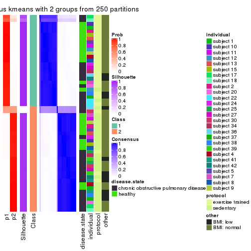</p>

</div>
<div id='tab-MAD-kmeans-consensus-heatmap-2'>
<pre><code class="r">consensus_heatmap(res, k = 3)
</code></pre>

<p>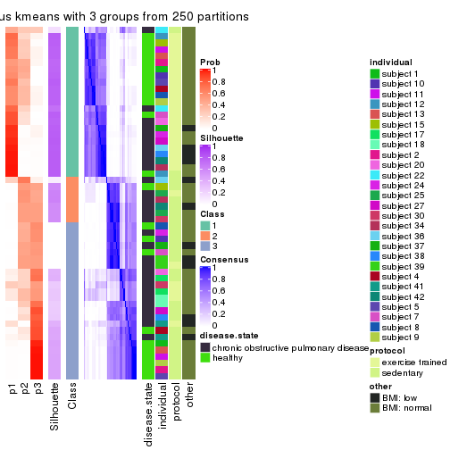</p>

</div>
<div id='tab-MAD-kmeans-consensus-heatmap-3'>
<pre><code class="r">consensus_heatmap(res, k = 4)
</code></pre>

<p>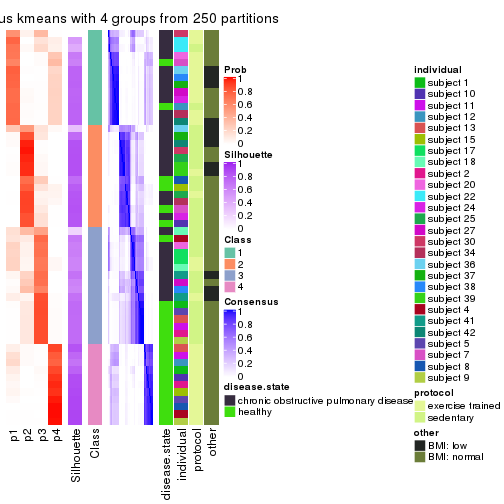</p>

</div>
<div id='tab-MAD-kmeans-consensus-heatmap-4'>
<pre><code class="r">consensus_heatmap(res, k = 5)
</code></pre>

<p>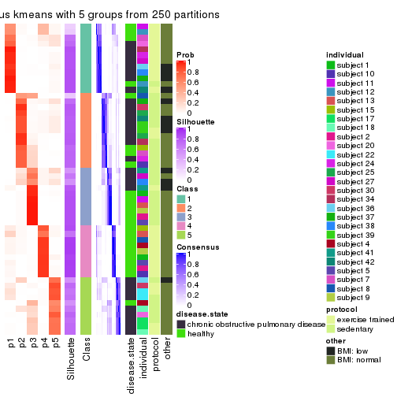</p>

</div>
<div id='tab-MAD-kmeans-consensus-heatmap-5'>
<pre><code class="r">consensus_heatmap(res, k = 6)
</code></pre>

<p>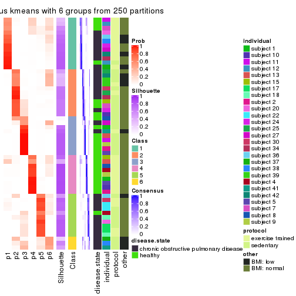</p>

</div>
</div>

Heatmaps for the membership of samples in all partitions to see how consistent they are:


<script>
$( function() {
	$( '#tabs-MAD-kmeans-membership-heatmap' ).tabs();
} );
</script>
<div id='tabs-MAD-kmeans-membership-heatmap'>
<ul>
<li><a href='#tab-MAD-kmeans-membership-heatmap-1'>k = 2</a></li>
<li><a href='#tab-MAD-kmeans-membership-heatmap-2'>k = 3</a></li>
<li><a href='#tab-MAD-kmeans-membership-heatmap-3'>k = 4</a></li>
<li><a href='#tab-MAD-kmeans-membership-heatmap-4'>k = 5</a></li>
<li><a href='#tab-MAD-kmeans-membership-heatmap-5'>k = 6</a></li>
</ul>
<div id='tab-MAD-kmeans-membership-heatmap-1'>
<pre><code class="r">membership_heatmap(res, k = 2)
</code></pre>

<p>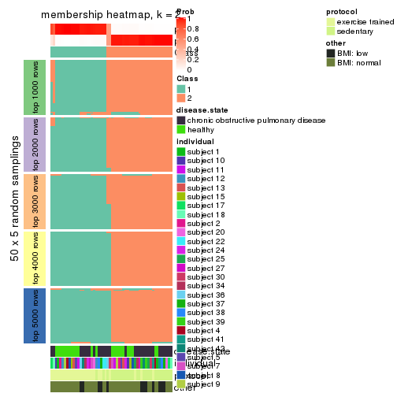</p>

</div>
<div id='tab-MAD-kmeans-membership-heatmap-2'>
<pre><code class="r">membership_heatmap(res, k = 3)
</code></pre>

<p>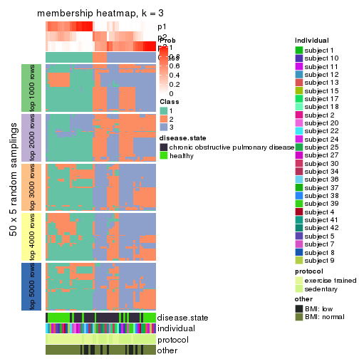</p>

</div>
<div id='tab-MAD-kmeans-membership-heatmap-3'>
<pre><code class="r">membership_heatmap(res, k = 4)
</code></pre>

<p>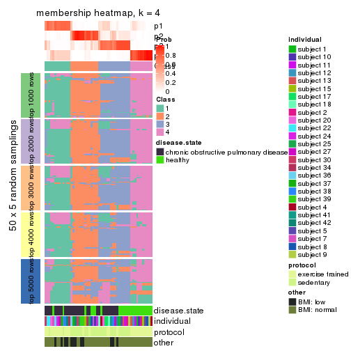</p>

</div>
<div id='tab-MAD-kmeans-membership-heatmap-4'>
<pre><code class="r">membership_heatmap(res, k = 5)
</code></pre>

<p>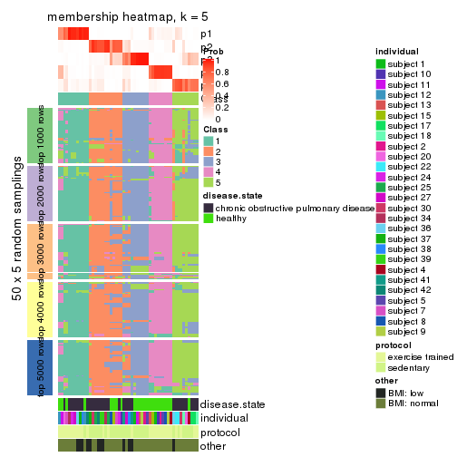</p>

</div>
<div id='tab-MAD-kmeans-membership-heatmap-5'>
<pre><code class="r">membership_heatmap(res, k = 6)
</code></pre>

<p>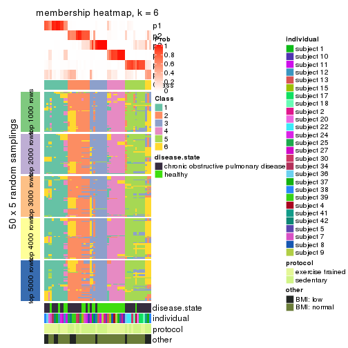</p>

</div>
</div>

As soon as we have had the classes for columns, we can look for signatures
which are significantly different between classes which can be candidate marks
for certain classes. Following are the heatmaps for signatures.


Signature heatmaps where rows are scaled:


<script>
$( function() {
	$( '#tabs-MAD-kmeans-get-signatures' ).tabs();
} );
</script>
<div id='tabs-MAD-kmeans-get-signatures'>
<ul>
<li><a href='#tab-MAD-kmeans-get-signatures-1'>k = 2</a></li>
<li><a href='#tab-MAD-kmeans-get-signatures-2'>k = 3</a></li>
<li><a href='#tab-MAD-kmeans-get-signatures-3'>k = 4</a></li>
<li><a href='#tab-MAD-kmeans-get-signatures-4'>k = 5</a></li>
<li><a href='#tab-MAD-kmeans-get-signatures-5'>k = 6</a></li>
</ul>
<div id='tab-MAD-kmeans-get-signatures-1'>
<pre><code class="r">get_signatures(res, k = 2)
</code></pre>

<p>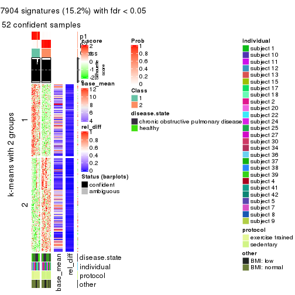</p>

</div>
<div id='tab-MAD-kmeans-get-signatures-2'>
<pre><code class="r">get_signatures(res, k = 3)
</code></pre>

<p>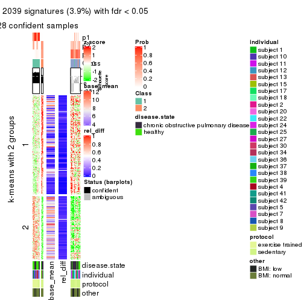</p>

</div>
<div id='tab-MAD-kmeans-get-signatures-3'>
<pre><code class="r">get_signatures(res, k = 4)
</code></pre>

<p>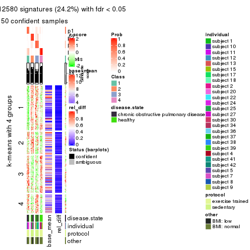</p>

</div>
<div id='tab-MAD-kmeans-get-signatures-4'>
<pre><code class="r">get_signatures(res, k = 5)
</code></pre>

<p>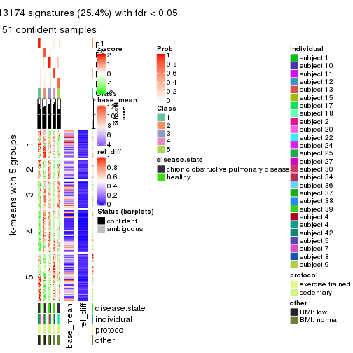</p>

</div>
<div id='tab-MAD-kmeans-get-signatures-5'>
<pre><code class="r">get_signatures(res, k = 6)
</code></pre>

<p>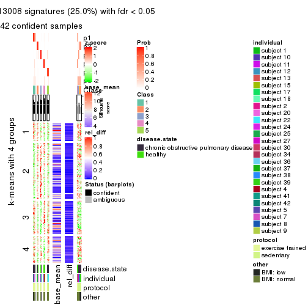</p>

</div>
</div>


Signature heatmaps where rows are not scaled:


<script>
$( function() {
	$( '#tabs-MAD-kmeans-get-signatures-no-scale' ).tabs();
} );
</script>
<div id='tabs-MAD-kmeans-get-signatures-no-scale'>
<ul>
<li><a href='#tab-MAD-kmeans-get-signatures-no-scale-1'>k = 2</a></li>
<li><a href='#tab-MAD-kmeans-get-signatures-no-scale-2'>k = 3</a></li>
<li><a href='#tab-MAD-kmeans-get-signatures-no-scale-3'>k = 4</a></li>
<li><a href='#tab-MAD-kmeans-get-signatures-no-scale-4'>k = 5</a></li>
<li><a href='#tab-MAD-kmeans-get-signatures-no-scale-5'>k = 6</a></li>
</ul>
<div id='tab-MAD-kmeans-get-signatures-no-scale-1'>
<pre><code class="r">get_signatures(res, k = 2, scale_rows = FALSE)
</code></pre>

<p>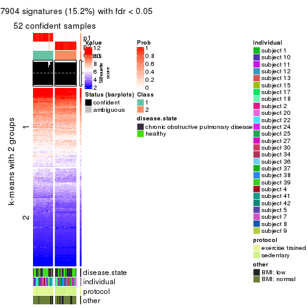</p>

</div>
<div id='tab-MAD-kmeans-get-signatures-no-scale-2'>
<pre><code class="r">get_signatures(res, k = 3, scale_rows = FALSE)
</code></pre>

<p>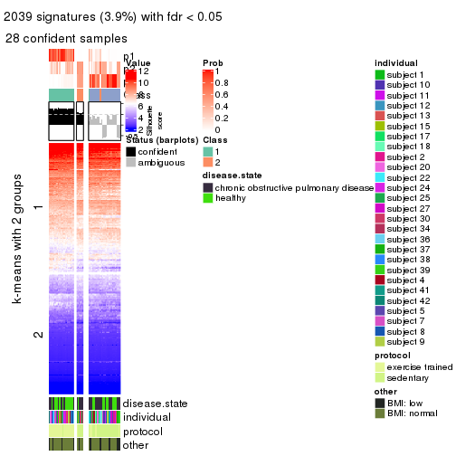</p>

</div>
<div id='tab-MAD-kmeans-get-signatures-no-scale-3'>
<pre><code class="r">get_signatures(res, k = 4, scale_rows = FALSE)
</code></pre>

<p>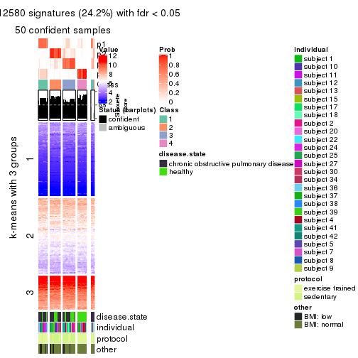</p>

</div>
<div id='tab-MAD-kmeans-get-signatures-no-scale-4'>
<pre><code class="r">get_signatures(res, k = 5, scale_rows = FALSE)
</code></pre>

<p>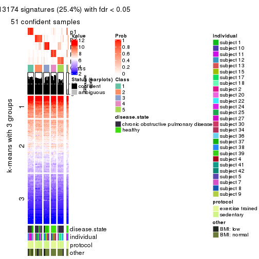</p>

</div>
<div id='tab-MAD-kmeans-get-signatures-no-scale-5'>
<pre><code class="r">get_signatures(res, k = 6, scale_rows = FALSE)
</code></pre>

<p>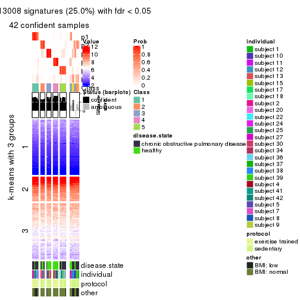</p>

</div>
</div>


Compare the overlap of signatures from different k:

```r
compare_signatures(res)
```

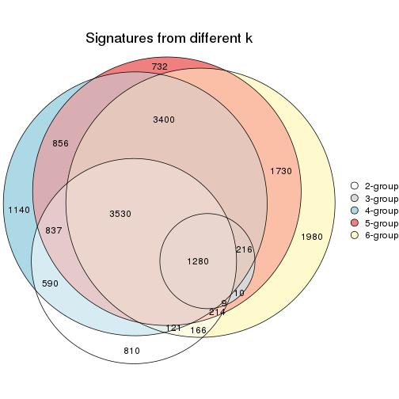

`get_signature()` returns a data frame invisibly. TO get the list of signatures, the function
call should be assigned to a variable explicitly. In following code, if `plot` argument is set
to `FALSE`, no heatmap is plotted while only the differential analysis is performed.

```r
# code only for demonstration
tb = get_signature(res, k = ..., plot = FALSE)
```

An example of the output of `tb` is:

```
#>   which_row         fdr    mean_1    mean_2 scaled_mean_1 scaled_mean_2 km
#> 1        38 0.042760348  8.373488  9.131774    -0.5533452     0.5164555  1
#> 2        40 0.018707592  7.106213  8.469186    -0.6173731     0.5762149  1
#> 3        55 0.019134737 10.221463 11.207825    -0.6159697     0.5749050  1
#> 4        59 0.006059896  5.921854  7.869574    -0.6899429     0.6439467  1
#> 5        60 0.018055526  8.928898 10.211722    -0.6204761     0.5791110  1
#> 6        98 0.009384629 15.714769 14.887706     0.6635654    -0.6193277  2
...
```

The columns in `tb` are:

1. `which_row`: row indices corresponding to the input matrix.
2. `fdr`: FDR for the differential test. 
3. `mean_x`: The mean value in group x.
4. `scaled_mean_x`: The mean value in group x after rows are scaled.
5. `km`: Row groups if k-means clustering is applied to rows.


UMAP plot which shows how samples are separated.


<script>
$( function() {
	$( '#tabs-MAD-kmeans-dimension-reduction' ).tabs();
} );
</script>
<div id='tabs-MAD-kmeans-dimension-reduction'>
<ul>
<li><a href='#tab-MAD-kmeans-dimension-reduction-1'>k = 2</a></li>
<li><a href='#tab-MAD-kmeans-dimension-reduction-2'>k = 3</a></li>
<li><a href='#tab-MAD-kmeans-dimension-reduction-3'>k = 4</a></li>
<li><a href='#tab-MAD-kmeans-dimension-reduction-4'>k = 5</a></li>
<li><a href='#tab-MAD-kmeans-dimension-reduction-5'>k = 6</a></li>
</ul>
<div id='tab-MAD-kmeans-dimension-reduction-1'>
<pre><code class="r">dimension_reduction(res, k = 2, method = &quot;UMAP&quot;)
</code></pre>

<p>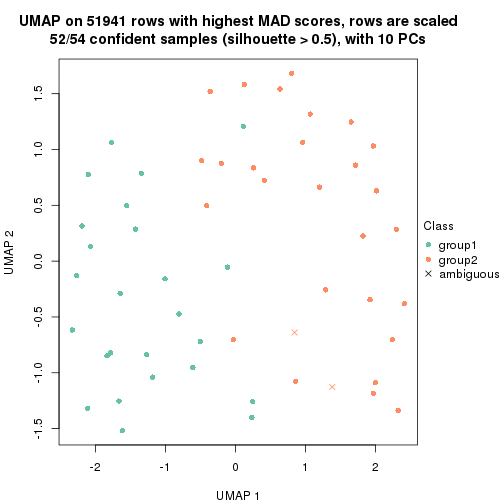</p>

</div>
<div id='tab-MAD-kmeans-dimension-reduction-2'>
<pre><code class="r">dimension_reduction(res, k = 3, method = &quot;UMAP&quot;)
</code></pre>

<p>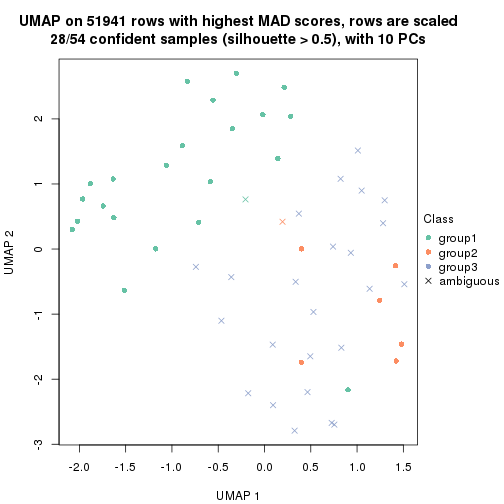</p>

</div>
<div id='tab-MAD-kmeans-dimension-reduction-3'>
<pre><code class="r">dimension_reduction(res, k = 4, method = &quot;UMAP&quot;)
</code></pre>

<p>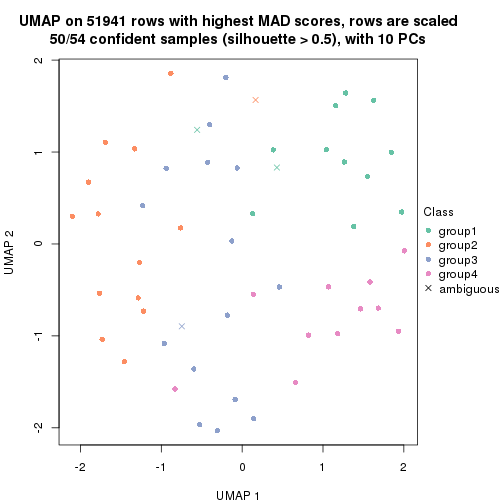</p>

</div>
<div id='tab-MAD-kmeans-dimension-reduction-4'>
<pre><code class="r">dimension_reduction(res, k = 5, method = &quot;UMAP&quot;)
</code></pre>

<p>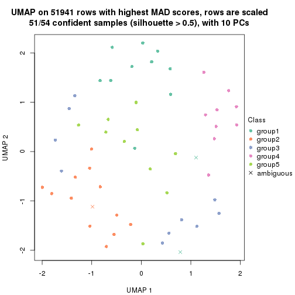</p>

</div>
<div id='tab-MAD-kmeans-dimension-reduction-5'>
<pre><code class="r">dimension_reduction(res, k = 6, method = &quot;UMAP&quot;)
</code></pre>

<p>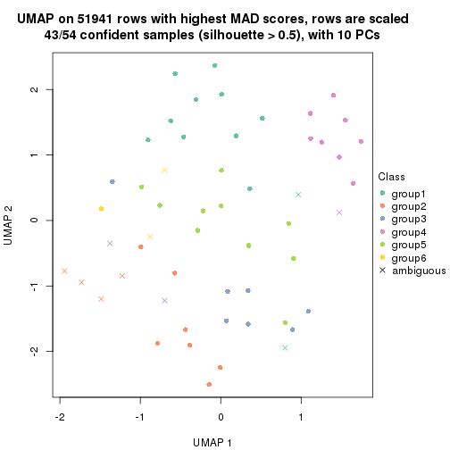</p>

</div>
</div>


Following heatmap shows how subgroups are split when increasing `k`:

```r
collect_classes(res)
```

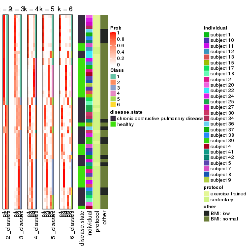


Test correlation between subgroups and known annotations. If the known
annotation is numeric, one-way ANOVA test is applied, and if the known
annotation is discrete, chi-squared contingency table test is applied.

```r
test_to_known_factors(res)
```

```
#>             n disease.state(p) individual(p) protocol(p) other(p) k
#> MAD:kmeans 52         0.592410         0.992    2.84e-08   0.5921 2
#> MAD:kmeans 28         0.167064         0.640    3.09e-04   1.0000 3
#> MAD:kmeans 50         0.000587         0.655    1.41e-06   0.1687 4
#> MAD:kmeans 51         0.000254         0.250    1.56e-05   0.1870 5
#> MAD:kmeans 43         0.000400         0.547    3.61e-04   0.0286 6
```


If matrix rows can be associated to genes, consider to use `functional_enrichment(res,
...)` to perform function enrichment for the signature genes. See [this vignette](http://bioconductor.org/packages/devel/bioc/vignettes/cola/inst/doc/functional_enrichment.html) for more detailed explanations.


 

---------------------------------------------------


### MAD:skmeans**


The object with results only for a single top-value method and a single partition method 
can be extracted as:

```r
res = res_list["MAD", "skmeans"]
# you can also extract it by
# res = res_list["MAD:skmeans"]
```

A summary of `res` and all the functions that can be applied to it:

```r
res
```

```
#> A 'ConsensusPartition' object with k = 2, 3, 4, 5, 6.
#>   On a matrix with 51941 rows and 54 columns.
#>   Top rows (1000, 2000, 3000, 4000, 5000) are extracted by 'MAD' method.
#>   Subgroups are detected by 'skmeans' method.
#>   Performed in total 1250 partitions by row resampling.
#>   Best k for subgroups seems to be 2.
#> 
#> Following methods can be applied to this 'ConsensusPartition' object:
#>  [1] "cola_report"             "collect_classes"         "collect_plots"          
#>  [4] "collect_stats"           "colnames"                "compare_signatures"     
#>  [7] "consensus_heatmap"       "dimension_reduction"     "functional_enrichment"  
#> [10] "get_anno_col"            "get_anno"                "get_classes"            
#> [13] "get_consensus"           "get_matrix"              "get_membership"         
#> [16] "get_param"               "get_signatures"          "get_stats"              
#> [19] "is_best_k"               "is_stable_k"             "membership_heatmap"     
#> [22] "ncol"                    "nrow"                    "plot_ecdf"              
#> [25] "rownames"                "select_partition_number" "show"                   
#> [28] "suggest_best_k"          "test_to_known_factors"
```

`collect_plots()` function collects all the plots made from `res` for all `k` (number of partitions)
into one single page to provide an easy and fast comparison between different `k`.

```r
collect_plots(res)
```

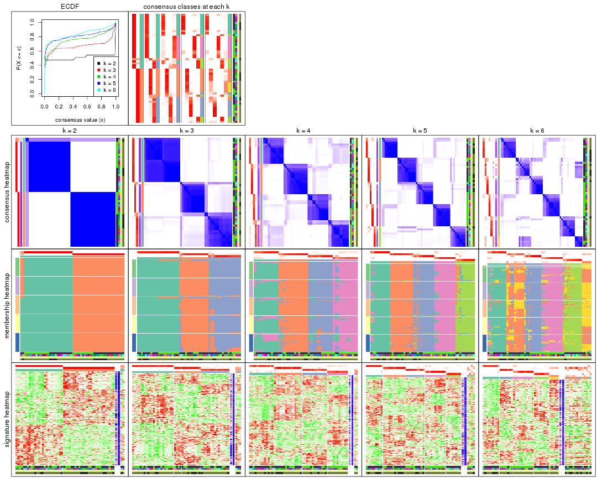

The plots are:

- The first row: a plot of the ECDF (empirical cumulative distribution
  function) curves of the consensus matrix for each `k` and the heatmap of
  predicted classes for each `k`.
- The second row: heatmaps of the consensus matrix for each `k`.
- The third row: heatmaps of the membership matrix for each `k`.
- The fouth row: heatmaps of the signatures for each `k`.

All the plots in panels can be made by individual functions and they are
plotted later in this section.

`select_partition_number()` produces several plots showing different
statistics for choosing "optimized" `k`. There are following statistics:

- ECDF curves of the consensus matrix for each `k`;
- 1-PAC. [The PAC
  score](https://en.wikipedia.org/wiki/Consensus_clustering#Over-interpretation_potential_of_consensus_clustering)
  measures the proportion of the ambiguous subgrouping.
- Mean silhouette score.
- Concordance. The mean probability of fiting the consensus class ids in all
  partitions.
- Area increased. Denote $A_k$ as the area under the ECDF curve for current
  `k`, the area increased is defined as $A_k - A_{k-1}$.
- Rand index. The percent of pairs of samples that are both in a same cluster
  or both are not in a same cluster in the partition of k and k-1.
- Jaccard index. The ratio of pairs of samples are both in a same cluster in
  the partition of k and k-1 and the pairs of samples are both in a same
  cluster in the partition k or k-1.

The detailed explanations of these statistics can be found in [the _cola_
vignette](http://bioconductor.org/packages/devel/bioc/vignettes/cola/inst/doc/cola.html#toc_13).

Generally speaking, lower PAC score, higher mean silhouette score or higher
concordance corresponds to better partition. Rand index and Jaccard index
measure how similar the current partition is compared to partition with `k-1`.
If they are too similar, we won't accept `k` is better than `k-1`.

```r
select_partition_number(res)
```

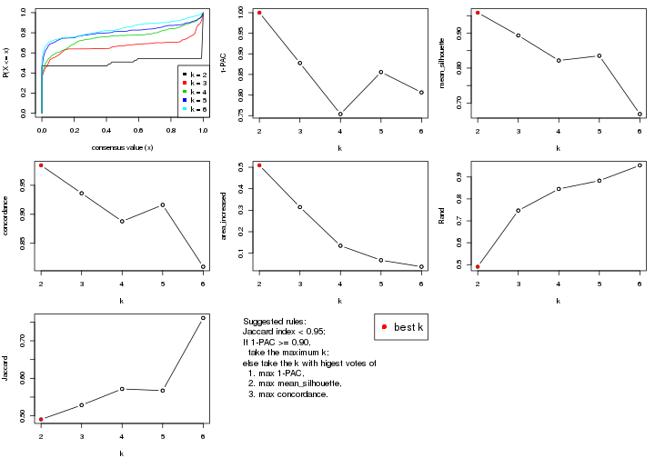

The numeric values for all these statistics can be obtained by `get_stats()`.

```r
get_stats(res)
```

```
#>   k 1-PAC mean_silhouette concordance area_increased  Rand Jaccard
#> 2 2 1.000           0.959       0.984         0.5088 0.491   0.491
#> 3 3 0.878           0.893       0.936         0.3146 0.747   0.529
#> 4 4 0.754           0.822       0.888         0.1348 0.846   0.572
#> 5 5 0.856           0.835       0.916         0.0674 0.883   0.567
#> 6 6 0.806           0.668       0.810         0.0372 0.953   0.761
```

`suggest_best_k()` suggests the best $k$ based on these statistics. The rules are as follows:

- All $k$ with Jaccard index larger than 0.95 are removed because increasing
  $k$ does not provide enough extra information. If all $k$ are removed, it is
  marked as no subgroup is detected.
- For all $k$ with 1-PAC score larger than 0.9, the maximal $k$ is taken as
  the best $k$, and other $k$ are marked as optional $k$.
- If it does not fit the second rule. The $k$ with the maximal vote of the
  highest 1-PAC score, highest mean silhouette, and highest concordance is
  taken as the best $k$.

```r
suggest_best_k(res)
```

```
#> [1] 2
```


Following shows the table of the partitions (You need to click the **show/hide
code output** link to see it). The membership matrix (columns with name `p*`)
is inferred by
[`clue::cl_consensus()`](https://www.rdocumentation.org/link/cl_consensus?package=clue)
function with the `SE` method. Basically the value in the membership matrix
represents the probability to belong to a certain group. The finall class
label for an item is determined with the group with highest probability it
belongs to.

In `get_classes()` function, the entropy is calculated from the membership
matrix and the silhouette score is calculated from the consensus matrix.


<script>
$( function() {
	$( '#tabs-MAD-skmeans-get-classes' ).tabs();
} );
</script>
<div id='tabs-MAD-skmeans-get-classes'>
<ul>
<li><a href='#tab-MAD-skmeans-get-classes-1'>k = 2</a></li>
<li><a href='#tab-MAD-skmeans-get-classes-2'>k = 3</a></li>
<li><a href='#tab-MAD-skmeans-get-classes-3'>k = 4</a></li>
<li><a href='#tab-MAD-skmeans-get-classes-4'>k = 5</a></li>
<li><a href='#tab-MAD-skmeans-get-classes-5'>k = 6</a></li>
</ul>

<div id='tab-MAD-skmeans-get-classes-1'>
<p><a id='tab-MAD-skmeans-get-classes-1-a' style='color:#0366d6' href='#'>show/hide code output</a></p>
<pre><code class="r">cbind(get_classes(res, k = 2), get_membership(res, k = 2))
</code></pre>

<pre><code>#&gt;           class entropy silhouette    p1    p2
#&gt; GSM680053     2   0.000      1.000 0.000 1.000
#&gt; GSM680062     1   0.000      0.967 1.000 0.000
#&gt; GSM680054     2   0.000      1.000 0.000 1.000
#&gt; GSM680063     1   0.000      0.967 1.000 0.000
#&gt; GSM680055     2   0.000      1.000 0.000 1.000
#&gt; GSM680064     1   0.000      0.967 1.000 0.000
#&gt; GSM680056     1   0.000      0.967 1.000 0.000
#&gt; GSM680065     1   0.000      0.967 1.000 0.000
#&gt; GSM680057     2   0.000      1.000 0.000 1.000
#&gt; GSM680066     1   0.000      0.967 1.000 0.000
#&gt; GSM680058     2   0.000      1.000 0.000 1.000
#&gt; GSM680067     2   0.000      1.000 0.000 1.000
#&gt; GSM680059     2   0.000      1.000 0.000 1.000
#&gt; GSM680068     1   0.000      0.967 1.000 0.000
#&gt; GSM680060     2   0.000      1.000 0.000 1.000
#&gt; GSM680069     1   0.978      0.324 0.588 0.412
#&gt; GSM680061     2   0.000      1.000 0.000 1.000
#&gt; GSM680070     1   0.000      0.967 1.000 0.000
#&gt; GSM680071     1   0.987      0.269 0.568 0.432
#&gt; GSM680077     1   0.000      0.967 1.000 0.000
#&gt; GSM680072     2   0.000      1.000 0.000 1.000
#&gt; GSM680078     1   0.000      0.967 1.000 0.000
#&gt; GSM680073     2   0.000      1.000 0.000 1.000
#&gt; GSM680079     1   0.000      0.967 1.000 0.000
#&gt; GSM680074     2   0.000      1.000 0.000 1.000
#&gt; GSM680080     2   0.000      1.000 0.000 1.000
#&gt; GSM680075     2   0.000      1.000 0.000 1.000
#&gt; GSM680081     2   0.000      1.000 0.000 1.000
#&gt; GSM680076     2   0.000      1.000 0.000 1.000
#&gt; GSM680082     1   0.000      0.967 1.000 0.000
#&gt; GSM680029     2   0.000      1.000 0.000 1.000
#&gt; GSM680041     1   0.000      0.967 1.000 0.000
#&gt; GSM680035     2   0.000      1.000 0.000 1.000
#&gt; GSM680047     1   0.000      0.967 1.000 0.000
#&gt; GSM680036     2   0.000      1.000 0.000 1.000
#&gt; GSM680048     1   0.000      0.967 1.000 0.000
#&gt; GSM680037     2   0.000      1.000 0.000 1.000
#&gt; GSM680049     1   0.000      0.967 1.000 0.000
#&gt; GSM680038     2   0.000      1.000 0.000 1.000
#&gt; GSM680050     1   0.000      0.967 1.000 0.000
#&gt; GSM680039     2   0.000      1.000 0.000 1.000
#&gt; GSM680051     1   0.000      0.967 1.000 0.000
#&gt; GSM680040     2   0.000      1.000 0.000 1.000
#&gt; GSM680052     1   0.000      0.967 1.000 0.000
#&gt; GSM680030     2   0.000      1.000 0.000 1.000
#&gt; GSM680042     1   0.000      0.967 1.000 0.000
#&gt; GSM680031     2   0.000      1.000 0.000 1.000
#&gt; GSM680043     1   0.000      0.967 1.000 0.000
#&gt; GSM680032     1   0.000      0.967 1.000 0.000
#&gt; GSM680044     1   0.000      0.967 1.000 0.000
#&gt; GSM680033     2   0.000      1.000 0.000 1.000
#&gt; GSM680045     1   0.000      0.967 1.000 0.000
#&gt; GSM680034     2   0.000      1.000 0.000 1.000
#&gt; GSM680046     1   0.000      0.967 1.000 0.000
</code></pre>

<script>
$('#tab-MAD-skmeans-get-classes-1-a').parent().next().next().hide();
$('#tab-MAD-skmeans-get-classes-1-a').click(function(){
  $('#tab-MAD-skmeans-get-classes-1-a').parent().next().next().toggle();
  return(false);
});
</script>
</div>

<div id='tab-MAD-skmeans-get-classes-2'>
<p><a id='tab-MAD-skmeans-get-classes-2-a' style='color:#0366d6' href='#'>show/hide code output</a></p>
<pre><code class="r">cbind(get_classes(res, k = 3), get_membership(res, k = 3))
</code></pre>

<pre><code>#&gt;           class entropy silhouette    p1    p2    p3
#&gt; GSM680053     3  0.1031     0.8838 0.000 0.024 0.976
#&gt; GSM680062     3  0.1905     0.8644 0.028 0.016 0.956
#&gt; GSM680054     2  0.6307     0.0464 0.000 0.512 0.488
#&gt; GSM680063     3  0.1163     0.8743 0.028 0.000 0.972
#&gt; GSM680055     3  0.0892     0.8827 0.000 0.020 0.980
#&gt; GSM680064     1  0.1289     0.9712 0.968 0.000 0.032
#&gt; GSM680056     3  0.3482     0.7640 0.128 0.000 0.872
#&gt; GSM680065     1  0.3412     0.8995 0.876 0.000 0.124
#&gt; GSM680057     2  0.0747     0.9408 0.000 0.984 0.016
#&gt; GSM680066     1  0.1163     0.9713 0.972 0.000 0.028
#&gt; GSM680058     2  0.0747     0.9408 0.000 0.984 0.016
#&gt; GSM680067     2  0.1163     0.9105 0.028 0.972 0.000
#&gt; GSM680059     3  0.6180     0.4223 0.000 0.416 0.584
#&gt; GSM680068     1  0.1031     0.9718 0.976 0.000 0.024
#&gt; GSM680060     2  0.0747     0.9408 0.000 0.984 0.016
#&gt; GSM680069     3  0.0747     0.8626 0.016 0.000 0.984
#&gt; GSM680061     2  0.0000     0.9328 0.000 1.000 0.000
#&gt; GSM680070     1  0.1163     0.9713 0.972 0.000 0.028
#&gt; GSM680071     2  0.4068     0.8300 0.016 0.864 0.120
#&gt; GSM680077     1  0.1289     0.9704 0.968 0.000 0.032
#&gt; GSM680072     2  0.1163     0.9349 0.000 0.972 0.028
#&gt; GSM680078     1  0.1860     0.9599 0.948 0.000 0.052
#&gt; GSM680073     3  0.6180     0.4173 0.000 0.416 0.584
#&gt; GSM680079     1  0.1289     0.9704 0.968 0.000 0.032
#&gt; GSM680074     2  0.0747     0.9408 0.000 0.984 0.016
#&gt; GSM680080     2  0.0747     0.9408 0.000 0.984 0.016
#&gt; GSM680075     3  0.2261     0.8911 0.000 0.068 0.932
#&gt; GSM680081     3  0.2804     0.8843 0.016 0.060 0.924
#&gt; GSM680076     2  0.0747     0.9318 0.016 0.984 0.000
#&gt; GSM680082     1  0.1289     0.9704 0.968 0.000 0.032
#&gt; GSM680029     3  0.2711     0.8898 0.000 0.088 0.912
#&gt; GSM680041     1  0.2152     0.9558 0.948 0.016 0.036
#&gt; GSM680035     3  0.3116     0.8844 0.000 0.108 0.892
#&gt; GSM680047     1  0.1170     0.9709 0.976 0.016 0.008
#&gt; GSM680036     3  0.1289     0.8857 0.000 0.032 0.968
#&gt; GSM680048     1  0.0747     0.9729 0.984 0.016 0.000
#&gt; GSM680037     3  0.2959     0.8871 0.000 0.100 0.900
#&gt; GSM680049     1  0.0747     0.9729 0.984 0.016 0.000
#&gt; GSM680038     2  0.0747     0.9408 0.000 0.984 0.016
#&gt; GSM680050     1  0.1289     0.9712 0.968 0.000 0.032
#&gt; GSM680039     2  0.0747     0.9408 0.000 0.984 0.016
#&gt; GSM680051     1  0.0747     0.9729 0.984 0.016 0.000
#&gt; GSM680040     3  0.3267     0.8797 0.000 0.116 0.884
#&gt; GSM680052     1  0.0747     0.9729 0.984 0.016 0.000
#&gt; GSM680030     2  0.0747     0.9408 0.000 0.984 0.016
#&gt; GSM680042     1  0.0983     0.9720 0.980 0.016 0.004
#&gt; GSM680031     3  0.3116     0.8844 0.000 0.108 0.892
#&gt; GSM680043     1  0.0747     0.9729 0.984 0.016 0.000
#&gt; GSM680032     1  0.1411     0.9692 0.964 0.000 0.036
#&gt; GSM680044     1  0.0747     0.9729 0.984 0.016 0.000
#&gt; GSM680033     3  0.3340     0.8768 0.000 0.120 0.880
#&gt; GSM680045     1  0.0747     0.9729 0.984 0.016 0.000
#&gt; GSM680034     2  0.0892     0.9177 0.020 0.980 0.000
#&gt; GSM680046     1  0.0747     0.9729 0.984 0.016 0.000
</code></pre>

<script>
$('#tab-MAD-skmeans-get-classes-2-a').parent().next().next().hide();
$('#tab-MAD-skmeans-get-classes-2-a').click(function(){
  $('#tab-MAD-skmeans-get-classes-2-a').parent().next().next().toggle();
  return(false);
});
</script>
</div>

<div id='tab-MAD-skmeans-get-classes-3'>
<p><a id='tab-MAD-skmeans-get-classes-3-a' style='color:#0366d6' href='#'>show/hide code output</a></p>
<pre><code class="r">cbind(get_classes(res, k = 4), get_membership(res, k = 4))
</code></pre>

<pre><code>#&gt;           class entropy silhouette    p1    p2    p3    p4
#&gt; GSM680053     3  0.4447      0.799 0.044 0.008 0.812 0.136
#&gt; GSM680062     4  0.5807      0.221 0.044 0.000 0.344 0.612
#&gt; GSM680054     2  0.6627      0.574 0.016 0.644 0.244 0.096
#&gt; GSM680063     4  0.6074     -0.130 0.044 0.000 0.456 0.500
#&gt; GSM680055     3  0.4447      0.799 0.044 0.008 0.812 0.136
#&gt; GSM680064     1  0.3123      0.830 0.844 0.000 0.000 0.156
#&gt; GSM680056     1  0.4679      0.748 0.772 0.000 0.044 0.184
#&gt; GSM680065     1  0.4323      0.759 0.788 0.000 0.028 0.184
#&gt; GSM680057     2  0.0921      0.923 0.000 0.972 0.028 0.000
#&gt; GSM680066     1  0.1624      0.875 0.952 0.000 0.020 0.028
#&gt; GSM680058     2  0.0188      0.929 0.000 0.996 0.004 0.000
#&gt; GSM680067     2  0.0672      0.928 0.000 0.984 0.008 0.008
#&gt; GSM680059     3  0.3123      0.834 0.000 0.156 0.844 0.000
#&gt; GSM680068     1  0.1474      0.872 0.948 0.000 0.000 0.052
#&gt; GSM680060     2  0.0188      0.929 0.000 0.996 0.004 0.000
#&gt; GSM680069     1  0.5631      0.707 0.732 0.004 0.108 0.156
#&gt; GSM680061     2  0.0336      0.928 0.000 0.992 0.008 0.000
#&gt; GSM680070     1  0.1118      0.882 0.964 0.000 0.000 0.036
#&gt; GSM680071     2  0.6130      0.702 0.092 0.724 0.032 0.152
#&gt; GSM680077     1  0.0707      0.882 0.980 0.000 0.000 0.020
#&gt; GSM680072     2  0.2053      0.886 0.000 0.924 0.072 0.004
#&gt; GSM680078     1  0.0817      0.883 0.976 0.000 0.000 0.024
#&gt; GSM680073     3  0.3583      0.811 0.000 0.180 0.816 0.004
#&gt; GSM680079     1  0.1118      0.882 0.964 0.000 0.000 0.036
#&gt; GSM680074     2  0.0000      0.929 0.000 1.000 0.000 0.000
#&gt; GSM680080     2  0.0000      0.929 0.000 1.000 0.000 0.000
#&gt; GSM680075     3  0.2896      0.888 0.056 0.032 0.904 0.008
#&gt; GSM680081     3  0.2831      0.840 0.120 0.004 0.876 0.000
#&gt; GSM680076     2  0.0592      0.923 0.016 0.984 0.000 0.000
#&gt; GSM680082     1  0.1118      0.882 0.964 0.000 0.000 0.036
#&gt; GSM680029     3  0.1284      0.907 0.012 0.024 0.964 0.000
#&gt; GSM680041     4  0.1022      0.778 0.032 0.000 0.000 0.968
#&gt; GSM680035     3  0.1022      0.910 0.000 0.032 0.968 0.000
#&gt; GSM680047     4  0.2281      0.827 0.096 0.000 0.000 0.904
#&gt; GSM680036     3  0.2940      0.855 0.012 0.008 0.892 0.088
#&gt; GSM680048     4  0.2868      0.843 0.136 0.000 0.000 0.864
#&gt; GSM680037     3  0.1022      0.910 0.000 0.032 0.968 0.000
#&gt; GSM680049     4  0.2973      0.842 0.144 0.000 0.000 0.856
#&gt; GSM680038     2  0.0336      0.929 0.000 0.992 0.008 0.000
#&gt; GSM680050     1  0.4356      0.662 0.708 0.000 0.000 0.292
#&gt; GSM680039     2  0.3266      0.804 0.000 0.832 0.168 0.000
#&gt; GSM680051     4  0.2868      0.843 0.136 0.000 0.000 0.864
#&gt; GSM680040     3  0.1022      0.910 0.000 0.032 0.968 0.000
#&gt; GSM680052     4  0.2868      0.843 0.136 0.000 0.000 0.864
#&gt; GSM680030     2  0.0921      0.923 0.000 0.972 0.028 0.000
#&gt; GSM680042     4  0.2281      0.827 0.096 0.000 0.000 0.904
#&gt; GSM680031     3  0.1022      0.910 0.000 0.032 0.968 0.000
#&gt; GSM680043     4  0.3528      0.821 0.192 0.000 0.000 0.808
#&gt; GSM680032     1  0.0921      0.884 0.972 0.000 0.000 0.028
#&gt; GSM680044     4  0.3649      0.812 0.204 0.000 0.000 0.796
#&gt; GSM680033     3  0.1022      0.910 0.000 0.032 0.968 0.000
#&gt; GSM680045     4  0.3400      0.829 0.180 0.000 0.000 0.820
#&gt; GSM680034     2  0.1624      0.917 0.000 0.952 0.028 0.020
#&gt; GSM680046     4  0.3400      0.829 0.180 0.000 0.000 0.820
</code></pre>

<script>
$('#tab-MAD-skmeans-get-classes-3-a').parent().next().next().hide();
$('#tab-MAD-skmeans-get-classes-3-a').click(function(){
  $('#tab-MAD-skmeans-get-classes-3-a').parent().next().next().toggle();
  return(false);
});
</script>
</div>

<div id='tab-MAD-skmeans-get-classes-4'>
<p><a id='tab-MAD-skmeans-get-classes-4-a' style='color:#0366d6' href='#'>show/hide code output</a></p>
<pre><code class="r">cbind(get_classes(res, k = 5), get_membership(res, k = 5))
</code></pre>

<pre><code>#&gt;           class entropy silhouette    p1    p2    p3    p4    p5
#&gt; GSM680053     5  0.0963     0.8436 0.000 0.000 0.036 0.000 0.964
#&gt; GSM680062     5  0.0992     0.8446 0.000 0.000 0.008 0.024 0.968
#&gt; GSM680054     5  0.3821     0.6908 0.000 0.216 0.020 0.000 0.764
#&gt; GSM680063     5  0.0807     0.8479 0.000 0.000 0.012 0.012 0.976
#&gt; GSM680055     5  0.0794     0.8464 0.000 0.000 0.028 0.000 0.972
#&gt; GSM680064     1  0.4264     0.7087 0.744 0.000 0.000 0.212 0.044
#&gt; GSM680056     5  0.1041     0.8457 0.032 0.000 0.000 0.004 0.964
#&gt; GSM680065     5  0.2338     0.7895 0.112 0.000 0.000 0.004 0.884
#&gt; GSM680057     2  0.2455     0.9033 0.008 0.896 0.088 0.004 0.004
#&gt; GSM680066     1  0.0451     0.9263 0.988 0.000 0.004 0.008 0.000
#&gt; GSM680058     2  0.0451     0.9472 0.000 0.988 0.004 0.000 0.008
#&gt; GSM680067     2  0.0889     0.9447 0.004 0.976 0.004 0.012 0.004
#&gt; GSM680059     3  0.2249     0.8265 0.000 0.096 0.896 0.000 0.008
#&gt; GSM680068     1  0.0290     0.9271 0.992 0.000 0.000 0.008 0.000
#&gt; GSM680060     2  0.0290     0.9472 0.000 0.992 0.000 0.000 0.008
#&gt; GSM680069     5  0.0794     0.8471 0.028 0.000 0.000 0.000 0.972
#&gt; GSM680061     2  0.0902     0.9451 0.004 0.976 0.008 0.008 0.004
#&gt; GSM680070     1  0.0290     0.9271 0.992 0.000 0.000 0.008 0.000
#&gt; GSM680071     5  0.4664     0.2426 0.004 0.436 0.000 0.008 0.552
#&gt; GSM680077     1  0.0486     0.9243 0.988 0.004 0.000 0.004 0.004
#&gt; GSM680072     2  0.2104     0.8985 0.000 0.916 0.024 0.000 0.060
#&gt; GSM680078     1  0.0451     0.9263 0.988 0.000 0.004 0.008 0.000
#&gt; GSM680073     3  0.4563     0.6827 0.000 0.244 0.708 0.000 0.048
#&gt; GSM680079     1  0.0451     0.9261 0.988 0.000 0.000 0.008 0.004
#&gt; GSM680074     2  0.0451     0.9472 0.000 0.988 0.004 0.000 0.008
#&gt; GSM680080     2  0.0451     0.9472 0.000 0.988 0.004 0.000 0.008
#&gt; GSM680075     3  0.4279     0.7440 0.004 0.108 0.784 0.000 0.104
#&gt; GSM680081     3  0.1608     0.8321 0.072 0.000 0.928 0.000 0.000
#&gt; GSM680076     2  0.0451     0.9472 0.000 0.988 0.004 0.000 0.008
#&gt; GSM680082     1  0.0290     0.9271 0.992 0.000 0.000 0.008 0.000
#&gt; GSM680029     3  0.0290     0.8700 0.000 0.000 0.992 0.000 0.008
#&gt; GSM680041     4  0.0510     0.9271 0.000 0.000 0.000 0.984 0.016
#&gt; GSM680035     3  0.0451     0.8707 0.004 0.000 0.988 0.000 0.008
#&gt; GSM680047     4  0.0290     0.9315 0.000 0.000 0.000 0.992 0.008
#&gt; GSM680036     5  0.4235     0.4629 0.000 0.008 0.336 0.000 0.656
#&gt; GSM680048     4  0.0162     0.9331 0.004 0.000 0.000 0.996 0.000
#&gt; GSM680037     3  0.0451     0.8707 0.004 0.000 0.988 0.000 0.008
#&gt; GSM680049     4  0.0290     0.9325 0.008 0.000 0.000 0.992 0.000
#&gt; GSM680038     2  0.1492     0.9362 0.008 0.948 0.040 0.000 0.004
#&gt; GSM680050     1  0.5022     0.4950 0.620 0.000 0.000 0.332 0.048
#&gt; GSM680039     3  0.4719     0.0992 0.004 0.452 0.536 0.004 0.004
#&gt; GSM680051     4  0.0162     0.9308 0.000 0.004 0.000 0.996 0.000
#&gt; GSM680040     3  0.0290     0.8711 0.000 0.000 0.992 0.000 0.008
#&gt; GSM680052     4  0.0162     0.9331 0.004 0.000 0.000 0.996 0.000
#&gt; GSM680030     2  0.2396     0.9057 0.008 0.900 0.084 0.004 0.004
#&gt; GSM680042     4  0.0290     0.9315 0.000 0.000 0.000 0.992 0.008
#&gt; GSM680031     3  0.0404     0.8705 0.000 0.000 0.988 0.000 0.012
#&gt; GSM680043     4  0.3863     0.6878 0.248 0.000 0.000 0.740 0.012
#&gt; GSM680032     1  0.0613     0.9172 0.984 0.000 0.004 0.008 0.004
#&gt; GSM680044     4  0.4040     0.6371 0.276 0.000 0.000 0.712 0.012
#&gt; GSM680033     3  0.0290     0.8711 0.000 0.000 0.992 0.000 0.008
#&gt; GSM680045     4  0.1281     0.9170 0.032 0.000 0.000 0.956 0.012
#&gt; GSM680034     2  0.3586     0.8656 0.008 0.844 0.092 0.052 0.004
#&gt; GSM680046     4  0.0510     0.9303 0.016 0.000 0.000 0.984 0.000
</code></pre>

<script>
$('#tab-MAD-skmeans-get-classes-4-a').parent().next().next().hide();
$('#tab-MAD-skmeans-get-classes-4-a').click(function(){
  $('#tab-MAD-skmeans-get-classes-4-a').parent().next().next().toggle();
  return(false);
});
</script>
</div>

<div id='tab-MAD-skmeans-get-classes-5'>
<p><a id='tab-MAD-skmeans-get-classes-5-a' style='color:#0366d6' href='#'>show/hide code output</a></p>
<pre><code class="r">cbind(get_classes(res, k = 6), get_membership(res, k = 6))
</code></pre>

<pre><code>#&gt;           class entropy silhouette    p1    p2    p3    p4    p5    p6
#&gt; GSM680053     5  0.0622     0.8417 0.000 0.000 0.008 0.000 0.980 0.012
#&gt; GSM680062     5  0.1307     0.8396 0.000 0.000 0.008 0.008 0.952 0.032
#&gt; GSM680054     5  0.2917     0.7811 0.000 0.104 0.004 0.000 0.852 0.040
#&gt; GSM680063     5  0.1307     0.8396 0.000 0.000 0.008 0.008 0.952 0.032
#&gt; GSM680055     5  0.0260     0.8425 0.000 0.000 0.008 0.000 0.992 0.000
#&gt; GSM680064     1  0.5327     0.5240 0.616 0.000 0.000 0.280 0.032 0.072
#&gt; GSM680056     5  0.1843     0.8326 0.004 0.004 0.000 0.000 0.912 0.080
#&gt; GSM680065     5  0.3317     0.7974 0.080 0.004 0.000 0.000 0.828 0.088
#&gt; GSM680057     6  0.4332     0.9049 0.000 0.352 0.032 0.000 0.000 0.616
#&gt; GSM680066     1  0.1588     0.8577 0.924 0.000 0.000 0.000 0.004 0.072
#&gt; GSM680058     2  0.2562     0.4099 0.000 0.828 0.000 0.000 0.000 0.172
#&gt; GSM680067     6  0.3727     0.8695 0.000 0.388 0.000 0.000 0.000 0.612
#&gt; GSM680059     3  0.3967     0.4338 0.000 0.356 0.632 0.000 0.000 0.012
#&gt; GSM680068     1  0.1700     0.8540 0.916 0.000 0.000 0.000 0.004 0.080
#&gt; GSM680060     2  0.3647    -0.1175 0.000 0.640 0.000 0.000 0.000 0.360
#&gt; GSM680069     5  0.2766     0.8246 0.012 0.028 0.000 0.000 0.868 0.092
#&gt; GSM680061     6  0.3727     0.8793 0.000 0.388 0.000 0.000 0.000 0.612
#&gt; GSM680070     1  0.0790     0.8727 0.968 0.000 0.000 0.000 0.000 0.032
#&gt; GSM680071     5  0.5688     0.4279 0.000 0.264 0.000 0.000 0.524 0.212
#&gt; GSM680077     1  0.0790     0.8727 0.968 0.000 0.000 0.000 0.000 0.032
#&gt; GSM680072     2  0.1168     0.4506 0.000 0.956 0.016 0.000 0.028 0.000
#&gt; GSM680078     1  0.0935     0.8738 0.964 0.004 0.000 0.000 0.000 0.032
#&gt; GSM680073     2  0.4637     0.1587 0.000 0.636 0.316 0.000 0.024 0.024
#&gt; GSM680079     1  0.0547     0.8744 0.980 0.000 0.000 0.000 0.000 0.020
#&gt; GSM680074     2  0.2378     0.4502 0.000 0.848 0.000 0.000 0.000 0.152
#&gt; GSM680080     2  0.2340     0.4544 0.000 0.852 0.000 0.000 0.000 0.148
#&gt; GSM680075     2  0.5778    -0.0643 0.008 0.528 0.368 0.000 0.048 0.048
#&gt; GSM680081     3  0.2250     0.7864 0.064 0.000 0.896 0.000 0.000 0.040
#&gt; GSM680076     2  0.2454     0.4573 0.000 0.840 0.000 0.000 0.000 0.160
#&gt; GSM680082     1  0.0713     0.8748 0.972 0.000 0.000 0.000 0.000 0.028
#&gt; GSM680029     3  0.1686     0.8085 0.000 0.064 0.924 0.000 0.000 0.012
#&gt; GSM680041     4  0.0858     0.8770 0.000 0.000 0.000 0.968 0.004 0.028
#&gt; GSM680035     3  0.0000     0.8448 0.000 0.000 1.000 0.000 0.000 0.000
#&gt; GSM680047     4  0.0458     0.8837 0.000 0.000 0.000 0.984 0.000 0.016
#&gt; GSM680036     5  0.6309     0.3461 0.000 0.252 0.224 0.000 0.496 0.028
#&gt; GSM680048     4  0.0547     0.8850 0.000 0.000 0.000 0.980 0.000 0.020
#&gt; GSM680037     3  0.0146     0.8439 0.000 0.000 0.996 0.000 0.004 0.000
#&gt; GSM680049     4  0.0363     0.8854 0.000 0.000 0.000 0.988 0.000 0.012
#&gt; GSM680038     2  0.4098    -0.6900 0.000 0.496 0.008 0.000 0.000 0.496
#&gt; GSM680050     1  0.5761     0.3728 0.536 0.000 0.000 0.344 0.040 0.080
#&gt; GSM680039     3  0.5731    -0.1773 0.000 0.168 0.448 0.000 0.000 0.384
#&gt; GSM680051     4  0.0260     0.8858 0.000 0.000 0.000 0.992 0.000 0.008
#&gt; GSM680040     3  0.0000     0.8448 0.000 0.000 1.000 0.000 0.000 0.000
#&gt; GSM680052     4  0.0458     0.8856 0.000 0.000 0.000 0.984 0.000 0.016
#&gt; GSM680030     6  0.4344     0.9031 0.000 0.356 0.032 0.000 0.000 0.612
#&gt; GSM680042     4  0.0547     0.8824 0.000 0.000 0.000 0.980 0.000 0.020
#&gt; GSM680031     3  0.0405     0.8414 0.000 0.000 0.988 0.000 0.004 0.008
#&gt; GSM680043     4  0.5420     0.5162 0.272 0.000 0.000 0.580 0.004 0.144
#&gt; GSM680032     1  0.2122     0.8514 0.900 0.008 0.000 0.000 0.008 0.084
#&gt; GSM680044     4  0.5586     0.5271 0.252 0.000 0.000 0.584 0.012 0.152
#&gt; GSM680033     3  0.0000     0.8448 0.000 0.000 1.000 0.000 0.000 0.000
#&gt; GSM680045     4  0.3275     0.8141 0.036 0.000 0.000 0.816 0.004 0.144
#&gt; GSM680034     6  0.4685     0.8540 0.000 0.300 0.040 0.016 0.000 0.644
#&gt; GSM680046     4  0.2149     0.8540 0.004 0.000 0.000 0.888 0.004 0.104
</code></pre>

<script>
$('#tab-MAD-skmeans-get-classes-5-a').parent().next().next().hide();
$('#tab-MAD-skmeans-get-classes-5-a').click(function(){
  $('#tab-MAD-skmeans-get-classes-5-a').parent().next().next().toggle();
  return(false);
});
</script>
</div>
</div>

Heatmaps for the consensus matrix. It visualizes the probability of two
samples to be in a same group.


<script>
$( function() {
	$( '#tabs-MAD-skmeans-consensus-heatmap' ).tabs();
} );
</script>
<div id='tabs-MAD-skmeans-consensus-heatmap'>
<ul>
<li><a href='#tab-MAD-skmeans-consensus-heatmap-1'>k = 2</a></li>
<li><a href='#tab-MAD-skmeans-consensus-heatmap-2'>k = 3</a></li>
<li><a href='#tab-MAD-skmeans-consensus-heatmap-3'>k = 4</a></li>
<li><a href='#tab-MAD-skmeans-consensus-heatmap-4'>k = 5</a></li>
<li><a href='#tab-MAD-skmeans-consensus-heatmap-5'>k = 6</a></li>
</ul>
<div id='tab-MAD-skmeans-consensus-heatmap-1'>
<pre><code class="r">consensus_heatmap(res, k = 2)
</code></pre>

<p>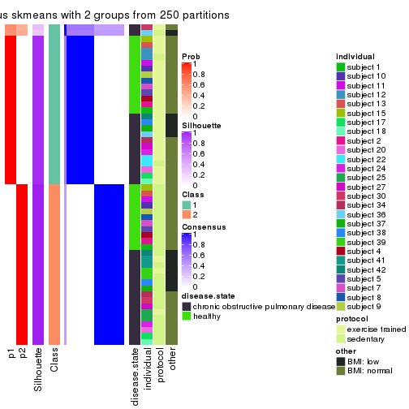</p>

</div>
<div id='tab-MAD-skmeans-consensus-heatmap-2'>
<pre><code class="r">consensus_heatmap(res, k = 3)
</code></pre>

<p>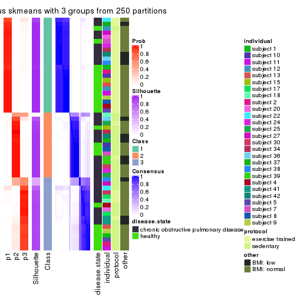</p>

</div>
<div id='tab-MAD-skmeans-consensus-heatmap-3'>
<pre><code class="r">consensus_heatmap(res, k = 4)
</code></pre>

<p>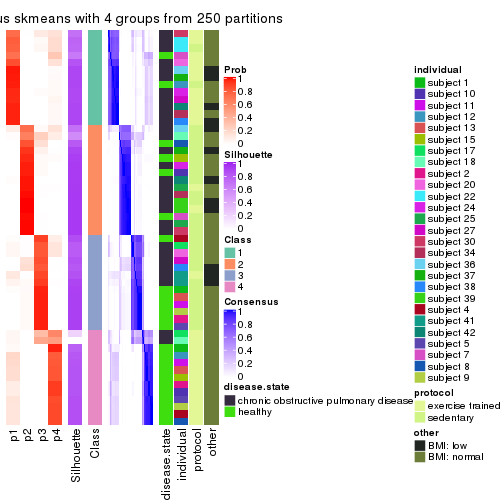</p>

</div>
<div id='tab-MAD-skmeans-consensus-heatmap-4'>
<pre><code class="r">consensus_heatmap(res, k = 5)
</code></pre>

<p>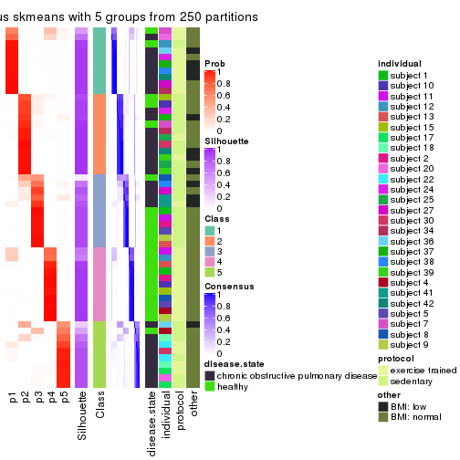</p>

</div>
<div id='tab-MAD-skmeans-consensus-heatmap-5'>
<pre><code class="r">consensus_heatmap(res, k = 6)
</code></pre>

<p>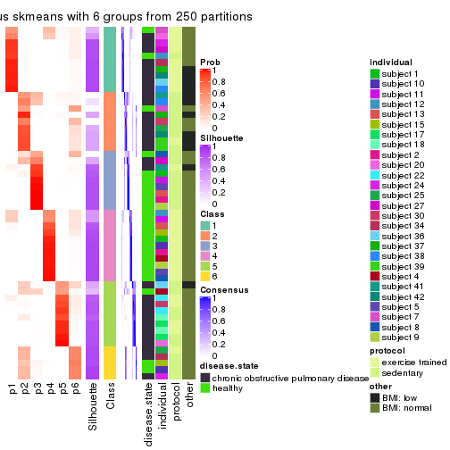</p>

</div>
</div>

Heatmaps for the membership of samples in all partitions to see how consistent they are:


<script>
$( function() {
	$( '#tabs-MAD-skmeans-membership-heatmap' ).tabs();
} );
</script>
<div id='tabs-MAD-skmeans-membership-heatmap'>
<ul>
<li><a href='#tab-MAD-skmeans-membership-heatmap-1'>k = 2</a></li>
<li><a href='#tab-MAD-skmeans-membership-heatmap-2'>k = 3</a></li>
<li><a href='#tab-MAD-skmeans-membership-heatmap-3'>k = 4</a></li>
<li><a href='#tab-MAD-skmeans-membership-heatmap-4'>k = 5</a></li>
<li><a href='#tab-MAD-skmeans-membership-heatmap-5'>k = 6</a></li>
</ul>
<div id='tab-MAD-skmeans-membership-heatmap-1'>
<pre><code class="r">membership_heatmap(res, k = 2)
</code></pre>

<p>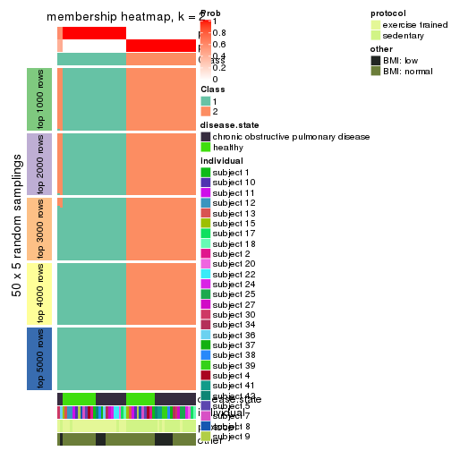</p>

</div>
<div id='tab-MAD-skmeans-membership-heatmap-2'>
<pre><code class="r">membership_heatmap(res, k = 3)
</code></pre>

<p>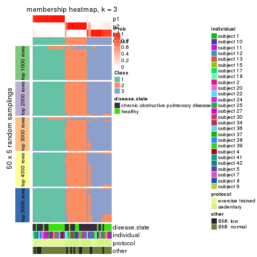</p>

</div>
<div id='tab-MAD-skmeans-membership-heatmap-3'>
<pre><code class="r">membership_heatmap(res, k = 4)
</code></pre>

<p>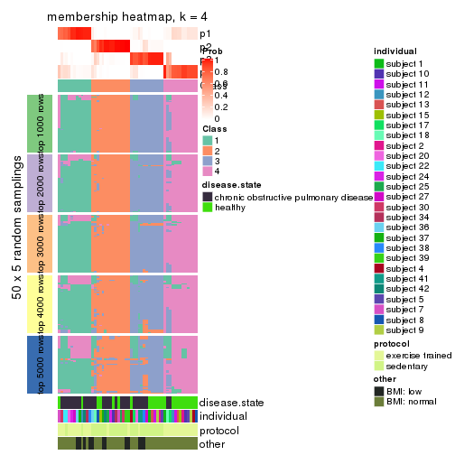</p>

</div>
<div id='tab-MAD-skmeans-membership-heatmap-4'>
<pre><code class="r">membership_heatmap(res, k = 5)
</code></pre>

<p>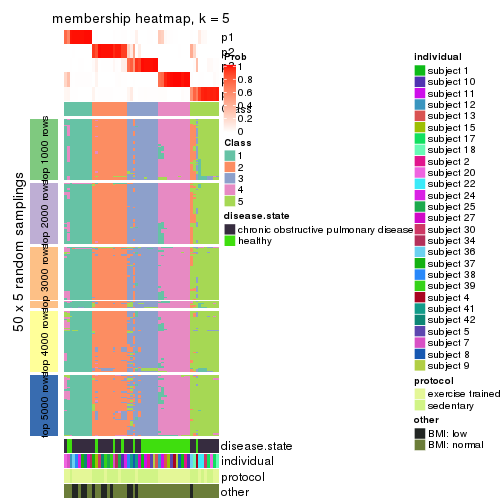</p>

</div>
<div id='tab-MAD-skmeans-membership-heatmap-5'>
<pre><code class="r">membership_heatmap(res, k = 6)
</code></pre>

<p>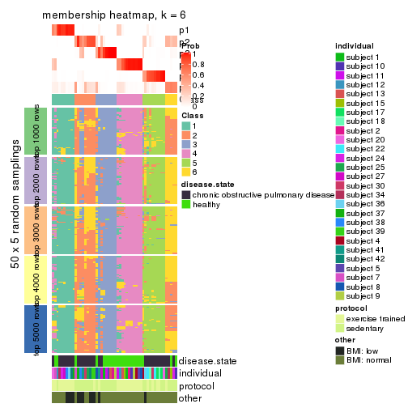</p>

</div>
</div>

As soon as we have had the classes for columns, we can look for signatures
which are significantly different between classes which can be candidate marks
for certain classes. Following are the heatmaps for signatures.


Signature heatmaps where rows are scaled:


<script>
$( function() {
	$( '#tabs-MAD-skmeans-get-signatures' ).tabs();
} );
</script>
<div id='tabs-MAD-skmeans-get-signatures'>
<ul>
<li><a href='#tab-MAD-skmeans-get-signatures-1'>k = 2</a></li>
<li><a href='#tab-MAD-skmeans-get-signatures-2'>k = 3</a></li>
<li><a href='#tab-MAD-skmeans-get-signatures-3'>k = 4</a></li>
<li><a href='#tab-MAD-skmeans-get-signatures-4'>k = 5</a></li>
<li><a href='#tab-MAD-skmeans-get-signatures-5'>k = 6</a></li>
</ul>
<div id='tab-MAD-skmeans-get-signatures-1'>
<pre><code class="r">get_signatures(res, k = 2)
</code></pre>

<p>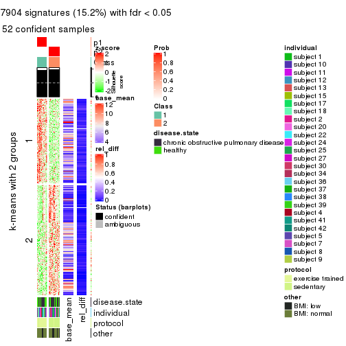</p>

</div>
<div id='tab-MAD-skmeans-get-signatures-2'>
<pre><code class="r">get_signatures(res, k = 3)
</code></pre>

<p>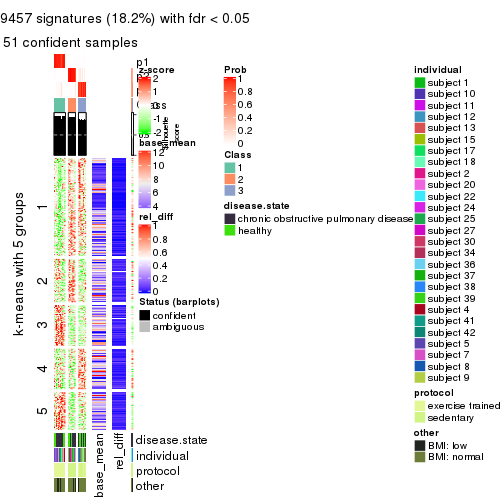</p>

</div>
<div id='tab-MAD-skmeans-get-signatures-3'>
<pre><code class="r">get_signatures(res, k = 4)
</code></pre>

<p></p>

</div>
<div id='tab-MAD-skmeans-get-signatures-4'>
<pre><code class="r">get_signatures(res, k = 5)
</code></pre>

<p>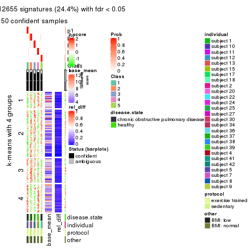</p>

</div>
<div id='tab-MAD-skmeans-get-signatures-5'>
<pre><code class="r">get_signatures(res, k = 6)
</code></pre>

<p>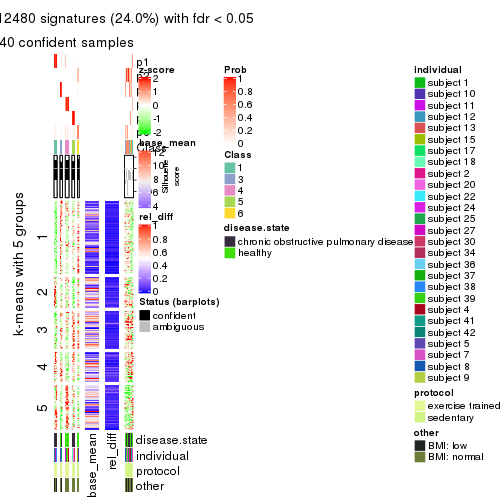</p>

</div>
</div>


Signature heatmaps where rows are not scaled:


<script>
$( function() {
	$( '#tabs-MAD-skmeans-get-signatures-no-scale' ).tabs();
} );
</script>
<div id='tabs-MAD-skmeans-get-signatures-no-scale'>
<ul>
<li><a href='#tab-MAD-skmeans-get-signatures-no-scale-1'>k = 2</a></li>
<li><a href='#tab-MAD-skmeans-get-signatures-no-scale-2'>k = 3</a></li>
<li><a href='#tab-MAD-skmeans-get-signatures-no-scale-3'>k = 4</a></li>
<li><a href='#tab-MAD-skmeans-get-signatures-no-scale-4'>k = 5</a></li>
<li><a href='#tab-MAD-skmeans-get-signatures-no-scale-5'>k = 6</a></li>
</ul>
<div id='tab-MAD-skmeans-get-signatures-no-scale-1'>
<pre><code class="r">get_signatures(res, k = 2, scale_rows = FALSE)
</code></pre>

<p>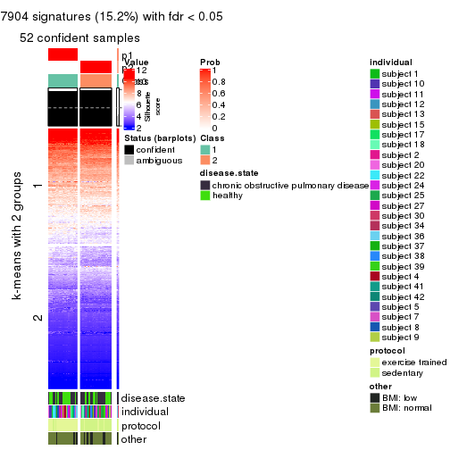</p>

</div>
<div id='tab-MAD-skmeans-get-signatures-no-scale-2'>
<pre><code class="r">get_signatures(res, k = 3, scale_rows = FALSE)
</code></pre>

<p>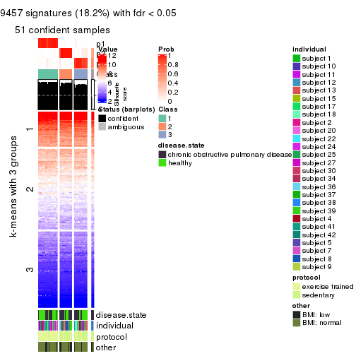</p>

</div>
<div id='tab-MAD-skmeans-get-signatures-no-scale-3'>
<pre><code class="r">get_signatures(res, k = 4, scale_rows = FALSE)
</code></pre>

<p>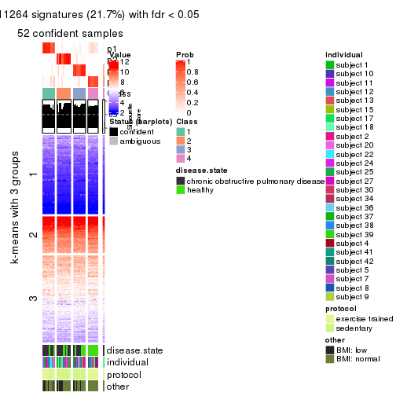</p>

</div>
<div id='tab-MAD-skmeans-get-signatures-no-scale-4'>
<pre><code class="r">get_signatures(res, k = 5, scale_rows = FALSE)
</code></pre>

<p>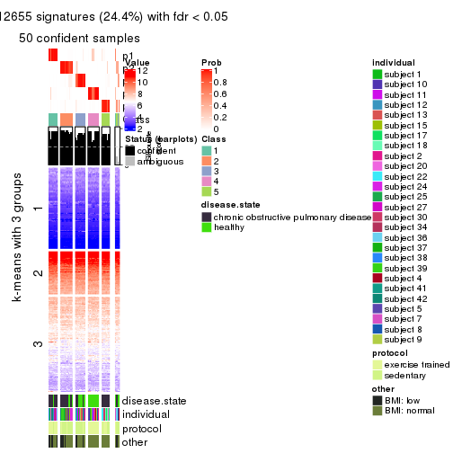</p>

</div>
<div id='tab-MAD-skmeans-get-signatures-no-scale-5'>
<pre><code class="r">get_signatures(res, k = 6, scale_rows = FALSE)
</code></pre>

<p>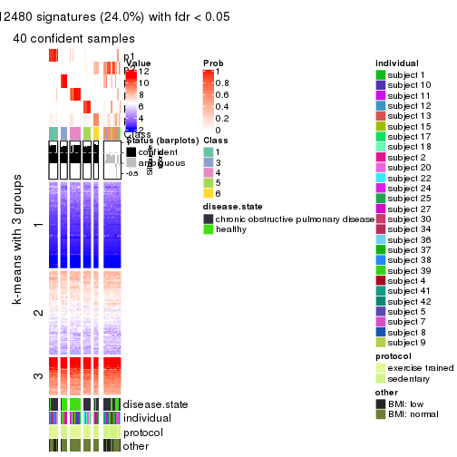</p>

</div>
</div>


Compare the overlap of signatures from different k:

```r
compare_signatures(res)
```

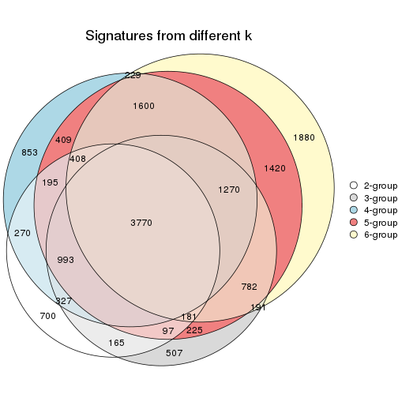

`get_signature()` returns a data frame invisibly. TO get the list of signatures, the function
call should be assigned to a variable explicitly. In following code, if `plot` argument is set
to `FALSE`, no heatmap is plotted while only the differential analysis is performed.

```r
# code only for demonstration
tb = get_signature(res, k = ..., plot = FALSE)
```

An example of the output of `tb` is:

```
#>   which_row         fdr    mean_1    mean_2 scaled_mean_1 scaled_mean_2 km
#> 1        38 0.042760348  8.373488  9.131774    -0.5533452     0.5164555  1
#> 2        40 0.018707592  7.106213  8.469186    -0.6173731     0.5762149  1
#> 3        55 0.019134737 10.221463 11.207825    -0.6159697     0.5749050  1
#> 4        59 0.006059896  5.921854  7.869574    -0.6899429     0.6439467  1
#> 5        60 0.018055526  8.928898 10.211722    -0.6204761     0.5791110  1
#> 6        98 0.009384629 15.714769 14.887706     0.6635654    -0.6193277  2
...
```

The columns in `tb` are:

1. `which_row`: row indices corresponding to the input matrix.
2. `fdr`: FDR for the differential test. 
3. `mean_x`: The mean value in group x.
4. `scaled_mean_x`: The mean value in group x after rows are scaled.
5. `km`: Row groups if k-means clustering is applied to rows.


UMAP plot which shows how samples are separated.


<script>
$( function() {
	$( '#tabs-MAD-skmeans-dimension-reduction' ).tabs();
} );
</script>
<div id='tabs-MAD-skmeans-dimension-reduction'>
<ul>
<li><a href='#tab-MAD-skmeans-dimension-reduction-1'>k = 2</a></li>
<li><a href='#tab-MAD-skmeans-dimension-reduction-2'>k = 3</a></li>
<li><a href='#tab-MAD-skmeans-dimension-reduction-3'>k = 4</a></li>
<li><a href='#tab-MAD-skmeans-dimension-reduction-4'>k = 5</a></li>
<li><a href='#tab-MAD-skmeans-dimension-reduction-5'>k = 6</a></li>
</ul>
<div id='tab-MAD-skmeans-dimension-reduction-1'>
<pre><code class="r">dimension_reduction(res, k = 2, method = &quot;UMAP&quot;)
</code></pre>

<p>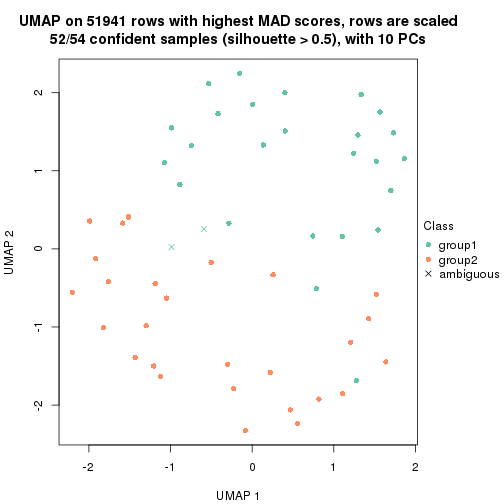</p>

</div>
<div id='tab-MAD-skmeans-dimension-reduction-2'>
<pre><code class="r">dimension_reduction(res, k = 3, method = &quot;UMAP&quot;)
</code></pre>

<p>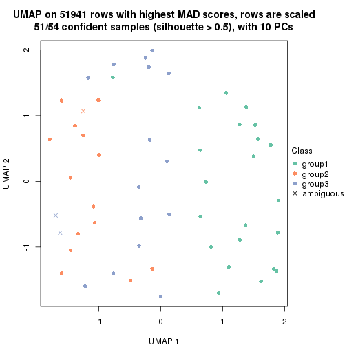</p>

</div>
<div id='tab-MAD-skmeans-dimension-reduction-3'>
<pre><code class="r">dimension_reduction(res, k = 4, method = &quot;UMAP&quot;)
</code></pre>

<p>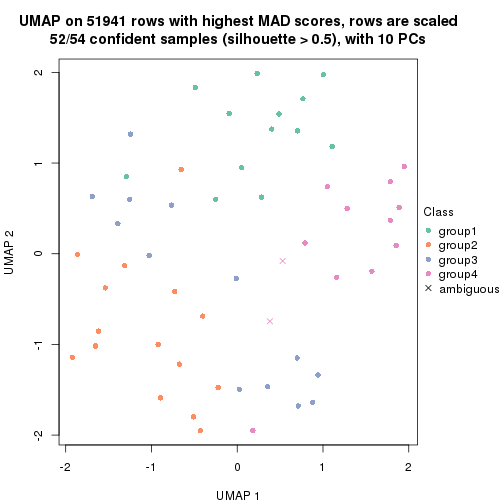</p>

</div>
<div id='tab-MAD-skmeans-dimension-reduction-4'>
<pre><code class="r">dimension_reduction(res, k = 5, method = &quot;UMAP&quot;)
</code></pre>

<p>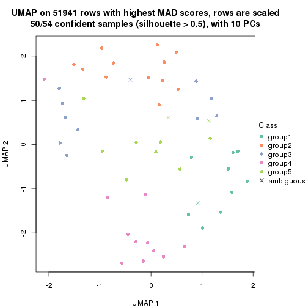</p>

</div>
<div id='tab-MAD-skmeans-dimension-reduction-5'>
<pre><code class="r">dimension_reduction(res, k = 6, method = &quot;UMAP&quot;)
</code></pre>

<p>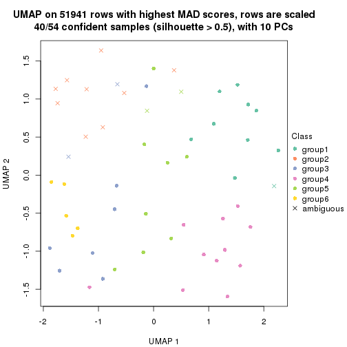</p>

</div>
</div>


Following heatmap shows how subgroups are split when increasing `k`:

```r
collect_classes(res)
```

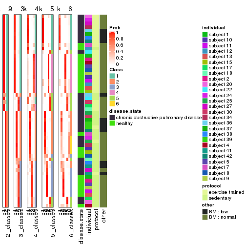


Test correlation between subgroups and known annotations. If the known
annotation is numeric, one-way ANOVA test is applied, and if the known
annotation is discrete, chi-squared contingency table test is applied.

```r
test_to_known_factors(res)
```

```
#>              n disease.state(p) individual(p) protocol(p) other(p) k
#> MAD:skmeans 52         5.92e-01         0.992    2.84e-08   0.5921 2
#> MAD:skmeans 51         2.02e-01         0.710    6.43e-07   0.3002 3
#> MAD:skmeans 52         1.41e-04         0.710    1.49e-07   0.2016 4
#> MAD:skmeans 50         1.76e-05         0.190    1.17e-05   0.0546 5
#> MAD:skmeans 40         1.13e-05         0.394    3.79e-04   0.0185 6
```


If matrix rows can be associated to genes, consider to use `functional_enrichment(res,
...)` to perform function enrichment for the signature genes. See [this vignette](http://bioconductor.org/packages/devel/bioc/vignettes/cola/inst/doc/functional_enrichment.html) for more detailed explanations.


 

---------------------------------------------------


### MAD:pam*


The object with results only for a single top-value method and a single partition method 
can be extracted as:

```r
res = res_list["MAD", "pam"]
# you can also extract it by
# res = res_list["MAD:pam"]
```

A summary of `res` and all the functions that can be applied to it:

```r
res
```

```
#> A 'ConsensusPartition' object with k = 2, 3, 4, 5, 6.
#>   On a matrix with 51941 rows and 54 columns.
#>   Top rows (1000, 2000, 3000, 4000, 5000) are extracted by 'MAD' method.
#>   Subgroups are detected by 'pam' method.
#>   Performed in total 1250 partitions by row resampling.
#>   Best k for subgroups seems to be 4.
#> 
#> Following methods can be applied to this 'ConsensusPartition' object:
#>  [1] "cola_report"             "collect_classes"         "collect_plots"          
#>  [4] "collect_stats"           "colnames"                "compare_signatures"     
#>  [7] "consensus_heatmap"       "dimension_reduction"     "functional_enrichment"  
#> [10] "get_anno_col"            "get_anno"                "get_classes"            
#> [13] "get_consensus"           "get_matrix"              "get_membership"         
#> [16] "get_param"               "get_signatures"          "get_stats"              
#> [19] "is_best_k"               "is_stable_k"             "membership_heatmap"     
#> [22] "ncol"                    "nrow"                    "plot_ecdf"              
#> [25] "rownames"                "select_partition_number" "show"                   
#> [28] "suggest_best_k"          "test_to_known_factors"
```

`collect_plots()` function collects all the plots made from `res` for all `k` (number of partitions)
into one single page to provide an easy and fast comparison between different `k`.

```r
collect_plots(res)
```

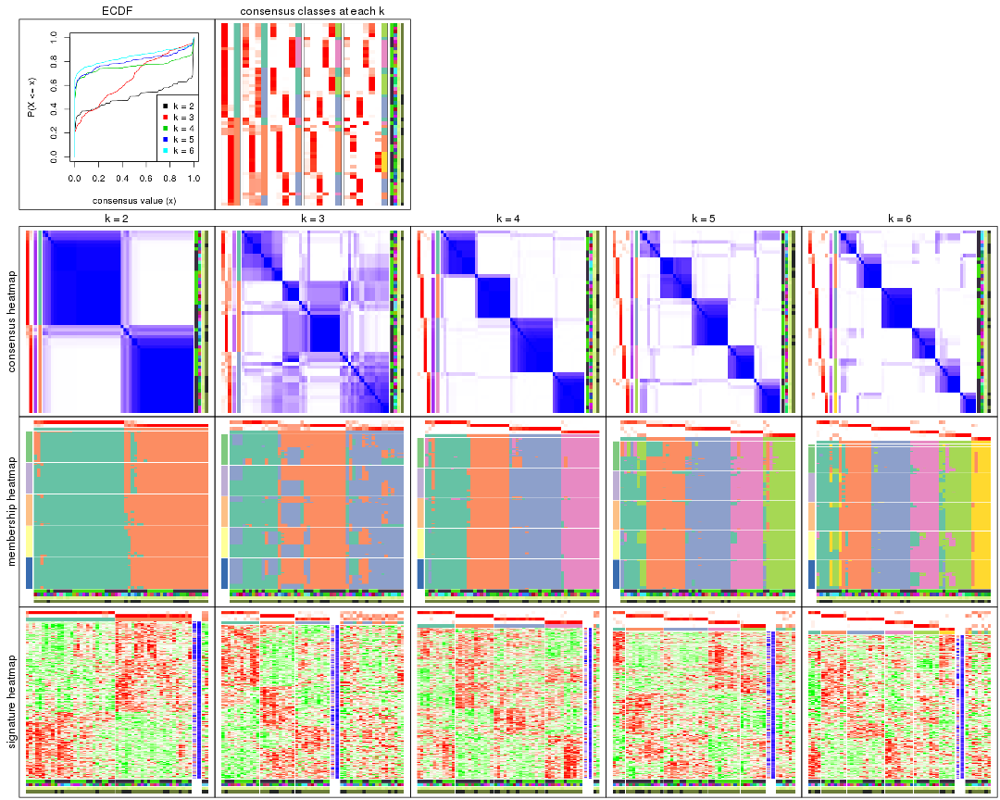

The plots are:

- The first row: a plot of the ECDF (empirical cumulative distribution
  function) curves of the consensus matrix for each `k` and the heatmap of
  predicted classes for each `k`.
- The second row: heatmaps of the consensus matrix for each `k`.
- The third row: heatmaps of the membership matrix for each `k`.
- The fouth row: heatmaps of the signatures for each `k`.

All the plots in panels can be made by individual functions and they are
plotted later in this section.

`select_partition_number()` produces several plots showing different
statistics for choosing "optimized" `k`. There are following statistics:

- ECDF curves of the consensus matrix for each `k`;
- 1-PAC. [The PAC
  score](https://en.wikipedia.org/wiki/Consensus_clustering#Over-interpretation_potential_of_consensus_clustering)
  measures the proportion of the ambiguous subgrouping.
- Mean silhouette score.
- Concordance. The mean probability of fiting the consensus class ids in all
  partitions.
- Area increased. Denote $A_k$ as the area under the ECDF curve for current
  `k`, the area increased is defined as $A_k - A_{k-1}$.
- Rand index. The percent of pairs of samples that are both in a same cluster
  or both are not in a same cluster in the partition of k and k-1.
- Jaccard index. The ratio of pairs of samples are both in a same cluster in
  the partition of k and k-1 and the pairs of samples are both in a same
  cluster in the partition k or k-1.

The detailed explanations of these statistics can be found in [the _cola_
vignette](http://bioconductor.org/packages/devel/bioc/vignettes/cola/inst/doc/cola.html#toc_13).

Generally speaking, lower PAC score, higher mean silhouette score or higher
concordance corresponds to better partition. Rand index and Jaccard index
measure how similar the current partition is compared to partition with `k-1`.
If they are too similar, we won't accept `k` is better than `k-1`.

```r
select_partition_number(res)
```

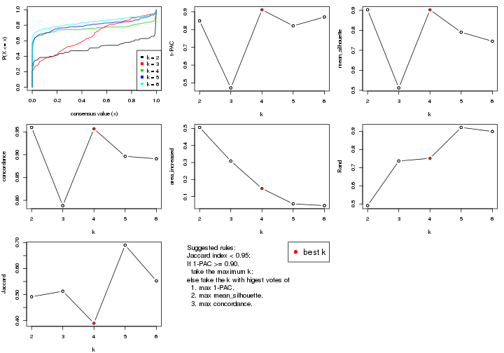

The numeric values for all these statistics can be obtained by `get_stats()`.

```r
get_stats(res)
```

```
#>   k 1-PAC mean_silhouette concordance area_increased  Rand Jaccard
#> 2 2 0.849           0.903       0.960         0.5063 0.491   0.491
#> 3 3 0.472           0.512       0.789         0.3090 0.737   0.513
#> 4 4 0.911           0.902       0.957         0.1473 0.751   0.389
#> 5 5 0.821           0.790       0.896         0.0569 0.921   0.690
#> 6 6 0.871           0.745       0.891         0.0468 0.899   0.552
```

`suggest_best_k()` suggests the best $k$ based on these statistics. The rules are as follows:

- All $k$ with Jaccard index larger than 0.95 are removed because increasing
  $k$ does not provide enough extra information. If all $k$ are removed, it is
  marked as no subgroup is detected.
- For all $k$ with 1-PAC score larger than 0.9, the maximal $k$ is taken as
  the best $k$, and other $k$ are marked as optional $k$.
- If it does not fit the second rule. The $k$ with the maximal vote of the
  highest 1-PAC score, highest mean silhouette, and highest concordance is
  taken as the best $k$.

```r
suggest_best_k(res)
```

```
#> [1] 4
```


Following shows the table of the partitions (You need to click the **show/hide
code output** link to see it). The membership matrix (columns with name `p*`)
is inferred by
[`clue::cl_consensus()`](https://www.rdocumentation.org/link/cl_consensus?package=clue)
function with the `SE` method. Basically the value in the membership matrix
represents the probability to belong to a certain group. The finall class
label for an item is determined with the group with highest probability it
belongs to.

In `get_classes()` function, the entropy is calculated from the membership
matrix and the silhouette score is calculated from the consensus matrix.


<script>
$( function() {
	$( '#tabs-MAD-pam-get-classes' ).tabs();
} );
</script>
<div id='tabs-MAD-pam-get-classes'>
<ul>
<li><a href='#tab-MAD-pam-get-classes-1'>k = 2</a></li>
<li><a href='#tab-MAD-pam-get-classes-2'>k = 3</a></li>
<li><a href='#tab-MAD-pam-get-classes-3'>k = 4</a></li>
<li><a href='#tab-MAD-pam-get-classes-4'>k = 5</a></li>
<li><a href='#tab-MAD-pam-get-classes-5'>k = 6</a></li>
</ul>

<div id='tab-MAD-pam-get-classes-1'>
<p><a id='tab-MAD-pam-get-classes-1-a' style='color:#0366d6' href='#'>show/hide code output</a></p>
<pre><code class="r">cbind(get_classes(res, k = 2), get_membership(res, k = 2))
</code></pre>

<pre><code>#&gt;           class entropy silhouette    p1    p2
#&gt; GSM680053     1  0.0376      0.974 0.996 0.004
#&gt; GSM680062     1  0.0376      0.974 0.996 0.004
#&gt; GSM680054     2  0.2778      0.902 0.048 0.952
#&gt; GSM680063     1  0.0376      0.974 0.996 0.004
#&gt; GSM680055     1  0.0376      0.974 0.996 0.004
#&gt; GSM680064     1  0.0000      0.975 1.000 0.000
#&gt; GSM680056     1  0.0376      0.974 0.996 0.004
#&gt; GSM680065     1  0.0000      0.975 1.000 0.000
#&gt; GSM680057     2  0.0000      0.935 0.000 1.000
#&gt; GSM680066     2  0.0000      0.935 0.000 1.000
#&gt; GSM680058     2  0.0000      0.935 0.000 1.000
#&gt; GSM680067     2  0.0000      0.935 0.000 1.000
#&gt; GSM680059     2  0.1414      0.922 0.020 0.980
#&gt; GSM680068     1  0.0000      0.975 1.000 0.000
#&gt; GSM680060     2  0.0000      0.935 0.000 1.000
#&gt; GSM680069     1  0.0376      0.974 0.996 0.004
#&gt; GSM680061     2  0.0000      0.935 0.000 1.000
#&gt; GSM680070     1  0.0000      0.975 1.000 0.000
#&gt; GSM680071     2  0.9954      0.167 0.460 0.540
#&gt; GSM680077     2  0.9933      0.221 0.452 0.548
#&gt; GSM680072     2  0.0000      0.935 0.000 1.000
#&gt; GSM680078     1  0.0000      0.975 1.000 0.000
#&gt; GSM680073     2  0.7453      0.720 0.212 0.788
#&gt; GSM680079     1  0.0000      0.975 1.000 0.000
#&gt; GSM680074     2  0.0000      0.935 0.000 1.000
#&gt; GSM680080     2  0.0000      0.935 0.000 1.000
#&gt; GSM680075     1  0.0672      0.971 0.992 0.008
#&gt; GSM680081     2  0.0000      0.935 0.000 1.000
#&gt; GSM680076     2  0.0000      0.935 0.000 1.000
#&gt; GSM680082     2  0.2948      0.900 0.052 0.948
#&gt; GSM680029     1  0.5842      0.830 0.860 0.140
#&gt; GSM680041     1  0.0000      0.975 1.000 0.000
#&gt; GSM680035     2  0.0000      0.935 0.000 1.000
#&gt; GSM680047     1  0.0000      0.975 1.000 0.000
#&gt; GSM680036     1  0.6712      0.777 0.824 0.176
#&gt; GSM680048     1  0.0000      0.975 1.000 0.000
#&gt; GSM680037     1  0.0376      0.974 0.996 0.004
#&gt; GSM680049     1  0.8267      0.629 0.740 0.260
#&gt; GSM680038     2  0.0000      0.935 0.000 1.000
#&gt; GSM680050     1  0.0000      0.975 1.000 0.000
#&gt; GSM680039     2  0.0000      0.935 0.000 1.000
#&gt; GSM680051     2  0.8813      0.567 0.300 0.700
#&gt; GSM680040     2  0.0000      0.935 0.000 1.000
#&gt; GSM680052     1  0.0000      0.975 1.000 0.000
#&gt; GSM680030     2  0.0000      0.935 0.000 1.000
#&gt; GSM680042     1  0.0000      0.975 1.000 0.000
#&gt; GSM680031     1  0.1414      0.961 0.980 0.020
#&gt; GSM680043     1  0.0000      0.975 1.000 0.000
#&gt; GSM680032     2  0.0000      0.935 0.000 1.000
#&gt; GSM680044     1  0.0000      0.975 1.000 0.000
#&gt; GSM680033     2  0.0000      0.935 0.000 1.000
#&gt; GSM680045     1  0.0000      0.975 1.000 0.000
#&gt; GSM680034     2  0.0000      0.935 0.000 1.000
#&gt; GSM680046     1  0.0000      0.975 1.000 0.000
</code></pre>

<script>
$('#tab-MAD-pam-get-classes-1-a').parent().next().next().hide();
$('#tab-MAD-pam-get-classes-1-a').click(function(){
  $('#tab-MAD-pam-get-classes-1-a').parent().next().next().toggle();
  return(false);
});
</script>
</div>

<div id='tab-MAD-pam-get-classes-2'>
<p><a id='tab-MAD-pam-get-classes-2-a' style='color:#0366d6' href='#'>show/hide code output</a></p>
<pre><code class="r">cbind(get_classes(res, k = 3), get_membership(res, k = 3))
</code></pre>

<pre><code>#&gt;           class entropy silhouette    p1    p2    p3
#&gt; GSM680053     3  0.2486     0.6594 0.060 0.008 0.932
#&gt; GSM680062     3  0.4136     0.6065 0.116 0.020 0.864
#&gt; GSM680054     2  0.4605     0.4980 0.000 0.796 0.204
#&gt; GSM680063     3  0.6887     0.4847 0.060 0.236 0.704
#&gt; GSM680055     3  0.2486     0.6594 0.060 0.008 0.932
#&gt; GSM680064     1  0.4605     0.7082 0.796 0.000 0.204
#&gt; GSM680056     3  0.4725     0.6296 0.060 0.088 0.852
#&gt; GSM680065     3  0.2261     0.6548 0.068 0.000 0.932
#&gt; GSM680057     2  0.0000     0.7157 0.000 1.000 0.000
#&gt; GSM680066     3  0.9710    -0.0499 0.220 0.372 0.408
#&gt; GSM680058     2  0.0000     0.7157 0.000 1.000 0.000
#&gt; GSM680067     2  0.0000     0.7157 0.000 1.000 0.000
#&gt; GSM680059     3  0.6308    -0.2117 0.000 0.492 0.508
#&gt; GSM680068     1  0.2066     0.6874 0.940 0.000 0.060
#&gt; GSM680060     2  0.0000     0.7157 0.000 1.000 0.000
#&gt; GSM680069     3  0.7092     0.5173 0.084 0.208 0.708
#&gt; GSM680061     2  0.0000     0.7157 0.000 1.000 0.000
#&gt; GSM680070     1  0.0000     0.7230 1.000 0.000 0.000
#&gt; GSM680071     2  0.6129     0.2785 0.008 0.668 0.324
#&gt; GSM680077     2  0.9137     0.1874 0.276 0.536 0.188
#&gt; GSM680072     2  0.0592     0.7079 0.000 0.988 0.012
#&gt; GSM680078     3  0.4702     0.5657 0.212 0.000 0.788
#&gt; GSM680073     3  0.6111     0.0787 0.000 0.396 0.604
#&gt; GSM680079     3  0.5968     0.4049 0.364 0.000 0.636
#&gt; GSM680074     2  0.0000     0.7157 0.000 1.000 0.000
#&gt; GSM680080     2  0.0000     0.7157 0.000 1.000 0.000
#&gt; GSM680075     3  0.0747     0.6760 0.000 0.016 0.984
#&gt; GSM680081     2  0.6309     0.1588 0.000 0.504 0.496
#&gt; GSM680076     2  0.0000     0.7157 0.000 1.000 0.000
#&gt; GSM680082     1  0.2066     0.6932 0.940 0.060 0.000
#&gt; GSM680029     3  0.4796     0.4830 0.000 0.220 0.780
#&gt; GSM680041     1  0.6180     0.5314 0.584 0.000 0.416
#&gt; GSM680035     2  0.6309     0.1588 0.000 0.504 0.496
#&gt; GSM680047     1  0.6302     0.4429 0.520 0.000 0.480
#&gt; GSM680036     3  0.1964     0.6754 0.000 0.056 0.944
#&gt; GSM680048     1  0.6302     0.4429 0.520 0.000 0.480
#&gt; GSM680037     3  0.1031     0.6766 0.000 0.024 0.976
#&gt; GSM680049     1  0.1753     0.7021 0.952 0.048 0.000
#&gt; GSM680038     2  0.0000     0.7157 0.000 1.000 0.000
#&gt; GSM680050     3  0.8675    -0.2930 0.388 0.108 0.504
#&gt; GSM680039     2  0.6126     0.3090 0.000 0.600 0.400
#&gt; GSM680051     1  0.5803     0.5597 0.736 0.248 0.016
#&gt; GSM680040     2  0.6309     0.1588 0.000 0.504 0.496
#&gt; GSM680052     1  0.4702     0.7137 0.788 0.000 0.212
#&gt; GSM680030     2  0.0000     0.7157 0.000 1.000 0.000
#&gt; GSM680042     1  0.4702     0.7137 0.788 0.000 0.212
#&gt; GSM680031     3  0.3043     0.6629 0.008 0.084 0.908
#&gt; GSM680043     1  0.0000     0.7230 1.000 0.000 0.000
#&gt; GSM680032     2  0.8102     0.2789 0.076 0.556 0.368
#&gt; GSM680044     1  0.6302     0.4429 0.520 0.000 0.480
#&gt; GSM680033     2  0.6309     0.1588 0.000 0.504 0.496
#&gt; GSM680045     1  0.4702     0.7137 0.788 0.000 0.212
#&gt; GSM680034     2  0.6180     0.2007 0.416 0.584 0.000
#&gt; GSM680046     1  0.0000     0.7230 1.000 0.000 0.000
</code></pre>

<script>
$('#tab-MAD-pam-get-classes-2-a').parent().next().next().hide();
$('#tab-MAD-pam-get-classes-2-a').click(function(){
  $('#tab-MAD-pam-get-classes-2-a').parent().next().next().toggle();
  return(false);
});
</script>
</div>

<div id='tab-MAD-pam-get-classes-3'>
<p><a id='tab-MAD-pam-get-classes-3-a' style='color:#0366d6' href='#'>show/hide code output</a></p>
<pre><code class="r">cbind(get_classes(res, k = 4), get_membership(res, k = 4))
</code></pre>

<pre><code>#&gt;           class entropy silhouette    p1    p2    p3    p4
#&gt; GSM680053     1  0.0592     0.9160 0.984 0.000 0.016 0.000
#&gt; GSM680062     1  0.0000     0.9198 1.000 0.000 0.000 0.000
#&gt; GSM680054     1  0.4877     0.3020 0.592 0.408 0.000 0.000
#&gt; GSM680063     1  0.0000     0.9198 1.000 0.000 0.000 0.000
#&gt; GSM680055     1  0.0592     0.9160 0.984 0.000 0.016 0.000
#&gt; GSM680064     4  0.3649     0.7424 0.204 0.000 0.000 0.796
#&gt; GSM680056     1  0.0000     0.9198 1.000 0.000 0.000 0.000
#&gt; GSM680065     1  0.0000     0.9198 1.000 0.000 0.000 0.000
#&gt; GSM680057     2  0.0188     0.9547 0.000 0.996 0.004 0.000
#&gt; GSM680066     3  0.2949     0.8922 0.000 0.088 0.888 0.024
#&gt; GSM680058     2  0.0000     0.9566 0.000 1.000 0.000 0.000
#&gt; GSM680067     2  0.0000     0.9566 0.000 1.000 0.000 0.000
#&gt; GSM680059     3  0.0000     0.9615 0.000 0.000 1.000 0.000
#&gt; GSM680068     4  0.0000     0.9678 0.000 0.000 0.000 1.000
#&gt; GSM680060     2  0.0000     0.9566 0.000 1.000 0.000 0.000
#&gt; GSM680069     1  0.4771     0.7034 0.768 0.036 0.192 0.004
#&gt; GSM680061     2  0.0188     0.9547 0.000 0.996 0.004 0.000
#&gt; GSM680070     4  0.0188     0.9667 0.004 0.000 0.000 0.996
#&gt; GSM680071     2  0.0188     0.9537 0.004 0.996 0.000 0.000
#&gt; GSM680077     2  0.5285     0.0736 0.468 0.524 0.000 0.008
#&gt; GSM680072     2  0.0000     0.9566 0.000 1.000 0.000 0.000
#&gt; GSM680078     3  0.0188     0.9603 0.000 0.000 0.996 0.004
#&gt; GSM680073     3  0.1022     0.9457 0.000 0.032 0.968 0.000
#&gt; GSM680079     3  0.0779     0.9535 0.016 0.000 0.980 0.004
#&gt; GSM680074     2  0.0000     0.9566 0.000 1.000 0.000 0.000
#&gt; GSM680080     2  0.0000     0.9566 0.000 1.000 0.000 0.000
#&gt; GSM680075     3  0.0000     0.9615 0.000 0.000 1.000 0.000
#&gt; GSM680081     3  0.0000     0.9615 0.000 0.000 1.000 0.000
#&gt; GSM680076     2  0.0000     0.9566 0.000 1.000 0.000 0.000
#&gt; GSM680082     4  0.0592     0.9582 0.016 0.000 0.000 0.984
#&gt; GSM680029     3  0.0000     0.9615 0.000 0.000 1.000 0.000
#&gt; GSM680041     1  0.3486     0.7425 0.812 0.000 0.000 0.188
#&gt; GSM680035     3  0.0000     0.9615 0.000 0.000 1.000 0.000
#&gt; GSM680047     1  0.0707     0.9155 0.980 0.000 0.000 0.020
#&gt; GSM680036     3  0.0188     0.9606 0.000 0.004 0.996 0.000
#&gt; GSM680048     1  0.0707     0.9156 0.980 0.000 0.000 0.020
#&gt; GSM680037     3  0.0188     0.9601 0.004 0.000 0.996 0.000
#&gt; GSM680049     4  0.0000     0.9678 0.000 0.000 0.000 1.000
#&gt; GSM680038     2  0.0000     0.9566 0.000 1.000 0.000 0.000
#&gt; GSM680050     1  0.0000     0.9198 1.000 0.000 0.000 0.000
#&gt; GSM680039     3  0.3074     0.8381 0.000 0.152 0.848 0.000
#&gt; GSM680051     4  0.0188     0.9665 0.000 0.000 0.004 0.996
#&gt; GSM680040     3  0.0000     0.9615 0.000 0.000 1.000 0.000
#&gt; GSM680052     4  0.0188     0.9673 0.004 0.000 0.000 0.996
#&gt; GSM680030     2  0.0188     0.9547 0.000 0.996 0.004 0.000
#&gt; GSM680042     4  0.0188     0.9673 0.004 0.000 0.000 0.996
#&gt; GSM680031     3  0.1557     0.9261 0.056 0.000 0.944 0.000
#&gt; GSM680043     4  0.0000     0.9678 0.000 0.000 0.000 1.000
#&gt; GSM680032     3  0.4999     0.8070 0.012 0.100 0.792 0.096
#&gt; GSM680044     1  0.0592     0.9167 0.984 0.000 0.000 0.016
#&gt; GSM680033     3  0.0188     0.9607 0.000 0.004 0.996 0.000
#&gt; GSM680045     4  0.0188     0.9673 0.004 0.000 0.000 0.996
#&gt; GSM680034     4  0.2334     0.8834 0.000 0.088 0.004 0.908
#&gt; GSM680046     4  0.0000     0.9678 0.000 0.000 0.000 1.000
</code></pre>

<script>
$('#tab-MAD-pam-get-classes-3-a').parent().next().next().hide();
$('#tab-MAD-pam-get-classes-3-a').click(function(){
  $('#tab-MAD-pam-get-classes-3-a').parent().next().next().toggle();
  return(false);
});
</script>
</div>

<div id='tab-MAD-pam-get-classes-4'>
<p><a id='tab-MAD-pam-get-classes-4-a' style='color:#0366d6' href='#'>show/hide code output</a></p>
<pre><code class="r">cbind(get_classes(res, k = 5), get_membership(res, k = 5))
</code></pre>

<pre><code>#&gt;           class entropy silhouette    p1    p2    p3    p4    p5
#&gt; GSM680053     5  0.0000      0.813 0.000 0.000 0.000 0.000 1.000
#&gt; GSM680062     5  0.0000      0.813 0.000 0.000 0.000 0.000 1.000
#&gt; GSM680054     5  0.4949      0.306 0.032 0.396 0.000 0.000 0.572
#&gt; GSM680063     5  0.0000      0.813 0.000 0.000 0.000 0.000 1.000
#&gt; GSM680055     5  0.0000      0.813 0.000 0.000 0.000 0.000 1.000
#&gt; GSM680064     1  0.3630      0.600 0.780 0.000 0.000 0.204 0.016
#&gt; GSM680056     1  0.4300      0.312 0.524 0.000 0.000 0.000 0.476
#&gt; GSM680065     1  0.4300      0.312 0.524 0.000 0.000 0.000 0.476
#&gt; GSM680057     2  0.0880      0.927 0.032 0.968 0.000 0.000 0.000
#&gt; GSM680066     3  0.5665      0.599 0.184 0.140 0.664 0.012 0.000
#&gt; GSM680058     2  0.2074      0.923 0.104 0.896 0.000 0.000 0.000
#&gt; GSM680067     2  0.0000      0.934 0.000 1.000 0.000 0.000 0.000
#&gt; GSM680059     3  0.0000      0.938 0.000 0.000 1.000 0.000 0.000
#&gt; GSM680068     4  0.2516      0.842 0.140 0.000 0.000 0.860 0.000
#&gt; GSM680060     2  0.0703      0.936 0.024 0.976 0.000 0.000 0.000
#&gt; GSM680069     5  0.7107     -0.327 0.376 0.036 0.160 0.000 0.428
#&gt; GSM680061     2  0.0880      0.927 0.032 0.968 0.000 0.000 0.000
#&gt; GSM680070     4  0.2966      0.798 0.184 0.000 0.000 0.816 0.000
#&gt; GSM680071     2  0.0963      0.919 0.036 0.964 0.000 0.000 0.000
#&gt; GSM680077     1  0.2513      0.638 0.876 0.008 0.000 0.000 0.116
#&gt; GSM680072     2  0.2074      0.923 0.104 0.896 0.000 0.000 0.000
#&gt; GSM680078     3  0.1608      0.888 0.072 0.000 0.928 0.000 0.000
#&gt; GSM680073     3  0.1121      0.910 0.000 0.044 0.956 0.000 0.000
#&gt; GSM680079     1  0.2605      0.617 0.852 0.000 0.148 0.000 0.000
#&gt; GSM680074     2  0.2074      0.923 0.104 0.896 0.000 0.000 0.000
#&gt; GSM680080     2  0.2230      0.924 0.116 0.884 0.000 0.000 0.000
#&gt; GSM680075     3  0.0000      0.938 0.000 0.000 1.000 0.000 0.000
#&gt; GSM680081     3  0.0000      0.938 0.000 0.000 1.000 0.000 0.000
#&gt; GSM680076     2  0.2074      0.923 0.104 0.896 0.000 0.000 0.000
#&gt; GSM680082     1  0.2471      0.625 0.864 0.000 0.000 0.136 0.000
#&gt; GSM680029     3  0.0000      0.938 0.000 0.000 1.000 0.000 0.000
#&gt; GSM680041     5  0.2891      0.627 0.000 0.000 0.000 0.176 0.824
#&gt; GSM680035     3  0.0000      0.938 0.000 0.000 1.000 0.000 0.000
#&gt; GSM680047     5  0.0510      0.807 0.000 0.000 0.000 0.016 0.984
#&gt; GSM680036     3  0.0510      0.931 0.000 0.016 0.984 0.000 0.000
#&gt; GSM680048     5  0.0510      0.807 0.000 0.000 0.000 0.016 0.984
#&gt; GSM680037     3  0.0000      0.938 0.000 0.000 1.000 0.000 0.000
#&gt; GSM680049     4  0.0000      0.936 0.000 0.000 0.000 1.000 0.000
#&gt; GSM680038     2  0.1041      0.925 0.032 0.964 0.004 0.000 0.000
#&gt; GSM680050     1  0.4489      0.375 0.572 0.000 0.000 0.008 0.420
#&gt; GSM680039     3  0.3694      0.740 0.032 0.172 0.796 0.000 0.000
#&gt; GSM680051     4  0.0000      0.936 0.000 0.000 0.000 1.000 0.000
#&gt; GSM680040     3  0.0000      0.938 0.000 0.000 1.000 0.000 0.000
#&gt; GSM680052     4  0.0000      0.936 0.000 0.000 0.000 1.000 0.000
#&gt; GSM680030     2  0.0880      0.927 0.032 0.968 0.000 0.000 0.000
#&gt; GSM680042     4  0.0000      0.936 0.000 0.000 0.000 1.000 0.000
#&gt; GSM680031     3  0.1341      0.898 0.000 0.000 0.944 0.000 0.056
#&gt; GSM680043     4  0.0404      0.931 0.000 0.000 0.000 0.988 0.012
#&gt; GSM680032     1  0.5754      0.389 0.588 0.120 0.292 0.000 0.000
#&gt; GSM680044     5  0.0000      0.813 0.000 0.000 0.000 0.000 1.000
#&gt; GSM680033     3  0.0000      0.938 0.000 0.000 1.000 0.000 0.000
#&gt; GSM680045     4  0.0162      0.935 0.000 0.000 0.000 0.996 0.004
#&gt; GSM680034     4  0.3366      0.757 0.032 0.140 0.000 0.828 0.000
#&gt; GSM680046     4  0.0000      0.936 0.000 0.000 0.000 1.000 0.000
</code></pre>

<script>
$('#tab-MAD-pam-get-classes-4-a').parent().next().next().hide();
$('#tab-MAD-pam-get-classes-4-a').click(function(){
  $('#tab-MAD-pam-get-classes-4-a').parent().next().next().toggle();
  return(false);
});
</script>
</div>

<div id='tab-MAD-pam-get-classes-5'>
<p><a id='tab-MAD-pam-get-classes-5-a' style='color:#0366d6' href='#'>show/hide code output</a></p>
<pre><code class="r">cbind(get_classes(res, k = 6), get_membership(res, k = 6))
</code></pre>

<pre><code>#&gt;           class entropy silhouette    p1    p2    p3    p4    p5    p6
#&gt; GSM680053     5  0.0000     0.7702 0.000 0.000 0.000 0.000 1.000 0.000
#&gt; GSM680062     5  0.0000     0.7702 0.000 0.000 0.000 0.000 1.000 0.000
#&gt; GSM680054     2  0.0000     0.8607 0.000 1.000 0.000 0.000 0.000 0.000
#&gt; GSM680063     5  0.0000     0.7702 0.000 0.000 0.000 0.000 1.000 0.000
#&gt; GSM680055     5  0.0000     0.7702 0.000 0.000 0.000 0.000 1.000 0.000
#&gt; GSM680064     1  0.3073     0.6637 0.840 0.000 0.000 0.080 0.080 0.000
#&gt; GSM680056     1  0.3727     0.4177 0.612 0.000 0.000 0.000 0.388 0.000
#&gt; GSM680065     1  0.3727     0.4177 0.612 0.000 0.000 0.000 0.388 0.000
#&gt; GSM680057     2  0.0000     0.8607 0.000 1.000 0.000 0.000 0.000 0.000
#&gt; GSM680066     2  0.4067     0.5908 0.260 0.700 0.040 0.000 0.000 0.000
#&gt; GSM680058     6  0.0000     0.8658 0.000 0.000 0.000 0.000 0.000 1.000
#&gt; GSM680067     2  0.3833     0.1185 0.000 0.556 0.000 0.000 0.000 0.444
#&gt; GSM680059     3  0.0000     0.9862 0.000 0.000 1.000 0.000 0.000 0.000
#&gt; GSM680068     4  0.3175     0.7533 0.256 0.000 0.000 0.744 0.000 0.000
#&gt; GSM680060     6  0.2340     0.7526 0.000 0.148 0.000 0.000 0.000 0.852
#&gt; GSM680069     5  0.6120    -0.0287 0.364 0.000 0.172 0.000 0.448 0.016
#&gt; GSM680061     2  0.0000     0.8607 0.000 1.000 0.000 0.000 0.000 0.000
#&gt; GSM680070     4  0.3531     0.6756 0.328 0.000 0.000 0.672 0.000 0.000
#&gt; GSM680071     1  0.5329     0.0215 0.452 0.104 0.000 0.000 0.000 0.444
#&gt; GSM680077     1  0.0000     0.7071 1.000 0.000 0.000 0.000 0.000 0.000
#&gt; GSM680072     6  0.0000     0.8658 0.000 0.000 0.000 0.000 0.000 1.000
#&gt; GSM680078     3  0.1204     0.9405 0.056 0.000 0.944 0.000 0.000 0.000
#&gt; GSM680073     3  0.0632     0.9697 0.000 0.000 0.976 0.000 0.000 0.024
#&gt; GSM680079     1  0.0547     0.6995 0.980 0.000 0.020 0.000 0.000 0.000
#&gt; GSM680074     6  0.0000     0.8658 0.000 0.000 0.000 0.000 0.000 1.000
#&gt; GSM680080     6  0.3659     0.3657 0.000 0.364 0.000 0.000 0.000 0.636
#&gt; GSM680075     3  0.0000     0.9862 0.000 0.000 1.000 0.000 0.000 0.000
#&gt; GSM680081     3  0.0000     0.9862 0.000 0.000 1.000 0.000 0.000 0.000
#&gt; GSM680076     6  0.0000     0.8658 0.000 0.000 0.000 0.000 0.000 1.000
#&gt; GSM680082     1  0.0000     0.7071 1.000 0.000 0.000 0.000 0.000 0.000
#&gt; GSM680029     3  0.0000     0.9862 0.000 0.000 1.000 0.000 0.000 0.000
#&gt; GSM680041     5  0.3175     0.6093 0.000 0.000 0.000 0.256 0.744 0.000
#&gt; GSM680035     3  0.0000     0.9862 0.000 0.000 1.000 0.000 0.000 0.000
#&gt; GSM680047     5  0.3050     0.6552 0.000 0.000 0.000 0.236 0.764 0.000
#&gt; GSM680036     3  0.0146     0.9843 0.000 0.000 0.996 0.000 0.000 0.004
#&gt; GSM680048     5  0.2527     0.6944 0.000 0.000 0.000 0.168 0.832 0.000
#&gt; GSM680037     3  0.0000     0.9862 0.000 0.000 1.000 0.000 0.000 0.000
#&gt; GSM680049     4  0.0000     0.8761 0.000 0.000 0.000 1.000 0.000 0.000
#&gt; GSM680038     2  0.0146     0.8588 0.000 0.996 0.000 0.000 0.000 0.004
#&gt; GSM680050     5  0.4407    -0.1111 0.480 0.000 0.000 0.024 0.496 0.000
#&gt; GSM680039     2  0.0146     0.8586 0.000 0.996 0.004 0.000 0.000 0.000
#&gt; GSM680051     4  0.0000     0.8761 0.000 0.000 0.000 1.000 0.000 0.000
#&gt; GSM680040     3  0.0000     0.9862 0.000 0.000 1.000 0.000 0.000 0.000
#&gt; GSM680052     4  0.1075     0.8607 0.000 0.000 0.000 0.952 0.048 0.000
#&gt; GSM680030     2  0.0000     0.8607 0.000 1.000 0.000 0.000 0.000 0.000
#&gt; GSM680042     4  0.0000     0.8761 0.000 0.000 0.000 1.000 0.000 0.000
#&gt; GSM680031     3  0.1204     0.9376 0.000 0.000 0.944 0.000 0.056 0.000
#&gt; GSM680043     4  0.3403     0.7769 0.212 0.000 0.000 0.768 0.020 0.000
#&gt; GSM680032     2  0.3482     0.4995 0.316 0.684 0.000 0.000 0.000 0.000
#&gt; GSM680044     5  0.0000     0.7702 0.000 0.000 0.000 0.000 1.000 0.000
#&gt; GSM680033     3  0.0146     0.9840 0.000 0.004 0.996 0.000 0.000 0.000
#&gt; GSM680045     4  0.1444     0.8458 0.000 0.000 0.000 0.928 0.072 0.000
#&gt; GSM680034     2  0.0000     0.8607 0.000 1.000 0.000 0.000 0.000 0.000
#&gt; GSM680046     4  0.0000     0.8761 0.000 0.000 0.000 1.000 0.000 0.000
</code></pre>

<script>
$('#tab-MAD-pam-get-classes-5-a').parent().next().next().hide();
$('#tab-MAD-pam-get-classes-5-a').click(function(){
  $('#tab-MAD-pam-get-classes-5-a').parent().next().next().toggle();
  return(false);
});
</script>
</div>
</div>

Heatmaps for the consensus matrix. It visualizes the probability of two
samples to be in a same group.


<script>
$( function() {
	$( '#tabs-MAD-pam-consensus-heatmap' ).tabs();
} );
</script>
<div id='tabs-MAD-pam-consensus-heatmap'>
<ul>
<li><a href='#tab-MAD-pam-consensus-heatmap-1'>k = 2</a></li>
<li><a href='#tab-MAD-pam-consensus-heatmap-2'>k = 3</a></li>
<li><a href='#tab-MAD-pam-consensus-heatmap-3'>k = 4</a></li>
<li><a href='#tab-MAD-pam-consensus-heatmap-4'>k = 5</a></li>
<li><a href='#tab-MAD-pam-consensus-heatmap-5'>k = 6</a></li>
</ul>
<div id='tab-MAD-pam-consensus-heatmap-1'>
<pre><code class="r">consensus_heatmap(res, k = 2)
</code></pre>

<p>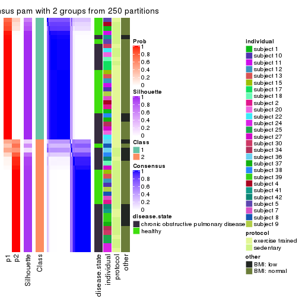</p>

</div>
<div id='tab-MAD-pam-consensus-heatmap-2'>
<pre><code class="r">consensus_heatmap(res, k = 3)
</code></pre>

<p>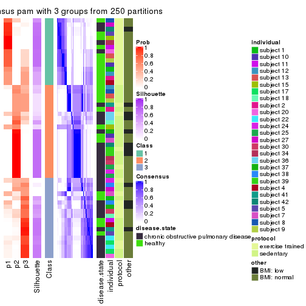</p>

</div>
<div id='tab-MAD-pam-consensus-heatmap-3'>
<pre><code class="r">consensus_heatmap(res, k = 4)
</code></pre>

<p>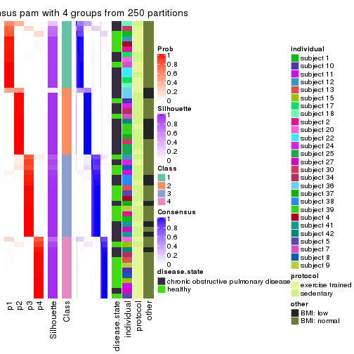</p>

</div>
<div id='tab-MAD-pam-consensus-heatmap-4'>
<pre><code class="r">consensus_heatmap(res, k = 5)
</code></pre>

<p>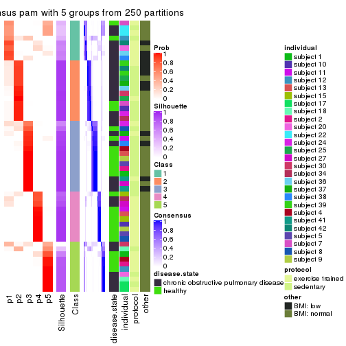</p>

</div>
<div id='tab-MAD-pam-consensus-heatmap-5'>
<pre><code class="r">consensus_heatmap(res, k = 6)
</code></pre>

<p>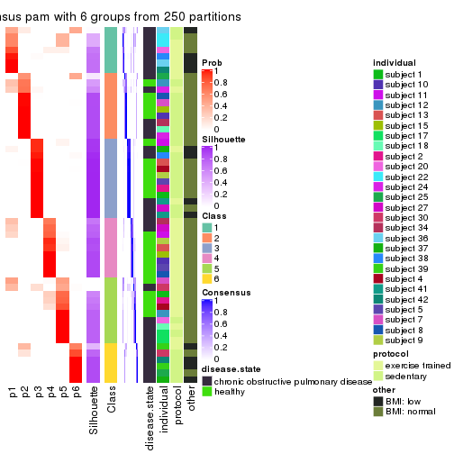</p>

</div>
</div>

Heatmaps for the membership of samples in all partitions to see how consistent they are:


<script>
$( function() {
	$( '#tabs-MAD-pam-membership-heatmap' ).tabs();
} );
</script>
<div id='tabs-MAD-pam-membership-heatmap'>
<ul>
<li><a href='#tab-MAD-pam-membership-heatmap-1'>k = 2</a></li>
<li><a href='#tab-MAD-pam-membership-heatmap-2'>k = 3</a></li>
<li><a href='#tab-MAD-pam-membership-heatmap-3'>k = 4</a></li>
<li><a href='#tab-MAD-pam-membership-heatmap-4'>k = 5</a></li>
<li><a href='#tab-MAD-pam-membership-heatmap-5'>k = 6</a></li>
</ul>
<div id='tab-MAD-pam-membership-heatmap-1'>
<pre><code class="r">membership_heatmap(res, k = 2)
</code></pre>

<p>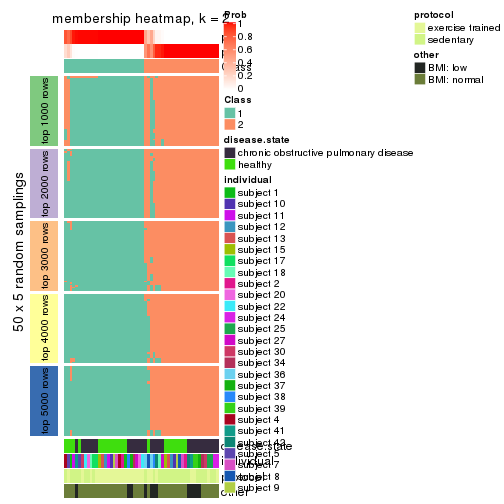</p>

</div>
<div id='tab-MAD-pam-membership-heatmap-2'>
<pre><code class="r">membership_heatmap(res, k = 3)
</code></pre>

<p>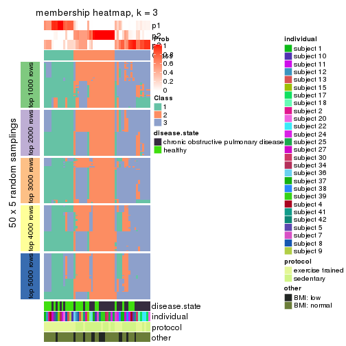</p>

</div>
<div id='tab-MAD-pam-membership-heatmap-3'>
<pre><code class="r">membership_heatmap(res, k = 4)
</code></pre>

<p>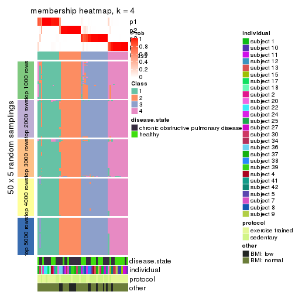</p>

</div>
<div id='tab-MAD-pam-membership-heatmap-4'>
<pre><code class="r">membership_heatmap(res, k = 5)
</code></pre>

<p>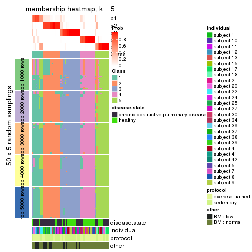</p>

</div>
<div id='tab-MAD-pam-membership-heatmap-5'>
<pre><code class="r">membership_heatmap(res, k = 6)
</code></pre>

<p>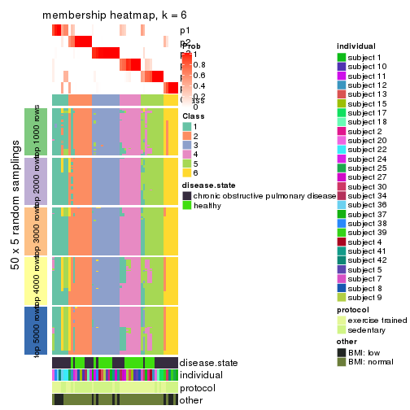</p>

</div>
</div>

As soon as we have had the classes for columns, we can look for signatures
which are significantly different between classes which can be candidate marks
for certain classes. Following are the heatmaps for signatures.


Signature heatmaps where rows are scaled:


<script>
$( function() {
	$( '#tabs-MAD-pam-get-signatures' ).tabs();
} );
</script>
<div id='tabs-MAD-pam-get-signatures'>
<ul>
<li><a href='#tab-MAD-pam-get-signatures-1'>k = 2</a></li>
<li><a href='#tab-MAD-pam-get-signatures-2'>k = 3</a></li>
<li><a href='#tab-MAD-pam-get-signatures-3'>k = 4</a></li>
<li><a href='#tab-MAD-pam-get-signatures-4'>k = 5</a></li>
<li><a href='#tab-MAD-pam-get-signatures-5'>k = 6</a></li>
</ul>
<div id='tab-MAD-pam-get-signatures-1'>
<pre><code class="r">get_signatures(res, k = 2)
</code></pre>

<p>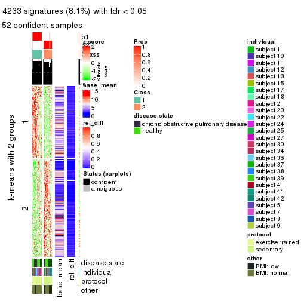</p>

</div>
<div id='tab-MAD-pam-get-signatures-2'>
<pre><code class="r">get_signatures(res, k = 3)
</code></pre>

<p>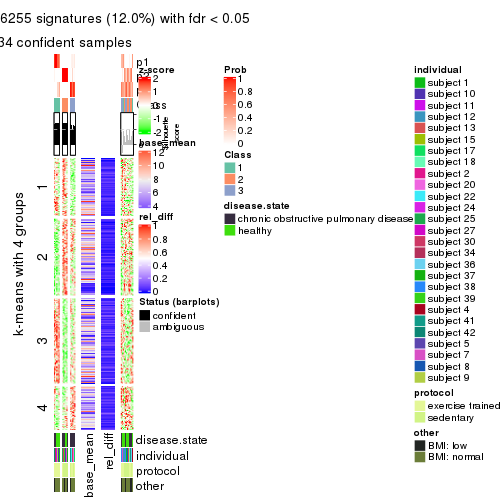</p>

</div>
<div id='tab-MAD-pam-get-signatures-3'>
<pre><code class="r">get_signatures(res, k = 4)
</code></pre>

<p>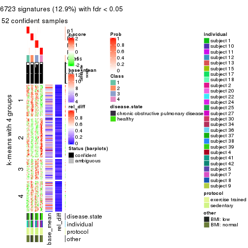</p>

</div>
<div id='tab-MAD-pam-get-signatures-4'>
<pre><code class="r">get_signatures(res, k = 5)
</code></pre>

<p>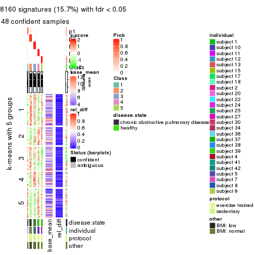</p>

</div>
<div id='tab-MAD-pam-get-signatures-5'>
<pre><code class="r">get_signatures(res, k = 6)
</code></pre>

<p>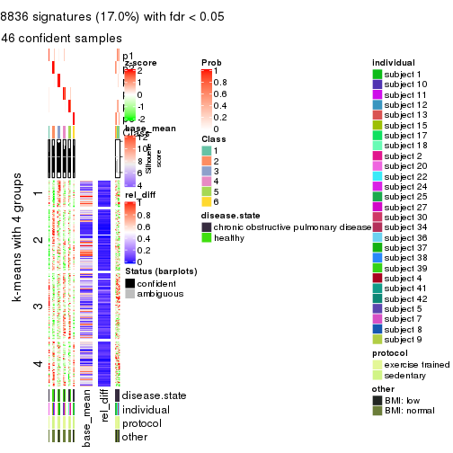</p>

</div>
</div>


Signature heatmaps where rows are not scaled:


<script>
$( function() {
	$( '#tabs-MAD-pam-get-signatures-no-scale' ).tabs();
} );
</script>
<div id='tabs-MAD-pam-get-signatures-no-scale'>
<ul>
<li><a href='#tab-MAD-pam-get-signatures-no-scale-1'>k = 2</a></li>
<li><a href='#tab-MAD-pam-get-signatures-no-scale-2'>k = 3</a></li>
<li><a href='#tab-MAD-pam-get-signatures-no-scale-3'>k = 4</a></li>
<li><a href='#tab-MAD-pam-get-signatures-no-scale-4'>k = 5</a></li>
<li><a href='#tab-MAD-pam-get-signatures-no-scale-5'>k = 6</a></li>
</ul>
<div id='tab-MAD-pam-get-signatures-no-scale-1'>
<pre><code class="r">get_signatures(res, k = 2, scale_rows = FALSE)
</code></pre>

<p>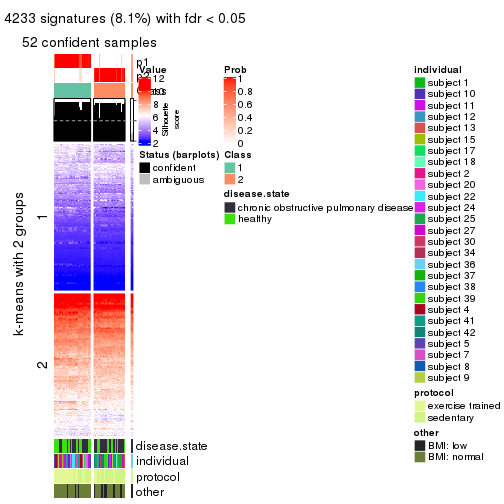</p>

</div>
<div id='tab-MAD-pam-get-signatures-no-scale-2'>
<pre><code class="r">get_signatures(res, k = 3, scale_rows = FALSE)
</code></pre>

<p>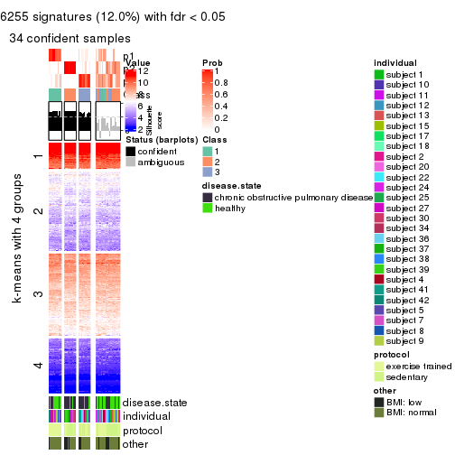</p>

</div>
<div id='tab-MAD-pam-get-signatures-no-scale-3'>
<pre><code class="r">get_signatures(res, k = 4, scale_rows = FALSE)
</code></pre>

<p>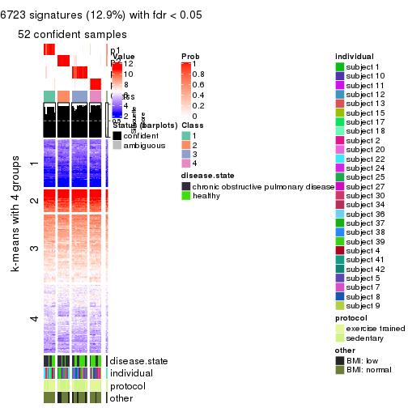</p>

</div>
<div id='tab-MAD-pam-get-signatures-no-scale-4'>
<pre><code class="r">get_signatures(res, k = 5, scale_rows = FALSE)
</code></pre>

<p>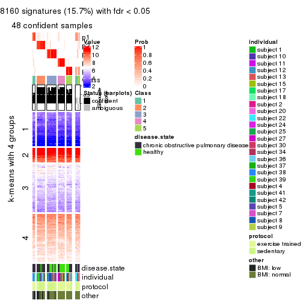</p>

</div>
<div id='tab-MAD-pam-get-signatures-no-scale-5'>
<pre><code class="r">get_signatures(res, k = 6, scale_rows = FALSE)
</code></pre>

<p>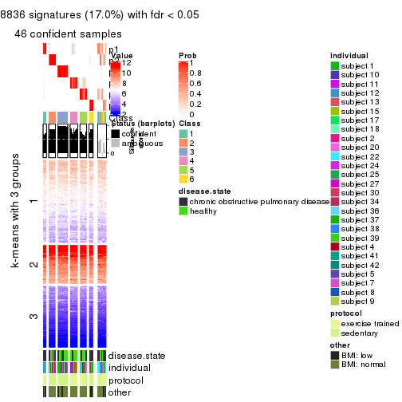</p>

</div>
</div>


Compare the overlap of signatures from different k:

```r
compare_signatures(res)
```

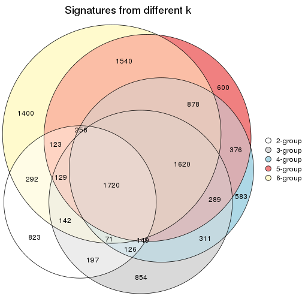

`get_signature()` returns a data frame invisibly. TO get the list of signatures, the function
call should be assigned to a variable explicitly. In following code, if `plot` argument is set
to `FALSE`, no heatmap is plotted while only the differential analysis is performed.

```r
# code only for demonstration
tb = get_signature(res, k = ..., plot = FALSE)
```

An example of the output of `tb` is:

```
#>   which_row         fdr    mean_1    mean_2 scaled_mean_1 scaled_mean_2 km
#> 1        38 0.042760348  8.373488  9.131774    -0.5533452     0.5164555  1
#> 2        40 0.018707592  7.106213  8.469186    -0.6173731     0.5762149  1
#> 3        55 0.019134737 10.221463 11.207825    -0.6159697     0.5749050  1
#> 4        59 0.006059896  5.921854  7.869574    -0.6899429     0.6439467  1
#> 5        60 0.018055526  8.928898 10.211722    -0.6204761     0.5791110  1
#> 6        98 0.009384629 15.714769 14.887706     0.6635654    -0.6193277  2
...
```

The columns in `tb` are:

1. `which_row`: row indices corresponding to the input matrix.
2. `fdr`: FDR for the differential test. 
3. `mean_x`: The mean value in group x.
4. `scaled_mean_x`: The mean value in group x after rows are scaled.
5. `km`: Row groups if k-means clustering is applied to rows.


UMAP plot which shows how samples are separated.


<script>
$( function() {
	$( '#tabs-MAD-pam-dimension-reduction' ).tabs();
} );
</script>
<div id='tabs-MAD-pam-dimension-reduction'>
<ul>
<li><a href='#tab-MAD-pam-dimension-reduction-1'>k = 2</a></li>
<li><a href='#tab-MAD-pam-dimension-reduction-2'>k = 3</a></li>
<li><a href='#tab-MAD-pam-dimension-reduction-3'>k = 4</a></li>
<li><a href='#tab-MAD-pam-dimension-reduction-4'>k = 5</a></li>
<li><a href='#tab-MAD-pam-dimension-reduction-5'>k = 6</a></li>
</ul>
<div id='tab-MAD-pam-dimension-reduction-1'>
<pre><code class="r">dimension_reduction(res, k = 2, method = &quot;UMAP&quot;)
</code></pre>

<p>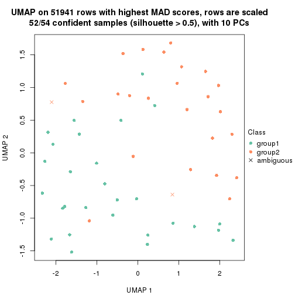</p>

</div>
<div id='tab-MAD-pam-dimension-reduction-2'>
<pre><code class="r">dimension_reduction(res, k = 3, method = &quot;UMAP&quot;)
</code></pre>

<p>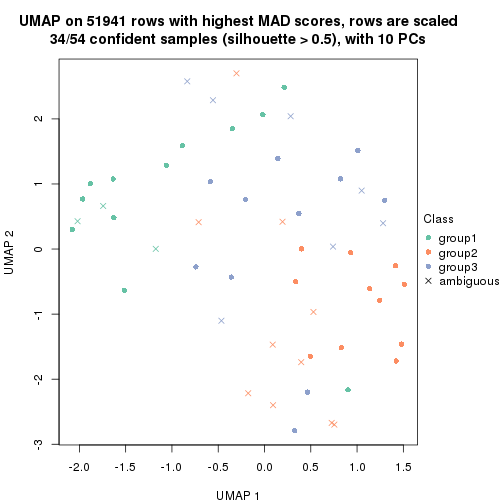</p>

</div>
<div id='tab-MAD-pam-dimension-reduction-3'>
<pre><code class="r">dimension_reduction(res, k = 4, method = &quot;UMAP&quot;)
</code></pre>

<p>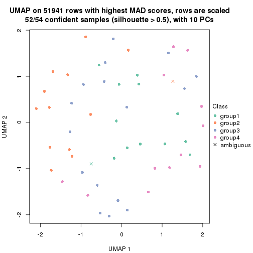</p>

</div>
<div id='tab-MAD-pam-dimension-reduction-4'>
<pre><code class="r">dimension_reduction(res, k = 5, method = &quot;UMAP&quot;)
</code></pre>

<p>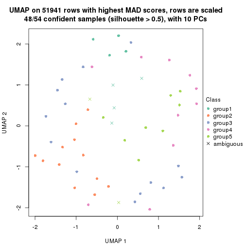</p>

</div>
<div id='tab-MAD-pam-dimension-reduction-5'>
<pre><code class="r">dimension_reduction(res, k = 6, method = &quot;UMAP&quot;)
</code></pre>

<p>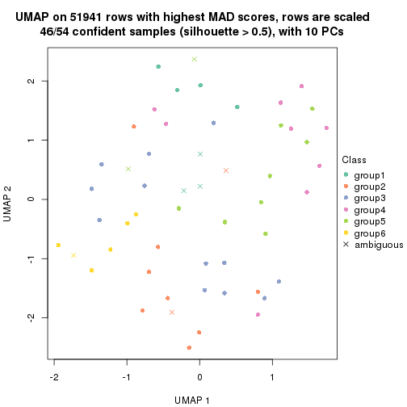</p>

</div>
</div>


Following heatmap shows how subgroups are split when increasing `k`:

```r
collect_classes(res)
```

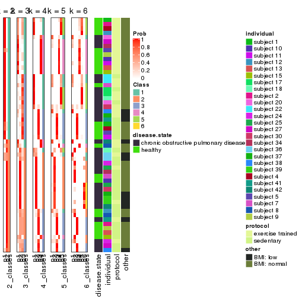


Test correlation between subgroups and known annotations. If the known
annotation is numeric, one-way ANOVA test is applied, and if the known
annotation is discrete, chi-squared contingency table test is applied.

```r
test_to_known_factors(res)
```

```
#>          n disease.state(p) individual(p) protocol(p) other(p) k
#> MAD:pam 52           0.3789         0.529    2.21e-03  0.18345 2
#> MAD:pam 34           0.0380         0.385    1.83e-04  0.24468 3
#> MAD:pam 52           0.0724         0.288    1.23e-04  0.03830 4
#> MAD:pam 48           0.0114         0.366    1.74e-04  0.01031 5
#> MAD:pam 46           0.0342         0.303    1.61e-05  0.00204 6
```


If matrix rows can be associated to genes, consider to use `functional_enrichment(res,
...)` to perform function enrichment for the signature genes. See [this vignette](http://bioconductor.org/packages/devel/bioc/vignettes/cola/inst/doc/functional_enrichment.html) for more detailed explanations.


 

---------------------------------------------------


### MAD:mclust


The object with results only for a single top-value method and a single partition method 
can be extracted as:

```r
res = res_list["MAD", "mclust"]
# you can also extract it by
# res = res_list["MAD:mclust"]
```

A summary of `res` and all the functions that can be applied to it:

```r
res
```

```
#> A 'ConsensusPartition' object with k = 2, 3, 4, 5, 6.
#>   On a matrix with 51941 rows and 54 columns.
#>   Top rows (1000, 2000, 3000, 4000, 5000) are extracted by 'MAD' method.
#>   Subgroups are detected by 'mclust' method.
#>   Performed in total 1250 partitions by row resampling.
#>   Best k for subgroups seems to be 4.
#> 
#> Following methods can be applied to this 'ConsensusPartition' object:
#>  [1] "cola_report"             "collect_classes"         "collect_plots"          
#>  [4] "collect_stats"           "colnames"                "compare_signatures"     
#>  [7] "consensus_heatmap"       "dimension_reduction"     "functional_enrichment"  
#> [10] "get_anno_col"            "get_anno"                "get_classes"            
#> [13] "get_consensus"           "get_matrix"              "get_membership"         
#> [16] "get_param"               "get_signatures"          "get_stats"              
#> [19] "is_best_k"               "is_stable_k"             "membership_heatmap"     
#> [22] "ncol"                    "nrow"                    "plot_ecdf"              
#> [25] "rownames"                "select_partition_number" "show"                   
#> [28] "suggest_best_k"          "test_to_known_factors"
```

`collect_plots()` function collects all the plots made from `res` for all `k` (number of partitions)
into one single page to provide an easy and fast comparison between different `k`.

```r
collect_plots(res)
```

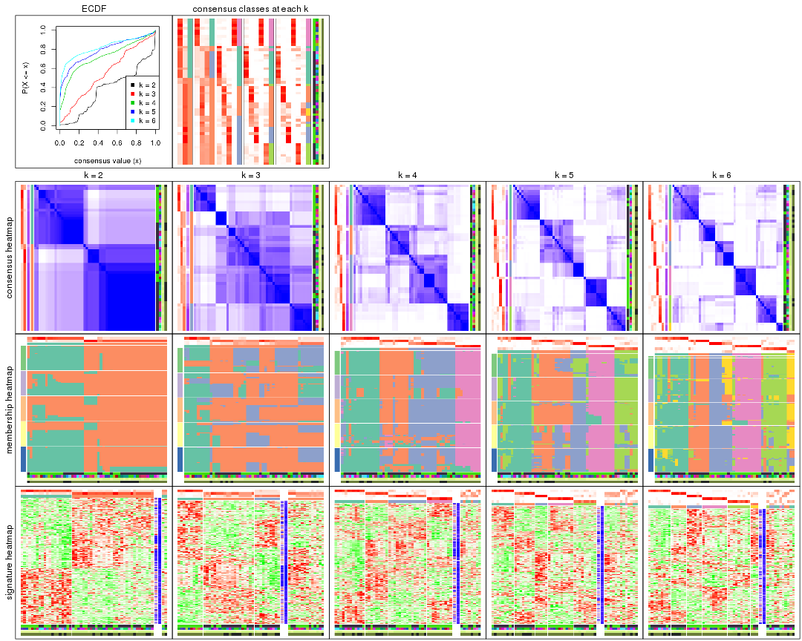

The plots are:

- The first row: a plot of the ECDF (empirical cumulative distribution
  function) curves of the consensus matrix for each `k` and the heatmap of
  predicted classes for each `k`.
- The second row: heatmaps of the consensus matrix for each `k`.
- The third row: heatmaps of the membership matrix for each `k`.
- The fouth row: heatmaps of the signatures for each `k`.

All the plots in panels can be made by individual functions and they are
plotted later in this section.

`select_partition_number()` produces several plots showing different
statistics for choosing "optimized" `k`. There are following statistics:

- ECDF curves of the consensus matrix for each `k`;
- 1-PAC. [The PAC
  score](https://en.wikipedia.org/wiki/Consensus_clustering#Over-interpretation_potential_of_consensus_clustering)
  measures the proportion of the ambiguous subgrouping.
- Mean silhouette score.
- Concordance. The mean probability of fiting the consensus class ids in all
  partitions.
- Area increased. Denote $A_k$ as the area under the ECDF curve for current
  `k`, the area increased is defined as $A_k - A_{k-1}$.
- Rand index. The percent of pairs of samples that are both in a same cluster
  or both are not in a same cluster in the partition of k and k-1.
- Jaccard index. The ratio of pairs of samples are both in a same cluster in
  the partition of k and k-1 and the pairs of samples are both in a same
  cluster in the partition k or k-1.

The detailed explanations of these statistics can be found in [the _cola_
vignette](http://bioconductor.org/packages/devel/bioc/vignettes/cola/inst/doc/cola.html#toc_13).

Generally speaking, lower PAC score, higher mean silhouette score or higher
concordance corresponds to better partition. Rand index and Jaccard index
measure how similar the current partition is compared to partition with `k-1`.
If they are too similar, we won't accept `k` is better than `k-1`.

```r
select_partition_number(res)
```

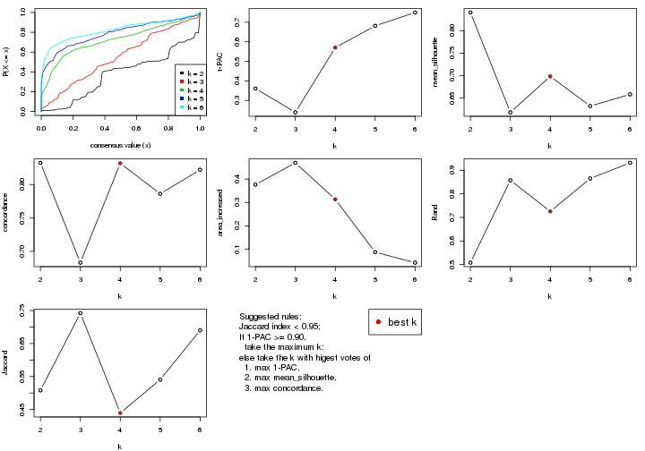

The numeric values for all these statistics can be obtained by `get_stats()`.

```r
get_stats(res)
```

```
#>   k 1-PAC mean_silhouette concordance area_increased  Rand Jaccard
#> 2 2 0.361           0.840       0.833         0.3762 0.508   0.508
#> 3 3 0.239           0.618       0.683         0.4691 0.857   0.742
#> 4 4 0.570           0.698       0.832         0.3135 0.725   0.439
#> 5 5 0.682           0.632       0.786         0.0879 0.865   0.540
#> 6 6 0.750           0.658       0.822         0.0433 0.932   0.690
```

`suggest_best_k()` suggests the best $k$ based on these statistics. The rules are as follows:

- All $k$ with Jaccard index larger than 0.95 are removed because increasing
  $k$ does not provide enough extra information. If all $k$ are removed, it is
  marked as no subgroup is detected.
- For all $k$ with 1-PAC score larger than 0.9, the maximal $k$ is taken as
  the best $k$, and other $k$ are marked as optional $k$.
- If it does not fit the second rule. The $k$ with the maximal vote of the
  highest 1-PAC score, highest mean silhouette, and highest concordance is
  taken as the best $k$.

```r
suggest_best_k(res)
```

```
#> [1] 4
```


Following shows the table of the partitions (You need to click the **show/hide
code output** link to see it). The membership matrix (columns with name `p*`)
is inferred by
[`clue::cl_consensus()`](https://www.rdocumentation.org/link/cl_consensus?package=clue)
function with the `SE` method. Basically the value in the membership matrix
represents the probability to belong to a certain group. The finall class
label for an item is determined with the group with highest probability it
belongs to.

In `get_classes()` function, the entropy is calculated from the membership
matrix and the silhouette score is calculated from the consensus matrix.


<script>
$( function() {
	$( '#tabs-MAD-mclust-get-classes' ).tabs();
} );
</script>
<div id='tabs-MAD-mclust-get-classes'>
<ul>
<li><a href='#tab-MAD-mclust-get-classes-1'>k = 2</a></li>
<li><a href='#tab-MAD-mclust-get-classes-2'>k = 3</a></li>
<li><a href='#tab-MAD-mclust-get-classes-3'>k = 4</a></li>
<li><a href='#tab-MAD-mclust-get-classes-4'>k = 5</a></li>
<li><a href='#tab-MAD-mclust-get-classes-5'>k = 6</a></li>
</ul>

<div id='tab-MAD-mclust-get-classes-1'>
<p><a id='tab-MAD-mclust-get-classes-1-a' style='color:#0366d6' href='#'>show/hide code output</a></p>
<pre><code class="r">cbind(get_classes(res, k = 2), get_membership(res, k = 2))
</code></pre>

<pre><code>#&gt;           class entropy silhouette    p1    p2
#&gt; GSM680053     2  0.7139      0.924 0.196 0.804
#&gt; GSM680062     2  0.7299      0.915 0.204 0.796
#&gt; GSM680054     2  0.7139      0.924 0.196 0.804
#&gt; GSM680063     2  0.7139      0.924 0.196 0.804
#&gt; GSM680055     2  0.7139      0.924 0.196 0.804
#&gt; GSM680064     1  0.6887      0.874 0.816 0.184
#&gt; GSM680056     1  0.6887      0.874 0.816 0.184
#&gt; GSM680065     1  0.6887      0.874 0.816 0.184
#&gt; GSM680057     2  0.7139      0.924 0.196 0.804
#&gt; GSM680066     2  0.9248      0.660 0.340 0.660
#&gt; GSM680058     2  0.7139      0.924 0.196 0.804
#&gt; GSM680067     2  0.7139      0.924 0.196 0.804
#&gt; GSM680059     2  0.7139      0.924 0.196 0.804
#&gt; GSM680068     1  0.6887      0.874 0.816 0.184
#&gt; GSM680060     2  0.7139      0.924 0.196 0.804
#&gt; GSM680069     2  0.7139      0.924 0.196 0.804
#&gt; GSM680061     2  0.7139      0.924 0.196 0.804
#&gt; GSM680070     1  0.6887      0.874 0.816 0.184
#&gt; GSM680071     2  0.9635      0.517 0.388 0.612
#&gt; GSM680077     1  0.6887      0.874 0.816 0.184
#&gt; GSM680072     2  0.7139      0.924 0.196 0.804
#&gt; GSM680078     1  0.9732      0.394 0.596 0.404
#&gt; GSM680073     2  0.7139      0.924 0.196 0.804
#&gt; GSM680079     1  0.6887      0.874 0.816 0.184
#&gt; GSM680074     2  0.7139      0.924 0.196 0.804
#&gt; GSM680080     2  0.7139      0.924 0.196 0.804
#&gt; GSM680075     2  0.7139      0.924 0.196 0.804
#&gt; GSM680081     2  0.7139      0.924 0.196 0.804
#&gt; GSM680076     2  0.7139      0.924 0.196 0.804
#&gt; GSM680082     1  0.6887      0.874 0.816 0.184
#&gt; GSM680029     2  0.7139      0.924 0.196 0.804
#&gt; GSM680041     1  0.5629      0.862 0.868 0.132
#&gt; GSM680035     2  0.0000      0.728 0.000 1.000
#&gt; GSM680047     1  0.4562      0.846 0.904 0.096
#&gt; GSM680036     2  0.7139      0.924 0.196 0.804
#&gt; GSM680048     1  0.0000      0.773 1.000 0.000
#&gt; GSM680037     2  0.0376      0.733 0.004 0.996
#&gt; GSM680049     1  0.6712      0.873 0.824 0.176
#&gt; GSM680038     2  0.6438      0.899 0.164 0.836
#&gt; GSM680050     1  0.6887      0.874 0.816 0.184
#&gt; GSM680039     2  0.6247      0.892 0.156 0.844
#&gt; GSM680051     1  0.0000      0.773 1.000 0.000
#&gt; GSM680040     2  0.0000      0.728 0.000 1.000
#&gt; GSM680052     1  0.0000      0.773 1.000 0.000
#&gt; GSM680030     2  0.6247      0.892 0.156 0.844
#&gt; GSM680042     1  0.6148      0.869 0.848 0.152
#&gt; GSM680031     2  0.0376      0.733 0.004 0.996
#&gt; GSM680043     1  0.2948      0.810 0.948 0.052
#&gt; GSM680032     1  0.9866      0.278 0.568 0.432
#&gt; GSM680044     1  0.8144      0.779 0.748 0.252
#&gt; GSM680033     2  0.0000      0.728 0.000 1.000
#&gt; GSM680045     1  0.4161      0.806 0.916 0.084
#&gt; GSM680034     2  0.7139      0.924 0.196 0.804
#&gt; GSM680046     1  0.4431      0.844 0.908 0.092
</code></pre>

<script>
$('#tab-MAD-mclust-get-classes-1-a').parent().next().next().hide();
$('#tab-MAD-mclust-get-classes-1-a').click(function(){
  $('#tab-MAD-mclust-get-classes-1-a').parent().next().next().toggle();
  return(false);
});
</script>
</div>

<div id='tab-MAD-mclust-get-classes-2'>
<p><a id='tab-MAD-mclust-get-classes-2-a' style='color:#0366d6' href='#'>show/hide code output</a></p>
<pre><code class="r">cbind(get_classes(res, k = 3), get_membership(res, k = 3))
</code></pre>

<pre><code>#&gt;           class entropy silhouette    p1    p2    p3
#&gt; GSM680053     2  0.6518     0.5633 0.004 0.512 0.484
#&gt; GSM680062     2  0.7835     0.4961 0.052 0.492 0.456
#&gt; GSM680054     2  0.6823     0.6036 0.036 0.668 0.296
#&gt; GSM680063     2  0.7075     0.5313 0.020 0.492 0.488
#&gt; GSM680055     2  0.6678     0.5607 0.008 0.512 0.480
#&gt; GSM680064     3  0.7821     0.9490 0.176 0.152 0.672
#&gt; GSM680056     3  0.7766     0.9502 0.176 0.148 0.676
#&gt; GSM680065     3  0.7766     0.9502 0.176 0.148 0.676
#&gt; GSM680057     2  0.3764     0.5578 0.040 0.892 0.068
#&gt; GSM680066     2  0.9041     0.3070 0.140 0.488 0.372
#&gt; GSM680058     2  0.5581     0.5649 0.040 0.792 0.168
#&gt; GSM680067     2  0.5414     0.4658 0.212 0.772 0.016
#&gt; GSM680059     2  0.6267     0.5739 0.000 0.548 0.452
#&gt; GSM680068     3  0.7869     0.9456 0.180 0.152 0.668
#&gt; GSM680060     2  0.5798     0.5541 0.040 0.776 0.184
#&gt; GSM680069     2  0.7757     0.4952 0.048 0.488 0.464
#&gt; GSM680061     2  0.5414     0.4658 0.212 0.772 0.016
#&gt; GSM680070     3  0.7772     0.9500 0.172 0.152 0.676
#&gt; GSM680071     2  0.8515    -0.2148 0.092 0.476 0.432
#&gt; GSM680077     3  0.7766     0.9502 0.176 0.148 0.676
#&gt; GSM680072     2  0.6698     0.6014 0.036 0.684 0.280
#&gt; GSM680078     3  0.7059     0.8359 0.112 0.164 0.724
#&gt; GSM680073     2  0.6302     0.5697 0.000 0.520 0.480
#&gt; GSM680079     3  0.7772     0.9500 0.172 0.152 0.676
#&gt; GSM680074     2  0.5798     0.5541 0.040 0.776 0.184
#&gt; GSM680080     2  0.5635     0.5601 0.036 0.784 0.180
#&gt; GSM680075     2  0.6302     0.5697 0.000 0.520 0.480
#&gt; GSM680081     2  0.6516     0.5672 0.004 0.516 0.480
#&gt; GSM680076     2  0.5741     0.5539 0.036 0.776 0.188
#&gt; GSM680082     3  0.7759     0.9486 0.180 0.144 0.676
#&gt; GSM680029     2  0.6302     0.5697 0.000 0.520 0.480
#&gt; GSM680041     1  0.3921     0.8612 0.884 0.036 0.080
#&gt; GSM680035     2  0.6225     0.4394 0.000 0.568 0.432
#&gt; GSM680047     1  0.3921     0.8612 0.884 0.036 0.080
#&gt; GSM680036     2  0.6302     0.5697 0.000 0.520 0.480
#&gt; GSM680048     1  0.0424     0.8442 0.992 0.008 0.000
#&gt; GSM680037     2  0.6225     0.4394 0.000 0.568 0.432
#&gt; GSM680049     1  0.6291     0.6700 0.768 0.152 0.080
#&gt; GSM680038     2  0.5407     0.5946 0.040 0.804 0.156
#&gt; GSM680050     3  0.8849     0.7485 0.292 0.152 0.556
#&gt; GSM680039     2  0.5466     0.5719 0.040 0.800 0.160
#&gt; GSM680051     1  0.0424     0.8442 0.992 0.008 0.000
#&gt; GSM680040     2  0.6225     0.4394 0.000 0.568 0.432
#&gt; GSM680052     1  0.0424     0.8442 0.992 0.008 0.000
#&gt; GSM680030     2  0.1950     0.5331 0.040 0.952 0.008
#&gt; GSM680042     1  0.4745     0.8305 0.852 0.068 0.080
#&gt; GSM680031     2  0.6225     0.4394 0.000 0.568 0.432
#&gt; GSM680043     1  0.5566     0.7053 0.812 0.080 0.108
#&gt; GSM680032     2  0.9367    -0.0311 0.168 0.428 0.404
#&gt; GSM680044     2  0.9433     0.1417 0.184 0.460 0.356
#&gt; GSM680033     2  0.6225     0.4394 0.000 0.568 0.432
#&gt; GSM680045     1  0.4477     0.7780 0.864 0.068 0.068
#&gt; GSM680034     2  0.5414     0.4658 0.212 0.772 0.016
#&gt; GSM680046     1  0.3921     0.8612 0.884 0.036 0.080
</code></pre>

<script>
$('#tab-MAD-mclust-get-classes-2-a').parent().next().next().hide();
$('#tab-MAD-mclust-get-classes-2-a').click(function(){
  $('#tab-MAD-mclust-get-classes-2-a').parent().next().next().toggle();
  return(false);
});
</script>
</div>

<div id='tab-MAD-mclust-get-classes-3'>
<p><a id='tab-MAD-mclust-get-classes-3-a' style='color:#0366d6' href='#'>show/hide code output</a></p>
<pre><code class="r">cbind(get_classes(res, k = 4), get_membership(res, k = 4))
</code></pre>

<pre><code>#&gt;           class entropy silhouette    p1    p2    p3    p4
#&gt; GSM680053     3  0.4540      0.734 0.196 0.032 0.772 0.000
#&gt; GSM680062     3  0.5250      0.609 0.316 0.024 0.660 0.000
#&gt; GSM680054     3  0.6748      0.439 0.112 0.328 0.560 0.000
#&gt; GSM680063     3  0.5206      0.621 0.308 0.024 0.668 0.000
#&gt; GSM680055     3  0.5816      0.497 0.392 0.036 0.572 0.000
#&gt; GSM680064     1  0.1284      0.826 0.964 0.024 0.012 0.000
#&gt; GSM680056     1  0.2036      0.799 0.936 0.032 0.032 0.000
#&gt; GSM680065     1  0.0707      0.823 0.980 0.000 0.020 0.000
#&gt; GSM680057     2  0.3853      0.769 0.020 0.820 0.160 0.000
#&gt; GSM680066     1  0.5721      0.539 0.660 0.284 0.056 0.000
#&gt; GSM680058     2  0.3533      0.768 0.056 0.864 0.080 0.000
#&gt; GSM680067     2  0.4918      0.771 0.044 0.812 0.088 0.056
#&gt; GSM680059     3  0.6098      0.564 0.068 0.316 0.616 0.000
#&gt; GSM680068     1  0.1871      0.823 0.948 0.024 0.012 0.016
#&gt; GSM680060     2  0.1824      0.794 0.060 0.936 0.004 0.000
#&gt; GSM680069     1  0.4737      0.488 0.728 0.020 0.252 0.000
#&gt; GSM680061     2  0.4457      0.781 0.024 0.832 0.088 0.056
#&gt; GSM680070     1  0.0921      0.827 0.972 0.028 0.000 0.000
#&gt; GSM680071     1  0.4950      0.276 0.620 0.376 0.004 0.000
#&gt; GSM680077     1  0.2149      0.787 0.912 0.088 0.000 0.000
#&gt; GSM680072     2  0.6265     -0.270 0.056 0.500 0.444 0.000
#&gt; GSM680078     1  0.0524      0.826 0.988 0.004 0.008 0.000
#&gt; GSM680073     3  0.6205      0.698 0.136 0.196 0.668 0.000
#&gt; GSM680079     1  0.0000      0.826 1.000 0.000 0.000 0.000
#&gt; GSM680074     2  0.1576      0.795 0.048 0.948 0.004 0.000
#&gt; GSM680080     2  0.1824      0.791 0.060 0.936 0.004 0.000
#&gt; GSM680075     3  0.5994      0.704 0.152 0.156 0.692 0.000
#&gt; GSM680081     3  0.4996      0.735 0.192 0.056 0.752 0.000
#&gt; GSM680076     2  0.2149      0.792 0.088 0.912 0.000 0.000
#&gt; GSM680082     1  0.2011      0.791 0.920 0.080 0.000 0.000
#&gt; GSM680029     3  0.5122      0.739 0.164 0.080 0.756 0.000
#&gt; GSM680041     4  0.3088      0.909 0.060 0.052 0.000 0.888
#&gt; GSM680035     3  0.1022      0.708 0.000 0.032 0.968 0.000
#&gt; GSM680047     4  0.1637      0.932 0.060 0.000 0.000 0.940
#&gt; GSM680036     3  0.4881      0.732 0.196 0.048 0.756 0.000
#&gt; GSM680048     4  0.0000      0.929 0.000 0.000 0.000 1.000
#&gt; GSM680037     3  0.1022      0.708 0.000 0.032 0.968 0.000
#&gt; GSM680049     4  0.3810      0.871 0.060 0.092 0.000 0.848
#&gt; GSM680038     3  0.5550      0.119 0.020 0.428 0.552 0.000
#&gt; GSM680050     1  0.2530      0.787 0.896 0.100 0.000 0.004
#&gt; GSM680039     3  0.4008      0.570 0.000 0.244 0.756 0.000
#&gt; GSM680051     4  0.0000      0.929 0.000 0.000 0.000 1.000
#&gt; GSM680040     3  0.1022      0.708 0.000 0.032 0.968 0.000
#&gt; GSM680052     4  0.0000      0.929 0.000 0.000 0.000 1.000
#&gt; GSM680030     2  0.4991      0.450 0.004 0.608 0.388 0.000
#&gt; GSM680042     4  0.3398      0.895 0.060 0.068 0.000 0.872
#&gt; GSM680031     3  0.1022      0.708 0.000 0.032 0.968 0.000
#&gt; GSM680043     4  0.1305      0.936 0.036 0.000 0.004 0.960
#&gt; GSM680032     1  0.1004      0.826 0.972 0.024 0.004 0.000
#&gt; GSM680044     1  0.8064     -0.244 0.408 0.024 0.404 0.164
#&gt; GSM680033     3  0.1022      0.708 0.000 0.032 0.968 0.000
#&gt; GSM680045     4  0.0469      0.933 0.012 0.000 0.000 0.988
#&gt; GSM680034     2  0.5180      0.770 0.040 0.796 0.096 0.068
#&gt; GSM680046     4  0.1637      0.932 0.060 0.000 0.000 0.940
</code></pre>

<script>
$('#tab-MAD-mclust-get-classes-3-a').parent().next().next().hide();
$('#tab-MAD-mclust-get-classes-3-a').click(function(){
  $('#tab-MAD-mclust-get-classes-3-a').parent().next().next().toggle();
  return(false);
});
</script>
</div>

<div id='tab-MAD-mclust-get-classes-4'>
<p><a id='tab-MAD-mclust-get-classes-4-a' style='color:#0366d6' href='#'>show/hide code output</a></p>
<pre><code class="r">cbind(get_classes(res, k = 5), get_membership(res, k = 5))
</code></pre>

<pre><code>#&gt;           class entropy silhouette    p1    p2    p3    p4    p5
#&gt; GSM680053     5  0.4171     0.7790 0.052 0.028 0.112 0.000 0.808
#&gt; GSM680062     5  0.5394     0.7334 0.136 0.008 0.152 0.004 0.700
#&gt; GSM680054     2  0.6695     0.2214 0.000 0.428 0.308 0.000 0.264
#&gt; GSM680063     5  0.5237     0.7337 0.156 0.008 0.132 0.000 0.704
#&gt; GSM680055     5  0.4410     0.7400 0.160 0.028 0.036 0.000 0.776
#&gt; GSM680064     1  0.0486     0.7902 0.988 0.000 0.004 0.004 0.004
#&gt; GSM680056     1  0.4101     0.4400 0.664 0.004 0.000 0.000 0.332
#&gt; GSM680065     1  0.2852     0.6859 0.828 0.000 0.000 0.000 0.172
#&gt; GSM680057     2  0.6021     0.3935 0.000 0.476 0.408 0.000 0.116
#&gt; GSM680066     1  0.7640     0.0934 0.400 0.320 0.044 0.004 0.232
#&gt; GSM680058     2  0.3044     0.6088 0.004 0.840 0.148 0.000 0.008
#&gt; GSM680067     2  0.6272     0.5507 0.000 0.652 0.088 0.088 0.172
#&gt; GSM680059     2  0.4494     0.3964 0.000 0.608 0.380 0.000 0.012
#&gt; GSM680068     1  0.2284     0.7580 0.912 0.000 0.028 0.056 0.004
#&gt; GSM680060     2  0.0992     0.6169 0.024 0.968 0.000 0.000 0.008
#&gt; GSM680069     5  0.3430     0.6637 0.220 0.004 0.000 0.000 0.776
#&gt; GSM680061     2  0.6272     0.5507 0.000 0.652 0.088 0.088 0.172
#&gt; GSM680070     1  0.0613     0.7900 0.984 0.000 0.004 0.004 0.008
#&gt; GSM680071     1  0.5708     0.2412 0.528 0.384 0.000 0.000 0.088
#&gt; GSM680077     1  0.0162     0.7885 0.996 0.000 0.000 0.000 0.004
#&gt; GSM680072     2  0.5004     0.5633 0.000 0.692 0.216 0.000 0.092
#&gt; GSM680078     1  0.3837     0.4482 0.692 0.000 0.000 0.000 0.308
#&gt; GSM680073     2  0.6996     0.4011 0.044 0.532 0.244 0.000 0.180
#&gt; GSM680079     1  0.0486     0.7902 0.988 0.000 0.004 0.004 0.004
#&gt; GSM680074     2  0.0324     0.6184 0.004 0.992 0.000 0.000 0.004
#&gt; GSM680080     2  0.0324     0.6184 0.004 0.992 0.000 0.000 0.004
#&gt; GSM680075     5  0.5723     0.7059 0.048 0.148 0.108 0.000 0.696
#&gt; GSM680081     5  0.6220     0.5142 0.076 0.028 0.368 0.000 0.528
#&gt; GSM680076     2  0.1732     0.6035 0.080 0.920 0.000 0.000 0.000
#&gt; GSM680082     1  0.0162     0.7885 0.996 0.000 0.000 0.000 0.004
#&gt; GSM680029     5  0.5382     0.5461 0.016 0.040 0.340 0.000 0.604
#&gt; GSM680041     4  0.1956     0.8824 0.076 0.000 0.000 0.916 0.008
#&gt; GSM680035     3  0.0162     0.8508 0.000 0.000 0.996 0.000 0.004
#&gt; GSM680047     4  0.1671     0.8836 0.076 0.000 0.000 0.924 0.000
#&gt; GSM680036     5  0.4184     0.7790 0.048 0.032 0.112 0.000 0.808
#&gt; GSM680048     4  0.0000     0.8828 0.000 0.000 0.000 1.000 0.000
#&gt; GSM680037     3  0.0162     0.8508 0.000 0.000 0.996 0.000 0.004
#&gt; GSM680049     4  0.2295     0.8743 0.088 0.004 0.000 0.900 0.008
#&gt; GSM680038     2  0.5803     0.3808 0.000 0.488 0.420 0.000 0.092
#&gt; GSM680050     1  0.0968     0.7879 0.972 0.000 0.012 0.012 0.004
#&gt; GSM680039     3  0.5574    -0.3682 0.000 0.416 0.512 0.000 0.072
#&gt; GSM680051     4  0.0000     0.8828 0.000 0.000 0.000 1.000 0.000
#&gt; GSM680040     3  0.0162     0.8508 0.000 0.000 0.996 0.000 0.004
#&gt; GSM680052     4  0.0000     0.8828 0.000 0.000 0.000 1.000 0.000
#&gt; GSM680030     2  0.5998     0.3757 0.000 0.464 0.424 0.000 0.112
#&gt; GSM680042     4  0.2249     0.8709 0.096 0.000 0.000 0.896 0.008
#&gt; GSM680031     3  0.0162     0.8508 0.000 0.000 0.996 0.000 0.004
#&gt; GSM680043     4  0.0566     0.8796 0.004 0.000 0.012 0.984 0.000
#&gt; GSM680032     1  0.3001     0.7050 0.844 0.000 0.008 0.004 0.144
#&gt; GSM680044     4  0.8567    -0.2164 0.276 0.008 0.132 0.312 0.272
#&gt; GSM680033     3  0.0162     0.8508 0.000 0.000 0.996 0.000 0.004
#&gt; GSM680045     4  0.0404     0.8795 0.000 0.000 0.012 0.988 0.000
#&gt; GSM680034     2  0.7672     0.4679 0.000 0.456 0.284 0.092 0.168
#&gt; GSM680046     4  0.1671     0.8836 0.076 0.000 0.000 0.924 0.000
</code></pre>

<script>
$('#tab-MAD-mclust-get-classes-4-a').parent().next().next().hide();
$('#tab-MAD-mclust-get-classes-4-a').click(function(){
  $('#tab-MAD-mclust-get-classes-4-a').parent().next().next().toggle();
  return(false);
});
</script>
</div>

<div id='tab-MAD-mclust-get-classes-5'>
<p><a id='tab-MAD-mclust-get-classes-5-a' style='color:#0366d6' href='#'>show/hide code output</a></p>
<pre><code class="r">cbind(get_classes(res, k = 6), get_membership(res, k = 6))
</code></pre>

<pre><code>#&gt;           class entropy silhouette    p1    p2    p3    p4    p5    p6
#&gt; GSM680053     5  0.1096     0.7975 0.004 0.020 0.008 0.000 0.964 0.004
#&gt; GSM680062     5  0.2476     0.7828 0.036 0.004 0.020 0.000 0.900 0.040
#&gt; GSM680054     5  0.6276     0.1542 0.008 0.288 0.300 0.000 0.404 0.000
#&gt; GSM680063     5  0.2476     0.7828 0.036 0.004 0.020 0.000 0.900 0.040
#&gt; GSM680055     5  0.0806     0.7958 0.008 0.020 0.000 0.000 0.972 0.000
#&gt; GSM680064     1  0.2266     0.7649 0.880 0.000 0.000 0.000 0.012 0.108
#&gt; GSM680056     1  0.5220     0.3541 0.528 0.000 0.000 0.000 0.372 0.100
#&gt; GSM680065     1  0.3657     0.7217 0.792 0.000 0.000 0.000 0.108 0.100
#&gt; GSM680057     3  0.5779     0.1007 0.000 0.188 0.472 0.000 0.000 0.340
#&gt; GSM680066     1  0.5445     0.4105 0.592 0.036 0.008 0.004 0.324 0.036
#&gt; GSM680058     2  0.0622     0.7680 0.012 0.980 0.000 0.000 0.008 0.000
#&gt; GSM680067     6  0.4520     0.8504 0.000 0.228 0.076 0.004 0.000 0.692
#&gt; GSM680059     2  0.4919     0.2254 0.008 0.528 0.424 0.000 0.036 0.004
#&gt; GSM680068     1  0.2535     0.7679 0.892 0.004 0.000 0.048 0.048 0.008
#&gt; GSM680060     2  0.0717     0.7673 0.016 0.976 0.000 0.000 0.008 0.000
#&gt; GSM680069     5  0.2531     0.7076 0.128 0.004 0.000 0.000 0.860 0.008
#&gt; GSM680061     6  0.4520     0.8504 0.000 0.228 0.076 0.004 0.000 0.692
#&gt; GSM680070     1  0.0806     0.7816 0.972 0.000 0.000 0.000 0.020 0.008
#&gt; GSM680071     1  0.5011     0.3979 0.580 0.348 0.000 0.000 0.064 0.008
#&gt; GSM680077     1  0.2554     0.7578 0.876 0.004 0.000 0.000 0.028 0.092
#&gt; GSM680072     2  0.2288     0.6900 0.000 0.876 0.004 0.000 0.116 0.004
#&gt; GSM680078     1  0.4136     0.3005 0.560 0.000 0.000 0.000 0.428 0.012
#&gt; GSM680073     2  0.4227    -0.0866 0.004 0.500 0.000 0.000 0.488 0.008
#&gt; GSM680079     1  0.0622     0.7795 0.980 0.000 0.000 0.000 0.008 0.012
#&gt; GSM680074     2  0.0363     0.7697 0.012 0.988 0.000 0.000 0.000 0.000
#&gt; GSM680080     2  0.0363     0.7697 0.012 0.988 0.000 0.000 0.000 0.000
#&gt; GSM680075     5  0.3626     0.5239 0.004 0.288 0.000 0.000 0.704 0.004
#&gt; GSM680081     5  0.4734     0.7270 0.036 0.024 0.164 0.000 0.740 0.036
#&gt; GSM680076     2  0.0363     0.7697 0.012 0.988 0.000 0.000 0.000 0.000
#&gt; GSM680082     1  0.1633     0.7753 0.932 0.000 0.000 0.000 0.024 0.044
#&gt; GSM680029     5  0.3691     0.7359 0.020 0.024 0.172 0.000 0.784 0.000
#&gt; GSM680041     4  0.2000     0.8885 0.048 0.000 0.000 0.916 0.004 0.032
#&gt; GSM680035     3  0.0000     0.7050 0.000 0.000 1.000 0.000 0.000 0.000
#&gt; GSM680047     4  0.1434     0.8923 0.048 0.000 0.000 0.940 0.000 0.012
#&gt; GSM680036     5  0.1413     0.7929 0.004 0.036 0.008 0.000 0.948 0.004
#&gt; GSM680048     4  0.0000     0.8925 0.000 0.000 0.000 1.000 0.000 0.000
#&gt; GSM680037     3  0.0000     0.7050 0.000 0.000 1.000 0.000 0.000 0.000
#&gt; GSM680049     4  0.2895     0.8661 0.052 0.024 0.000 0.876 0.004 0.044
#&gt; GSM680038     3  0.5911     0.2566 0.008 0.128 0.524 0.000 0.012 0.328
#&gt; GSM680050     1  0.0912     0.7786 0.972 0.012 0.008 0.000 0.004 0.004
#&gt; GSM680039     3  0.4575     0.5033 0.000 0.124 0.696 0.000 0.000 0.180
#&gt; GSM680051     4  0.0000     0.8925 0.000 0.000 0.000 1.000 0.000 0.000
#&gt; GSM680040     3  0.0000     0.7050 0.000 0.000 1.000 0.000 0.000 0.000
#&gt; GSM680052     4  0.0146     0.8928 0.000 0.000 0.000 0.996 0.000 0.004
#&gt; GSM680030     3  0.5431     0.2383 0.000 0.132 0.524 0.000 0.000 0.344
#&gt; GSM680042     4  0.2144     0.8872 0.048 0.004 0.000 0.912 0.004 0.032
#&gt; GSM680031     3  0.0000     0.7050 0.000 0.000 1.000 0.000 0.000 0.000
#&gt; GSM680043     4  0.0551     0.8895 0.000 0.000 0.008 0.984 0.004 0.004
#&gt; GSM680032     1  0.3052     0.6907 0.780 0.000 0.000 0.000 0.216 0.004
#&gt; GSM680044     4  0.6857    -0.0257 0.124 0.004 0.020 0.416 0.392 0.044
#&gt; GSM680033     3  0.0000     0.7050 0.000 0.000 1.000 0.000 0.000 0.000
#&gt; GSM680045     4  0.0551     0.8895 0.000 0.000 0.008 0.984 0.004 0.004
#&gt; GSM680034     6  0.5524     0.6171 0.000 0.144 0.252 0.012 0.000 0.592
#&gt; GSM680046     4  0.1594     0.8904 0.052 0.000 0.000 0.932 0.000 0.016
</code></pre>

<script>
$('#tab-MAD-mclust-get-classes-5-a').parent().next().next().hide();
$('#tab-MAD-mclust-get-classes-5-a').click(function(){
  $('#tab-MAD-mclust-get-classes-5-a').parent().next().next().toggle();
  return(false);
});
</script>
</div>
</div>

Heatmaps for the consensus matrix. It visualizes the probability of two
samples to be in a same group.


<script>
$( function() {
	$( '#tabs-MAD-mclust-consensus-heatmap' ).tabs();
} );
</script>
<div id='tabs-MAD-mclust-consensus-heatmap'>
<ul>
<li><a href='#tab-MAD-mclust-consensus-heatmap-1'>k = 2</a></li>
<li><a href='#tab-MAD-mclust-consensus-heatmap-2'>k = 3</a></li>
<li><a href='#tab-MAD-mclust-consensus-heatmap-3'>k = 4</a></li>
<li><a href='#tab-MAD-mclust-consensus-heatmap-4'>k = 5</a></li>
<li><a href='#tab-MAD-mclust-consensus-heatmap-5'>k = 6</a></li>
</ul>
<div id='tab-MAD-mclust-consensus-heatmap-1'>
<pre><code class="r">consensus_heatmap(res, k = 2)
</code></pre>

<p>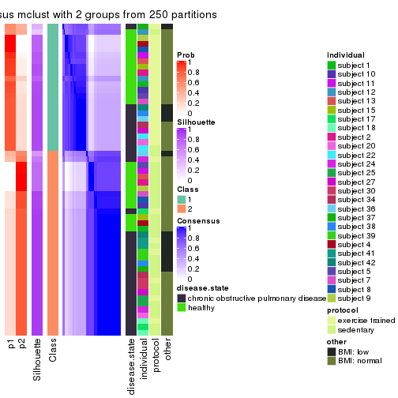</p>

</div>
<div id='tab-MAD-mclust-consensus-heatmap-2'>
<pre><code class="r">consensus_heatmap(res, k = 3)
</code></pre>

<p>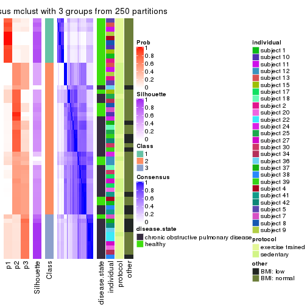</p>

</div>
<div id='tab-MAD-mclust-consensus-heatmap-3'>
<pre><code class="r">consensus_heatmap(res, k = 4)
</code></pre>

<p>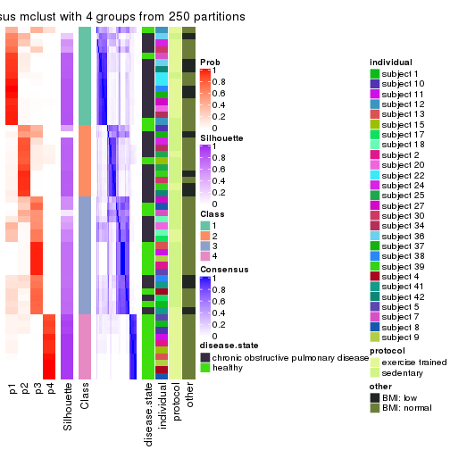</p>

</div>
<div id='tab-MAD-mclust-consensus-heatmap-4'>
<pre><code class="r">consensus_heatmap(res, k = 5)
</code></pre>

<p>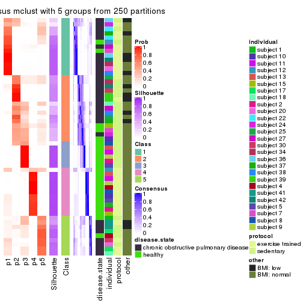</p>

</div>
<div id='tab-MAD-mclust-consensus-heatmap-5'>
<pre><code class="r">consensus_heatmap(res, k = 6)
</code></pre>

<p>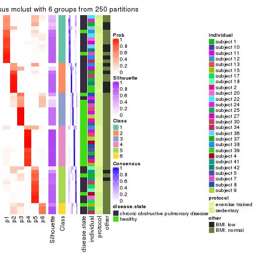</p>

</div>
</div>

Heatmaps for the membership of samples in all partitions to see how consistent they are:


<script>
$( function() {
	$( '#tabs-MAD-mclust-membership-heatmap' ).tabs();
} );
</script>
<div id='tabs-MAD-mclust-membership-heatmap'>
<ul>
<li><a href='#tab-MAD-mclust-membership-heatmap-1'>k = 2</a></li>
<li><a href='#tab-MAD-mclust-membership-heatmap-2'>k = 3</a></li>
<li><a href='#tab-MAD-mclust-membership-heatmap-3'>k = 4</a></li>
<li><a href='#tab-MAD-mclust-membership-heatmap-4'>k = 5</a></li>
<li><a href='#tab-MAD-mclust-membership-heatmap-5'>k = 6</a></li>
</ul>
<div id='tab-MAD-mclust-membership-heatmap-1'>
<pre><code class="r">membership_heatmap(res, k = 2)
</code></pre>

<p>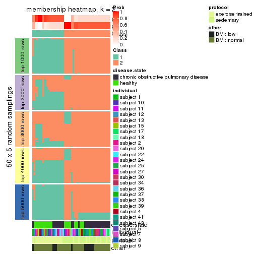</p>

</div>
<div id='tab-MAD-mclust-membership-heatmap-2'>
<pre><code class="r">membership_heatmap(res, k = 3)
</code></pre>

<p>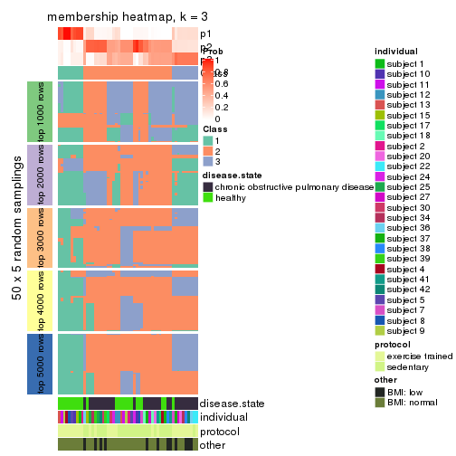</p>

</div>
<div id='tab-MAD-mclust-membership-heatmap-3'>
<pre><code class="r">membership_heatmap(res, k = 4)
</code></pre>

<p>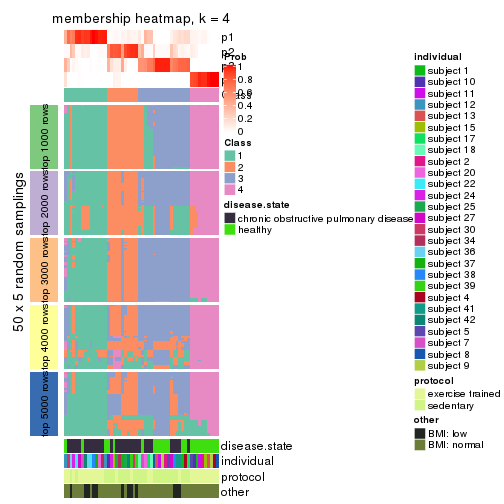</p>

</div>
<div id='tab-MAD-mclust-membership-heatmap-4'>
<pre><code class="r">membership_heatmap(res, k = 5)
</code></pre>

<p>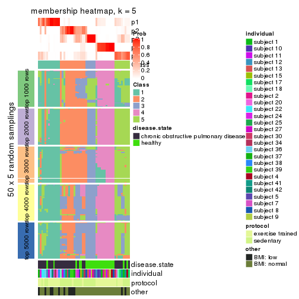</p>

</div>
<div id='tab-MAD-mclust-membership-heatmap-5'>
<pre><code class="r">membership_heatmap(res, k = 6)
</code></pre>

<p>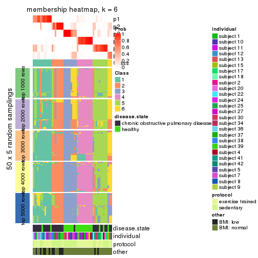</p>

</div>
</div>

As soon as we have had the classes for columns, we can look for signatures
which are significantly different between classes which can be candidate marks
for certain classes. Following are the heatmaps for signatures.


Signature heatmaps where rows are scaled:


<script>
$( function() {
	$( '#tabs-MAD-mclust-get-signatures' ).tabs();
} );
</script>
<div id='tabs-MAD-mclust-get-signatures'>
<ul>
<li><a href='#tab-MAD-mclust-get-signatures-1'>k = 2</a></li>
<li><a href='#tab-MAD-mclust-get-signatures-2'>k = 3</a></li>
<li><a href='#tab-MAD-mclust-get-signatures-3'>k = 4</a></li>
<li><a href='#tab-MAD-mclust-get-signatures-4'>k = 5</a></li>
<li><a href='#tab-MAD-mclust-get-signatures-5'>k = 6</a></li>
</ul>
<div id='tab-MAD-mclust-get-signatures-1'>
<pre><code class="r">get_signatures(res, k = 2)
</code></pre>

<p>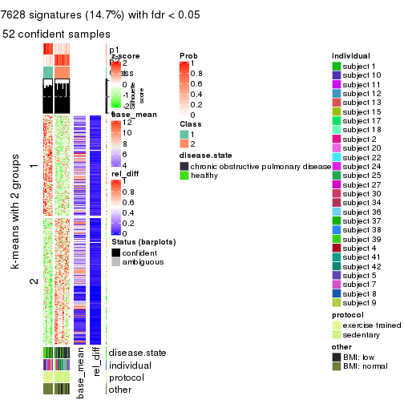</p>

</div>
<div id='tab-MAD-mclust-get-signatures-2'>
<pre><code class="r">get_signatures(res, k = 3)
</code></pre>

<p>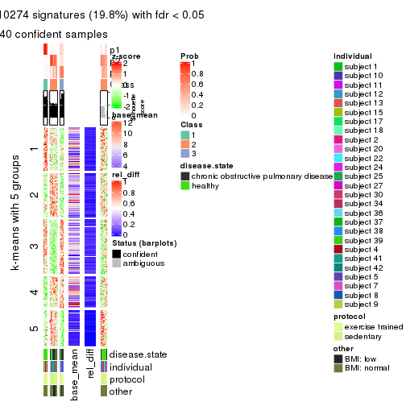</p>

</div>
<div id='tab-MAD-mclust-get-signatures-3'>
<pre><code class="r">get_signatures(res, k = 4)
</code></pre>

<p>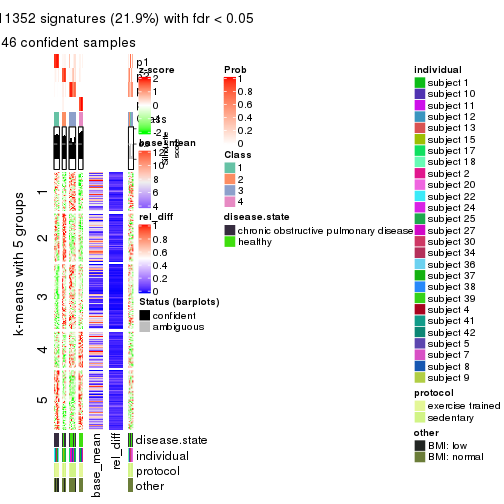</p>

</div>
<div id='tab-MAD-mclust-get-signatures-4'>
<pre><code class="r">get_signatures(res, k = 5)
</code></pre>

<p>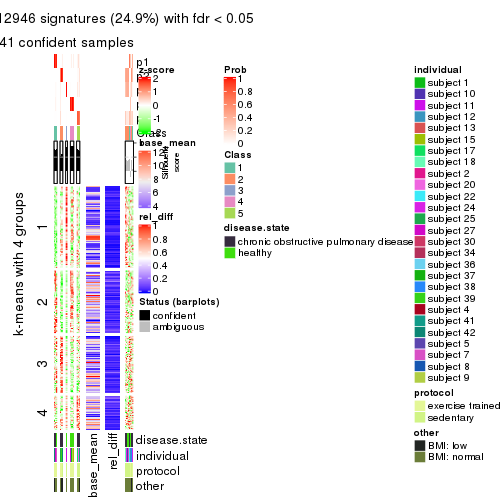</p>

</div>
<div id='tab-MAD-mclust-get-signatures-5'>
<pre><code class="r">get_signatures(res, k = 6)
</code></pre>

<pre><code>#&gt; Error in mat[ceiling(1:nr/h_ratio), ceiling(1:nc/w_ratio), drop = FALSE]: subscript out of bounds
</code></pre>

<p>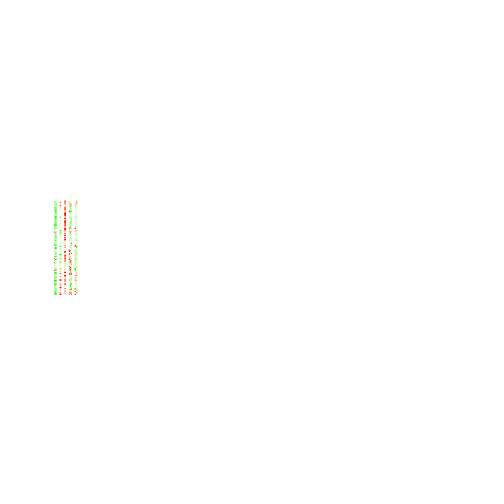</p>

</div>
</div>


Signature heatmaps where rows are not scaled:


<script>
$( function() {
	$( '#tabs-MAD-mclust-get-signatures-no-scale' ).tabs();
} );
</script>
<div id='tabs-MAD-mclust-get-signatures-no-scale'>
<ul>
<li><a href='#tab-MAD-mclust-get-signatures-no-scale-1'>k = 2</a></li>
<li><a href='#tab-MAD-mclust-get-signatures-no-scale-2'>k = 3</a></li>
<li><a href='#tab-MAD-mclust-get-signatures-no-scale-3'>k = 4</a></li>
<li><a href='#tab-MAD-mclust-get-signatures-no-scale-4'>k = 5</a></li>
<li><a href='#tab-MAD-mclust-get-signatures-no-scale-5'>k = 6</a></li>
</ul>
<div id='tab-MAD-mclust-get-signatures-no-scale-1'>
<pre><code class="r">get_signatures(res, k = 2, scale_rows = FALSE)
</code></pre>

<p>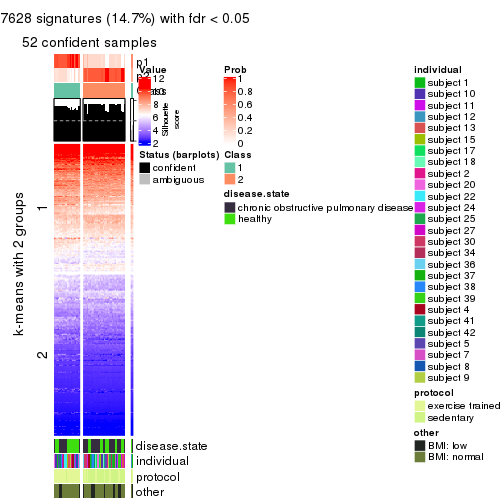</p>

</div>
<div id='tab-MAD-mclust-get-signatures-no-scale-2'>
<pre><code class="r">get_signatures(res, k = 3, scale_rows = FALSE)
</code></pre>

<p>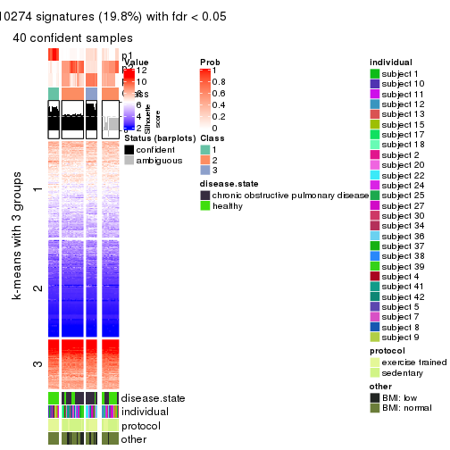</p>

</div>
<div id='tab-MAD-mclust-get-signatures-no-scale-3'>
<pre><code class="r">get_signatures(res, k = 4, scale_rows = FALSE)
</code></pre>

<p>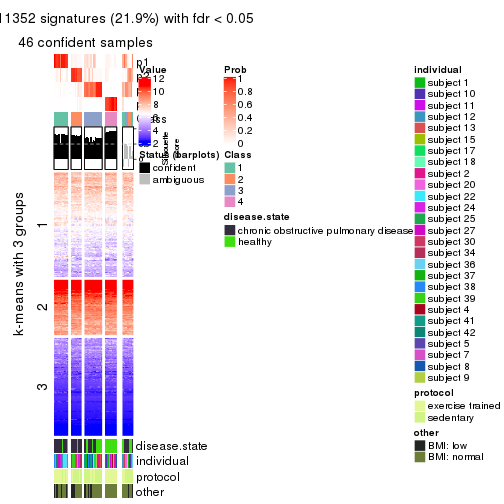</p>

</div>
<div id='tab-MAD-mclust-get-signatures-no-scale-4'>
<pre><code class="r">get_signatures(res, k = 5, scale_rows = FALSE)
</code></pre>

<p>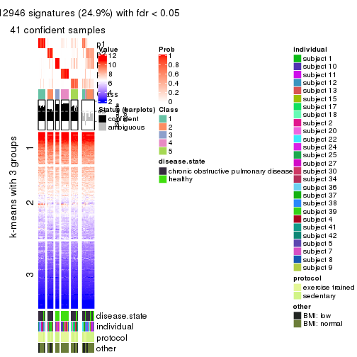</p>

</div>
<div id='tab-MAD-mclust-get-signatures-no-scale-5'>
<pre><code class="r">get_signatures(res, k = 6, scale_rows = FALSE)
</code></pre>

<p>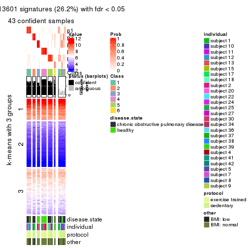</p>

</div>
</div>


Compare the overlap of signatures from different k:

```r
compare_signatures(res)
```

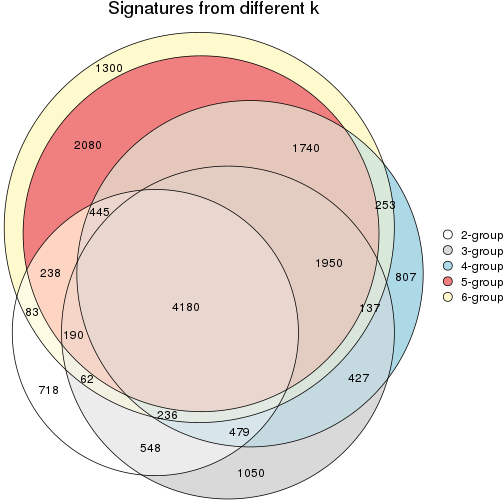

`get_signature()` returns a data frame invisibly. TO get the list of signatures, the function
call should be assigned to a variable explicitly. In following code, if `plot` argument is set
to `FALSE`, no heatmap is plotted while only the differential analysis is performed.

```r
# code only for demonstration
tb = get_signature(res, k = ..., plot = FALSE)
```

An example of the output of `tb` is:

```
#>   which_row         fdr    mean_1    mean_2 scaled_mean_1 scaled_mean_2 km
#> 1        38 0.042760348  8.373488  9.131774    -0.5533452     0.5164555  1
#> 2        40 0.018707592  7.106213  8.469186    -0.6173731     0.5762149  1
#> 3        55 0.019134737 10.221463 11.207825    -0.6159697     0.5749050  1
#> 4        59 0.006059896  5.921854  7.869574    -0.6899429     0.6439467  1
#> 5        60 0.018055526  8.928898 10.211722    -0.6204761     0.5791110  1
#> 6        98 0.009384629 15.714769 14.887706     0.6635654    -0.6193277  2
...
```

The columns in `tb` are:

1. `which_row`: row indices corresponding to the input matrix.
2. `fdr`: FDR for the differential test. 
3. `mean_x`: The mean value in group x.
4. `scaled_mean_x`: The mean value in group x after rows are scaled.
5. `km`: Row groups if k-means clustering is applied to rows.


UMAP plot which shows how samples are separated.


<script>
$( function() {
	$( '#tabs-MAD-mclust-dimension-reduction' ).tabs();
} );
</script>
<div id='tabs-MAD-mclust-dimension-reduction'>
<ul>
<li><a href='#tab-MAD-mclust-dimension-reduction-1'>k = 2</a></li>
<li><a href='#tab-MAD-mclust-dimension-reduction-2'>k = 3</a></li>
<li><a href='#tab-MAD-mclust-dimension-reduction-3'>k = 4</a></li>
<li><a href='#tab-MAD-mclust-dimension-reduction-4'>k = 5</a></li>
<li><a href='#tab-MAD-mclust-dimension-reduction-5'>k = 6</a></li>
</ul>
<div id='tab-MAD-mclust-dimension-reduction-1'>
<pre><code class="r">dimension_reduction(res, k = 2, method = &quot;UMAP&quot;)
</code></pre>

<p>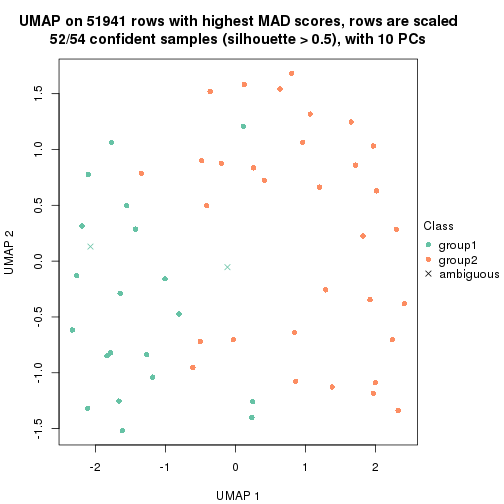</p>

</div>
<div id='tab-MAD-mclust-dimension-reduction-2'>
<pre><code class="r">dimension_reduction(res, k = 3, method = &quot;UMAP&quot;)
</code></pre>

<p>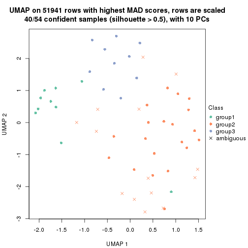</p>

</div>
<div id='tab-MAD-mclust-dimension-reduction-3'>
<pre><code class="r">dimension_reduction(res, k = 4, method = &quot;UMAP&quot;)
</code></pre>

<p>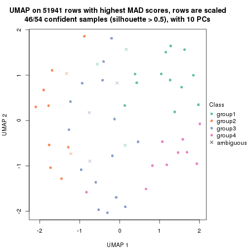</p>

</div>
<div id='tab-MAD-mclust-dimension-reduction-4'>
<pre><code class="r">dimension_reduction(res, k = 5, method = &quot;UMAP&quot;)
</code></pre>

<p>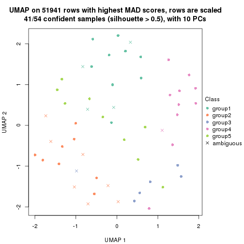</p>

</div>
<div id='tab-MAD-mclust-dimension-reduction-5'>
<pre><code class="r">dimension_reduction(res, k = 6, method = &quot;UMAP&quot;)
</code></pre>

<p>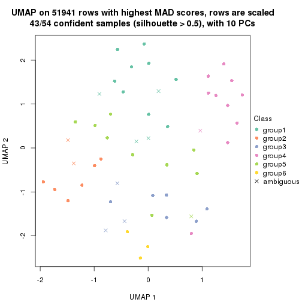</p>

</div>
</div>


Following heatmap shows how subgroups are split when increasing `k`:

```r
collect_classes(res)
```

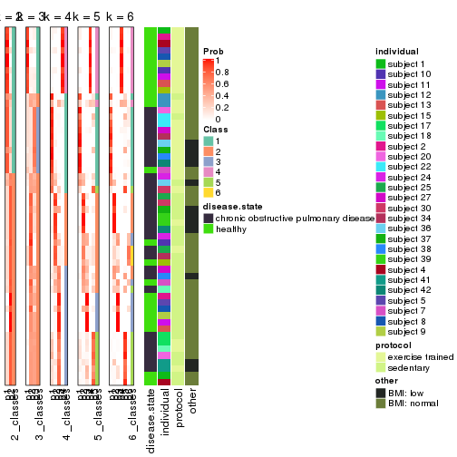


Test correlation between subgroups and known annotations. If the known
annotation is numeric, one-way ANOVA test is applied, and if the known
annotation is discrete, chi-squared contingency table test is applied.

```r
test_to_known_factors(res)
```

```
#>             n disease.state(p) individual(p) protocol(p) other(p) k
#> MAD:mclust 52         1.28e-01         0.934    1.26e-06   0.6100 2
#> MAD:mclust 40         3.32e-05         0.473    2.19e-06   0.0765 3
#> MAD:mclust 46         1.24e-04         0.352    3.43e-05   0.2156 4
#> MAD:mclust 41         9.93e-06         0.334    2.00e-04   0.0727 5
#> MAD:mclust 43         3.84e-05         0.479    1.90e-04   0.0194 6
```


If matrix rows can be associated to genes, consider to use `functional_enrichment(res,
...)` to perform function enrichment for the signature genes. See [this vignette](http://bioconductor.org/packages/devel/bioc/vignettes/cola/inst/doc/functional_enrichment.html) for more detailed explanations.


 

---------------------------------------------------


### MAD:NMF


The object with results only for a single top-value method and a single partition method 
can be extracted as:

```r
res = res_list["MAD", "NMF"]
# you can also extract it by
# res = res_list["MAD:NMF"]
```

A summary of `res` and all the functions that can be applied to it:

```r
res
```

```
#> A 'ConsensusPartition' object with k = 2, 3, 4, 5, 6.
#>   On a matrix with 51941 rows and 54 columns.
#>   Top rows (1000, 2000, 3000, 4000, 5000) are extracted by 'MAD' method.
#>   Subgroups are detected by 'NMF' method.
#>   Performed in total 1250 partitions by row resampling.
#>   Best k for subgroups seems to be 2.
#> 
#> Following methods can be applied to this 'ConsensusPartition' object:
#>  [1] "cola_report"             "collect_classes"         "collect_plots"          
#>  [4] "collect_stats"           "colnames"                "compare_signatures"     
#>  [7] "consensus_heatmap"       "dimension_reduction"     "functional_enrichment"  
#> [10] "get_anno_col"            "get_anno"                "get_classes"            
#> [13] "get_consensus"           "get_matrix"              "get_membership"         
#> [16] "get_param"               "get_signatures"          "get_stats"              
#> [19] "is_best_k"               "is_stable_k"             "membership_heatmap"     
#> [22] "ncol"                    "nrow"                    "plot_ecdf"              
#> [25] "rownames"                "select_partition_number" "show"                   
#> [28] "suggest_best_k"          "test_to_known_factors"
```

`collect_plots()` function collects all the plots made from `res` for all `k` (number of partitions)
into one single page to provide an easy and fast comparison between different `k`.

```r
collect_plots(res)
```

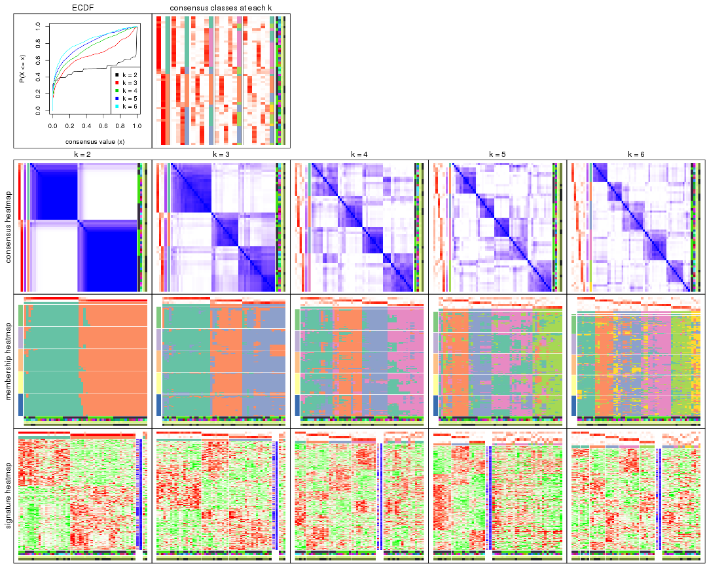

The plots are:

- The first row: a plot of the ECDF (empirical cumulative distribution
  function) curves of the consensus matrix for each `k` and the heatmap of
  predicted classes for each `k`.
- The second row: heatmaps of the consensus matrix for each `k`.
- The third row: heatmaps of the membership matrix for each `k`.
- The fouth row: heatmaps of the signatures for each `k`.

All the plots in panels can be made by individual functions and they are
plotted later in this section.

`select_partition_number()` produces several plots showing different
statistics for choosing "optimized" `k`. There are following statistics:

- ECDF curves of the consensus matrix for each `k`;
- 1-PAC. [The PAC
  score](https://en.wikipedia.org/wiki/Consensus_clustering#Over-interpretation_potential_of_consensus_clustering)
  measures the proportion of the ambiguous subgrouping.
- Mean silhouette score.
- Concordance. The mean probability of fiting the consensus class ids in all
  partitions.
- Area increased. Denote $A_k$ as the area under the ECDF curve for current
  `k`, the area increased is defined as $A_k - A_{k-1}$.
- Rand index. The percent of pairs of samples that are both in a same cluster
  or both are not in a same cluster in the partition of k and k-1.
- Jaccard index. The ratio of pairs of samples are both in a same cluster in
  the partition of k and k-1 and the pairs of samples are both in a same
  cluster in the partition k or k-1.

The detailed explanations of these statistics can be found in [the _cola_
vignette](http://bioconductor.org/packages/devel/bioc/vignettes/cola/inst/doc/cola.html#toc_13).

Generally speaking, lower PAC score, higher mean silhouette score or higher
concordance corresponds to better partition. Rand index and Jaccard index
measure how similar the current partition is compared to partition with `k-1`.
If they are too similar, we won't accept `k` is better than `k-1`.

```r
select_partition_number(res)
```

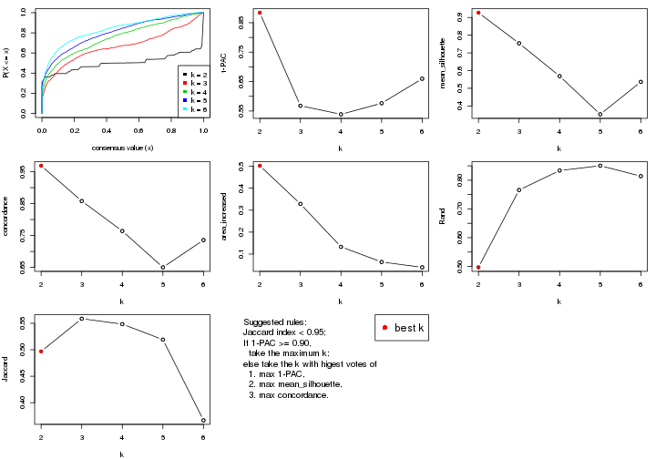

The numeric values for all these statistics can be obtained by `get_stats()`.

```r
get_stats(res)
```

```
#>   k 1-PAC mean_silhouette concordance area_increased  Rand Jaccard
#> 2 2 0.884           0.927       0.969         0.5025 0.497   0.497
#> 3 3 0.568           0.754       0.858         0.3285 0.766   0.559
#> 4 4 0.539           0.568       0.764         0.1329 0.834   0.548
#> 5 5 0.576           0.353       0.650         0.0638 0.850   0.519
#> 6 6 0.660           0.536       0.736         0.0395 0.814   0.367
```

`suggest_best_k()` suggests the best $k$ based on these statistics. The rules are as follows:

- All $k$ with Jaccard index larger than 0.95 are removed because increasing
  $k$ does not provide enough extra information. If all $k$ are removed, it is
  marked as no subgroup is detected.
- For all $k$ with 1-PAC score larger than 0.9, the maximal $k$ is taken as
  the best $k$, and other $k$ are marked as optional $k$.
- If it does not fit the second rule. The $k$ with the maximal vote of the
  highest 1-PAC score, highest mean silhouette, and highest concordance is
  taken as the best $k$.

```r
suggest_best_k(res)
```

```
#> [1] 2
```


Following shows the table of the partitions (You need to click the **show/hide
code output** link to see it). The membership matrix (columns with name `p*`)
is inferred by
[`clue::cl_consensus()`](https://www.rdocumentation.org/link/cl_consensus?package=clue)
function with the `SE` method. Basically the value in the membership matrix
represents the probability to belong to a certain group. The finall class
label for an item is determined with the group with highest probability it
belongs to.

In `get_classes()` function, the entropy is calculated from the membership
matrix and the silhouette score is calculated from the consensus matrix.


<script>
$( function() {
	$( '#tabs-MAD-NMF-get-classes' ).tabs();
} );
</script>
<div id='tabs-MAD-NMF-get-classes'>
<ul>
<li><a href='#tab-MAD-NMF-get-classes-1'>k = 2</a></li>
<li><a href='#tab-MAD-NMF-get-classes-2'>k = 3</a></li>
<li><a href='#tab-MAD-NMF-get-classes-3'>k = 4</a></li>
<li><a href='#tab-MAD-NMF-get-classes-4'>k = 5</a></li>
<li><a href='#tab-MAD-NMF-get-classes-5'>k = 6</a></li>
</ul>

<div id='tab-MAD-NMF-get-classes-1'>
<p><a id='tab-MAD-NMF-get-classes-1-a' style='color:#0366d6' href='#'>show/hide code output</a></p>
<pre><code class="r">cbind(get_classes(res, k = 2), get_membership(res, k = 2))
</code></pre>

<pre><code>#&gt;           class entropy silhouette    p1    p2
#&gt; GSM680053     2  0.0000      0.966 0.000 1.000
#&gt; GSM680062     1  0.6343      0.807 0.840 0.160
#&gt; GSM680054     2  0.0000      0.966 0.000 1.000
#&gt; GSM680063     1  0.9427      0.446 0.640 0.360
#&gt; GSM680055     2  0.0000      0.966 0.000 1.000
#&gt; GSM680064     1  0.0000      0.965 1.000 0.000
#&gt; GSM680056     1  0.0000      0.965 1.000 0.000
#&gt; GSM680065     1  0.0000      0.965 1.000 0.000
#&gt; GSM680057     2  0.0000      0.966 0.000 1.000
#&gt; GSM680066     2  0.3879      0.900 0.076 0.924
#&gt; GSM680058     2  0.0000      0.966 0.000 1.000
#&gt; GSM680067     2  0.7745      0.704 0.228 0.772
#&gt; GSM680059     2  0.0000      0.966 0.000 1.000
#&gt; GSM680068     1  0.0000      0.965 1.000 0.000
#&gt; GSM680060     2  0.0000      0.966 0.000 1.000
#&gt; GSM680069     2  0.7950      0.674 0.240 0.760
#&gt; GSM680061     2  0.0000      0.966 0.000 1.000
#&gt; GSM680070     1  0.0000      0.965 1.000 0.000
#&gt; GSM680071     1  0.2948      0.924 0.948 0.052
#&gt; GSM680077     1  0.0938      0.957 0.988 0.012
#&gt; GSM680072     2  0.0000      0.966 0.000 1.000
#&gt; GSM680078     2  0.9393      0.431 0.356 0.644
#&gt; GSM680073     2  0.0000      0.966 0.000 1.000
#&gt; GSM680079     1  0.0000      0.965 1.000 0.000
#&gt; GSM680074     2  0.0000      0.966 0.000 1.000
#&gt; GSM680080     2  0.0000      0.966 0.000 1.000
#&gt; GSM680075     2  0.0000      0.966 0.000 1.000
#&gt; GSM680081     2  0.0000      0.966 0.000 1.000
#&gt; GSM680076     2  0.0000      0.966 0.000 1.000
#&gt; GSM680082     1  0.0000      0.965 1.000 0.000
#&gt; GSM680029     2  0.0000      0.966 0.000 1.000
#&gt; GSM680041     1  0.0000      0.965 1.000 0.000
#&gt; GSM680035     2  0.0000      0.966 0.000 1.000
#&gt; GSM680047     1  0.0000      0.965 1.000 0.000
#&gt; GSM680036     2  0.0000      0.966 0.000 1.000
#&gt; GSM680048     1  0.0000      0.965 1.000 0.000
#&gt; GSM680037     2  0.0000      0.966 0.000 1.000
#&gt; GSM680049     1  0.0000      0.965 1.000 0.000
#&gt; GSM680038     2  0.0000      0.966 0.000 1.000
#&gt; GSM680050     1  0.0000      0.965 1.000 0.000
#&gt; GSM680039     2  0.0000      0.966 0.000 1.000
#&gt; GSM680051     1  0.0000      0.965 1.000 0.000
#&gt; GSM680040     2  0.0000      0.966 0.000 1.000
#&gt; GSM680052     1  0.0000      0.965 1.000 0.000
#&gt; GSM680030     2  0.0000      0.966 0.000 1.000
#&gt; GSM680042     1  0.0000      0.965 1.000 0.000
#&gt; GSM680031     2  0.0000      0.966 0.000 1.000
#&gt; GSM680043     1  0.0000      0.965 1.000 0.000
#&gt; GSM680032     1  0.6712      0.781 0.824 0.176
#&gt; GSM680044     1  0.0376      0.963 0.996 0.004
#&gt; GSM680033     2  0.0000      0.966 0.000 1.000
#&gt; GSM680045     1  0.0000      0.965 1.000 0.000
#&gt; GSM680034     2  0.1414      0.950 0.020 0.980
#&gt; GSM680046     1  0.0000      0.965 1.000 0.000
</code></pre>

<script>
$('#tab-MAD-NMF-get-classes-1-a').parent().next().next().hide();
$('#tab-MAD-NMF-get-classes-1-a').click(function(){
  $('#tab-MAD-NMF-get-classes-1-a').parent().next().next().toggle();
  return(false);
});
</script>
</div>

<div id='tab-MAD-NMF-get-classes-2'>
<p><a id='tab-MAD-NMF-get-classes-2-a' style='color:#0366d6' href='#'>show/hide code output</a></p>
<pre><code class="r">cbind(get_classes(res, k = 3), get_membership(res, k = 3))
</code></pre>

<pre><code>#&gt;           class entropy silhouette    p1    p2    p3
#&gt; GSM680053     3  0.0592     0.7939 0.000 0.012 0.988
#&gt; GSM680062     3  0.2860     0.7718 0.084 0.004 0.912
#&gt; GSM680054     3  0.4931     0.6685 0.000 0.232 0.768
#&gt; GSM680063     3  0.1860     0.7838 0.052 0.000 0.948
#&gt; GSM680055     3  0.0592     0.7938 0.000 0.012 0.988
#&gt; GSM680064     1  0.2356     0.8860 0.928 0.000 0.072
#&gt; GSM680056     3  0.4842     0.6164 0.224 0.000 0.776
#&gt; GSM680065     1  0.6026     0.5407 0.624 0.000 0.376
#&gt; GSM680057     2  0.0592     0.8270 0.000 0.988 0.012
#&gt; GSM680066     2  0.6882     0.6363 0.096 0.732 0.172
#&gt; GSM680058     2  0.3192     0.7943 0.000 0.888 0.112
#&gt; GSM680067     2  0.2301     0.8109 0.060 0.936 0.004
#&gt; GSM680059     2  0.6252     0.0666 0.000 0.556 0.444
#&gt; GSM680068     1  0.1636     0.8896 0.964 0.016 0.020
#&gt; GSM680060     2  0.2711     0.8110 0.000 0.912 0.088
#&gt; GSM680069     3  0.5331     0.6931 0.076 0.100 0.824
#&gt; GSM680061     2  0.0424     0.8262 0.008 0.992 0.000
#&gt; GSM680070     1  0.1585     0.8882 0.964 0.008 0.028
#&gt; GSM680071     1  0.9561     0.2423 0.428 0.196 0.376
#&gt; GSM680077     1  0.5526     0.7943 0.792 0.036 0.172
#&gt; GSM680072     3  0.5621     0.5991 0.000 0.308 0.692
#&gt; GSM680078     3  0.4589     0.6863 0.172 0.008 0.820
#&gt; GSM680073     3  0.5291     0.6977 0.000 0.268 0.732
#&gt; GSM680079     1  0.2860     0.8722 0.912 0.004 0.084
#&gt; GSM680074     2  0.1753     0.8278 0.000 0.952 0.048
#&gt; GSM680080     2  0.1964     0.8265 0.000 0.944 0.056
#&gt; GSM680075     3  0.1643     0.7987 0.000 0.044 0.956
#&gt; GSM680081     3  0.5058     0.7529 0.000 0.244 0.756
#&gt; GSM680076     2  0.3769     0.7962 0.016 0.880 0.104
#&gt; GSM680082     1  0.1765     0.8875 0.956 0.004 0.040
#&gt; GSM680029     3  0.4346     0.7814 0.000 0.184 0.816
#&gt; GSM680041     1  0.1411     0.8908 0.964 0.000 0.036
#&gt; GSM680035     3  0.4750     0.7717 0.000 0.216 0.784
#&gt; GSM680047     1  0.1832     0.8912 0.956 0.008 0.036
#&gt; GSM680036     3  0.1860     0.7974 0.000 0.052 0.948
#&gt; GSM680048     1  0.1877     0.8914 0.956 0.012 0.032
#&gt; GSM680037     3  0.4702     0.7737 0.000 0.212 0.788
#&gt; GSM680049     1  0.0424     0.8896 0.992 0.008 0.000
#&gt; GSM680038     2  0.6235    -0.0822 0.000 0.564 0.436
#&gt; GSM680050     1  0.1989     0.8883 0.948 0.004 0.048
#&gt; GSM680039     2  0.2537     0.7867 0.000 0.920 0.080
#&gt; GSM680051     1  0.2443     0.8891 0.940 0.028 0.032
#&gt; GSM680040     3  0.5016     0.7556 0.000 0.240 0.760
#&gt; GSM680052     1  0.2056     0.8910 0.952 0.024 0.024
#&gt; GSM680030     2  0.1031     0.8252 0.000 0.976 0.024
#&gt; GSM680042     1  0.1289     0.8910 0.968 0.000 0.032
#&gt; GSM680031     3  0.4931     0.7621 0.000 0.232 0.768
#&gt; GSM680043     1  0.3554     0.8499 0.900 0.064 0.036
#&gt; GSM680032     1  0.5848     0.6917 0.720 0.012 0.268
#&gt; GSM680044     1  0.1751     0.8925 0.960 0.012 0.028
#&gt; GSM680033     3  0.5138     0.7433 0.000 0.252 0.748
#&gt; GSM680045     1  0.6594     0.7009 0.756 0.128 0.116
#&gt; GSM680034     2  0.3043     0.7879 0.084 0.908 0.008
#&gt; GSM680046     1  0.0892     0.8880 0.980 0.020 0.000
</code></pre>

<script>
$('#tab-MAD-NMF-get-classes-2-a').parent().next().next().hide();
$('#tab-MAD-NMF-get-classes-2-a').click(function(){
  $('#tab-MAD-NMF-get-classes-2-a').parent().next().next().toggle();
  return(false);
});
</script>
</div>

<div id='tab-MAD-NMF-get-classes-3'>
<p><a id='tab-MAD-NMF-get-classes-3-a' style='color:#0366d6' href='#'>show/hide code output</a></p>
<pre><code class="r">cbind(get_classes(res, k = 4), get_membership(res, k = 4))
</code></pre>

<pre><code>#&gt;           class entropy silhouette    p1    p2    p3    p4
#&gt; GSM680053     3  0.4746    0.25471 0.368 0.000 0.632 0.000
#&gt; GSM680062     3  0.2926    0.79607 0.056 0.000 0.896 0.048
#&gt; GSM680054     1  0.6521    0.22896 0.512 0.076 0.412 0.000
#&gt; GSM680063     3  0.4716    0.63411 0.196 0.000 0.764 0.040
#&gt; GSM680055     1  0.4585    0.44104 0.668 0.000 0.332 0.000
#&gt; GSM680064     4  0.5320    0.39517 0.416 0.000 0.012 0.572
#&gt; GSM680056     1  0.3463    0.61492 0.864 0.000 0.096 0.040
#&gt; GSM680065     1  0.3597    0.51295 0.836 0.000 0.016 0.148
#&gt; GSM680057     2  0.0657    0.75310 0.004 0.984 0.012 0.000
#&gt; GSM680066     2  0.9021    0.17040 0.140 0.444 0.120 0.296
#&gt; GSM680058     2  0.4635    0.61098 0.268 0.720 0.012 0.000
#&gt; GSM680067     2  0.0707    0.75121 0.000 0.980 0.000 0.020
#&gt; GSM680059     3  0.5072    0.64788 0.052 0.208 0.740 0.000
#&gt; GSM680068     4  0.4092    0.67121 0.184 0.008 0.008 0.800
#&gt; GSM680060     2  0.2647    0.73580 0.120 0.880 0.000 0.000
#&gt; GSM680069     1  0.3043    0.61214 0.876 0.004 0.112 0.008
#&gt; GSM680061     2  0.0895    0.75068 0.000 0.976 0.004 0.020
#&gt; GSM680070     4  0.5125    0.47052 0.388 0.008 0.000 0.604
#&gt; GSM680071     1  0.3489    0.60023 0.884 0.048 0.028 0.040
#&gt; GSM680077     1  0.2809    0.56390 0.904 0.028 0.004 0.064
#&gt; GSM680072     1  0.7515    0.00714 0.448 0.364 0.188 0.000
#&gt; GSM680078     1  0.5962    0.47744 0.660 0.000 0.260 0.080
#&gt; GSM680073     1  0.7469    0.14807 0.432 0.176 0.392 0.000
#&gt; GSM680079     4  0.5303    0.36474 0.448 0.004 0.004 0.544
#&gt; GSM680074     2  0.2546    0.74259 0.092 0.900 0.008 0.000
#&gt; GSM680080     2  0.3937    0.69673 0.188 0.800 0.012 0.000
#&gt; GSM680075     1  0.5478    0.40403 0.628 0.028 0.344 0.000
#&gt; GSM680081     3  0.2486    0.83961 0.048 0.028 0.920 0.004
#&gt; GSM680076     2  0.3837    0.68139 0.224 0.776 0.000 0.000
#&gt; GSM680082     1  0.5300   -0.14090 0.580 0.012 0.000 0.408
#&gt; GSM680029     3  0.1488    0.82841 0.032 0.012 0.956 0.000
#&gt; GSM680041     4  0.3108    0.71955 0.112 0.000 0.016 0.872
#&gt; GSM680035     3  0.1004    0.85051 0.004 0.024 0.972 0.000
#&gt; GSM680047     4  0.3497    0.70979 0.036 0.000 0.104 0.860
#&gt; GSM680036     1  0.4996    0.13919 0.516 0.000 0.484 0.000
#&gt; GSM680048     4  0.1911    0.73067 0.004 0.020 0.032 0.944
#&gt; GSM680037     3  0.1151    0.85187 0.000 0.024 0.968 0.008
#&gt; GSM680049     4  0.1209    0.73239 0.032 0.004 0.000 0.964
#&gt; GSM680038     2  0.6809    0.36162 0.116 0.552 0.332 0.000
#&gt; GSM680050     4  0.5151    0.34668 0.464 0.004 0.000 0.532
#&gt; GSM680039     2  0.6307    0.45010 0.000 0.620 0.288 0.092
#&gt; GSM680051     4  0.3862    0.69640 0.004 0.060 0.084 0.852
#&gt; GSM680040     3  0.1452    0.85052 0.000 0.036 0.956 0.008
#&gt; GSM680052     4  0.3004    0.71242 0.000 0.060 0.048 0.892
#&gt; GSM680030     2  0.2467    0.74039 0.004 0.920 0.052 0.024
#&gt; GSM680042     4  0.2737    0.71860 0.104 0.000 0.008 0.888
#&gt; GSM680031     3  0.1706    0.84759 0.000 0.036 0.948 0.016
#&gt; GSM680043     4  0.6437    0.57927 0.032 0.076 0.208 0.684
#&gt; GSM680032     1  0.4431    0.20449 0.696 0.000 0.000 0.304
#&gt; GSM680044     4  0.3505    0.72553 0.048 0.000 0.088 0.864
#&gt; GSM680033     3  0.2174    0.83451 0.000 0.052 0.928 0.020
#&gt; GSM680045     4  0.6707    0.37165 0.004 0.100 0.312 0.584
#&gt; GSM680034     2  0.5312    0.53060 0.000 0.692 0.040 0.268
#&gt; GSM680046     4  0.2186    0.72833 0.012 0.048 0.008 0.932
</code></pre>

<script>
$('#tab-MAD-NMF-get-classes-3-a').parent().next().next().hide();
$('#tab-MAD-NMF-get-classes-3-a').click(function(){
  $('#tab-MAD-NMF-get-classes-3-a').parent().next().next().toggle();
  return(false);
});
</script>
</div>

<div id='tab-MAD-NMF-get-classes-4'>
<p><a id='tab-MAD-NMF-get-classes-4-a' style='color:#0366d6' href='#'>show/hide code output</a></p>
<pre><code class="r">cbind(get_classes(res, k = 5), get_membership(res, k = 5))
</code></pre>

<pre><code>#&gt;           class entropy silhouette    p1    p2    p3    p4    p5
#&gt; GSM680053     5  0.3667     0.6234 0.048 0.000 0.140 0.000 0.812
#&gt; GSM680062     5  0.7350     0.3211 0.276 0.000 0.080 0.144 0.500
#&gt; GSM680054     5  0.2845     0.6913 0.048 0.032 0.028 0.000 0.892
#&gt; GSM680063     5  0.6464     0.4630 0.256 0.000 0.104 0.048 0.592
#&gt; GSM680055     5  0.1579     0.6909 0.024 0.000 0.032 0.000 0.944
#&gt; GSM680064     4  0.5287     0.2841 0.260 0.000 0.000 0.648 0.092
#&gt; GSM680056     5  0.1608     0.6897 0.072 0.000 0.000 0.000 0.928
#&gt; GSM680065     5  0.6016     0.2802 0.236 0.000 0.000 0.184 0.580
#&gt; GSM680057     2  0.1430     0.7527 0.052 0.944 0.004 0.000 0.000
#&gt; GSM680066     1  0.7785    -0.3694 0.380 0.064 0.252 0.304 0.000
#&gt; GSM680058     2  0.3684     0.5210 0.000 0.720 0.000 0.000 0.280
#&gt; GSM680067     2  0.1410     0.7510 0.060 0.940 0.000 0.000 0.000
#&gt; GSM680059     3  0.1106     0.5797 0.012 0.024 0.964 0.000 0.000
#&gt; GSM680068     4  0.5382     0.2354 0.336 0.000 0.072 0.592 0.000
#&gt; GSM680060     2  0.2583     0.7009 0.004 0.864 0.000 0.000 0.132
#&gt; GSM680069     5  0.2840     0.6697 0.108 0.012 0.004 0.004 0.872
#&gt; GSM680061     2  0.1608     0.7480 0.072 0.928 0.000 0.000 0.000
#&gt; GSM680070     4  0.4588     0.2797 0.380 0.000 0.016 0.604 0.000
#&gt; GSM680071     5  0.4308     0.6266 0.072 0.128 0.000 0.012 0.788
#&gt; GSM680077     4  0.6595     0.2194 0.416 0.032 0.004 0.464 0.084
#&gt; GSM680072     5  0.5114     0.1157 0.024 0.424 0.008 0.000 0.544
#&gt; GSM680078     3  0.7163    -0.1764 0.400 0.000 0.412 0.140 0.048
#&gt; GSM680073     5  0.7704     0.1757 0.056 0.252 0.312 0.000 0.380
#&gt; GSM680079     4  0.4917     0.2728 0.384 0.000 0.024 0.588 0.004
#&gt; GSM680074     2  0.1041     0.7471 0.004 0.964 0.000 0.000 0.032
#&gt; GSM680080     2  0.1697     0.7402 0.008 0.932 0.000 0.000 0.060
#&gt; GSM680075     3  0.6915     0.1376 0.200 0.036 0.536 0.000 0.228
#&gt; GSM680081     3  0.2006     0.5818 0.072 0.000 0.916 0.012 0.000
#&gt; GSM680076     2  0.3215     0.6971 0.092 0.852 0.000 0.000 0.056
#&gt; GSM680082     4  0.4985     0.2793 0.392 0.016 0.000 0.580 0.012
#&gt; GSM680029     3  0.0609     0.5932 0.000 0.000 0.980 0.000 0.020
#&gt; GSM680041     4  0.6448    -0.0483 0.228 0.000 0.000 0.500 0.272
#&gt; GSM680035     3  0.5584     0.5427 0.324 0.000 0.584 0.000 0.092
#&gt; GSM680047     4  0.6450    -0.1838 0.384 0.000 0.000 0.436 0.180
#&gt; GSM680036     5  0.2388     0.6812 0.028 0.000 0.072 0.000 0.900
#&gt; GSM680048     4  0.4905    -0.0827 0.336 0.000 0.000 0.624 0.040
#&gt; GSM680037     3  0.4957     0.5737 0.332 0.000 0.624 0.000 0.044
#&gt; GSM680049     4  0.1012     0.2370 0.020 0.000 0.000 0.968 0.012
#&gt; GSM680038     5  0.5691     0.4997 0.144 0.196 0.008 0.000 0.652
#&gt; GSM680050     4  0.4849     0.2930 0.360 0.000 0.000 0.608 0.032
#&gt; GSM680039     2  0.6490     0.2672 0.344 0.492 0.156 0.008 0.000
#&gt; GSM680051     1  0.5518    -0.2304 0.540 0.000 0.024 0.408 0.028
#&gt; GSM680040     3  0.4540     0.5913 0.320 0.000 0.656 0.000 0.024
#&gt; GSM680052     4  0.5106    -0.2679 0.456 0.000 0.036 0.508 0.000
#&gt; GSM680030     2  0.5618     0.4363 0.136 0.628 0.000 0.000 0.236
#&gt; GSM680042     4  0.3702     0.1905 0.084 0.000 0.000 0.820 0.096
#&gt; GSM680031     3  0.3582     0.6113 0.224 0.000 0.768 0.000 0.008
#&gt; GSM680043     4  0.6738    -0.1107 0.308 0.004 0.236 0.452 0.000
#&gt; GSM680032     4  0.6451     0.2227 0.388 0.004 0.000 0.452 0.156
#&gt; GSM680044     4  0.4430     0.1197 0.076 0.000 0.172 0.752 0.000
#&gt; GSM680033     3  0.4639     0.5778 0.344 0.000 0.632 0.000 0.024
#&gt; GSM680045     4  0.7446    -0.2317 0.340 0.036 0.244 0.380 0.000
#&gt; GSM680034     2  0.6092     0.3223 0.380 0.524 0.020 0.076 0.000
#&gt; GSM680046     4  0.2891     0.1149 0.176 0.000 0.000 0.824 0.000
</code></pre>

<script>
$('#tab-MAD-NMF-get-classes-4-a').parent().next().next().hide();
$('#tab-MAD-NMF-get-classes-4-a').click(function(){
  $('#tab-MAD-NMF-get-classes-4-a').parent().next().next().toggle();
  return(false);
});
</script>
</div>

<div id='tab-MAD-NMF-get-classes-5'>
<p><a id='tab-MAD-NMF-get-classes-5-a' style='color:#0366d6' href='#'>show/hide code output</a></p>
<pre><code class="r">cbind(get_classes(res, k = 6), get_membership(res, k = 6))
</code></pre>

<pre><code>#&gt;           class entropy silhouette    p1    p2    p3    p4    p5    p6
#&gt; GSM680053     5  0.4874    0.45075 0.000 0.000 0.084 0.004 0.636 0.276
#&gt; GSM680062     4  0.6145    0.39803 0.000 0.004 0.036 0.568 0.184 0.208
#&gt; GSM680054     5  0.3634    0.66353 0.000 0.060 0.048 0.004 0.832 0.056
#&gt; GSM680063     4  0.7101    0.01678 0.000 0.004 0.060 0.372 0.292 0.272
#&gt; GSM680055     5  0.4466    0.64925 0.016 0.008 0.064 0.008 0.764 0.140
#&gt; GSM680064     4  0.4496    0.33065 0.408 0.000 0.000 0.564 0.020 0.008
#&gt; GSM680056     5  0.3718    0.68033 0.136 0.000 0.020 0.016 0.808 0.020
#&gt; GSM680065     5  0.4731    0.17939 0.472 0.000 0.000 0.016 0.492 0.020
#&gt; GSM680057     3  0.5497    0.34947 0.000 0.336 0.556 0.000 0.020 0.088
#&gt; GSM680066     1  0.5478    0.65109 0.696 0.028 0.120 0.024 0.004 0.128
#&gt; GSM680058     2  0.3990    0.54953 0.000 0.688 0.000 0.000 0.284 0.028
#&gt; GSM680067     2  0.4146    0.63899 0.008 0.800 0.052 0.036 0.004 0.100
#&gt; GSM680059     6  0.5015    0.25526 0.000 0.092 0.288 0.004 0.000 0.616
#&gt; GSM680068     1  0.4642    0.73497 0.748 0.000 0.076 0.060 0.000 0.116
#&gt; GSM680060     2  0.3596    0.67604 0.012 0.792 0.000 0.000 0.164 0.032
#&gt; GSM680069     5  0.3043    0.67994 0.140 0.008 0.000 0.000 0.832 0.020
#&gt; GSM680061     2  0.5312    0.51997 0.008 0.688 0.156 0.024 0.004 0.120
#&gt; GSM680070     1  0.2375    0.84121 0.896 0.000 0.000 0.036 0.008 0.060
#&gt; GSM680071     5  0.3562    0.68073 0.112 0.040 0.000 0.016 0.824 0.008
#&gt; GSM680077     1  0.2552    0.82853 0.900 0.024 0.000 0.012 0.036 0.028
#&gt; GSM680072     2  0.5740    0.19569 0.000 0.512 0.004 0.000 0.316 0.168
#&gt; GSM680078     6  0.5538   -0.06517 0.384 0.012 0.048 0.008 0.012 0.536
#&gt; GSM680073     6  0.6475    0.09193 0.004 0.372 0.028 0.000 0.176 0.420
#&gt; GSM680079     1  0.2483    0.84058 0.892 0.004 0.000 0.044 0.004 0.056
#&gt; GSM680074     2  0.0653    0.71227 0.004 0.980 0.000 0.000 0.012 0.004
#&gt; GSM680080     2  0.1511    0.71123 0.004 0.940 0.000 0.000 0.044 0.012
#&gt; GSM680075     6  0.6408    0.47066 0.032 0.112 0.104 0.000 0.128 0.624
#&gt; GSM680081     3  0.4005    0.55374 0.084 0.024 0.816 0.004 0.020 0.052
#&gt; GSM680076     2  0.1555    0.70231 0.040 0.940 0.000 0.000 0.008 0.012
#&gt; GSM680082     1  0.1148    0.83891 0.960 0.016 0.000 0.020 0.004 0.000
#&gt; GSM680029     3  0.3984    0.28133 0.000 0.000 0.596 0.000 0.008 0.396
#&gt; GSM680041     4  0.2389    0.72608 0.016 0.000 0.020 0.904 0.052 0.008
#&gt; GSM680035     3  0.2917    0.58797 0.000 0.000 0.872 0.040 0.048 0.040
#&gt; GSM680047     4  0.1245    0.72841 0.000 0.000 0.032 0.952 0.016 0.000
#&gt; GSM680036     5  0.3855    0.65845 0.004 0.016 0.076 0.008 0.816 0.080
#&gt; GSM680048     4  0.1370    0.73551 0.036 0.000 0.004 0.948 0.012 0.000
#&gt; GSM680037     3  0.3473    0.55770 0.000 0.000 0.812 0.040 0.012 0.136
#&gt; GSM680049     4  0.3293    0.68530 0.196 0.000 0.004 0.788 0.008 0.004
#&gt; GSM680038     5  0.5670    0.52847 0.004 0.080 0.168 0.036 0.680 0.032
#&gt; GSM680050     1  0.2154    0.82577 0.908 0.004 0.000 0.064 0.020 0.004
#&gt; GSM680039     3  0.5252    0.53389 0.008 0.152 0.704 0.028 0.008 0.100
#&gt; GSM680051     4  0.5022    0.00719 0.008 0.000 0.452 0.500 0.016 0.024
#&gt; GSM680040     3  0.2748    0.58817 0.004 0.000 0.872 0.020 0.012 0.092
#&gt; GSM680052     4  0.0632    0.73082 0.000 0.000 0.024 0.976 0.000 0.000
#&gt; GSM680030     3  0.7484    0.15311 0.012 0.212 0.396 0.028 0.312 0.040
#&gt; GSM680042     4  0.2306    0.72898 0.092 0.000 0.000 0.888 0.016 0.004
#&gt; GSM680031     3  0.4528    0.39124 0.004 0.000 0.624 0.024 0.008 0.340
#&gt; GSM680043     3  0.6569    0.02967 0.052 0.004 0.436 0.372 0.000 0.136
#&gt; GSM680032     1  0.4189    0.72824 0.808 0.048 0.036 0.008 0.084 0.016
#&gt; GSM680044     4  0.3465    0.71185 0.084 0.004 0.008 0.828 0.000 0.076
#&gt; GSM680033     3  0.3144    0.57065 0.004 0.000 0.832 0.020 0.008 0.136
#&gt; GSM680045     4  0.5014    0.56316 0.028 0.004 0.196 0.692 0.000 0.080
#&gt; GSM680034     3  0.6507    0.37754 0.008 0.268 0.544 0.064 0.004 0.112
#&gt; GSM680046     4  0.3676    0.70497 0.120 0.000 0.052 0.808 0.000 0.020
</code></pre>

<script>
$('#tab-MAD-NMF-get-classes-5-a').parent().next().next().hide();
$('#tab-MAD-NMF-get-classes-5-a').click(function(){
  $('#tab-MAD-NMF-get-classes-5-a').parent().next().next().toggle();
  return(false);
});
</script>
</div>
</div>

Heatmaps for the consensus matrix. It visualizes the probability of two
samples to be in a same group.


<script>
$( function() {
	$( '#tabs-MAD-NMF-consensus-heatmap' ).tabs();
} );
</script>
<div id='tabs-MAD-NMF-consensus-heatmap'>
<ul>
<li><a href='#tab-MAD-NMF-consensus-heatmap-1'>k = 2</a></li>
<li><a href='#tab-MAD-NMF-consensus-heatmap-2'>k = 3</a></li>
<li><a href='#tab-MAD-NMF-consensus-heatmap-3'>k = 4</a></li>
<li><a href='#tab-MAD-NMF-consensus-heatmap-4'>k = 5</a></li>
<li><a href='#tab-MAD-NMF-consensus-heatmap-5'>k = 6</a></li>
</ul>
<div id='tab-MAD-NMF-consensus-heatmap-1'>
<pre><code class="r">consensus_heatmap(res, k = 2)
</code></pre>

<p>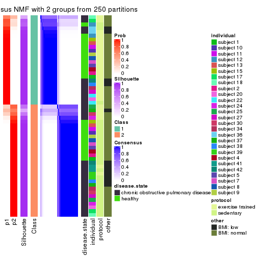</p>

</div>
<div id='tab-MAD-NMF-consensus-heatmap-2'>
<pre><code class="r">consensus_heatmap(res, k = 3)
</code></pre>

<p>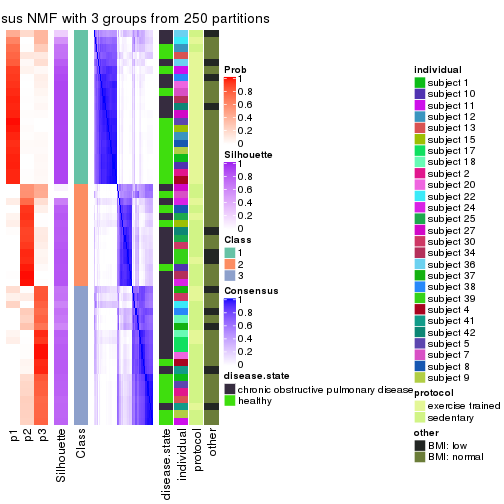</p>

</div>
<div id='tab-MAD-NMF-consensus-heatmap-3'>
<pre><code class="r">consensus_heatmap(res, k = 4)
</code></pre>

<p>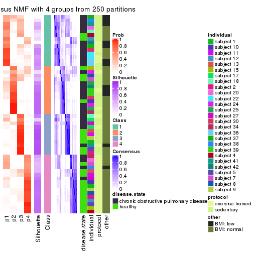</p>

</div>
<div id='tab-MAD-NMF-consensus-heatmap-4'>
<pre><code class="r">consensus_heatmap(res, k = 5)
</code></pre>

<p>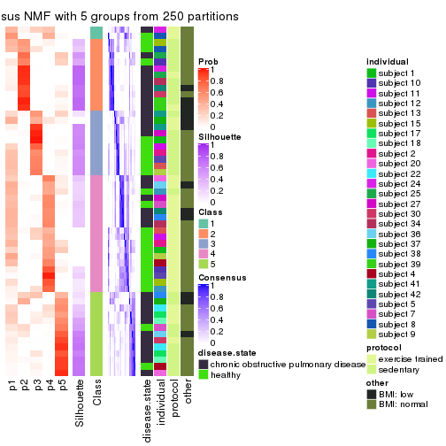</p>

</div>
<div id='tab-MAD-NMF-consensus-heatmap-5'>
<pre><code class="r">consensus_heatmap(res, k = 6)
</code></pre>

<p>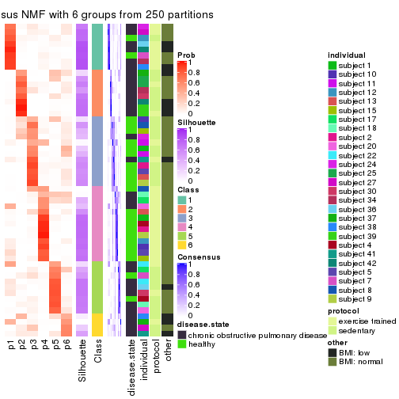</p>

</div>
</div>

Heatmaps for the membership of samples in all partitions to see how consistent they are:


<script>
$( function() {
	$( '#tabs-MAD-NMF-membership-heatmap' ).tabs();
} );
</script>
<div id='tabs-MAD-NMF-membership-heatmap'>
<ul>
<li><a href='#tab-MAD-NMF-membership-heatmap-1'>k = 2</a></li>
<li><a href='#tab-MAD-NMF-membership-heatmap-2'>k = 3</a></li>
<li><a href='#tab-MAD-NMF-membership-heatmap-3'>k = 4</a></li>
<li><a href='#tab-MAD-NMF-membership-heatmap-4'>k = 5</a></li>
<li><a href='#tab-MAD-NMF-membership-heatmap-5'>k = 6</a></li>
</ul>
<div id='tab-MAD-NMF-membership-heatmap-1'>
<pre><code class="r">membership_heatmap(res, k = 2)
</code></pre>

<p>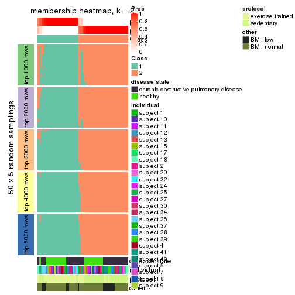</p>

</div>
<div id='tab-MAD-NMF-membership-heatmap-2'>
<pre><code class="r">membership_heatmap(res, k = 3)
</code></pre>

<p>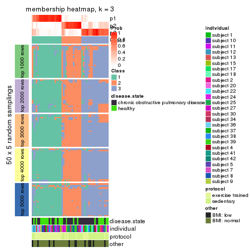</p>

</div>
<div id='tab-MAD-NMF-membership-heatmap-3'>
<pre><code class="r">membership_heatmap(res, k = 4)
</code></pre>

<p>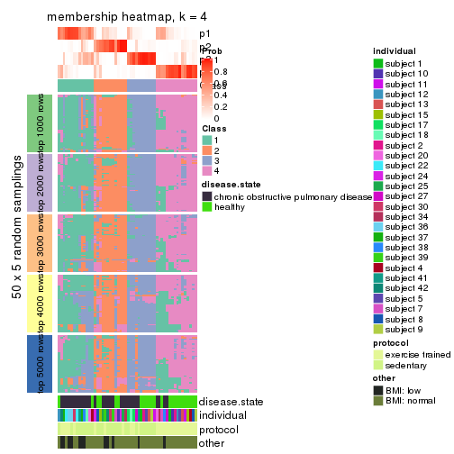</p>

</div>
<div id='tab-MAD-NMF-membership-heatmap-4'>
<pre><code class="r">membership_heatmap(res, k = 5)
</code></pre>

<p>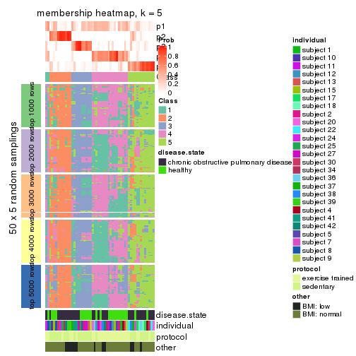</p>

</div>
<div id='tab-MAD-NMF-membership-heatmap-5'>
<pre><code class="r">membership_heatmap(res, k = 6)
</code></pre>

<p>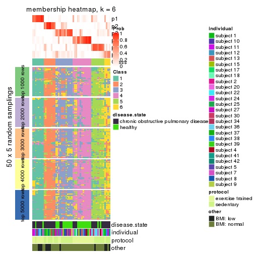</p>

</div>
</div>

As soon as we have had the classes for columns, we can look for signatures
which are significantly different between classes which can be candidate marks
for certain classes. Following are the heatmaps for signatures.


Signature heatmaps where rows are scaled:


<script>
$( function() {
	$( '#tabs-MAD-NMF-get-signatures' ).tabs();
} );
</script>
<div id='tabs-MAD-NMF-get-signatures'>
<ul>
<li><a href='#tab-MAD-NMF-get-signatures-1'>k = 2</a></li>
<li><a href='#tab-MAD-NMF-get-signatures-2'>k = 3</a></li>
<li><a href='#tab-MAD-NMF-get-signatures-3'>k = 4</a></li>
<li><a href='#tab-MAD-NMF-get-signatures-4'>k = 5</a></li>
<li><a href='#tab-MAD-NMF-get-signatures-5'>k = 6</a></li>
</ul>
<div id='tab-MAD-NMF-get-signatures-1'>
<pre><code class="r">get_signatures(res, k = 2)
</code></pre>

<p>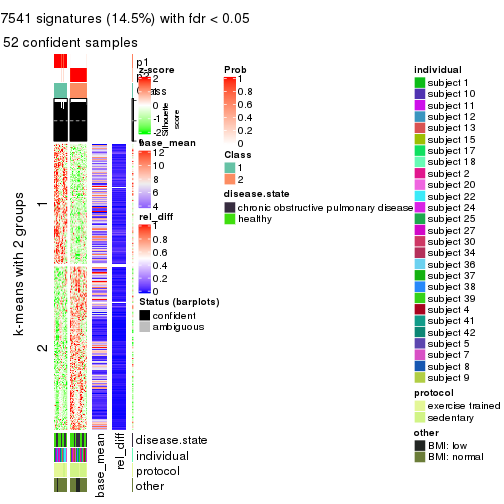</p>

</div>
<div id='tab-MAD-NMF-get-signatures-2'>
<pre><code class="r">get_signatures(res, k = 3)
</code></pre>

<p>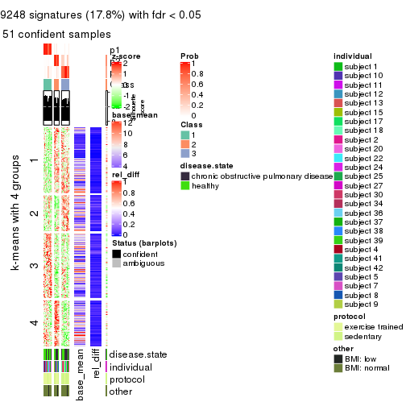</p>

</div>
<div id='tab-MAD-NMF-get-signatures-3'>
<pre><code class="r">get_signatures(res, k = 4)
</code></pre>

<p>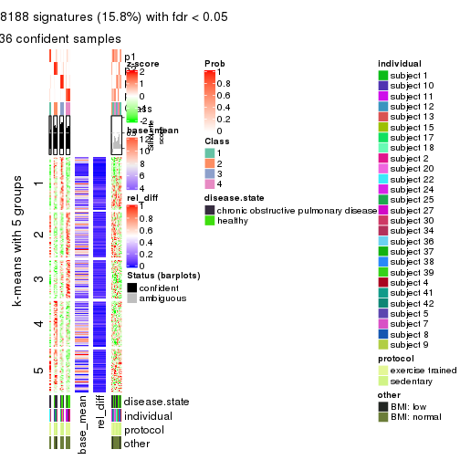</p>

</div>
<div id='tab-MAD-NMF-get-signatures-4'>
<pre><code class="r">get_signatures(res, k = 5)
</code></pre>

<p>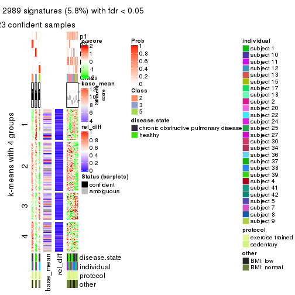</p>

</div>
<div id='tab-MAD-NMF-get-signatures-5'>
<pre><code class="r">get_signatures(res, k = 6)
</code></pre>

<p>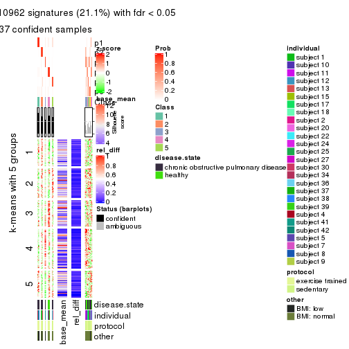</p>

</div>
</div>


Signature heatmaps where rows are not scaled:


<script>
$( function() {
	$( '#tabs-MAD-NMF-get-signatures-no-scale' ).tabs();
} );
</script>
<div id='tabs-MAD-NMF-get-signatures-no-scale'>
<ul>
<li><a href='#tab-MAD-NMF-get-signatures-no-scale-1'>k = 2</a></li>
<li><a href='#tab-MAD-NMF-get-signatures-no-scale-2'>k = 3</a></li>
<li><a href='#tab-MAD-NMF-get-signatures-no-scale-3'>k = 4</a></li>
<li><a href='#tab-MAD-NMF-get-signatures-no-scale-4'>k = 5</a></li>
<li><a href='#tab-MAD-NMF-get-signatures-no-scale-5'>k = 6</a></li>
</ul>
<div id='tab-MAD-NMF-get-signatures-no-scale-1'>
<pre><code class="r">get_signatures(res, k = 2, scale_rows = FALSE)
</code></pre>

<p>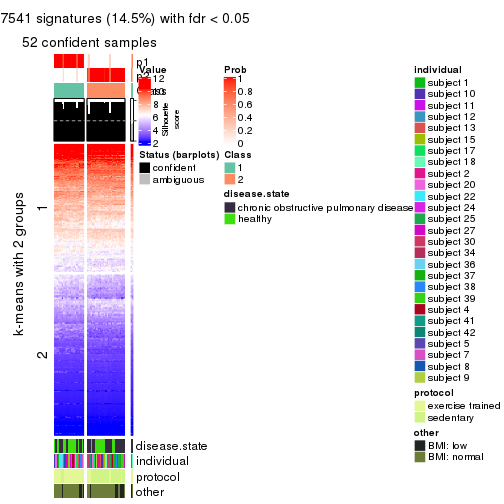</p>

</div>
<div id='tab-MAD-NMF-get-signatures-no-scale-2'>
<pre><code class="r">get_signatures(res, k = 3, scale_rows = FALSE)
</code></pre>

<p>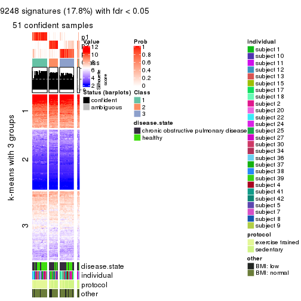</p>

</div>
<div id='tab-MAD-NMF-get-signatures-no-scale-3'>
<pre><code class="r">get_signatures(res, k = 4, scale_rows = FALSE)
</code></pre>

<p>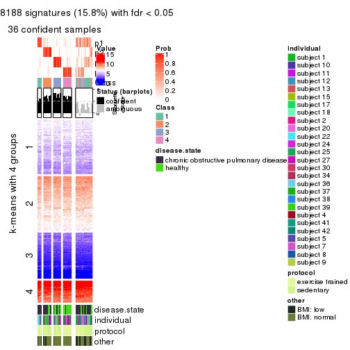</p>

</div>
<div id='tab-MAD-NMF-get-signatures-no-scale-4'>
<pre><code class="r">get_signatures(res, k = 5, scale_rows = FALSE)
</code></pre>

<p>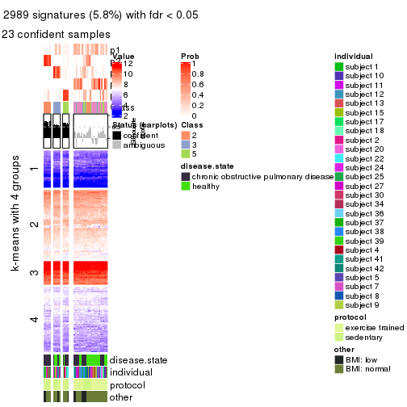</p>

</div>
<div id='tab-MAD-NMF-get-signatures-no-scale-5'>
<pre><code class="r">get_signatures(res, k = 6, scale_rows = FALSE)
</code></pre>

<p>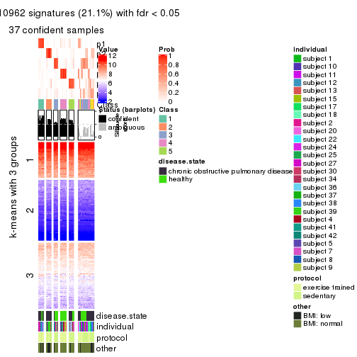</p>

</div>
</div>


Compare the overlap of signatures from different k:

```r
compare_signatures(res)
```

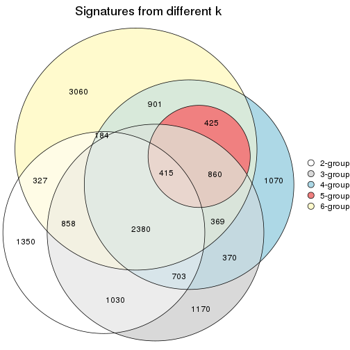

`get_signature()` returns a data frame invisibly. TO get the list of signatures, the function
call should be assigned to a variable explicitly. In following code, if `plot` argument is set
to `FALSE`, no heatmap is plotted while only the differential analysis is performed.

```r
# code only for demonstration
tb = get_signature(res, k = ..., plot = FALSE)
```

An example of the output of `tb` is:

```
#>   which_row         fdr    mean_1    mean_2 scaled_mean_1 scaled_mean_2 km
#> 1        38 0.042760348  8.373488  9.131774    -0.5533452     0.5164555  1
#> 2        40 0.018707592  7.106213  8.469186    -0.6173731     0.5762149  1
#> 3        55 0.019134737 10.221463 11.207825    -0.6159697     0.5749050  1
#> 4        59 0.006059896  5.921854  7.869574    -0.6899429     0.6439467  1
#> 5        60 0.018055526  8.928898 10.211722    -0.6204761     0.5791110  1
#> 6        98 0.009384629 15.714769 14.887706     0.6635654    -0.6193277  2
...
```

The columns in `tb` are:

1. `which_row`: row indices corresponding to the input matrix.
2. `fdr`: FDR for the differential test. 
3. `mean_x`: The mean value in group x.
4. `scaled_mean_x`: The mean value in group x after rows are scaled.
5. `km`: Row groups if k-means clustering is applied to rows.


UMAP plot which shows how samples are separated.


<script>
$( function() {
	$( '#tabs-MAD-NMF-dimension-reduction' ).tabs();
} );
</script>
<div id='tabs-MAD-NMF-dimension-reduction'>
<ul>
<li><a href='#tab-MAD-NMF-dimension-reduction-1'>k = 2</a></li>
<li><a href='#tab-MAD-NMF-dimension-reduction-2'>k = 3</a></li>
<li><a href='#tab-MAD-NMF-dimension-reduction-3'>k = 4</a></li>
<li><a href='#tab-MAD-NMF-dimension-reduction-4'>k = 5</a></li>
<li><a href='#tab-MAD-NMF-dimension-reduction-5'>k = 6</a></li>
</ul>
<div id='tab-MAD-NMF-dimension-reduction-1'>
<pre><code class="r">dimension_reduction(res, k = 2, method = &quot;UMAP&quot;)
</code></pre>

<p>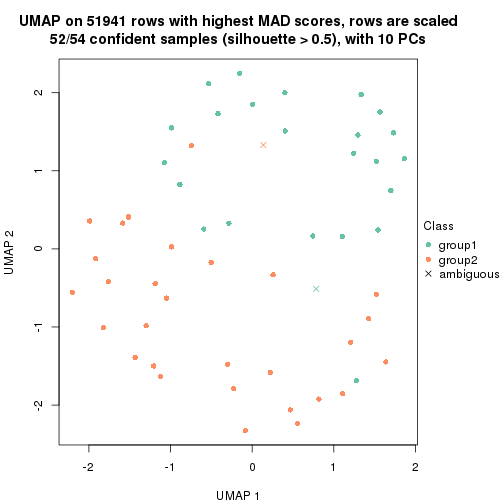</p>

</div>
<div id='tab-MAD-NMF-dimension-reduction-2'>
<pre><code class="r">dimension_reduction(res, k = 3, method = &quot;UMAP&quot;)
</code></pre>

<p>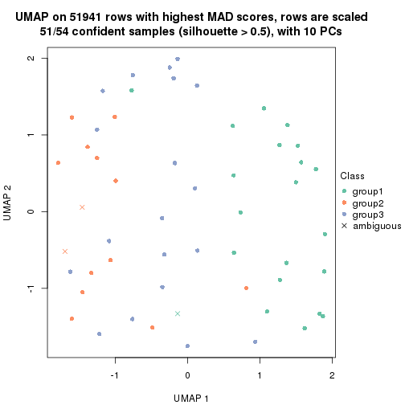</p>

</div>
<div id='tab-MAD-NMF-dimension-reduction-3'>
<pre><code class="r">dimension_reduction(res, k = 4, method = &quot;UMAP&quot;)
</code></pre>

<p>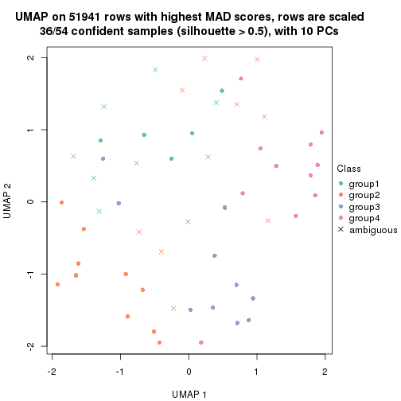</p>

</div>
<div id='tab-MAD-NMF-dimension-reduction-4'>
<pre><code class="r">dimension_reduction(res, k = 5, method = &quot;UMAP&quot;)
</code></pre>

<p>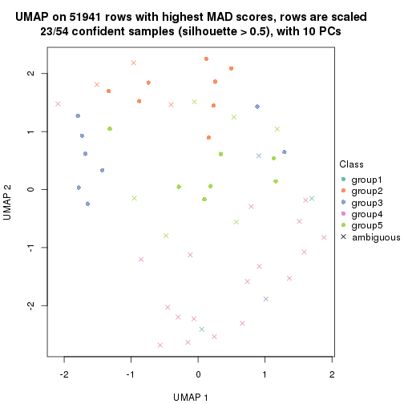</p>

</div>
<div id='tab-MAD-NMF-dimension-reduction-5'>
<pre><code class="r">dimension_reduction(res, k = 6, method = &quot;UMAP&quot;)
</code></pre>

<p>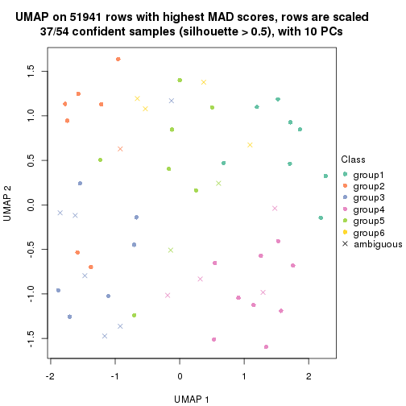</p>

</div>
</div>


Following heatmap shows how subgroups are split when increasing `k`:

```r
collect_classes(res)
```

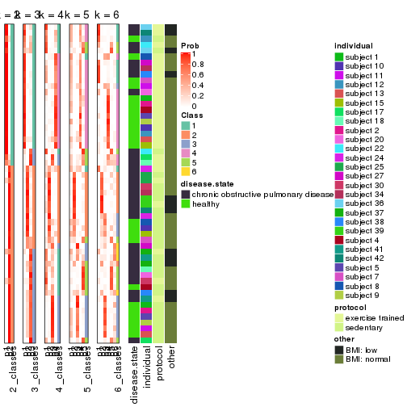


Test correlation between subgroups and known annotations. If the known
annotation is numeric, one-way ANOVA test is applied, and if the known
annotation is discrete, chi-squared contingency table test is applied.

```r
test_to_known_factors(res)
```

```
#>          n disease.state(p) individual(p) protocol(p) other(p) k
#> MAD:NMF 52         0.291172         0.892    2.38e-06    0.803 2
#> MAD:NMF 51         0.058420         0.349    8.43e-06    0.655 3
#> MAD:NMF 36         0.000955         0.207    9.66e-04    0.124 4
#> MAD:NMF 23         0.002650         0.268    7.78e-01    0.407 5
#> MAD:NMF 37         0.000206         0.443    3.29e-04    0.211 6
```


If matrix rows can be associated to genes, consider to use `functional_enrichment(res,
...)` to perform function enrichment for the signature genes. See [this vignette](http://bioconductor.org/packages/devel/bioc/vignettes/cola/inst/doc/functional_enrichment.html) for more detailed explanations.


 

---------------------------------------------------


### ATC:hclust


The object with results only for a single top-value method and a single partition method 
can be extracted as:

```r
res = res_list["ATC", "hclust"]
# you can also extract it by
# res = res_list["ATC:hclust"]
```

A summary of `res` and all the functions that can be applied to it:

```r
res
```

```
#> A 'ConsensusPartition' object with k = 2, 3, 4, 5, 6.
#>   On a matrix with 51941 rows and 54 columns.
#>   Top rows (1000, 2000, 3000, 4000, 5000) are extracted by 'ATC' method.
#>   Subgroups are detected by 'hclust' method.
#>   Performed in total 1250 partitions by row resampling.
#>   Best k for subgroups seems to be 2.
#> 
#> Following methods can be applied to this 'ConsensusPartition' object:
#>  [1] "cola_report"             "collect_classes"         "collect_plots"          
#>  [4] "collect_stats"           "colnames"                "compare_signatures"     
#>  [7] "consensus_heatmap"       "dimension_reduction"     "functional_enrichment"  
#> [10] "get_anno_col"            "get_anno"                "get_classes"            
#> [13] "get_consensus"           "get_matrix"              "get_membership"         
#> [16] "get_param"               "get_signatures"          "get_stats"              
#> [19] "is_best_k"               "is_stable_k"             "membership_heatmap"     
#> [22] "ncol"                    "nrow"                    "plot_ecdf"              
#> [25] "rownames"                "select_partition_number" "show"                   
#> [28] "suggest_best_k"          "test_to_known_factors"
```

`collect_plots()` function collects all the plots made from `res` for all `k` (number of partitions)
into one single page to provide an easy and fast comparison between different `k`.

```r
collect_plots(res)
```

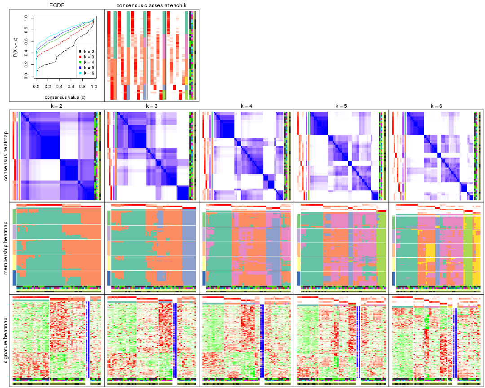

The plots are:

- The first row: a plot of the ECDF (empirical cumulative distribution
  function) curves of the consensus matrix for each `k` and the heatmap of
  predicted classes for each `k`.
- The second row: heatmaps of the consensus matrix for each `k`.
- The third row: heatmaps of the membership matrix for each `k`.
- The fouth row: heatmaps of the signatures for each `k`.

All the plots in panels can be made by individual functions and they are
plotted later in this section.

`select_partition_number()` produces several plots showing different
statistics for choosing "optimized" `k`. There are following statistics:

- ECDF curves of the consensus matrix for each `k`;
- 1-PAC. [The PAC
  score](https://en.wikipedia.org/wiki/Consensus_clustering#Over-interpretation_potential_of_consensus_clustering)
  measures the proportion of the ambiguous subgrouping.
- Mean silhouette score.
- Concordance. The mean probability of fiting the consensus class ids in all
  partitions.
- Area increased. Denote $A_k$ as the area under the ECDF curve for current
  `k`, the area increased is defined as $A_k - A_{k-1}$.
- Rand index. The percent of pairs of samples that are both in a same cluster
  or both are not in a same cluster in the partition of k and k-1.
- Jaccard index. The ratio of pairs of samples are both in a same cluster in
  the partition of k and k-1 and the pairs of samples are both in a same
  cluster in the partition k or k-1.

The detailed explanations of these statistics can be found in [the _cola_
vignette](http://bioconductor.org/packages/devel/bioc/vignettes/cola/inst/doc/cola.html#toc_13).

Generally speaking, lower PAC score, higher mean silhouette score or higher
concordance corresponds to better partition. Rand index and Jaccard index
measure how similar the current partition is compared to partition with `k-1`.
If they are too similar, we won't accept `k` is better than `k-1`.

```r
select_partition_number(res)
```

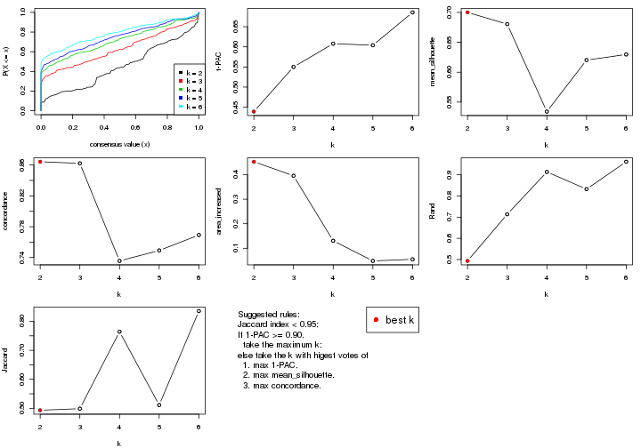

The numeric values for all these statistics can be obtained by `get_stats()`.

```r
get_stats(res)
```

```
#>   k 1-PAC mean_silhouette concordance area_increased  Rand Jaccard
#> 2 2 0.439           0.700       0.864         0.4526 0.493   0.493
#> 3 3 0.550           0.680       0.862         0.3955 0.713   0.499
#> 4 4 0.608           0.534       0.736         0.1305 0.913   0.764
#> 5 5 0.604           0.620       0.749         0.0486 0.832   0.511
#> 6 6 0.685           0.630       0.769         0.0549 0.962   0.835
```

`suggest_best_k()` suggests the best $k$ based on these statistics. The rules are as follows:

- All $k$ with Jaccard index larger than 0.95 are removed because increasing
  $k$ does not provide enough extra information. If all $k$ are removed, it is
  marked as no subgroup is detected.
- For all $k$ with 1-PAC score larger than 0.9, the maximal $k$ is taken as
  the best $k$, and other $k$ are marked as optional $k$.
- If it does not fit the second rule. The $k$ with the maximal vote of the
  highest 1-PAC score, highest mean silhouette, and highest concordance is
  taken as the best $k$.

```r
suggest_best_k(res)
```

```
#> [1] 2
```


Following shows the table of the partitions (You need to click the **show/hide
code output** link to see it). The membership matrix (columns with name `p*`)
is inferred by
[`clue::cl_consensus()`](https://www.rdocumentation.org/link/cl_consensus?package=clue)
function with the `SE` method. Basically the value in the membership matrix
represents the probability to belong to a certain group. The finall class
label for an item is determined with the group with highest probability it
belongs to.

In `get_classes()` function, the entropy is calculated from the membership
matrix and the silhouette score is calculated from the consensus matrix.


<script>
$( function() {
	$( '#tabs-ATC-hclust-get-classes' ).tabs();
} );
</script>
<div id='tabs-ATC-hclust-get-classes'>
<ul>
<li><a href='#tab-ATC-hclust-get-classes-1'>k = 2</a></li>
<li><a href='#tab-ATC-hclust-get-classes-2'>k = 3</a></li>
<li><a href='#tab-ATC-hclust-get-classes-3'>k = 4</a></li>
<li><a href='#tab-ATC-hclust-get-classes-4'>k = 5</a></li>
<li><a href='#tab-ATC-hclust-get-classes-5'>k = 6</a></li>
</ul>

<div id='tab-ATC-hclust-get-classes-1'>
<p><a id='tab-ATC-hclust-get-classes-1-a' style='color:#0366d6' href='#'>show/hide code output</a></p>
<pre><code class="r">cbind(get_classes(res, k = 2), get_membership(res, k = 2))
</code></pre>

<pre><code>#&gt;           class entropy silhouette    p1    p2
#&gt; GSM680053     2   0.925      0.615 0.340 0.660
#&gt; GSM680062     2   0.991      0.367 0.444 0.556
#&gt; GSM680054     2   0.000      0.766 0.000 1.000
#&gt; GSM680063     2   0.163      0.768 0.024 0.976
#&gt; GSM680055     1   0.506      0.806 0.888 0.112
#&gt; GSM680064     1   0.000      0.854 1.000 0.000
#&gt; GSM680056     1   0.952      0.319 0.628 0.372
#&gt; GSM680065     1   0.000      0.854 1.000 0.000
#&gt; GSM680057     2   0.000      0.766 0.000 1.000
#&gt; GSM680066     1   0.278      0.843 0.952 0.048
#&gt; GSM680058     1   0.925      0.426 0.660 0.340
#&gt; GSM680067     2   0.163      0.768 0.024 0.976
#&gt; GSM680059     2   0.932      0.605 0.348 0.652
#&gt; GSM680068     1   0.000      0.854 1.000 0.000
#&gt; GSM680060     1   0.000      0.854 1.000 0.000
#&gt; GSM680069     1   0.311      0.840 0.944 0.056
#&gt; GSM680061     2   0.000      0.766 0.000 1.000
#&gt; GSM680070     1   0.000      0.854 1.000 0.000
#&gt; GSM680071     1   0.000      0.854 1.000 0.000
#&gt; GSM680077     1   0.000      0.854 1.000 0.000
#&gt; GSM680072     2   0.932      0.605 0.348 0.652
#&gt; GSM680078     1   0.000      0.854 1.000 0.000
#&gt; GSM680073     1   0.839      0.591 0.732 0.268
#&gt; GSM680079     1   0.000      0.854 1.000 0.000
#&gt; GSM680074     2   0.932      0.605 0.348 0.652
#&gt; GSM680080     2   0.932      0.605 0.348 0.652
#&gt; GSM680075     1   0.000      0.854 1.000 0.000
#&gt; GSM680081     2   0.260      0.765 0.044 0.956
#&gt; GSM680076     1   0.909      0.473 0.676 0.324
#&gt; GSM680082     1   0.000      0.854 1.000 0.000
#&gt; GSM680029     1   0.552      0.792 0.872 0.128
#&gt; GSM680041     1   0.443      0.820 0.908 0.092
#&gt; GSM680035     2   0.000      0.766 0.000 1.000
#&gt; GSM680047     1   0.000      0.854 1.000 0.000
#&gt; GSM680036     1   0.343      0.836 0.936 0.064
#&gt; GSM680048     1   0.998     -0.105 0.528 0.472
#&gt; GSM680037     2   0.000      0.766 0.000 1.000
#&gt; GSM680049     1   0.482      0.812 0.896 0.104
#&gt; GSM680038     2   0.932      0.605 0.348 0.652
#&gt; GSM680050     1   0.000      0.854 1.000 0.000
#&gt; GSM680039     2   0.866      0.659 0.288 0.712
#&gt; GSM680051     1   0.998     -0.105 0.528 0.472
#&gt; GSM680040     2   0.753      0.701 0.216 0.784
#&gt; GSM680052     2   0.929      0.610 0.344 0.656
#&gt; GSM680030     2   0.163      0.768 0.024 0.976
#&gt; GSM680042     1   0.184      0.848 0.972 0.028
#&gt; GSM680031     2   0.000      0.766 0.000 1.000
#&gt; GSM680043     2   0.000      0.766 0.000 1.000
#&gt; GSM680032     1   0.706      0.718 0.808 0.192
#&gt; GSM680044     2   0.991      0.367 0.444 0.556
#&gt; GSM680033     2   0.000      0.766 0.000 1.000
#&gt; GSM680045     2   0.913      0.627 0.328 0.672
#&gt; GSM680034     2   0.000      0.766 0.000 1.000
#&gt; GSM680046     1   0.000      0.854 1.000 0.000
</code></pre>

<script>
$('#tab-ATC-hclust-get-classes-1-a').parent().next().next().hide();
$('#tab-ATC-hclust-get-classes-1-a').click(function(){
  $('#tab-ATC-hclust-get-classes-1-a').parent().next().next().toggle();
  return(false);
});
</script>
</div>

<div id='tab-ATC-hclust-get-classes-2'>
<p><a id='tab-ATC-hclust-get-classes-2-a' style='color:#0366d6' href='#'>show/hide code output</a></p>
<pre><code class="r">cbind(get_classes(res, k = 3), get_membership(res, k = 3))
</code></pre>

<pre><code>#&gt;           class entropy silhouette    p1    p2    p3
#&gt; GSM680053     2  0.0592      0.750 0.000 0.988 0.012
#&gt; GSM680062     2  0.2796      0.710 0.092 0.908 0.000
#&gt; GSM680054     3  0.0000      0.982 0.000 0.000 1.000
#&gt; GSM680063     2  0.6204      0.199 0.000 0.576 0.424
#&gt; GSM680055     1  0.6225      0.369 0.568 0.432 0.000
#&gt; GSM680064     1  0.0000      0.829 1.000 0.000 0.000
#&gt; GSM680056     2  0.5431      0.485 0.284 0.716 0.000
#&gt; GSM680065     1  0.0000      0.829 1.000 0.000 0.000
#&gt; GSM680057     3  0.3412      0.836 0.000 0.124 0.876
#&gt; GSM680066     1  0.5138      0.674 0.748 0.252 0.000
#&gt; GSM680058     2  0.5678      0.407 0.316 0.684 0.000
#&gt; GSM680067     2  0.6204      0.199 0.000 0.576 0.424
#&gt; GSM680059     2  0.0237      0.751 0.000 0.996 0.004
#&gt; GSM680068     1  0.0000      0.829 1.000 0.000 0.000
#&gt; GSM680060     1  0.1031      0.828 0.976 0.024 0.000
#&gt; GSM680069     1  0.5291      0.656 0.732 0.268 0.000
#&gt; GSM680061     3  0.0000      0.982 0.000 0.000 1.000
#&gt; GSM680070     1  0.2165      0.819 0.936 0.064 0.000
#&gt; GSM680071     1  0.0747      0.829 0.984 0.016 0.000
#&gt; GSM680077     1  0.0000      0.829 1.000 0.000 0.000
#&gt; GSM680072     2  0.0237      0.751 0.000 0.996 0.004
#&gt; GSM680078     1  0.0000      0.829 1.000 0.000 0.000
#&gt; GSM680073     2  0.6045      0.225 0.380 0.620 0.000
#&gt; GSM680079     1  0.0000      0.829 1.000 0.000 0.000
#&gt; GSM680074     2  0.0237      0.751 0.000 0.996 0.004
#&gt; GSM680080     2  0.0237      0.751 0.000 0.996 0.004
#&gt; GSM680075     1  0.0000      0.829 1.000 0.000 0.000
#&gt; GSM680081     2  0.6192      0.240 0.000 0.580 0.420
#&gt; GSM680076     2  0.5733      0.373 0.324 0.676 0.000
#&gt; GSM680082     1  0.1964      0.822 0.944 0.056 0.000
#&gt; GSM680029     1  0.6295      0.264 0.528 0.472 0.000
#&gt; GSM680041     1  0.5968      0.512 0.636 0.364 0.000
#&gt; GSM680035     3  0.0000      0.982 0.000 0.000 1.000
#&gt; GSM680047     1  0.0000      0.829 1.000 0.000 0.000
#&gt; GSM680036     1  0.5291      0.652 0.732 0.268 0.000
#&gt; GSM680048     2  0.4654      0.614 0.208 0.792 0.000
#&gt; GSM680037     3  0.0000      0.982 0.000 0.000 1.000
#&gt; GSM680049     1  0.6180      0.410 0.584 0.416 0.000
#&gt; GSM680038     2  0.0237      0.751 0.000 0.996 0.004
#&gt; GSM680050     1  0.2356      0.816 0.928 0.072 0.000
#&gt; GSM680039     2  0.2796      0.711 0.000 0.908 0.092
#&gt; GSM680051     2  0.4654      0.614 0.208 0.792 0.000
#&gt; GSM680040     2  0.4002      0.647 0.000 0.840 0.160
#&gt; GSM680052     2  0.0424      0.751 0.000 0.992 0.008
#&gt; GSM680030     2  0.6204      0.199 0.000 0.576 0.424
#&gt; GSM680042     1  0.4654      0.722 0.792 0.208 0.000
#&gt; GSM680031     3  0.0000      0.982 0.000 0.000 1.000
#&gt; GSM680043     3  0.0000      0.982 0.000 0.000 1.000
#&gt; GSM680032     2  0.6286     -0.118 0.464 0.536 0.000
#&gt; GSM680044     2  0.2796      0.710 0.092 0.908 0.000
#&gt; GSM680033     3  0.0000      0.982 0.000 0.000 1.000
#&gt; GSM680045     2  0.1031      0.748 0.000 0.976 0.024
#&gt; GSM680034     3  0.0000      0.982 0.000 0.000 1.000
#&gt; GSM680046     1  0.0000      0.829 1.000 0.000 0.000
</code></pre>

<script>
$('#tab-ATC-hclust-get-classes-2-a').parent().next().next().hide();
$('#tab-ATC-hclust-get-classes-2-a').click(function(){
  $('#tab-ATC-hclust-get-classes-2-a').parent().next().next().toggle();
  return(false);
});
</script>
</div>

<div id='tab-ATC-hclust-get-classes-3'>
<p><a id='tab-ATC-hclust-get-classes-3-a' style='color:#0366d6' href='#'>show/hide code output</a></p>
<pre><code class="r">cbind(get_classes(res, k = 4), get_membership(res, k = 4))
</code></pre>

<pre><code>#&gt;           class entropy silhouette    p1    p2    p3    p4
#&gt; GSM680053     2  0.1792     0.6132 0.000 0.932 0.000 0.068
#&gt; GSM680062     2  0.3024     0.5579 0.000 0.852 0.000 0.148
#&gt; GSM680054     3  0.0000     0.8446 0.000 0.000 1.000 0.000
#&gt; GSM680063     2  0.6722     0.1989 0.000 0.500 0.092 0.408
#&gt; GSM680055     4  0.7408     0.5665 0.172 0.364 0.000 0.464
#&gt; GSM680064     1  0.0000     0.8478 1.000 0.000 0.000 0.000
#&gt; GSM680056     2  0.5599     0.1831 0.040 0.644 0.000 0.316
#&gt; GSM680065     1  0.0000     0.8478 1.000 0.000 0.000 0.000
#&gt; GSM680057     3  0.6607     0.6926 0.000 0.112 0.592 0.296
#&gt; GSM680066     1  0.7681    -0.4880 0.404 0.216 0.000 0.380
#&gt; GSM680058     2  0.5070     0.0719 0.008 0.620 0.000 0.372
#&gt; GSM680067     2  0.6722     0.1989 0.000 0.500 0.092 0.408
#&gt; GSM680059     2  0.0336     0.6213 0.000 0.992 0.000 0.008
#&gt; GSM680068     1  0.0000     0.8478 1.000 0.000 0.000 0.000
#&gt; GSM680060     1  0.0817     0.8340 0.976 0.024 0.000 0.000
#&gt; GSM680069     4  0.7706     0.4673 0.364 0.224 0.000 0.412
#&gt; GSM680061     3  0.0000     0.8446 0.000 0.000 1.000 0.000
#&gt; GSM680070     1  0.4100     0.6997 0.824 0.048 0.000 0.128
#&gt; GSM680071     1  0.0592     0.8394 0.984 0.016 0.000 0.000
#&gt; GSM680077     1  0.0000     0.8478 1.000 0.000 0.000 0.000
#&gt; GSM680072     2  0.0921     0.6165 0.000 0.972 0.000 0.028
#&gt; GSM680078     1  0.0000     0.8478 1.000 0.000 0.000 0.000
#&gt; GSM680073     2  0.4961    -0.1398 0.000 0.552 0.000 0.448
#&gt; GSM680079     1  0.0000     0.8478 1.000 0.000 0.000 0.000
#&gt; GSM680074     2  0.0336     0.6213 0.000 0.992 0.000 0.008
#&gt; GSM680080     2  0.0336     0.6213 0.000 0.992 0.000 0.008
#&gt; GSM680075     1  0.0000     0.8478 1.000 0.000 0.000 0.000
#&gt; GSM680081     4  0.6633    -0.3625 0.000 0.416 0.084 0.500
#&gt; GSM680076     2  0.4830     0.0177 0.000 0.608 0.000 0.392
#&gt; GSM680082     1  0.3787     0.7182 0.840 0.036 0.000 0.124
#&gt; GSM680029     4  0.7175     0.4963 0.136 0.404 0.000 0.460
#&gt; GSM680041     4  0.7653     0.6055 0.240 0.300 0.000 0.460
#&gt; GSM680035     3  0.4697     0.7892 0.000 0.000 0.644 0.356
#&gt; GSM680047     1  0.0000     0.8478 1.000 0.000 0.000 0.000
#&gt; GSM680036     4  0.7535     0.4958 0.336 0.200 0.000 0.464
#&gt; GSM680048     2  0.5067     0.4295 0.048 0.736 0.000 0.216
#&gt; GSM680037     3  0.4697     0.7892 0.000 0.000 0.644 0.356
#&gt; GSM680049     4  0.7494     0.5824 0.188 0.352 0.000 0.460
#&gt; GSM680038     2  0.1022     0.6159 0.000 0.968 0.000 0.032
#&gt; GSM680050     1  0.4578     0.6446 0.788 0.052 0.000 0.160
#&gt; GSM680039     2  0.3074     0.5562 0.000 0.848 0.000 0.152
#&gt; GSM680051     2  0.5067     0.4295 0.048 0.736 0.000 0.216
#&gt; GSM680040     2  0.4406     0.4592 0.000 0.700 0.000 0.300
#&gt; GSM680052     2  0.1716     0.6172 0.000 0.936 0.000 0.064
#&gt; GSM680030     2  0.6764     0.1973 0.000 0.500 0.096 0.404
#&gt; GSM680042     1  0.7365    -0.3636 0.440 0.160 0.000 0.400
#&gt; GSM680031     3  0.0000     0.8446 0.000 0.000 1.000 0.000
#&gt; GSM680043     3  0.4697     0.7892 0.000 0.000 0.644 0.356
#&gt; GSM680032     2  0.7135    -0.4610 0.132 0.468 0.000 0.400
#&gt; GSM680044     2  0.3024     0.5579 0.000 0.852 0.000 0.148
#&gt; GSM680033     3  0.0000     0.8446 0.000 0.000 1.000 0.000
#&gt; GSM680045     2  0.2011     0.6110 0.000 0.920 0.000 0.080
#&gt; GSM680034     3  0.0000     0.8446 0.000 0.000 1.000 0.000
#&gt; GSM680046     1  0.0000     0.8478 1.000 0.000 0.000 0.000
</code></pre>

<script>
$('#tab-ATC-hclust-get-classes-3-a').parent().next().next().hide();
$('#tab-ATC-hclust-get-classes-3-a').click(function(){
  $('#tab-ATC-hclust-get-classes-3-a').parent().next().next().toggle();
  return(false);
});
</script>
</div>

<div id='tab-ATC-hclust-get-classes-4'>
<p><a id='tab-ATC-hclust-get-classes-4-a' style='color:#0366d6' href='#'>show/hide code output</a></p>
<pre><code class="r">cbind(get_classes(res, k = 5), get_membership(res, k = 5))
</code></pre>

<pre><code>#&gt;           class entropy silhouette    p1    p2    p3    p4    p5
#&gt; GSM680053     2  0.4437      0.616 0.000 0.664 0.020 0.316 0.000
#&gt; GSM680062     2  0.4262      0.412 0.000 0.560 0.000 0.440 0.000
#&gt; GSM680054     5  0.0000      0.863 0.000 0.000 0.000 0.000 1.000
#&gt; GSM680063     2  0.4457      0.280 0.000 0.656 0.328 0.012 0.004
#&gt; GSM680055     4  0.2873      0.626 0.120 0.020 0.000 0.860 0.000
#&gt; GSM680064     1  0.0451      0.923 0.988 0.008 0.004 0.000 0.000
#&gt; GSM680056     4  0.4325      0.248 0.004 0.300 0.012 0.684 0.000
#&gt; GSM680065     1  0.0324      0.924 0.992 0.004 0.004 0.000 0.000
#&gt; GSM680057     5  0.6403      0.131 0.000 0.232 0.256 0.000 0.512
#&gt; GSM680066     4  0.4283      0.458 0.348 0.000 0.008 0.644 0.000
#&gt; GSM680058     4  0.2930      0.378 0.000 0.164 0.004 0.832 0.000
#&gt; GSM680067     2  0.4457      0.280 0.000 0.656 0.328 0.012 0.004
#&gt; GSM680059     2  0.4410      0.606 0.000 0.556 0.004 0.440 0.000
#&gt; GSM680068     1  0.0000      0.925 1.000 0.000 0.000 0.000 0.000
#&gt; GSM680060     1  0.1341      0.903 0.944 0.000 0.000 0.056 0.000
#&gt; GSM680069     4  0.4108      0.523 0.308 0.000 0.008 0.684 0.000
#&gt; GSM680061     5  0.1544      0.815 0.000 0.000 0.068 0.000 0.932
#&gt; GSM680070     1  0.3388      0.748 0.792 0.000 0.008 0.200 0.000
#&gt; GSM680071     1  0.1197      0.907 0.952 0.000 0.000 0.048 0.000
#&gt; GSM680077     1  0.0510      0.921 0.984 0.000 0.000 0.016 0.000
#&gt; GSM680072     2  0.4434      0.587 0.000 0.536 0.004 0.460 0.000
#&gt; GSM680078     1  0.0451      0.923 0.988 0.008 0.004 0.000 0.000
#&gt; GSM680073     4  0.1952      0.491 0.000 0.084 0.004 0.912 0.000
#&gt; GSM680079     1  0.0451      0.923 0.988 0.008 0.004 0.000 0.000
#&gt; GSM680074     2  0.4410      0.606 0.000 0.556 0.004 0.440 0.000
#&gt; GSM680080     2  0.4410      0.606 0.000 0.556 0.004 0.440 0.000
#&gt; GSM680075     1  0.0613      0.923 0.984 0.008 0.004 0.004 0.000
#&gt; GSM680081     2  0.3932      0.158 0.000 0.672 0.328 0.000 0.000
#&gt; GSM680076     4  0.2763      0.400 0.000 0.148 0.004 0.848 0.000
#&gt; GSM680082     1  0.3246      0.766 0.808 0.000 0.008 0.184 0.000
#&gt; GSM680029     4  0.3267      0.617 0.112 0.044 0.000 0.844 0.000
#&gt; GSM680041     4  0.5011      0.618 0.176 0.088 0.012 0.724 0.000
#&gt; GSM680035     3  0.1341      1.000 0.000 0.000 0.944 0.000 0.056
#&gt; GSM680047     1  0.0000      0.925 1.000 0.000 0.000 0.000 0.000
#&gt; GSM680036     4  0.3730      0.494 0.288 0.000 0.000 0.712 0.000
#&gt; GSM680048     4  0.4989     -0.166 0.016 0.456 0.008 0.520 0.000
#&gt; GSM680037     3  0.1341      1.000 0.000 0.000 0.944 0.000 0.056
#&gt; GSM680049     4  0.5046      0.625 0.148 0.112 0.012 0.728 0.000
#&gt; GSM680038     2  0.4437      0.582 0.000 0.532 0.004 0.464 0.000
#&gt; GSM680050     1  0.3700      0.678 0.752 0.000 0.008 0.240 0.000
#&gt; GSM680039     2  0.4948      0.596 0.000 0.676 0.068 0.256 0.000
#&gt; GSM680051     4  0.4989     -0.166 0.016 0.456 0.008 0.520 0.000
#&gt; GSM680040     2  0.4219      0.559 0.000 0.780 0.116 0.104 0.000
#&gt; GSM680052     2  0.3990      0.595 0.000 0.688 0.004 0.308 0.000
#&gt; GSM680030     2  0.4557      0.280 0.000 0.656 0.324 0.012 0.008
#&gt; GSM680042     4  0.6048      0.282 0.376 0.088 0.012 0.524 0.000
#&gt; GSM680031     5  0.0000      0.863 0.000 0.000 0.000 0.000 1.000
#&gt; GSM680043     3  0.1341      1.000 0.000 0.000 0.944 0.000 0.056
#&gt; GSM680032     4  0.4569      0.570 0.104 0.148 0.000 0.748 0.000
#&gt; GSM680044     2  0.4262      0.412 0.000 0.560 0.000 0.440 0.000
#&gt; GSM680033     5  0.0162      0.862 0.000 0.000 0.004 0.000 0.996
#&gt; GSM680045     2  0.4318      0.612 0.000 0.688 0.020 0.292 0.000
#&gt; GSM680034     5  0.0000      0.863 0.000 0.000 0.000 0.000 1.000
#&gt; GSM680046     1  0.0000      0.925 1.000 0.000 0.000 0.000 0.000
</code></pre>

<script>
$('#tab-ATC-hclust-get-classes-4-a').parent().next().next().hide();
$('#tab-ATC-hclust-get-classes-4-a').click(function(){
  $('#tab-ATC-hclust-get-classes-4-a').parent().next().next().toggle();
  return(false);
});
</script>
</div>

<div id='tab-ATC-hclust-get-classes-5'>
<p><a id='tab-ATC-hclust-get-classes-5-a' style='color:#0366d6' href='#'>show/hide code output</a></p>
<pre><code class="r">cbind(get_classes(res, k = 6), get_membership(res, k = 6))
</code></pre>

<pre><code>#&gt;           class entropy silhouette    p1    p2    p3    p4    p5    p6
#&gt; GSM680053     2  0.5631      0.558 0.000 0.528 0.000 0.188 0.000 0.284
#&gt; GSM680062     2  0.5900      0.412 0.000 0.448 0.000 0.336 0.000 0.216
#&gt; GSM680054     5  0.0000      0.877 0.000 0.000 0.000 0.000 1.000 0.000
#&gt; GSM680063     6  0.4635      0.698 0.000 0.336 0.056 0.000 0.000 0.608
#&gt; GSM680055     4  0.2762      0.567 0.000 0.196 0.000 0.804 0.000 0.000
#&gt; GSM680064     1  0.0405      0.910 0.988 0.004 0.000 0.008 0.000 0.000
#&gt; GSM680056     4  0.5184      0.164 0.000 0.296 0.000 0.584 0.000 0.120
#&gt; GSM680065     1  0.0508      0.911 0.984 0.004 0.000 0.012 0.000 0.000
#&gt; GSM680057     5  0.5587      0.175 0.000 0.040 0.056 0.000 0.508 0.396
#&gt; GSM680066     4  0.3622      0.516 0.212 0.024 0.000 0.760 0.000 0.004
#&gt; GSM680058     4  0.3864      0.232 0.000 0.480 0.000 0.520 0.000 0.000
#&gt; GSM680067     6  0.4635      0.698 0.000 0.336 0.056 0.000 0.000 0.608
#&gt; GSM680059     2  0.2135      0.646 0.000 0.872 0.000 0.128 0.000 0.000
#&gt; GSM680068     1  0.0713      0.915 0.972 0.000 0.000 0.028 0.000 0.000
#&gt; GSM680060     1  0.1843      0.897 0.912 0.004 0.000 0.080 0.000 0.004
#&gt; GSM680069     4  0.3492      0.541 0.176 0.032 0.000 0.788 0.000 0.004
#&gt; GSM680061     5  0.1720      0.838 0.000 0.000 0.032 0.000 0.928 0.040
#&gt; GSM680070     1  0.3050      0.759 0.764 0.000 0.000 0.236 0.000 0.000
#&gt; GSM680071     1  0.1588      0.901 0.924 0.000 0.000 0.072 0.000 0.004
#&gt; GSM680077     1  0.0865      0.913 0.964 0.000 0.000 0.036 0.000 0.000
#&gt; GSM680072     2  0.2340      0.637 0.000 0.852 0.000 0.148 0.000 0.000
#&gt; GSM680078     1  0.0551      0.910 0.984 0.004 0.000 0.008 0.000 0.004
#&gt; GSM680073     4  0.3756      0.394 0.000 0.400 0.000 0.600 0.000 0.000
#&gt; GSM680079     1  0.0405      0.910 0.988 0.004 0.000 0.008 0.000 0.000
#&gt; GSM680074     2  0.2135      0.646 0.000 0.872 0.000 0.128 0.000 0.000
#&gt; GSM680080     2  0.2135      0.646 0.000 0.872 0.000 0.128 0.000 0.000
#&gt; GSM680075     1  0.0603      0.911 0.980 0.000 0.000 0.016 0.000 0.004
#&gt; GSM680081     6  0.2629      0.442 0.000 0.040 0.092 0.000 0.000 0.868
#&gt; GSM680076     4  0.3854      0.260 0.000 0.464 0.000 0.536 0.000 0.000
#&gt; GSM680082     1  0.2912      0.777 0.784 0.000 0.000 0.216 0.000 0.000
#&gt; GSM680029     4  0.3265      0.542 0.000 0.248 0.000 0.748 0.000 0.004
#&gt; GSM680041     4  0.0363      0.565 0.012 0.000 0.000 0.988 0.000 0.000
#&gt; GSM680035     3  0.0000      1.000 0.000 0.000 1.000 0.000 0.000 0.000
#&gt; GSM680047     1  0.0858      0.915 0.968 0.000 0.000 0.028 0.000 0.004
#&gt; GSM680036     4  0.4706      0.524 0.156 0.144 0.000 0.696 0.000 0.004
#&gt; GSM680048     4  0.5783     -0.118 0.000 0.280 0.000 0.500 0.000 0.220
#&gt; GSM680037     3  0.0000      1.000 0.000 0.000 1.000 0.000 0.000 0.000
#&gt; GSM680049     4  0.1471      0.564 0.004 0.064 0.000 0.932 0.000 0.000
#&gt; GSM680038     2  0.2378      0.631 0.000 0.848 0.000 0.152 0.000 0.000
#&gt; GSM680050     1  0.3266      0.703 0.728 0.000 0.000 0.272 0.000 0.000
#&gt; GSM680039     2  0.4641      0.372 0.000 0.684 0.000 0.116 0.000 0.200
#&gt; GSM680051     4  0.5783     -0.118 0.000 0.280 0.000 0.500 0.000 0.220
#&gt; GSM680040     6  0.3578      0.186 0.000 0.340 0.000 0.000 0.000 0.660
#&gt; GSM680052     2  0.5868      0.519 0.000 0.472 0.000 0.224 0.000 0.304
#&gt; GSM680030     6  0.4769      0.696 0.000 0.336 0.056 0.000 0.004 0.604
#&gt; GSM680042     4  0.2883      0.454 0.212 0.000 0.000 0.788 0.000 0.000
#&gt; GSM680031     5  0.0000      0.877 0.000 0.000 0.000 0.000 1.000 0.000
#&gt; GSM680043     3  0.0000      1.000 0.000 0.000 1.000 0.000 0.000 0.000
#&gt; GSM680032     4  0.3670      0.484 0.000 0.284 0.000 0.704 0.000 0.012
#&gt; GSM680044     2  0.5900      0.412 0.000 0.448 0.000 0.336 0.000 0.216
#&gt; GSM680033     5  0.0146      0.876 0.000 0.000 0.004 0.000 0.996 0.000
#&gt; GSM680045     2  0.5869      0.468 0.000 0.416 0.000 0.196 0.000 0.388
#&gt; GSM680034     5  0.0000      0.877 0.000 0.000 0.000 0.000 1.000 0.000
#&gt; GSM680046     1  0.0858      0.915 0.968 0.000 0.000 0.028 0.000 0.004
</code></pre>

<script>
$('#tab-ATC-hclust-get-classes-5-a').parent().next().next().hide();
$('#tab-ATC-hclust-get-classes-5-a').click(function(){
  $('#tab-ATC-hclust-get-classes-5-a').parent().next().next().toggle();
  return(false);
});
</script>
</div>
</div>

Heatmaps for the consensus matrix. It visualizes the probability of two
samples to be in a same group.


<script>
$( function() {
	$( '#tabs-ATC-hclust-consensus-heatmap' ).tabs();
} );
</script>
<div id='tabs-ATC-hclust-consensus-heatmap'>
<ul>
<li><a href='#tab-ATC-hclust-consensus-heatmap-1'>k = 2</a></li>
<li><a href='#tab-ATC-hclust-consensus-heatmap-2'>k = 3</a></li>
<li><a href='#tab-ATC-hclust-consensus-heatmap-3'>k = 4</a></li>
<li><a href='#tab-ATC-hclust-consensus-heatmap-4'>k = 5</a></li>
<li><a href='#tab-ATC-hclust-consensus-heatmap-5'>k = 6</a></li>
</ul>
<div id='tab-ATC-hclust-consensus-heatmap-1'>
<pre><code class="r">consensus_heatmap(res, k = 2)
</code></pre>

<p>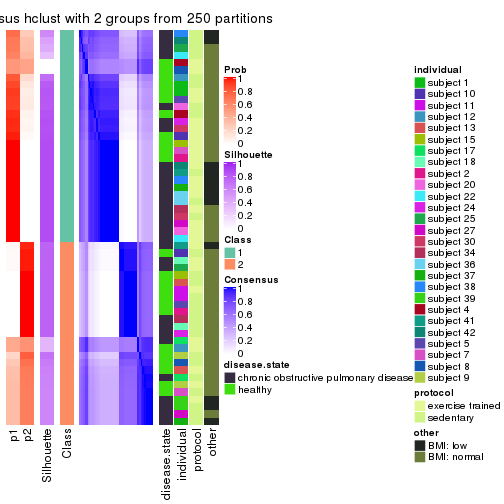</p>

</div>
<div id='tab-ATC-hclust-consensus-heatmap-2'>
<pre><code class="r">consensus_heatmap(res, k = 3)
</code></pre>

<p>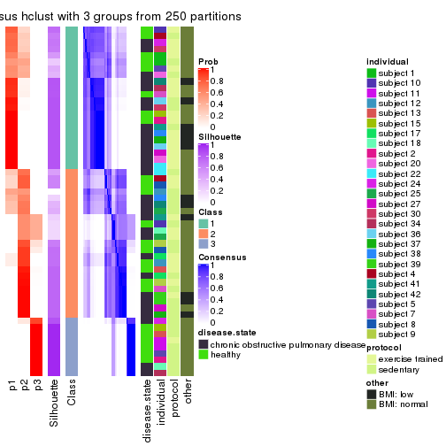</p>

</div>
<div id='tab-ATC-hclust-consensus-heatmap-3'>
<pre><code class="r">consensus_heatmap(res, k = 4)
</code></pre>

<p>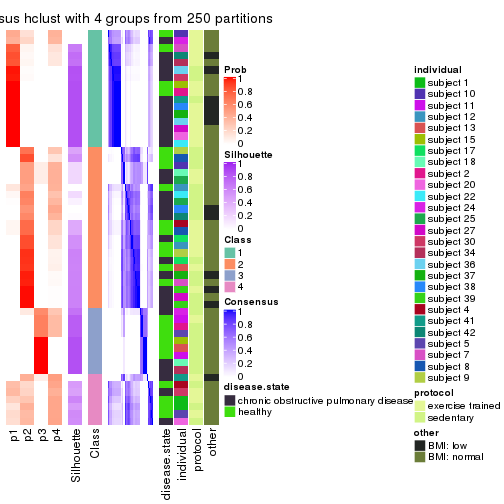</p>

</div>
<div id='tab-ATC-hclust-consensus-heatmap-4'>
<pre><code class="r">consensus_heatmap(res, k = 5)
</code></pre>

<p>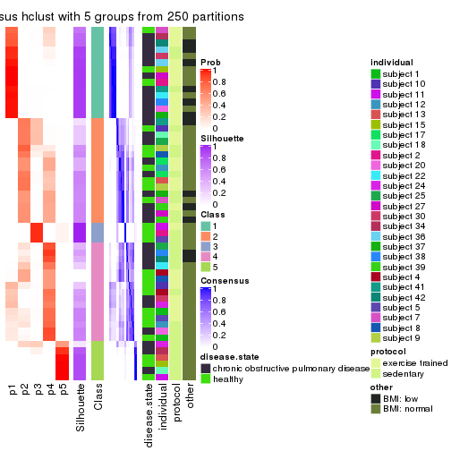</p>

</div>
<div id='tab-ATC-hclust-consensus-heatmap-5'>
<pre><code class="r">consensus_heatmap(res, k = 6)
</code></pre>

<p>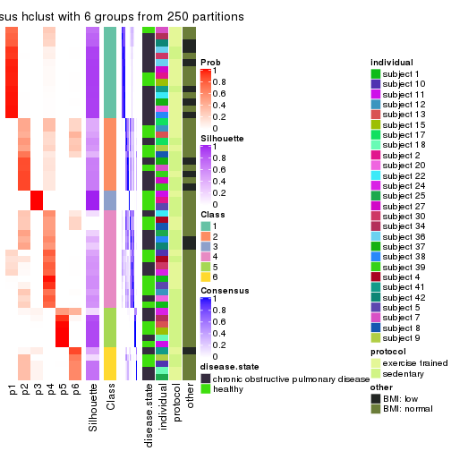</p>

</div>
</div>

Heatmaps for the membership of samples in all partitions to see how consistent they are:


<script>
$( function() {
	$( '#tabs-ATC-hclust-membership-heatmap' ).tabs();
} );
</script>
<div id='tabs-ATC-hclust-membership-heatmap'>
<ul>
<li><a href='#tab-ATC-hclust-membership-heatmap-1'>k = 2</a></li>
<li><a href='#tab-ATC-hclust-membership-heatmap-2'>k = 3</a></li>
<li><a href='#tab-ATC-hclust-membership-heatmap-3'>k = 4</a></li>
<li><a href='#tab-ATC-hclust-membership-heatmap-4'>k = 5</a></li>
<li><a href='#tab-ATC-hclust-membership-heatmap-5'>k = 6</a></li>
</ul>
<div id='tab-ATC-hclust-membership-heatmap-1'>
<pre><code class="r">membership_heatmap(res, k = 2)
</code></pre>

<p>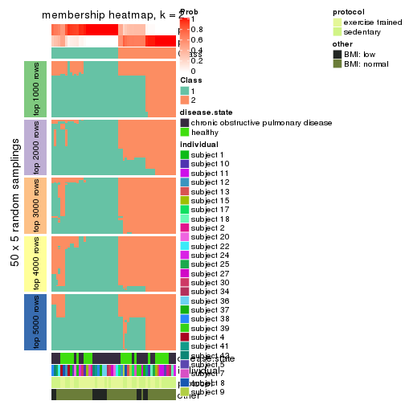</p>

</div>
<div id='tab-ATC-hclust-membership-heatmap-2'>
<pre><code class="r">membership_heatmap(res, k = 3)
</code></pre>

<p>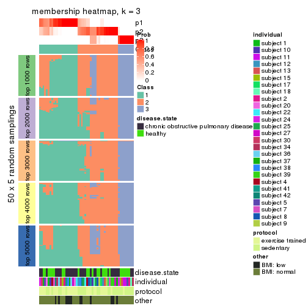</p>

</div>
<div id='tab-ATC-hclust-membership-heatmap-3'>
<pre><code class="r">membership_heatmap(res, k = 4)
</code></pre>

<p>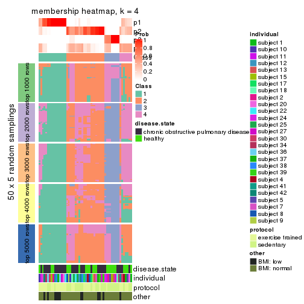</p>

</div>
<div id='tab-ATC-hclust-membership-heatmap-4'>
<pre><code class="r">membership_heatmap(res, k = 5)
</code></pre>

<p>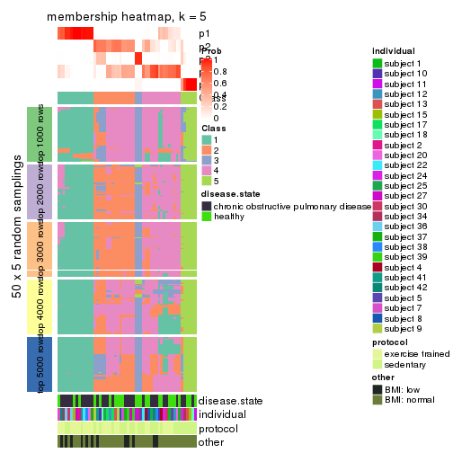</p>

</div>
<div id='tab-ATC-hclust-membership-heatmap-5'>
<pre><code class="r">membership_heatmap(res, k = 6)
</code></pre>

<p>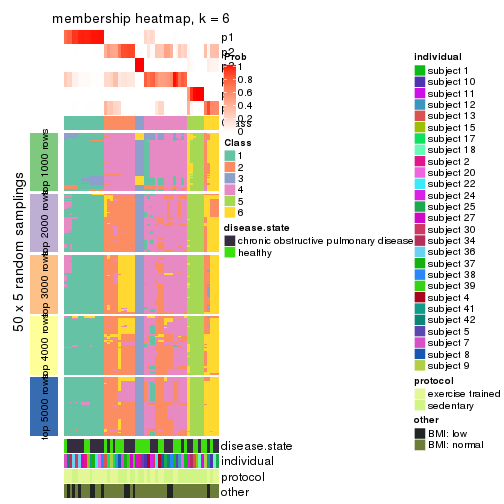</p>

</div>
</div>

As soon as we have had the classes for columns, we can look for signatures
which are significantly different between classes which can be candidate marks
for certain classes. Following are the heatmaps for signatures.


Signature heatmaps where rows are scaled:


<script>
$( function() {
	$( '#tabs-ATC-hclust-get-signatures' ).tabs();
} );
</script>
<div id='tabs-ATC-hclust-get-signatures'>
<ul>
<li><a href='#tab-ATC-hclust-get-signatures-1'>k = 2</a></li>
<li><a href='#tab-ATC-hclust-get-signatures-2'>k = 3</a></li>
<li><a href='#tab-ATC-hclust-get-signatures-3'>k = 4</a></li>
<li><a href='#tab-ATC-hclust-get-signatures-4'>k = 5</a></li>
<li><a href='#tab-ATC-hclust-get-signatures-5'>k = 6</a></li>
</ul>
<div id='tab-ATC-hclust-get-signatures-1'>
<pre><code class="r">get_signatures(res, k = 2)
</code></pre>

<p>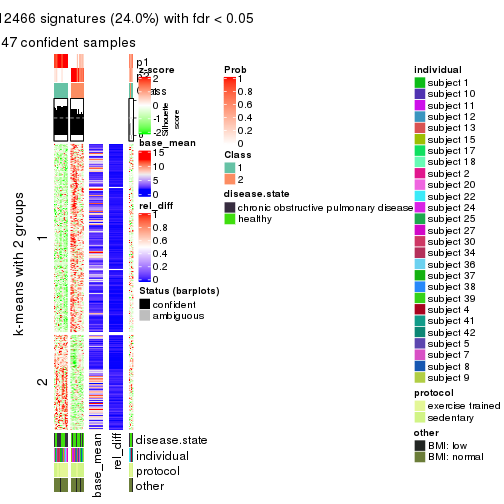</p>

</div>
<div id='tab-ATC-hclust-get-signatures-2'>
<pre><code class="r">get_signatures(res, k = 3)
</code></pre>

<p>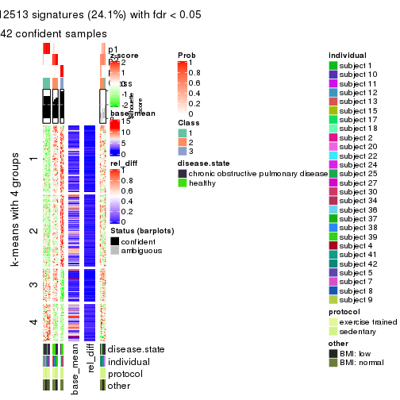</p>

</div>
<div id='tab-ATC-hclust-get-signatures-3'>
<pre><code class="r">get_signatures(res, k = 4)
</code></pre>

<p>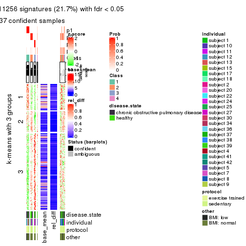</p>

</div>
<div id='tab-ATC-hclust-get-signatures-4'>
<pre><code class="r">get_signatures(res, k = 5)
</code></pre>

<pre><code>#&gt; Error in mat[ceiling(1:nr/h_ratio), ceiling(1:nc/w_ratio), drop = FALSE]: subscript out of bounds
</code></pre>

<p></p>

</div>
<div id='tab-ATC-hclust-get-signatures-5'>
<pre><code class="r">get_signatures(res, k = 6)
</code></pre>

<pre><code>#&gt; Error in mat[ceiling(1:nr/h_ratio), ceiling(1:nc/w_ratio), drop = FALSE]: subscript out of bounds
</code></pre>

<p>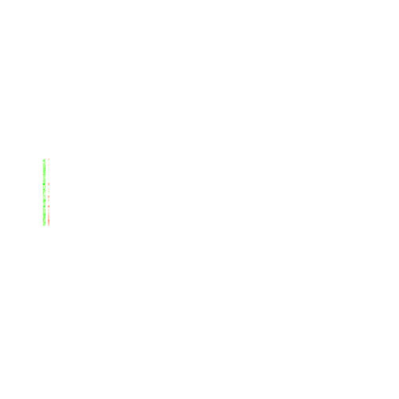</p>

</div>
</div>


Signature heatmaps where rows are not scaled:


<script>
$( function() {
	$( '#tabs-ATC-hclust-get-signatures-no-scale' ).tabs();
} );
</script>
<div id='tabs-ATC-hclust-get-signatures-no-scale'>
<ul>
<li><a href='#tab-ATC-hclust-get-signatures-no-scale-1'>k = 2</a></li>
<li><a href='#tab-ATC-hclust-get-signatures-no-scale-2'>k = 3</a></li>
<li><a href='#tab-ATC-hclust-get-signatures-no-scale-3'>k = 4</a></li>
<li><a href='#tab-ATC-hclust-get-signatures-no-scale-4'>k = 5</a></li>
<li><a href='#tab-ATC-hclust-get-signatures-no-scale-5'>k = 6</a></li>
</ul>
<div id='tab-ATC-hclust-get-signatures-no-scale-1'>
<pre><code class="r">get_signatures(res, k = 2, scale_rows = FALSE)
</code></pre>

<p>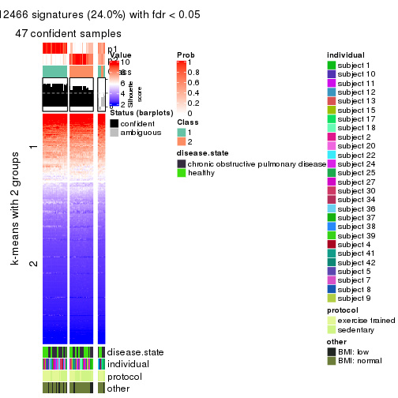</p>

</div>
<div id='tab-ATC-hclust-get-signatures-no-scale-2'>
<pre><code class="r">get_signatures(res, k = 3, scale_rows = FALSE)
</code></pre>

<p>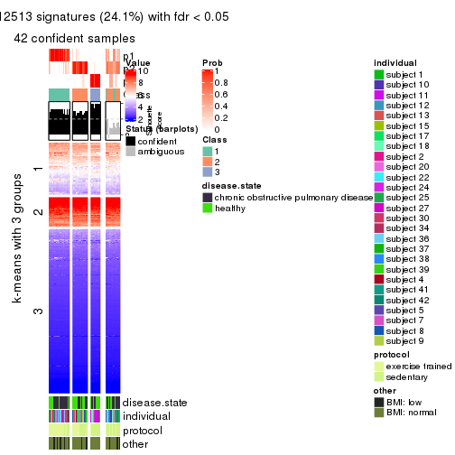</p>

</div>
<div id='tab-ATC-hclust-get-signatures-no-scale-3'>
<pre><code class="r">get_signatures(res, k = 4, scale_rows = FALSE)
</code></pre>

<p>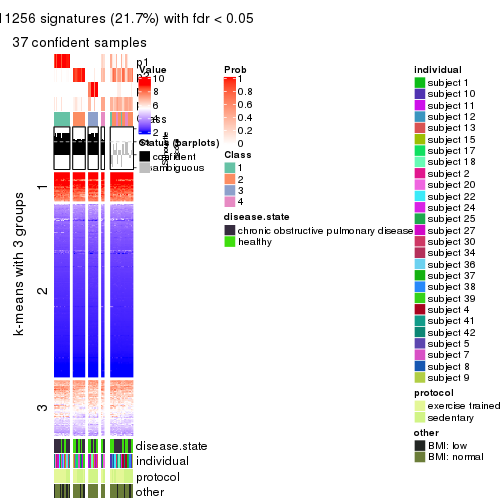</p>

</div>
<div id='tab-ATC-hclust-get-signatures-no-scale-4'>
<pre><code class="r">get_signatures(res, k = 5, scale_rows = FALSE)
</code></pre>

<p>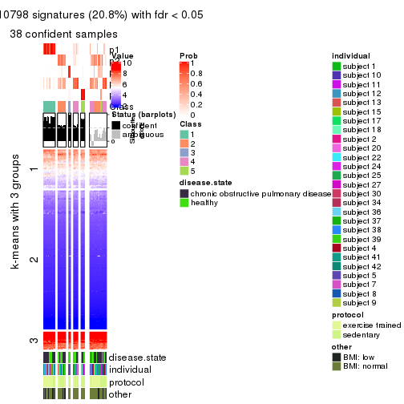</p>

</div>
<div id='tab-ATC-hclust-get-signatures-no-scale-5'>
<pre><code class="r">get_signatures(res, k = 6, scale_rows = FALSE)
</code></pre>

<p>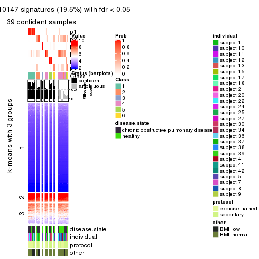</p>

</div>
</div>


Compare the overlap of signatures from different k:

```r
compare_signatures(res)
```

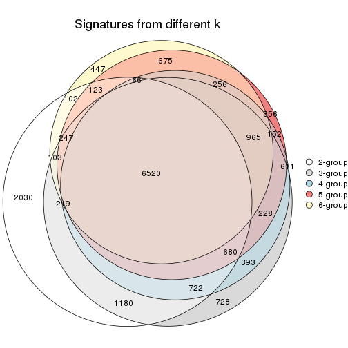

`get_signature()` returns a data frame invisibly. TO get the list of signatures, the function
call should be assigned to a variable explicitly. In following code, if `plot` argument is set
to `FALSE`, no heatmap is plotted while only the differential analysis is performed.

```r
# code only for demonstration
tb = get_signature(res, k = ..., plot = FALSE)
```

An example of the output of `tb` is:

```
#>   which_row         fdr    mean_1    mean_2 scaled_mean_1 scaled_mean_2 km
#> 1        38 0.042760348  8.373488  9.131774    -0.5533452     0.5164555  1
#> 2        40 0.018707592  7.106213  8.469186    -0.6173731     0.5762149  1
#> 3        55 0.019134737 10.221463 11.207825    -0.6159697     0.5749050  1
#> 4        59 0.006059896  5.921854  7.869574    -0.6899429     0.6439467  1
#> 5        60 0.018055526  8.928898 10.211722    -0.6204761     0.5791110  1
#> 6        98 0.009384629 15.714769 14.887706     0.6635654    -0.6193277  2
...
```

The columns in `tb` are:

1. `which_row`: row indices corresponding to the input matrix.
2. `fdr`: FDR for the differential test. 
3. `mean_x`: The mean value in group x.
4. `scaled_mean_x`: The mean value in group x after rows are scaled.
5. `km`: Row groups if k-means clustering is applied to rows.


UMAP plot which shows how samples are separated.


<script>
$( function() {
	$( '#tabs-ATC-hclust-dimension-reduction' ).tabs();
} );
</script>
<div id='tabs-ATC-hclust-dimension-reduction'>
<ul>
<li><a href='#tab-ATC-hclust-dimension-reduction-1'>k = 2</a></li>
<li><a href='#tab-ATC-hclust-dimension-reduction-2'>k = 3</a></li>
<li><a href='#tab-ATC-hclust-dimension-reduction-3'>k = 4</a></li>
<li><a href='#tab-ATC-hclust-dimension-reduction-4'>k = 5</a></li>
<li><a href='#tab-ATC-hclust-dimension-reduction-5'>k = 6</a></li>
</ul>
<div id='tab-ATC-hclust-dimension-reduction-1'>
<pre><code class="r">dimension_reduction(res, k = 2, method = &quot;UMAP&quot;)
</code></pre>

<p>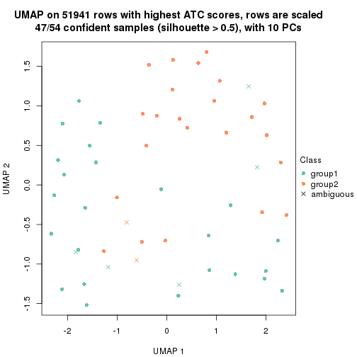</p>

</div>
<div id='tab-ATC-hclust-dimension-reduction-2'>
<pre><code class="r">dimension_reduction(res, k = 3, method = &quot;UMAP&quot;)
</code></pre>

<p>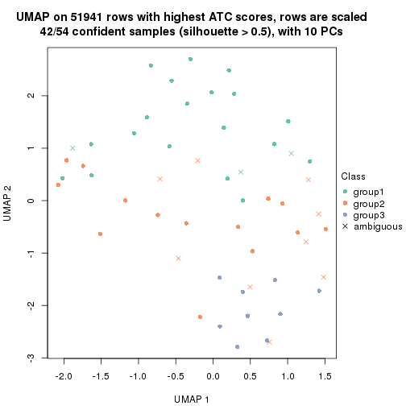</p>

</div>
<div id='tab-ATC-hclust-dimension-reduction-3'>
<pre><code class="r">dimension_reduction(res, k = 4, method = &quot;UMAP&quot;)
</code></pre>

<p>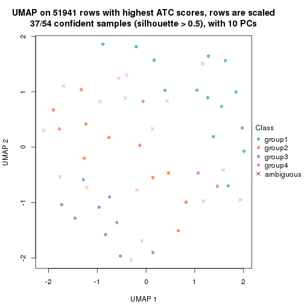</p>

</div>
<div id='tab-ATC-hclust-dimension-reduction-4'>
<pre><code class="r">dimension_reduction(res, k = 5, method = &quot;UMAP&quot;)
</code></pre>

<p>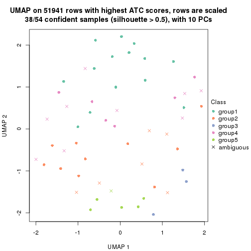</p>

</div>
<div id='tab-ATC-hclust-dimension-reduction-5'>
<pre><code class="r">dimension_reduction(res, k = 6, method = &quot;UMAP&quot;)
</code></pre>

<p>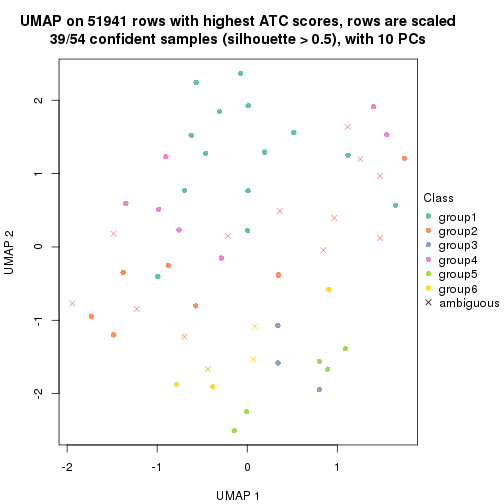</p>

</div>
</div>


Following heatmap shows how subgroups are split when increasing `k`:

```r
collect_classes(res)
```

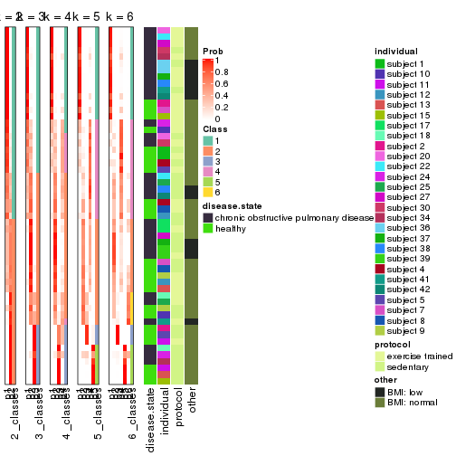


Test correlation between subgroups and known annotations. If the known
annotation is numeric, one-way ANOVA test is applied, and if the known
annotation is discrete, chi-squared contingency table test is applied.

```r
test_to_known_factors(res)
```

```
#>             n disease.state(p) individual(p) protocol(p) other(p) k
#> ATC:hclust 47           0.4727         0.410     0.02837   0.5428 2
#> ATC:hclust 42           0.1512         0.260     0.00313   0.1639 3
#> ATC:hclust 37           0.1436         0.366     0.01531   0.0888 4
#> ATC:hclust 38           0.0794         0.425     0.02212   0.1156 5
#> ATC:hclust 39           0.1283         0.346     0.03993   0.0744 6
```


If matrix rows can be associated to genes, consider to use `functional_enrichment(res,
...)` to perform function enrichment for the signature genes. See [this vignette](http://bioconductor.org/packages/devel/bioc/vignettes/cola/inst/doc/functional_enrichment.html) for more detailed explanations.


 

---------------------------------------------------


### ATC:kmeans


The object with results only for a single top-value method and a single partition method 
can be extracted as:

```r
res = res_list["ATC", "kmeans"]
# you can also extract it by
# res = res_list["ATC:kmeans"]
```

A summary of `res` and all the functions that can be applied to it:

```r
res
```

```
#> A 'ConsensusPartition' object with k = 2, 3, 4, 5, 6.
#>   On a matrix with 51941 rows and 54 columns.
#>   Top rows (1000, 2000, 3000, 4000, 5000) are extracted by 'ATC' method.
#>   Subgroups are detected by 'kmeans' method.
#>   Performed in total 1250 partitions by row resampling.
#>   Best k for subgroups seems to be 3.
#> 
#> Following methods can be applied to this 'ConsensusPartition' object:
#>  [1] "cola_report"             "collect_classes"         "collect_plots"          
#>  [4] "collect_stats"           "colnames"                "compare_signatures"     
#>  [7] "consensus_heatmap"       "dimension_reduction"     "functional_enrichment"  
#> [10] "get_anno_col"            "get_anno"                "get_classes"            
#> [13] "get_consensus"           "get_matrix"              "get_membership"         
#> [16] "get_param"               "get_signatures"          "get_stats"              
#> [19] "is_best_k"               "is_stable_k"             "membership_heatmap"     
#> [22] "ncol"                    "nrow"                    "plot_ecdf"              
#> [25] "rownames"                "select_partition_number" "show"                   
#> [28] "suggest_best_k"          "test_to_known_factors"
```

`collect_plots()` function collects all the plots made from `res` for all `k` (number of partitions)
into one single page to provide an easy and fast comparison between different `k`.

```r
collect_plots(res)
```

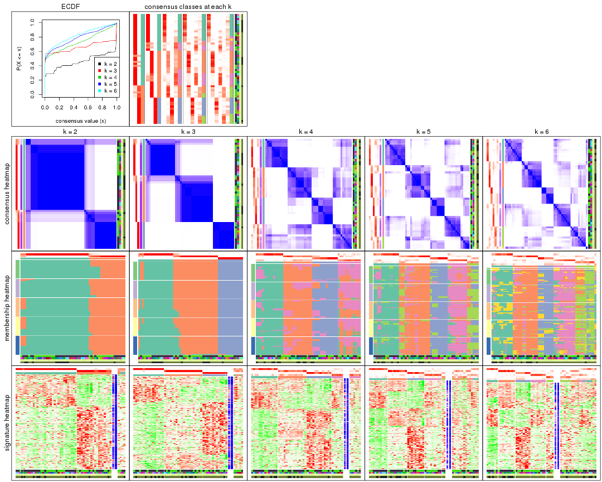

The plots are:

- The first row: a plot of the ECDF (empirical cumulative distribution
  function) curves of the consensus matrix for each `k` and the heatmap of
  predicted classes for each `k`.
- The second row: heatmaps of the consensus matrix for each `k`.
- The third row: heatmaps of the membership matrix for each `k`.
- The fouth row: heatmaps of the signatures for each `k`.

All the plots in panels can be made by individual functions and they are
plotted later in this section.

`select_partition_number()` produces several plots showing different
statistics for choosing "optimized" `k`. There are following statistics:

- ECDF curves of the consensus matrix for each `k`;
- 1-PAC. [The PAC
  score](https://en.wikipedia.org/wiki/Consensus_clustering#Over-interpretation_potential_of_consensus_clustering)
  measures the proportion of the ambiguous subgrouping.
- Mean silhouette score.
- Concordance. The mean probability of fiting the consensus class ids in all
  partitions.
- Area increased. Denote $A_k$ as the area under the ECDF curve for current
  `k`, the area increased is defined as $A_k - A_{k-1}$.
- Rand index. The percent of pairs of samples that are both in a same cluster
  or both are not in a same cluster in the partition of k and k-1.
- Jaccard index. The ratio of pairs of samples are both in a same cluster in
  the partition of k and k-1 and the pairs of samples are both in a same
  cluster in the partition k or k-1.

The detailed explanations of these statistics can be found in [the _cola_
vignette](http://bioconductor.org/packages/devel/bioc/vignettes/cola/inst/doc/cola.html#toc_13).

Generally speaking, lower PAC score, higher mean silhouette score or higher
concordance corresponds to better partition. Rand index and Jaccard index
measure how similar the current partition is compared to partition with `k-1`.
If they are too similar, we won't accept `k` is better than `k-1`.

```r
select_partition_number(res)
```

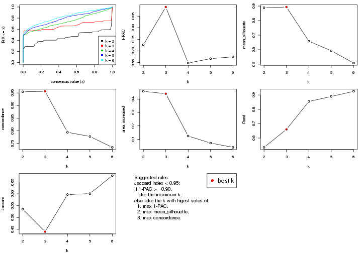

The numeric values for all these statistics can be obtained by `get_stats()`.

```r
get_stats(res)
```

```
#>   k 1-PAC mean_silhouette concordance area_increased  Rand Jaccard
#> 2 2 0.726           0.888       0.955         0.4576 0.535   0.535
#> 3 3 0.889           0.893       0.956         0.4399 0.660   0.440
#> 4 4 0.648           0.658       0.794         0.1238 0.855   0.597
#> 5 5 0.667           0.592       0.777         0.0715 0.890   0.601
#> 6 6 0.675           0.508       0.734         0.0396 0.925   0.677
```

`suggest_best_k()` suggests the best $k$ based on these statistics. The rules are as follows:

- All $k$ with Jaccard index larger than 0.95 are removed because increasing
  $k$ does not provide enough extra information. If all $k$ are removed, it is
  marked as no subgroup is detected.
- For all $k$ with 1-PAC score larger than 0.9, the maximal $k$ is taken as
  the best $k$, and other $k$ are marked as optional $k$.
- If it does not fit the second rule. The $k$ with the maximal vote of the
  highest 1-PAC score, highest mean silhouette, and highest concordance is
  taken as the best $k$.

```r
suggest_best_k(res)
```

```
#> [1] 3
```


Following shows the table of the partitions (You need to click the **show/hide
code output** link to see it). The membership matrix (columns with name `p*`)
is inferred by
[`clue::cl_consensus()`](https://www.rdocumentation.org/link/cl_consensus?package=clue)
function with the `SE` method. Basically the value in the membership matrix
represents the probability to belong to a certain group. The finall class
label for an item is determined with the group with highest probability it
belongs to.

In `get_classes()` function, the entropy is calculated from the membership
matrix and the silhouette score is calculated from the consensus matrix.


<script>
$( function() {
	$( '#tabs-ATC-kmeans-get-classes' ).tabs();
} );
</script>
<div id='tabs-ATC-kmeans-get-classes'>
<ul>
<li><a href='#tab-ATC-kmeans-get-classes-1'>k = 2</a></li>
<li><a href='#tab-ATC-kmeans-get-classes-2'>k = 3</a></li>
<li><a href='#tab-ATC-kmeans-get-classes-3'>k = 4</a></li>
<li><a href='#tab-ATC-kmeans-get-classes-4'>k = 5</a></li>
<li><a href='#tab-ATC-kmeans-get-classes-5'>k = 6</a></li>
</ul>

<div id='tab-ATC-kmeans-get-classes-1'>
<p><a id='tab-ATC-kmeans-get-classes-1-a' style='color:#0366d6' href='#'>show/hide code output</a></p>
<pre><code class="r">cbind(get_classes(res, k = 2), get_membership(res, k = 2))
</code></pre>

<pre><code>#&gt;           class entropy silhouette    p1    p2
#&gt; GSM680053     2  0.6247      0.825 0.156 0.844
#&gt; GSM680062     1  0.0938      0.952 0.988 0.012
#&gt; GSM680054     2  0.0000      0.924 0.000 1.000
#&gt; GSM680063     2  0.0000      0.924 0.000 1.000
#&gt; GSM680055     1  0.0000      0.961 1.000 0.000
#&gt; GSM680064     1  0.0000      0.961 1.000 0.000
#&gt; GSM680056     1  0.0000      0.961 1.000 0.000
#&gt; GSM680065     1  0.0000      0.961 1.000 0.000
#&gt; GSM680057     2  0.0000      0.924 0.000 1.000
#&gt; GSM680066     1  0.0000      0.961 1.000 0.000
#&gt; GSM680058     1  0.0000      0.961 1.000 0.000
#&gt; GSM680067     2  0.0000      0.924 0.000 1.000
#&gt; GSM680059     1  0.9552      0.347 0.624 0.376
#&gt; GSM680068     1  0.0000      0.961 1.000 0.000
#&gt; GSM680060     1  0.0000      0.961 1.000 0.000
#&gt; GSM680069     1  0.0000      0.961 1.000 0.000
#&gt; GSM680061     2  0.0000      0.924 0.000 1.000
#&gt; GSM680070     1  0.0000      0.961 1.000 0.000
#&gt; GSM680071     1  0.0000      0.961 1.000 0.000
#&gt; GSM680077     1  0.0000      0.961 1.000 0.000
#&gt; GSM680072     1  0.1184      0.948 0.984 0.016
#&gt; GSM680078     1  0.0000      0.961 1.000 0.000
#&gt; GSM680073     1  0.0000      0.961 1.000 0.000
#&gt; GSM680079     1  0.0000      0.961 1.000 0.000
#&gt; GSM680074     2  0.7745      0.731 0.228 0.772
#&gt; GSM680080     1  0.9552      0.347 0.624 0.376
#&gt; GSM680075     1  0.0000      0.961 1.000 0.000
#&gt; GSM680081     2  0.0000      0.924 0.000 1.000
#&gt; GSM680076     1  0.0938      0.952 0.988 0.012
#&gt; GSM680082     1  0.0000      0.961 1.000 0.000
#&gt; GSM680029     1  0.0000      0.961 1.000 0.000
#&gt; GSM680041     1  0.0000      0.961 1.000 0.000
#&gt; GSM680035     2  0.0000      0.924 0.000 1.000
#&gt; GSM680047     1  0.0000      0.961 1.000 0.000
#&gt; GSM680036     1  0.0000      0.961 1.000 0.000
#&gt; GSM680048     1  0.0000      0.961 1.000 0.000
#&gt; GSM680037     2  0.0000      0.924 0.000 1.000
#&gt; GSM680049     1  0.0000      0.961 1.000 0.000
#&gt; GSM680038     1  0.9552      0.347 0.624 0.376
#&gt; GSM680050     1  0.0000      0.961 1.000 0.000
#&gt; GSM680039     2  0.5519      0.850 0.128 0.872
#&gt; GSM680051     1  0.0000      0.961 1.000 0.000
#&gt; GSM680040     2  0.5519      0.850 0.128 0.872
#&gt; GSM680052     2  0.9977      0.143 0.472 0.528
#&gt; GSM680030     2  0.0000      0.924 0.000 1.000
#&gt; GSM680042     1  0.0000      0.961 1.000 0.000
#&gt; GSM680031     2  0.0000      0.924 0.000 1.000
#&gt; GSM680043     2  0.0000      0.924 0.000 1.000
#&gt; GSM680032     1  0.0000      0.961 1.000 0.000
#&gt; GSM680044     1  0.0938      0.952 0.988 0.012
#&gt; GSM680033     2  0.0000      0.924 0.000 1.000
#&gt; GSM680045     2  0.6343      0.821 0.160 0.840
#&gt; GSM680034     2  0.0000      0.924 0.000 1.000
#&gt; GSM680046     1  0.0000      0.961 1.000 0.000
</code></pre>

<script>
$('#tab-ATC-kmeans-get-classes-1-a').parent().next().next().hide();
$('#tab-ATC-kmeans-get-classes-1-a').click(function(){
  $('#tab-ATC-kmeans-get-classes-1-a').parent().next().next().toggle();
  return(false);
});
</script>
</div>

<div id='tab-ATC-kmeans-get-classes-2'>
<p><a id='tab-ATC-kmeans-get-classes-2-a' style='color:#0366d6' href='#'>show/hide code output</a></p>
<pre><code class="r">cbind(get_classes(res, k = 3), get_membership(res, k = 3))
</code></pre>

<pre><code>#&gt;           class entropy silhouette    p1    p2    p3
#&gt; GSM680053     2  0.0000      0.932 0.000 1.000 0.000
#&gt; GSM680062     2  0.0424      0.936 0.008 0.992 0.000
#&gt; GSM680054     3  0.0000      0.998 0.000 0.000 1.000
#&gt; GSM680063     3  0.0000      0.998 0.000 0.000 1.000
#&gt; GSM680055     2  0.0424      0.936 0.008 0.992 0.000
#&gt; GSM680064     1  0.0000      0.936 1.000 0.000 0.000
#&gt; GSM680056     2  0.3192      0.840 0.112 0.888 0.000
#&gt; GSM680065     1  0.0000      0.936 1.000 0.000 0.000
#&gt; GSM680057     3  0.0000      0.998 0.000 0.000 1.000
#&gt; GSM680066     1  0.4555      0.712 0.800 0.200 0.000
#&gt; GSM680058     2  0.0424      0.936 0.008 0.992 0.000
#&gt; GSM680067     3  0.0000      0.998 0.000 0.000 1.000
#&gt; GSM680059     2  0.0424      0.936 0.008 0.992 0.000
#&gt; GSM680068     1  0.0000      0.936 1.000 0.000 0.000
#&gt; GSM680060     1  0.0000      0.936 1.000 0.000 0.000
#&gt; GSM680069     2  0.5948      0.451 0.360 0.640 0.000
#&gt; GSM680061     3  0.0000      0.998 0.000 0.000 1.000
#&gt; GSM680070     1  0.0000      0.936 1.000 0.000 0.000
#&gt; GSM680071     1  0.0000      0.936 1.000 0.000 0.000
#&gt; GSM680077     1  0.0000      0.936 1.000 0.000 0.000
#&gt; GSM680072     2  0.0424      0.936 0.008 0.992 0.000
#&gt; GSM680078     1  0.0000      0.936 1.000 0.000 0.000
#&gt; GSM680073     2  0.0424      0.936 0.008 0.992 0.000
#&gt; GSM680079     1  0.0000      0.936 1.000 0.000 0.000
#&gt; GSM680074     2  0.0424      0.932 0.000 0.992 0.008
#&gt; GSM680080     2  0.0424      0.936 0.008 0.992 0.000
#&gt; GSM680075     1  0.0000      0.936 1.000 0.000 0.000
#&gt; GSM680081     3  0.0424      0.995 0.000 0.008 0.992
#&gt; GSM680076     2  0.0424      0.936 0.008 0.992 0.000
#&gt; GSM680082     1  0.0000      0.936 1.000 0.000 0.000
#&gt; GSM680029     2  0.0424      0.936 0.008 0.992 0.000
#&gt; GSM680041     1  0.5988      0.382 0.632 0.368 0.000
#&gt; GSM680035     3  0.0424      0.995 0.000 0.008 0.992
#&gt; GSM680047     1  0.0000      0.936 1.000 0.000 0.000
#&gt; GSM680036     1  0.6095      0.330 0.608 0.392 0.000
#&gt; GSM680048     2  0.5882      0.478 0.348 0.652 0.000
#&gt; GSM680037     3  0.0424      0.995 0.000 0.008 0.992
#&gt; GSM680049     2  0.6192      0.292 0.420 0.580 0.000
#&gt; GSM680038     2  0.0424      0.936 0.008 0.992 0.000
#&gt; GSM680050     1  0.0000      0.936 1.000 0.000 0.000
#&gt; GSM680039     2  0.0424      0.932 0.000 0.992 0.008
#&gt; GSM680051     2  0.0424      0.936 0.008 0.992 0.000
#&gt; GSM680040     2  0.0000      0.932 0.000 1.000 0.000
#&gt; GSM680052     2  0.0000      0.932 0.000 1.000 0.000
#&gt; GSM680030     3  0.0000      0.998 0.000 0.000 1.000
#&gt; GSM680042     1  0.0000      0.936 1.000 0.000 0.000
#&gt; GSM680031     3  0.0000      0.998 0.000 0.000 1.000
#&gt; GSM680043     3  0.0424      0.995 0.000 0.008 0.992
#&gt; GSM680032     2  0.0424      0.936 0.008 0.992 0.000
#&gt; GSM680044     2  0.0424      0.936 0.008 0.992 0.000
#&gt; GSM680033     3  0.0000      0.998 0.000 0.000 1.000
#&gt; GSM680045     2  0.0000      0.932 0.000 1.000 0.000
#&gt; GSM680034     3  0.0000      0.998 0.000 0.000 1.000
#&gt; GSM680046     1  0.0000      0.936 1.000 0.000 0.000
</code></pre>

<script>
$('#tab-ATC-kmeans-get-classes-2-a').parent().next().next().hide();
$('#tab-ATC-kmeans-get-classes-2-a').click(function(){
  $('#tab-ATC-kmeans-get-classes-2-a').parent().next().next().toggle();
  return(false);
});
</script>
</div>

<div id='tab-ATC-kmeans-get-classes-3'>
<p><a id='tab-ATC-kmeans-get-classes-3-a' style='color:#0366d6' href='#'>show/hide code output</a></p>
<pre><code class="r">cbind(get_classes(res, k = 4), get_membership(res, k = 4))
</code></pre>

<pre><code>#&gt;           class entropy silhouette    p1    p2    p3    p4
#&gt; GSM680053     2  0.2216      0.642 0.000 0.908 0.000 0.092
#&gt; GSM680062     2  0.4955      0.650 0.000 0.556 0.000 0.444
#&gt; GSM680054     3  0.0000      0.872 0.000 0.000 1.000 0.000
#&gt; GSM680063     3  0.4454      0.763 0.000 0.308 0.692 0.000
#&gt; GSM680055     4  0.4941     -0.313 0.000 0.436 0.000 0.564
#&gt; GSM680064     1  0.0188      0.861 0.996 0.000 0.000 0.004
#&gt; GSM680056     4  0.3653      0.536 0.028 0.128 0.000 0.844
#&gt; GSM680065     1  0.0592      0.863 0.984 0.000 0.000 0.016
#&gt; GSM680057     3  0.1940      0.864 0.000 0.076 0.924 0.000
#&gt; GSM680066     4  0.4372      0.475 0.268 0.004 0.000 0.728
#&gt; GSM680058     2  0.4933      0.615 0.000 0.568 0.000 0.432
#&gt; GSM680067     3  0.4500      0.763 0.000 0.316 0.684 0.000
#&gt; GSM680059     2  0.4543      0.744 0.000 0.676 0.000 0.324
#&gt; GSM680068     1  0.0000      0.862 1.000 0.000 0.000 0.000
#&gt; GSM680060     1  0.4990      0.527 0.640 0.008 0.000 0.352
#&gt; GSM680069     4  0.3308      0.626 0.092 0.036 0.000 0.872
#&gt; GSM680061     3  0.0000      0.872 0.000 0.000 1.000 0.000
#&gt; GSM680070     1  0.4624      0.554 0.660 0.000 0.000 0.340
#&gt; GSM680071     1  0.2081      0.853 0.916 0.000 0.000 0.084
#&gt; GSM680077     1  0.1118      0.860 0.964 0.000 0.000 0.036
#&gt; GSM680072     2  0.4585      0.740 0.000 0.668 0.000 0.332
#&gt; GSM680078     1  0.1118      0.861 0.964 0.000 0.000 0.036
#&gt; GSM680073     2  0.4907      0.636 0.000 0.580 0.000 0.420
#&gt; GSM680079     1  0.0188      0.861 0.996 0.000 0.000 0.004
#&gt; GSM680074     2  0.4431      0.742 0.000 0.696 0.000 0.304
#&gt; GSM680080     2  0.4543      0.744 0.000 0.676 0.000 0.324
#&gt; GSM680075     1  0.1302      0.860 0.956 0.000 0.000 0.044
#&gt; GSM680081     3  0.6253      0.727 0.000 0.372 0.564 0.064
#&gt; GSM680076     2  0.4776      0.696 0.000 0.624 0.000 0.376
#&gt; GSM680082     1  0.4164      0.664 0.736 0.000 0.000 0.264
#&gt; GSM680029     4  0.4989     -0.424 0.000 0.472 0.000 0.528
#&gt; GSM680041     4  0.3400      0.610 0.180 0.000 0.000 0.820
#&gt; GSM680035     3  0.3547      0.845 0.000 0.072 0.864 0.064
#&gt; GSM680047     1  0.1474      0.860 0.948 0.000 0.000 0.052
#&gt; GSM680036     4  0.5228      0.550 0.120 0.124 0.000 0.756
#&gt; GSM680048     4  0.4037      0.637 0.136 0.040 0.000 0.824
#&gt; GSM680037     3  0.3687      0.846 0.000 0.080 0.856 0.064
#&gt; GSM680049     4  0.5070      0.627 0.192 0.060 0.000 0.748
#&gt; GSM680038     2  0.4543      0.744 0.000 0.676 0.000 0.324
#&gt; GSM680050     4  0.4996     -0.187 0.484 0.000 0.000 0.516
#&gt; GSM680039     2  0.2149      0.643 0.000 0.912 0.000 0.088
#&gt; GSM680051     4  0.3219      0.481 0.000 0.164 0.000 0.836
#&gt; GSM680040     2  0.1302      0.604 0.000 0.956 0.000 0.044
#&gt; GSM680052     2  0.3801      0.583 0.000 0.780 0.000 0.220
#&gt; GSM680030     3  0.4431      0.767 0.000 0.304 0.696 0.000
#&gt; GSM680042     1  0.4643      0.548 0.656 0.000 0.000 0.344
#&gt; GSM680031     3  0.0000      0.872 0.000 0.000 1.000 0.000
#&gt; GSM680043     3  0.3617      0.846 0.000 0.076 0.860 0.064
#&gt; GSM680032     4  0.3688      0.357 0.000 0.208 0.000 0.792
#&gt; GSM680044     2  0.4999      0.576 0.000 0.508 0.000 0.492
#&gt; GSM680033     3  0.0000      0.872 0.000 0.000 1.000 0.000
#&gt; GSM680045     2  0.3172      0.531 0.000 0.840 0.000 0.160
#&gt; GSM680034     3  0.0000      0.872 0.000 0.000 1.000 0.000
#&gt; GSM680046     1  0.1118      0.861 0.964 0.000 0.000 0.036
</code></pre>

<script>
$('#tab-ATC-kmeans-get-classes-3-a').parent().next().next().hide();
$('#tab-ATC-kmeans-get-classes-3-a').click(function(){
  $('#tab-ATC-kmeans-get-classes-3-a').parent().next().next().toggle();
  return(false);
});
</script>
</div>

<div id='tab-ATC-kmeans-get-classes-4'>
<p><a id='tab-ATC-kmeans-get-classes-4-a' style='color:#0366d6' href='#'>show/hide code output</a></p>
<pre><code class="r">cbind(get_classes(res, k = 5), get_membership(res, k = 5))
</code></pre>

<pre><code>#&gt;           class entropy silhouette    p1    p2    p3    p4    p5
#&gt; GSM680053     2  0.4552    -0.1565 0.000 0.524 0.000 0.008 0.468
#&gt; GSM680062     2  0.4141     0.5532 0.000 0.736 0.000 0.236 0.028
#&gt; GSM680054     3  0.0290     0.8518 0.000 0.000 0.992 0.008 0.000
#&gt; GSM680063     5  0.4949     0.5332 0.000 0.032 0.396 0.000 0.572
#&gt; GSM680055     2  0.4748     0.4697 0.000 0.660 0.000 0.300 0.040
#&gt; GSM680064     1  0.1364     0.7977 0.952 0.000 0.000 0.012 0.036
#&gt; GSM680056     4  0.3878     0.7626 0.012 0.144 0.000 0.808 0.036
#&gt; GSM680065     1  0.2482     0.7940 0.892 0.000 0.000 0.024 0.084
#&gt; GSM680057     3  0.3336     0.5587 0.000 0.000 0.772 0.000 0.228
#&gt; GSM680066     4  0.4731     0.7430 0.088 0.048 0.000 0.780 0.084
#&gt; GSM680058     2  0.3183     0.6474 0.000 0.828 0.000 0.156 0.016
#&gt; GSM680067     5  0.4940     0.5346 0.000 0.032 0.392 0.000 0.576
#&gt; GSM680059     2  0.0162     0.6876 0.000 0.996 0.000 0.000 0.004
#&gt; GSM680068     1  0.0579     0.8025 0.984 0.000 0.000 0.008 0.008
#&gt; GSM680060     1  0.7098     0.4978 0.532 0.052 0.000 0.216 0.200
#&gt; GSM680069     4  0.4826     0.7676 0.048 0.104 0.000 0.772 0.076
#&gt; GSM680061     3  0.0000     0.8520 0.000 0.000 1.000 0.000 0.000
#&gt; GSM680070     1  0.5650     0.0336 0.468 0.000 0.000 0.456 0.076
#&gt; GSM680071     1  0.4627     0.7411 0.732 0.000 0.000 0.080 0.188
#&gt; GSM680077     1  0.2676     0.7852 0.884 0.000 0.000 0.036 0.080
#&gt; GSM680072     2  0.0324     0.6899 0.000 0.992 0.000 0.004 0.004
#&gt; GSM680078     1  0.2193     0.7947 0.900 0.000 0.000 0.008 0.092
#&gt; GSM680073     2  0.3055     0.6559 0.000 0.840 0.000 0.144 0.016
#&gt; GSM680079     1  0.1364     0.7977 0.952 0.000 0.000 0.012 0.036
#&gt; GSM680074     2  0.0510     0.6794 0.000 0.984 0.000 0.000 0.016
#&gt; GSM680080     2  0.0162     0.6876 0.000 0.996 0.000 0.000 0.004
#&gt; GSM680075     1  0.3476     0.7744 0.804 0.000 0.000 0.020 0.176
#&gt; GSM680081     5  0.4511     0.4598 0.000 0.012 0.260 0.020 0.708
#&gt; GSM680076     2  0.1408     0.6925 0.000 0.948 0.000 0.044 0.008
#&gt; GSM680082     1  0.5616     0.2515 0.536 0.000 0.000 0.384 0.080
#&gt; GSM680029     2  0.3779     0.6008 0.000 0.776 0.000 0.200 0.024
#&gt; GSM680041     4  0.2728     0.8029 0.040 0.068 0.000 0.888 0.004
#&gt; GSM680035     3  0.4335     0.7629 0.000 0.000 0.760 0.072 0.168
#&gt; GSM680047     1  0.2473     0.7991 0.896 0.000 0.000 0.032 0.072
#&gt; GSM680036     2  0.7170     0.0886 0.040 0.468 0.000 0.316 0.176
#&gt; GSM680048     4  0.2972     0.8026 0.040 0.084 0.000 0.872 0.004
#&gt; GSM680037     3  0.4409     0.7591 0.000 0.000 0.752 0.072 0.176
#&gt; GSM680049     4  0.4001     0.7919 0.048 0.104 0.000 0.820 0.028
#&gt; GSM680038     2  0.0162     0.6876 0.000 0.996 0.000 0.000 0.004
#&gt; GSM680050     4  0.5205     0.5808 0.200 0.008 0.000 0.696 0.096
#&gt; GSM680039     2  0.4268    -0.0885 0.000 0.556 0.000 0.000 0.444
#&gt; GSM680051     4  0.3309     0.7616 0.000 0.128 0.000 0.836 0.036
#&gt; GSM680040     5  0.4559     0.0502 0.000 0.480 0.000 0.008 0.512
#&gt; GSM680052     2  0.6647    -0.1326 0.000 0.392 0.000 0.224 0.384
#&gt; GSM680030     5  0.4622     0.4608 0.000 0.012 0.440 0.000 0.548
#&gt; GSM680042     4  0.5506     0.0821 0.404 0.000 0.000 0.528 0.068
#&gt; GSM680031     3  0.0162     0.8523 0.000 0.000 0.996 0.004 0.000
#&gt; GSM680043     3  0.4335     0.7629 0.000 0.000 0.760 0.072 0.168
#&gt; GSM680032     4  0.3724     0.6841 0.000 0.204 0.000 0.776 0.020
#&gt; GSM680044     2  0.4546     0.4726 0.000 0.668 0.000 0.304 0.028
#&gt; GSM680033     3  0.0000     0.8520 0.000 0.000 1.000 0.000 0.000
#&gt; GSM680045     5  0.6235     0.1614 0.000 0.344 0.000 0.156 0.500
#&gt; GSM680034     3  0.0290     0.8518 0.000 0.000 0.992 0.008 0.000
#&gt; GSM680046     1  0.1942     0.8008 0.920 0.000 0.000 0.012 0.068
</code></pre>

<script>
$('#tab-ATC-kmeans-get-classes-4-a').parent().next().next().hide();
$('#tab-ATC-kmeans-get-classes-4-a').click(function(){
  $('#tab-ATC-kmeans-get-classes-4-a').parent().next().next().toggle();
  return(false);
});
</script>
</div>

<div id='tab-ATC-kmeans-get-classes-5'>
<p><a id='tab-ATC-kmeans-get-classes-5-a' style='color:#0366d6' href='#'>show/hide code output</a></p>
<pre><code class="r">cbind(get_classes(res, k = 6), get_membership(res, k = 6))
</code></pre>

<pre><code>#&gt;           class entropy silhouette    p1    p2    p3    p4    p5    p6
#&gt; GSM680053     5  0.5372     0.4881 0.000 0.324 0.000 0.044 0.584 0.048
#&gt; GSM680062     2  0.5592     0.3944 0.000 0.568 0.000 0.304 0.108 0.020
#&gt; GSM680054     3  0.5412     0.7953 0.000 0.000 0.580 0.016 0.096 0.308
#&gt; GSM680063     5  0.3193     0.5105 0.000 0.008 0.112 0.004 0.840 0.036
#&gt; GSM680055     2  0.5377     0.4666 0.000 0.596 0.000 0.288 0.016 0.100
#&gt; GSM680064     1  0.0865     0.6084 0.964 0.000 0.000 0.000 0.000 0.036
#&gt; GSM680056     4  0.3063     0.6625 0.000 0.076 0.000 0.856 0.016 0.052
#&gt; GSM680065     1  0.2556     0.5437 0.864 0.000 0.000 0.008 0.008 0.120
#&gt; GSM680057     5  0.5999    -0.2660 0.000 0.000 0.276 0.004 0.476 0.244
#&gt; GSM680066     4  0.4873     0.5583 0.020 0.048 0.000 0.676 0.008 0.248
#&gt; GSM680058     2  0.2766     0.7108 0.000 0.868 0.000 0.092 0.012 0.028
#&gt; GSM680067     5  0.3193     0.5105 0.000 0.008 0.112 0.004 0.840 0.036
#&gt; GSM680059     2  0.0937     0.7297 0.000 0.960 0.000 0.000 0.040 0.000
#&gt; GSM680068     1  0.1625     0.6084 0.928 0.000 0.000 0.000 0.012 0.060
#&gt; GSM680060     6  0.7097     0.0000 0.280 0.100 0.000 0.120 0.020 0.480
#&gt; GSM680069     4  0.4569     0.5824 0.004 0.084 0.000 0.708 0.004 0.200
#&gt; GSM680061     3  0.5133     0.7956 0.000 0.000 0.580 0.000 0.108 0.312
#&gt; GSM680070     4  0.6341    -0.1512 0.364 0.000 0.000 0.372 0.012 0.252
#&gt; GSM680071     1  0.4662    -0.1959 0.496 0.000 0.000 0.032 0.004 0.468
#&gt; GSM680077     1  0.3359     0.4801 0.784 0.000 0.000 0.012 0.008 0.196
#&gt; GSM680072     2  0.0291     0.7391 0.000 0.992 0.000 0.004 0.004 0.000
#&gt; GSM680078     1  0.2513     0.5700 0.852 0.000 0.000 0.000 0.008 0.140
#&gt; GSM680073     2  0.2766     0.7108 0.000 0.868 0.000 0.092 0.012 0.028
#&gt; GSM680079     1  0.0865     0.6084 0.964 0.000 0.000 0.000 0.000 0.036
#&gt; GSM680074     2  0.1204     0.7155 0.000 0.944 0.000 0.000 0.056 0.000
#&gt; GSM680080     2  0.0937     0.7297 0.000 0.960 0.000 0.000 0.040 0.000
#&gt; GSM680075     1  0.3547     0.3530 0.696 0.000 0.000 0.000 0.004 0.300
#&gt; GSM680081     5  0.4422     0.4482 0.000 0.000 0.284 0.020 0.672 0.024
#&gt; GSM680076     2  0.0508     0.7408 0.000 0.984 0.000 0.012 0.000 0.004
#&gt; GSM680082     1  0.6195    -0.1346 0.464 0.000 0.000 0.280 0.012 0.244
#&gt; GSM680029     2  0.3800     0.6487 0.000 0.780 0.000 0.164 0.012 0.044
#&gt; GSM680041     4  0.2789     0.6876 0.008 0.036 0.000 0.880 0.012 0.064
#&gt; GSM680035     3  0.0458     0.6605 0.000 0.000 0.984 0.000 0.016 0.000
#&gt; GSM680047     1  0.5057     0.4502 0.692 0.000 0.000 0.088 0.040 0.180
#&gt; GSM680036     2  0.6659    -0.0623 0.020 0.444 0.000 0.204 0.016 0.316
#&gt; GSM680048     4  0.2402     0.6914 0.004 0.044 0.000 0.900 0.008 0.044
#&gt; GSM680037     3  0.0692     0.6557 0.000 0.000 0.976 0.000 0.020 0.004
#&gt; GSM680049     4  0.2630     0.6899 0.008 0.060 0.000 0.888 0.008 0.036
#&gt; GSM680038     2  0.0937     0.7297 0.000 0.960 0.000 0.000 0.040 0.000
#&gt; GSM680050     4  0.5251     0.4447 0.124 0.000 0.000 0.632 0.012 0.232
#&gt; GSM680039     5  0.3975     0.3263 0.000 0.452 0.000 0.000 0.544 0.004
#&gt; GSM680051     4  0.2317     0.6743 0.000 0.064 0.000 0.900 0.016 0.020
#&gt; GSM680040     5  0.5889     0.5136 0.000 0.292 0.032 0.036 0.588 0.052
#&gt; GSM680052     5  0.6720     0.3498 0.000 0.232 0.000 0.284 0.436 0.048
#&gt; GSM680030     5  0.4433     0.3565 0.000 0.000 0.112 0.004 0.724 0.160
#&gt; GSM680042     4  0.6034     0.1639 0.272 0.000 0.000 0.516 0.016 0.196
#&gt; GSM680031     3  0.5044     0.7966 0.000 0.000 0.584 0.000 0.096 0.320
#&gt; GSM680043     3  0.0603     0.6582 0.000 0.000 0.980 0.000 0.016 0.004
#&gt; GSM680032     4  0.3092     0.6457 0.000 0.120 0.000 0.840 0.012 0.028
#&gt; GSM680044     2  0.5488     0.3889 0.000 0.548 0.000 0.348 0.084 0.020
#&gt; GSM680033     3  0.5133     0.7956 0.000 0.000 0.580 0.000 0.108 0.312
#&gt; GSM680045     5  0.6419     0.5165 0.000 0.204 0.012 0.144 0.576 0.064
#&gt; GSM680034     3  0.5412     0.7953 0.000 0.000 0.580 0.016 0.096 0.308
#&gt; GSM680046     1  0.3976     0.5415 0.768 0.000 0.000 0.020 0.040 0.172
</code></pre>

<script>
$('#tab-ATC-kmeans-get-classes-5-a').parent().next().next().hide();
$('#tab-ATC-kmeans-get-classes-5-a').click(function(){
  $('#tab-ATC-kmeans-get-classes-5-a').parent().next().next().toggle();
  return(false);
});
</script>
</div>
</div>

Heatmaps for the consensus matrix. It visualizes the probability of two
samples to be in a same group.


<script>
$( function() {
	$( '#tabs-ATC-kmeans-consensus-heatmap' ).tabs();
} );
</script>
<div id='tabs-ATC-kmeans-consensus-heatmap'>
<ul>
<li><a href='#tab-ATC-kmeans-consensus-heatmap-1'>k = 2</a></li>
<li><a href='#tab-ATC-kmeans-consensus-heatmap-2'>k = 3</a></li>
<li><a href='#tab-ATC-kmeans-consensus-heatmap-3'>k = 4</a></li>
<li><a href='#tab-ATC-kmeans-consensus-heatmap-4'>k = 5</a></li>
<li><a href='#tab-ATC-kmeans-consensus-heatmap-5'>k = 6</a></li>
</ul>
<div id='tab-ATC-kmeans-consensus-heatmap-1'>
<pre><code class="r">consensus_heatmap(res, k = 2)
</code></pre>

<p>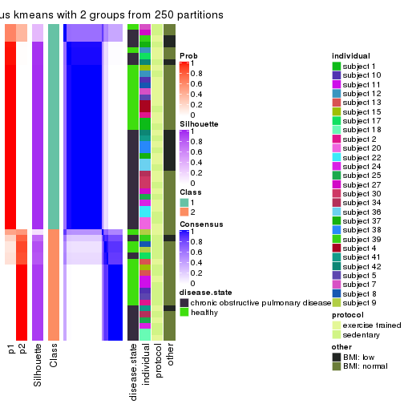</p>

</div>
<div id='tab-ATC-kmeans-consensus-heatmap-2'>
<pre><code class="r">consensus_heatmap(res, k = 3)
</code></pre>

<p>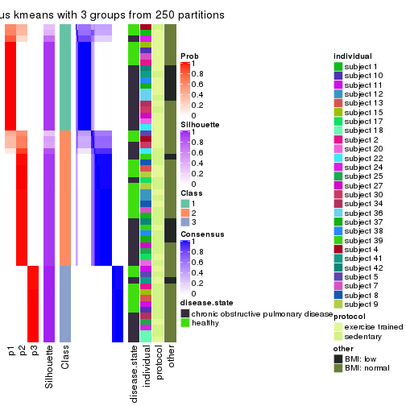</p>

</div>
<div id='tab-ATC-kmeans-consensus-heatmap-3'>
<pre><code class="r">consensus_heatmap(res, k = 4)
</code></pre>

<p>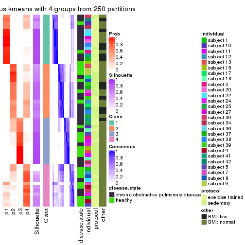</p>

</div>
<div id='tab-ATC-kmeans-consensus-heatmap-4'>
<pre><code class="r">consensus_heatmap(res, k = 5)
</code></pre>

<p>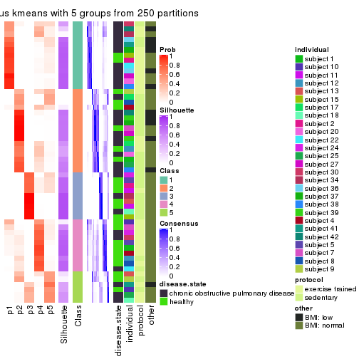</p>

</div>
<div id='tab-ATC-kmeans-consensus-heatmap-5'>
<pre><code class="r">consensus_heatmap(res, k = 6)
</code></pre>

<p>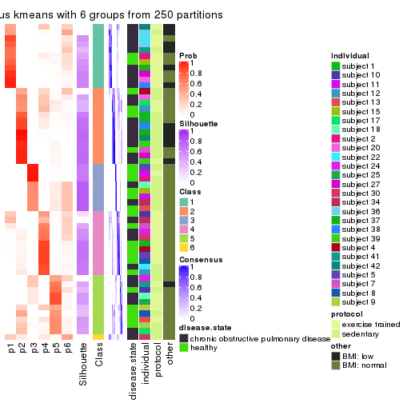</p>

</div>
</div>

Heatmaps for the membership of samples in all partitions to see how consistent they are:


<script>
$( function() {
	$( '#tabs-ATC-kmeans-membership-heatmap' ).tabs();
} );
</script>
<div id='tabs-ATC-kmeans-membership-heatmap'>
<ul>
<li><a href='#tab-ATC-kmeans-membership-heatmap-1'>k = 2</a></li>
<li><a href='#tab-ATC-kmeans-membership-heatmap-2'>k = 3</a></li>
<li><a href='#tab-ATC-kmeans-membership-heatmap-3'>k = 4</a></li>
<li><a href='#tab-ATC-kmeans-membership-heatmap-4'>k = 5</a></li>
<li><a href='#tab-ATC-kmeans-membership-heatmap-5'>k = 6</a></li>
</ul>
<div id='tab-ATC-kmeans-membership-heatmap-1'>
<pre><code class="r">membership_heatmap(res, k = 2)
</code></pre>

<p>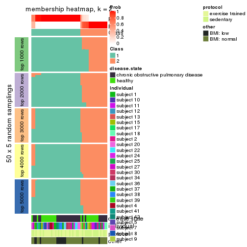</p>

</div>
<div id='tab-ATC-kmeans-membership-heatmap-2'>
<pre><code class="r">membership_heatmap(res, k = 3)
</code></pre>

<p>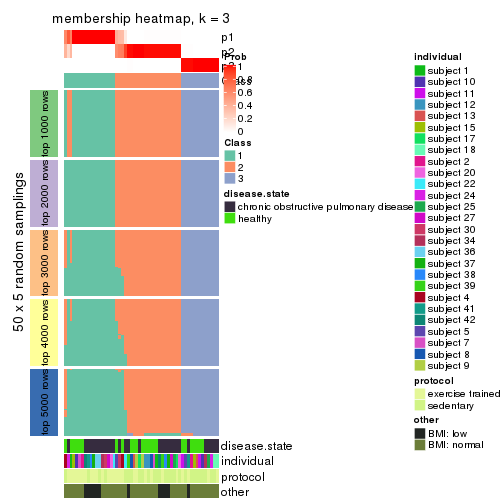</p>

</div>
<div id='tab-ATC-kmeans-membership-heatmap-3'>
<pre><code class="r">membership_heatmap(res, k = 4)
</code></pre>

<p>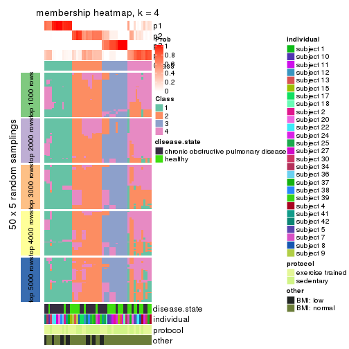</p>

</div>
<div id='tab-ATC-kmeans-membership-heatmap-4'>
<pre><code class="r">membership_heatmap(res, k = 5)
</code></pre>

<p>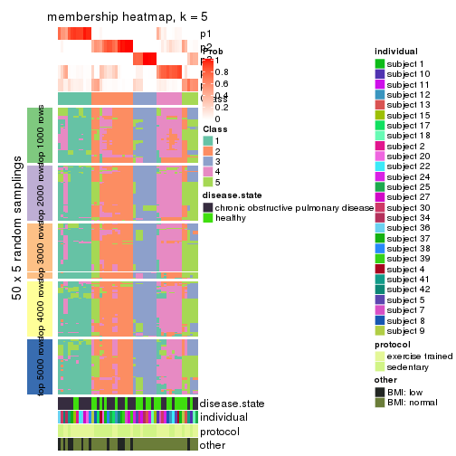</p>

</div>
<div id='tab-ATC-kmeans-membership-heatmap-5'>
<pre><code class="r">membership_heatmap(res, k = 6)
</code></pre>

<p>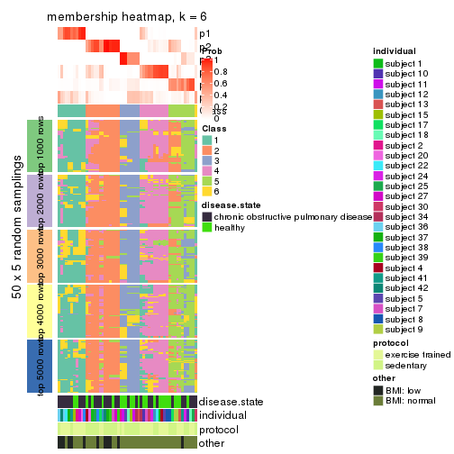</p>

</div>
</div>

As soon as we have had the classes for columns, we can look for signatures
which are significantly different between classes which can be candidate marks
for certain classes. Following are the heatmaps for signatures.


Signature heatmaps where rows are scaled:


<script>
$( function() {
	$( '#tabs-ATC-kmeans-get-signatures' ).tabs();
} );
</script>
<div id='tabs-ATC-kmeans-get-signatures'>
<ul>
<li><a href='#tab-ATC-kmeans-get-signatures-1'>k = 2</a></li>
<li><a href='#tab-ATC-kmeans-get-signatures-2'>k = 3</a></li>
<li><a href='#tab-ATC-kmeans-get-signatures-3'>k = 4</a></li>
<li><a href='#tab-ATC-kmeans-get-signatures-4'>k = 5</a></li>
<li><a href='#tab-ATC-kmeans-get-signatures-5'>k = 6</a></li>
</ul>
<div id='tab-ATC-kmeans-get-signatures-1'>
<pre><code class="r">get_signatures(res, k = 2)
</code></pre>

<p>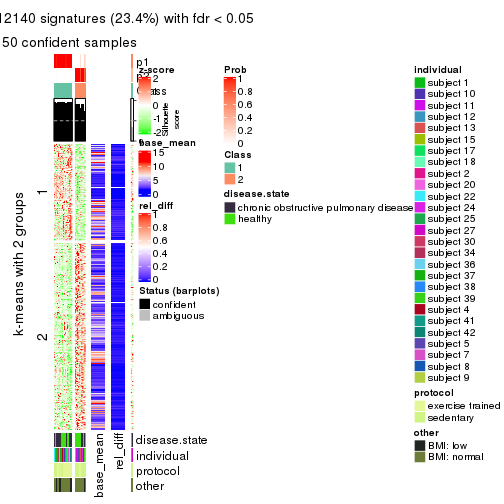</p>

</div>
<div id='tab-ATC-kmeans-get-signatures-2'>
<pre><code class="r">get_signatures(res, k = 3)
</code></pre>

<p>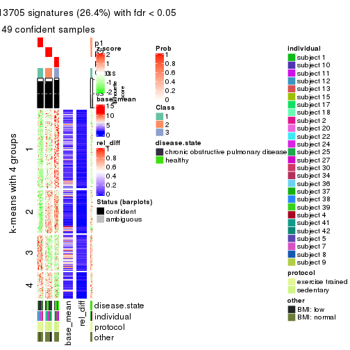</p>

</div>
<div id='tab-ATC-kmeans-get-signatures-3'>
<pre><code class="r">get_signatures(res, k = 4)
</code></pre>

<p>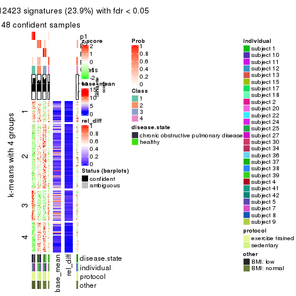</p>

</div>
<div id='tab-ATC-kmeans-get-signatures-4'>
<pre><code class="r">get_signatures(res, k = 5)
</code></pre>

<pre><code>#&gt; Error in mat[ceiling(1:nr/h_ratio), ceiling(1:nc/w_ratio), drop = FALSE]: subscript out of bounds
</code></pre>

<p>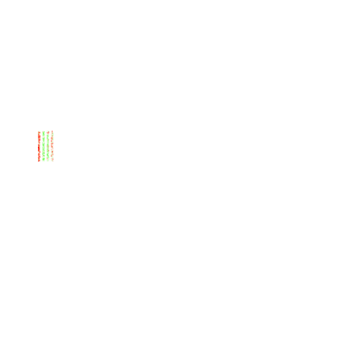</p>

</div>
<div id='tab-ATC-kmeans-get-signatures-5'>
<pre><code class="r">get_signatures(res, k = 6)
</code></pre>

<p>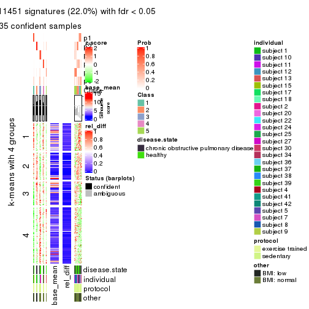</p>

</div>
</div>


Signature heatmaps where rows are not scaled:


<script>
$( function() {
	$( '#tabs-ATC-kmeans-get-signatures-no-scale' ).tabs();
} );
</script>
<div id='tabs-ATC-kmeans-get-signatures-no-scale'>
<ul>
<li><a href='#tab-ATC-kmeans-get-signatures-no-scale-1'>k = 2</a></li>
<li><a href='#tab-ATC-kmeans-get-signatures-no-scale-2'>k = 3</a></li>
<li><a href='#tab-ATC-kmeans-get-signatures-no-scale-3'>k = 4</a></li>
<li><a href='#tab-ATC-kmeans-get-signatures-no-scale-4'>k = 5</a></li>
<li><a href='#tab-ATC-kmeans-get-signatures-no-scale-5'>k = 6</a></li>
</ul>
<div id='tab-ATC-kmeans-get-signatures-no-scale-1'>
<pre><code class="r">get_signatures(res, k = 2, scale_rows = FALSE)
</code></pre>

<p>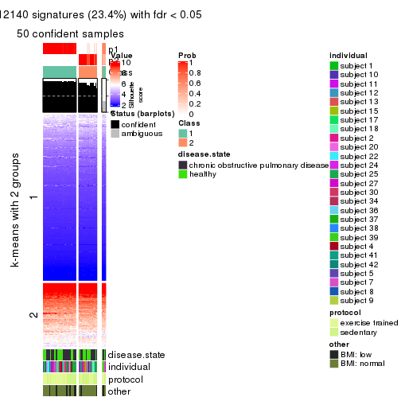</p>

</div>
<div id='tab-ATC-kmeans-get-signatures-no-scale-2'>
<pre><code class="r">get_signatures(res, k = 3, scale_rows = FALSE)
</code></pre>

<p>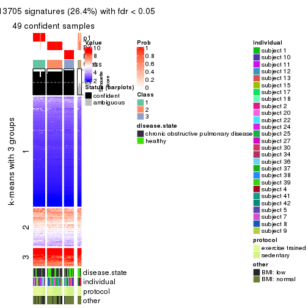</p>

</div>
<div id='tab-ATC-kmeans-get-signatures-no-scale-3'>
<pre><code class="r">get_signatures(res, k = 4, scale_rows = FALSE)
</code></pre>

<p>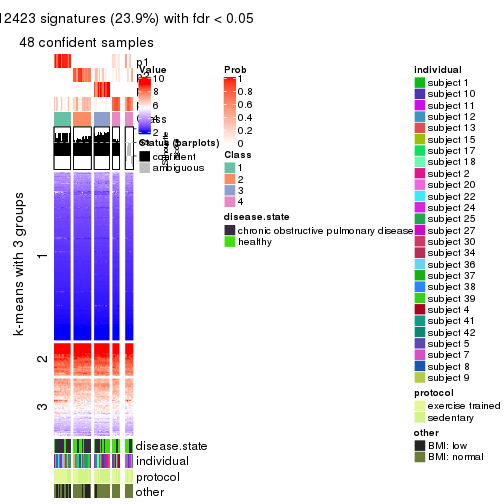</p>

</div>
<div id='tab-ATC-kmeans-get-signatures-no-scale-4'>
<pre><code class="r">get_signatures(res, k = 5, scale_rows = FALSE)
</code></pre>

<p>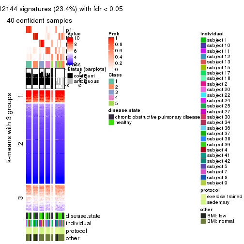</p>

</div>
<div id='tab-ATC-kmeans-get-signatures-no-scale-5'>
<pre><code class="r">get_signatures(res, k = 6, scale_rows = FALSE)
</code></pre>

<p>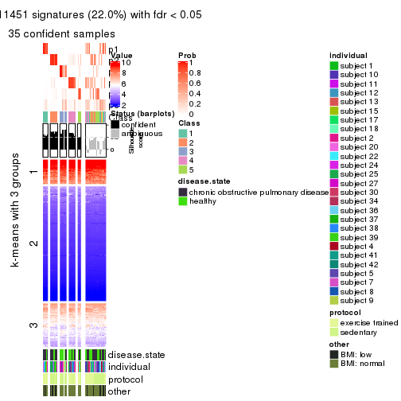</p>

</div>
</div>


Compare the overlap of signatures from different k:

```r
compare_signatures(res)
```

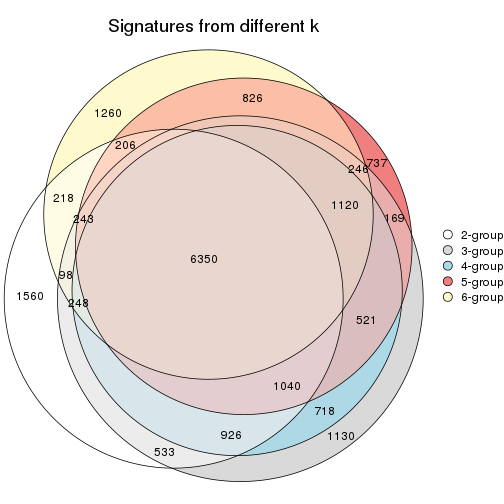

`get_signature()` returns a data frame invisibly. TO get the list of signatures, the function
call should be assigned to a variable explicitly. In following code, if `plot` argument is set
to `FALSE`, no heatmap is plotted while only the differential analysis is performed.

```r
# code only for demonstration
tb = get_signature(res, k = ..., plot = FALSE)
```

An example of the output of `tb` is:

```
#>   which_row         fdr    mean_1    mean_2 scaled_mean_1 scaled_mean_2 km
#> 1        38 0.042760348  8.373488  9.131774    -0.5533452     0.5164555  1
#> 2        40 0.018707592  7.106213  8.469186    -0.6173731     0.5762149  1
#> 3        55 0.019134737 10.221463 11.207825    -0.6159697     0.5749050  1
#> 4        59 0.006059896  5.921854  7.869574    -0.6899429     0.6439467  1
#> 5        60 0.018055526  8.928898 10.211722    -0.6204761     0.5791110  1
#> 6        98 0.009384629 15.714769 14.887706     0.6635654    -0.6193277  2
...
```

The columns in `tb` are:

1. `which_row`: row indices corresponding to the input matrix.
2. `fdr`: FDR for the differential test. 
3. `mean_x`: The mean value in group x.
4. `scaled_mean_x`: The mean value in group x after rows are scaled.
5. `km`: Row groups if k-means clustering is applied to rows.


UMAP plot which shows how samples are separated.


<script>
$( function() {
	$( '#tabs-ATC-kmeans-dimension-reduction' ).tabs();
} );
</script>
<div id='tabs-ATC-kmeans-dimension-reduction'>
<ul>
<li><a href='#tab-ATC-kmeans-dimension-reduction-1'>k = 2</a></li>
<li><a href='#tab-ATC-kmeans-dimension-reduction-2'>k = 3</a></li>
<li><a href='#tab-ATC-kmeans-dimension-reduction-3'>k = 4</a></li>
<li><a href='#tab-ATC-kmeans-dimension-reduction-4'>k = 5</a></li>
<li><a href='#tab-ATC-kmeans-dimension-reduction-5'>k = 6</a></li>
</ul>
<div id='tab-ATC-kmeans-dimension-reduction-1'>
<pre><code class="r">dimension_reduction(res, k = 2, method = &quot;UMAP&quot;)
</code></pre>

<p>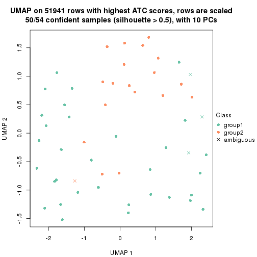</p>

</div>
<div id='tab-ATC-kmeans-dimension-reduction-2'>
<pre><code class="r">dimension_reduction(res, k = 3, method = &quot;UMAP&quot;)
</code></pre>

<p>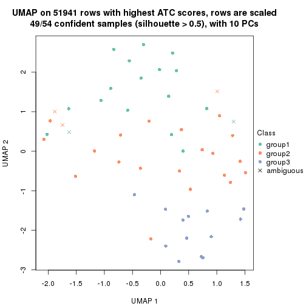</p>

</div>
<div id='tab-ATC-kmeans-dimension-reduction-3'>
<pre><code class="r">dimension_reduction(res, k = 4, method = &quot;UMAP&quot;)
</code></pre>

<p>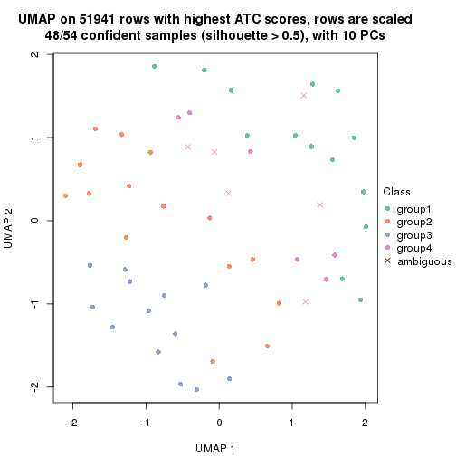</p>

</div>
<div id='tab-ATC-kmeans-dimension-reduction-4'>
<pre><code class="r">dimension_reduction(res, k = 5, method = &quot;UMAP&quot;)
</code></pre>

<p>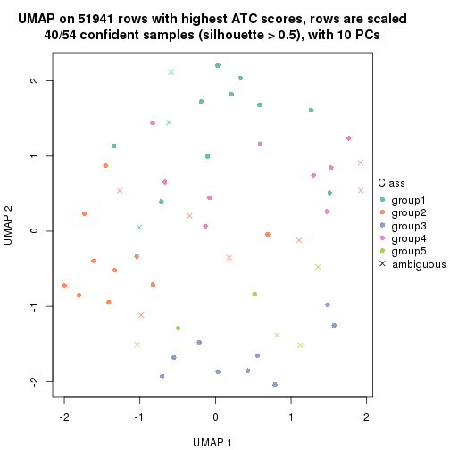</p>

</div>
<div id='tab-ATC-kmeans-dimension-reduction-5'>
<pre><code class="r">dimension_reduction(res, k = 6, method = &quot;UMAP&quot;)
</code></pre>

<p>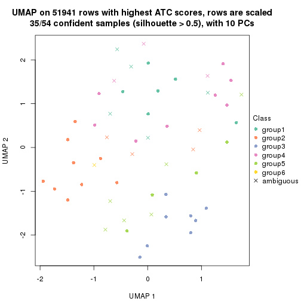</p>

</div>
</div>


Following heatmap shows how subgroups are split when increasing `k`:

```r
collect_classes(res)
```

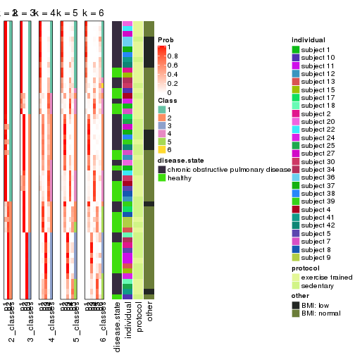


Test correlation between subgroups and known annotations. If the known
annotation is numeric, one-way ANOVA test is applied, and if the known
annotation is discrete, chi-squared contingency table test is applied.

```r
test_to_known_factors(res)
```

```
#>             n disease.state(p) individual(p) protocol(p) other(p) k
#> ATC:kmeans 50           0.3483         0.344    0.039170  0.29908 2
#> ATC:kmeans 49           0.2572         0.396    0.003640  0.17809 3
#> ATC:kmeans 48           0.1941         0.190    0.031670  0.07147 4
#> ATC:kmeans 40           0.0404         0.545    0.001600  0.00976 5
#> ATC:kmeans 35           0.1014         0.502    0.000811  0.01241 6
```


If matrix rows can be associated to genes, consider to use `functional_enrichment(res,
...)` to perform function enrichment for the signature genes. See [this vignette](http://bioconductor.org/packages/devel/bioc/vignettes/cola/inst/doc/functional_enrichment.html) for more detailed explanations.


 

---------------------------------------------------


### ATC:skmeans**


The object with results only for a single top-value method and a single partition method 
can be extracted as:

```r
res = res_list["ATC", "skmeans"]
# you can also extract it by
# res = res_list["ATC:skmeans"]
```

A summary of `res` and all the functions that can be applied to it:

```r
res
```

```
#> A 'ConsensusPartition' object with k = 2, 3, 4, 5, 6.
#>   On a matrix with 51941 rows and 54 columns.
#>   Top rows (1000, 2000, 3000, 4000, 5000) are extracted by 'ATC' method.
#>   Subgroups are detected by 'skmeans' method.
#>   Performed in total 1250 partitions by row resampling.
#>   Best k for subgroups seems to be 3.
#> 
#> Following methods can be applied to this 'ConsensusPartition' object:
#>  [1] "cola_report"             "collect_classes"         "collect_plots"          
#>  [4] "collect_stats"           "colnames"                "compare_signatures"     
#>  [7] "consensus_heatmap"       "dimension_reduction"     "functional_enrichment"  
#> [10] "get_anno_col"            "get_anno"                "get_classes"            
#> [13] "get_consensus"           "get_matrix"              "get_membership"         
#> [16] "get_param"               "get_signatures"          "get_stats"              
#> [19] "is_best_k"               "is_stable_k"             "membership_heatmap"     
#> [22] "ncol"                    "nrow"                    "plot_ecdf"              
#> [25] "rownames"                "select_partition_number" "show"                   
#> [28] "suggest_best_k"          "test_to_known_factors"
```

`collect_plots()` function collects all the plots made from `res` for all `k` (number of partitions)
into one single page to provide an easy and fast comparison between different `k`.

```r
collect_plots(res)
```

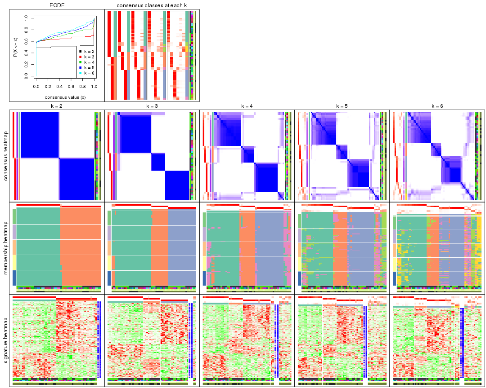

The plots are:

- The first row: a plot of the ECDF (empirical cumulative distribution
  function) curves of the consensus matrix for each `k` and the heatmap of
  predicted classes for each `k`.
- The second row: heatmaps of the consensus matrix for each `k`.
- The third row: heatmaps of the membership matrix for each `k`.
- The fouth row: heatmaps of the signatures for each `k`.

All the plots in panels can be made by individual functions and they are
plotted later in this section.

`select_partition_number()` produces several plots showing different
statistics for choosing "optimized" `k`. There are following statistics:

- ECDF curves of the consensus matrix for each `k`;
- 1-PAC. [The PAC
  score](https://en.wikipedia.org/wiki/Consensus_clustering#Over-interpretation_potential_of_consensus_clustering)
  measures the proportion of the ambiguous subgrouping.
- Mean silhouette score.
- Concordance. The mean probability of fiting the consensus class ids in all
  partitions.
- Area increased. Denote $A_k$ as the area under the ECDF curve for current
  `k`, the area increased is defined as $A_k - A_{k-1}$.
- Rand index. The percent of pairs of samples that are both in a same cluster
  or both are not in a same cluster in the partition of k and k-1.
- Jaccard index. The ratio of pairs of samples are both in a same cluster in
  the partition of k and k-1 and the pairs of samples are both in a same
  cluster in the partition k or k-1.

The detailed explanations of these statistics can be found in [the _cola_
vignette](http://bioconductor.org/packages/devel/bioc/vignettes/cola/inst/doc/cola.html#toc_13).

Generally speaking, lower PAC score, higher mean silhouette score or higher
concordance corresponds to better partition. Rand index and Jaccard index
measure how similar the current partition is compared to partition with `k-1`.
If they are too similar, we won't accept `k` is better than `k-1`.

```r
select_partition_number(res)
```

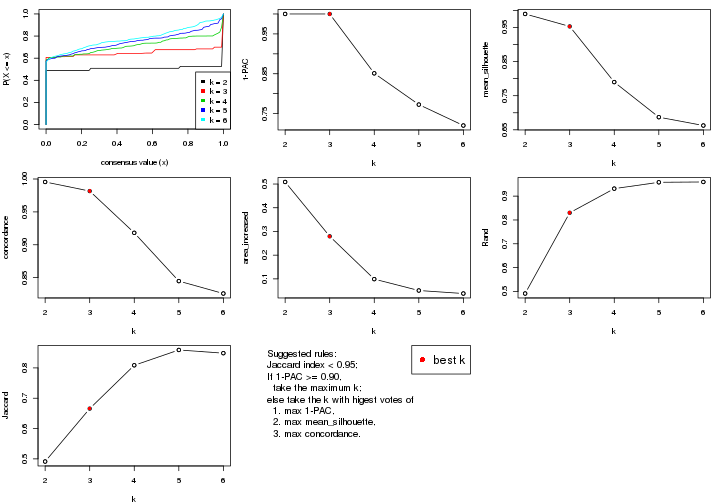

The numeric values for all these statistics can be obtained by `get_stats()`.

```r
get_stats(res)
```

```
#>   k 1-PAC mean_silhouette concordance area_increased  Rand Jaccard
#> 2 2 1.000           0.989       0.995         0.5087 0.491   0.491
#> 3 3 1.000           0.953       0.982         0.2795 0.830   0.666
#> 4 4 0.851           0.790       0.918         0.0989 0.932   0.809
#> 5 5 0.773           0.687       0.845         0.0509 0.958   0.859
#> 6 6 0.720           0.663       0.826         0.0382 0.959   0.849
```

`suggest_best_k()` suggests the best $k$ based on these statistics. The rules are as follows:

- All $k$ with Jaccard index larger than 0.95 are removed because increasing
  $k$ does not provide enough extra information. If all $k$ are removed, it is
  marked as no subgroup is detected.
- For all $k$ with 1-PAC score larger than 0.9, the maximal $k$ is taken as
  the best $k$, and other $k$ are marked as optional $k$.
- If it does not fit the second rule. The $k$ with the maximal vote of the
  highest 1-PAC score, highest mean silhouette, and highest concordance is
  taken as the best $k$.

```r
suggest_best_k(res)
```

```
#> [1] 3
#> attr(,"optional")
#> [1] 2
```

There is also optional best $k$ = 2 that is worth to check.

Following shows the table of the partitions (You need to click the **show/hide
code output** link to see it). The membership matrix (columns with name `p*`)
is inferred by
[`clue::cl_consensus()`](https://www.rdocumentation.org/link/cl_consensus?package=clue)
function with the `SE` method. Basically the value in the membership matrix
represents the probability to belong to a certain group. The finall class
label for an item is determined with the group with highest probability it
belongs to.

In `get_classes()` function, the entropy is calculated from the membership
matrix and the silhouette score is calculated from the consensus matrix.


<script>
$( function() {
	$( '#tabs-ATC-skmeans-get-classes' ).tabs();
} );
</script>
<div id='tabs-ATC-skmeans-get-classes'>
<ul>
<li><a href='#tab-ATC-skmeans-get-classes-1'>k = 2</a></li>
<li><a href='#tab-ATC-skmeans-get-classes-2'>k = 3</a></li>
<li><a href='#tab-ATC-skmeans-get-classes-3'>k = 4</a></li>
<li><a href='#tab-ATC-skmeans-get-classes-4'>k = 5</a></li>
<li><a href='#tab-ATC-skmeans-get-classes-5'>k = 6</a></li>
</ul>

<div id='tab-ATC-skmeans-get-classes-1'>
<p><a id='tab-ATC-skmeans-get-classes-1-a' style='color:#0366d6' href='#'>show/hide code output</a></p>
<pre><code class="r">cbind(get_classes(res, k = 2), get_membership(res, k = 2))
</code></pre>

<pre><code>#&gt;           class entropy silhouette    p1    p2
#&gt; GSM680053     2   0.000      0.990 0.000 1.000
#&gt; GSM680062     2   0.000      0.990 0.000 1.000
#&gt; GSM680054     2   0.000      0.990 0.000 1.000
#&gt; GSM680063     2   0.000      0.990 0.000 1.000
#&gt; GSM680055     1   0.000      1.000 1.000 0.000
#&gt; GSM680064     1   0.000      1.000 1.000 0.000
#&gt; GSM680056     1   0.000      1.000 1.000 0.000
#&gt; GSM680065     1   0.000      1.000 1.000 0.000
#&gt; GSM680057     2   0.000      0.990 0.000 1.000
#&gt; GSM680066     1   0.000      1.000 1.000 0.000
#&gt; GSM680058     1   0.000      1.000 1.000 0.000
#&gt; GSM680067     2   0.000      0.990 0.000 1.000
#&gt; GSM680059     2   0.000      0.990 0.000 1.000
#&gt; GSM680068     1   0.000      1.000 1.000 0.000
#&gt; GSM680060     1   0.000      1.000 1.000 0.000
#&gt; GSM680069     1   0.000      1.000 1.000 0.000
#&gt; GSM680061     2   0.000      0.990 0.000 1.000
#&gt; GSM680070     1   0.000      1.000 1.000 0.000
#&gt; GSM680071     1   0.000      1.000 1.000 0.000
#&gt; GSM680077     1   0.000      1.000 1.000 0.000
#&gt; GSM680072     2   0.000      0.990 0.000 1.000
#&gt; GSM680078     1   0.000      1.000 1.000 0.000
#&gt; GSM680073     1   0.000      1.000 1.000 0.000
#&gt; GSM680079     1   0.000      1.000 1.000 0.000
#&gt; GSM680074     2   0.000      0.990 0.000 1.000
#&gt; GSM680080     2   0.000      0.990 0.000 1.000
#&gt; GSM680075     1   0.000      1.000 1.000 0.000
#&gt; GSM680081     2   0.000      0.990 0.000 1.000
#&gt; GSM680076     2   0.802      0.677 0.244 0.756
#&gt; GSM680082     1   0.000      1.000 1.000 0.000
#&gt; GSM680029     1   0.000      1.000 1.000 0.000
#&gt; GSM680041     1   0.000      1.000 1.000 0.000
#&gt; GSM680035     2   0.000      0.990 0.000 1.000
#&gt; GSM680047     1   0.000      1.000 1.000 0.000
#&gt; GSM680036     1   0.000      1.000 1.000 0.000
#&gt; GSM680048     1   0.000      1.000 1.000 0.000
#&gt; GSM680037     2   0.000      0.990 0.000 1.000
#&gt; GSM680049     1   0.000      1.000 1.000 0.000
#&gt; GSM680038     2   0.000      0.990 0.000 1.000
#&gt; GSM680050     1   0.000      1.000 1.000 0.000
#&gt; GSM680039     2   0.000      0.990 0.000 1.000
#&gt; GSM680051     1   0.000      1.000 1.000 0.000
#&gt; GSM680040     2   0.000      0.990 0.000 1.000
#&gt; GSM680052     2   0.000      0.990 0.000 1.000
#&gt; GSM680030     2   0.000      0.990 0.000 1.000
#&gt; GSM680042     1   0.000      1.000 1.000 0.000
#&gt; GSM680031     2   0.000      0.990 0.000 1.000
#&gt; GSM680043     2   0.000      0.990 0.000 1.000
#&gt; GSM680032     1   0.000      1.000 1.000 0.000
#&gt; GSM680044     2   0.000      0.990 0.000 1.000
#&gt; GSM680033     2   0.000      0.990 0.000 1.000
#&gt; GSM680045     2   0.000      0.990 0.000 1.000
#&gt; GSM680034     2   0.000      0.990 0.000 1.000
#&gt; GSM680046     1   0.000      1.000 1.000 0.000
</code></pre>

<script>
$('#tab-ATC-skmeans-get-classes-1-a').parent().next().next().hide();
$('#tab-ATC-skmeans-get-classes-1-a').click(function(){
  $('#tab-ATC-skmeans-get-classes-1-a').parent().next().next().toggle();
  return(false);
});
</script>
</div>

<div id='tab-ATC-skmeans-get-classes-2'>
<p><a id='tab-ATC-skmeans-get-classes-2-a' style='color:#0366d6' href='#'>show/hide code output</a></p>
<pre><code class="r">cbind(get_classes(res, k = 3), get_membership(res, k = 3))
</code></pre>

<pre><code>#&gt;           class entropy silhouette    p1    p2 p3
#&gt; GSM680053     3   0.000      1.000 0.000 0.000  1
#&gt; GSM680062     2   0.000      0.983 0.000 1.000  0
#&gt; GSM680054     3   0.000      1.000 0.000 0.000  1
#&gt; GSM680063     3   0.000      1.000 0.000 0.000  1
#&gt; GSM680055     1   0.611      0.351 0.604 0.396  0
#&gt; GSM680064     1   0.000      0.963 1.000 0.000  0
#&gt; GSM680056     1   0.000      0.963 1.000 0.000  0
#&gt; GSM680065     1   0.000      0.963 1.000 0.000  0
#&gt; GSM680057     3   0.000      1.000 0.000 0.000  1
#&gt; GSM680066     1   0.000      0.963 1.000 0.000  0
#&gt; GSM680058     2   0.000      0.983 0.000 1.000  0
#&gt; GSM680067     3   0.000      1.000 0.000 0.000  1
#&gt; GSM680059     2   0.000      0.983 0.000 1.000  0
#&gt; GSM680068     1   0.000      0.963 1.000 0.000  0
#&gt; GSM680060     1   0.000      0.963 1.000 0.000  0
#&gt; GSM680069     1   0.000      0.963 1.000 0.000  0
#&gt; GSM680061     3   0.000      1.000 0.000 0.000  1
#&gt; GSM680070     1   0.000      0.963 1.000 0.000  0
#&gt; GSM680071     1   0.000      0.963 1.000 0.000  0
#&gt; GSM680077     1   0.000      0.963 1.000 0.000  0
#&gt; GSM680072     2   0.000      0.983 0.000 1.000  0
#&gt; GSM680078     1   0.000      0.963 1.000 0.000  0
#&gt; GSM680073     2   0.000      0.983 0.000 1.000  0
#&gt; GSM680079     1   0.000      0.963 1.000 0.000  0
#&gt; GSM680074     2   0.000      0.983 0.000 1.000  0
#&gt; GSM680080     2   0.000      0.983 0.000 1.000  0
#&gt; GSM680075     1   0.000      0.963 1.000 0.000  0
#&gt; GSM680081     3   0.000      1.000 0.000 0.000  1
#&gt; GSM680076     2   0.000      0.983 0.000 1.000  0
#&gt; GSM680082     1   0.000      0.963 1.000 0.000  0
#&gt; GSM680029     2   0.388      0.811 0.152 0.848  0
#&gt; GSM680041     1   0.000      0.963 1.000 0.000  0
#&gt; GSM680035     3   0.000      1.000 0.000 0.000  1
#&gt; GSM680047     1   0.000      0.963 1.000 0.000  0
#&gt; GSM680036     1   0.610      0.361 0.608 0.392  0
#&gt; GSM680048     1   0.000      0.963 1.000 0.000  0
#&gt; GSM680037     3   0.000      1.000 0.000 0.000  1
#&gt; GSM680049     1   0.000      0.963 1.000 0.000  0
#&gt; GSM680038     2   0.000      0.983 0.000 1.000  0
#&gt; GSM680050     1   0.000      0.963 1.000 0.000  0
#&gt; GSM680039     3   0.000      1.000 0.000 0.000  1
#&gt; GSM680051     1   0.000      0.963 1.000 0.000  0
#&gt; GSM680040     3   0.000      1.000 0.000 0.000  1
#&gt; GSM680052     3   0.000      1.000 0.000 0.000  1
#&gt; GSM680030     3   0.000      1.000 0.000 0.000  1
#&gt; GSM680042     1   0.000      0.963 1.000 0.000  0
#&gt; GSM680031     3   0.000      1.000 0.000 0.000  1
#&gt; GSM680043     3   0.000      1.000 0.000 0.000  1
#&gt; GSM680032     1   0.186      0.915 0.948 0.052  0
#&gt; GSM680044     2   0.000      0.983 0.000 1.000  0
#&gt; GSM680033     3   0.000      1.000 0.000 0.000  1
#&gt; GSM680045     3   0.000      1.000 0.000 0.000  1
#&gt; GSM680034     3   0.000      1.000 0.000 0.000  1
#&gt; GSM680046     1   0.000      0.963 1.000 0.000  0
</code></pre>

<script>
$('#tab-ATC-skmeans-get-classes-2-a').parent().next().next().hide();
$('#tab-ATC-skmeans-get-classes-2-a').click(function(){
  $('#tab-ATC-skmeans-get-classes-2-a').parent().next().next().toggle();
  return(false);
});
</script>
</div>

<div id='tab-ATC-skmeans-get-classes-3'>
<p><a id='tab-ATC-skmeans-get-classes-3-a' style='color:#0366d6' href='#'>show/hide code output</a></p>
<pre><code class="r">cbind(get_classes(res, k = 4), get_membership(res, k = 4))
</code></pre>

<pre><code>#&gt;           class entropy silhouette    p1    p2    p3    p4
#&gt; GSM680053     3  0.0000     0.9770 0.000 0.000 1.000 0.000
#&gt; GSM680062     2  0.4730     0.4045 0.000 0.636 0.000 0.364
#&gt; GSM680054     3  0.0000     0.9770 0.000 0.000 1.000 0.000
#&gt; GSM680063     3  0.0000     0.9770 0.000 0.000 1.000 0.000
#&gt; GSM680055     1  0.5599     0.4505 0.672 0.276 0.000 0.052
#&gt; GSM680064     1  0.0000     0.8624 1.000 0.000 0.000 0.000
#&gt; GSM680056     4  0.4941     0.3206 0.436 0.000 0.000 0.564
#&gt; GSM680065     1  0.0469     0.8602 0.988 0.000 0.000 0.012
#&gt; GSM680057     3  0.0000     0.9770 0.000 0.000 1.000 0.000
#&gt; GSM680066     1  0.0188     0.8620 0.996 0.000 0.000 0.004
#&gt; GSM680058     2  0.0592     0.9103 0.000 0.984 0.000 0.016
#&gt; GSM680067     3  0.0000     0.9770 0.000 0.000 1.000 0.000
#&gt; GSM680059     2  0.0000     0.9162 0.000 1.000 0.000 0.000
#&gt; GSM680068     1  0.0000     0.8624 1.000 0.000 0.000 0.000
#&gt; GSM680060     1  0.1389     0.8353 0.952 0.000 0.000 0.048
#&gt; GSM680069     1  0.0921     0.8531 0.972 0.000 0.000 0.028
#&gt; GSM680061     3  0.0000     0.9770 0.000 0.000 1.000 0.000
#&gt; GSM680070     1  0.0336     0.8608 0.992 0.000 0.000 0.008
#&gt; GSM680071     1  0.0921     0.8502 0.972 0.000 0.000 0.028
#&gt; GSM680077     1  0.0188     0.8620 0.996 0.000 0.000 0.004
#&gt; GSM680072     2  0.0000     0.9162 0.000 1.000 0.000 0.000
#&gt; GSM680078     1  0.0000     0.8624 1.000 0.000 0.000 0.000
#&gt; GSM680073     2  0.0592     0.9103 0.000 0.984 0.000 0.016
#&gt; GSM680079     1  0.0000     0.8624 1.000 0.000 0.000 0.000
#&gt; GSM680074     2  0.0000     0.9162 0.000 1.000 0.000 0.000
#&gt; GSM680080     2  0.0000     0.9162 0.000 1.000 0.000 0.000
#&gt; GSM680075     1  0.1389     0.8353 0.952 0.000 0.000 0.048
#&gt; GSM680081     3  0.0000     0.9770 0.000 0.000 1.000 0.000
#&gt; GSM680076     2  0.0336     0.9141 0.000 0.992 0.000 0.008
#&gt; GSM680082     1  0.0336     0.8608 0.992 0.000 0.000 0.008
#&gt; GSM680029     2  0.4532     0.6360 0.156 0.792 0.000 0.052
#&gt; GSM680041     1  0.5000    -0.2186 0.500 0.000 0.000 0.500
#&gt; GSM680035     3  0.0000     0.9770 0.000 0.000 1.000 0.000
#&gt; GSM680047     1  0.0188     0.8616 0.996 0.000 0.000 0.004
#&gt; GSM680036     1  0.5434     0.4916 0.696 0.252 0.000 0.052
#&gt; GSM680048     1  0.4977    -0.0935 0.540 0.000 0.000 0.460
#&gt; GSM680037     3  0.0000     0.9770 0.000 0.000 1.000 0.000
#&gt; GSM680049     4  0.2149     0.6178 0.088 0.000 0.000 0.912
#&gt; GSM680038     2  0.0000     0.9162 0.000 1.000 0.000 0.000
#&gt; GSM680050     1  0.0469     0.8587 0.988 0.000 0.000 0.012
#&gt; GSM680039     3  0.0707     0.9595 0.000 0.020 0.980 0.000
#&gt; GSM680051     4  0.4730     0.4095 0.364 0.000 0.000 0.636
#&gt; GSM680040     3  0.0000     0.9770 0.000 0.000 1.000 0.000
#&gt; GSM680052     3  0.4643     0.5084 0.000 0.000 0.656 0.344
#&gt; GSM680030     3  0.0000     0.9770 0.000 0.000 1.000 0.000
#&gt; GSM680042     1  0.3649     0.6054 0.796 0.000 0.000 0.204
#&gt; GSM680031     3  0.0000     0.9770 0.000 0.000 1.000 0.000
#&gt; GSM680043     3  0.0000     0.9770 0.000 0.000 1.000 0.000
#&gt; GSM680032     4  0.4008     0.6259 0.244 0.000 0.000 0.756
#&gt; GSM680044     4  0.4304     0.2899 0.000 0.284 0.000 0.716
#&gt; GSM680033     3  0.0000     0.9770 0.000 0.000 1.000 0.000
#&gt; GSM680045     3  0.0707     0.9615 0.000 0.000 0.980 0.020
#&gt; GSM680034     3  0.0000     0.9770 0.000 0.000 1.000 0.000
#&gt; GSM680046     1  0.0188     0.8616 0.996 0.000 0.000 0.004
</code></pre>

<script>
$('#tab-ATC-skmeans-get-classes-3-a').parent().next().next().hide();
$('#tab-ATC-skmeans-get-classes-3-a').click(function(){
  $('#tab-ATC-skmeans-get-classes-3-a').parent().next().next().toggle();
  return(false);
});
</script>
</div>

<div id='tab-ATC-skmeans-get-classes-4'>
<p><a id='tab-ATC-skmeans-get-classes-4-a' style='color:#0366d6' href='#'>show/hide code output</a></p>
<pre><code class="r">cbind(get_classes(res, k = 5), get_membership(res, k = 5))
</code></pre>

<pre><code>#&gt;           class entropy silhouette    p1    p2    p3    p4    p5
#&gt; GSM680053     3  0.2740    0.86664 0.000 0.004 0.888 0.044 0.064
#&gt; GSM680062     4  0.5559    0.23965 0.000 0.344 0.000 0.572 0.084
#&gt; GSM680054     3  0.0000    0.94536 0.000 0.000 1.000 0.000 0.000
#&gt; GSM680063     3  0.0000    0.94536 0.000 0.000 1.000 0.000 0.000
#&gt; GSM680055     5  0.6496   -0.11666 0.404 0.132 0.000 0.012 0.452
#&gt; GSM680064     1  0.0162    0.80212 0.996 0.000 0.000 0.000 0.004
#&gt; GSM680056     5  0.6328    0.49112 0.228 0.000 0.000 0.244 0.528
#&gt; GSM680065     1  0.0000    0.80241 1.000 0.000 0.000 0.000 0.000
#&gt; GSM680057     3  0.0000    0.94536 0.000 0.000 1.000 0.000 0.000
#&gt; GSM680066     1  0.0000    0.80241 1.000 0.000 0.000 0.000 0.000
#&gt; GSM680058     2  0.2852    0.80711 0.000 0.828 0.000 0.000 0.172
#&gt; GSM680067     3  0.0000    0.94536 0.000 0.000 1.000 0.000 0.000
#&gt; GSM680059     2  0.0290    0.87354 0.000 0.992 0.000 0.008 0.000
#&gt; GSM680068     1  0.0162    0.80212 0.996 0.000 0.000 0.000 0.004
#&gt; GSM680060     1  0.3508    0.59937 0.748 0.000 0.000 0.000 0.252
#&gt; GSM680069     1  0.2179    0.74680 0.888 0.000 0.000 0.000 0.112
#&gt; GSM680061     3  0.0000    0.94536 0.000 0.000 1.000 0.000 0.000
#&gt; GSM680070     1  0.0404    0.80005 0.988 0.000 0.000 0.000 0.012
#&gt; GSM680071     1  0.2230    0.74554 0.884 0.000 0.000 0.000 0.116
#&gt; GSM680077     1  0.0000    0.80241 1.000 0.000 0.000 0.000 0.000
#&gt; GSM680072     2  0.0162    0.87504 0.000 0.996 0.000 0.000 0.004
#&gt; GSM680078     1  0.1043    0.79222 0.960 0.000 0.000 0.000 0.040
#&gt; GSM680073     2  0.2813    0.80978 0.000 0.832 0.000 0.000 0.168
#&gt; GSM680079     1  0.0000    0.80241 1.000 0.000 0.000 0.000 0.000
#&gt; GSM680074     2  0.0609    0.87136 0.000 0.980 0.000 0.020 0.000
#&gt; GSM680080     2  0.0451    0.87332 0.000 0.988 0.000 0.008 0.004
#&gt; GSM680075     1  0.3452    0.60637 0.756 0.000 0.000 0.000 0.244
#&gt; GSM680081     3  0.0703    0.93908 0.000 0.000 0.976 0.024 0.000
#&gt; GSM680076     2  0.1981    0.86284 0.000 0.924 0.000 0.028 0.048
#&gt; GSM680082     1  0.0703    0.79558 0.976 0.000 0.000 0.000 0.024
#&gt; GSM680029     2  0.5284    0.50083 0.056 0.568 0.000 0.000 0.376
#&gt; GSM680041     1  0.6175    0.01073 0.508 0.000 0.000 0.148 0.344
#&gt; GSM680035     3  0.0703    0.93908 0.000 0.000 0.976 0.024 0.000
#&gt; GSM680047     1  0.2351    0.76139 0.896 0.000 0.000 0.016 0.088
#&gt; GSM680036     1  0.6248   -0.00805 0.468 0.148 0.000 0.000 0.384
#&gt; GSM680048     1  0.6049    0.25886 0.576 0.000 0.000 0.192 0.232
#&gt; GSM680037     3  0.0703    0.93908 0.000 0.000 0.976 0.024 0.000
#&gt; GSM680049     5  0.6266    0.43704 0.152 0.000 0.000 0.376 0.472
#&gt; GSM680038     2  0.0609    0.87136 0.000 0.980 0.000 0.020 0.000
#&gt; GSM680050     1  0.1608    0.76007 0.928 0.000 0.000 0.000 0.072
#&gt; GSM680039     3  0.3454    0.72792 0.000 0.156 0.816 0.028 0.000
#&gt; GSM680051     4  0.6635   -0.30353 0.360 0.000 0.000 0.416 0.224
#&gt; GSM680040     3  0.1831    0.90490 0.000 0.000 0.920 0.076 0.004
#&gt; GSM680052     4  0.4464    0.06095 0.000 0.000 0.408 0.584 0.008
#&gt; GSM680030     3  0.0000    0.94536 0.000 0.000 1.000 0.000 0.000
#&gt; GSM680042     1  0.4806    0.41972 0.688 0.000 0.000 0.060 0.252
#&gt; GSM680031     3  0.0000    0.94536 0.000 0.000 1.000 0.000 0.000
#&gt; GSM680043     3  0.0703    0.93908 0.000 0.000 0.976 0.024 0.000
#&gt; GSM680032     5  0.6422    0.50694 0.196 0.000 0.000 0.316 0.488
#&gt; GSM680044     4  0.4424    0.28415 0.000 0.224 0.000 0.728 0.048
#&gt; GSM680033     3  0.0000    0.94536 0.000 0.000 1.000 0.000 0.000
#&gt; GSM680045     3  0.3966    0.50698 0.000 0.000 0.664 0.336 0.000
#&gt; GSM680034     3  0.0000    0.94536 0.000 0.000 1.000 0.000 0.000
#&gt; GSM680046     1  0.1877    0.78001 0.924 0.000 0.000 0.012 0.064
</code></pre>

<script>
$('#tab-ATC-skmeans-get-classes-4-a').parent().next().next().hide();
$('#tab-ATC-skmeans-get-classes-4-a').click(function(){
  $('#tab-ATC-skmeans-get-classes-4-a').parent().next().next().toggle();
  return(false);
});
</script>
</div>

<div id='tab-ATC-skmeans-get-classes-5'>
<p><a id='tab-ATC-skmeans-get-classes-5-a' style='color:#0366d6' href='#'>show/hide code output</a></p>
<pre><code class="r">cbind(get_classes(res, k = 6), get_membership(res, k = 6))
</code></pre>

<pre><code>#&gt;           class entropy silhouette    p1    p2    p3    p4    p5    p6
#&gt; GSM680053     3  0.4196     0.7254 0.000 0.000 0.776 0.104 0.092 0.028
#&gt; GSM680062     4  0.5774     0.3440 0.000 0.236 0.004 0.616 0.092 0.052
#&gt; GSM680054     3  0.0000     0.8942 0.000 0.000 1.000 0.000 0.000 0.000
#&gt; GSM680063     3  0.0363     0.8881 0.000 0.000 0.988 0.012 0.000 0.000
#&gt; GSM680055     5  0.4404     0.5739 0.224 0.044 0.000 0.008 0.716 0.008
#&gt; GSM680064     1  0.0000     0.8012 1.000 0.000 0.000 0.000 0.000 0.000
#&gt; GSM680056     6  0.5639     0.5710 0.180 0.000 0.000 0.036 0.156 0.628
#&gt; GSM680065     1  0.0820     0.7983 0.972 0.000 0.000 0.000 0.012 0.016
#&gt; GSM680057     3  0.0000     0.8942 0.000 0.000 1.000 0.000 0.000 0.000
#&gt; GSM680066     1  0.0458     0.8018 0.984 0.000 0.000 0.000 0.016 0.000
#&gt; GSM680058     2  0.3668     0.5920 0.000 0.668 0.000 0.004 0.328 0.000
#&gt; GSM680067     3  0.0000     0.8942 0.000 0.000 1.000 0.000 0.000 0.000
#&gt; GSM680059     2  0.0146     0.8416 0.000 0.996 0.000 0.004 0.000 0.000
#&gt; GSM680068     1  0.0146     0.8012 0.996 0.000 0.000 0.000 0.004 0.000
#&gt; GSM680060     1  0.4138     0.4226 0.656 0.000 0.000 0.004 0.320 0.020
#&gt; GSM680069     1  0.3014     0.7126 0.832 0.000 0.000 0.000 0.132 0.036
#&gt; GSM680061     3  0.0000     0.8942 0.000 0.000 1.000 0.000 0.000 0.000
#&gt; GSM680070     1  0.0146     0.8013 0.996 0.000 0.000 0.000 0.004 0.000
#&gt; GSM680071     1  0.2544     0.7366 0.864 0.000 0.000 0.004 0.120 0.012
#&gt; GSM680077     1  0.0260     0.8014 0.992 0.000 0.000 0.000 0.008 0.000
#&gt; GSM680072     2  0.1265     0.8371 0.000 0.948 0.000 0.008 0.044 0.000
#&gt; GSM680078     1  0.1320     0.7922 0.948 0.000 0.000 0.000 0.036 0.016
#&gt; GSM680073     2  0.3789     0.5969 0.000 0.668 0.000 0.004 0.324 0.004
#&gt; GSM680079     1  0.0146     0.8012 0.996 0.000 0.000 0.000 0.004 0.000
#&gt; GSM680074     2  0.0622     0.8383 0.000 0.980 0.000 0.012 0.008 0.000
#&gt; GSM680080     2  0.1088     0.8328 0.000 0.960 0.000 0.016 0.024 0.000
#&gt; GSM680075     1  0.3903     0.4561 0.680 0.000 0.000 0.004 0.304 0.012
#&gt; GSM680081     3  0.3141     0.8262 0.000 0.000 0.852 0.084 0.040 0.024
#&gt; GSM680076     2  0.3310     0.7822 0.000 0.824 0.000 0.016 0.132 0.028
#&gt; GSM680082     1  0.0458     0.7977 0.984 0.000 0.000 0.000 0.000 0.016
#&gt; GSM680029     5  0.4049     0.1512 0.020 0.332 0.000 0.000 0.648 0.000
#&gt; GSM680041     1  0.5368    -0.0912 0.468 0.000 0.000 0.040 0.036 0.456
#&gt; GSM680035     3  0.2402     0.8523 0.000 0.000 0.896 0.060 0.032 0.012
#&gt; GSM680047     1  0.3795     0.6899 0.800 0.000 0.000 0.020 0.060 0.120
#&gt; GSM680036     5  0.4735     0.5756 0.296 0.076 0.000 0.000 0.628 0.000
#&gt; GSM680048     1  0.6228     0.1195 0.508 0.000 0.000 0.112 0.056 0.324
#&gt; GSM680037     3  0.2918     0.8339 0.000 0.000 0.864 0.084 0.032 0.020
#&gt; GSM680049     6  0.3101     0.6046 0.148 0.000 0.000 0.032 0.000 0.820
#&gt; GSM680038     2  0.0725     0.8380 0.000 0.976 0.000 0.012 0.012 0.000
#&gt; GSM680050     1  0.1957     0.7331 0.888 0.000 0.000 0.000 0.000 0.112
#&gt; GSM680039     3  0.4220     0.5225 0.000 0.228 0.724 0.032 0.012 0.004
#&gt; GSM680051     6  0.7105     0.2393 0.312 0.000 0.000 0.268 0.072 0.348
#&gt; GSM680040     3  0.5044     0.6518 0.000 0.008 0.692 0.204 0.064 0.032
#&gt; GSM680052     4  0.3593     0.4232 0.000 0.000 0.208 0.764 0.004 0.024
#&gt; GSM680030     3  0.0000     0.8942 0.000 0.000 1.000 0.000 0.000 0.000
#&gt; GSM680042     1  0.3758     0.4193 0.668 0.000 0.000 0.000 0.008 0.324
#&gt; GSM680031     3  0.0000     0.8942 0.000 0.000 1.000 0.000 0.000 0.000
#&gt; GSM680043     3  0.2990     0.8313 0.000 0.000 0.860 0.084 0.036 0.020
#&gt; GSM680032     6  0.4198     0.6003 0.128 0.000 0.000 0.020 0.084 0.768
#&gt; GSM680044     4  0.6092     0.2716 0.000 0.168 0.000 0.568 0.044 0.220
#&gt; GSM680033     3  0.0000     0.8942 0.000 0.000 1.000 0.000 0.000 0.000
#&gt; GSM680045     4  0.5238    -0.1562 0.000 0.000 0.464 0.468 0.044 0.024
#&gt; GSM680034     3  0.0000     0.8942 0.000 0.000 1.000 0.000 0.000 0.000
#&gt; GSM680046     1  0.2932     0.7407 0.860 0.000 0.000 0.012 0.040 0.088
</code></pre>

<script>
$('#tab-ATC-skmeans-get-classes-5-a').parent().next().next().hide();
$('#tab-ATC-skmeans-get-classes-5-a').click(function(){
  $('#tab-ATC-skmeans-get-classes-5-a').parent().next().next().toggle();
  return(false);
});
</script>
</div>
</div>

Heatmaps for the consensus matrix. It visualizes the probability of two
samples to be in a same group.


<script>
$( function() {
	$( '#tabs-ATC-skmeans-consensus-heatmap' ).tabs();
} );
</script>
<div id='tabs-ATC-skmeans-consensus-heatmap'>
<ul>
<li><a href='#tab-ATC-skmeans-consensus-heatmap-1'>k = 2</a></li>
<li><a href='#tab-ATC-skmeans-consensus-heatmap-2'>k = 3</a></li>
<li><a href='#tab-ATC-skmeans-consensus-heatmap-3'>k = 4</a></li>
<li><a href='#tab-ATC-skmeans-consensus-heatmap-4'>k = 5</a></li>
<li><a href='#tab-ATC-skmeans-consensus-heatmap-5'>k = 6</a></li>
</ul>
<div id='tab-ATC-skmeans-consensus-heatmap-1'>
<pre><code class="r">consensus_heatmap(res, k = 2)
</code></pre>

<p>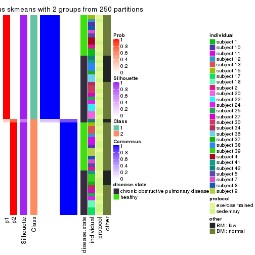</p>

</div>
<div id='tab-ATC-skmeans-consensus-heatmap-2'>
<pre><code class="r">consensus_heatmap(res, k = 3)
</code></pre>

<p>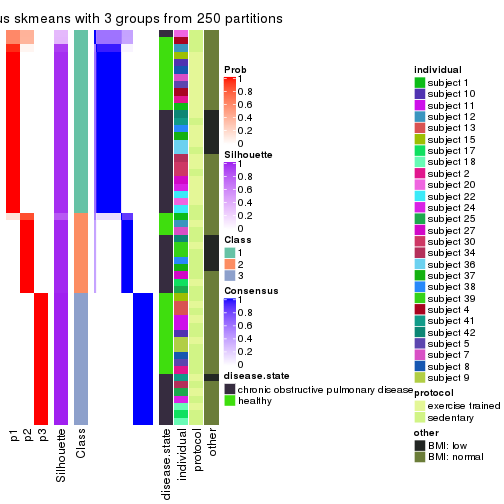</p>

</div>
<div id='tab-ATC-skmeans-consensus-heatmap-3'>
<pre><code class="r">consensus_heatmap(res, k = 4)
</code></pre>

<p>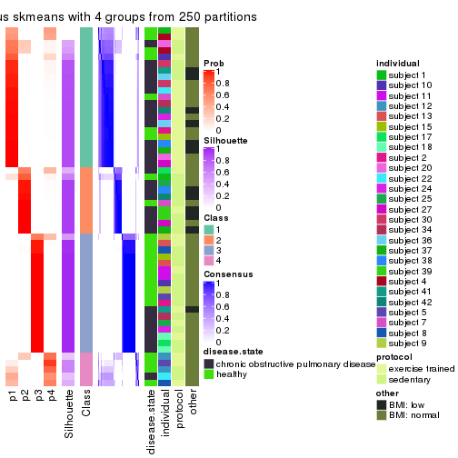</p>

</div>
<div id='tab-ATC-skmeans-consensus-heatmap-4'>
<pre><code class="r">consensus_heatmap(res, k = 5)
</code></pre>

<p>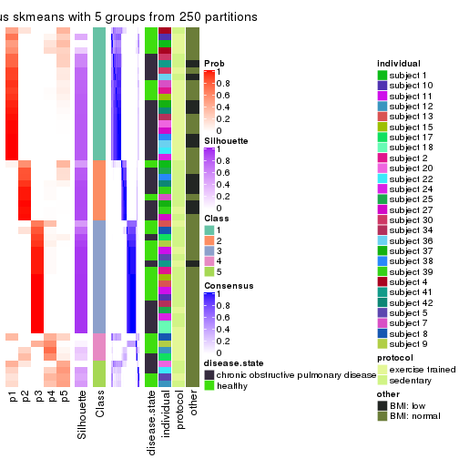</p>

</div>
<div id='tab-ATC-skmeans-consensus-heatmap-5'>
<pre><code class="r">consensus_heatmap(res, k = 6)
</code></pre>

<p>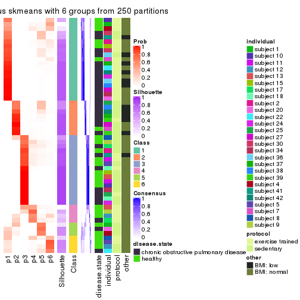</p>

</div>
</div>

Heatmaps for the membership of samples in all partitions to see how consistent they are:


<script>
$( function() {
	$( '#tabs-ATC-skmeans-membership-heatmap' ).tabs();
} );
</script>
<div id='tabs-ATC-skmeans-membership-heatmap'>
<ul>
<li><a href='#tab-ATC-skmeans-membership-heatmap-1'>k = 2</a></li>
<li><a href='#tab-ATC-skmeans-membership-heatmap-2'>k = 3</a></li>
<li><a href='#tab-ATC-skmeans-membership-heatmap-3'>k = 4</a></li>
<li><a href='#tab-ATC-skmeans-membership-heatmap-4'>k = 5</a></li>
<li><a href='#tab-ATC-skmeans-membership-heatmap-5'>k = 6</a></li>
</ul>
<div id='tab-ATC-skmeans-membership-heatmap-1'>
<pre><code class="r">membership_heatmap(res, k = 2)
</code></pre>

<p>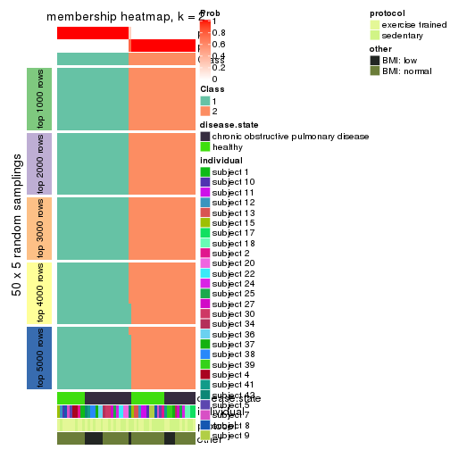</p>

</div>
<div id='tab-ATC-skmeans-membership-heatmap-2'>
<pre><code class="r">membership_heatmap(res, k = 3)
</code></pre>

<p>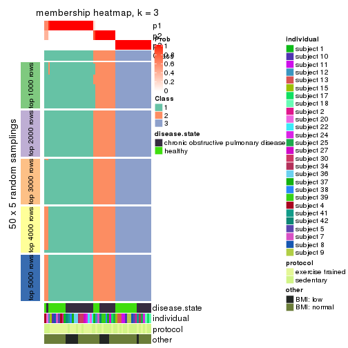</p>

</div>
<div id='tab-ATC-skmeans-membership-heatmap-3'>
<pre><code class="r">membership_heatmap(res, k = 4)
</code></pre>

<p>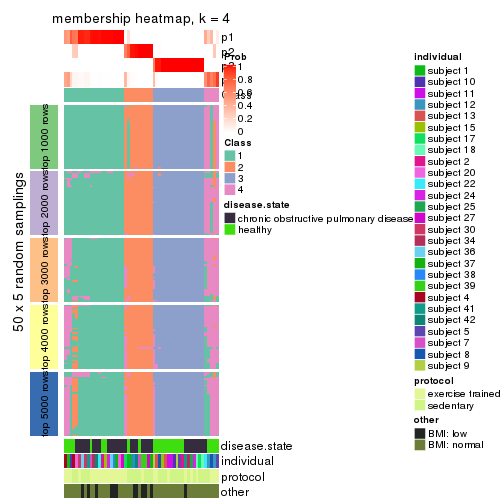</p>

</div>
<div id='tab-ATC-skmeans-membership-heatmap-4'>
<pre><code class="r">membership_heatmap(res, k = 5)
</code></pre>

<p>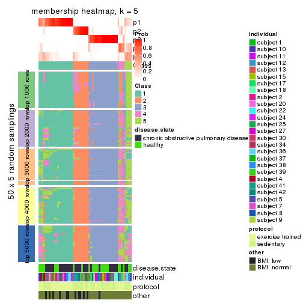</p>

</div>
<div id='tab-ATC-skmeans-membership-heatmap-5'>
<pre><code class="r">membership_heatmap(res, k = 6)
</code></pre>

<p>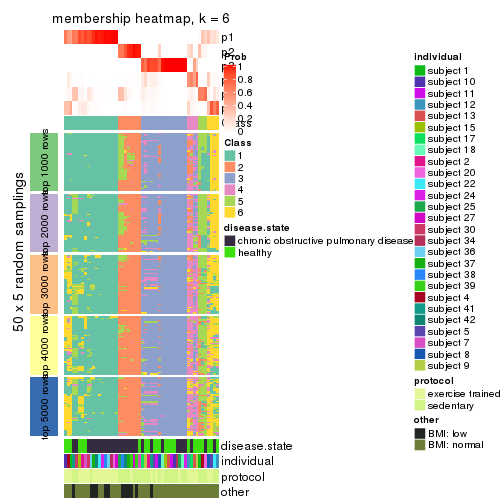</p>

</div>
</div>

As soon as we have had the classes for columns, we can look for signatures
which are significantly different between classes which can be candidate marks
for certain classes. Following are the heatmaps for signatures.


Signature heatmaps where rows are scaled:


<script>
$( function() {
	$( '#tabs-ATC-skmeans-get-signatures' ).tabs();
} );
</script>
<div id='tabs-ATC-skmeans-get-signatures'>
<ul>
<li><a href='#tab-ATC-skmeans-get-signatures-1'>k = 2</a></li>
<li><a href='#tab-ATC-skmeans-get-signatures-2'>k = 3</a></li>
<li><a href='#tab-ATC-skmeans-get-signatures-3'>k = 4</a></li>
<li><a href='#tab-ATC-skmeans-get-signatures-4'>k = 5</a></li>
<li><a href='#tab-ATC-skmeans-get-signatures-5'>k = 6</a></li>
</ul>
<div id='tab-ATC-skmeans-get-signatures-1'>
<pre><code class="r">get_signatures(res, k = 2)
</code></pre>

<p>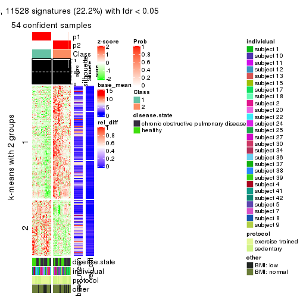</p>

</div>
<div id='tab-ATC-skmeans-get-signatures-2'>
<pre><code class="r">get_signatures(res, k = 3)
</code></pre>

<p>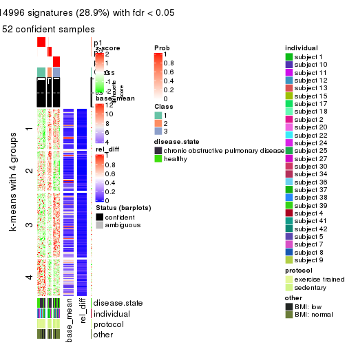</p>

</div>
<div id='tab-ATC-skmeans-get-signatures-3'>
<pre><code class="r">get_signatures(res, k = 4)
</code></pre>

<pre><code>#&gt; Error in mat[ceiling(1:nr/h_ratio), ceiling(1:nc/w_ratio), drop = FALSE]: subscript out of bounds
</code></pre>

<p></p>

</div>
<div id='tab-ATC-skmeans-get-signatures-4'>
<pre><code class="r">get_signatures(res, k = 5)
</code></pre>

<p>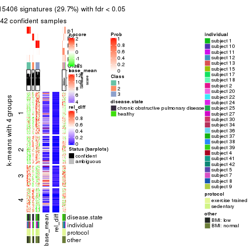</p>

</div>
<div id='tab-ATC-skmeans-get-signatures-5'>
<pre><code class="r">get_signatures(res, k = 6)
</code></pre>

<pre><code>#&gt; Error in mat[ceiling(1:nr/h_ratio), ceiling(1:nc/w_ratio), drop = FALSE]: subscript out of bounds
</code></pre>

<p></p>

</div>
</div>


Signature heatmaps where rows are not scaled:


<script>
$( function() {
	$( '#tabs-ATC-skmeans-get-signatures-no-scale' ).tabs();
} );
</script>
<div id='tabs-ATC-skmeans-get-signatures-no-scale'>
<ul>
<li><a href='#tab-ATC-skmeans-get-signatures-no-scale-1'>k = 2</a></li>
<li><a href='#tab-ATC-skmeans-get-signatures-no-scale-2'>k = 3</a></li>
<li><a href='#tab-ATC-skmeans-get-signatures-no-scale-3'>k = 4</a></li>
<li><a href='#tab-ATC-skmeans-get-signatures-no-scale-4'>k = 5</a></li>
<li><a href='#tab-ATC-skmeans-get-signatures-no-scale-5'>k = 6</a></li>
</ul>
<div id='tab-ATC-skmeans-get-signatures-no-scale-1'>
<pre><code class="r">get_signatures(res, k = 2, scale_rows = FALSE)
</code></pre>

<p>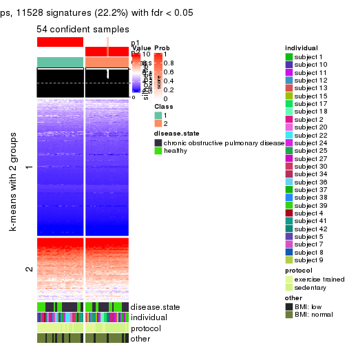</p>

</div>
<div id='tab-ATC-skmeans-get-signatures-no-scale-2'>
<pre><code class="r">get_signatures(res, k = 3, scale_rows = FALSE)
</code></pre>

<p>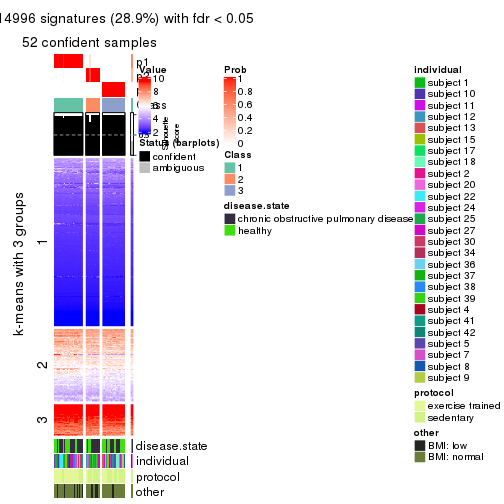</p>

</div>
<div id='tab-ATC-skmeans-get-signatures-no-scale-3'>
<pre><code class="r">get_signatures(res, k = 4, scale_rows = FALSE)
</code></pre>

<p>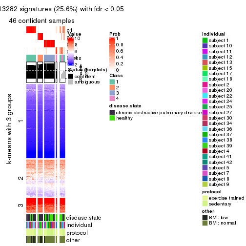</p>

</div>
<div id='tab-ATC-skmeans-get-signatures-no-scale-4'>
<pre><code class="r">get_signatures(res, k = 5, scale_rows = FALSE)
</code></pre>

<p>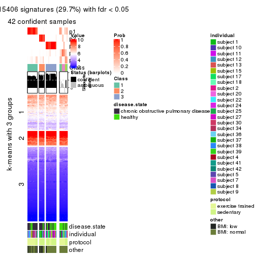</p>

</div>
<div id='tab-ATC-skmeans-get-signatures-no-scale-5'>
<pre><code class="r">get_signatures(res, k = 6, scale_rows = FALSE)
</code></pre>

<p>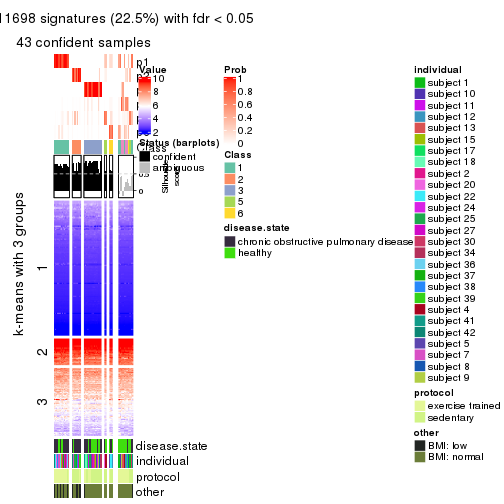</p>

</div>
</div>


Compare the overlap of signatures from different k:

```r
compare_signatures(res)
```

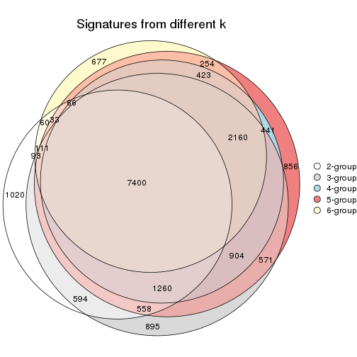

`get_signature()` returns a data frame invisibly. TO get the list of signatures, the function
call should be assigned to a variable explicitly. In following code, if `plot` argument is set
to `FALSE`, no heatmap is plotted while only the differential analysis is performed.

```r
# code only for demonstration
tb = get_signature(res, k = ..., plot = FALSE)
```

An example of the output of `tb` is:

```
#>   which_row         fdr    mean_1    mean_2 scaled_mean_1 scaled_mean_2 km
#> 1        38 0.042760348  8.373488  9.131774    -0.5533452     0.5164555  1
#> 2        40 0.018707592  7.106213  8.469186    -0.6173731     0.5762149  1
#> 3        55 0.019134737 10.221463 11.207825    -0.6159697     0.5749050  1
#> 4        59 0.006059896  5.921854  7.869574    -0.6899429     0.6439467  1
#> 5        60 0.018055526  8.928898 10.211722    -0.6204761     0.5791110  1
#> 6        98 0.009384629 15.714769 14.887706     0.6635654    -0.6193277  2
...
```

The columns in `tb` are:

1. `which_row`: row indices corresponding to the input matrix.
2. `fdr`: FDR for the differential test. 
3. `mean_x`: The mean value in group x.
4. `scaled_mean_x`: The mean value in group x after rows are scaled.
5. `km`: Row groups if k-means clustering is applied to rows.


UMAP plot which shows how samples are separated.


<script>
$( function() {
	$( '#tabs-ATC-skmeans-dimension-reduction' ).tabs();
} );
</script>
<div id='tabs-ATC-skmeans-dimension-reduction'>
<ul>
<li><a href='#tab-ATC-skmeans-dimension-reduction-1'>k = 2</a></li>
<li><a href='#tab-ATC-skmeans-dimension-reduction-2'>k = 3</a></li>
<li><a href='#tab-ATC-skmeans-dimension-reduction-3'>k = 4</a></li>
<li><a href='#tab-ATC-skmeans-dimension-reduction-4'>k = 5</a></li>
<li><a href='#tab-ATC-skmeans-dimension-reduction-5'>k = 6</a></li>
</ul>
<div id='tab-ATC-skmeans-dimension-reduction-1'>
<pre><code class="r">dimension_reduction(res, k = 2, method = &quot;UMAP&quot;)
</code></pre>

<p>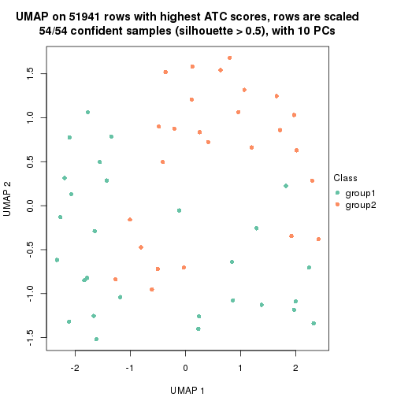</p>

</div>
<div id='tab-ATC-skmeans-dimension-reduction-2'>
<pre><code class="r">dimension_reduction(res, k = 3, method = &quot;UMAP&quot;)
</code></pre>

<p>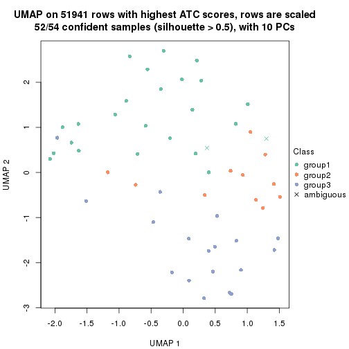</p>

</div>
<div id='tab-ATC-skmeans-dimension-reduction-3'>
<pre><code class="r">dimension_reduction(res, k = 4, method = &quot;UMAP&quot;)
</code></pre>

<p>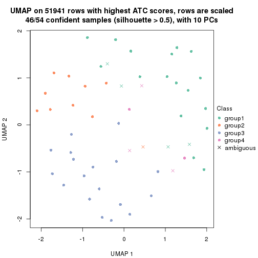</p>

</div>
<div id='tab-ATC-skmeans-dimension-reduction-4'>
<pre><code class="r">dimension_reduction(res, k = 5, method = &quot;UMAP&quot;)
</code></pre>

<p>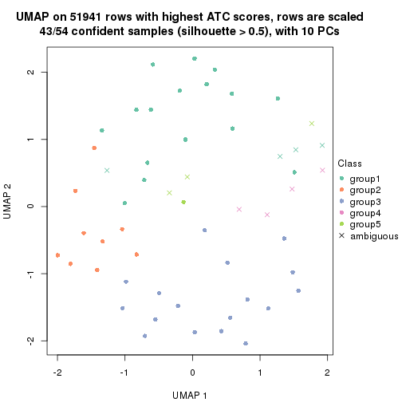</p>

</div>
<div id='tab-ATC-skmeans-dimension-reduction-5'>
<pre><code class="r">dimension_reduction(res, k = 6, method = &quot;UMAP&quot;)
</code></pre>

<p>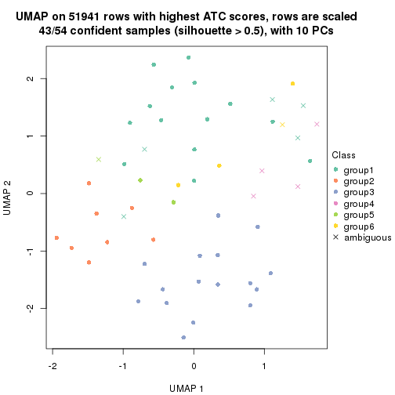</p>

</div>
</div>


Following heatmap shows how subgroups are split when increasing `k`:

```r
collect_classes(res)
```

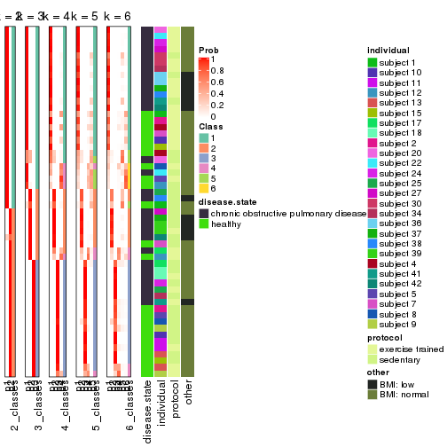


Test correlation between subgroups and known annotations. If the known
annotation is numeric, one-way ANOVA test is applied, and if the known
annotation is discrete, chi-squared contingency table test is applied.

```r
test_to_known_factors(res)
```

```
#>              n disease.state(p) individual(p) protocol(p) other(p) k
#> ATC:skmeans 54           0.6047        0.4652    0.056590   0.8556 2
#> ATC:skmeans 52           0.1649        0.5003    0.003088   0.0421 3
#> ATC:skmeans 46           0.0253        0.1798    0.002295   0.0240 4
#> ATC:skmeans 43           0.0405        0.0715    0.001653   0.0345 5
#> ATC:skmeans 43           0.1199        0.3257    0.000344   0.0230 6
```


If matrix rows can be associated to genes, consider to use `functional_enrichment(res,
...)` to perform function enrichment for the signature genes. See [this vignette](http://bioconductor.org/packages/devel/bioc/vignettes/cola/inst/doc/functional_enrichment.html) for more detailed explanations.


 

---------------------------------------------------


### ATC:pam


The object with results only for a single top-value method and a single partition method 
can be extracted as:

```r
res = res_list["ATC", "pam"]
# you can also extract it by
# res = res_list["ATC:pam"]
```

A summary of `res` and all the functions that can be applied to it:

```r
res
```

```
#> A 'ConsensusPartition' object with k = 2, 3, 4, 5, 6.
#>   On a matrix with 51941 rows and 54 columns.
#>   Top rows (1000, 2000, 3000, 4000, 5000) are extracted by 'ATC' method.
#>   Subgroups are detected by 'pam' method.
#>   Performed in total 1250 partitions by row resampling.
#>   Best k for subgroups seems to be 3.
#> 
#> Following methods can be applied to this 'ConsensusPartition' object:
#>  [1] "cola_report"             "collect_classes"         "collect_plots"          
#>  [4] "collect_stats"           "colnames"                "compare_signatures"     
#>  [7] "consensus_heatmap"       "dimension_reduction"     "functional_enrichment"  
#> [10] "get_anno_col"            "get_anno"                "get_classes"            
#> [13] "get_consensus"           "get_matrix"              "get_membership"         
#> [16] "get_param"               "get_signatures"          "get_stats"              
#> [19] "is_best_k"               "is_stable_k"             "membership_heatmap"     
#> [22] "ncol"                    "nrow"                    "plot_ecdf"              
#> [25] "rownames"                "select_partition_number" "show"                   
#> [28] "suggest_best_k"          "test_to_known_factors"
```

`collect_plots()` function collects all the plots made from `res` for all `k` (number of partitions)
into one single page to provide an easy and fast comparison between different `k`.

```r
collect_plots(res)
```

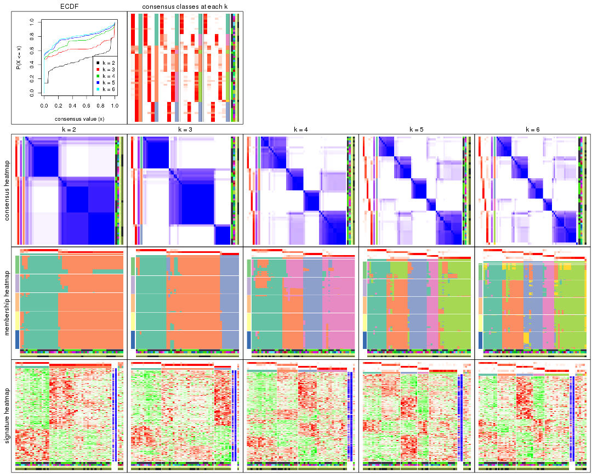

The plots are:

- The first row: a plot of the ECDF (empirical cumulative distribution
  function) curves of the consensus matrix for each `k` and the heatmap of
  predicted classes for each `k`.
- The second row: heatmaps of the consensus matrix for each `k`.
- The third row: heatmaps of the membership matrix for each `k`.
- The fouth row: heatmaps of the signatures for each `k`.

All the plots in panels can be made by individual functions and they are
plotted later in this section.

`select_partition_number()` produces several plots showing different
statistics for choosing "optimized" `k`. There are following statistics:

- ECDF curves of the consensus matrix for each `k`;
- 1-PAC. [The PAC
  score](https://en.wikipedia.org/wiki/Consensus_clustering#Over-interpretation_potential_of_consensus_clustering)
  measures the proportion of the ambiguous subgrouping.
- Mean silhouette score.
- Concordance. The mean probability of fiting the consensus class ids in all
  partitions.
- Area increased. Denote $A_k$ as the area under the ECDF curve for current
  `k`, the area increased is defined as $A_k - A_{k-1}$.
- Rand index. The percent of pairs of samples that are both in a same cluster
  or both are not in a same cluster in the partition of k and k-1.
- Jaccard index. The ratio of pairs of samples are both in a same cluster in
  the partition of k and k-1 and the pairs of samples are both in a same
  cluster in the partition k or k-1.

The detailed explanations of these statistics can be found in [the _cola_
vignette](http://bioconductor.org/packages/devel/bioc/vignettes/cola/inst/doc/cola.html#toc_13).

Generally speaking, lower PAC score, higher mean silhouette score or higher
concordance corresponds to better partition. Rand index and Jaccard index
measure how similar the current partition is compared to partition with `k-1`.
If they are too similar, we won't accept `k` is better than `k-1`.

```r
select_partition_number(res)
```

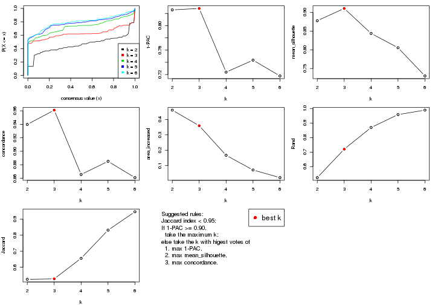

The numeric values for all these statistics can be obtained by `get_stats()`.

```r
get_stats(res)
```

```
#>   k 1-PAC mean_silhouette concordance area_increased  Rand Jaccard
#> 2 2 0.826           0.878       0.940         0.4606 0.525   0.525
#> 3 3 0.828           0.910       0.961         0.3592 0.720   0.528
#> 4 4 0.724           0.844       0.866         0.1669 0.869   0.656
#> 5 5 0.744           0.805       0.885         0.0716 0.958   0.831
#> 6 6 0.718           0.730       0.861         0.0220 0.989   0.946
```

`suggest_best_k()` suggests the best $k$ based on these statistics. The rules are as follows:

- All $k$ with Jaccard index larger than 0.95 are removed because increasing
  $k$ does not provide enough extra information. If all $k$ are removed, it is
  marked as no subgroup is detected.
- For all $k$ with 1-PAC score larger than 0.9, the maximal $k$ is taken as
  the best $k$, and other $k$ are marked as optional $k$.
- If it does not fit the second rule. The $k$ with the maximal vote of the
  highest 1-PAC score, highest mean silhouette, and highest concordance is
  taken as the best $k$.

```r
suggest_best_k(res)
```

```
#> [1] 3
```


Following shows the table of the partitions (You need to click the **show/hide
code output** link to see it). The membership matrix (columns with name `p*`)
is inferred by
[`clue::cl_consensus()`](https://www.rdocumentation.org/link/cl_consensus?package=clue)
function with the `SE` method. Basically the value in the membership matrix
represents the probability to belong to a certain group. The finall class
label for an item is determined with the group with highest probability it
belongs to.

In `get_classes()` function, the entropy is calculated from the membership
matrix and the silhouette score is calculated from the consensus matrix.


<script>
$( function() {
	$( '#tabs-ATC-pam-get-classes' ).tabs();
} );
</script>
<div id='tabs-ATC-pam-get-classes'>
<ul>
<li><a href='#tab-ATC-pam-get-classes-1'>k = 2</a></li>
<li><a href='#tab-ATC-pam-get-classes-2'>k = 3</a></li>
<li><a href='#tab-ATC-pam-get-classes-3'>k = 4</a></li>
<li><a href='#tab-ATC-pam-get-classes-4'>k = 5</a></li>
<li><a href='#tab-ATC-pam-get-classes-5'>k = 6</a></li>
</ul>

<div id='tab-ATC-pam-get-classes-1'>
<p><a id='tab-ATC-pam-get-classes-1-a' style='color:#0366d6' href='#'>show/hide code output</a></p>
<pre><code class="r">cbind(get_classes(res, k = 2), get_membership(res, k = 2))
</code></pre>

<pre><code>#&gt;           class entropy silhouette    p1    p2
#&gt; GSM680053     2   0.295      0.950 0.052 0.948
#&gt; GSM680062     2   0.295      0.950 0.052 0.948
#&gt; GSM680054     2   0.000      0.940 0.000 1.000
#&gt; GSM680063     2   0.000      0.940 0.000 1.000
#&gt; GSM680055     2   0.430      0.922 0.088 0.912
#&gt; GSM680064     1   0.000      0.917 1.000 0.000
#&gt; GSM680056     1   0.850      0.611 0.724 0.276
#&gt; GSM680065     1   0.000      0.917 1.000 0.000
#&gt; GSM680057     2   0.000      0.940 0.000 1.000
#&gt; GSM680066     1   0.000      0.917 1.000 0.000
#&gt; GSM680058     2   0.295      0.950 0.052 0.948
#&gt; GSM680067     2   0.000      0.940 0.000 1.000
#&gt; GSM680059     2   0.295      0.950 0.052 0.948
#&gt; GSM680068     1   0.000      0.917 1.000 0.000
#&gt; GSM680060     1   0.985      0.200 0.572 0.428
#&gt; GSM680069     1   1.000     -0.027 0.504 0.496
#&gt; GSM680061     2   0.000      0.940 0.000 1.000
#&gt; GSM680070     1   0.000      0.917 1.000 0.000
#&gt; GSM680071     1   0.000      0.917 1.000 0.000
#&gt; GSM680077     1   0.000      0.917 1.000 0.000
#&gt; GSM680072     2   0.295      0.950 0.052 0.948
#&gt; GSM680078     1   0.000      0.917 1.000 0.000
#&gt; GSM680073     2   0.295      0.950 0.052 0.948
#&gt; GSM680079     1   0.000      0.917 1.000 0.000
#&gt; GSM680074     2   0.295      0.950 0.052 0.948
#&gt; GSM680080     2   0.295      0.950 0.052 0.948
#&gt; GSM680075     1   0.000      0.917 1.000 0.000
#&gt; GSM680081     2   0.000      0.940 0.000 1.000
#&gt; GSM680076     2   0.295      0.950 0.052 0.948
#&gt; GSM680082     1   0.000      0.917 1.000 0.000
#&gt; GSM680029     2   0.311      0.947 0.056 0.944
#&gt; GSM680041     1   0.402      0.857 0.920 0.080
#&gt; GSM680035     2   0.000      0.940 0.000 1.000
#&gt; GSM680047     1   0.000      0.917 1.000 0.000
#&gt; GSM680036     2   0.861      0.653 0.284 0.716
#&gt; GSM680048     2   0.952      0.451 0.372 0.628
#&gt; GSM680037     2   0.000      0.940 0.000 1.000
#&gt; GSM680049     1   0.615      0.782 0.848 0.152
#&gt; GSM680038     2   0.295      0.950 0.052 0.948
#&gt; GSM680050     1   0.000      0.917 1.000 0.000
#&gt; GSM680039     2   0.295      0.950 0.052 0.948
#&gt; GSM680051     2   0.529      0.890 0.120 0.880
#&gt; GSM680040     2   0.295      0.950 0.052 0.948
#&gt; GSM680052     2   0.295      0.950 0.052 0.948
#&gt; GSM680030     2   0.000      0.940 0.000 1.000
#&gt; GSM680042     1   0.000      0.917 1.000 0.000
#&gt; GSM680031     2   0.000      0.940 0.000 1.000
#&gt; GSM680043     2   0.000      0.940 0.000 1.000
#&gt; GSM680032     2   0.529      0.890 0.120 0.880
#&gt; GSM680044     2   0.295      0.950 0.052 0.948
#&gt; GSM680033     2   0.000      0.940 0.000 1.000
#&gt; GSM680045     2   0.295      0.950 0.052 0.948
#&gt; GSM680034     2   0.000      0.940 0.000 1.000
#&gt; GSM680046     1   0.000      0.917 1.000 0.000
</code></pre>

<script>
$('#tab-ATC-pam-get-classes-1-a').parent().next().next().hide();
$('#tab-ATC-pam-get-classes-1-a').click(function(){
  $('#tab-ATC-pam-get-classes-1-a').parent().next().next().toggle();
  return(false);
});
</script>
</div>

<div id='tab-ATC-pam-get-classes-2'>
<p><a id='tab-ATC-pam-get-classes-2-a' style='color:#0366d6' href='#'>show/hide code output</a></p>
<pre><code class="r">cbind(get_classes(res, k = 3), get_membership(res, k = 3))
</code></pre>

<pre><code>#&gt;           class entropy silhouette    p1    p2    p3
#&gt; GSM680053     2   0.000      0.942 0.000 1.000 0.000
#&gt; GSM680062     2   0.000      0.942 0.000 1.000 0.000
#&gt; GSM680054     3   0.000      0.956 0.000 0.000 1.000
#&gt; GSM680063     2   0.388      0.799 0.000 0.848 0.152
#&gt; GSM680055     2   0.000      0.942 0.000 1.000 0.000
#&gt; GSM680064     1   0.000      0.971 1.000 0.000 0.000
#&gt; GSM680056     2   0.418      0.783 0.172 0.828 0.000
#&gt; GSM680065     1   0.000      0.971 1.000 0.000 0.000
#&gt; GSM680057     3   0.000      0.956 0.000 0.000 1.000
#&gt; GSM680066     1   0.319      0.852 0.888 0.112 0.000
#&gt; GSM680058     2   0.000      0.942 0.000 1.000 0.000
#&gt; GSM680067     2   0.562      0.557 0.000 0.692 0.308
#&gt; GSM680059     2   0.000      0.942 0.000 1.000 0.000
#&gt; GSM680068     1   0.000      0.971 1.000 0.000 0.000
#&gt; GSM680060     2   0.514      0.700 0.252 0.748 0.000
#&gt; GSM680069     2   0.164      0.913 0.044 0.956 0.000
#&gt; GSM680061     3   0.000      0.956 0.000 0.000 1.000
#&gt; GSM680070     1   0.000      0.971 1.000 0.000 0.000
#&gt; GSM680071     1   0.000      0.971 1.000 0.000 0.000
#&gt; GSM680077     1   0.000      0.971 1.000 0.000 0.000
#&gt; GSM680072     2   0.000      0.942 0.000 1.000 0.000
#&gt; GSM680078     1   0.000      0.971 1.000 0.000 0.000
#&gt; GSM680073     2   0.000      0.942 0.000 1.000 0.000
#&gt; GSM680079     1   0.000      0.971 1.000 0.000 0.000
#&gt; GSM680074     2   0.000      0.942 0.000 1.000 0.000
#&gt; GSM680080     2   0.000      0.942 0.000 1.000 0.000
#&gt; GSM680075     1   0.000      0.971 1.000 0.000 0.000
#&gt; GSM680081     2   0.000      0.942 0.000 1.000 0.000
#&gt; GSM680076     2   0.000      0.942 0.000 1.000 0.000
#&gt; GSM680082     1   0.000      0.971 1.000 0.000 0.000
#&gt; GSM680029     2   0.000      0.942 0.000 1.000 0.000
#&gt; GSM680041     2   0.518      0.672 0.256 0.744 0.000
#&gt; GSM680035     3   0.000      0.956 0.000 0.000 1.000
#&gt; GSM680047     1   0.129      0.939 0.968 0.032 0.000
#&gt; GSM680036     2   0.455      0.766 0.200 0.800 0.000
#&gt; GSM680048     2   0.175      0.910 0.048 0.952 0.000
#&gt; GSM680037     3   0.000      0.956 0.000 0.000 1.000
#&gt; GSM680049     1   0.455      0.738 0.800 0.200 0.000
#&gt; GSM680038     2   0.000      0.942 0.000 1.000 0.000
#&gt; GSM680050     1   0.000      0.971 1.000 0.000 0.000
#&gt; GSM680039     2   0.000      0.942 0.000 1.000 0.000
#&gt; GSM680051     2   0.000      0.942 0.000 1.000 0.000
#&gt; GSM680040     2   0.000      0.942 0.000 1.000 0.000
#&gt; GSM680052     2   0.000      0.942 0.000 1.000 0.000
#&gt; GSM680030     3   0.576      0.483 0.000 0.328 0.672
#&gt; GSM680042     1   0.000      0.971 1.000 0.000 0.000
#&gt; GSM680031     3   0.000      0.956 0.000 0.000 1.000
#&gt; GSM680043     3   0.000      0.956 0.000 0.000 1.000
#&gt; GSM680032     2   0.000      0.942 0.000 1.000 0.000
#&gt; GSM680044     2   0.000      0.942 0.000 1.000 0.000
#&gt; GSM680033     3   0.000      0.956 0.000 0.000 1.000
#&gt; GSM680045     2   0.000      0.942 0.000 1.000 0.000
#&gt; GSM680034     3   0.000      0.956 0.000 0.000 1.000
#&gt; GSM680046     1   0.000      0.971 1.000 0.000 0.000
</code></pre>

<script>
$('#tab-ATC-pam-get-classes-2-a').parent().next().next().hide();
$('#tab-ATC-pam-get-classes-2-a').click(function(){
  $('#tab-ATC-pam-get-classes-2-a').parent().next().next().toggle();
  return(false);
});
</script>
</div>

<div id='tab-ATC-pam-get-classes-3'>
<p><a id='tab-ATC-pam-get-classes-3-a' style='color:#0366d6' href='#'>show/hide code output</a></p>
<pre><code class="r">cbind(get_classes(res, k = 4), get_membership(res, k = 4))
</code></pre>

<pre><code>#&gt;           class entropy silhouette    p1    p2    p3    p4
#&gt; GSM680053     4  0.0000      0.900 0.000 0.000 0.000 1.000
#&gt; GSM680062     4  0.0000      0.900 0.000 0.000 0.000 1.000
#&gt; GSM680054     3  0.0000      0.962 0.000 0.000 1.000 0.000
#&gt; GSM680063     4  0.3372      0.764 0.000 0.036 0.096 0.868
#&gt; GSM680055     4  0.0469      0.896 0.000 0.012 0.000 0.988
#&gt; GSM680064     1  0.4356      0.832 0.708 0.292 0.000 0.000
#&gt; GSM680056     4  0.0524      0.896 0.004 0.008 0.000 0.988
#&gt; GSM680065     1  0.0469      0.883 0.988 0.012 0.000 0.000
#&gt; GSM680057     3  0.1022      0.948 0.000 0.032 0.968 0.000
#&gt; GSM680066     1  0.1978      0.845 0.928 0.004 0.000 0.068
#&gt; GSM680058     2  0.4585      0.876 0.000 0.668 0.000 0.332
#&gt; GSM680067     4  0.5472      0.519 0.000 0.044 0.280 0.676
#&gt; GSM680059     2  0.4605      0.876 0.000 0.664 0.000 0.336
#&gt; GSM680068     1  0.2973      0.872 0.856 0.144 0.000 0.000
#&gt; GSM680060     2  0.3893      0.502 0.196 0.796 0.000 0.008
#&gt; GSM680069     2  0.5773      0.817 0.044 0.620 0.000 0.336
#&gt; GSM680061     3  0.0000      0.962 0.000 0.000 1.000 0.000
#&gt; GSM680070     1  0.0188      0.881 0.996 0.004 0.000 0.000
#&gt; GSM680071     1  0.1211      0.882 0.960 0.040 0.000 0.000
#&gt; GSM680077     1  0.0000      0.882 1.000 0.000 0.000 0.000
#&gt; GSM680072     2  0.4605      0.876 0.000 0.664 0.000 0.336
#&gt; GSM680078     1  0.4356      0.832 0.708 0.292 0.000 0.000
#&gt; GSM680073     2  0.4585      0.876 0.000 0.668 0.000 0.332
#&gt; GSM680079     1  0.4356      0.832 0.708 0.292 0.000 0.000
#&gt; GSM680074     2  0.4605      0.876 0.000 0.664 0.000 0.336
#&gt; GSM680080     2  0.4985      0.662 0.000 0.532 0.000 0.468
#&gt; GSM680075     1  0.4713      0.784 0.640 0.360 0.000 0.000
#&gt; GSM680081     4  0.1118      0.876 0.000 0.036 0.000 0.964
#&gt; GSM680076     2  0.4605      0.876 0.000 0.664 0.000 0.336
#&gt; GSM680082     1  0.0188      0.881 0.996 0.004 0.000 0.000
#&gt; GSM680029     2  0.4564      0.874 0.000 0.672 0.000 0.328
#&gt; GSM680041     4  0.3088      0.764 0.128 0.008 0.000 0.864
#&gt; GSM680035     3  0.0000      0.962 0.000 0.000 1.000 0.000
#&gt; GSM680047     1  0.4465      0.844 0.800 0.144 0.000 0.056
#&gt; GSM680036     2  0.6147      0.690 0.200 0.672 0.000 0.128
#&gt; GSM680048     4  0.2048      0.837 0.064 0.008 0.000 0.928
#&gt; GSM680037     3  0.0707      0.954 0.000 0.020 0.980 0.000
#&gt; GSM680049     1  0.3626      0.712 0.812 0.004 0.000 0.184
#&gt; GSM680038     4  0.4250      0.276 0.000 0.276 0.000 0.724
#&gt; GSM680050     1  0.0188      0.881 0.996 0.004 0.000 0.000
#&gt; GSM680039     4  0.0336      0.895 0.000 0.008 0.000 0.992
#&gt; GSM680051     4  0.0524      0.896 0.004 0.008 0.000 0.988
#&gt; GSM680040     4  0.0336      0.895 0.000 0.008 0.000 0.992
#&gt; GSM680052     4  0.0000      0.900 0.000 0.000 0.000 1.000
#&gt; GSM680030     3  0.5219      0.637 0.000 0.044 0.712 0.244
#&gt; GSM680042     1  0.0188      0.881 0.996 0.004 0.000 0.000
#&gt; GSM680031     3  0.0000      0.962 0.000 0.000 1.000 0.000
#&gt; GSM680043     3  0.0000      0.962 0.000 0.000 1.000 0.000
#&gt; GSM680032     4  0.0000      0.900 0.000 0.000 0.000 1.000
#&gt; GSM680044     4  0.0000      0.900 0.000 0.000 0.000 1.000
#&gt; GSM680033     3  0.0000      0.962 0.000 0.000 1.000 0.000
#&gt; GSM680045     4  0.0000      0.900 0.000 0.000 0.000 1.000
#&gt; GSM680034     3  0.0000      0.962 0.000 0.000 1.000 0.000
#&gt; GSM680046     1  0.4008      0.848 0.756 0.244 0.000 0.000
</code></pre>

<script>
$('#tab-ATC-pam-get-classes-3-a').parent().next().next().hide();
$('#tab-ATC-pam-get-classes-3-a').click(function(){
  $('#tab-ATC-pam-get-classes-3-a').parent().next().next().toggle();
  return(false);
});
</script>
</div>

<div id='tab-ATC-pam-get-classes-4'>
<p><a id='tab-ATC-pam-get-classes-4-a' style='color:#0366d6' href='#'>show/hide code output</a></p>
<pre><code class="r">cbind(get_classes(res, k = 5), get_membership(res, k = 5))
</code></pre>

<pre><code>#&gt;           class entropy silhouette    p1    p2    p3    p4    p5
#&gt; GSM680053     5  0.0162      0.868 0.000 0.004 0.000 0.000 0.996
#&gt; GSM680062     5  0.0162      0.868 0.000 0.004 0.000 0.000 0.996
#&gt; GSM680054     3  0.0000      0.927 0.000 0.000 1.000 0.000 0.000
#&gt; GSM680063     5  0.2806      0.772 0.000 0.152 0.000 0.004 0.844
#&gt; GSM680055     5  0.1410      0.854 0.000 0.060 0.000 0.000 0.940
#&gt; GSM680064     4  0.0794      0.877 0.028 0.000 0.000 0.972 0.000
#&gt; GSM680056     5  0.1341      0.855 0.000 0.056 0.000 0.000 0.944
#&gt; GSM680065     1  0.1121      0.890 0.956 0.000 0.000 0.044 0.000
#&gt; GSM680057     3  0.2536      0.841 0.000 0.128 0.868 0.004 0.000
#&gt; GSM680066     1  0.2592      0.842 0.892 0.052 0.000 0.000 0.056
#&gt; GSM680058     2  0.2813      0.845 0.000 0.832 0.000 0.000 0.168
#&gt; GSM680067     5  0.6232      0.477 0.000 0.280 0.164 0.004 0.552
#&gt; GSM680059     2  0.3109      0.854 0.000 0.800 0.000 0.000 0.200
#&gt; GSM680068     1  0.3039      0.731 0.808 0.000 0.000 0.192 0.000
#&gt; GSM680060     2  0.5008      0.522 0.152 0.708 0.000 0.140 0.000
#&gt; GSM680069     2  0.5435      0.538 0.072 0.576 0.000 0.000 0.352
#&gt; GSM680061     3  0.0000      0.927 0.000 0.000 1.000 0.000 0.000
#&gt; GSM680070     1  0.0000      0.912 1.000 0.000 0.000 0.000 0.000
#&gt; GSM680071     1  0.1410      0.877 0.940 0.000 0.000 0.060 0.000
#&gt; GSM680077     1  0.0000      0.912 1.000 0.000 0.000 0.000 0.000
#&gt; GSM680072     2  0.3109      0.854 0.000 0.800 0.000 0.000 0.200
#&gt; GSM680078     4  0.0162      0.885 0.004 0.000 0.000 0.996 0.000
#&gt; GSM680073     2  0.3109      0.854 0.000 0.800 0.000 0.000 0.200
#&gt; GSM680079     4  0.0162      0.885 0.004 0.000 0.000 0.996 0.000
#&gt; GSM680074     2  0.3109      0.854 0.000 0.800 0.000 0.000 0.200
#&gt; GSM680080     2  0.4268      0.463 0.000 0.556 0.000 0.000 0.444
#&gt; GSM680075     4  0.0162      0.885 0.004 0.000 0.000 0.996 0.000
#&gt; GSM680081     5  0.2763      0.773 0.000 0.148 0.000 0.004 0.848
#&gt; GSM680076     2  0.3109      0.854 0.000 0.800 0.000 0.000 0.200
#&gt; GSM680082     1  0.0000      0.912 1.000 0.000 0.000 0.000 0.000
#&gt; GSM680029     2  0.2690      0.839 0.000 0.844 0.000 0.000 0.156
#&gt; GSM680041     5  0.3102      0.797 0.084 0.056 0.000 0.000 0.860
#&gt; GSM680035     3  0.0000      0.927 0.000 0.000 1.000 0.000 0.000
#&gt; GSM680047     4  0.4045      0.532 0.356 0.000 0.000 0.644 0.000
#&gt; GSM680036     2  0.3098      0.683 0.148 0.836 0.000 0.000 0.016
#&gt; GSM680048     5  0.1740      0.849 0.012 0.056 0.000 0.000 0.932
#&gt; GSM680037     3  0.1124      0.907 0.000 0.036 0.960 0.004 0.000
#&gt; GSM680049     1  0.3695      0.691 0.800 0.036 0.000 0.000 0.164
#&gt; GSM680038     5  0.4060      0.206 0.000 0.360 0.000 0.000 0.640
#&gt; GSM680050     1  0.0162      0.911 0.996 0.004 0.000 0.000 0.000
#&gt; GSM680039     5  0.2516      0.739 0.000 0.140 0.000 0.000 0.860
#&gt; GSM680051     5  0.1502      0.854 0.004 0.056 0.000 0.000 0.940
#&gt; GSM680040     5  0.1043      0.849 0.000 0.040 0.000 0.000 0.960
#&gt; GSM680052     5  0.0162      0.868 0.000 0.004 0.000 0.000 0.996
#&gt; GSM680030     3  0.6488      0.428 0.000 0.284 0.512 0.004 0.200
#&gt; GSM680042     1  0.0000      0.912 1.000 0.000 0.000 0.000 0.000
#&gt; GSM680031     3  0.0000      0.927 0.000 0.000 1.000 0.000 0.000
#&gt; GSM680043     3  0.0000      0.927 0.000 0.000 1.000 0.000 0.000
#&gt; GSM680032     5  0.0404      0.865 0.000 0.012 0.000 0.000 0.988
#&gt; GSM680044     5  0.0162      0.868 0.000 0.004 0.000 0.000 0.996
#&gt; GSM680033     3  0.0000      0.927 0.000 0.000 1.000 0.000 0.000
#&gt; GSM680045     5  0.0162      0.868 0.000 0.004 0.000 0.000 0.996
#&gt; GSM680034     3  0.0000      0.927 0.000 0.000 1.000 0.000 0.000
#&gt; GSM680046     4  0.2852      0.782 0.172 0.000 0.000 0.828 0.000
</code></pre>

<script>
$('#tab-ATC-pam-get-classes-4-a').parent().next().next().hide();
$('#tab-ATC-pam-get-classes-4-a').click(function(){
  $('#tab-ATC-pam-get-classes-4-a').parent().next().next().toggle();
  return(false);
});
</script>
</div>

<div id='tab-ATC-pam-get-classes-5'>
<p><a id='tab-ATC-pam-get-classes-5-a' style='color:#0366d6' href='#'>show/hide code output</a></p>
<pre><code class="r">cbind(get_classes(res, k = 6), get_membership(res, k = 6))
</code></pre>

<pre><code>#&gt;           class entropy silhouette    p1    p2    p3    p4    p5    p6
#&gt; GSM680053     5  0.0146      0.817 0.000 0.004 0.000 0.000 0.996 0.000
#&gt; GSM680062     5  0.0146      0.817 0.000 0.004 0.000 0.000 0.996 0.000
#&gt; GSM680054     3  0.0000      0.861 0.000 0.000 1.000 0.000 0.000 0.000
#&gt; GSM680063     5  0.4377      0.439 0.000 0.120 0.000 0.000 0.720 0.160
#&gt; GSM680055     5  0.1765      0.783 0.000 0.096 0.000 0.000 0.904 0.000
#&gt; GSM680064     4  0.0777      0.833 0.024 0.000 0.000 0.972 0.000 0.004
#&gt; GSM680056     5  0.1610      0.787 0.000 0.084 0.000 0.000 0.916 0.000
#&gt; GSM680065     1  0.1225      0.889 0.952 0.000 0.000 0.036 0.000 0.012
#&gt; GSM680057     3  0.3787      0.686 0.000 0.100 0.780 0.000 0.000 0.120
#&gt; GSM680066     1  0.2786      0.802 0.860 0.084 0.000 0.000 0.056 0.000
#&gt; GSM680058     2  0.2300      0.815 0.000 0.856 0.000 0.000 0.144 0.000
#&gt; GSM680067     5  0.7440     -0.205 0.000 0.220 0.220 0.000 0.392 0.168
#&gt; GSM680059     2  0.3043      0.833 0.000 0.792 0.000 0.000 0.200 0.008
#&gt; GSM680068     1  0.2871      0.728 0.804 0.004 0.000 0.192 0.000 0.000
#&gt; GSM680060     2  0.3961      0.561 0.124 0.764 0.000 0.112 0.000 0.000
#&gt; GSM680069     2  0.4671      0.555 0.068 0.628 0.000 0.000 0.304 0.000
#&gt; GSM680061     3  0.0000      0.861 0.000 0.000 1.000 0.000 0.000 0.000
#&gt; GSM680070     1  0.0000      0.907 1.000 0.000 0.000 0.000 0.000 0.000
#&gt; GSM680071     1  0.1204      0.879 0.944 0.000 0.000 0.056 0.000 0.000
#&gt; GSM680077     1  0.0000      0.907 1.000 0.000 0.000 0.000 0.000 0.000
#&gt; GSM680072     2  0.3043      0.833 0.000 0.792 0.000 0.000 0.200 0.008
#&gt; GSM680078     4  0.0000      0.843 0.000 0.000 0.000 1.000 0.000 0.000
#&gt; GSM680073     2  0.2793      0.832 0.000 0.800 0.000 0.000 0.200 0.000
#&gt; GSM680079     4  0.0000      0.843 0.000 0.000 0.000 1.000 0.000 0.000
#&gt; GSM680074     2  0.3043      0.833 0.000 0.792 0.000 0.000 0.200 0.008
#&gt; GSM680080     2  0.4067      0.472 0.000 0.548 0.000 0.000 0.444 0.008
#&gt; GSM680075     4  0.0000      0.843 0.000 0.000 0.000 1.000 0.000 0.000
#&gt; GSM680081     6  0.2664      0.000 0.000 0.000 0.000 0.000 0.184 0.816
#&gt; GSM680076     2  0.3043      0.833 0.000 0.792 0.000 0.000 0.200 0.008
#&gt; GSM680082     1  0.0000      0.907 1.000 0.000 0.000 0.000 0.000 0.000
#&gt; GSM680029     2  0.2135      0.805 0.000 0.872 0.000 0.000 0.128 0.000
#&gt; GSM680041     5  0.3475      0.702 0.080 0.084 0.000 0.000 0.824 0.012
#&gt; GSM680035     3  0.2219      0.808 0.000 0.000 0.864 0.000 0.000 0.136
#&gt; GSM680047     4  0.3996      0.522 0.352 0.004 0.000 0.636 0.000 0.008
#&gt; GSM680036     2  0.2494      0.669 0.120 0.864 0.000 0.000 0.016 0.000
#&gt; GSM680048     5  0.1866      0.780 0.008 0.084 0.000 0.000 0.908 0.000
#&gt; GSM680037     3  0.3053      0.795 0.000 0.020 0.812 0.000 0.000 0.168
#&gt; GSM680049     1  0.3699      0.670 0.788 0.040 0.000 0.000 0.160 0.012
#&gt; GSM680038     5  0.3861      0.177 0.000 0.352 0.000 0.000 0.640 0.008
#&gt; GSM680050     1  0.0363      0.906 0.988 0.000 0.000 0.000 0.000 0.012
#&gt; GSM680039     5  0.2212      0.715 0.000 0.112 0.000 0.000 0.880 0.008
#&gt; GSM680051     5  0.1610      0.787 0.000 0.084 0.000 0.000 0.916 0.000
#&gt; GSM680040     5  0.0713      0.806 0.000 0.028 0.000 0.000 0.972 0.000
#&gt; GSM680052     5  0.0146      0.817 0.000 0.004 0.000 0.000 0.996 0.000
#&gt; GSM680030     3  0.6711      0.203 0.000 0.224 0.512 0.000 0.096 0.168
#&gt; GSM680042     1  0.0363      0.906 0.988 0.000 0.000 0.000 0.000 0.012
#&gt; GSM680031     3  0.0000      0.861 0.000 0.000 1.000 0.000 0.000 0.000
#&gt; GSM680043     3  0.2378      0.801 0.000 0.000 0.848 0.000 0.000 0.152
#&gt; GSM680032     5  0.0547      0.813 0.000 0.020 0.000 0.000 0.980 0.000
#&gt; GSM680044     5  0.0146      0.817 0.000 0.004 0.000 0.000 0.996 0.000
#&gt; GSM680033     3  0.0000      0.861 0.000 0.000 1.000 0.000 0.000 0.000
#&gt; GSM680045     5  0.0146      0.817 0.000 0.004 0.000 0.000 0.996 0.000
#&gt; GSM680034     3  0.0000      0.861 0.000 0.000 1.000 0.000 0.000 0.000
#&gt; GSM680046     4  0.2703      0.738 0.172 0.004 0.000 0.824 0.000 0.000
</code></pre>

<script>
$('#tab-ATC-pam-get-classes-5-a').parent().next().next().hide();
$('#tab-ATC-pam-get-classes-5-a').click(function(){
  $('#tab-ATC-pam-get-classes-5-a').parent().next().next().toggle();
  return(false);
});
</script>
</div>
</div>

Heatmaps for the consensus matrix. It visualizes the probability of two
samples to be in a same group.


<script>
$( function() {
	$( '#tabs-ATC-pam-consensus-heatmap' ).tabs();
} );
</script>
<div id='tabs-ATC-pam-consensus-heatmap'>
<ul>
<li><a href='#tab-ATC-pam-consensus-heatmap-1'>k = 2</a></li>
<li><a href='#tab-ATC-pam-consensus-heatmap-2'>k = 3</a></li>
<li><a href='#tab-ATC-pam-consensus-heatmap-3'>k = 4</a></li>
<li><a href='#tab-ATC-pam-consensus-heatmap-4'>k = 5</a></li>
<li><a href='#tab-ATC-pam-consensus-heatmap-5'>k = 6</a></li>
</ul>
<div id='tab-ATC-pam-consensus-heatmap-1'>
<pre><code class="r">consensus_heatmap(res, k = 2)
</code></pre>

<p>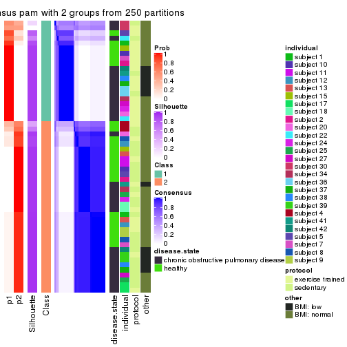</p>

</div>
<div id='tab-ATC-pam-consensus-heatmap-2'>
<pre><code class="r">consensus_heatmap(res, k = 3)
</code></pre>

<p>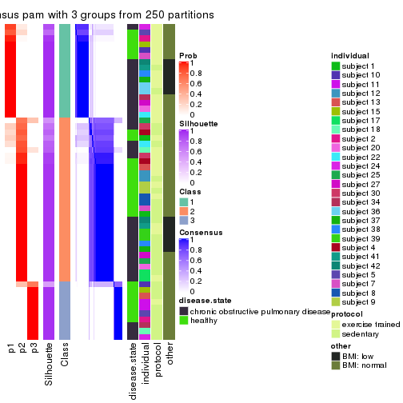</p>

</div>
<div id='tab-ATC-pam-consensus-heatmap-3'>
<pre><code class="r">consensus_heatmap(res, k = 4)
</code></pre>

<p>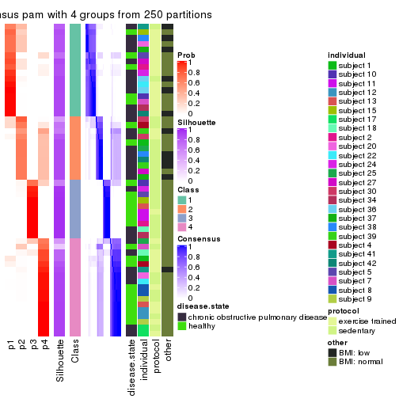</p>

</div>
<div id='tab-ATC-pam-consensus-heatmap-4'>
<pre><code class="r">consensus_heatmap(res, k = 5)
</code></pre>

<p>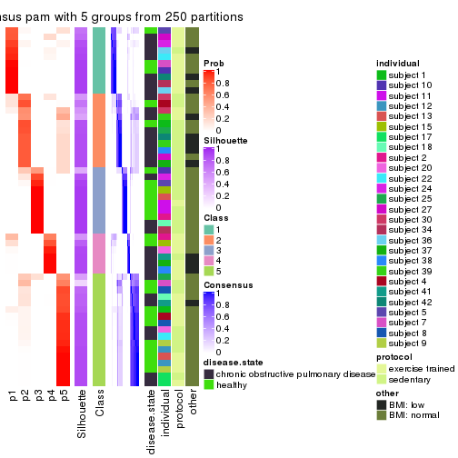</p>

</div>
<div id='tab-ATC-pam-consensus-heatmap-5'>
<pre><code class="r">consensus_heatmap(res, k = 6)
</code></pre>

<p>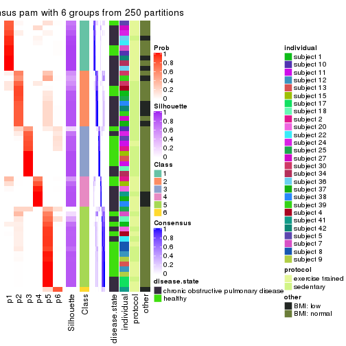</p>

</div>
</div>

Heatmaps for the membership of samples in all partitions to see how consistent they are:


<script>
$( function() {
	$( '#tabs-ATC-pam-membership-heatmap' ).tabs();
} );
</script>
<div id='tabs-ATC-pam-membership-heatmap'>
<ul>
<li><a href='#tab-ATC-pam-membership-heatmap-1'>k = 2</a></li>
<li><a href='#tab-ATC-pam-membership-heatmap-2'>k = 3</a></li>
<li><a href='#tab-ATC-pam-membership-heatmap-3'>k = 4</a></li>
<li><a href='#tab-ATC-pam-membership-heatmap-4'>k = 5</a></li>
<li><a href='#tab-ATC-pam-membership-heatmap-5'>k = 6</a></li>
</ul>
<div id='tab-ATC-pam-membership-heatmap-1'>
<pre><code class="r">membership_heatmap(res, k = 2)
</code></pre>

<p>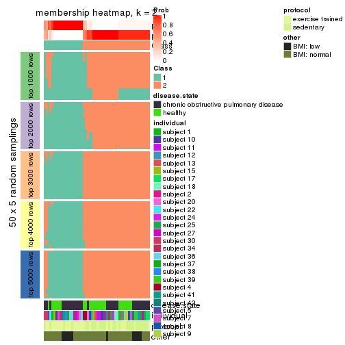</p>

</div>
<div id='tab-ATC-pam-membership-heatmap-2'>
<pre><code class="r">membership_heatmap(res, k = 3)
</code></pre>

<p>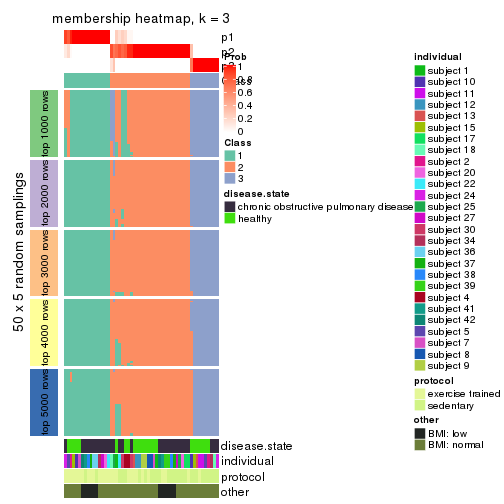</p>

</div>
<div id='tab-ATC-pam-membership-heatmap-3'>
<pre><code class="r">membership_heatmap(res, k = 4)
</code></pre>

<p>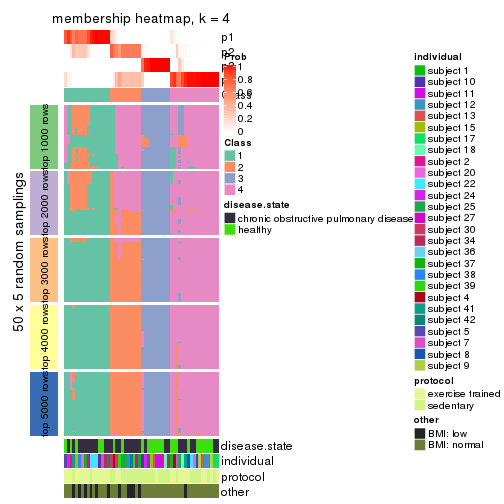</p>

</div>
<div id='tab-ATC-pam-membership-heatmap-4'>
<pre><code class="r">membership_heatmap(res, k = 5)
</code></pre>

<p>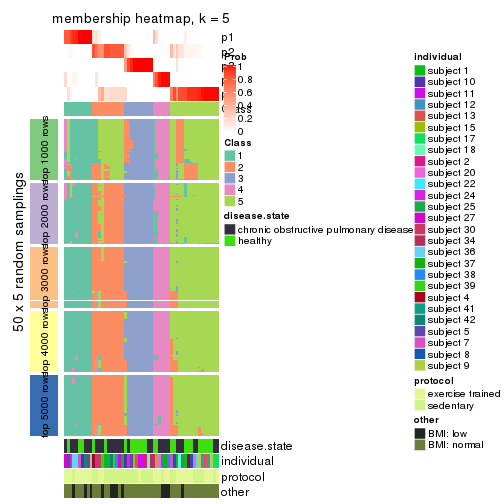</p>

</div>
<div id='tab-ATC-pam-membership-heatmap-5'>
<pre><code class="r">membership_heatmap(res, k = 6)
</code></pre>

<p>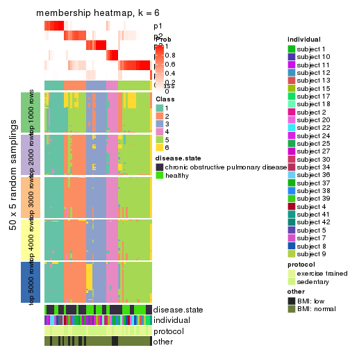</p>

</div>
</div>

As soon as we have had the classes for columns, we can look for signatures
which are significantly different between classes which can be candidate marks
for certain classes. Following are the heatmaps for signatures.


Signature heatmaps where rows are scaled:


<script>
$( function() {
	$( '#tabs-ATC-pam-get-signatures' ).tabs();
} );
</script>
<div id='tabs-ATC-pam-get-signatures'>
<ul>
<li><a href='#tab-ATC-pam-get-signatures-1'>k = 2</a></li>
<li><a href='#tab-ATC-pam-get-signatures-2'>k = 3</a></li>
<li><a href='#tab-ATC-pam-get-signatures-3'>k = 4</a></li>
<li><a href='#tab-ATC-pam-get-signatures-4'>k = 5</a></li>
<li><a href='#tab-ATC-pam-get-signatures-5'>k = 6</a></li>
</ul>
<div id='tab-ATC-pam-get-signatures-1'>
<pre><code class="r">get_signatures(res, k = 2)
</code></pre>

<p>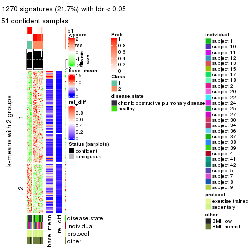</p>

</div>
<div id='tab-ATC-pam-get-signatures-2'>
<pre><code class="r">get_signatures(res, k = 3)
</code></pre>

<pre><code>#&gt; Error in mat[ceiling(1:nr/h_ratio), ceiling(1:nc/w_ratio), drop = FALSE]: subscript out of bounds
</code></pre>

<p>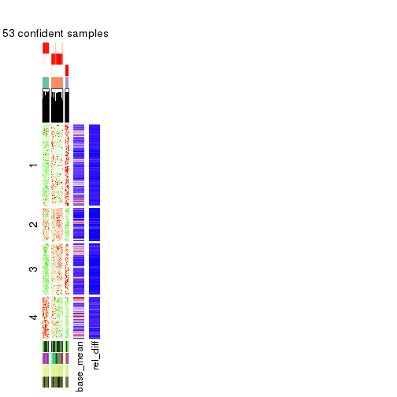</p>

</div>
<div id='tab-ATC-pam-get-signatures-3'>
<pre><code class="r">get_signatures(res, k = 4)
</code></pre>

<pre><code>#&gt; Error in mat[ceiling(1:nr/h_ratio), ceiling(1:nc/w_ratio), drop = FALSE]: subscript out of bounds
</code></pre>

<p>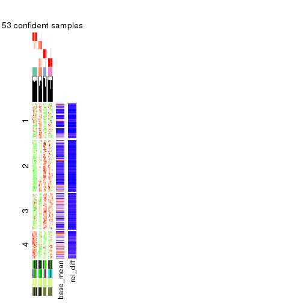</p>

</div>
<div id='tab-ATC-pam-get-signatures-4'>
<pre><code class="r">get_signatures(res, k = 5)
</code></pre>

<p>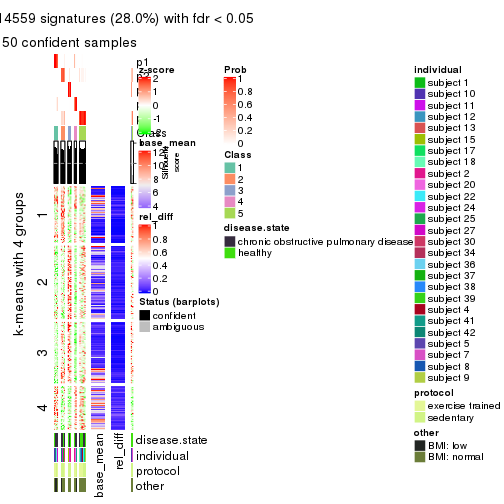</p>

</div>
<div id='tab-ATC-pam-get-signatures-5'>
<pre><code class="r">get_signatures(res, k = 6)
</code></pre>

<p>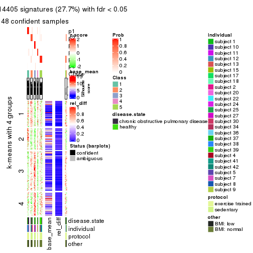</p>

</div>
</div>


Signature heatmaps where rows are not scaled:


<script>
$( function() {
	$( '#tabs-ATC-pam-get-signatures-no-scale' ).tabs();
} );
</script>
<div id='tabs-ATC-pam-get-signatures-no-scale'>
<ul>
<li><a href='#tab-ATC-pam-get-signatures-no-scale-1'>k = 2</a></li>
<li><a href='#tab-ATC-pam-get-signatures-no-scale-2'>k = 3</a></li>
<li><a href='#tab-ATC-pam-get-signatures-no-scale-3'>k = 4</a></li>
<li><a href='#tab-ATC-pam-get-signatures-no-scale-4'>k = 5</a></li>
<li><a href='#tab-ATC-pam-get-signatures-no-scale-5'>k = 6</a></li>
</ul>
<div id='tab-ATC-pam-get-signatures-no-scale-1'>
<pre><code class="r">get_signatures(res, k = 2, scale_rows = FALSE)
</code></pre>

<p>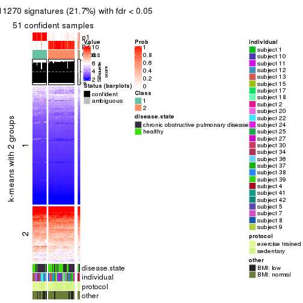</p>

</div>
<div id='tab-ATC-pam-get-signatures-no-scale-2'>
<pre><code class="r">get_signatures(res, k = 3, scale_rows = FALSE)
</code></pre>

<p>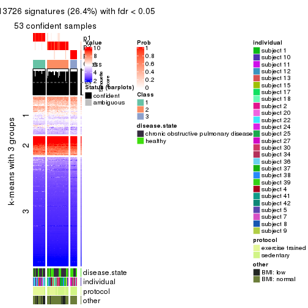</p>

</div>
<div id='tab-ATC-pam-get-signatures-no-scale-3'>
<pre><code class="r">get_signatures(res, k = 4, scale_rows = FALSE)
</code></pre>

<p>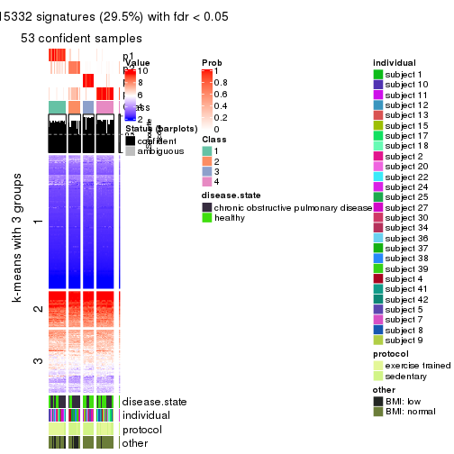</p>

</div>
<div id='tab-ATC-pam-get-signatures-no-scale-4'>
<pre><code class="r">get_signatures(res, k = 5, scale_rows = FALSE)
</code></pre>

<p>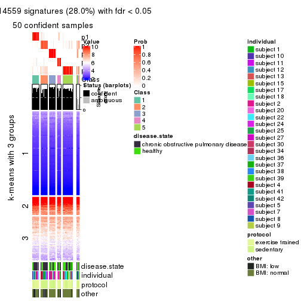</p>

</div>
<div id='tab-ATC-pam-get-signatures-no-scale-5'>
<pre><code class="r">get_signatures(res, k = 6, scale_rows = FALSE)
</code></pre>

<p>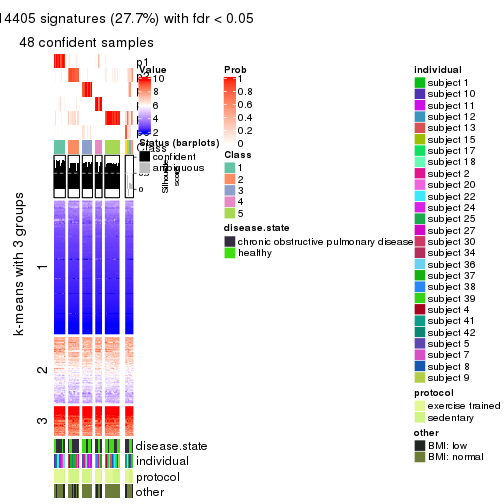</p>

</div>
</div>


Compare the overlap of signatures from different k:

```r
compare_signatures(res)
```

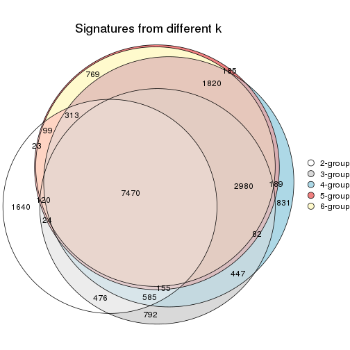

`get_signature()` returns a data frame invisibly. TO get the list of signatures, the function
call should be assigned to a variable explicitly. In following code, if `plot` argument is set
to `FALSE`, no heatmap is plotted while only the differential analysis is performed.

```r
# code only for demonstration
tb = get_signature(res, k = ..., plot = FALSE)
```

An example of the output of `tb` is:

```
#>   which_row         fdr    mean_1    mean_2 scaled_mean_1 scaled_mean_2 km
#> 1        38 0.042760348  8.373488  9.131774    -0.5533452     0.5164555  1
#> 2        40 0.018707592  7.106213  8.469186    -0.6173731     0.5762149  1
#> 3        55 0.019134737 10.221463 11.207825    -0.6159697     0.5749050  1
#> 4        59 0.006059896  5.921854  7.869574    -0.6899429     0.6439467  1
#> 5        60 0.018055526  8.928898 10.211722    -0.6204761     0.5791110  1
#> 6        98 0.009384629 15.714769 14.887706     0.6635654    -0.6193277  2
...
```

The columns in `tb` are:

1. `which_row`: row indices corresponding to the input matrix.
2. `fdr`: FDR for the differential test. 
3. `mean_x`: The mean value in group x.
4. `scaled_mean_x`: The mean value in group x after rows are scaled.
5. `km`: Row groups if k-means clustering is applied to rows.


UMAP plot which shows how samples are separated.


<script>
$( function() {
	$( '#tabs-ATC-pam-dimension-reduction' ).tabs();
} );
</script>
<div id='tabs-ATC-pam-dimension-reduction'>
<ul>
<li><a href='#tab-ATC-pam-dimension-reduction-1'>k = 2</a></li>
<li><a href='#tab-ATC-pam-dimension-reduction-2'>k = 3</a></li>
<li><a href='#tab-ATC-pam-dimension-reduction-3'>k = 4</a></li>
<li><a href='#tab-ATC-pam-dimension-reduction-4'>k = 5</a></li>
<li><a href='#tab-ATC-pam-dimension-reduction-5'>k = 6</a></li>
</ul>
<div id='tab-ATC-pam-dimension-reduction-1'>
<pre><code class="r">dimension_reduction(res, k = 2, method = &quot;UMAP&quot;)
</code></pre>

<p>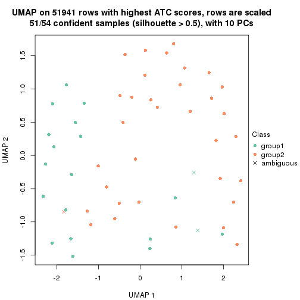</p>

</div>
<div id='tab-ATC-pam-dimension-reduction-2'>
<pre><code class="r">dimension_reduction(res, k = 3, method = &quot;UMAP&quot;)
</code></pre>

<p>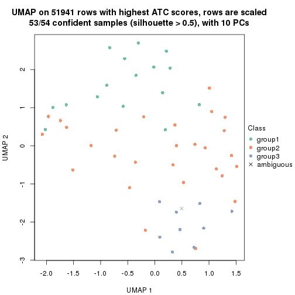</p>

</div>
<div id='tab-ATC-pam-dimension-reduction-3'>
<pre><code class="r">dimension_reduction(res, k = 4, method = &quot;UMAP&quot;)
</code></pre>

<p>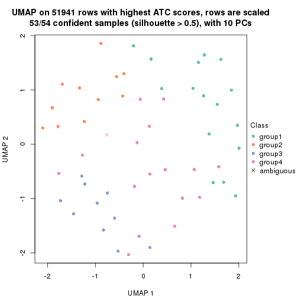</p>

</div>
<div id='tab-ATC-pam-dimension-reduction-4'>
<pre><code class="r">dimension_reduction(res, k = 5, method = &quot;UMAP&quot;)
</code></pre>

<p>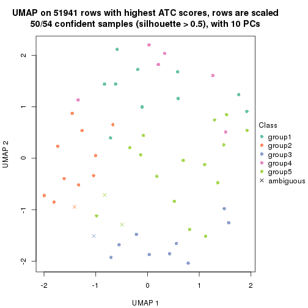</p>

</div>
<div id='tab-ATC-pam-dimension-reduction-5'>
<pre><code class="r">dimension_reduction(res, k = 6, method = &quot;UMAP&quot;)
</code></pre>

<p></p>

</div>
</div>


Following heatmap shows how subgroups are split when increasing `k`:

```r
collect_classes(res)
```

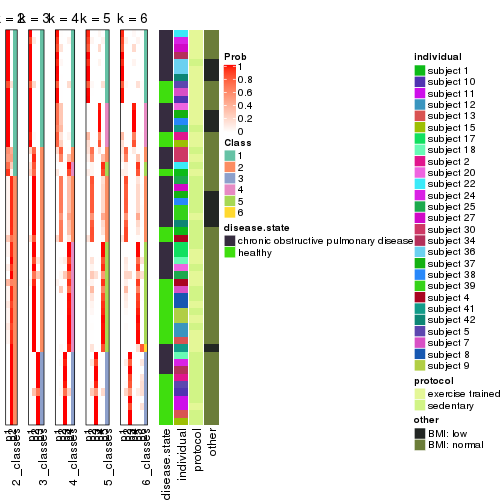


Test correlation between subgroups and known annotations. If the known
annotation is numeric, one-way ANOVA test is applied, and if the known
annotation is discrete, chi-squared contingency table test is applied.

```r
test_to_known_factors(res)
```

```
#>          n disease.state(p) individual(p) protocol(p) other(p) k
#> ATC:pam 51           0.3408         0.728    0.000877   0.3823 2
#> ATC:pam 53           0.2290         0.383    0.000552   0.0966 3
#> ATC:pam 53           0.0511         0.247    0.000113   0.0137 4
#> ATC:pam 50           0.1443         0.239    0.000251   0.0478 5
#> ATC:pam 48           0.0744         0.165    0.000325   0.0204 6
```


If matrix rows can be associated to genes, consider to use `functional_enrichment(res,
...)` to perform function enrichment for the signature genes. See [this vignette](http://bioconductor.org/packages/devel/bioc/vignettes/cola/inst/doc/functional_enrichment.html) for more detailed explanations.


 

---------------------------------------------------


### ATC:mclust**


The object with results only for a single top-value method and a single partition method 
can be extracted as:

```r
res = res_list["ATC", "mclust"]
# you can also extract it by
# res = res_list["ATC:mclust"]
```

A summary of `res` and all the functions that can be applied to it:

```r
res
```

```
#> A 'ConsensusPartition' object with k = 2, 3, 4, 5, 6.
#>   On a matrix with 51941 rows and 54 columns.
#>   Top rows (1000, 2000, 3000, 4000, 5000) are extracted by 'ATC' method.
#>   Subgroups are detected by 'mclust' method.
#>   Performed in total 1250 partitions by row resampling.
#>   Best k for subgroups seems to be 3.
#> 
#> Following methods can be applied to this 'ConsensusPartition' object:
#>  [1] "cola_report"             "collect_classes"         "collect_plots"          
#>  [4] "collect_stats"           "colnames"                "compare_signatures"     
#>  [7] "consensus_heatmap"       "dimension_reduction"     "functional_enrichment"  
#> [10] "get_anno_col"            "get_anno"                "get_classes"            
#> [13] "get_consensus"           "get_matrix"              "get_membership"         
#> [16] "get_param"               "get_signatures"          "get_stats"              
#> [19] "is_best_k"               "is_stable_k"             "membership_heatmap"     
#> [22] "ncol"                    "nrow"                    "plot_ecdf"              
#> [25] "rownames"                "select_partition_number" "show"                   
#> [28] "suggest_best_k"          "test_to_known_factors"
```

`collect_plots()` function collects all the plots made from `res` for all `k` (number of partitions)
into one single page to provide an easy and fast comparison between different `k`.

```r
collect_plots(res)
```

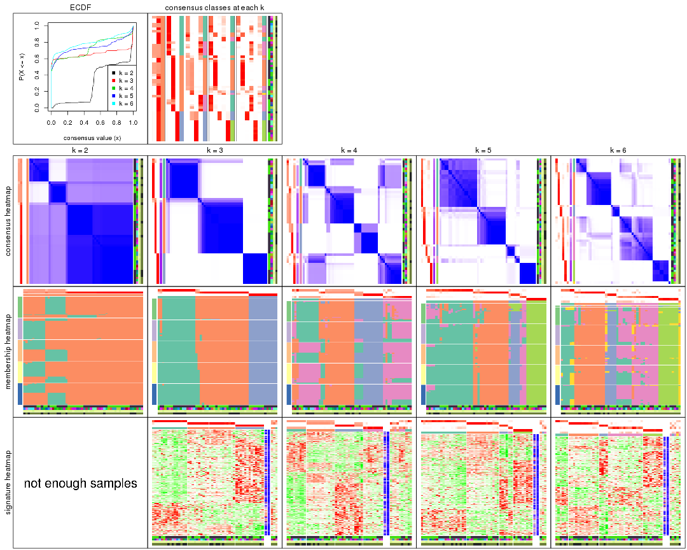

The plots are:

- The first row: a plot of the ECDF (empirical cumulative distribution
  function) curves of the consensus matrix for each `k` and the heatmap of
  predicted classes for each `k`.
- The second row: heatmaps of the consensus matrix for each `k`.
- The third row: heatmaps of the membership matrix for each `k`.
- The fouth row: heatmaps of the signatures for each `k`.

All the plots in panels can be made by individual functions and they are
plotted later in this section.

`select_partition_number()` produces several plots showing different
statistics for choosing "optimized" `k`. There are following statistics:

- ECDF curves of the consensus matrix for each `k`;
- 1-PAC. [The PAC
  score](https://en.wikipedia.org/wiki/Consensus_clustering#Over-interpretation_potential_of_consensus_clustering)
  measures the proportion of the ambiguous subgrouping.
- Mean silhouette score.
- Concordance. The mean probability of fiting the consensus class ids in all
  partitions.
- Area increased. Denote $A_k$ as the area under the ECDF curve for current
  `k`, the area increased is defined as $A_k - A_{k-1}$.
- Rand index. The percent of pairs of samples that are both in a same cluster
  or both are not in a same cluster in the partition of k and k-1.
- Jaccard index. The ratio of pairs of samples are both in a same cluster in
  the partition of k and k-1 and the pairs of samples are both in a same
  cluster in the partition k or k-1.

The detailed explanations of these statistics can be found in [the _cola_
vignette](http://bioconductor.org/packages/devel/bioc/vignettes/cola/inst/doc/cola.html#toc_13).

Generally speaking, lower PAC score, higher mean silhouette score or higher
concordance corresponds to better partition. Rand index and Jaccard index
measure how similar the current partition is compared to partition with `k-1`.
If they are too similar, we won't accept `k` is better than `k-1`.

```r
select_partition_number(res)
```

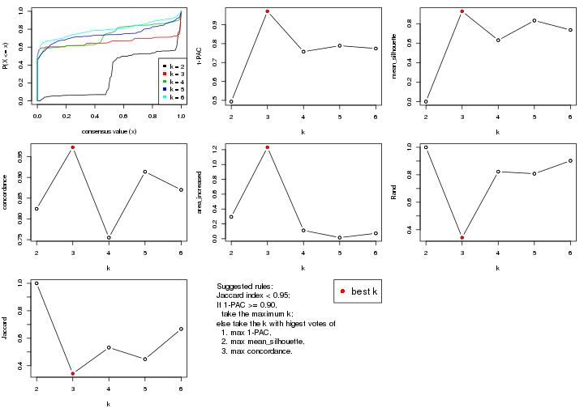

The numeric values for all these statistics can be obtained by `get_stats()`.

```r
get_stats(res)
```

```
#>   k 1-PAC mean_silhouette concordance area_increased  Rand Jaccard
#> 2 2 0.493           0.000       0.824         0.2947 1.000   1.000
#> 3 3 0.971           0.927       0.973         1.2322 0.342   0.342
#> 4 4 0.758           0.630       0.755         0.1113 0.823   0.532
#> 5 5 0.789           0.832       0.914         0.0146 0.808   0.448
#> 6 6 0.774           0.735       0.870         0.0727 0.902   0.667
```

`suggest_best_k()` suggests the best $k$ based on these statistics. The rules are as follows:

- All $k$ with Jaccard index larger than 0.95 are removed because increasing
  $k$ does not provide enough extra information. If all $k$ are removed, it is
  marked as no subgroup is detected.
- For all $k$ with 1-PAC score larger than 0.9, the maximal $k$ is taken as
  the best $k$, and other $k$ are marked as optional $k$.
- If it does not fit the second rule. The $k$ with the maximal vote of the
  highest 1-PAC score, highest mean silhouette, and highest concordance is
  taken as the best $k$.

```r
suggest_best_k(res)
```

```
#> [1] 3
```


Following shows the table of the partitions (You need to click the **show/hide
code output** link to see it). The membership matrix (columns with name `p*`)
is inferred by
[`clue::cl_consensus()`](https://www.rdocumentation.org/link/cl_consensus?package=clue)
function with the `SE` method. Basically the value in the membership matrix
represents the probability to belong to a certain group. The finall class
label for an item is determined with the group with highest probability it
belongs to.

In `get_classes()` function, the entropy is calculated from the membership
matrix and the silhouette score is calculated from the consensus matrix.


<script>
$( function() {
	$( '#tabs-ATC-mclust-get-classes' ).tabs();
} );
</script>
<div id='tabs-ATC-mclust-get-classes'>
<ul>
<li><a href='#tab-ATC-mclust-get-classes-1'>k = 2</a></li>
<li><a href='#tab-ATC-mclust-get-classes-2'>k = 3</a></li>
<li><a href='#tab-ATC-mclust-get-classes-3'>k = 4</a></li>
<li><a href='#tab-ATC-mclust-get-classes-4'>k = 5</a></li>
<li><a href='#tab-ATC-mclust-get-classes-5'>k = 6</a></li>
</ul>

<div id='tab-ATC-mclust-get-classes-1'>
<p><a id='tab-ATC-mclust-get-classes-1-a' style='color:#0366d6' href='#'>show/hide code output</a></p>
<pre><code class="r">cbind(get_classes(res, k = 2), get_membership(res, k = 2))
</code></pre>

<pre><code>#&gt;           class entropy silhouette    p1    p2
#&gt; GSM680053     2  0.0000          0 0.000 1.000
#&gt; GSM680062     2  0.0376          0 0.004 0.996
#&gt; GSM680054     2  0.1843          0 0.028 0.972
#&gt; GSM680063     2  0.1843          0 0.028 0.972
#&gt; GSM680055     2  0.0000          0 0.000 1.000
#&gt; GSM680064     2  0.9833          0 0.424 0.576
#&gt; GSM680056     2  0.9988          0 0.480 0.520
#&gt; GSM680065     2  0.9983          0 0.476 0.524
#&gt; GSM680057     2  0.1843          0 0.028 0.972
#&gt; GSM680066     2  0.0672          0 0.008 0.992
#&gt; GSM680058     2  0.9983          0 0.476 0.524
#&gt; GSM680067     2  0.1843          0 0.028 0.972
#&gt; GSM680059     2  0.9983          0 0.476 0.524
#&gt; GSM680068     2  0.0672          0 0.008 0.992
#&gt; GSM680060     2  0.0000          0 0.000 1.000
#&gt; GSM680069     2  0.0672          0 0.008 0.992
#&gt; GSM680061     2  0.1843          0 0.028 0.972
#&gt; GSM680070     2  0.9998          0 0.492 0.508
#&gt; GSM680071     2  0.0376          0 0.004 0.996
#&gt; GSM680077     2  0.9988          0 0.480 0.520
#&gt; GSM680072     2  0.9983          0 0.476 0.524
#&gt; GSM680078     2  0.0000          0 0.000 1.000
#&gt; GSM680073     2  0.9944          0 0.456 0.544
#&gt; GSM680079     2  0.9933          0 0.452 0.548
#&gt; GSM680074     2  0.9983          0 0.476 0.524
#&gt; GSM680080     2  0.6712          0 0.176 0.824
#&gt; GSM680075     2  0.0000          0 0.000 1.000
#&gt; GSM680081     2  0.1843          0 0.028 0.972
#&gt; GSM680076     2  0.0000          0 0.000 1.000
#&gt; GSM680082     2  1.0000          0 0.496 0.504
#&gt; GSM680029     2  0.9983          0 0.476 0.524
#&gt; GSM680041     2  1.0000          0 0.496 0.504
#&gt; GSM680035     2  0.1843          0 0.028 0.972
#&gt; GSM680047     2  0.0000          0 0.000 1.000
#&gt; GSM680036     2  0.9983          0 0.476 0.524
#&gt; GSM680048     2  0.0000          0 0.000 1.000
#&gt; GSM680037     2  0.1843          0 0.028 0.972
#&gt; GSM680049     2  0.0000          0 0.000 1.000
#&gt; GSM680038     2  0.9983          0 0.476 0.524
#&gt; GSM680050     2  1.0000          0 0.496 0.504
#&gt; GSM680039     2  0.9248          0 0.340 0.660
#&gt; GSM680051     2  0.0000          0 0.000 1.000
#&gt; GSM680040     2  0.0000          0 0.000 1.000
#&gt; GSM680052     2  0.0000          0 0.000 1.000
#&gt; GSM680030     2  0.1843          0 0.028 0.972
#&gt; GSM680042     2  1.0000          0 0.496 0.504
#&gt; GSM680031     2  0.1843          0 0.028 0.972
#&gt; GSM680043     2  0.1843          0 0.028 0.972
#&gt; GSM680032     2  0.0000          0 0.000 1.000
#&gt; GSM680044     2  0.0000          0 0.000 1.000
#&gt; GSM680033     2  0.1843          0 0.028 0.972
#&gt; GSM680045     2  0.0000          0 0.000 1.000
#&gt; GSM680034     2  0.1843          0 0.028 0.972
#&gt; GSM680046     2  0.0000          0 0.000 1.000
</code></pre>

<script>
$('#tab-ATC-mclust-get-classes-1-a').parent().next().next().hide();
$('#tab-ATC-mclust-get-classes-1-a').click(function(){
  $('#tab-ATC-mclust-get-classes-1-a').parent().next().next().toggle();
  return(false);
});
</script>
</div>

<div id='tab-ATC-mclust-get-classes-2'>
<p><a id='tab-ATC-mclust-get-classes-2-a' style='color:#0366d6' href='#'>show/hide code output</a></p>
<pre><code class="r">cbind(get_classes(res, k = 3), get_membership(res, k = 3))
</code></pre>

<pre><code>#&gt;           class entropy silhouette    p1    p2    p3
#&gt; GSM680053     2  0.0237      0.955 0.000 0.996 0.004
#&gt; GSM680062     2  0.0000      0.957 0.000 1.000 0.000
#&gt; GSM680054     3  0.0000      1.000 0.000 0.000 1.000
#&gt; GSM680063     3  0.0000      1.000 0.000 0.000 1.000
#&gt; GSM680055     2  0.0000      0.957 0.000 1.000 0.000
#&gt; GSM680064     1  0.0000      0.960 1.000 0.000 0.000
#&gt; GSM680056     2  0.0237      0.955 0.004 0.996 0.000
#&gt; GSM680065     1  0.0000      0.960 1.000 0.000 0.000
#&gt; GSM680057     3  0.0000      1.000 0.000 0.000 1.000
#&gt; GSM680066     1  0.5810      0.476 0.664 0.336 0.000
#&gt; GSM680058     2  0.0000      0.957 0.000 1.000 0.000
#&gt; GSM680067     3  0.0000      1.000 0.000 0.000 1.000
#&gt; GSM680059     2  0.0000      0.957 0.000 1.000 0.000
#&gt; GSM680068     1  0.0000      0.960 1.000 0.000 0.000
#&gt; GSM680060     1  0.0892      0.942 0.980 0.020 0.000
#&gt; GSM680069     2  0.1031      0.939 0.024 0.976 0.000
#&gt; GSM680061     3  0.0000      1.000 0.000 0.000 1.000
#&gt; GSM680070     1  0.0000      0.960 1.000 0.000 0.000
#&gt; GSM680071     1  0.0000      0.960 1.000 0.000 0.000
#&gt; GSM680077     1  0.0000      0.960 1.000 0.000 0.000
#&gt; GSM680072     2  0.0000      0.957 0.000 1.000 0.000
#&gt; GSM680078     1  0.0000      0.960 1.000 0.000 0.000
#&gt; GSM680073     2  0.0000      0.957 0.000 1.000 0.000
#&gt; GSM680079     1  0.0000      0.960 1.000 0.000 0.000
#&gt; GSM680074     2  0.0000      0.957 0.000 1.000 0.000
#&gt; GSM680080     2  0.0000      0.957 0.000 1.000 0.000
#&gt; GSM680075     1  0.0000      0.960 1.000 0.000 0.000
#&gt; GSM680081     3  0.0000      1.000 0.000 0.000 1.000
#&gt; GSM680076     2  0.0000      0.957 0.000 1.000 0.000
#&gt; GSM680082     1  0.0000      0.960 1.000 0.000 0.000
#&gt; GSM680029     2  0.0000      0.957 0.000 1.000 0.000
#&gt; GSM680041     1  0.4504      0.740 0.804 0.196 0.000
#&gt; GSM680035     3  0.0000      1.000 0.000 0.000 1.000
#&gt; GSM680047     1  0.0000      0.960 1.000 0.000 0.000
#&gt; GSM680036     2  0.2066      0.903 0.060 0.940 0.000
#&gt; GSM680048     2  0.5785      0.481 0.332 0.668 0.000
#&gt; GSM680037     3  0.0000      1.000 0.000 0.000 1.000
#&gt; GSM680049     2  0.6307      0.010 0.488 0.512 0.000
#&gt; GSM680038     2  0.0000      0.957 0.000 1.000 0.000
#&gt; GSM680050     1  0.0000      0.960 1.000 0.000 0.000
#&gt; GSM680039     2  0.0000      0.957 0.000 1.000 0.000
#&gt; GSM680051     2  0.0237      0.955 0.004 0.996 0.000
#&gt; GSM680040     2  0.0237      0.955 0.000 0.996 0.004
#&gt; GSM680052     2  0.0237      0.955 0.000 0.996 0.004
#&gt; GSM680030     3  0.0000      1.000 0.000 0.000 1.000
#&gt; GSM680042     1  0.0000      0.960 1.000 0.000 0.000
#&gt; GSM680031     3  0.0000      1.000 0.000 0.000 1.000
#&gt; GSM680043     3  0.0000      1.000 0.000 0.000 1.000
#&gt; GSM680032     2  0.0237      0.955 0.004 0.996 0.000
#&gt; GSM680044     2  0.0000      0.957 0.000 1.000 0.000
#&gt; GSM680033     3  0.0000      1.000 0.000 0.000 1.000
#&gt; GSM680045     2  0.0237      0.955 0.000 0.996 0.004
#&gt; GSM680034     3  0.0000      1.000 0.000 0.000 1.000
#&gt; GSM680046     1  0.0000      0.960 1.000 0.000 0.000
</code></pre>

<script>
$('#tab-ATC-mclust-get-classes-2-a').parent().next().next().hide();
$('#tab-ATC-mclust-get-classes-2-a').click(function(){
  $('#tab-ATC-mclust-get-classes-2-a').parent().next().next().toggle();
  return(false);
});
</script>
</div>

<div id='tab-ATC-mclust-get-classes-3'>
<p><a id='tab-ATC-mclust-get-classes-3-a' style='color:#0366d6' href='#'>show/hide code output</a></p>
<pre><code class="r">cbind(get_classes(res, k = 4), get_membership(res, k = 4))
</code></pre>

<pre><code>#&gt;           class entropy silhouette    p1    p2    p3    p4
#&gt; GSM680053     2  0.6946     0.8299 0.396 0.524 0.040 0.040
#&gt; GSM680062     2  0.5643     0.8663 0.428 0.548 0.000 0.024
#&gt; GSM680054     3  0.0000     0.8782 0.000 0.000 1.000 0.000
#&gt; GSM680063     3  0.0000     0.8782 0.000 0.000 1.000 0.000
#&gt; GSM680055     2  0.6330     0.8407 0.448 0.492 0.000 0.060
#&gt; GSM680064     1  0.4967     0.5741 0.548 0.000 0.000 0.452
#&gt; GSM680056     4  0.0000     0.7396 0.000 0.000 0.000 1.000
#&gt; GSM680065     1  0.4972     0.5657 0.544 0.000 0.000 0.456
#&gt; GSM680057     3  0.0000     0.8782 0.000 0.000 1.000 0.000
#&gt; GSM680066     4  0.0188     0.7368 0.004 0.000 0.000 0.996
#&gt; GSM680058     2  0.5378     0.8767 0.448 0.540 0.000 0.012
#&gt; GSM680067     3  0.0000     0.8782 0.000 0.000 1.000 0.000
#&gt; GSM680059     2  0.5132     0.8776 0.448 0.548 0.000 0.004
#&gt; GSM680068     1  0.4967     0.5741 0.548 0.000 0.000 0.452
#&gt; GSM680060     1  0.4485    -0.0791 0.772 0.028 0.000 0.200
#&gt; GSM680069     4  0.0000     0.7396 0.000 0.000 0.000 1.000
#&gt; GSM680061     3  0.0000     0.8782 0.000 0.000 1.000 0.000
#&gt; GSM680070     4  0.3801     0.3966 0.220 0.000 0.000 0.780
#&gt; GSM680071     1  0.4967     0.5741 0.548 0.000 0.000 0.452
#&gt; GSM680077     1  0.4967     0.5741 0.548 0.000 0.000 0.452
#&gt; GSM680072     2  0.5132     0.8776 0.448 0.548 0.000 0.004
#&gt; GSM680078     1  0.4967     0.5741 0.548 0.000 0.000 0.452
#&gt; GSM680073     2  0.5483     0.8752 0.448 0.536 0.000 0.016
#&gt; GSM680079     1  0.4967     0.5741 0.548 0.000 0.000 0.452
#&gt; GSM680074     2  0.5132     0.8776 0.448 0.548 0.000 0.004
#&gt; GSM680080     2  0.5132     0.8776 0.448 0.548 0.000 0.004
#&gt; GSM680075     1  0.0592     0.1276 0.984 0.000 0.000 0.016
#&gt; GSM680081     3  0.4967     0.6983 0.000 0.452 0.548 0.000
#&gt; GSM680076     2  0.5378     0.8767 0.448 0.540 0.000 0.012
#&gt; GSM680082     4  0.4977    -0.4181 0.460 0.000 0.000 0.540
#&gt; GSM680029     2  0.5483     0.8752 0.448 0.536 0.000 0.016
#&gt; GSM680041     4  0.0000     0.7396 0.000 0.000 0.000 1.000
#&gt; GSM680035     3  0.4967     0.6983 0.000 0.452 0.548 0.000
#&gt; GSM680047     1  0.4961     0.5716 0.552 0.000 0.000 0.448
#&gt; GSM680036     1  0.7117    -0.4125 0.448 0.128 0.000 0.424
#&gt; GSM680048     4  0.0707     0.7299 0.000 0.020 0.000 0.980
#&gt; GSM680037     3  0.4967     0.6983 0.000 0.452 0.548 0.000
#&gt; GSM680049     4  0.0000     0.7396 0.000 0.000 0.000 1.000
#&gt; GSM680038     2  0.5132     0.8776 0.448 0.548 0.000 0.004
#&gt; GSM680050     4  0.0188     0.7368 0.004 0.000 0.000 0.996
#&gt; GSM680039     2  0.5132     0.8776 0.448 0.548 0.000 0.004
#&gt; GSM680051     4  0.3074     0.5774 0.000 0.152 0.000 0.848
#&gt; GSM680040     2  0.2124     0.4235 0.000 0.932 0.040 0.028
#&gt; GSM680052     4  0.5317     0.1443 0.004 0.460 0.004 0.532
#&gt; GSM680030     3  0.0000     0.8782 0.000 0.000 1.000 0.000
#&gt; GSM680042     4  0.4697    -0.0610 0.356 0.000 0.000 0.644
#&gt; GSM680031     3  0.0000     0.8782 0.000 0.000 1.000 0.000
#&gt; GSM680043     3  0.4967     0.6983 0.000 0.452 0.548 0.000
#&gt; GSM680032     4  0.1452     0.7105 0.008 0.036 0.000 0.956
#&gt; GSM680044     2  0.6077    -0.0740 0.044 0.496 0.000 0.460
#&gt; GSM680033     3  0.0000     0.8782 0.000 0.000 1.000 0.000
#&gt; GSM680045     2  0.3634     0.3765 0.000 0.856 0.048 0.096
#&gt; GSM680034     3  0.0000     0.8782 0.000 0.000 1.000 0.000
#&gt; GSM680046     1  0.4961     0.5716 0.552 0.000 0.000 0.448
</code></pre>

<script>
$('#tab-ATC-mclust-get-classes-3-a').parent().next().next().hide();
$('#tab-ATC-mclust-get-classes-3-a').click(function(){
  $('#tab-ATC-mclust-get-classes-3-a').parent().next().next().toggle();
  return(false);
});
</script>
</div>

<div id='tab-ATC-mclust-get-classes-4'>
<p><a id='tab-ATC-mclust-get-classes-4-a' style='color:#0366d6' href='#'>show/hide code output</a></p>
<pre><code class="r">cbind(get_classes(res, k = 5), get_membership(res, k = 5))
</code></pre>

<pre><code>#&gt;           class entropy silhouette    p1    p2    p3    p4    p5
#&gt; GSM680053     2  0.5537     0.6027 0.200 0.692 0.000 0.048 0.060
#&gt; GSM680062     2  0.4898     0.3347 0.376 0.592 0.000 0.032 0.000
#&gt; GSM680054     5  0.0000     0.9994 0.000 0.000 0.000 0.000 1.000
#&gt; GSM680063     5  0.0000     0.9994 0.000 0.000 0.000 0.000 1.000
#&gt; GSM680055     2  0.2389     0.8136 0.116 0.880 0.000 0.004 0.000
#&gt; GSM680064     1  0.4400     0.7371 0.736 0.000 0.052 0.212 0.000
#&gt; GSM680056     1  0.0404     0.8924 0.988 0.012 0.000 0.000 0.000
#&gt; GSM680065     1  0.1121     0.8886 0.956 0.000 0.000 0.044 0.000
#&gt; GSM680057     5  0.0000     0.9994 0.000 0.000 0.000 0.000 1.000
#&gt; GSM680066     1  0.0162     0.8920 0.996 0.000 0.004 0.000 0.000
#&gt; GSM680058     2  0.0000     0.8964 0.000 1.000 0.000 0.000 0.000
#&gt; GSM680067     5  0.0162     0.9954 0.000 0.000 0.004 0.000 0.996
#&gt; GSM680059     2  0.0000     0.8964 0.000 1.000 0.000 0.000 0.000
#&gt; GSM680068     1  0.4065     0.7136 0.720 0.000 0.016 0.264 0.000
#&gt; GSM680060     2  0.4186     0.7555 0.128 0.796 0.012 0.064 0.000
#&gt; GSM680069     1  0.0510     0.8884 0.984 0.000 0.000 0.016 0.000
#&gt; GSM680061     5  0.0000     0.9994 0.000 0.000 0.000 0.000 1.000
#&gt; GSM680070     1  0.0693     0.8923 0.980 0.000 0.008 0.012 0.000
#&gt; GSM680071     1  0.2127     0.8622 0.892 0.000 0.000 0.108 0.000
#&gt; GSM680077     1  0.2286     0.8538 0.888 0.000 0.004 0.108 0.000
#&gt; GSM680072     2  0.0000     0.8964 0.000 1.000 0.000 0.000 0.000
#&gt; GSM680078     1  0.3636     0.7209 0.728 0.000 0.000 0.272 0.000
#&gt; GSM680073     2  0.0162     0.8952 0.004 0.996 0.000 0.000 0.000
#&gt; GSM680079     1  0.4400     0.7371 0.736 0.000 0.052 0.212 0.000
#&gt; GSM680074     2  0.0000     0.8964 0.000 1.000 0.000 0.000 0.000
#&gt; GSM680080     2  0.0000     0.8964 0.000 1.000 0.000 0.000 0.000
#&gt; GSM680075     2  0.3863     0.7345 0.052 0.796 0.000 0.152 0.000
#&gt; GSM680081     3  0.1544     0.8175 0.000 0.000 0.932 0.000 0.068
#&gt; GSM680076     2  0.0000     0.8964 0.000 1.000 0.000 0.000 0.000
#&gt; GSM680082     1  0.1205     0.8872 0.956 0.000 0.004 0.040 0.000
#&gt; GSM680029     2  0.0162     0.8952 0.004 0.996 0.000 0.000 0.000
#&gt; GSM680041     1  0.0162     0.8920 0.996 0.000 0.004 0.000 0.000
#&gt; GSM680035     3  0.1792     0.8291 0.000 0.000 0.916 0.000 0.084
#&gt; GSM680047     4  0.2124     0.7522 0.096 0.000 0.004 0.900 0.000
#&gt; GSM680036     2  0.1082     0.8778 0.028 0.964 0.008 0.000 0.000
#&gt; GSM680048     1  0.0955     0.8870 0.968 0.028 0.000 0.004 0.000
#&gt; GSM680037     3  0.1792     0.8291 0.000 0.000 0.916 0.000 0.084
#&gt; GSM680049     1  0.0404     0.8924 0.988 0.012 0.000 0.000 0.000
#&gt; GSM680038     2  0.0000     0.8964 0.000 1.000 0.000 0.000 0.000
#&gt; GSM680050     1  0.0162     0.8920 0.996 0.000 0.004 0.000 0.000
#&gt; GSM680039     2  0.0000     0.8964 0.000 1.000 0.000 0.000 0.000
#&gt; GSM680051     1  0.2344     0.8513 0.904 0.064 0.000 0.032 0.000
#&gt; GSM680040     4  0.4778     0.3619 0.000 0.020 0.196 0.736 0.048
#&gt; GSM680052     1  0.2735     0.8365 0.880 0.084 0.000 0.036 0.000
#&gt; GSM680030     5  0.0000     0.9994 0.000 0.000 0.000 0.000 1.000
#&gt; GSM680042     1  0.0451     0.8929 0.988 0.000 0.004 0.008 0.000
#&gt; GSM680031     5  0.0000     0.9994 0.000 0.000 0.000 0.000 1.000
#&gt; GSM680043     3  0.1792     0.8291 0.000 0.000 0.916 0.000 0.084
#&gt; GSM680032     1  0.1579     0.8752 0.944 0.024 0.000 0.032 0.000
#&gt; GSM680044     1  0.4248     0.6566 0.728 0.240 0.000 0.032 0.000
#&gt; GSM680033     5  0.0000     0.9994 0.000 0.000 0.000 0.000 1.000
#&gt; GSM680045     3  0.7855     0.0333 0.208 0.040 0.460 0.264 0.028
#&gt; GSM680034     5  0.0000     0.9994 0.000 0.000 0.000 0.000 1.000
#&gt; GSM680046     4  0.2127     0.7446 0.108 0.000 0.000 0.892 0.000
</code></pre>

<script>
$('#tab-ATC-mclust-get-classes-4-a').parent().next().next().hide();
$('#tab-ATC-mclust-get-classes-4-a').click(function(){
  $('#tab-ATC-mclust-get-classes-4-a').parent().next().next().toggle();
  return(false);
});
</script>
</div>

<div id='tab-ATC-mclust-get-classes-5'>
<p><a id='tab-ATC-mclust-get-classes-5-a' style='color:#0366d6' href='#'>show/hide code output</a></p>
<pre><code class="r">cbind(get_classes(res, k = 6), get_membership(res, k = 6))
</code></pre>

<pre><code>#&gt;           class entropy silhouette    p1    p2    p3    p4    p5    p6
#&gt; GSM680053     4  0.5336    0.18819 0.000 0.244 0.000 0.588 0.000 0.168
#&gt; GSM680062     4  0.3672    0.32089 0.000 0.368 0.000 0.632 0.000 0.000
#&gt; GSM680054     5  0.0858    0.96760 0.000 0.000 0.004 0.000 0.968 0.028
#&gt; GSM680063     5  0.0777    0.97377 0.000 0.004 0.000 0.000 0.972 0.024
#&gt; GSM680055     2  0.2838    0.74290 0.000 0.808 0.000 0.188 0.000 0.004
#&gt; GSM680064     1  0.3634    0.78452 0.696 0.000 0.000 0.008 0.000 0.296
#&gt; GSM680056     4  0.2806    0.73133 0.004 0.016 0.000 0.844 0.000 0.136
#&gt; GSM680065     4  0.4795    0.61125 0.072 0.000 0.000 0.604 0.000 0.324
#&gt; GSM680057     5  0.0547    0.97560 0.000 0.000 0.000 0.000 0.980 0.020
#&gt; GSM680066     4  0.0632    0.71930 0.000 0.000 0.000 0.976 0.000 0.024
#&gt; GSM680058     2  0.0363    0.92715 0.000 0.988 0.000 0.012 0.000 0.000
#&gt; GSM680067     5  0.1075    0.95762 0.000 0.000 0.000 0.000 0.952 0.048
#&gt; GSM680059     2  0.0000    0.93037 0.000 1.000 0.000 0.000 0.000 0.000
#&gt; GSM680068     1  0.3575    0.78599 0.708 0.000 0.000 0.008 0.000 0.284
#&gt; GSM680060     2  0.4244    0.72342 0.060 0.772 0.000 0.128 0.000 0.040
#&gt; GSM680069     4  0.0000    0.70967 0.000 0.000 0.000 1.000 0.000 0.000
#&gt; GSM680061     5  0.0146    0.97813 0.000 0.000 0.004 0.000 0.996 0.000
#&gt; GSM680070     4  0.4018    0.64882 0.020 0.000 0.000 0.656 0.000 0.324
#&gt; GSM680071     4  0.3806    0.62587 0.164 0.000 0.000 0.768 0.000 0.068
#&gt; GSM680077     4  0.6130   -0.00977 0.336 0.000 0.000 0.340 0.000 0.324
#&gt; GSM680072     2  0.0000    0.93037 0.000 1.000 0.000 0.000 0.000 0.000
#&gt; GSM680078     1  0.3874    0.76374 0.732 0.000 0.000 0.040 0.000 0.228
#&gt; GSM680073     2  0.0260    0.92866 0.000 0.992 0.000 0.008 0.000 0.000
#&gt; GSM680079     1  0.3867    0.76858 0.660 0.000 0.000 0.012 0.000 0.328
#&gt; GSM680074     2  0.0000    0.93037 0.000 1.000 0.000 0.000 0.000 0.000
#&gt; GSM680080     2  0.0000    0.93037 0.000 1.000 0.000 0.000 0.000 0.000
#&gt; GSM680075     2  0.3769    0.69075 0.188 0.768 0.000 0.008 0.000 0.036
#&gt; GSM680081     3  0.1245    0.78392 0.000 0.000 0.952 0.000 0.016 0.032
#&gt; GSM680076     2  0.0000    0.93037 0.000 1.000 0.000 0.000 0.000 0.000
#&gt; GSM680082     4  0.5057    0.57584 0.096 0.000 0.000 0.580 0.000 0.324
#&gt; GSM680029     2  0.0713    0.91825 0.000 0.972 0.000 0.028 0.000 0.000
#&gt; GSM680041     4  0.2668    0.72296 0.004 0.000 0.000 0.828 0.000 0.168
#&gt; GSM680035     3  0.0458    0.80739 0.000 0.000 0.984 0.000 0.016 0.000
#&gt; GSM680047     1  0.0146    0.55135 0.996 0.000 0.000 0.000 0.000 0.004
#&gt; GSM680036     2  0.1116    0.91037 0.004 0.960 0.000 0.028 0.000 0.008
#&gt; GSM680048     4  0.0937    0.72353 0.000 0.000 0.000 0.960 0.000 0.040
#&gt; GSM680037     3  0.0458    0.80739 0.000 0.000 0.984 0.000 0.016 0.000
#&gt; GSM680049     4  0.3895    0.67622 0.004 0.016 0.000 0.696 0.000 0.284
#&gt; GSM680038     2  0.0000    0.93037 0.000 1.000 0.000 0.000 0.000 0.000
#&gt; GSM680050     4  0.3489    0.67472 0.004 0.000 0.000 0.708 0.000 0.288
#&gt; GSM680039     2  0.0146    0.92861 0.000 0.996 0.000 0.000 0.000 0.004
#&gt; GSM680051     4  0.0363    0.70843 0.000 0.012 0.000 0.988 0.000 0.000
#&gt; GSM680040     6  0.5192    0.00000 0.292 0.024 0.068 0.000 0.000 0.616
#&gt; GSM680052     4  0.1720    0.68830 0.000 0.040 0.000 0.928 0.000 0.032
#&gt; GSM680030     5  0.0632    0.97453 0.000 0.000 0.000 0.000 0.976 0.024
#&gt; GSM680042     4  0.3938    0.65186 0.016 0.000 0.000 0.660 0.000 0.324
#&gt; GSM680031     5  0.0146    0.97813 0.000 0.000 0.004 0.000 0.996 0.000
#&gt; GSM680043     3  0.0458    0.80739 0.000 0.000 0.984 0.000 0.016 0.000
#&gt; GSM680032     4  0.0458    0.70745 0.000 0.016 0.000 0.984 0.000 0.000
#&gt; GSM680044     4  0.2969    0.55664 0.000 0.224 0.000 0.776 0.000 0.000
#&gt; GSM680033     5  0.0146    0.97813 0.000 0.000 0.004 0.000 0.996 0.000
#&gt; GSM680045     3  0.7182   -0.04064 0.048 0.028 0.448 0.216 0.000 0.260
#&gt; GSM680034     5  0.0858    0.96760 0.000 0.000 0.004 0.000 0.968 0.028
#&gt; GSM680046     1  0.0000    0.55900 1.000 0.000 0.000 0.000 0.000 0.000
</code></pre>

<script>
$('#tab-ATC-mclust-get-classes-5-a').parent().next().next().hide();
$('#tab-ATC-mclust-get-classes-5-a').click(function(){
  $('#tab-ATC-mclust-get-classes-5-a').parent().next().next().toggle();
  return(false);
});
</script>
</div>
</div>

Heatmaps for the consensus matrix. It visualizes the probability of two
samples to be in a same group.


<script>
$( function() {
	$( '#tabs-ATC-mclust-consensus-heatmap' ).tabs();
} );
</script>
<div id='tabs-ATC-mclust-consensus-heatmap'>
<ul>
<li><a href='#tab-ATC-mclust-consensus-heatmap-1'>k = 2</a></li>
<li><a href='#tab-ATC-mclust-consensus-heatmap-2'>k = 3</a></li>
<li><a href='#tab-ATC-mclust-consensus-heatmap-3'>k = 4</a></li>
<li><a href='#tab-ATC-mclust-consensus-heatmap-4'>k = 5</a></li>
<li><a href='#tab-ATC-mclust-consensus-heatmap-5'>k = 6</a></li>
</ul>
<div id='tab-ATC-mclust-consensus-heatmap-1'>
<pre><code class="r">consensus_heatmap(res, k = 2)
</code></pre>

<p>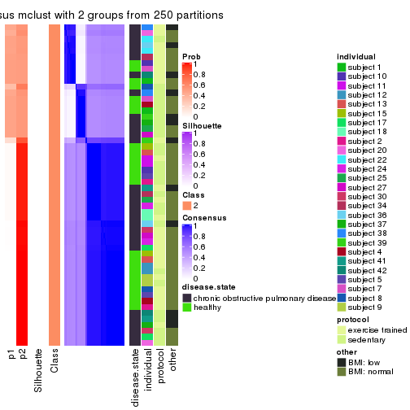</p>

</div>
<div id='tab-ATC-mclust-consensus-heatmap-2'>
<pre><code class="r">consensus_heatmap(res, k = 3)
</code></pre>

<p>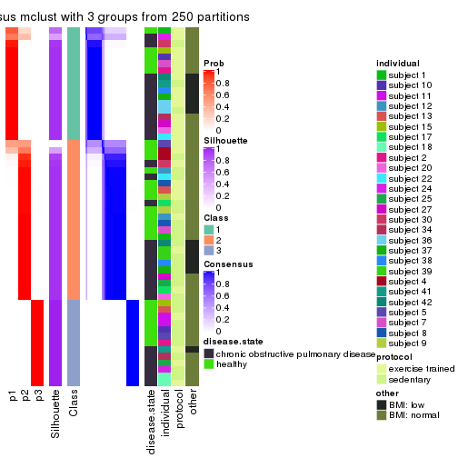</p>

</div>
<div id='tab-ATC-mclust-consensus-heatmap-3'>
<pre><code class="r">consensus_heatmap(res, k = 4)
</code></pre>

<p>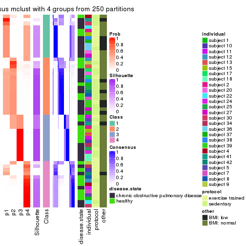</p>

</div>
<div id='tab-ATC-mclust-consensus-heatmap-4'>
<pre><code class="r">consensus_heatmap(res, k = 5)
</code></pre>

<p>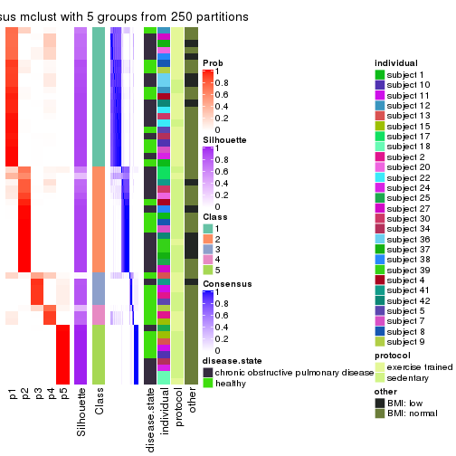</p>

</div>
<div id='tab-ATC-mclust-consensus-heatmap-5'>
<pre><code class="r">consensus_heatmap(res, k = 6)
</code></pre>

<p>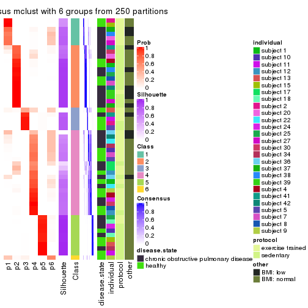</p>

</div>
</div>

Heatmaps for the membership of samples in all partitions to see how consistent they are:


<script>
$( function() {
	$( '#tabs-ATC-mclust-membership-heatmap' ).tabs();
} );
</script>
<div id='tabs-ATC-mclust-membership-heatmap'>
<ul>
<li><a href='#tab-ATC-mclust-membership-heatmap-1'>k = 2</a></li>
<li><a href='#tab-ATC-mclust-membership-heatmap-2'>k = 3</a></li>
<li><a href='#tab-ATC-mclust-membership-heatmap-3'>k = 4</a></li>
<li><a href='#tab-ATC-mclust-membership-heatmap-4'>k = 5</a></li>
<li><a href='#tab-ATC-mclust-membership-heatmap-5'>k = 6</a></li>
</ul>
<div id='tab-ATC-mclust-membership-heatmap-1'>
<pre><code class="r">membership_heatmap(res, k = 2)
</code></pre>

<p>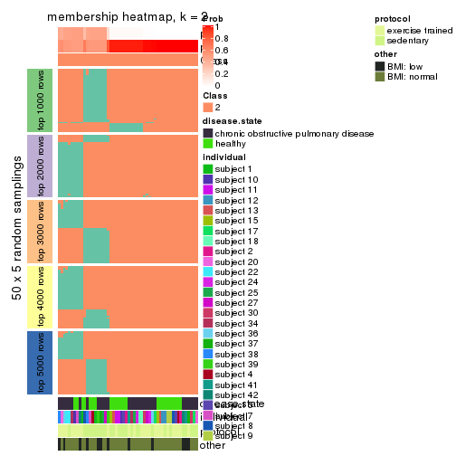</p>

</div>
<div id='tab-ATC-mclust-membership-heatmap-2'>
<pre><code class="r">membership_heatmap(res, k = 3)
</code></pre>

<p>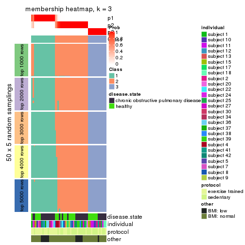</p>

</div>
<div id='tab-ATC-mclust-membership-heatmap-3'>
<pre><code class="r">membership_heatmap(res, k = 4)
</code></pre>

<p>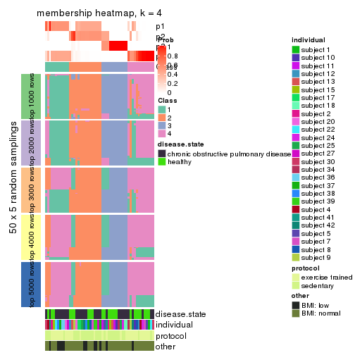</p>

</div>
<div id='tab-ATC-mclust-membership-heatmap-4'>
<pre><code class="r">membership_heatmap(res, k = 5)
</code></pre>

<p>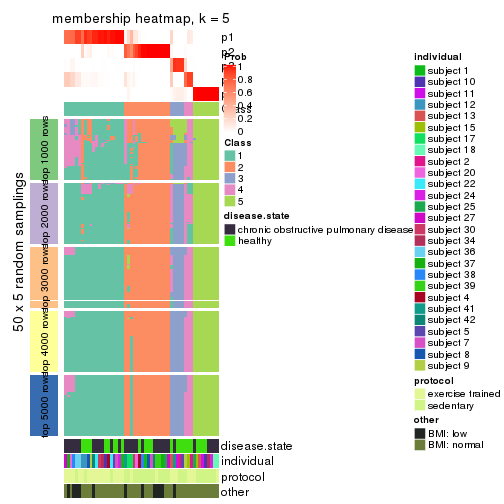</p>

</div>
<div id='tab-ATC-mclust-membership-heatmap-5'>
<pre><code class="r">membership_heatmap(res, k = 6)
</code></pre>

<p>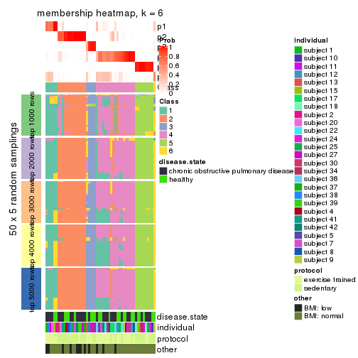</p>

</div>
</div>

As soon as we have had the classes for columns, we can look for signatures
which are significantly different between classes which can be candidate marks
for certain classes. Following are the heatmaps for signatures.


Signature heatmaps where rows are scaled:


<script>
$( function() {
	$( '#tabs-ATC-mclust-get-signatures' ).tabs();
} );
</script>
<div id='tabs-ATC-mclust-get-signatures'>
<ul>
<li><a href='#tab-ATC-mclust-get-signatures-1'>k = 2</a></li>
<li><a href='#tab-ATC-mclust-get-signatures-2'>k = 3</a></li>
<li><a href='#tab-ATC-mclust-get-signatures-3'>k = 4</a></li>
<li><a href='#tab-ATC-mclust-get-signatures-4'>k = 5</a></li>
<li><a href='#tab-ATC-mclust-get-signatures-5'>k = 6</a></li>
</ul>
<div id='tab-ATC-mclust-get-signatures-1'>
<pre><code class="r">get_signatures(res, k = 2)
</code></pre>

<p></p>

</div>
<div id='tab-ATC-mclust-get-signatures-2'>
<pre><code class="r">get_signatures(res, k = 3)
</code></pre>

<p>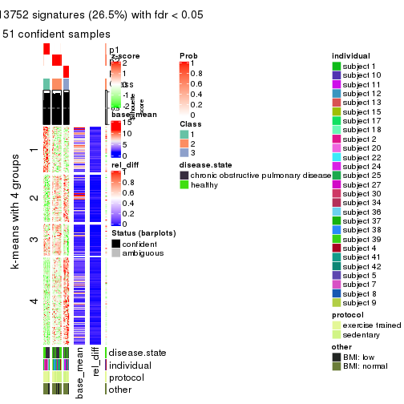</p>

</div>
<div id='tab-ATC-mclust-get-signatures-3'>
<pre><code class="r">get_signatures(res, k = 4)
</code></pre>

<p>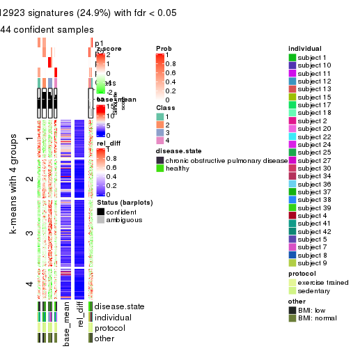</p>

</div>
<div id='tab-ATC-mclust-get-signatures-4'>
<pre><code class="r">get_signatures(res, k = 5)
</code></pre>

<pre><code>#&gt; Error in mat[ceiling(1:nr/h_ratio), ceiling(1:nc/w_ratio), drop = FALSE]: subscript out of bounds
</code></pre>

<p></p>

</div>
<div id='tab-ATC-mclust-get-signatures-5'>
<pre><code class="r">get_signatures(res, k = 6)
</code></pre>

<p>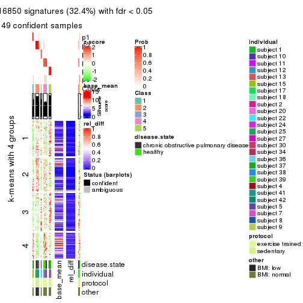</p>

</div>
</div>


Signature heatmaps where rows are not scaled:


<script>
$( function() {
	$( '#tabs-ATC-mclust-get-signatures-no-scale' ).tabs();
} );
</script>
<div id='tabs-ATC-mclust-get-signatures-no-scale'>
<ul>
<li><a href='#tab-ATC-mclust-get-signatures-no-scale-1'>k = 2</a></li>
<li><a href='#tab-ATC-mclust-get-signatures-no-scale-2'>k = 3</a></li>
<li><a href='#tab-ATC-mclust-get-signatures-no-scale-3'>k = 4</a></li>
<li><a href='#tab-ATC-mclust-get-signatures-no-scale-4'>k = 5</a></li>
<li><a href='#tab-ATC-mclust-get-signatures-no-scale-5'>k = 6</a></li>
</ul>
<div id='tab-ATC-mclust-get-signatures-no-scale-1'>
<pre><code class="r">get_signatures(res, k = 2, scale_rows = FALSE)
</code></pre>

<p></p>

</div>
<div id='tab-ATC-mclust-get-signatures-no-scale-2'>
<pre><code class="r">get_signatures(res, k = 3, scale_rows = FALSE)
</code></pre>

<p>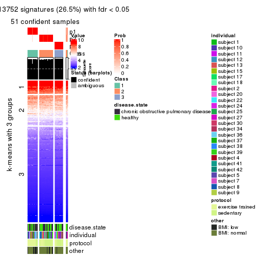</p>

</div>
<div id='tab-ATC-mclust-get-signatures-no-scale-3'>
<pre><code class="r">get_signatures(res, k = 4, scale_rows = FALSE)
</code></pre>

<p>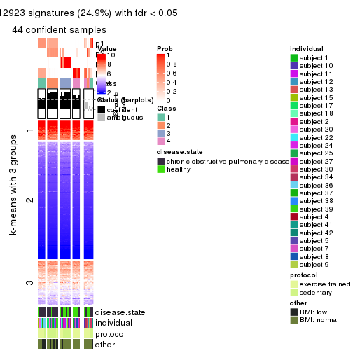</p>

</div>
<div id='tab-ATC-mclust-get-signatures-no-scale-4'>
<pre><code class="r">get_signatures(res, k = 5, scale_rows = FALSE)
</code></pre>

<p>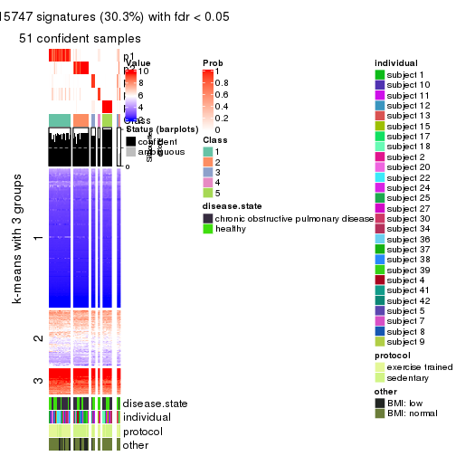</p>

</div>
<div id='tab-ATC-mclust-get-signatures-no-scale-5'>
<pre><code class="r">get_signatures(res, k = 6, scale_rows = FALSE)
</code></pre>

<p>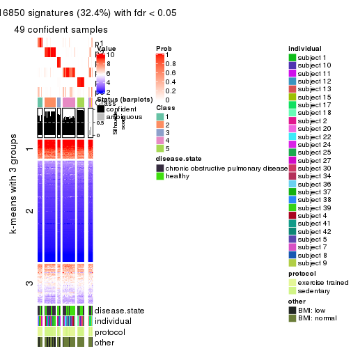</p>

</div>
</div>


Compare the overlap of signatures from different k:

```r
compare_signatures(res)
```

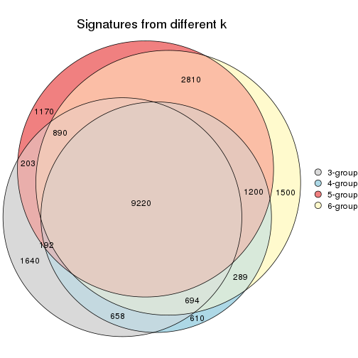

`get_signature()` returns a data frame invisibly. TO get the list of signatures, the function
call should be assigned to a variable explicitly. In following code, if `plot` argument is set
to `FALSE`, no heatmap is plotted while only the differential analysis is performed.

```r
# code only for demonstration
tb = get_signature(res, k = ..., plot = FALSE)
```

An example of the output of `tb` is:

```
#>   which_row         fdr    mean_1    mean_2 scaled_mean_1 scaled_mean_2 km
#> 1        38 0.042760348  8.373488  9.131774    -0.5533452     0.5164555  1
#> 2        40 0.018707592  7.106213  8.469186    -0.6173731     0.5762149  1
#> 3        55 0.019134737 10.221463 11.207825    -0.6159697     0.5749050  1
#> 4        59 0.006059896  5.921854  7.869574    -0.6899429     0.6439467  1
#> 5        60 0.018055526  8.928898 10.211722    -0.6204761     0.5791110  1
#> 6        98 0.009384629 15.714769 14.887706     0.6635654    -0.6193277  2
...
```

The columns in `tb` are:

1. `which_row`: row indices corresponding to the input matrix.
2. `fdr`: FDR for the differential test. 
3. `mean_x`: The mean value in group x.
4. `scaled_mean_x`: The mean value in group x after rows are scaled.
5. `km`: Row groups if k-means clustering is applied to rows.


UMAP plot which shows how samples are separated.


<script>
$( function() {
	$( '#tabs-ATC-mclust-dimension-reduction' ).tabs();
} );
</script>
<div id='tabs-ATC-mclust-dimension-reduction'>
<ul>
<li><a href='#tab-ATC-mclust-dimension-reduction-1'>k = 2</a></li>
<li><a href='#tab-ATC-mclust-dimension-reduction-2'>k = 3</a></li>
<li><a href='#tab-ATC-mclust-dimension-reduction-3'>k = 4</a></li>
<li><a href='#tab-ATC-mclust-dimension-reduction-4'>k = 5</a></li>
<li><a href='#tab-ATC-mclust-dimension-reduction-5'>k = 6</a></li>
</ul>
<div id='tab-ATC-mclust-dimension-reduction-1'>
<pre><code class="r">dimension_reduction(res, k = 2, method = &quot;UMAP&quot;)
</code></pre>

<p>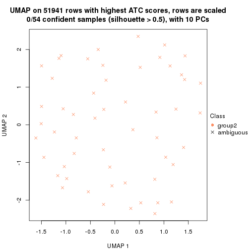</p>

</div>
<div id='tab-ATC-mclust-dimension-reduction-2'>
<pre><code class="r">dimension_reduction(res, k = 3, method = &quot;UMAP&quot;)
</code></pre>

<p>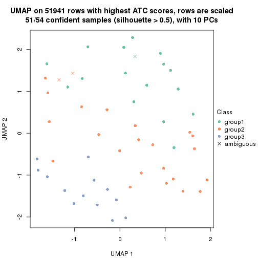</p>

</div>
<div id='tab-ATC-mclust-dimension-reduction-3'>
<pre><code class="r">dimension_reduction(res, k = 4, method = &quot;UMAP&quot;)
</code></pre>

<p>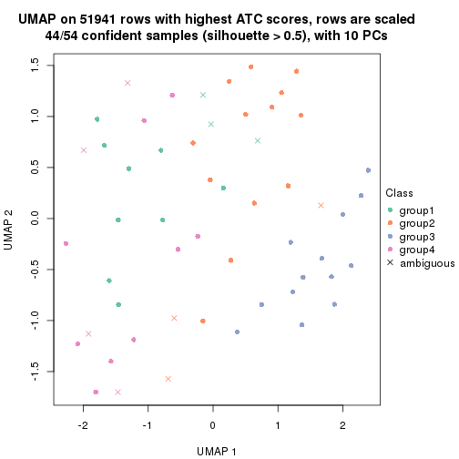</p>

</div>
<div id='tab-ATC-mclust-dimension-reduction-4'>
<pre><code class="r">dimension_reduction(res, k = 5, method = &quot;UMAP&quot;)
</code></pre>

<p>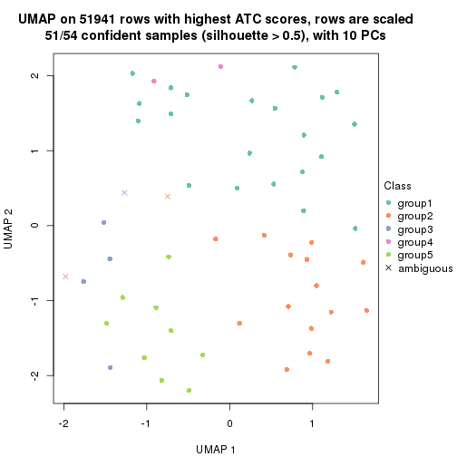</p>

</div>
<div id='tab-ATC-mclust-dimension-reduction-5'>
<pre><code class="r">dimension_reduction(res, k = 6, method = &quot;UMAP&quot;)
</code></pre>

<p>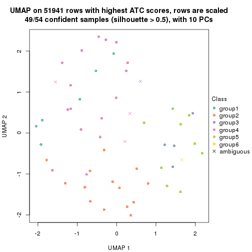</p>

</div>
</div>


Following heatmap shows how subgroups are split when increasing `k`:

```r
collect_classes(res)
```

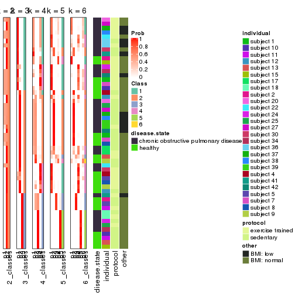


Test correlation between subgroups and known annotations. If the known
annotation is numeric, one-way ANOVA test is applied, and if the known
annotation is discrete, chi-squared contingency table test is applied.

```r
test_to_known_factors(res)
```

```
#>             n disease.state(p) individual(p) protocol(p) other(p) k
#> ATC:mclust  0               NA            NA          NA       NA 2
#> ATC:mclust 51           0.4544         0.428    4.20e-03   0.1690 3
#> ATC:mclust 44           0.0945         0.377    9.75e-04   0.0356 4
#> ATC:mclust 51           0.2023         0.631    2.23e-05   0.2267 5
#> ATC:mclust 49           0.3884         0.640    4.37e-05   0.1215 6
```


If matrix rows can be associated to genes, consider to use `functional_enrichment(res,
...)` to perform function enrichment for the signature genes. See [this vignette](http://bioconductor.org/packages/devel/bioc/vignettes/cola/inst/doc/functional_enrichment.html) for more detailed explanations.


 

---------------------------------------------------


### ATC:NMF


The object with results only for a single top-value method and a single partition method 
can be extracted as:

```r
res = res_list["ATC", "NMF"]
# you can also extract it by
# res = res_list["ATC:NMF"]
```

A summary of `res` and all the functions that can be applied to it:

```r
res
```

```
#> A 'ConsensusPartition' object with k = 2, 3, 4, 5, 6.
#>   On a matrix with 51941 rows and 54 columns.
#>   Top rows (1000, 2000, 3000, 4000, 5000) are extracted by 'ATC' method.
#>   Subgroups are detected by 'NMF' method.
#>   Performed in total 1250 partitions by row resampling.
#>   Best k for subgroups seems to be 2.
#> 
#> Following methods can be applied to this 'ConsensusPartition' object:
#>  [1] "cola_report"             "collect_classes"         "collect_plots"          
#>  [4] "collect_stats"           "colnames"                "compare_signatures"     
#>  [7] "consensus_heatmap"       "dimension_reduction"     "functional_enrichment"  
#> [10] "get_anno_col"            "get_anno"                "get_classes"            
#> [13] "get_consensus"           "get_matrix"              "get_membership"         
#> [16] "get_param"               "get_signatures"          "get_stats"              
#> [19] "is_best_k"               "is_stable_k"             "membership_heatmap"     
#> [22] "ncol"                    "nrow"                    "plot_ecdf"              
#> [25] "rownames"                "select_partition_number" "show"                   
#> [28] "suggest_best_k"          "test_to_known_factors"
```

`collect_plots()` function collects all the plots made from `res` for all `k` (number of partitions)
into one single page to provide an easy and fast comparison between different `k`.

```r
collect_plots(res)
```

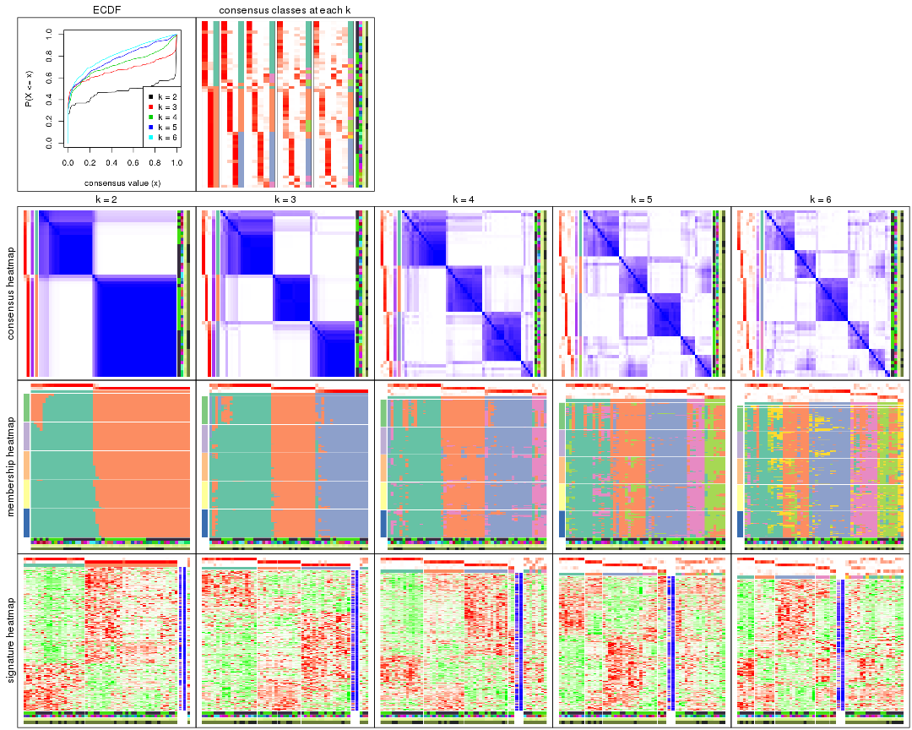

The plots are:

- The first row: a plot of the ECDF (empirical cumulative distribution
  function) curves of the consensus matrix for each `k` and the heatmap of
  predicted classes for each `k`.
- The second row: heatmaps of the consensus matrix for each `k`.
- The third row: heatmaps of the membership matrix for each `k`.
- The fouth row: heatmaps of the signatures for each `k`.

All the plots in panels can be made by individual functions and they are
plotted later in this section.

`select_partition_number()` produces several plots showing different
statistics for choosing "optimized" `k`. There are following statistics:

- ECDF curves of the consensus matrix for each `k`;
- 1-PAC. [The PAC
  score](https://en.wikipedia.org/wiki/Consensus_clustering#Over-interpretation_potential_of_consensus_clustering)
  measures the proportion of the ambiguous subgrouping.
- Mean silhouette score.
- Concordance. The mean probability of fiting the consensus class ids in all
  partitions.
- Area increased. Denote $A_k$ as the area under the ECDF curve for current
  `k`, the area increased is defined as $A_k - A_{k-1}$.
- Rand index. The percent of pairs of samples that are both in a same cluster
  or both are not in a same cluster in the partition of k and k-1.
- Jaccard index. The ratio of pairs of samples are both in a same cluster in
  the partition of k and k-1 and the pairs of samples are both in a same
  cluster in the partition k or k-1.

The detailed explanations of these statistics can be found in [the _cola_
vignette](http://bioconductor.org/packages/devel/bioc/vignettes/cola/inst/doc/cola.html#toc_13).

Generally speaking, lower PAC score, higher mean silhouette score or higher
concordance corresponds to better partition. Rand index and Jaccard index
measure how similar the current partition is compared to partition with `k-1`.
If they are too similar, we won't accept `k` is better than `k-1`.

```r
select_partition_number(res)
```

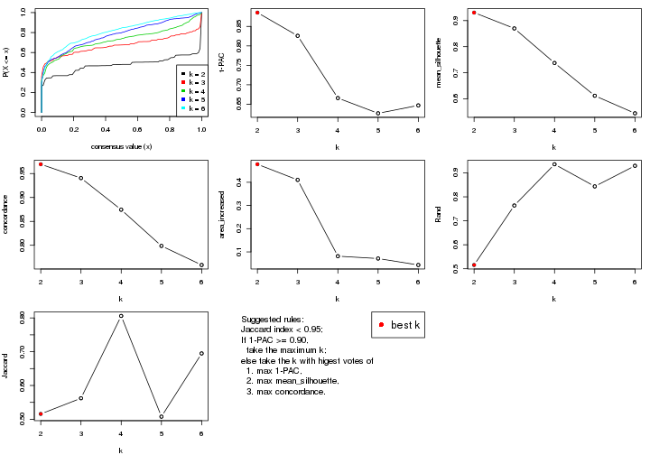

The numeric values for all these statistics can be obtained by `get_stats()`.

```r
get_stats(res)
```

```
#>   k 1-PAC mean_silhouette concordance area_increased  Rand Jaccard
#> 2 2 0.885           0.931       0.969         0.4774 0.516   0.516
#> 3 3 0.826           0.870       0.941         0.4101 0.764   0.562
#> 4 4 0.666           0.738       0.874         0.0816 0.936   0.806
#> 5 5 0.627           0.612       0.799         0.0715 0.843   0.508
#> 6 6 0.647           0.545       0.759         0.0437 0.929   0.695
```

`suggest_best_k()` suggests the best $k$ based on these statistics. The rules are as follows:

- All $k$ with Jaccard index larger than 0.95 are removed because increasing
  $k$ does not provide enough extra information. If all $k$ are removed, it is
  marked as no subgroup is detected.
- For all $k$ with 1-PAC score larger than 0.9, the maximal $k$ is taken as
  the best $k$, and other $k$ are marked as optional $k$.
- If it does not fit the second rule. The $k$ with the maximal vote of the
  highest 1-PAC score, highest mean silhouette, and highest concordance is
  taken as the best $k$.

```r
suggest_best_k(res)
```

```
#> [1] 2
```


Following shows the table of the partitions (You need to click the **show/hide
code output** link to see it). The membership matrix (columns with name `p*`)
is inferred by
[`clue::cl_consensus()`](https://www.rdocumentation.org/link/cl_consensus?package=clue)
function with the `SE` method. Basically the value in the membership matrix
represents the probability to belong to a certain group. The finall class
label for an item is determined with the group with highest probability it
belongs to.

In `get_classes()` function, the entropy is calculated from the membership
matrix and the silhouette score is calculated from the consensus matrix.


<script>
$( function() {
	$( '#tabs-ATC-NMF-get-classes' ).tabs();
} );
</script>
<div id='tabs-ATC-NMF-get-classes'>
<ul>
<li><a href='#tab-ATC-NMF-get-classes-1'>k = 2</a></li>
<li><a href='#tab-ATC-NMF-get-classes-2'>k = 3</a></li>
<li><a href='#tab-ATC-NMF-get-classes-3'>k = 4</a></li>
<li><a href='#tab-ATC-NMF-get-classes-4'>k = 5</a></li>
<li><a href='#tab-ATC-NMF-get-classes-5'>k = 6</a></li>
</ul>

<div id='tab-ATC-NMF-get-classes-1'>
<p><a id='tab-ATC-NMF-get-classes-1-a' style='color:#0366d6' href='#'>show/hide code output</a></p>
<pre><code class="r">cbind(get_classes(res, k = 2), get_membership(res, k = 2))
</code></pre>

<pre><code>#&gt;           class entropy silhouette    p1    p2
#&gt; GSM680053     2  0.0000      0.979 0.000 1.000
#&gt; GSM680062     2  0.0000      0.979 0.000 1.000
#&gt; GSM680054     2  0.0000      0.979 0.000 1.000
#&gt; GSM680063     2  0.0000      0.979 0.000 1.000
#&gt; GSM680055     2  0.0376      0.975 0.004 0.996
#&gt; GSM680064     1  0.0000      0.946 1.000 0.000
#&gt; GSM680056     2  0.9881      0.141 0.436 0.564
#&gt; GSM680065     1  0.0000      0.946 1.000 0.000
#&gt; GSM680057     2  0.0000      0.979 0.000 1.000
#&gt; GSM680066     1  0.7376      0.772 0.792 0.208
#&gt; GSM680058     2  0.0000      0.979 0.000 1.000
#&gt; GSM680067     2  0.0000      0.979 0.000 1.000
#&gt; GSM680059     2  0.0000      0.979 0.000 1.000
#&gt; GSM680068     1  0.0000      0.946 1.000 0.000
#&gt; GSM680060     1  0.1843      0.934 0.972 0.028
#&gt; GSM680069     1  0.8327      0.689 0.736 0.264
#&gt; GSM680061     2  0.0000      0.979 0.000 1.000
#&gt; GSM680070     1  0.0000      0.946 1.000 0.000
#&gt; GSM680071     1  0.0000      0.946 1.000 0.000
#&gt; GSM680077     1  0.0000      0.946 1.000 0.000
#&gt; GSM680072     2  0.0000      0.979 0.000 1.000
#&gt; GSM680078     1  0.0000      0.946 1.000 0.000
#&gt; GSM680073     2  0.0000      0.979 0.000 1.000
#&gt; GSM680079     1  0.0000      0.946 1.000 0.000
#&gt; GSM680074     2  0.0000      0.979 0.000 1.000
#&gt; GSM680080     2  0.0000      0.979 0.000 1.000
#&gt; GSM680075     1  0.0000      0.946 1.000 0.000
#&gt; GSM680081     2  0.0000      0.979 0.000 1.000
#&gt; GSM680076     2  0.0000      0.979 0.000 1.000
#&gt; GSM680082     1  0.0000      0.946 1.000 0.000
#&gt; GSM680029     2  0.0000      0.979 0.000 1.000
#&gt; GSM680041     1  0.1184      0.940 0.984 0.016
#&gt; GSM680035     2  0.0000      0.979 0.000 1.000
#&gt; GSM680047     1  0.0000      0.946 1.000 0.000
#&gt; GSM680036     1  0.3584      0.907 0.932 0.068
#&gt; GSM680048     1  0.7950      0.728 0.760 0.240
#&gt; GSM680037     2  0.0000      0.979 0.000 1.000
#&gt; GSM680049     1  0.7056      0.791 0.808 0.192
#&gt; GSM680038     2  0.0000      0.979 0.000 1.000
#&gt; GSM680050     1  0.0938      0.942 0.988 0.012
#&gt; GSM680039     2  0.0000      0.979 0.000 1.000
#&gt; GSM680051     2  0.1414      0.960 0.020 0.980
#&gt; GSM680040     2  0.0000      0.979 0.000 1.000
#&gt; GSM680052     2  0.0000      0.979 0.000 1.000
#&gt; GSM680030     2  0.0000      0.979 0.000 1.000
#&gt; GSM680042     1  0.0000      0.946 1.000 0.000
#&gt; GSM680031     2  0.0000      0.979 0.000 1.000
#&gt; GSM680043     2  0.0000      0.979 0.000 1.000
#&gt; GSM680032     2  0.6438      0.781 0.164 0.836
#&gt; GSM680044     2  0.0000      0.979 0.000 1.000
#&gt; GSM680033     2  0.0000      0.979 0.000 1.000
#&gt; GSM680045     2  0.0000      0.979 0.000 1.000
#&gt; GSM680034     2  0.0000      0.979 0.000 1.000
#&gt; GSM680046     1  0.0000      0.946 1.000 0.000
</code></pre>

<script>
$('#tab-ATC-NMF-get-classes-1-a').parent().next().next().hide();
$('#tab-ATC-NMF-get-classes-1-a').click(function(){
  $('#tab-ATC-NMF-get-classes-1-a').parent().next().next().toggle();
  return(false);
});
</script>
</div>

<div id='tab-ATC-NMF-get-classes-2'>
<p><a id='tab-ATC-NMF-get-classes-2-a' style='color:#0366d6' href='#'>show/hide code output</a></p>
<pre><code class="r">cbind(get_classes(res, k = 3), get_membership(res, k = 3))
</code></pre>

<pre><code>#&gt;           class entropy silhouette    p1    p2    p3
#&gt; GSM680053     3  0.1289      0.921 0.000 0.032 0.968
#&gt; GSM680062     2  0.1411      0.952 0.000 0.964 0.036
#&gt; GSM680054     3  0.0237      0.936 0.000 0.004 0.996
#&gt; GSM680063     3  0.4974      0.694 0.000 0.236 0.764
#&gt; GSM680055     2  0.0237      0.978 0.000 0.996 0.004
#&gt; GSM680064     1  0.0000      0.902 1.000 0.000 0.000
#&gt; GSM680056     1  0.5706      0.536 0.680 0.000 0.320
#&gt; GSM680065     1  0.0237      0.901 0.996 0.004 0.000
#&gt; GSM680057     3  0.2066      0.900 0.000 0.060 0.940
#&gt; GSM680066     1  0.2878      0.841 0.904 0.000 0.096
#&gt; GSM680058     2  0.0000      0.977 0.000 1.000 0.000
#&gt; GSM680067     3  0.0000      0.938 0.000 0.000 1.000
#&gt; GSM680059     2  0.0237      0.978 0.000 0.996 0.004
#&gt; GSM680068     1  0.0000      0.902 1.000 0.000 0.000
#&gt; GSM680060     1  0.6180      0.300 0.584 0.416 0.000
#&gt; GSM680069     1  0.6267      0.282 0.548 0.452 0.000
#&gt; GSM680061     3  0.0000      0.938 0.000 0.000 1.000
#&gt; GSM680070     1  0.0000      0.902 1.000 0.000 0.000
#&gt; GSM680071     1  0.0237      0.901 0.996 0.004 0.000
#&gt; GSM680077     1  0.0000      0.902 1.000 0.000 0.000
#&gt; GSM680072     2  0.0237      0.978 0.000 0.996 0.004
#&gt; GSM680078     1  0.0237      0.901 0.996 0.004 0.000
#&gt; GSM680073     2  0.0000      0.977 0.000 1.000 0.000
#&gt; GSM680079     1  0.0000      0.902 1.000 0.000 0.000
#&gt; GSM680074     2  0.0237      0.978 0.000 0.996 0.004
#&gt; GSM680080     2  0.0237      0.978 0.000 0.996 0.004
#&gt; GSM680075     1  0.0592      0.898 0.988 0.012 0.000
#&gt; GSM680081     3  0.0000      0.938 0.000 0.000 1.000
#&gt; GSM680076     2  0.0000      0.977 0.000 1.000 0.000
#&gt; GSM680082     1  0.0000      0.902 1.000 0.000 0.000
#&gt; GSM680029     2  0.0000      0.977 0.000 1.000 0.000
#&gt; GSM680041     1  0.4062      0.796 0.836 0.164 0.000
#&gt; GSM680035     3  0.0000      0.938 0.000 0.000 1.000
#&gt; GSM680047     1  0.0000      0.902 1.000 0.000 0.000
#&gt; GSM680036     2  0.0000      0.977 0.000 1.000 0.000
#&gt; GSM680048     1  0.3989      0.826 0.864 0.124 0.012
#&gt; GSM680037     3  0.0000      0.938 0.000 0.000 1.000
#&gt; GSM680049     1  0.4555      0.757 0.800 0.200 0.000
#&gt; GSM680038     2  0.0237      0.978 0.000 0.996 0.004
#&gt; GSM680050     1  0.2537      0.862 0.920 0.080 0.000
#&gt; GSM680039     2  0.0747      0.970 0.000 0.984 0.016
#&gt; GSM680051     3  0.7864      0.370 0.332 0.072 0.596
#&gt; GSM680040     3  0.0000      0.938 0.000 0.000 1.000
#&gt; GSM680052     3  0.0892      0.927 0.000 0.020 0.980
#&gt; GSM680030     3  0.5397      0.631 0.000 0.280 0.720
#&gt; GSM680042     1  0.0000      0.902 1.000 0.000 0.000
#&gt; GSM680031     3  0.0000      0.938 0.000 0.000 1.000
#&gt; GSM680043     3  0.0000      0.938 0.000 0.000 1.000
#&gt; GSM680032     2  0.4784      0.711 0.200 0.796 0.004
#&gt; GSM680044     2  0.0424      0.976 0.000 0.992 0.008
#&gt; GSM680033     3  0.0000      0.938 0.000 0.000 1.000
#&gt; GSM680045     3  0.0000      0.938 0.000 0.000 1.000
#&gt; GSM680034     3  0.0000      0.938 0.000 0.000 1.000
#&gt; GSM680046     1  0.0000      0.902 1.000 0.000 0.000
</code></pre>

<script>
$('#tab-ATC-NMF-get-classes-2-a').parent().next().next().hide();
$('#tab-ATC-NMF-get-classes-2-a').click(function(){
  $('#tab-ATC-NMF-get-classes-2-a').parent().next().next().toggle();
  return(false);
});
</script>
</div>

<div id='tab-ATC-NMF-get-classes-3'>
<p><a id='tab-ATC-NMF-get-classes-3-a' style='color:#0366d6' href='#'>show/hide code output</a></p>
<pre><code class="r">cbind(get_classes(res, k = 4), get_membership(res, k = 4))
</code></pre>

<pre><code>#&gt;           class entropy silhouette    p1    p2    p3    p4
#&gt; GSM680053     3  0.2670      0.863 0.000 0.024 0.904 0.072
#&gt; GSM680062     2  0.4388      0.774 0.000 0.808 0.060 0.132
#&gt; GSM680054     3  0.0469      0.881 0.000 0.012 0.988 0.000
#&gt; GSM680063     3  0.3074      0.764 0.000 0.152 0.848 0.000
#&gt; GSM680055     2  0.2530      0.835 0.000 0.888 0.000 0.112
#&gt; GSM680064     1  0.0000      0.808 1.000 0.000 0.000 0.000
#&gt; GSM680056     1  0.5562      0.145 0.524 0.004 0.460 0.012
#&gt; GSM680065     1  0.0000      0.808 1.000 0.000 0.000 0.000
#&gt; GSM680057     3  0.1302      0.868 0.000 0.044 0.956 0.000
#&gt; GSM680066     1  0.2197      0.793 0.936 0.024 0.028 0.012
#&gt; GSM680058     2  0.0188      0.883 0.000 0.996 0.000 0.004
#&gt; GSM680067     3  0.1452      0.869 0.000 0.036 0.956 0.008
#&gt; GSM680059     2  0.0469      0.883 0.000 0.988 0.000 0.012
#&gt; GSM680068     1  0.0336      0.806 0.992 0.000 0.000 0.008
#&gt; GSM680060     4  0.5189      0.294 0.012 0.372 0.000 0.616
#&gt; GSM680069     1  0.5183      0.366 0.584 0.408 0.000 0.008
#&gt; GSM680061     3  0.0336      0.881 0.000 0.008 0.992 0.000
#&gt; GSM680070     1  0.0336      0.807 0.992 0.000 0.000 0.008
#&gt; GSM680071     1  0.1677      0.790 0.948 0.012 0.000 0.040
#&gt; GSM680077     1  0.0000      0.808 1.000 0.000 0.000 0.000
#&gt; GSM680072     2  0.0921      0.879 0.000 0.972 0.000 0.028
#&gt; GSM680078     1  0.2216      0.768 0.908 0.000 0.000 0.092
#&gt; GSM680073     2  0.1398      0.878 0.000 0.956 0.040 0.004
#&gt; GSM680079     1  0.0000      0.808 1.000 0.000 0.000 0.000
#&gt; GSM680074     2  0.1398      0.878 0.000 0.956 0.040 0.004
#&gt; GSM680080     2  0.2081      0.855 0.000 0.916 0.000 0.084
#&gt; GSM680075     1  0.5035      0.560 0.744 0.204 0.000 0.052
#&gt; GSM680081     3  0.1792      0.870 0.000 0.000 0.932 0.068
#&gt; GSM680076     2  0.2714      0.824 0.000 0.884 0.112 0.004
#&gt; GSM680082     1  0.0000      0.808 1.000 0.000 0.000 0.000
#&gt; GSM680029     2  0.1118      0.878 0.000 0.964 0.000 0.036
#&gt; GSM680041     1  0.5070      0.632 0.748 0.192 0.000 0.060
#&gt; GSM680035     3  0.1792      0.870 0.000 0.000 0.932 0.068
#&gt; GSM680047     4  0.2530      0.652 0.112 0.000 0.000 0.888
#&gt; GSM680036     2  0.1637      0.867 0.000 0.940 0.000 0.060
#&gt; GSM680048     1  0.7250      0.140 0.504 0.160 0.000 0.336
#&gt; GSM680037     3  0.2973      0.819 0.000 0.000 0.856 0.144
#&gt; GSM680049     1  0.3933      0.665 0.792 0.200 0.000 0.008
#&gt; GSM680038     2  0.1118      0.881 0.000 0.964 0.036 0.000
#&gt; GSM680050     1  0.2859      0.752 0.880 0.112 0.000 0.008
#&gt; GSM680039     2  0.1706      0.879 0.000 0.948 0.036 0.016
#&gt; GSM680051     4  0.5182      0.661 0.024 0.112 0.076 0.788
#&gt; GSM680040     4  0.4283      0.445 0.000 0.004 0.256 0.740
#&gt; GSM680052     3  0.5148      0.599 0.000 0.208 0.736 0.056
#&gt; GSM680030     3  0.2921      0.783 0.000 0.140 0.860 0.000
#&gt; GSM680042     1  0.0817      0.805 0.976 0.024 0.000 0.000
#&gt; GSM680031     3  0.0707      0.882 0.000 0.000 0.980 0.020
#&gt; GSM680043     3  0.1940      0.870 0.000 0.000 0.924 0.076
#&gt; GSM680032     2  0.6988      0.303 0.332 0.560 0.096 0.012
#&gt; GSM680044     2  0.3052      0.796 0.000 0.860 0.136 0.004
#&gt; GSM680033     3  0.0921      0.881 0.000 0.000 0.972 0.028
#&gt; GSM680045     3  0.4830      0.484 0.000 0.000 0.608 0.392
#&gt; GSM680034     3  0.0336      0.881 0.000 0.008 0.992 0.000
#&gt; GSM680046     4  0.4790      0.343 0.380 0.000 0.000 0.620
</code></pre>

<script>
$('#tab-ATC-NMF-get-classes-3-a').parent().next().next().hide();
$('#tab-ATC-NMF-get-classes-3-a').click(function(){
  $('#tab-ATC-NMF-get-classes-3-a').parent().next().next().toggle();
  return(false);
});
</script>
</div>

<div id='tab-ATC-NMF-get-classes-4'>
<p><a id='tab-ATC-NMF-get-classes-4-a' style='color:#0366d6' href='#'>show/hide code output</a></p>
<pre><code class="r">cbind(get_classes(res, k = 5), get_membership(res, k = 5))
</code></pre>

<pre><code>#&gt;           class entropy silhouette    p1    p2    p3    p4    p5
#&gt; GSM680053     3  0.1285      0.918 0.000 0.004 0.956 0.004 0.036
#&gt; GSM680062     2  0.5624      0.363 0.000 0.648 0.004 0.208 0.140
#&gt; GSM680054     3  0.1012      0.920 0.000 0.020 0.968 0.000 0.012
#&gt; GSM680063     2  0.4874      0.285 0.000 0.588 0.388 0.008 0.016
#&gt; GSM680055     5  0.3837      0.569 0.020 0.156 0.008 0.008 0.808
#&gt; GSM680064     1  0.0451      0.715 0.988 0.000 0.000 0.004 0.008
#&gt; GSM680056     3  0.3897      0.705 0.204 0.000 0.768 0.000 0.028
#&gt; GSM680065     1  0.0609      0.713 0.980 0.000 0.000 0.000 0.020
#&gt; GSM680057     3  0.1630      0.912 0.000 0.036 0.944 0.004 0.016
#&gt; GSM680066     1  0.6770      0.476 0.552 0.176 0.004 0.244 0.024
#&gt; GSM680058     2  0.3766      0.280 0.000 0.728 0.004 0.000 0.268
#&gt; GSM680067     2  0.5878      0.278 0.004 0.596 0.320 0.056 0.024
#&gt; GSM680059     2  0.2471      0.550 0.000 0.864 0.000 0.000 0.136
#&gt; GSM680068     1  0.3282      0.667 0.804 0.000 0.000 0.188 0.008
#&gt; GSM680060     5  0.2104      0.506 0.000 0.060 0.000 0.024 0.916
#&gt; GSM680069     1  0.5354      0.483 0.644 0.272 0.000 0.004 0.080
#&gt; GSM680061     3  0.3815      0.699 0.000 0.220 0.764 0.004 0.012
#&gt; GSM680070     1  0.4336      0.576 0.700 0.012 0.000 0.280 0.008
#&gt; GSM680071     1  0.4588      0.417 0.668 0.012 0.000 0.012 0.308
#&gt; GSM680077     1  0.1502      0.716 0.940 0.000 0.000 0.056 0.004
#&gt; GSM680072     5  0.4307      0.390 0.000 0.496 0.000 0.000 0.504
#&gt; GSM680078     1  0.5008      0.496 0.644 0.000 0.000 0.056 0.300
#&gt; GSM680073     2  0.1484      0.630 0.000 0.944 0.008 0.000 0.048
#&gt; GSM680079     1  0.0290      0.715 0.992 0.000 0.000 0.000 0.008
#&gt; GSM680074     2  0.1205      0.632 0.000 0.956 0.004 0.000 0.040
#&gt; GSM680080     5  0.4527      0.477 0.000 0.392 0.000 0.012 0.596
#&gt; GSM680075     5  0.4707      0.179 0.392 0.020 0.000 0.000 0.588
#&gt; GSM680081     3  0.0671      0.922 0.000 0.000 0.980 0.016 0.004
#&gt; GSM680076     2  0.0162      0.633 0.000 0.996 0.000 0.000 0.004
#&gt; GSM680082     1  0.1502      0.717 0.940 0.004 0.000 0.056 0.000
#&gt; GSM680029     5  0.4452      0.371 0.000 0.496 0.004 0.000 0.500
#&gt; GSM680041     1  0.7253      0.293 0.496 0.172 0.000 0.276 0.056
#&gt; GSM680035     3  0.0771      0.922 0.000 0.000 0.976 0.020 0.004
#&gt; GSM680047     4  0.2763      0.695 0.004 0.000 0.000 0.848 0.148
#&gt; GSM680036     5  0.4651      0.540 0.020 0.372 0.000 0.000 0.608
#&gt; GSM680048     4  0.4681      0.659 0.084 0.188 0.000 0.728 0.000
#&gt; GSM680037     3  0.0771      0.922 0.000 0.000 0.976 0.020 0.004
#&gt; GSM680049     1  0.6775      0.230 0.432 0.388 0.004 0.168 0.008
#&gt; GSM680038     2  0.1557      0.629 0.000 0.940 0.008 0.000 0.052
#&gt; GSM680050     1  0.3648      0.653 0.792 0.188 0.000 0.016 0.004
#&gt; GSM680039     2  0.4407      0.410 0.000 0.724 0.012 0.020 0.244
#&gt; GSM680051     4  0.2773      0.728 0.000 0.112 0.000 0.868 0.020
#&gt; GSM680040     3  0.4057      0.777 0.000 0.000 0.792 0.120 0.088
#&gt; GSM680052     4  0.5046      0.245 0.000 0.432 0.020 0.540 0.008
#&gt; GSM680030     3  0.1597      0.909 0.000 0.048 0.940 0.000 0.012
#&gt; GSM680042     1  0.3497      0.684 0.836 0.048 0.000 0.112 0.004
#&gt; GSM680031     3  0.0324      0.924 0.000 0.004 0.992 0.004 0.000
#&gt; GSM680043     3  0.1281      0.917 0.000 0.000 0.956 0.032 0.012
#&gt; GSM680032     2  0.4460      0.180 0.392 0.600 0.004 0.000 0.004
#&gt; GSM680044     2  0.1314      0.623 0.000 0.960 0.012 0.016 0.012
#&gt; GSM680033     3  0.0854      0.924 0.000 0.012 0.976 0.008 0.004
#&gt; GSM680045     4  0.1834      0.706 0.008 0.004 0.032 0.940 0.016
#&gt; GSM680034     3  0.0671      0.924 0.000 0.016 0.980 0.000 0.004
#&gt; GSM680046     4  0.3885      0.638 0.176 0.000 0.000 0.784 0.040
</code></pre>

<script>
$('#tab-ATC-NMF-get-classes-4-a').parent().next().next().hide();
$('#tab-ATC-NMF-get-classes-4-a').click(function(){
  $('#tab-ATC-NMF-get-classes-4-a').parent().next().next().toggle();
  return(false);
});
</script>
</div>

<div id='tab-ATC-NMF-get-classes-5'>
<p><a id='tab-ATC-NMF-get-classes-5-a' style='color:#0366d6' href='#'>show/hide code output</a></p>
<pre><code class="r">cbind(get_classes(res, k = 6), get_membership(res, k = 6))
</code></pre>

<pre><code>#&gt;           class entropy silhouette    p1    p2    p3    p4    p5    p6
#&gt; GSM680053     3  0.2625    0.83699 0.000 0.000 0.872 0.000 0.056 0.072
#&gt; GSM680062     4  0.5417    0.24150 0.000 0.428 0.004 0.496 0.028 0.044
#&gt; GSM680054     3  0.1332    0.87366 0.000 0.012 0.952 0.000 0.008 0.028
#&gt; GSM680063     2  0.5054    0.24146 0.000 0.628 0.296 0.012 0.008 0.056
#&gt; GSM680055     5  0.4383    0.49221 0.004 0.052 0.052 0.020 0.796 0.076
#&gt; GSM680064     1  0.0713    0.60210 0.972 0.000 0.000 0.028 0.000 0.000
#&gt; GSM680056     3  0.5326    0.58675 0.160 0.000 0.664 0.000 0.032 0.144
#&gt; GSM680065     1  0.0405    0.60418 0.988 0.000 0.000 0.000 0.008 0.004
#&gt; GSM680057     3  0.1218    0.87419 0.000 0.028 0.956 0.000 0.004 0.012
#&gt; GSM680066     6  0.5019    0.41324 0.176 0.076 0.000 0.012 0.028 0.708
#&gt; GSM680058     2  0.4881    0.24669 0.000 0.588 0.000 0.000 0.336 0.076
#&gt; GSM680067     6  0.5059    0.50288 0.004 0.168 0.176 0.000 0.000 0.652
#&gt; GSM680059     2  0.4854    0.52817 0.000 0.664 0.000 0.000 0.152 0.184
#&gt; GSM680068     1  0.4289    0.43830 0.680 0.000 0.000 0.040 0.004 0.276
#&gt; GSM680060     5  0.2551    0.52140 0.004 0.012 0.000 0.004 0.872 0.108
#&gt; GSM680069     1  0.7190    0.00361 0.404 0.108 0.000 0.000 0.204 0.284
#&gt; GSM680061     3  0.4140    0.64926 0.000 0.152 0.744 0.000 0.000 0.104
#&gt; GSM680070     1  0.5112    0.28884 0.580 0.028 0.000 0.032 0.004 0.356
#&gt; GSM680071     1  0.5691    0.21925 0.504 0.016 0.000 0.000 0.372 0.108
#&gt; GSM680077     1  0.2814    0.54961 0.820 0.000 0.000 0.000 0.008 0.172
#&gt; GSM680072     5  0.4443    0.39946 0.000 0.368 0.000 0.000 0.596 0.036
#&gt; GSM680078     1  0.5932    0.21923 0.444 0.000 0.000 0.124 0.412 0.020
#&gt; GSM680073     2  0.1391    0.70294 0.000 0.944 0.000 0.000 0.040 0.016
#&gt; GSM680079     1  0.0260    0.60477 0.992 0.000 0.000 0.008 0.000 0.000
#&gt; GSM680074     2  0.3413    0.66607 0.000 0.812 0.000 0.000 0.080 0.108
#&gt; GSM680080     5  0.5649    0.41938 0.000 0.232 0.000 0.000 0.536 0.232
#&gt; GSM680075     5  0.3543    0.39722 0.248 0.004 0.000 0.004 0.740 0.004
#&gt; GSM680081     3  0.2118    0.85611 0.000 0.000 0.888 0.000 0.008 0.104
#&gt; GSM680076     2  0.1812    0.69734 0.000 0.912 0.000 0.000 0.008 0.080
#&gt; GSM680082     1  0.1049    0.60222 0.960 0.000 0.000 0.008 0.000 0.032
#&gt; GSM680029     5  0.4217    0.17476 0.000 0.464 0.000 0.004 0.524 0.008
#&gt; GSM680041     4  0.6127    0.56220 0.216 0.108 0.000 0.604 0.012 0.060
#&gt; GSM680035     3  0.1444    0.86878 0.000 0.000 0.928 0.000 0.000 0.072
#&gt; GSM680047     4  0.1088    0.59422 0.000 0.000 0.000 0.960 0.024 0.016
#&gt; GSM680036     5  0.4039    0.56182 0.016 0.248 0.000 0.004 0.720 0.012
#&gt; GSM680048     4  0.4110    0.64123 0.052 0.148 0.000 0.772 0.000 0.028
#&gt; GSM680037     3  0.1267    0.87141 0.000 0.000 0.940 0.000 0.000 0.060
#&gt; GSM680049     4  0.6824    0.22439 0.324 0.312 0.008 0.332 0.000 0.024
#&gt; GSM680038     2  0.1152    0.70138 0.000 0.952 0.000 0.000 0.044 0.004
#&gt; GSM680050     1  0.4128    0.53091 0.780 0.140 0.000 0.040 0.004 0.036
#&gt; GSM680039     2  0.4962    0.51961 0.000 0.684 0.020 0.032 0.236 0.028
#&gt; GSM680051     4  0.1542    0.63068 0.000 0.052 0.004 0.936 0.000 0.008
#&gt; GSM680040     3  0.4491    0.73719 0.000 0.000 0.744 0.048 0.048 0.160
#&gt; GSM680052     4  0.4951    0.40755 0.000 0.384 0.016 0.560 0.000 0.040
#&gt; GSM680030     3  0.2186    0.85806 0.000 0.048 0.908 0.000 0.008 0.036
#&gt; GSM680042     1  0.4241    0.06995 0.608 0.024 0.000 0.368 0.000 0.000
#&gt; GSM680031     3  0.0260    0.87716 0.000 0.000 0.992 0.000 0.000 0.008
#&gt; GSM680043     3  0.2300    0.83435 0.000 0.000 0.856 0.000 0.000 0.144
#&gt; GSM680032     1  0.4671    0.02891 0.496 0.476 0.004 0.004 0.008 0.012
#&gt; GSM680044     2  0.2288    0.66229 0.000 0.896 0.000 0.072 0.004 0.028
#&gt; GSM680033     3  0.0260    0.87787 0.000 0.008 0.992 0.000 0.000 0.000
#&gt; GSM680045     4  0.4107    0.41764 0.004 0.000 0.028 0.688 0.000 0.280
#&gt; GSM680034     3  0.0909    0.87630 0.000 0.020 0.968 0.000 0.000 0.012
#&gt; GSM680046     4  0.3130    0.59661 0.144 0.000 0.000 0.824 0.004 0.028
</code></pre>

<script>
$('#tab-ATC-NMF-get-classes-5-a').parent().next().next().hide();
$('#tab-ATC-NMF-get-classes-5-a').click(function(){
  $('#tab-ATC-NMF-get-classes-5-a').parent().next().next().toggle();
  return(false);
});
</script>
</div>
</div>

Heatmaps for the consensus matrix. It visualizes the probability of two
samples to be in a same group.


<script>
$( function() {
	$( '#tabs-ATC-NMF-consensus-heatmap' ).tabs();
} );
</script>
<div id='tabs-ATC-NMF-consensus-heatmap'>
<ul>
<li><a href='#tab-ATC-NMF-consensus-heatmap-1'>k = 2</a></li>
<li><a href='#tab-ATC-NMF-consensus-heatmap-2'>k = 3</a></li>
<li><a href='#tab-ATC-NMF-consensus-heatmap-3'>k = 4</a></li>
<li><a href='#tab-ATC-NMF-consensus-heatmap-4'>k = 5</a></li>
<li><a href='#tab-ATC-NMF-consensus-heatmap-5'>k = 6</a></li>
</ul>
<div id='tab-ATC-NMF-consensus-heatmap-1'>
<pre><code class="r">consensus_heatmap(res, k = 2)
</code></pre>

<p>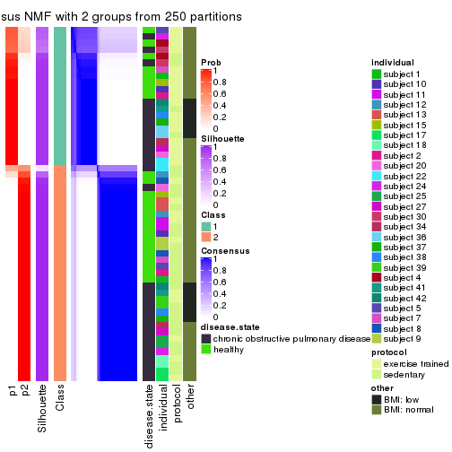</p>

</div>
<div id='tab-ATC-NMF-consensus-heatmap-2'>
<pre><code class="r">consensus_heatmap(res, k = 3)
</code></pre>

<p>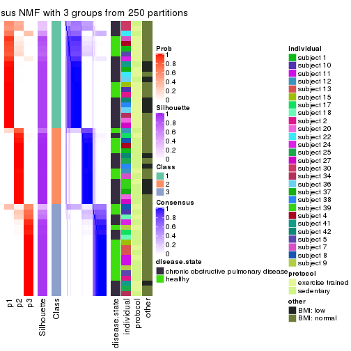</p>

</div>
<div id='tab-ATC-NMF-consensus-heatmap-3'>
<pre><code class="r">consensus_heatmap(res, k = 4)
</code></pre>

<p>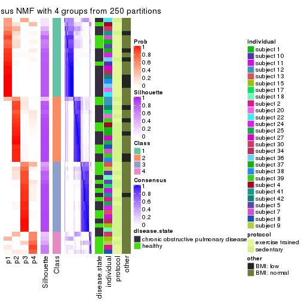</p>

</div>
<div id='tab-ATC-NMF-consensus-heatmap-4'>
<pre><code class="r">consensus_heatmap(res, k = 5)
</code></pre>

<p>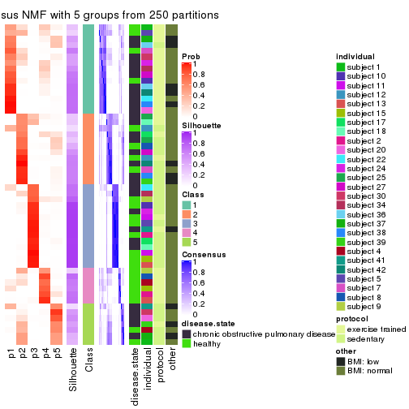</p>

</div>
<div id='tab-ATC-NMF-consensus-heatmap-5'>
<pre><code class="r">consensus_heatmap(res, k = 6)
</code></pre>

<p>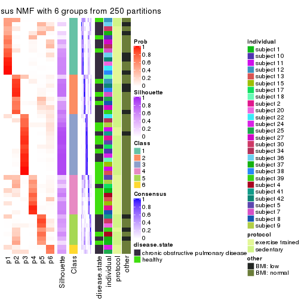</p>

</div>
</div>

Heatmaps for the membership of samples in all partitions to see how consistent they are:


<script>
$( function() {
	$( '#tabs-ATC-NMF-membership-heatmap' ).tabs();
} );
</script>
<div id='tabs-ATC-NMF-membership-heatmap'>
<ul>
<li><a href='#tab-ATC-NMF-membership-heatmap-1'>k = 2</a></li>
<li><a href='#tab-ATC-NMF-membership-heatmap-2'>k = 3</a></li>
<li><a href='#tab-ATC-NMF-membership-heatmap-3'>k = 4</a></li>
<li><a href='#tab-ATC-NMF-membership-heatmap-4'>k = 5</a></li>
<li><a href='#tab-ATC-NMF-membership-heatmap-5'>k = 6</a></li>
</ul>
<div id='tab-ATC-NMF-membership-heatmap-1'>
<pre><code class="r">membership_heatmap(res, k = 2)
</code></pre>

<p>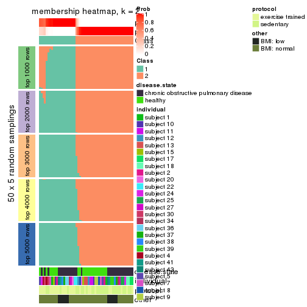</p>

</div>
<div id='tab-ATC-NMF-membership-heatmap-2'>
<pre><code class="r">membership_heatmap(res, k = 3)
</code></pre>

<p>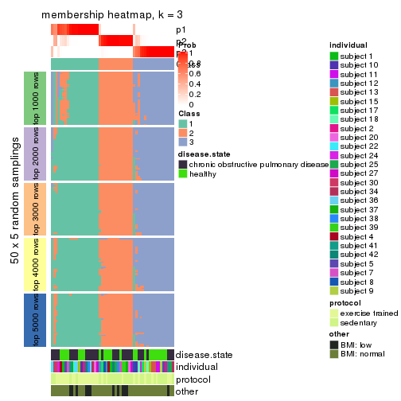</p>

</div>
<div id='tab-ATC-NMF-membership-heatmap-3'>
<pre><code class="r">membership_heatmap(res, k = 4)
</code></pre>

<p>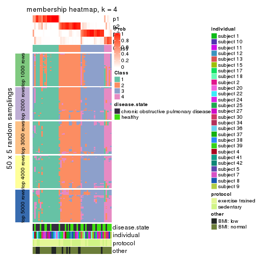</p>

</div>
<div id='tab-ATC-NMF-membership-heatmap-4'>
<pre><code class="r">membership_heatmap(res, k = 5)
</code></pre>

<p>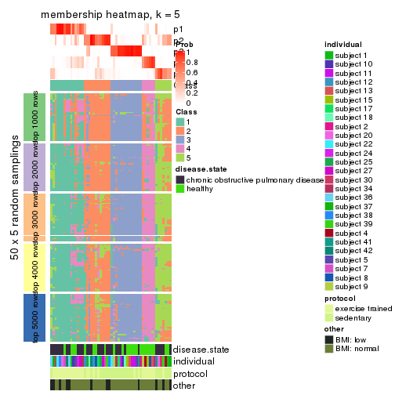</p>

</div>
<div id='tab-ATC-NMF-membership-heatmap-5'>
<pre><code class="r">membership_heatmap(res, k = 6)
</code></pre>

<p>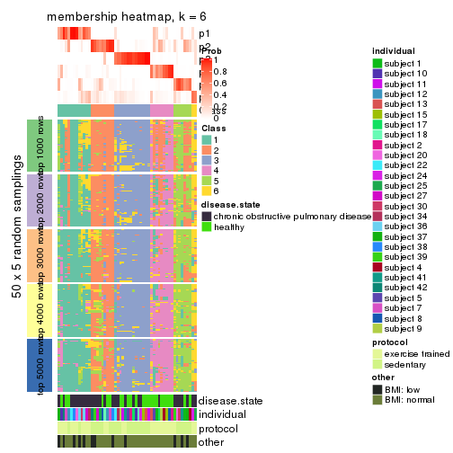</p>

</div>
</div>

As soon as we have had the classes for columns, we can look for signatures
which are significantly different between classes which can be candidate marks
for certain classes. Following are the heatmaps for signatures.


Signature heatmaps where rows are scaled:


<script>
$( function() {
	$( '#tabs-ATC-NMF-get-signatures' ).tabs();
} );
</script>
<div id='tabs-ATC-NMF-get-signatures'>
<ul>
<li><a href='#tab-ATC-NMF-get-signatures-1'>k = 2</a></li>
<li><a href='#tab-ATC-NMF-get-signatures-2'>k = 3</a></li>
<li><a href='#tab-ATC-NMF-get-signatures-3'>k = 4</a></li>
<li><a href='#tab-ATC-NMF-get-signatures-4'>k = 5</a></li>
<li><a href='#tab-ATC-NMF-get-signatures-5'>k = 6</a></li>
</ul>
<div id='tab-ATC-NMF-get-signatures-1'>
<pre><code class="r">get_signatures(res, k = 2)
</code></pre>

<pre><code>#&gt; Error in mat[ceiling(1:nr/h_ratio), ceiling(1:nc/w_ratio), drop = FALSE]: subscript out of bounds
</code></pre>

<p>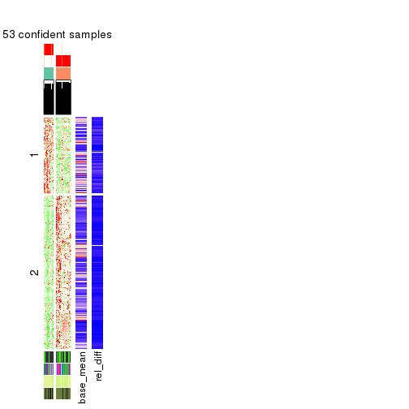</p>

</div>
<div id='tab-ATC-NMF-get-signatures-2'>
<pre><code class="r">get_signatures(res, k = 3)
</code></pre>

<p>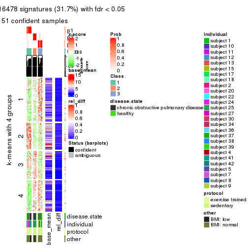</p>

</div>
<div id='tab-ATC-NMF-get-signatures-3'>
<pre><code class="r">get_signatures(res, k = 4)
</code></pre>

<pre><code>#&gt; Error in mat[ceiling(1:nr/h_ratio), ceiling(1:nc/w_ratio), drop = FALSE]: subscript out of bounds
</code></pre>

<p></p>

</div>
<div id='tab-ATC-NMF-get-signatures-4'>
<pre><code class="r">get_signatures(res, k = 5)
</code></pre>

<pre><code>#&gt; Error in mat[ceiling(1:nr/h_ratio), ceiling(1:nc/w_ratio), drop = FALSE]: subscript out of bounds
</code></pre>

<p>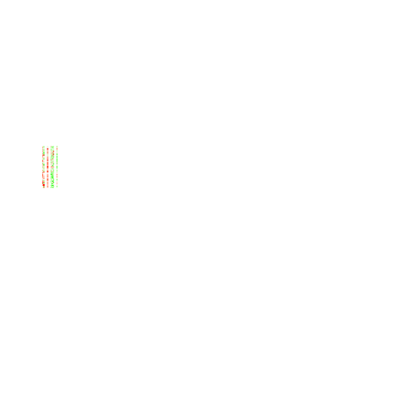</p>

</div>
<div id='tab-ATC-NMF-get-signatures-5'>
<pre><code class="r">get_signatures(res, k = 6)
</code></pre>

<pre><code>#&gt; Error in mat[ceiling(1:nr/h_ratio), ceiling(1:nc/w_ratio), drop = FALSE]: subscript out of bounds
</code></pre>

<p></p>

</div>
</div>


Signature heatmaps where rows are not scaled:


<script>
$( function() {
	$( '#tabs-ATC-NMF-get-signatures-no-scale' ).tabs();
} );
</script>
<div id='tabs-ATC-NMF-get-signatures-no-scale'>
<ul>
<li><a href='#tab-ATC-NMF-get-signatures-no-scale-1'>k = 2</a></li>
<li><a href='#tab-ATC-NMF-get-signatures-no-scale-2'>k = 3</a></li>
<li><a href='#tab-ATC-NMF-get-signatures-no-scale-3'>k = 4</a></li>
<li><a href='#tab-ATC-NMF-get-signatures-no-scale-4'>k = 5</a></li>
<li><a href='#tab-ATC-NMF-get-signatures-no-scale-5'>k = 6</a></li>
</ul>
<div id='tab-ATC-NMF-get-signatures-no-scale-1'>
<pre><code class="r">get_signatures(res, k = 2, scale_rows = FALSE)
</code></pre>

<p>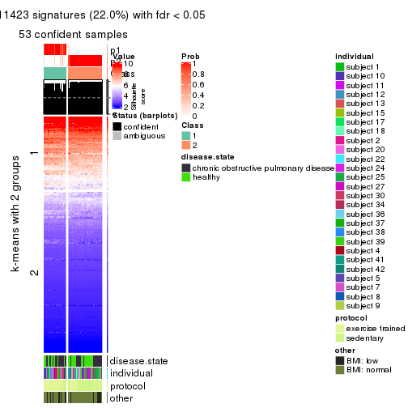</p>

</div>
<div id='tab-ATC-NMF-get-signatures-no-scale-2'>
<pre><code class="r">get_signatures(res, k = 3, scale_rows = FALSE)
</code></pre>

<p>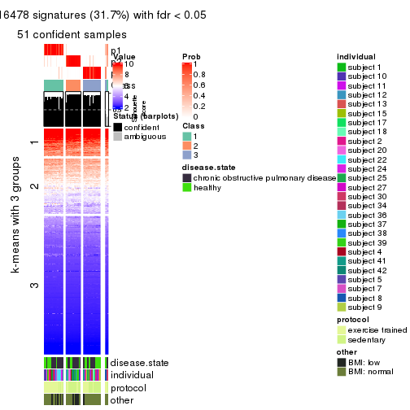</p>

</div>
<div id='tab-ATC-NMF-get-signatures-no-scale-3'>
<pre><code class="r">get_signatures(res, k = 4, scale_rows = FALSE)
</code></pre>

<p>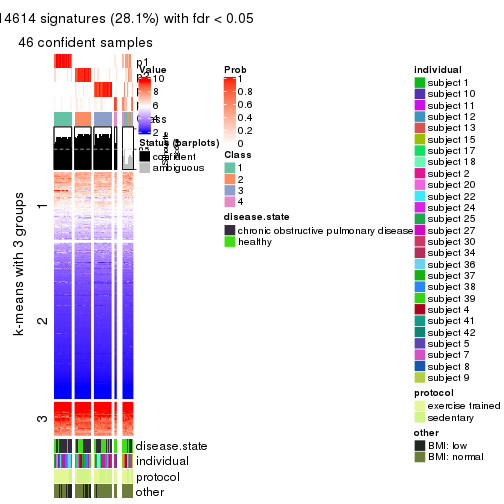</p>

</div>
<div id='tab-ATC-NMF-get-signatures-no-scale-4'>
<pre><code class="r">get_signatures(res, k = 5, scale_rows = FALSE)
</code></pre>

<p>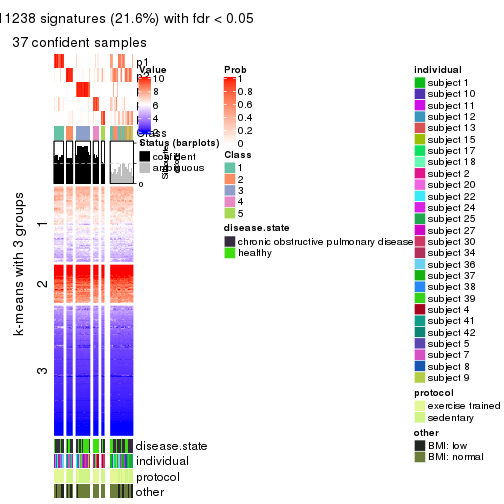</p>

</div>
<div id='tab-ATC-NMF-get-signatures-no-scale-5'>
<pre><code class="r">get_signatures(res, k = 6, scale_rows = FALSE)
</code></pre>

<p>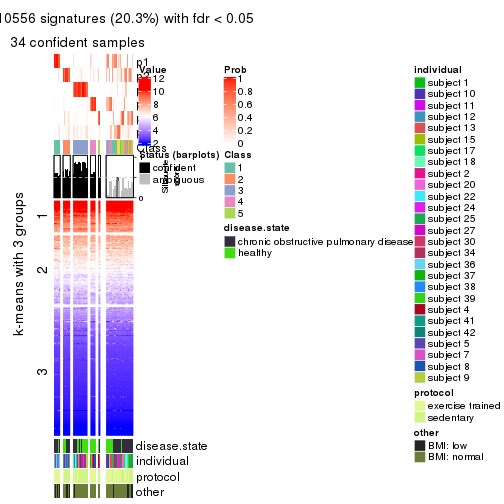</p>

</div>
</div>


Compare the overlap of signatures from different k:

```r
compare_signatures(res)
```

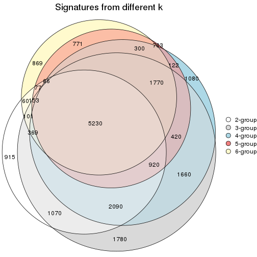

`get_signature()` returns a data frame invisibly. TO get the list of signatures, the function
call should be assigned to a variable explicitly. In following code, if `plot` argument is set
to `FALSE`, no heatmap is plotted while only the differential analysis is performed.

```r
# code only for demonstration
tb = get_signature(res, k = ..., plot = FALSE)
```

An example of the output of `tb` is:

```
#>   which_row         fdr    mean_1    mean_2 scaled_mean_1 scaled_mean_2 km
#> 1        38 0.042760348  8.373488  9.131774    -0.5533452     0.5164555  1
#> 2        40 0.018707592  7.106213  8.469186    -0.6173731     0.5762149  1
#> 3        55 0.019134737 10.221463 11.207825    -0.6159697     0.5749050  1
#> 4        59 0.006059896  5.921854  7.869574    -0.6899429     0.6439467  1
#> 5        60 0.018055526  8.928898 10.211722    -0.6204761     0.5791110  1
#> 6        98 0.009384629 15.714769 14.887706     0.6635654    -0.6193277  2
...
```

The columns in `tb` are:

1. `which_row`: row indices corresponding to the input matrix.
2. `fdr`: FDR for the differential test. 
3. `mean_x`: The mean value in group x.
4. `scaled_mean_x`: The mean value in group x after rows are scaled.
5. `km`: Row groups if k-means clustering is applied to rows.


UMAP plot which shows how samples are separated.


<script>
$( function() {
	$( '#tabs-ATC-NMF-dimension-reduction' ).tabs();
} );
</script>
<div id='tabs-ATC-NMF-dimension-reduction'>
<ul>
<li><a href='#tab-ATC-NMF-dimension-reduction-1'>k = 2</a></li>
<li><a href='#tab-ATC-NMF-dimension-reduction-2'>k = 3</a></li>
<li><a href='#tab-ATC-NMF-dimension-reduction-3'>k = 4</a></li>
<li><a href='#tab-ATC-NMF-dimension-reduction-4'>k = 5</a></li>
<li><a href='#tab-ATC-NMF-dimension-reduction-5'>k = 6</a></li>
</ul>
<div id='tab-ATC-NMF-dimension-reduction-1'>
<pre><code class="r">dimension_reduction(res, k = 2, method = &quot;UMAP&quot;)
</code></pre>

<p>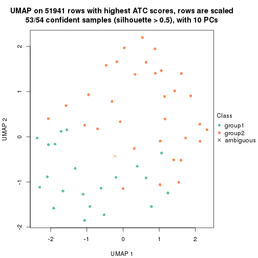</p>

</div>
<div id='tab-ATC-NMF-dimension-reduction-2'>
<pre><code class="r">dimension_reduction(res, k = 3, method = &quot;UMAP&quot;)
</code></pre>

<p>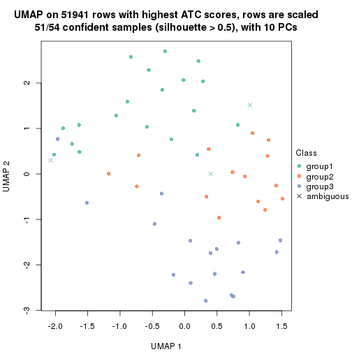</p>

</div>
<div id='tab-ATC-NMF-dimension-reduction-3'>
<pre><code class="r">dimension_reduction(res, k = 4, method = &quot;UMAP&quot;)
</code></pre>

<p>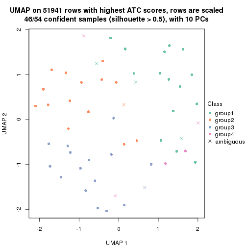</p>

</div>
<div id='tab-ATC-NMF-dimension-reduction-4'>
<pre><code class="r">dimension_reduction(res, k = 5, method = &quot;UMAP&quot;)
</code></pre>

<p>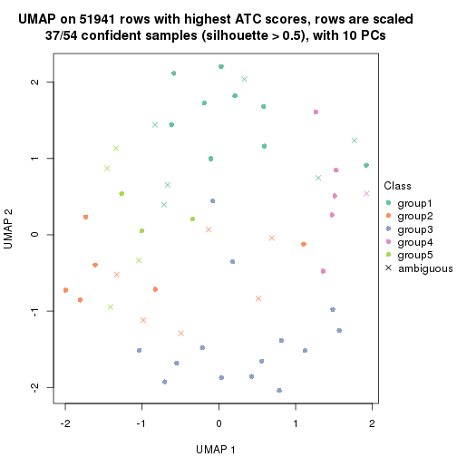</p>

</div>
<div id='tab-ATC-NMF-dimension-reduction-5'>
<pre><code class="r">dimension_reduction(res, k = 6, method = &quot;UMAP&quot;)
</code></pre>

<p>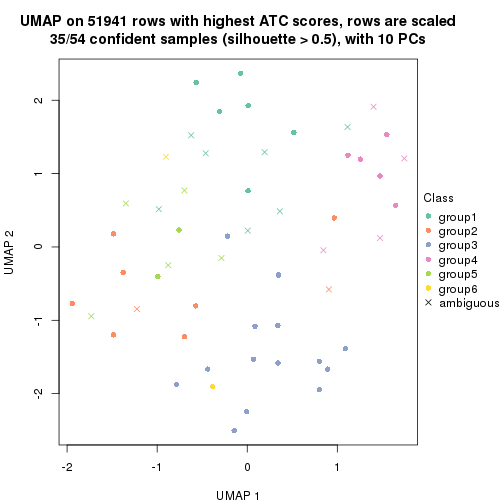</p>

</div>
</div>


Following heatmap shows how subgroups are split when increasing `k`:

```r
collect_classes(res)
```

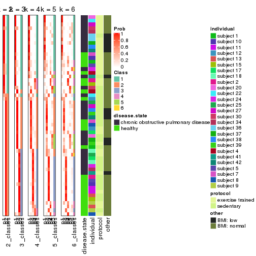


Test correlation between subgroups and known annotations. If the known
annotation is numeric, one-way ANOVA test is applied, and if the known
annotation is discrete, chi-squared contingency table test is applied.

```r
test_to_known_factors(res)
```

```
#>          n disease.state(p) individual(p) protocol(p) other(p) k
#> ATC:NMF 53            0.569         0.591    1.12e-03   0.6170 2
#> ATC:NMF 51            0.373         0.420    3.80e-04   0.1093 3
#> ATC:NMF 46            0.155         0.707    9.82e-04   0.1208 4
#> ATC:NMF 37            0.060         0.707    2.24e-05   0.0869 5
#> ATC:NMF 35            0.106         0.437    1.74e-04   0.1049 6
```


If matrix rows can be associated to genes, consider to use `functional_enrichment(res,
...)` to perform function enrichment for the signature genes. See [this vignette](http://bioconductor.org/packages/devel/bioc/vignettes/cola/inst/doc/functional_enrichment.html) for more detailed explanations.


 

## Session info


```r
sessionInfo()
```

```
#> R version 3.6.0 (2019-04-26)
#> Platform: x86_64-pc-linux-gnu (64-bit)
#> Running under: CentOS Linux 7 (Core)
#> 
#> Matrix products: default
#> BLAS:   /usr/lib64/libblas.so.3.4.2
#> LAPACK: /usr/lib64/liblapack.so.3.4.2
#> 
#> locale:
#>  [1] LC_CTYPE=en_GB.UTF-8       LC_NUMERIC=C               LC_TIME=en_GB.UTF-8       
#>  [4] LC_COLLATE=en_GB.UTF-8     LC_MONETARY=en_GB.UTF-8    LC_MESSAGES=en_GB.UTF-8   
#>  [7] LC_PAPER=en_GB.UTF-8       LC_NAME=C                  LC_ADDRESS=C              
#> [10] LC_TELEPHONE=C             LC_MEASUREMENT=en_GB.UTF-8 LC_IDENTIFICATION=C       
#> 
#> attached base packages:
#> [1] grid      stats     graphics  grDevices utils     datasets  methods   base     
#> 
#> other attached packages:
#> [1] genefilter_1.66.0    ComplexHeatmap_2.3.1 markdown_1.1         knitr_1.26          
#> [5] GetoptLong_0.1.7     cola_1.3.2          
#> 
#> loaded via a namespace (and not attached):
#>  [1] circlize_0.4.8       shape_1.4.4          xfun_0.11            slam_0.1-46         
#>  [5] lattice_0.20-38      splines_3.6.0        colorspace_1.4-1     vctrs_0.2.0         
#>  [9] stats4_3.6.0         blob_1.2.0           XML_3.98-1.20        survival_2.44-1.1   
#> [13] rlang_0.4.2          pillar_1.4.2         DBI_1.0.0            BiocGenerics_0.30.0 
#> [17] bit64_0.9-7          RColorBrewer_1.1-2   matrixStats_0.55.0   stringr_1.4.0       
#> [21] GlobalOptions_0.1.1  evaluate_0.14        memoise_1.1.0        Biobase_2.44.0      
#> [25] IRanges_2.18.3       parallel_3.6.0       AnnotationDbi_1.46.1 highr_0.8           
#> [29] Rcpp_1.0.3           xtable_1.8-4         backports_1.1.5      S4Vectors_0.22.1    
#> [33] annotate_1.62.0      skmeans_0.2-11       bit_1.1-14           microbenchmark_1.4-7
#> [37] brew_1.0-6           impute_1.58.0        rjson_0.2.20         png_0.1-7           
#> [41] digest_0.6.23        stringi_1.4.3        polyclip_1.10-0      clue_0.3-57         
#> [45] tools_3.6.0          bitops_1.0-6         magrittr_1.5         eulerr_6.0.0        
#> [49] RCurl_1.95-4.12      RSQLite_2.1.4        tibble_2.1.3         cluster_2.1.0       
#> [53] crayon_1.3.4         pkgconfig_2.0.3      zeallot_0.1.0        Matrix_1.2-17       
#> [57] xml2_1.2.2           httr_1.4.1           R6_2.4.1             mclust_5.4.5        
#> [61] compiler_3.6.0
```


